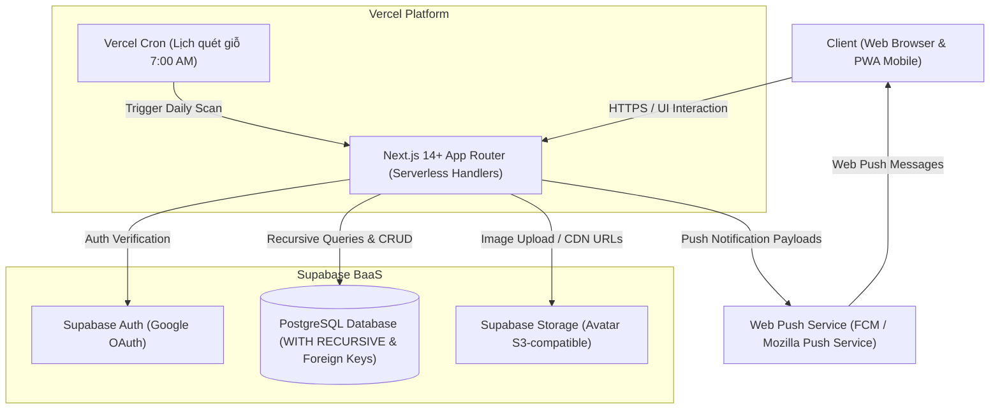

# BẢN VẼ KIẾN TRÚC TỔNG THỂ (THE BLUEPRINT)

_Dự án: FAT (Family Tree - Hệ Thống Quản Lý Gia Phả Dòng Họ)_

> **Lệnh dành cho AI / Trợ lý Lập trình:** Trong tài liệu này, tuyệt đối KHÔNG sinh ra mã nguồn (code). Mục tiêu là định hình tư duy hệ thống, phân tích luồng người dùng và xác định các mảnh ghép cốt lõi.

---

## 1. TỔNG QUAN DỰ ÁN (OVERVIEW)

- **Mục tiêu sản phẩm:** 
  Xây dựng nền tảng số hóa phả hệ dòng họ trực tuyến đa nền tảng (Web & PWA Mobile), giúp toàn bộ con cháu trong dòng họ tra cứu nguồn cội, hình dung trực quan cây gia phả nhiều thế hệ, phân định vai vế xưng hô chính xác theo phong tục văn hóa, và tự động nhắc nhở ngày giỗ theo âm lịch.
- **Đối tượng người dùng:**
  - *Cụ Trưởng Họ / Ban Trị Sự Dòng Họ (60 - 80 tuổi):* Mắt kém, ít am hiểu công nghệ, cần giao diện trực quan, rõ ràng thứ bậc Chi Trưởng - Chi Thứ, bảo vệ nghiêm ngặt tính đúng đắn của dữ liệu dòng họ.
  - *Thư Ký / Người Nhập Liệu Dòng Họ (25 - 45 tuổi):* Thạo công nghệ, phụ trách thu thập, chuẩn hóa và nhập liệu thông tin từ sổ sách cũ vào hệ thống.
  - *Con Cháu Dòng Họ / Thế Hệ Trẻ (16 - 35 tuổi):* Sinh sống hoặc làm việc xa quê, cần tra cứu vai vế xưng hô để tránh ngượng ngùng khi về họ dịp lễ Tết, và nhận thông báo giỗ ông bà tổ tiên trong nhánh mình.
- **Nền tảng mục tiêu:** 
  Web Application (Next.js 14+ App Router) tối ưu Responsive cho cả Desktop và Mobile, hỗ trợ cài đặt dạng **Progressive Web App (PWA)** và gửi **Web Push Notification**.

---

## 2. HÀNH TRÌNH NGƯỜI DÙNG (USER JOURNEYS)

### Luồng 1: Khám phá Cây Gia phả & Tra cứu Thông tin (Dành cho Khách / Con cháu)
Người dùng truy cập trang chủ $\rightarrow$ Hệ thống hiển thị Cây Phả Hệ từ Cụ Tổ (mặc định mở 3 đời đầu) $\rightarrow$ Người dùng gõ tên mình hoặc ông bà trên thanh tìm kiếm $\rightarrow$ Khung nhìn (viewport) tự động lướt mượt mà (pan/zoom) đến đúng vị trí Node thành viên $\rightarrow$ Click vào Node để xem thẻ chi tiết: Họ tên, Năm sinh - Năm mất, Tên Bố Mẹ, Vợ/Chồng và các Con.

### Luồng 2: Tra cứu Vai vế Xưng hô (Kinship Finder)
Người dùng mở công cụ "Tra cứu Vai vế" $\rightarrow$ Chọn Người thứ nhất (Người gọi, ví dụ: Tôi) $\rightarrow$ Chọn Người thứ hai (Người được gọi, ví dụ: Một bác ở Chi 2) $\rightarrow$ Bấm nút "Xác định vai vế" $\rightarrow$ Hệ thống hiển thị kết quả xưng hô 2 chiều (Tôi gọi người đó là gì / Người đó gọi tôi là gì) kèm sơ đồ phả hệ trực quan nối từ tôi ngược lên Cụ Tổ chung và hạ xuống người đó, kèm giải thích căn cứ chi Trưởng/Thứ.

### Luồng 3: Đăng nhập Google & Nhận Node Phả hệ (Claim Profile)
Người dùng bấm "Đăng nhập với Google" $\rightarrow$ Xác thực qua Google OAuth $\rightarrow$ Chọn tính năng "Nhận tôi trên cây phả hệ" $\rightarrow$ Tìm kiếm và chọn đúng Node của mình $\rightarrow$ Gửi yêu cầu kèm ghi chú xác nhận (ví dụ: SĐT hoặc tên bố mẹ) $\rightarrow$ Yêu cầu chuyển vào danh sách chờ duyệt của Quản trị viên $\rightarrow$ Quản trị viên duyệt (Approve) $\rightarrow$ Tài khoản chính thức liên kết với Node và kích hoạt quyền nhận thông báo ngày giỗ cá nhân hóa.

### Luồng 4: Quản trị viên Nhập liệu 3 Tầng (3-Tier Ingestion)
- **Tầng 1 (Bulk Import):** Quản trị viên tải file mẫu Excel $\rightarrow$ Điền danh sách hàng trăm thành viên kèm mã cha/mẹ/vợ/chồng $\rightarrow$ Upload file lên hệ thống $\rightarrow$ Hệ thống tự động kiểm tra lỗi logic (chu trình vòng kín, sai lệch năm sinh) $\rightarrow$ Xác nhận import $\rightarrow$ Dựng toàn bộ cây tự động trong vài giây.
- **Tầng 2 (Ủy quyền Trưởng Chi):** Super Admin tạo tài khoản Trưởng Chi $\rightarrow$ Gán quyền biên tập riêng cho nhánh con cháu của Chi đó $\rightarrow$ Trưởng Chi đăng nhập và quản lý nhánh của mình.
- **Tầng 3 (Nhập lẻ trực quan):** Quản trị viên di chuột tới Node bất kỳ $\rightarrow$ Bấm nút (+) $\rightarrow$ Chọn "Thêm Vợ/Chồng" hoặc "Thêm Con" $\rightarrow$ Mở Popup nhập liệu 1 cấp $\rightarrow$ Lưu thông tin $\rightarrow$ Cây phả hệ tự động cập nhật ngay lập tức.

### Luồng 5: Lịch Giỗ & Nhận Thông Báo Đẩy (Anniversaries & Push Notification)
Hằng ngày vào 7:00 sáng, Vercel Cron quét CSDL tìm các thành viên có ngày giỗ (tính theo Âm lịch đổi sang Dương lịch) trùng với ngày hiện tại $\rightarrow$ Hệ thống xác định danh sách con cháu thuộc nhánh trực hệ đã liên kết tài khoản $\rightarrow$ Bắn Web Push Notification đến điện thoại của con cháu: *"Hôm nay là ngày giỗ Cụ Nguyễn Văn X (Ông nội của bạn) - ngày 15 tháng 7 Âm lịch"* $\rightarrow$ Con cháu bấm vào thông báo để mở trang chi tiết tưởng nhớ.

---

## 3. CÁC TÍNH NĂNG CỐT LÕI (CORE FEATURES)

### 1. Interactive Family Tree Canvas (Đồ thị Cây Phả hệ Tương tác)
- Dựng cây đồ thị trực quan hỗ trợ Pan, Zoom, Reset view mượt mà trên cả chuột máy tính và cảm ứng di động.
- Cơ chế thu gọn / mở rộng (Collapse / Expand) từng nhánh để chống ngợp thị giác cho dòng họ lớn (> 1.000 người).
- Bộ lọc Nhánh Nội - Nhánh Ngoại (Toggle Switch): Ưu tiên hiển thị dòng chính nội tộc, cho phép bật xem đầy đủ cả con gái, dâu, rể và con của con gái.

### 2. Ghost Node 🔗 Engine (Giải pháp Hôn nhân Nội tộc)
- Xử lý hoàn hảo trường hợp người họ hàng xa trong cùng dòng họ kết hôn với nhau mà không bao giờ nhân bản bản ghi (Bảo toàn 1 ID duy nhất trong CSDL).
- Hiển thị Node phản chiếu (Ghost Node) với viền nét đứt và biểu tượng liên kết 🔗 tại vị trí vợ/chồng.
- Cung cấp nút chuyển nhanh camera nhảy về vị trí gốc thực tế của người đó trên cây.

### 3. Kinship Resolver Engine (Bộ Phân Giải Vai Vế & Xưng Hô)
- **Tầng Lõi Đồ thị (Graph Core):** Tìm cụ tổ chung gần nhất (LCA), tính toán độ lệch thế hệ $\Delta$, phân tích thứ tự sinh của các chi nhánh (Trưởng / Thứ).
- **Tầng Từ điển Cấu hình (Configurable Regional Dictionary):** Ánh xạ kết quả sang danh xưng theo chuẩn văn hóa Miền Bắc, Miền Trung, Miền Nam hoặc tùy biến cấu hình riêng của từng dòng họ (lưu JSON trong DB).
- Trả về danh xưng 2 chiều kèm chuỗi sơ đồ đường đi huyết thống trực quan.

### 4. Chiến lược Nhập liệu 3 Tầng (3-Tier Data Ingestion)
- Nhập hàng loạt qua file mẫu Excel/CSV với bộ kiểm tra tính toàn vẹn (Validation Guard) trước khi lưu.
- Cơ chế phân quyền phân cấp cho các Trưởng Chi tự quản lý nhánh con cháu mình.
- Form thêm mới/chỉnh sửa dạng Popup giới hạn 1 cấp, ngăn ngừa tình trạng lồng popup gây vỡ giao diện trên thiết bị di động.

### 5. Quản lý Ngày Giỗ & PWA Web Push Notification
- Lưu trữ ngày mất ưu tiên Lịch Âm (hoặc Lịch Dương), hỗ trợ trường hợp khuyết ngày chỉ có năm mất.
- Trang "Lịch Giỗ 30 Ngày" công khai cho mọi người truy cập xem danh sách ngày giỗ sắp tới, xếp theo thứ tự thời gian và thứ bậc dòng họ.
- Tự động quét và đẩy thông báo Web Push tới con cháu nhánh trực hệ thông qua Vercel Cron.

### 6. Bảo mật, Phân Quyền & Lá chắn Quyền riêng tư (Living Person Privacy Guard)
- Phân quyền 4 lớp: Khách (Viewer) $\rightarrow$ Thành viên đã xác minh (Claimed Member) $\rightarrow$ Quản trị Chi (Branch Editor) $\rightarrow$ Quản trị Tối cao (Super Admin).
- Tự động ẩn giấu các thông tin nhạy cảm (SĐT, địa chỉ, ngày sinh nhật) của người còn sống đối với người ngoài/khách vãng lai; chỉ mở khóa khi người dùng đã đăng nhập và được phê duyệt.

---

## 4. LUỒNG DỮ LIỆU & KIẾN TRÚC HỆ THỐNG (DATA FLOW & ARCHITECTURE)

### 4.1. Kiến trúc Đề xuất: Modular Monolith (Serverless Fullstack)
Hệ thống được thiết kế theo mô hình **Modular Monolith** triển khai trên hạ tầng Serverless để tối đa hóa hiệu năng, giảm thiểu chi phí vận hành về mức gần 0đ cho dòng họ, đồng thời dễ dàng bảo trì và mở rộng.

### 4.2. Luồng Dữ liệu Chính (Main Data Flows)

#### A. Luồng Dựng Cây Phả Hệ Đệ Quy
`User mở Cây` $\rightarrow$ `Frontend gửi request lấy cây theo root_id` $\rightarrow$ `Next.js Route Handler gọi câu lệnh PostgreSQL WITH RECURSIVE` $\rightarrow$ `Postgres quét toàn bộ node con cháu từ root_id theo quan hệ cha/mẹ/vợ/chồng` $\rightarrow$ `Backend chuẩn hóa cấu trúc Node & Edge kèm metadata Ghost Node` $\rightarrow$ `Frontend nhận JSON và render đồ thị phẳng qua React Flow`.

#### B. Luồng Xử lý Hôn Nhân Nội Tộc (Ghost Node Flow)
`Admin tạo quan hệ vợ chồng giữa A và B` $\rightarrow$ `Backend kiểm tra A và B đã tồn tại trong CSDL` $\rightarrow$ `Lưu quan hệ vào bảng spouses(member_a_id, member_b_id)` $\rightarrow$ `Khi dựng cây cho nhánh của A: Backend tạo Node chính cho A, và 1 Ghost Node cho B (đánh dấu is_ghost=true, trỏ reference_id=B)` $\rightarrow$ `Frontend render Ghost Node B viền nét đứt kèm icon 🔗, gán sự kiện click nhảy camera sang Node chính của B`.

#### C. Luồng Phân Giải Vai Vế (Kinship Flow)
`User chọn Person A và Person B` $\rightarrow$ `Frontend gửi request kèm ID_A, ID_B` $\rightarrow$ `Lõi Đồ thị truy vấn tổ tiên chung gần nhất (LCA) của A và B qua đệ quy SQL` $\rightarrow$ `Tính toán độ lệch thế hệ (Generation Gap) và thứ tự chi nhánh` $\rightarrow$ `Nạp cấu hình từ điển xưng hô của dòng họ (JSON từ clan_settings)` $\rightarrow$ `Ánh xạ ra danh xưng 2 chiều (A gọi B là gì / B gọi A là gì)` $\rightarrow$ `Trả về Frontend sơ đồ breadcrumbs huyết thống và kết luận xưng hô`.

#### D. Luồng Tự Động Quét Ngày Giỗ & Gửi Thông Báo
`Vercel Cron kích hoạt lúc 7:00 AM hằng ngày` $\rightarrow$ `Route Handler tính toán ngày Âm lịch hiện tại (UTC+7)` $\rightarrow$ `Query bảng members tìm những người có death_lunar_day và death_lunar_month trùng hôm nay` $\rightarrow$ `Với mỗi người mất: Dùng WITH RECURSIVE tìm toàn bộ con cháu trực hệ` $\rightarrow$ `Lọc danh sách con cháu đã liên kết tài khoản và đăng ký nhận push (push_subscriptions)` $\rightarrow$ `Gửi Web Push Notification qua VAPID Keys` $\rightarrow$ `Thiết bị di động của con cháu nhận thông báo nổi trên màn hình`.

### 4.3. Tích hợp Bên thứ ba (Third-party Integrations)
- **Supabase PostgreSQL:** Lưu trữ toàn bộ dữ liệu quan hệ gia phả, phân quyền, cấu hình xưng hô và subscription push.
- **Supabase Auth:** Xác thực một chạm với Google OAuth 2.0.
- **Supabase Storage:** Lưu trữ ảnh đại diện (Avatar) với dung lượng tối ưu dạng WebP, hỗ trợ CDN tốc độ cao.
- **Vercel Serverless & Cron:** Hosting toàn bộ hệ thống với chi phí 0đ và lịch quét ngầm định kỳ.
- **Web Push API (VAPID):** Gửi thông báo trực tiếp đến trình duyệt Chrome/Safari/Edge trên điện thoại và máy tính.

---

## 5. YÊU CẦU PHI CHỨC NĂNG (NON-FUNCTIONAL REQUIREMENTS)

- **Bảo mật (Security):**
  - Mọi thao tác ghi dữ liệu (Thêm, Sửa, Xóa) bắt buộc phải kiểm tra quyền hạn (Role-Based Access Control - RBAC) và bảo vệ bằng Row Level Security (RLS) của Supabase.
  - Áp dụng triệt để chính sách ẩn thông tin nhạy cảm của người còn sống cho người dùng chưa xác thực.
  - Bảo vệ API bằng Rate Limiting chống quét (scraping) thông tin dòng họ.
- **Hiệu năng (Performance):**
  - Thời gian tải trang ban đầu (First Contentful Paint) < 1.2s trên mạng di động 4G.
  - Truy vấn dựng cây 1.000 thành viên phản hồi trong dưới 200ms nhờ cơ chế Recursive CTE và Index B-Tree trên các cột `father_id`, `mother_id`.
  - Hiệu ứng Pan/Zoom đồ thị cây đạt tốc độ 60 FPS mượt mà nhờ kỹ thuật ảo hóa DOM (DOM virtualization) của thư viện đồ thị.
- **Khả năng Mở rộng (Scalability):**
  - Kiến trúc phi trạng thái (Stateless) cho phép hệ thống chịu tải đột biến vào các dịp giỗ tổ hoặc Tết Nguyên Đán khi lượng con cháu truy cập tăng cao.
- **Tính Tương thích & Khả năng Tiếp cận (Accessibility):**
  - Tương thích 100% trên các trình duyệt hiện đại: Chrome, Safari (iOS 16.4+), Edge, Firefox.
  - Hỗ trợ Dark Mode / Light Mode.
  - Thiết kế cỡ chữ, độ tương phản và kích thước nút bấm lớn phù hợp với người cao tuổi trong dòng họ.

---

## 6. TÍNH NĂNG MỞ RỘNG (NICE-TO-HAVE / PHASE 2)

Các tính năng giá trị cao đã được gác lại tại **Kho Ý Tưởng (`.agents/backlog/`)** để phát triển sau khi hoàn thành MVP:

1. **Chỉ đường Mộ phần Tổ tiên (GPS Mộ phần):** Lưu tọa độ GPS, hình ảnh bia mộ và liên kết Google Maps dẫn đường cho con cháu đi tảo mộ dịp Thanh Minh/Tết.
2. **Văn khấn Cúng giỗ Mẫu:** Thư viện bài văn khấn chuẩn phong tục cổ truyền Việt Nam, tự động điền danh tính người cúng và người được cúng theo ngày giỗ.
3. **Quản lý Quỹ Dòng họ & Bảng vàng Khuyến học:** Minh bạch thu chi đóng góp tu sửa nhà thờ họ, khuyến học khuyến tài cho các cháu học sinh giỏi trong họ.
