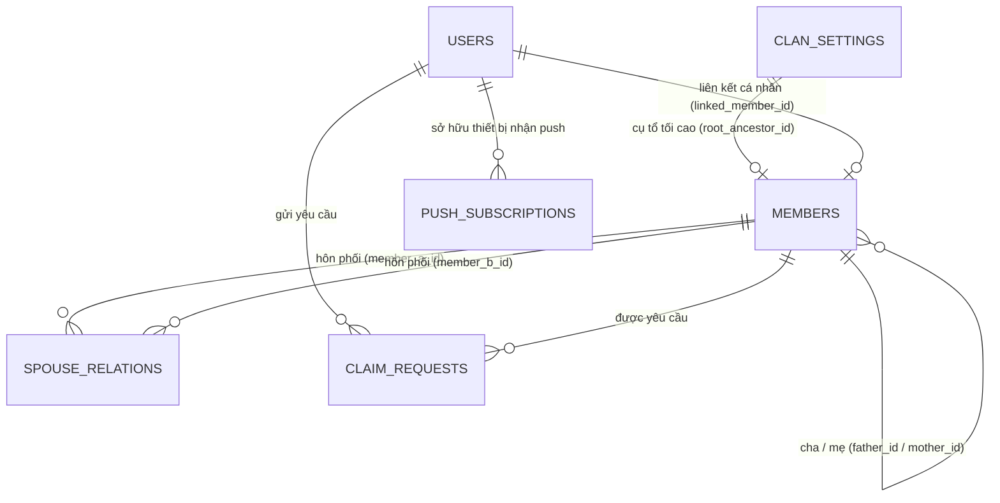

# LƯỢC ĐỒ CƠ SỞ DỮ LIỆU & QUY ƯỚC API (DB SCHEMA & API CONTRACT)

_Dự án: FAT (Family Tree - Hệ Thống Quản Lý Gia Phả Dòng Họ)_

> **LỆNH DÀNH CHO AI / CHUYÊN GIA DỮ LIỆU:**
> Dựa vào File Từ vựng (Glossary `docs/02_Project-Glossary.md`) và Kiến trúc (`docs/01_Architecture-Blueprint.md`), tài liệu này quy định CHI TIẾT cấu trúc Database và quy ước API.
> 1. **Tuyệt đối tuân thủ** tên gọi đã chốt ở Glossary.
> 2. **Sử dụng định dạng Bảng (Table):** BẮT BUỘC trình bày cấu trúc Database dưới dạng bảng Markdown.
> 3. **Độ sâu tối đa:** Liệt kê đầy đủ Kiểu dữ liệu, Ràng buộc (Bắt buộc/Duy nhất), Khóa chính/Khóa ngoại.
> 4. **Xác định Quan hệ:** Ghi rõ mối quan hệ giữa các bảng (1-1, 1-n, n-n) ở mục riêng.

---

## 1. DATABASE SCHEMA (LƯỢC ĐỒ DỮ LIỆU TỔNG THỂ)

### Bảng 1: `clan_settings` (Cấu hình Dòng họ Toàn cục & Master Data Chi Tộc)
Bảng đơn bản ghi (Singleton) quản lý tên dòng họ, từ điển xưng hô vùng miền và **Master Data danh sách các Chi Tộc** (loại bỏ bảng phụ độc lập để CSDL siêu tinh gọn).

| **Tên trường (Field)** | **Kiểu dữ liệu (Type)** | **Ràng buộc (Constraints)** | **Mô tả / Khóa ngoại (Ref)** |
|---|---|---|---|
| `id` | `UUID` | Primary Key, Auto-gen (`gen_random_uuid()`) | Mã định danh cấu hình |
| `clan_name` | `VARCHAR(255)` | Required | Tên chính thức của dòng họ (VD: "Dòng Họ Nguyễn Văn") |
| `root_ancestor_id` | `UUID` | Nullable | Khóa ngoại $\rightarrow$ `members(id)` (Cụ tổ tối cao của dòng họ) |
| `branches` | `JSONB` | Required, Default: `'[]'::jsonb` | Master Data danh sách Chi nhánh (Code, Tên, Cụ đầu chi `root_member_id`, Thứ tự) |
| `regional_preset` | `VARCHAR(20)` | Required, Default: `north`, Check (`north`, `central`, `south`, `custom`) | Bộ quy chuẩn xưng hô vùng miền |
| `custom_kinship_dictionary` | `JSONB` | Required, Default: `'{}'::jsonb` | Từ điển ghi đè xưng hô tùy biến của dòng họ |
| `anniversary_notify_days_before` | `INTEGER` | Required, Default: `1` | Thông báo trước ngày giỗ mấy ngày (1 = trước 1 ngày) |
| `allow_public_tree_view` | `BOOLEAN` | Required, Default: `true` | Cho phép khách xem cây công khai hay bắt buộc đăng nhập |
| `created_at` | `TIMESTAMPTZ` | Required, Default: `now()` | Thời điểm tạo |
| `updated_at` | `TIMESTAMPTZ` | Required, Default: `now()` | Thời điểm cập nhật cuối |

> **Cấu trúc JSON mẫu của trường `branches` (Master Data):**
> ```json
> [
>   {
>     "code": "chi_truong",
>     "name": "Chi Trưởng (Ngành Cả)",
>     "root_member_id": "uuid-cụ-A",
>     "is_senior": true,
>     "display_order": 1
>   },
>   {
>     "code": "chi_hai",
>     "name": "Chi Hai (Chi Cụ Tú)",
>     "root_member_id": "uuid-cụ-B",
>     "is_senior": false,
>     "display_order": 2
>   }
> ]
> ```
> *Cơ chế hoạt động:* Hệ thống dùng thuật toán đồ thị đệ quy: mọi con cháu của `root_member_id` tự động thuộc Chi tương ứng mà **không cần lưu lặp lại cột `branch_id` cho hàng nghìn con cháu**.

---

### Bảng 2: `members` (Thành viên Gia phả)
Thực thể trung tâm của cây phả hệ. Mỗi người thực tế chỉ có **DUY NHẤT 1 bản ghi** trong bảng này.
> **Trọng tâm Ngày mất:** Mục tiêu cốt lõi là lưu trữ **Ngày mất Âm lịch** (`death_lunar_day`, `death_lunar_month`, `death_lunar_year_name`) để phục vụ tính ngày giỗ hằng năm. Các trường Dương lịch đóng vai trò hỗ trợ quy đổi/nhập liệu. Không bắt buộc phải có năm mất.

| **Tên trường (Field)** | **Kiểu dữ liệu (Type)** | **Ràng buộc (Constraints)** | **Mô tả / Khóa ngoại (Ref)** |
|---|---|---|---|
| `id` | `UUID` | Primary Key, Auto-gen (`gen_random_uuid()`) | Mã định danh duy nhất của thành viên |
| `full_name` | `VARCHAR(255)` | Required | Họ và tên đầy đủ |
| `alias_name` | `VARCHAR(255)` | Nullable | Tên húy, tên tự, tên thường gọi |
| `gender` | `VARCHAR(10)` | Required, Check (`male`, `female`, `other`) | Giới tính |
| `life_status` | `VARCHAR(20)` | Required, Default: `living`, Check (`living`, `deceased`) | Trạng thái sống/đã mất |
| `father_id` | `UUID` | Nullable, Index | Khóa ngoại $\rightarrow$ `members(id)` (Bố ruột) |
| `mother_id` | `UUID` | Nullable, Index | Khóa ngoại $\rightarrow$ `members(id)` (Mẹ ruột) |
| `birth_date` | `DATE` | Nullable | Ngày sinh dương lịch (hỗ trợ nhập) |
| `birth_year` | `INTEGER` | Nullable | Năm sinh (khi không rõ ngày tháng) |
| `death_lunar_day` | `SMALLINT` | Nullable, Check (`1` $\rightarrow$ `30`) | **[Cốt lõi]** Ngày mất âm lịch (Căn cứ tính ngày giỗ) |
| `death_lunar_month` | `SMALLINT` | Nullable, Check (`1` $\rightarrow$ `12`) | **[Cốt lõi]** Tháng mất âm lịch (Căn cứ tính ngày giỗ) |
| `death_lunar_is_leap` | `BOOLEAN` | Required, Default: `false` | **[Cốt lõi]** Đánh dấu tháng mất là tháng nhuận âm |
| `death_lunar_year_name` | `VARCHAR(50)` | Nullable | **[Cốt lõi]** Năm mất Can Chi (VD: "Ất Mão", "Giáp Dần") |
| `death_date` | `DATE` | Nullable | Ngày mất dương lịch (Tùy chọn, hỗ trợ quy đổi) |
| `death_year` | `INTEGER` | Nullable | Năm mất dương lịch dạng số (VD: 1985) |
| `avatar_url` | `TEXT` | Nullable | Đường dẫn ảnh đại diện (Supabase Storage) |
| `phone` | `VARCHAR(20)` | Nullable | Số điện thoại (Bảo vệ bởi Privacy Guard) |
| `address` | `TEXT` | Nullable | Địa chỉ nơi ở (Bảo vệ bởi Privacy Guard) |
| `burial_location` | `TEXT` | Nullable | Vị trí nơi an táng / khu mộ |
| `burial_gps_lat` | `DOUBLE PRECISION` | Nullable | Tọa độ Vĩ độ GPS mộ phần |
| `burial_gps_lng` | `DOUBLE PRECISION` | Nullable | Tọa độ Kinh độ GPS mộ phần |
| `notes` | `TEXT` | Nullable | Ghi chú tiểu sử, công trạng, chức tước |
| `generation_level` | `INTEGER` | Nullable, Default: `1` | Đời thứ mấy trong dòng họ (Cụ tổ = 1) |
| `birth_order` | `INTEGER` | Nullable, Default: `1` | Thứ tự sinh trong nhà (1: con cả, 2: con thứ...) |
| `is_root` | `BOOLEAN` | Required, Default: `false` | Đánh dấu là Cụ tổ / Gốc của dòng họ |
| `is_adopted` | `BOOLEAN` | Required, Default: `false` | Đánh dấu con nuôi (phân biệt con đẻ / con nuôi) |
| `created_at` | `TIMESTAMPTZ` | Required, Default: `now()` | Thời điểm tạo |
| `updated_at` | `TIMESTAMPTZ` | Required, Default: `now()` | Thời điểm cập nhật cuối |

---

### Bảng 3: `spouse_relations` (Quan hệ Hôn phối / Vợ Chồng)
Lưu trữ các cặp vợ chồng trong dòng họ. Hỗ trợ trường hợp một người có nhiều vợ/chồng và hôn nhân nội tộc (Ghost Node).

| **Tên trường (Field)** | **Kiểu dữ liệu (Type)** | **Ràng buộc (Constraints)** | **Mô tả / Khóa ngoại (Ref)** |
|---|---|---|---|
| `id` | `UUID` | Primary Key, Auto-gen (`gen_random_uuid()`) | Mã định danh quan hệ hôn phối |
| `member_a_id` | `UUID` | Required, Index | Khóa ngoại $\rightarrow$ `members(id)` |
| `member_b_id` | `UUID` | Required, Index | Khóa ngoại $\rightarrow$ `members(id)` |
| `marriage_order` | `SMALLINT` | Required, Default: `1` | Thứ tự vợ/chồng (1: Vợ cả, 2: Vợ hai...) |
| `marriage_status` | `VARCHAR(20)` | Required, Default: `married`, Check (`married`, `divorced`, `widowed`) | Tình trạng hôn nhân |
| `notes` | `TEXT` | Nullable | Ghi chú về cuộc hôn phối |
| `created_at` | `TIMESTAMPTZ` | Required, Default: `now()` | Thời điểm tạo |
| `updated_at` | `TIMESTAMPTZ` | Required, Default: `now()` | Thời điểm cập nhật cuối |

> **Ràng buộc đặc thù (Table Constraints):**
> - `CHECK (member_a_id <> member_b_id)` (Không được tự kết hôn với chính mình).
> - `UNIQUE (member_a_id, member_b_id)` (Tránh tạo 2 lần cùng một cặp quan hệ).

---

### Bảng 4: `users` (Tài khoản Người dùng Hệ thống)
Đồng bộ từ `auth.users` của Supabase Auth sau khi đăng nhập Google OAuth.

| **Tên trường (Field)** | **Kiểu dữ liệu (Type)** | **Ràng buộc (Constraints)** | **Mô tả / Khóa ngoại (Ref)** |
|---|---|---|---|
| `id` | `UUID` | Primary Key | Trùng khớp với `auth.users(id)` của Supabase |
| `email` | `VARCHAR(255)` | Unique, Required | Email đăng nhập Google |
| `full_name` | `VARCHAR(255)` | Nullable | Tên hiển thị của tài khoản |
| `avatar_url` | `TEXT` | Nullable | Ảnh đại diện từ tài khoản Google |
| `user_role` | `VARCHAR(20)` | Required, Default: `viewer`, Check (`viewer`, `claimed_member`, `branch_editor`, `super_admin`) | Phân quyền vai trò |
| `linked_member_id` | `UUID` | Nullable, Unique | Khóa ngoại $\rightarrow$ `members(id)` (Node đã được duyệt) |
| `assigned_branch_code` | `VARCHAR(50)` | Nullable | Mã Chi được giao phụ trách (Khớp với `branches.code` trong `clan_settings`) |
| `created_at` | `TIMESTAMPTZ` | Required, Default: `now()` | Thời điểm tạo tài khoản |
| `updated_at` | `TIMESTAMPTZ` | Required, Default: `now()` | Thời điểm cập nhật cuối |

---

### Bảng 5: `claim_requests` (Yêu cầu Nhận Node Phả hệ)
Hàng đợi kiểm duyệt khi người dùng yêu cầu liên kết tài khoản của mình với một Member Node.

| **Tên trường (Field)** | **Kiểu dữ liệu (Type)** | **Ràng buộc (Constraints)** | **Mô tả / Khóa ngoại (Ref)** |
|---|---|---|---|
| `id` | `UUID` | Primary Key, Auto-gen (`gen_random_uuid()`) | Mã định danh yêu cầu |
| `user_id` | `UUID` | Required, Index | Khóa ngoại $\rightarrow$ `users(id)` |
| `member_id` | `UUID` | Required, Index | Khóa ngoại $\rightarrow$ `members(id)` |
| `claim_status` | `VARCHAR(20)` | Required, Default: `pending`, Check (`pending`, `approved`, `rejected`) | Trạng thái phê duyệt |
| `verification_notes` | `TEXT` | Nullable | Thông tin con cháu khai báo để xác minh |
| `reviewed_by` | `UUID` | Nullable | Khóa ngoại $\rightarrow$ `users(id)` (Admin phê duyệt) |
| `rejection_reason` | `TEXT` | Nullable | Lý do từ chối nếu không duyệt |
| `created_at` | `TIMESTAMPTZ` | Required, Default: `now()` | Thời điểm gửi yêu cầu |
| `updated_at` | `TIMESTAMPTZ` | Required, Default: `now()` | Thời điểm xử lý xong |

---

### Bảng 6: `push_subscriptions` (Đăng ký Nhận Web Push)
Lưu thông tin đăng ký thiết bị nhận thông báo đẩy Web Push Notification theo chuẩn VAPID.

| **Tên trường (Field)** | **Kiểu dữ liệu (Type)** | **Ràng buộc (Constraints)** | **Mô tả / Khóa ngoại (Ref)** |
|---|---|---|---|
| `id` | `UUID` | Primary Key, Auto-gen (`gen_random_uuid()`) | Mã định danh bản ghi subscription |
| `user_id` | `UUID` | Required, Index | Khóa ngoại $\rightarrow$ `users(id)` |
| `endpoint` | `TEXT` | Unique, Required | URL endpoint của Push Service (FCM/Apple/Mozilla) |
| `p256dh_key` | `TEXT` | Required | Khóa công khai mã hóa ECDH |
| `auth_key` | `TEXT` | Required | Khóa xác thực authentication secret |
| `user_agent` | `TEXT` | Nullable | Thông tin trình duyệt và hệ điều hành |
| `created_at` | `TIMESTAMPTZ` | Required, Default: `now()` | Thời điểm đăng ký |
| `updated_at` | `TIMESTAMPTZ` | Required, Default: `now()` | Thời điểm cập nhật cuối |

---

## 2. QUAN HỆ CƠ SỞ DỮ LIỆU (ENTITY RELATIONSHIPS)



- **`members` - `members` (Tự tham chiếu Đồ thị 1-N):** Một thành viên có thể là `father_id` hoặc `mother_id` của nhiều con cái. Ràng buộc `ON DELETE SET NULL` ngăn việc xóa cha/mẹ làm mất bản ghi con cái.
- **`members` - `spouse_relations` (N-N):** Hai thành viên liên kết hôn phối qua bảng `spouse_relations` (`member_a_id` và `member_b_id`). Hỗ trợ Ghost Node khi kết hôn nội tộc.
- **`users` - `members` (1-1 tùy chọn):** Một tài khoản `User` sau khi được Admin phê duyệt `ClaimRequest` sẽ trỏ tới 1 `linked_member_id` duy nhất.
- **`clan_settings.branches` (JSONB) $\rightarrow$ `members`:** Mỗi nhánh chi tộc có `root_member_id` trỏ vào 1 thành viên khởi lập chi; toàn bộ con cháu của cụ đó thuộc về chi này qua tính toán đồ thị.

---

## 3. API RESPONSE CONTRACT (CHUẨN TRẢ VỀ API)

Tất cả các Next.js Route Handlers (`/api/*`) BẮT BUỘC trả về dữ liệu tuân thủ định dạng chuẩn sau:

### Khi Thành công (HTTP 200 / 201):
```json
{
  "success": true,
  "code": 200,
  "data": { ... },
  "message": "Thao tác thành công"
}
```

### Khi Thất bại (HTTP 4xx / 5xx):
```json
{
  "success": false,
  "code": 400,
  "errorType": "VALIDATION_ERROR",
  "message": "Dữ liệu nhập không hợp lệ: Ngày mất âm lịch phải từ ngày 1 đến 30."
}
```

### Bảng Mã Lỗi Chuẩn (`errorType`):
| **Mã lỗi (`errorType`)** | **HTTP Code** | **Ý nghĩa** |
|---|---|---|
| `UNAUTHORIZED` | `401` | Chưa đăng nhập hoặc Token Google hết hạn |
| `FORBIDDEN` | `403` | Không đủ thẩm quyền thực hiện thao tác (VD: Viewer cố sửa data) |
| `NOT_FOUND` | `404` | Không tìm thấy Thành viên / Yêu cầu / Chi nhánh |
| `VALIDATION_ERROR` | `400` | Dữ liệu gửi lên sai định dạng hoặc vi phạm ràng buộc miền giá trị |
| `CYCLE_DETECTED` | `400` | Phát hiện vòng tròn phả hệ bất hợp lệ (con làm bố của cha) |
| `ALREADY_CLAIMED` | `409` | Node thành viên này đã có người khác liên kết tài khoản |
| `INTERNAL_ERROR` | `500` | Lỗi máy chủ hoặc kết nối CSDL Supabase thất bại |

---

## 4. GLOBAL STATE CONTRACT (FRONTEND STORE)

Quản lý trạng thái bằng **Zustand** trên Next.js Client Components:

### Store Toàn cục (Global Store):
- **`useAuthStore`:** Lưu trữ thông tin tài khoản đang đăng nhập (`currentUserId`, `userRole`, `linkedMemberId`).
- **`useTreeConfigStore`:** 
  - `activeRootMemberId`: ID của node đang được chọn làm gốc hiển thị.
  - `showMaternalBranches`: Boolean bật/tắt hiển thị nhánh ngoại (con gái, dâu, rể).
  - `selectedBranchCode`: Lọc hiển thị theo mã Chi (từ `clan_settings.branches`).
  - `zoomLevel`: Tỷ lệ phóng to/thu nhỏ hiện tại của cây.
- **`useClanSettingsStore`:** Lưu tên dòng họ, Master Data Chi Tộc (`branches`), bộ từ điển xưng hô vùng miền để phân định vai vế tức thì phía Client mà không cần gọi API liên tục.

### State Cục bộ (Component Local State):
- Form thêm mới thành viên: Trạng thái đóng/mở Modal Form, tab nhập Âm lịch / Dương lịch, dữ liệu đang nhập dở.
- Thanh tìm kiếm: Từ khóa đang gõ, danh sách gợi ý tìm kiếm tức thì.
