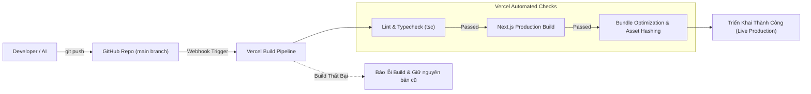

# TRIỂN KHAI & MÔI TRƯỜNG (DEPLOYMENT & ENVIRONMENTS)

_Dự án: FAT (Family Tree - Hệ Thống Quản Lý Gia Phả Dòng Họ)_

> **Lệnh dành cho AI (Tech Lead/DevOps):** Dựa trên `docs/05_Technical-Blueprint.md` (Tech Stack, biến môi trường) và `docs/06_Security-Threat-Model.md` (Bảo mật, Secrets), tài liệu này quy định chi tiết cách dựng môi trường, quy trình CI/CD và vận hành trên Vercel và Supabase. Phần "Scripts cài đặt môi trường" là **Human Action** để Kỹ sư thực hiện.

---

## 1. CÁC MÔI TRƯỜNG (ENVIRONMENTS)

| **Môi trường** | **Mục đích** | **URL / Hạ tầng** | **Nguồn dữ liệu / Dịch vụ** |
|---|---|---|---|
| **Development** | Lập trình và kiểm thử chức năng ở máy Local | `http://localhost:3000` | Supabase Cloud (Project Dev) hoặc Supabase Local Docker |
| **Staging / Preview** | Kiểm thử tự động trên từng nhánh Pull Request | `https://fat-preview-*.vercel.app` | Supabase Cloud (Project Staging) |
| **Production** | Người dùng thật (Toàn thể con cháu trong dòng họ) | `https://giapha-fat.vercel.app` (hoặc Custom Domain riêng) | Supabase Cloud (Project Production, Backup tự động hằng ngày) |

---

## 2. QUẢN LÝ CẤU HÌNH & SECRETS

### 2.1. Danh Mục Biến Môi Trường (Environment Variables):

| **Tên Biến** | **Phạm vi** | **Bắt buộc** | **Mô tả & Mục đích** |
|---|---|:---:|---|
| `NEXT_PUBLIC_SUPABASE_URL` | Public (Client & Server) | Có | URL kết nối API của Supabase Project (`https://xyz.supabase.co`) |
| `NEXT_PUBLIC_SUPABASE_ANON_KEY` | Public (Client & Server) | Có | Khóa công khai ẩn danh của Supabase, an toàn khi lộ ở Frontend |
| `SUPABASE_SERVICE_ROLE_KEY` | **Secret (Chỉ Server-side)** | Có | Khóa toàn quyền Admin CSDL (dùng trong Vercel Cron & API Admin) |
| `CRON_SECRET` | **Secret (Chỉ Server-side)** | Có | Chuỗi token ngẫu nhiên bảo vệ endpoint quét ngày giỗ `/api/cron/anniversary` |
| `NEXT_PUBLIC_VAPID_PUBLIC_KEY` | Public (Client & Server) | Có | Khóa công khai VAPID dùng đăng ký nhận Web Push trên trình duyệt |
| `VAPID_PRIVATE_KEY` | **Secret (Chỉ Server-side)** | Có | Khóa bí mật VAPID dùng để ký gửi gói tin Push Notification |
| `VAPID_SUBJECT` | Secret (Server-side) | Có | Email liên hệ quản trị theo chuẩn Web Push (VD: `mailto:admin@dongho.vn`) |
| `NEXT_PUBLIC_APP_URL` | Public | Có | URL gốc của trang web (VD: `https://giapha-fat.vercel.app`) |

### 2.2. Quy Tắc Bảo Mật Secret:
- **Tuyệt đối KHÔNG commit `.env` hoặc `.env.local` vào GitHub.** 
- Cung cấp file mẫu [`.env.example`](file:///d:/pj/other/fat/.env.example) trong mã nguồn để hướng dẫn cấu hình.
- Trên môi trường Vercel: Toàn bộ biến trên được nhập trực tiếp tại mục **Project Settings $\rightarrow$ Environment Variables**.

---

## 3. QUY TRÌNH CI/CD (TỰ ĐỘNG HÓA TỪ GITHUB ĐẾN VERCEL)



- **Quy trình Deploy Tự động (Continuous Deployment):** Mỗi khi code được merge vào nhánh `main`, Vercel sẽ tự động kéo code, kiểm tra typecheck TypeScript, build gói tối ưu và phát hành toàn cầu trong vòng 60 giây.
- **Cơ chế Rollback Tức thì (Instant Rollback):** Nếu phiên bản mới có sự cố, Admin có thể vào Vercel Dashboard bấm **"Rollback"** về bản build trước đó trong đúng 1 giây mà không cần deploy lại.

---

## 4. HOSTING & VẬN HÀNH VERCEL CRON

### 4.1. Cấu hình Lịch Quét Giỗ Ngầm (`vercel.json`):
Hệ thống sử dụng **Vercel Cron** để đánh thức Serverless Function vào đúng **7:00 sáng giờ Việt Nam** hằng ngày để quét ngày giỗ Âm lịch:

```json
{
  "crons": [
    {
      "path": "/api/cron/anniversary",
      "schedule": "0 0 * * *"
    }
  ]
}
```
> **Giải thích múi giờ:** `0 0 * * *` là 00:00 giờ UTC, tương đương đúng **07:00 AM giờ Việt Nam (UTC+7)** mỗi sáng.

### 4.2. Tên miền riêng (Custom Domain) & Chứng chỉ HTTPS:
- Vercel tự động cấp phát chứng chỉ bảo mật SSL/TLS miễn phí (HTTPS 100%).
- Dòng họ có thể gắn tên miền riêng (VD: `giaphanguyenvan.vn`) bằng cách trỏ bản ghi CNAME hoặc A record về Vercel theo hướng dẫn trên dashboard.

### 4.3. Chiến lược Sao lưu Dữ liệu (Backup & Recovery):
- CSDL Supabase PostgreSQL tự động thực hiện **Daily Backup** lưu trữ trong 7 ngày liên tiếp.
- Dữ liệu phả hệ được bảo vệ tại cụm máy chủ Singapore (khu vực gần Việt Nam nhất, độ trễ < 30ms).

---

## 5. HƯỚNG DẪN CÀI ĐẶT MÔI TRƯỜNG (HUMAN ACTION GUIDE)

Dưới đây là các bước cụ thể để thiết lập hệ thống từ đầu:

### Bước 1: Khởi tạo CSDL trên Supabase (5 phút)
1. Truy cập [supabase.com](https://supabase.com), đăng ký tài khoản miễn phí và bấm **"New Project"**.
2. Đặt tên Project (VD: `FAT-FamilyTree`), chọn vùng máy chủ: **Singapore (ap-southeast-1)**.
3. Vào mục **SQL Editor**, mở file [`supabase/migrations/20260903000000_init_schema.sql`](file:///d:/pj/other/fat/supabase/migrations/20260903000000_init_schema.sql), dán toàn bộ vào và bấm **Run** để khởi tạo 6 bảng và các index.
4. Vào mục **Storage**, bấm **"New Bucket"**, đặt tên `avatars`, bật chế độ **Public Bucket**.
5. Vào **Project Settings $\rightarrow$ API**, sao chép `Project URL`, `anon public key`, và `service_role secret key`.

### Bước 2: Cấu hình Đăng nhập Google (Google OAuth)
1. Vào [Google Cloud Console](https://console.cloud.google.com), tạo OAuth 2.0 Client ID.
2. Thêm Authorized Redirect URI từ Supabase (dạng: `https://<project-id>.supabase.co/auth/v1/callback`).
3. Dán `Client ID` và `Client Secret` vào mục **Supabase Dashboard $\rightarrow$ Authentication $\rightarrow$ Providers $\rightarrow$ Google**.

### Bước 3: Tạo Khóa Web Push (VAPID Keys)
Chạy lệnh sau trong terminal để sinh cặp khóa push:
```bash
npx web-push generate-vapid-keys
```
Kết quả sẽ xuất ra `Public Key` và `Private Key` để điền vào biến môi trường.

### Bước 4: Triển khai lên Vercel (3 phút)
1. Đẩy mã nguồn dự án lên GitHub.
2. Truy cập [vercel.com](https://vercel.com), bấm **"Add New" $\rightarrow$ "Project"**, chọn repo GitHub vừa đẩy.
3. Trong mục **Environment Variables**, điền đầy đủ 8 biến môi trường theo bảng ở Mục 2.1.
4. Bấm **Deploy**. Sau 1 phút, trang web gia phả của dòng họ sẽ chính thức hoạt động trực tuyến!
