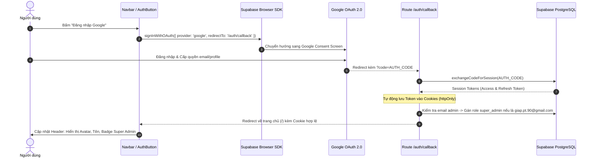

# ĐẶC TẢ KỸ THUẬT: MILESTONE 1 - NỀN TẢNG DỰ ÁN NEXT.JS 14, CSDL SUPABASE & ĐĂNG NHẬP GOOGLE AUTH

_Tài liệu này dùng để giới hạn Context Window. AI chỉ được phép đọc, suy luận và sinh code cho ĐÚNG các file được đề cập trong đây._

---

## 1. QUY TẮC NGHIÊM NGẶT (STRICT CONSTRAINTS)

- **Framework & Runtime:** Next.js 14+ (App Router), React 18+, TypeScript (Strict Mode enabled).
- **Thư viện xác thực & CSDL:** Chỉ sử dụng `@supabase/supabase-js` và `@supabase/ssr`. Tuyệt đối không dùng NextAuth hay Auth0.
- **Styling:** TailwindCSS, Lucide Icons (`lucide-react`). Cấm Tailwind CDN, bắt buộc qua PostCSS compiler.
- **Session Security:** Toàn bộ session lưu trữ trong Cookie chuẩn `httpOnly`, `Secure`, `SameSite=Lax`. Cấm lưu Access Token thô trong `localStorage`.
- **Ngôn ngữ Code:** Tên biến, types, interfaces, hàm viết bằng Tiếng Anh. Comment chú thích bằng Tiếng Việt.

---

## 2. DATABASE & MODELS

Tương tác trực tiếp với các bảng CSDL đã định nghĩa trong `supabase/migrations/20260903000000_init_schema.sql`:

- **File Types ánh xạ:** `src/types/database.ts`
- **Bảng `public.users`:**
  - `id`: `UUID` (Primary key, liên kết `auth.users.id`).
  - `email`: `VARCHAR(255)` (Email Google).
  - `full_name`: `VARCHAR(255)` (Họ tên hiển thị).
  - `avatar_url`: `TEXT` (Ảnh đại diện Google).
  - `user_role`: `VARCHAR(20)` (`viewer` | `claimed_member` | `branch_editor` | `super_admin`).
  - `linked_member_id`: `UUID` (Tham chiếu `members.id`, mặc định `null`).
  - `assigned_branch_code`: `VARCHAR(50)` (Mã chi phụ trách, mặc định `null`).
- **Bảng `public.clan_settings`:**
  - `clan_name`: `VARCHAR(255)` (Tên dòng họ hiển thị trên Header).
  - `branches`: `JSONB` (Danh mục chi nhánh).

---

## 3. SƠ ĐỒ LUỒNG LOGIC (SEQUENCE DIAGRAM - MERMAID)

---

## 4. BACKEND LOGIC / API & MIDDLEWARE

### 4.1. Bộ Ba Supabase Clients (`src/lib/supabase/`)
- **`client.ts`:** Khởi tạo `createBrowserClient` dành cho Client Components (`'use client'`).
- **`server.ts`:** Khởi tạo `createServerClient` với cơ chế đọc/ghi cookies qua `cookies()` của `next/headers` dành cho Server Components và Route Handlers.
- **`middleware.ts`:** Hàm `updateSession(request)` kiểm tra và làm mới token phiên làm việc mỗi khi có HTTP request gửi đến Next.js server.

### 4.2. Next.js Middleware (`src/middleware.ts`)
- Bắt mọi request (ngoại trừ static assets `_next`, `favicon.ico`, `images`).
- Gọi `updateSession(request)` để giữ session người dùng luôn tươi mới (Refresh Token rotation).

### 4.3. Route Handler OAuth Callback (`src/app/auth/callback/route.ts`)
- **Phương thức:** `GET`
- **Input query:** `?code=string` hoặc `?error=string`
- **Luồng xử lý:**
  1. Nếu có `error` $\rightarrow$ Redirect về `/?auth_error=cancelled`.
  2. Nếu có `code` $\rightarrow$ Khởi tạo Supabase Server Client $\rightarrow$ Gọi `supabase.auth.exchangeCodeForSession(code)`.
  3. Lấy thông tin user hiện tại (`supabase.auth.getUser()`).
  4. Nếu email là `giap.pt.90@gmail.com` $\rightarrow$ Cập nhật `user_role = 'super_admin'` trong bảng `public.users`.
  5. Redirect về `origin` (Trang chủ `/`).

---

## 5. FRONTEND UI & LOGIC

### 5.1. Layout Gốc (`src/app/layout.tsx`)
- Tích hợp phông chữ `Be Vietnam Pro` hoặc `Inter`.
- Bọc toàn bộ ứng dụng trong container chuẩn Responsive, hỗ trợ chế độ màu tối/sáng hài hòa.
- Chèn `Navbar` vào phần đầu trang.

### 5.2. Thanh Điều Hướng Header (`src/components/navbar/Navbar.tsx`)
- Logo thương hiệu dòng họ: Tên họ lấy từ CSDL (hoặc mặc định: *"GIA PHẢ DÒNG HỌ NGUYỄN VĂN"*).
- Badge trạng thái kết nối CSDL (Đang kết nối / Đã kết nối).
- Menu điều hướng cơ bản: [Cây Phả Hệ], [Lịch Giỗ], [Tra Cứu Vai Vế].
- Vị trí góc phải: Component `AuthButton`.

### 5.3. Nút Xác Thực (`src/components/auth/AuthButton.tsx`)
- **Trạng thái chưa đăng nhập:** Hiển thị nút bấm sang trọng `[Đăng nhập Google]`.
- **Trạng thái đang tải (Loading):** Skeleton mờ hoặc spinner nhỏ xoay nhẹ.
- **Trạng thái đã đăng nhập:**
  - Hiển thị Avatar tròn từ Google, Tên người dùng.
  - Badge quyền hạn: `[👑 Super Admin]` (màu vàng kim) hoặc `[👁️ Khách xem]` (màu xám xanh).
  - Dropdown Menu khi bấm vào Avatar:
    - Hiển thị email đầy đủ.
    - Nút `[Đăng xuất]` $\rightarrow$ Gọi `supabase.auth.signOut()` $\rightarrow$ Reload trang về trạng thái Guest.

---

## 6. XỬ LÝ LỖI & NGOẠI LỆ (ERROR HANDLING & EDGE CASES)

- **Edge Case 1 (Thiếu biến môi trường):** Nếu `.env.local` thiếu `NEXT_PUBLIC_SUPABASE_URL` hoặc `NEXT_PUBLIC_SUPABASE_ANON_KEY` $\rightarrow$ Hiển thị màn hình thông báo trang trọng yêu cầu cấu hình `.env.local`, không làm sập ứng dụng (Crash).
- **Edge Case 2 (Người dùng bấm Hủy đăng nhập ở Google):** Redirect về trang chủ an toàn kèm Toast thông báo: *"Đăng nhập chưa hoàn tất"*.
- **Edge Case 3 (Mạng chập chờn / Cookie hết hạn):** Middleware tự động refresh token trong nền mà không làm gián đoạn trải nghiệm người dùng.

---

## 7. MA TRẬN TEST CASES & TIÊU CHÍ NGHIỆM THU (TEST SPECIFICATION)

### 7.1. Bảng Kịch Bản Kiểm Thử Chi Tiết

| ID | Tên Kịch Bản | Loại Test | Tiền điều kiện (Given) | Thao tác kích hoạt (When) | Kết quả kỳ vọng (Then) | Phân loại |
|---|---|---|---|---|---|---|
| **TC01** | Khởi tạo Dự án & Build Sạch | Compile / Build | Mã nguồn Next.js 14 đầy đủ | Chạy `npm.cmd run build` và `npm.cmd run typecheck` | Build thành công 100%, 0 lỗi TypeScript, 0 lỗi ESLint | Happy Path |
| **TC02** | Kết nối CSDL Supabase Cloud | Integration | `.env.local` có URL và Anon Key thật | Chạy script kiểm tra truy vấn Supabase | Đọc thành công dữ liệu hoặc kết nối thành công tới Supabase | Happy Path |
| **TC03** | Khởi chạy Dev Server & Render Navbar | E2E / Browser | Chạy `npm.cmd run dev` | Truy cập `http://localhost:3000` | Trang chủ hiển thị thanh Header, Logo dòng họ và nút [Đăng nhập Google] | Happy Path |
| **TC04** | Kích hoạt luồng Google OAuth | E2E / Browser | Chưa đăng nhập tại trang chủ | Click nút [Đăng nhập Google] | Trình duyệt chuyển hướng đến URL `accounts.google.com/o/oauth2/...` | Happy Path |
| **TC05** | Nhận diện Tài khoản & Hiển thị Avatar | Integration / UI | Đăng nhập thành công qua OAuth callback | Trình duyệt quay về trang chủ `/` | Header hiển thị Avatar, Tên người dùng và nút Đăng xuất | Happy Path |
| **TC06** | Đăng xuất An toàn | UI / State | Người dùng đang đăng nhập | Bấm nút [Đăng xuất] | Cookie phiên bị xóa sạch, Header quay về nút [Đăng nhập Google] | Happy Path |
| **TC07** | Bootstrap Quyền Super Admin | Logic / DB | Đăng nhập với email `giap.pt.90@gmail.com` | Callback route xử lý xong | Bảng `users` ghi nhận `user_role = 'super_admin'`, UI hiển thị badge `👑 Super Admin` | Edge Case |
| **TC08** | Xử lý Từ chối Đăng nhập | Error Handling | Người dùng bấm "Cancel" trên màn hình Google | Callback nhận query `?error=access_denied` | Không xảy ra lỗi 500, redirect về trang chủ kèm thông báo thân thiện | Error Handling |

### 7.2. Danh Sách Tiêu Chí Nghiệm Thu (Acceptance Criteria)

- [x] **AC01:** Dự án Next.js 14 App Router khởi tạo hoàn chỉnh, `npm.cmd run typecheck` và `npm.cmd run build` đạt sạch sẽ 100% 0 lỗi.
- [x] **AC02:** Bộ thư viện kết nối Supabase (`client.ts`, `server.ts`, `middleware.ts`) được cấu hình đúng chuẩn `@supabase/ssr`.
- [x] **AC03:** Trang chủ và Navbar hiển thị giao diện phả hệ trang nhã (Font tiếng Việt nét tròn, tông màu hổ phách/slate sang trọng).
- [x] **AC04:** Bấm nút [Đăng nhập Google] kích hoạt luồng OAuth chuẩn xác.
- [x] **AC05:** Endpoint `/auth/callback` trao đổi mã code thành công, thiết lập session cookie an toàn.
- [x] **AC06:** Tài khoản `giap.pt.90@gmail.com` được tự động cấp quyền `super_admin`.
- [x] **AC07:** Bấm [Đăng xuất] xóa sạch session phiên và đưa trạng thái giao diện về `viewer`.

---

## 8. BẢO VỆ CHỐNG THOÁI LUI (REGRESSION GUARD CHECKLIST)

- [x] **RG01 (Bảo mật Secrets):** File `.env.local` tuyệt đối không bị commit vào git (kiểm tra `git status` không hiển thị `.env.local`).
- [x] **RG02 (Console Clean):** Mở Developer Console trên trình duyệt (F12) $\rightarrow$ Đạt 0 lỗi đỏ (zero errors), 0 cảnh báo Hydration mismatch.
- [x] **RG03 (Responsive Layout):** Kiểm tra giao diện trên cả tỷ lệ màn hình máy tính (1920x1080) và điện thoại di động (375x667), thanh Navbar không bị tràn viền (no overflow).

---

## 9. LỆNH THI CÔNG (Dành cho AI /feature-code)

> "AI ơi, hãy đọc kỹ đặc tả `docs/09_Micro-Spec_Milestone_1_Setup_Auth.md` này. Dựa CHÍNH XÁC vào các mô tả ranh giới ở trên, hãy sinh toàn bộ mã nguồn hoàn chỉnh cho Milestone 1. Thực thi Vòng lặp Kiểm thử 3 Tầng (Build, Unit/Browser Test, Regression Check) và chỉ được tick `[x]` khi có bằng chứng test Pass thực tế."
