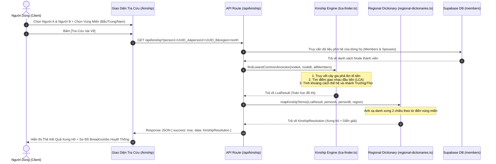

# ĐẶC TẢ KỸ THUẬT: MILESTONE 2 - LÕI THUẬT TOÁN PHẢ HỆ (KINSHIP ENGINE) & LỊCH ÂM VIỆT NAM

_Tài liệu này dùng để giới hạn Context Window. AI chỉ được phép đọc, suy luận và sinh code cho ĐÚNG các file được đề cập trong đây._

---

## 1. QUY TẮC NGHIÊM NGẶT (STRICT CONSTRAINTS)

- **Thư viện cho phép:**
  - TypeScript chuẩn, ES6 Modules.
  - Thuật toán thiên văn chuyển đổi Âm lịch Việt Nam chuẩn xác theo múi giờ UTC+7 (không dùng thư viện lịch âm Trung Quốc UTC+8).
  - Không cài thêm dependencies đồ họa nặng; giữ logic tính toán hoàn toàn tách biệt (Pure Functions) để chạy được cả ở Client, Server và CLI/Unit Test.
- **Quy tắc Kiến trúc cốt lõi (Theo AGENTS.md Rule 3):**
  - **Tách rời 2 tầng độc lập:**
    1. **Tầng 1 (Lõi đồ thị DAG):** Thuần toán học cây gia phả: Tìm Tổ tiên chung gần nhất (LCA), tính độ lệch thế hệ $\Delta G$, thứ bậc chi trưởng/thứ, và xuất chuỗi breadcrumbs huyết thống.
    2. **Tầng 2 (Từ điển xưng hô vùng miền):** Ánh xạ kết quả toán học sang danh xưng 2 chiều (Miền Bắc, Miền Trung, Miền Nam). Có thể cấu hình tùy biến.
- **Language & Naming:** Code, biến, types bằng Tiếng Anh. Tên file `kebab-case`. Component `PascalCase`. Giao diện và kết quả xưng hô hiển thị bằng Tiếng Việt chuẩn mực.

---

## 2. DATABASE & MODELS (Nếu có)

- **File:** `src/types/database.ts`, `src/types/kinship.ts`
- **Các trường dữ liệu tham gia tính toán từ bảng `members`:**
  - `id`: `UUID PRIMARY KEY`
  - `full_name`: `VARCHAR(255)`
  - `gender`: `'male' | 'female' | 'other'`
  - `father_id`: `UUID` (Nullable)
  - `mother_id`: `UUID` (Nullable)
  - `birth_order`: `INTEGER` (Thứ tự sinh trong gia đình: 1 là con cả, 2 là con thứ...)
  - `is_senior_branch`: `BOOLEAN` (Thuộc chi trưởng hay chi thứ)
  - `birth_date_solar`, `death_date_lunar_day`, `death_date_lunar_month`, `is_death_date_lunar_leap`
- **Data Models mới (`src/types/kinship.ts`):**
  ```ts
  export type KinshipRegion = 'north' | 'central' | 'south';

  export interface LcaResult {
    lcaNodeId: string | null;
    lcaNodeName: string | null;
    distanceA: number; // Số thế hệ từ A lên LCA
    distanceB: number; // Số thế hệ từ B lên LCA
    generationDelta: number; // distanceB - distanceA (> 0: A trên B; < 0: A dưới B; 0: cùng thế hệ)
    isSeniorBranchA: boolean; // Nhánh của A có phải trưởng so với B tại điểm rẽ từ LCA?
    pathA: Array<{ id: string; name: string; relation: string }>;
    pathB: Array<{ id: string; name: string; relation: string }>;
    relationshipType: 'same_person' | 'parent_child' | 'direct_ancestor' | 'sibling' | 'cousin' | 'in_law' | 'unrelated';
  }

  export interface KinshipResolution {
    termAtoB: string; // A gọi B là gì (VD: "Bác họ", "Chú họ", "Anh họ")
    termBtoA: string; // B gọi A là gì (VD: "Cháu họ", "Em họ")
    explanation: string; // Diễn giải phong tục (VD: "B là con bác trưởng, A là con chú thứ")
    region: KinshipRegion;
    breadcrumbs: string[]; // Chuỗi mắt xích
    generationDelta: number;
    relationshipType: RelationshipType;
    lcaName?: string | null;
    lcaNode?: KinshipPathNode | null;
    pathA: KinshipPathNode[]; // Nhánh thế hệ từ A lên LCA
    pathB: KinshipPathNode[]; // Nhánh thế hệ từ B lên LCA
  }
  ```

---

## 3. SƠ ĐỒ LUỒNG LOGIC (SEQUENCE DIAGRAM - MERMAID)



---

## 4. BACKEND LOGIC / API

### 4.1. Thư viện Toán học Đồ thị (`src/lib/kinship-engine/lca-finder.ts`)
- **Hàm `findLowestCommonAncestor(personAId: string, personBId: string, membersMap: Map<string, Member>): LcaResult`**:
  - Xây dựng bảng quan hệ phả hệ ngược (từ con lên cha mẹ).
  - Tìm tập hợp tổ tiên của A kèm khoảng cách thế hệ: `Map<ancestorId, distance>`.
  - Duyệt cây tổ tiên của B: tìm tổ tiên chung có tổng khoảng cách ngắn nhất $\rightarrow$ **LCA**.
  - Tính $\Delta G = \text{distanceB} - \text{distanceA}$.
  - Xác định thứ tự nhánh: So sánh `birth_order` của con cháu trực hệ đầu tiên dưới LCA.
  - Xử lý các quan hệ trực hệ: Cha - Con, Ông - Cháu, Cụ - Chắt.

### 4.2. Bộ Từ Điển Xưng Hô Vùng Miền (`src/lib/kinship-engine/regional-dictionaries.ts`)
- **Hàm `resolveKinshipTerms(lca: LcaResult, a: Member, b: Member, region: KinshipRegion): KinshipResolution`**:
  - **Trường hợp $\Delta G = 0$ (Cùng thế hệ):**
    - Anh/Em ruột (Cùng cha mẹ): So sánh ngày sinh hoặc `birth_order`.
    - Con chú con bác:
      - *Miền Bắc:* Chi trưởng luôn là Anh/Chị (dù ít tuổi hơn). *"Bé bằng củ khoai, cứ vai Bác là gọi Bác/Anh"*.
      - *Miền Nam:* Xưng Anh/Em theo tuổi thực tế, gọi kèm vai họ (Anh Họ, Em Họ).
  - **Trường hợp $\Delta G = 1$ (A trên B 1 đời):**
    - A là anh của cha B $\rightarrow$ A là **Bác**, B là **Cháu**.
    - A là em trai của cha B $\rightarrow$ A là **Chú**, B là **Cháu**.
    - A là em gái của cha B $\rightarrow$ A là **Cô**, B là **Cháu**.
    - A thuộc nhánh thứ nhưng là vai trên $\rightarrow$ Ghi rõ căn cứ chi họ.
  - **Trường hợp $\Delta G = 2$ (A trên B 2 đời):** Ông họ / Bà họ $\leftrightarrow$ Cháu.
  - **Trường hợp $\Delta G \ge 3$:** Cụ họ, Kỵ họ $\leftrightarrow$ Chắt, Chút.
  - **Dâu / Rể (Spouse):** Xưng hô theo vai của người phối ngẫu (Thím, Mợ, Dượng, Thím họ...).

### 4.3. Bộ Chuyển Đổi Âm - Dương & Can Chi (`src/lib/lunar/vietnamese-lunar.ts`)
- **Hàm `solarToLunar(day: number, month: number, year: number): { lunarDay: number; lunarMonth: number; lunarYear: number; isLeap: boolean }`**:
  - Thuật toán thiên văn học mặt trời - mặt trăng chuẩn xác cho kinh tuyến $105^\circ\text{E}$ (Múi giờ Hà Nội UTC+7).
- **Hàm `lunarToSolar(lunarDay: number, lunarMonth: number, lunarYear: number, isLeap: boolean): { day: number; month: number; year: number }`**.
- **Hàm `getYearCanChi(year: number): string`**:
  - Can: Giáp, Ất, Bính, Đinh, Mậu, Kỷ, Canh, Tân, Nhâm, Quý.
  - Chi: Tý, Sửu, Dần, Mão, Thìn, Tỵ, Ngọ, Mùi, Thân, Dậu, Tuất, Hợi.
  - Ví dụ: 1990 $\rightarrow$ Canh Ngọ; 2024 $\rightarrow$ Giáp Thìn; 2026 $\rightarrow$ Bính Ngọ.
- **Hàm `calculateNextAnniversary(lunarDay: number, lunarMonth: number, isLeap: boolean, targetSolarYear: number)`**:
  - Quy đổi ngày giỗ âm lịch hằng năm sang ngày dương lịch tương ứng của năm hiện tại.

### 4.4. API Route (`src/app/api/kinship/route.ts`)
- **[GET] `/api/kinship?p1={UUID}&p2={UUID}&region={north|central|south}`**:
  - Validate UUID 2 người không được trùng nhau.
  - Lấy danh sách thành viên trong dòng họ từ Supabase (hoặc cache).
  - Trả về JSON:
    ```json
    {
      "success": true,
      "data": {
        "termAtoB": "Bác họ",
        "termBtoA": "Cháu họ",
        "explanation": "B là con bác trưởng (nhánh anh), A là con chú thứ (nhánh em).",
        "generationDelta": 0,
        "relationshipType": "cousin",
        "breadcrumbs": ["Nguyễn Văn A", "Bố: Nguyễn Văn C", "Cụ Tổ: Nguyễn Văn Tổ", "Bác: Nguyễn Văn D", "Nguyễn Văn B"]
      }
    }
    ```

---

## 5. FRONTEND UI & LOGIC (MÀN HÌNH S-03 TRA CỨU VAI VẾ)

- **File:** `src/app/kinship/page.tsx`
- **State cần quản lý:**
  - `selectedPersonA: Member | null`
  - `selectedPersonB: Member | null`
  - `selectedRegion: KinshipRegion`
  - `result: KinshipResolution | null`
  - `isLoading: boolean`
  - `searchTermA: string`, `searchTermB: string`
  - `isExpandedMiddleGenerations: boolean` (Trạng thái mở rộng nén thế hệ trung gian khi $\ge 4$ đời)
- **Luồng xử lý UI:**
  1. Người dùng vào trang `/kinship`.
  2. Hai hộp chọn thành viên độc lập (Người hỏi & Người được hỏi) có thanh tìm kiếm tên gõ tức thì.
  3. Có thể bấm nút **[Đổi vai ⇄]** để đảo ngược vị trí A $\leftrightarrow$ B (kèm tự động tính lại).
  4. Lựa chọn radio vùng miền (Bắc / Trung / Nam).
  5. Bấm **[Xác Định Vai Vế Xưng Hô]** $\rightarrow$ Gọi API `/api/kinship`.
  6. Hiển thị thẻ kết quả nổi bật:
     - Khung xưng hô 2 chiều lớn: *"A gọi B là: **Bác Họ**"* & *"B gọi A là: **Cháu Họ**"*.
     - Huy hiệu thế hệ: *"Cùng thế hệ"* hoặc *"Cách nhau N thế hệ"*.
     - **Sơ đồ Cây Phả Hệ Mini Chữ V Ngược (Inverted-V Kinship Tree):**
       - Bắt đầu từ **Tổ tiên chung gần nhất (LCA)** (không lấy thừa từ Root).
       - Phân làm 2 cột nhánh (Nhánh Trưởng vs Nhánh Thứ) với đường line cong SVG bezier mềm mại.
       - Tích hợp cơ chế **Nén Tầng Trung Gian (Smart Folding)**: Nếu khoảng cách $\ge 4$ đời, mặc định nén các thế hệ giữa thành nút `[🔽 Nén N thế hệ - Bấm để mở rộng]`.
       - Thanh Cầu nối quan hệ dưới chân nối giữa A và B kèm nút bấm `[🔍 Xem trên Cây Phả Hệ Tổng]`.
     - **Thẻ Diễn Giải Phong Tục Cấu Trúc Hóa:**
       - Huy hiệu phong tục vùng miền (VD: `Phong tục Miền Bắc: Tôn vai Nhánh Trưởng`).
       - Lời răn / Tục ngữ cổ phong (VD: *"Bé bằng củ khoai, cứ vai Bác là gọi Anh"*).
       - Bảng đối sánh trực diện (Người A: Chi Trưởng, Sinh 1955 $\leftrightarrow$ Người B: Chi Thứ, Sinh 1952).

---

## 6. XỬ LÝ LỖI & NGOẠI LỆ (ERROR HANDLING & EDGE CASES)

- **Edge Case 1 (Người tự chọn chính mình):** A chọn đúng ID của A $\rightarrow$ Thông báo: *"Vui lòng chọn 2 thành viên khác nhau để tra cứu quan hệ xưng hô."*
- **Edge Case 2 (Node chưa nối phả / Unlinked Node):** Một trong hai người chưa nối cha mẹ $\rightarrow$ Thông báo: *"Thành viên [Tên] chưa được liên kết cha mẹ trong cây phả hệ nên chưa thể tìm tổ tiên chung."*
- **Edge Case 3 (Không cùng huyết thống / Dâu Rể):** Hai người thuộc 2 chi khác nhau hoàn toàn không có LCA $\rightarrow$ Trả về quan hệ ngoài họ hoặc qua hôn phối.
- **Edge Case 4 (Hôn nhân nội tộc):** Có nhiều hơn 1 đường dẫn huyết thống $\rightarrow$ Lấy đường dẫn có tổng khoảng cách thế hệ ngắn nhất (LCA gần nhất) và ghi chú có yếu tố hôn phối họ hàng.
- **Edge Case 5 (Âm lịch tháng nhuận):** Người mất vào tháng nhuận âm lịch $\rightarrow$ Thuật toán tính ngày giỗ tự động fallback về tháng chính nếu năm đó không có tháng nhuận.

---

## 7. MA TRẬN TEST CASES & TIÊU CHÍ NGHIỆM THU (TEST SPECIFICATION)

### 7.1. Bảng Kịch Bản Kiểm Thử Chi Tiết
| ID | Tên Kịch Bản | Loại Test | Tiền điều kiện (Given) | Thao tác kích hoạt (When) | Kết quả kỳ vọng (Then) | Phân loại |
|---|---|---|---|---|---|---|
| **TC01** | LCA Anh Em Ruột | Unit Test | 2 thành viên có cùng father_id | Chạy `findLowestCommonAncestor(A, B)` | LCA là Cha; distanceA = 1, distanceB = 1, generationDelta = 0 | Happy Path |
| **TC02** | Xưng Hô Con Chú Con Bác (Miền Bắc) | Unit Test | B là con Bác Trưởng, A là con Chú Thứ (A nhiều tuổi hơn B) | Chạy `resolveKinshipTerms(lca, A, B, 'north')` | A gọi B là "Anh/Chị họ", B gọi A là "Em họ" (Tôn trọng vai nhánh Trưởng) | Happy Path |
| **TC03** | Xưng Hô Chú Cháu Lệch 1 Đời | Unit Test | A là em trai của bố B | Chạy `resolveKinshipTerms(lca, A, B, 'north')` | A gọi B là "Cháu", B gọi A là "Chú" | Happy Path |
| **TC04** | Quy đổi Âm - Dương & Can Chi | Unit Test | Ngày dương 19/02/2026 | Chạy `solarToLunar(19, 2, 2026)` & `getYearCanChi(2026)` | Ra ngày 03/01 Bính Ngọ, năm Can Chi "Bính Ngọ" | Happy Path |
| **TC05** | Chọn Trùng 1 Người | UI / E2E | Trang `/kinship` đã tải | Chọn Người A và Người B cùng là 1 người | Nút Tra cứu bị disable hoặc báo lỗi: "Vui lòng chọn 2 người khác nhau" | Error Handling |
| **TC06** | Thành Viên Chưa Nối Phả | UI / E2E | Thành viên C không có father_id và mother_id | Bấm Tra cứu A và C | Hiển thị thông báo: "Chưa thể xác định do chưa liên kết phả hệ" | Edge Case |
| **TC07** | Đảo Vai (A ↔ B) | UI / E2E | Đang hiển thị kết quả A gọi B | Bấm nút [Đổi vai] | Đảo ngược kết quả B gọi A lên đầu ngay lập tức | Happy Path |
| **TC08** | Cây Chữ V Ngược Xuất Phát Từ LCA | UI / E2E | Chọn 2 người cùng ông nội (Đời 3) trong cây 7 đời | Bấm [Xác Định Vai Vế Xưng Hô] | Đỉnh cây hiển thị đúng Ông nội (LCA), KHÔNG hiển thị thừa các đời 2, 1 (Root) | Happy Path |
| **TC09** | Nén Tầng Trung Gian (Smart Folding) | UI / E2E | Chọn 2 người cách nhau $\ge 4$ đời (Đời 1 và Đời 6) | Bấm [Xác Định Vai Vế] $\rightarrow$ Bấm nút [🔽 Nén N thế hệ] | Ban đầu nén gọn các tầng giữa; bấm vào bung mở rộng mượt mà | Happy Path |
| **TC10** | Thẻ Diễn Giải Phong Tục Cấu Trúc Hóa | UI / E2E | Tra cứu Dũng (Chi Trưởng) và Hùng (Chi Thứ) | Quan sát khối Diễn giải phong tục | Hiển thị đủ 3 khối: Huy hiệu vùng miền, Tục ngữ cổ phong, Bảng đối sánh trực diện | UI / Visual |
| **TC11** | Phả Hệ Đa Thê & Con Nuôi | Unit Test | Dữ liệu mẫu mở rộng 25–30 người có vợ cả/hai, con nuôi | Chạy `findLowestCommonAncestor` & `resolveKinshipTerms` | Xác định đúng quan hệ con cùng cha khác mẹ và xưng hô cho con nuôi | Happy Path |

### 7.2. Danh Sách Tiêu Chí Nghiệm Thu (Acceptance Criteria)
- [x] **AC1:** Thuật toán `findLowestCommonAncestor` tìm chính xác Tổ tiên chung gần nhất và khoảng cách thế hệ giữa 2 người bất kỳ trên đồ thị phả hệ.
- [x] **AC2:** Bộ từ điển xưng hô `resolveKinshipTerms` ánh xạ đúng danh xưng 2 chiều cho anh em ruột, con chú con bác, chú-cháu, ông-cháu theo 3 miền Bắc/Trung/Nam.
- [x] **AC3:** Bộ chuyển đổi `vietnamese-lunar.ts` quy đổi chính xác Âm - Dương theo múi giờ UTC+7 và xuất đúng tên Năm Can Chi (Thập Can + Thập Nhị Chi).
- [x] **AC4:** API `GET /api/kinship` trả về dữ liệu cấu trúc chuẩn, có breadcrumbs đường đi huyết thống và lý giải phong tục.
- [x] **AC5:** Giao diện `/kinship` cho phép tìm kiếm, chọn 2 thành viên, đổi vai A $\leftrightarrow$ B và xem kết quả trực quan mượt mà.
- [x] **AC6:** Bộ Unit Test (`tests/kinship.test.ts` & `tests/lunar.test.ts`) đạt tỷ lệ Pass 100%.
- [x] **AC7:** Sơ đồ Cây Phả Hệ Mini Chữ V Ngược (Inverted-V Kinship Tree) hiển thị trực quan bắt đầu từ LCA, phân 2 cột nhánh (Trưởng vs Thứ), có đường nối SVG bezier và thanh cầu nối xưng hô ở chân.
- [x] **AC8:** Cơ chế Smart Folding tự động nén thế hệ trung gian khi khoảng cách $\ge 4$ đời, hỗ trợ toggle mở rộng/thu gọn mượt mà.
- [x] **AC9:** Thẻ Diễn Giải Phong Tục cấu trúc hóa 3 phần (Huy hiệu phong tục, Lời răn cổ phong, Bảng đối sánh tương quan) thay thế hoàn toàn đoạn văn bản cũ.
- [x] **AC10:** Mở rộng bộ dữ liệu mẫu `MOCK_CLAN_MEMBERS` lên 25–30 người bao phủ đa chi, vợ cả/vợ hai, con nuôi, 6-7 đời và hôn nhân nội tộc.

---

## 8. BẢO VỆ CHỐNG THOÁI LUI (REGRESSION GUARD CHECKLIST)

- [x] **RG01 (Trang Chủ & Header):** Thanh điều hướng Navbar liên kết tới `/kinship` hoạt động chuẩn xác, giữ nguyên giao diện Modern Heritage.
- [x] **RG02 (Auth & Dev Bypass):** Cơ chế Dev Bypass và phiên đăng nhập Super Admin hoạt động bình thường, không bị ảnh hưởng bởi tính năng mới.
- [x] **RG03 (Build & Typecheck):** `npm run typecheck` (`tsc --noEmit`) và `npm run build` tiếp tục đạt 100% 0 lỗi.
- [x] **RG04 (Đảo vai A ↔ B trên Cây Chữ V):** Khi bấm nút hoán đổi vai xưng hô ⇄, vị trí 2 cột nhánh và thanh cầu nối quan hệ đảo ngược mượt mà, không vỡ layout.
- [x] **RG05 (Responsive Mobile):** Sơ đồ cây co giãn linh hoạt hoặc chuyển sang Split Timeline trên màn hình nhỏ (< 640px) không bị tràn ngang.

---

## 9. LỆNH THI CÔNG (Dành cho AI /feature-code)

> "AI ơi, hãy đọc kỹ đặc tả `docs/10_Micro-Spec_Milestone_2_Kinship_Lunar.md` này. Dựa CHÍNH XÁC vào các mô tả ranh giới ở trên, hãy thi công toàn bộ mã nguồn lõi thuật toán Kinship Engine, Lịch Âm, API Route và trang Tra Cứu Vai Vế `/kinship`. Thực thi Vòng lặp Kiểm thử 3 Tầng (Build, Unit Test, Browser Test) và chỉ được tick `[x]` khi có bằng chứng test Pass 100%."
