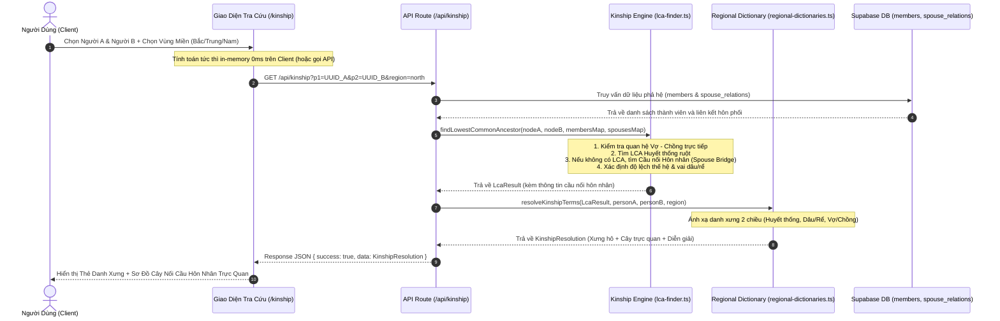

# ĐẶC TẢ KỸ THUẬT: MILESTONE 2 - LÕI THUẬT TOÁN PHẢ HỆ (KINSHIP ENGINE) & LỊCH ÂM VIỆT NAM

_Tài liệu này dùng để giới hạn Context Window. AI chỉ được phép đọc, suy luận và sinh code cho ĐÚNG các file được đề cập trong đây._

---

## 1. QUY TẮC NGHIÊM NGẶT (STRICT CONSTRAINTS)

- **Thư viện cho phép:**
  - TypeScript chuẩn, ES6 Modules.
  - Thuật toán thiên văn chuyển đổi Âm lịch Việt Nam chuẩn xác theo múi giờ UTC+7 (không dùng thư viện lịch âm Trung Quốc UTC+8).
  - Không cài thêm dependencies đồ họa nặng; giữ logic tính toán hoàn toàn tách biệt (Pure Functions) để chạy được cả ở Client, Server và CLI/Unit Test.
- **Quy tắc Kiến trúc cốt lõi (Theo AGENTS.md Rule 3):**
  - **Tách rời 2 tầng độc lập:**
    1. **Tầng 1 (Lõi đồ thị DAG):** Thuần toán học cây gia phả: Tìm Gốc Gần Nhất, tính độ lệch thế hệ $\Delta G$, thứ bậc chi trưởng/thứ, và xuất chuỗi breadcrumbs huyết thống.
    2. **Tầng 2 (Từ điển xưng hô vùng miền):** Ánh xạ kết quả toán học sang danh xưng 2 chiều (Miền Bắc, Miền Trung, Miền Nam). Có thể cấu hình tùy biến.
- **Language & Naming:** Code, biến, types bằng Tiếng Anh. Tên file `kebab-case`. Component `PascalCase`. Giao diện và kết quả xưng hô hiển thị bằng Tiếng Việt chuẩn mực.

---

## 2. DATABASE & MODELS (Nếu có)

- **File:** `src/types/database.ts`, `src/types/kinship.ts`
- **Các trường dữ liệu tham gia tính toán từ bảng `members`:**
  - `id`: `UUID PRIMARY KEY`
  - `full_name`: `VARCHAR(255)`
  - `gender`: `'male' | 'female' | 'other'`
  - `father_id`: `UUID` (Nullable)
  - `mother_id`: `UUID` (Nullable)
  - `birth_order`: `INTEGER` (Thứ tự sinh trong gia đình: 1 là con cả, 2 là con thứ...)
  - `is_senior_branch`: `BOOLEAN` (Thuộc chi trưởng hay chi thứ)
  - `birth_date_solar`, `death_date_lunar_day`, `death_date_lunar_month`, `is_death_date_lunar_leap`
- **Dữ liệu tham gia từ bảng `spouse_relations`:**
  - `member_a_id`: `UUID` (ID người phối ngẫu thứ nhất)
  - `member_b_id`: `UUID` (ID người phối ngẫu thứ hai)
  - `marriage_order`: `SMALLINT` (Thứ tự kết hôn: Vợ cả = 1, Vợ hai = 2...)
  - `marriage_status`: `'married' | 'divorced' | 'widowed'`
- **Data Models mới (`src/types/kinship.ts`):**
  ```ts
  export type KinshipRegion = 'north' | 'central' | 'south';

  export type RelationshipType =
    | 'same_person'
    | 'parent_child'
    | 'direct_ancestor'
    | 'sibling'
    | 'cousin'
    | 'spouse'
    | 'in_law'
    | 'co_in_law'
    | 'unrelated';

  export interface LcaResult {
    lcaNodeId: string | null;
    lcaNodeName: string | null;
    distanceA: number; // Số thế hệ từ A lên LCA
    distanceB: number; // Số thế hệ từ B lên LCA
    generationDelta: number; // distanceB - distanceA (> 0: A trên B; < 0: A dưới B; 0: cùng thế hệ)
    isSeniorBranchA: boolean; // Nhánh của A có phải trưởng so với B tại điểm rẽ từ LCA?
    pathA: Array<{ id: string; name: string; relation: string }>;
    pathB: Array<{ id: string; name: string; relation: string }>;
    relationshipType: RelationshipType;
    inLawBridge?: {
      bridgeType: 'direct_spouse' | 'one_in_law' | 'both_in_law';
      spouseA?: { id: string; name: string };
      spouseB?: { id: string; name: string };
      bloodRelation?: RelationshipType;
    };
  }

  export interface KinshipResolution {
    termAtoB: string; // A gọi B là gì (VD: "Bác họ", "Chú họ", "Chị dâu", "Con dâu")
    termBtoA: string; // B gọi A là gì (VD: "Cháu họ", "Em họ", "Chú", "Bố chồng")
    explanation: string; // Diễn giải phong tục và gốc tích phả hệ
    region: KinshipRegion;
    breadcrumbs: string[]; // Chuỗi mắt xích
    generationDelta: number;
    relationshipType: RelationshipType;
    lcaName?: string | null;
    lcaNode?: KinshipPathNode | null;
    pathA: KinshipPathNode[]; // Nhánh thế hệ từ A lên LCA (hoặc cầu hôn phối)
    pathB: KinshipPathNode[]; // Nhánh thế hệ từ B lên LCA (hoặc cầu hôn phối)
  }
  ```

---

## 3. SƠ ĐỒ LUỒNG LOGIC (SEQUENCE DIAGRAM - MERMAID)



---

## 4. BACKEND LOGIC / API

### 4.1. Thư viện Toán học Đồ thị (`src/lib/kinship-engine/lca-finder.ts`)
- **Hàm `findLowestCommonAncestor(personAId: string, personBId: string, membersMap: Map<string, Member>): LcaResult`**:
  - Xây dựng bảng quan hệ phả hệ ngược (từ con lên cha mẹ).
  - Tìm tập hợp tổ tiên của A kèm khoảng cách thế hệ: `Map<ancestorId, distance>`.
  - Duyệt cây tổ tiên của B: tìm tổ tiên chung có tổng khoảng cách ngắn nhất $\rightarrow$ **LCA**.
  - Tính $\Delta G = \text{distanceB} - \text{distanceA}$.
  - Xác định thứ tự nhánh: So sánh `birth_order` của con cháu trực hệ đầu tiên dưới LCA.
  - Xử lý các quan hệ trực hệ: Cha - Con, Ông - Cháu, Cụ - Chắt.

### 4.2. Bộ Từ Điển Xưng Hô Vùng Miền (`src/lib/kinship-engine/regional-dictionaries.ts`)
- **Hàm `resolveKinshipTerms(lca: LcaResult, a: Member, b: Member, region: KinshipRegion): KinshipResolution`**:
  - **Trường hợp $\Delta G = 0$ (Cùng thế hệ):**
    - Anh/Em ruột (Cùng cha mẹ): So sánh ngày sinh hoặc `birth_order`.
    - Con chú con bác:
      - *Miền Bắc:* Chi trưởng luôn là Anh/Chị (dù ít tuổi hơn). *"Bé bằng củ khoai, cứ vai Bác là gọi Bác/Anh"*.
      - *Miền Nam:* Xưng Anh/Em theo tuổi thực tế, gọi kèm vai họ (Anh Họ, Em Họ).
  - **Trường hợp $\Delta G = 1$ (A trên B 1 đời):**
    - A là anh của cha B $\rightarrow$ A là **Bác**, B là **Cháu**.
    - A là em trai của cha B $\rightarrow$ A là **Chú**, B là **Cháu**.
    - A là em gái của cha B $\rightarrow$ A là **Cô**, B là **Cháu**.
    - A thuộc nhánh thứ nhưng là vai trên $\rightarrow$ Ghi rõ căn cứ chi họ.
  - **Trường hợp $\Delta G = 2$ (A trên B 2 đời):** Ông họ / Bà họ $\leftrightarrow$ Cháu.
  - **Trường hợp $\Delta G \ge 3$:** Cụ họ, Kỵ họ $\leftrightarrow$ Chắt, Chút.
  - **Dâu / Rể (Spouse):** Xưng hô theo vai của người phối ngẫu (Thím, Mợ, Dượng, Thím họ...).

### 4.3. Bộ Chuyển Đổi Âm - Dương & Can Chi (`src/lib/lunar/vietnamese-lunar.ts`)
- **Hàm `solarToLunar(day: number, month: number, year: number): { lunarDay: number; lunarMonth: number; lunarYear: number; isLeap: boolean }`**:
  - Thuật toán thiên văn học mặt trời - mặt trăng chuẩn xác cho kinh tuyến $105^\circ\text{E}$ (Múi giờ Hà Nội UTC+7).
- **Hàm `lunarToSolar(lunarDay: number, lunarMonth: number, lunarYear: number, isLeap: boolean): { day: number; month: number; year: number }`**.
- **Hàm `getYearCanChi(year: number): string`**:
  - Can: Giáp, Ất, Bính, Đinh, Mậu, Kỷ, Canh, Tân, Nhâm, Quý.
  - Chi: Tý, Sửu, Dần, Mão, Thìn, Tỵ, Ngọ, Mùi, Thân, Dậu, Tuất, Hợi.
  - Ví dụ: 1990 $\rightarrow$ Canh Ngọ; 2024 $\rightarrow$ Giáp Thìn; 2026 $\rightarrow$ Bính Ngọ.
- **Hàm `calculateNextAnniversary(lunarDay: number, lunarMonth: number, isLeap: boolean, targetSolarYear: number)`**:
  - Quy đổi ngày giỗ âm lịch hằng năm sang ngày dương lịch tương ứng của năm hiện tại.

### 4.4. API Route (`src/app/api/kinship/route.ts`)
- **[GET] `/api/kinship?p1={UUID}&p2={UUID}&region={north|central|south}`**:
  - Validate UUID 2 người không được trùng nhau.
  - Lấy danh sách thành viên trong dòng họ từ Supabase (hoặc cache).
  - Trả về JSON:
    ```json
    {
      "success": true,
      "data": {
        "termAtoB": "Bác họ",
        "termBtoA": "Cháu họ",
        "explanation": "B là con bác trưởng (nhánh anh), A là con chú thứ (nhánh em).",
        "generationDelta": 0,
        "relationshipType": "cousin",
        "breadcrumbs": ["Nguyễn Văn A", "Bố: Nguyễn Văn C", "Cụ Tổ: Nguyễn Văn Tổ", "Bác: Nguyễn Văn D", "Nguyễn Văn B"]
      }
    }
    ```

---

## 5. FRONTEND UI & LOGIC (MÀN HÌNH S-03 TRA CỨU VAI VẾ)

- **File:** `src/app/kinship/page.tsx`
- **State cần quản lý:**
  - `selectedPersonA: Member | null`
  - `selectedPersonB: Member | null`
  - `selectedRegion: KinshipRegion`
  - `result: KinshipResolution | null`
  - `isLoading: boolean`
  - `searchTermA: string`, `searchTermB: string`
  - `isExpandedMiddleGenerations: boolean` (Trạng thái mở rộng nén thế hệ trung gian khi $\ge 4$ đời)
- **Luồng xử lý UI:**
  1. Người dùng vào trang `/kinship`.
  2. Hai hộp chọn thành viên độc lập (Người hỏi & Người được hỏi) có thanh tìm kiếm tên gõ tức thì.
  3. Có thể bấm nút **[Đổi vai ⇄]** để đảo ngược vị trí A $\leftrightarrow$ B (kèm tự động tính lại).
  4. Lựa chọn radio vùng miền (Bắc / Trung / Nam).
  5. Bấm **[Xác định quan hệ]** $\rightarrow$ Gọi API `/api/kinship`.
  6. Hiển thị thẻ kết quả nổi bật:
     - Khung xưng hô 2 chiều lớn: *"A gọi B là: **Bác Họ**"* & *"B gọi A là: **Cháu Họ**"*.
     - Huy hiệu thế hệ: *"Cùng thế hệ"* hoặc *"Cách nhau N thế hệ"*.
     - **Sơ Đồ Cây Phả Hệ Trực Quan (Mini Cây Chữ V Ngược):**
       - Bắt đầu từ **Gốc Gần Nhất** (không lấy thừa từ Root).
       - Phân làm 2 cột nhánh (Nhánh Trưởng vs Nhánh Thứ) với đường line cong SVG bezier mềm mại.
       - Tích hợp cơ chế **Nén Tầng Trung Gian (Smart Folding)**: Nếu khoảng cách $\ge 4$ đời, mặc định nén các thế hệ giữa thành nút `[🔽 Nén N thế hệ - Bấm để mở rộng]`.
       - Thanh Cầu nối quan hệ dưới chân nối giữa A và B kèm nút bấm `[🔍 Xem trên Cây Phả Hệ Tổng]`.
     - **Thẻ Diễn Giải Phong Tục Cấu Trúc Hóa:**
       - Huy hiệu phong tục vùng miền (VD: `Phong tục Miền Bắc: Tôn vai Nhánh Trưởng`).
       - Lời răn / Tục ngữ cổ phong (VD: *"Bé bằng củ khoai, cứ vai Bác là gọi Anh"*).
       - Bảng đối sánh trực diện (Người A: Chi Trưởng, Sinh 1955 $\leftrightarrow$ Người B: Chi Thứ, Sinh 1952).

### 5.1. Kiến Trúc Zero-Latency Hybrid Resolver & Live Reactivity (Nâng Cấp)
- **Vấn đề đã nhận diện (Root Cause):** Việc gửi toàn bộ thao tác tính toán qua network `fetch('/api/kinship')` bị chặn bởi `supabase.auth.getUser()` trong `src/middleware.ts`, gây nghẽn 15–35 giây khiến UI bị đóng băng hoàn toàn.
- **Giải pháp Zero-Latency In-Memory:**
  - Vì `findLowestCommonAncestor` và `resolveKinshipTerms` là các **Pure Functions**, trang `/kinship` sẽ tính toán trực tiếp in-memory trên client (tốc độ 0ms), biến giao diện thành **Live Reactive**:
    1. Đổi Người A hoặc Người B trên `<select>` $\rightarrow$ Tự động tính lại Cây Chữ V ngay tức thì.
    2. Đổi Tab Vùng Miền (Bắc / Trung / Nam) $\rightarrow$ Hoán chuyển danh xưng và thẻ phong tục tức thì 0ms.
    3. Bấm các nút Kịch bản mẫu $\rightarrow$ Tự động xóa chuỗi tìm kiếm (`setSearchA('')`, `setSearchB('')`) để dropdown không bị ẩn option, đồng thời hiển thị Cây Chữ V ngay 0ms.
    4. Nút [Xác định quan hệ] vẫn được giữ nguyên để phục vụ người dùng thích thao tác thủ công.
  - **Tối ưu Middleware:** Thêm đường dẫn `api/kinship` vào danh sách loại trừ trong `src/middleware.ts` để các truy vấn API công khai không bị nghẽn mạng bởi Supabase Auth.

### 5.2. Tinh Chỉnh Giao Diện & Trải Nghiệm Người Dùng (UX Refinements Theo UAT)
- **5.2.1. Hệ Thống Đường Nối Phả Hệ Vuông Góc 90 Độ (Orthogonal Square Connectors):**
  - Loại bỏ hoàn toàn SVG đường cong nét đứt (`strokeDasharray`, `bezier`) bị lệch tâm card.
  - Thay bằng hệ thống đường nối vuông góc 90 độ nét liền `solid` (`bg-emerald-600` / `border-emerald-600`):
    - Trục đứng từ tâm đáy LCA đi xuống.
    - Trục ngang rẽ 90 độ từ tâm 25% (Cột A) sang tâm 75% (Cột B).
    - Trục rẽ xuống đâm thẳng 90 độ vào đỉnh card của Cột A và Cột B.
    - Đảm bảo 100% thẳng hàng, sắc nét và tương thích hoàn hảo với Responsive Grid.
- **5.2.2. Xử Lý Quan Hệ Trực Hệ (Bố - Con, Mẹ - Con, Ông - Cháu, Cụ - Chắt):**
  - Khi một người là tổ tiên của người kia (`distanceA === 0` hoặc `distanceB === 0`), hệ thống tự động chuyển từ Cây Chữ V sang **Sơ Đồ Dòng Trực Hệ Dọc (Vertical Direct Lineage)**.
- **5.2.3. Tinh Gọn Giao Diện:** Loại bỏ hoàn toàn khối `#cultural-customs-card`.
- **5.2.4. Đồng Bộ Vùng Miền:** Tự động nạp cấu hình vùng miền của dòng họ từ `/api/clan-settings` (`clan_settings.default_kinship_region`).
- **5.2.5. Tinh Giản Trục Nối Trực Hệ Dọc & Triệt Tiêu Ghi Chú Thừa (Minimalist Lineage & Zero-Clutter Connectors):**
  - **Loại bỏ viên thuốc text trên đường nối thế hệ:** Giữa các node trên trục trực hệ dọc, thẻ node đã có sẵn badge `Đời N` ở góc phải. Do đó, xóa bỏ hoàn toàn thẻ `span` chêm giữa đường kẻ (`Đời 1 : Đời 2`, `Đời 2 : Đời 3`...).
  - **Loại bỏ nhãn `Quan hệ Cha/Mẹ → Con`:** Không chèn chữ vào đường nối. Thay vào đó, toàn bộ các node trực hệ dọc chỉ được kết nối bởi **trục đứng nét liền thuần túy** (`w-0.5 h-6 bg-emerald-600`), tạo cảm giác liền mạch, thanh thoát và đạt độ thẩm mỹ cao nhất.
  - **Tập trung thông tin:** Các thông tin danh xưng 2 chiều ở banner và dữ liệu trên từng thẻ node là hoàn chỉnh và đầy đủ, không chèn thêm bất kỳ ghi chú phụ nào trên các nhánh nối.

### 5.3. Quản Lý & Tùy Biến Từ Điển Xưng Hô Dòng Họ Toàn Diện (Comprehensive Kinship Dictionary)
- **5.3.1. Danh Mục 6 Nhóm Thân Tộc Toàn Diện (32 Mối Quan Hệ Cốt Lõi):**
  - Mở rộng toàn diện hệ thống xưng hô họ tộc Việt Nam, bao quát trọn vẹn cả bên Nội, bên Ngoại, quan hệ Huyết thống và Hôn phối (Dâu / Rể):
    1. **Nhóm I - Trực Hệ (Nội & Ngoại):** Cha - Con (`parent_father`), Mẹ - Con (`parent_mother`), Ông nội - Cháu (`grandparent_paternal_male`), Bà nội - Cháu (`grandparent_paternal_female`), Ông ngoại - Cháu ngoại (`grandparent_maternal_male`), Bà ngoại - Cháu ngoại (`grandparent_maternal_female`), Bậc Cụ (`great_grandparent`), Kỵ tổ / Cụ tổ họ (`ancestor_4plus`).
    2. **Nhóm II - Cùng Thế Hệ & Dâu/Rể:** Anh ruột (`sibling_brother`), Chị ruột (`sibling_sister`), Anh/Chị họ Chi Trưởng (`cousin_senior`), Em họ Chi Thứ (`cousin_junior`), Chị dâu (`sister_in_law`), Anh rể (`brother_in_law`), Em dâu (`younger_sister_in_law`), Em rể (`younger_brother_in_law`).
    3. **Nhóm III - Bác / Chú / Cô (Bên Nội & Phu Thê):** Bác trai (`uncle_paternal_senior`), Vợ Bác trai - Bác dâu (`aunt_paternal_senior_wife`), Bác gái (`aunt_paternal_senior`), Chồng Bác gái - Bác rể (`uncle_paternal_senior_husband`), Chú (`uncle_paternal_junior`), Vợ Chú - Thím (`aunt_paternal_junior_wife`), Cô (`aunt_paternal_junior`), Chồng Cô - Chú dượng / Dượng (`uncle_paternal_junior_husband`).
    4. **Nhóm IV - Bác / Cậu / Dì (Bên Ngoại & Phu Thê):** Bác trai ngoại (`uncle_maternal_senior`), Vợ Bác trai ngoại - Bác dâu ngoại (`aunt_maternal_senior_wife`), Cậu (`uncle_maternal_junior`), Vợ Cậu - Mợ (`aunt_maternal_junior_wife`), Dì (`aunt_maternal_junior`), Chồng Dì - Dượng (`uncle_maternal_junior_husband`).
    5. **Nhóm V - Dâu / Rể Thế Hệ Con & Cháu:** Con dâu (`daughter_in_law`), Con rể (`son_in_law`), Cháu dâu (`grand_daughter_in_law`), Cháu rể (`grand_son_in_law`).
    6. **Nhóm VI - Bậc Họ Hàng Lệch Đời:** Ông họ (`grandparent_collateral_male`), Bà họ (`grandparent_collateral_female`).
- **5.3.2. Bộ Lọc Phân Nhóm Nhanh & Ô Tìm Kiếm (Group Filter Chips & Quick Search):**
  - Màn hình `/admin/settings` trang bị thanh chọn tab nhóm (All, Trực hệ, Cùng đời, Bác/Chú/Cô Nội, Cậu/Dì Ngoại, Dâu/Rể Con Cháu, Họ hàng) và ô tìm kiếm tức thì.
  - Mỗi hàng cho phép Admin gõ sửa trực tiếp 2 ô input: `Bề trên gọi Bề dưới (A → B)` và `Bề dưới gọi Bề trên (B → A)`.
  - Có nút **"Khôi phục chuẩn [Tên Vùng Miền]"** nạp lại mẫu 32 quan hệ của vùng miền đó.
- **5.3.3. Lưu Trữ DB & Đồng Bộ Hóa Động Với Kinship Engine:**
  - Lưu cấu hình 32 quan hệ vào `clan_settings.custom_kinship_dictionary` (`JSONB`).
  - Lõi `resolveKinshipTerms` tự động nạp cấu hình tùy biến của gia tộc.

### 5.4. Lõi Thân Tộc Mở Rộng Qua Hôn Nhân (Affinal Kinship Engine - Dâu / Rể & Vợ / Chồng)

- **5.4.1. Bản Thể Học Thân Tộc (4 Kịch Bản Phân Giải Toàn Diện):**
  1. **Quan hệ Vợ - Chồng Trực Tiếp (`spouse`):**
     - $A$ và $B$ có liên kết trong bảng `spouse_relations` (hoặc có con chung).
     - $A$ (Nam) gọi $B$ (Nữ) là **"Vợ"** (hoặc Nhà tôi), $B$ gọi $A$ là **"Chồng"** (hoặc Nhà tôi).
     - Biểu diễn đồ thị: Hai thẻ node kết nối bằng thanh ngang hôn phối màu ngọc bích `═(Hôn phối)═`.
  2. **Quan hệ Huyết Thống Nội Tộc (`consanguineal`):**
     - Cả $A$ và $B$ đều có tổ tiên chung trong họ (LCA). Xử lý qua thuật toán LCA huyết thống truyền thống (Mục 4.1).
  3. **Quan hệ Một Bên Dâu / Rể (`in_law` - Cầu Nối Hôn Nhân Đơn):**
     - Người $A$ là Dâu/Rể, kết hôn với thành viên ruột $S_A$.
     - Tìm quan hệ huyết thống giữa $S_A$ và $B$ qua $\text{LCA}(S_A, B)$:
       - **Bố/Mẹ chồng - Con dâu (Bố/Mẹ vợ - Con rể):** $B$ là cha mẹ ruột của $S_A$.
         - Con dâu gọi Bố/Mẹ chồng là **"Bố"** / **"Mẹ"**. Bố/Mẹ gọi con dâu là **"Con"** (Con dâu).
         - Con rể gọi Bố/Mẹ vợ là **"Bố"** / **"Mẹ"**. Bố/Mẹ gọi con rể là **"Con"** (Con rể).
       - **Chị dâu - Em chồng:** $S_A$ là anh trai của $B$.
         - Em chồng gọi vợ anh là **"Chị dâu"** (hoặc **"Chị"**).
         - Chị dâu gọi em chồng là **"Chú"** (nếu $B$ là nam) / **"Cô"** (nếu $B$ là nữ) theo phong tục miền Bắc, hoặc **"Em"**.
       - **Em dâu - Anh/Chị chồng:** $S_A$ là em trai của $B$.
         - Anh/chị chồng gọi vợ em là **"Em dâu"** (hoặc **"Thím"**).
         - Em dâu gọi anh chồng là **"Bác"** / **"Anh"**, gọi chị chồng là **"Cô"** / **"Chị"**.
       - **Anh rể / Em rể - Em vợ / Anh vợ:** $S_A$ là chị/em gái của $B$.
         - Chồng chị gái là **"Anh rể"**, chồng em gái là **"Em rể"**.
       - **Bác dâu, Thím, Mợ, Dượng:** $S_A$ là Bác/Chú/Cậu/Dì của $B$.
         - Vợ Bác trai = **"Bác dâu"** (Bác gái) $\rightarrow$ gọi tắt **"Bác"**.
         - Vợ Chú = **"Thím"**.
         - Vợ Cậu = **"Mợ"**.
         - Chồng Cô = **"Chú rể / Dượng"**.
         - Chồng Dì = **"Dượng"**.
       - **Cháu dâu / Cháu rể:** $S_A$ là cháu của $B$.
         - Vợ/chồng của cháu $\rightarrow$ **"Cháu dâu"** / **"Cháu rể"**.
  4. **Quan hệ Hai Bên Đều Là Dâu / Rể (`co_in_law` - Cầu Nối Hôn Nhân Đôi):**
     - $A$ kết hôn với $S_A$, $B$ kết hôn với $S_B$.
     - Tìm quan hệ huyết thống giữa $S_A$ và $S_B$:
       - Nếu $S_A$ và $S_B$ là anh em trai $\rightarrow$ $A$ và $B$ là **Chị em dâu** (vợ anh là chị dâu, vợ em là em dâu).
       - Nếu $S_A$ và $S_B$ là chị em gái $\rightarrow$ $A$ và $B$ là **Anh em đồng hao (cọc chèo)**.
       - Nếu $S_A$ và $S_B$ là anh em họ $\rightarrow$ Chị em dâu họ / Đồng hao họ.

- **5.4.2. Cây Phả Hệ Trực Quan Nối Cầu Hôn Nhân (Visual In-Law Path):**
  - Khi quan hệ có liên quan đến Dâu/Rể, sơ đồ phả hệ hiển thị rõ ràng chuỗi liên kết:
    - Nhịp huyết thống biểu diễn bằng mũi tên nét liền $\rightarrow$ (Cha con, Anh em).
    - Nhịp hôn nhân biểu diễn bằng đường đôi $\xlongequal{\text{Vợ Chồng}}$.
    - Giúp người xem nắm bắt ngay tức thì lý do vì sao có cách xưng hô này (VD: `[Bố] ──(Cha)──> [Chồng] ══(Vợ Chồng)══ [Con dâu]`).

- **5.4.3. Đồng Bộ Dữ Liệu Hôn Phối Trong UI & API:**
  - API `/api/kinship` truy vấn đồng thời bảng `members` và `spouse_relations`.
  - Client `/kinship` nạp `spouse_relations` vào bộ nhớ in-memory để duy trì tốc độ tra cứu tức thì < 1ms.

---

## 6. XỬ LÝ LỖI & NGOẠI LỆ (ERROR HANDLING & EDGE CASES)

1. **Thành viên chưa nối phả (`parent_id` = null & không có con cái):**
   - API trả về `relationshipType = 'unrelated'`, `termAtoB` = `"Người ngoài dòng tộc"`.
   - UI hiển thị Warning Box màu vàng: *"Hai thành viên này chưa tìm thấy mối liên kết phả hệ hoặc thuộc các nhánh chưa kết nối."*
2. **Chọn trùng Người A và Người B:**
   - Dropdown tự động hiển thị lỗi cảnh báo: *"Vui lòng chọn 2 thành viên khác nhau để tra cứu vai vế."* Nút tính toán bị vô hiệu hóa (`disabled`).
3. **Mạng chậm hoặc lỗi kết nối Supabase:**
   - Fallback sang dữ liệu Local Cache / Mock Data dự phòng, hiển thị Toast cảnh báo nhẹ ở góc màn hình mà không chặn trải nghiệm người dùng.

---

## 7. MA TRẬN TEST CASES & TIÊU CHÍ NGHIỆM THU (TEST SPECIFICATION)

### 7.1. Ma Trận Test Cases (Given - When - Then)

| Test ID | Tên Kịch Bản | Loại Test | Given (Tiền điều kiện) | When (Hành động) | Then (Kết quả kỳ vọng) | Phân Loại |
| :--- | :--- | :--- | :--- | :--- | :--- | :--- |
| **TC01** | LCA của Anh Em Ruột | Unit Test | Hải (Chi 1, con Bình) & Tuấn (Chi 1, con Bình) | Chạy `findLowestCommonAncestor(Hải, Tuấn)` | LCA trả về là `Nguyễn Văn Bình` (Đời 2), khoảng cách $d_A=1, d_B=1$ | Happy Path |
| **TC02** | Xưng Hô Con Chú Con Bác (Miền Bắc) | Unit Test | Hùng (Chi 2, 1945) & Hải (Chi 1, 1938) | Chạy `resolveKinshipTerms(Hùng, Hải, 'north')` | Hùng gọi Hải là `Anh` (dù Hải trẻ hơn nếu có), Hải gọi Hùng là `Em` (do Chi 1 là Chi Trưởng) | Happy Path |
| **TC03** | Xưng Hô Chú Cháu Lệch Đời | Unit Test | Cường (Đời 2, em Bình) & Hải (Đời 3, con Bình) | Chạy `resolveKinshipTerms(Cường, Hải, 'north')` | Cường gọi Hải là `Cháu`, Hải gọi Cường là `Chú` | Happy Path |
| **TC04** | Quy Đổi Ngày Âm Lịch Việt Nam | Unit Test | Ngày Dương lịch 19/02/2026 | Chạy `convertSolarToLunar(19, 2, 2026, 7)` | Trả về Ngày Âm: `03/01/2026`, Năm: `Bính Ngọ` | Happy Path |
| **TC05** | API Route Trả Về Đúng Cấu Trúc | Integration | Hệ thống có dữ liệu gia phả mẫu | Gửi `GET /api/kinship?personA=hai&personB=hung&region=north` | Status 200, JSON chứa `lca`, `pathA`, `pathB`, `termAtoB`, `termBtoA` | Happy Path |
| **TC06** | Ngoại Lệ: Thành Viên Không Nối Phả | Unit / API | Chọn 1 người cô lập (không cha mẹ, không con) | Chạy thuật toán LCA | Trả về `lca = null`, `relationshipType = 'unrelated'` | Error Handling |
| **TC07** | Đảo Vai (A ↔ B) | UI / E2E | Đang hiển thị kết quả A gọi B | Bấm nút [Đổi vai] | Đảo ngược kết quả B gọi A lên đầu ngay lập tức | Happy Path |
| **TC08** | Cây Chữ V Ngược Xuất Phát Từ LCA | UI / E2E | Chọn 2 người cùng ông nội (Đời 3) trong cây 7 đời | Bấm [Xác định quan hệ] | Đỉnh cây hiển thị đúng Ông nội (LCA), KHÔNG hiển thị thừa các đời 2, 1 (Root) | Happy Path |
| **TC09** | Nén Tầng Trung Gian (Smart Folding) | UI / E2E | Chọn 2 người cách nhau $\ge 4$ đời (Đời 1 và Đời 6) | Bấm [Xác định quan hệ] $\rightarrow$ Bấm nút [🔽 Nén N thế hệ] | Ban đầu nén gọn các tầng giữa; bấm vào bung mở rộng mượt mà | Happy Path |
| **TC10** | Thẻ Diễn Giải Phong Tục Cấu Trúc Hóa | UI / E2E | Tra cứu Dũng (Chi Trưởng) và Hùng (Chi Thứ) | Quan sát khối Diễn giải phong tục | Hiển thị đủ 3 khối: Huy hiệu vùng miền, Tục ngữ cổ phong, Bảng đối sánh trực diện | UI / Visual |
| **TC11** | Phả Hệ Đa Thê & Con Nuôi | Unit Test | Dữ liệu mẫu mở rộng 25–30 người có vợ cả/hai, con nuôi | Chạy `findLowestCommonAncestor` & `resolveKinshipTerms` | Xác định đúng quan hệ con cùng cha khác mẹ và xưng hô cho con nuôi | Happy Path |
| **TC12** | Live Reactivity Khi Đổi Dropdown | UI / E2E | Đang ở trang `/kinship` | Chọn thành viên khác trên dropdown A hoặc B | Cây Chữ V và thẻ xưng hô cập nhật tức thì 0ms không cần bấm nút phụ | Happy Path |
| **TC13** | Live Reactivity Khi Đổi Vùng Miền | UI / E2E | Đang hiển thị quan hệ giữa Hùng và Hải | Bấm chuyển sang tab "Miền Nam (Trọng Tuổi)" | Danh xưng đổi tức thì thành "Anh" / "Em" theo tuổi đời 0ms | Happy Path |
| **TC14** | Auto-Clean Search Khi Chọn Mẫu | UI / E2E | Ô tìm kiếm A đang có từ khóa "abc" | Bấm nút kịch bản mẫu `👑 Cây Chữ V (Hải & Minh)` | Ô tìm kiếm tự động xóa sạch, dropdown hiển thị đúng tên, Cây Chữ V hiển thị tức thì | Happy Path |
| **TC15** | Nhánh Cây Vuông Góc 90 Độ Nét Liền | UI / E2E | Chọn 2 người phân nhánh (Hải & Minh) | Quan sát sơ đồ Cây Chữ V | Đường nối là nét liền (`solid`), rẽ vuông góc 90 độ, căn thẳng hàng 100% khớp tâm card | UI / Visual |
| **TC16** | Quan Hệ Trực Hệ Hiển Thị Cột Dọc | UI / E2E | Chọn Cụ Tổ và Cụ Bình Chi 1 (Bố - Con) | Quan sát sơ đồ quan hệ | Hiển thị Sơ đồ Dòng Trực Hệ Dọc, không có phân 2 cột chữ V, không lặp LCA, không còn dòng "(Trực hệ từ LCA)" | Happy Path |
| **TC17** | Loại Bỏ Khối Phong Tục Rườm Rà | UI / E2E | Trang `/kinship` có kết quả tra cứu | Kiểm tra DOM phía dưới sơ đồ cây | Khối `#cultural-customs-card` đã bị loại bỏ hoàn toàn | UI / Visual |
| **TC18** | Đồng Bộ Vùng Miền Tự Động Từ Setting | UI / E2E | Cài đặt dòng họ đang là Miền Bắc | Truy cập `/kinship` | Tự động áp dụng quy ước Miền Bắc, không yêu cầu chọn tay | Happy Path |
| **TC19** | Loại Bỏ Khối Xưng Hô Theo Ngữ Cảnh | UI / E2E | Trang `/kinship` có kết quả tra cứu | Kiểm tra DOM phía dưới banner xưng hô | Khối `#contextual-addressing-card` hoàn toàn bị xóa bỏ | UI / Visual |
| **TC20** | Loại Bỏ Nhãn Tiền Bối / Hậu Bối | UI / E2E | Tra cứu quan hệ trực hệ (Cường & Hùng) | Quan sát thẻ trên `#direct-lineage-tree` | Không còn chữ "Bậc Tiền Bối" / "Bậc Hậu Bối", chỉ hiển thị "Đời thứ N" | UI / Visual |
| **TC21** | Triệt Tiêu Badge "Bản Thân" Ở Cả 2 Nhánh Con | UI / E2E | Tra cứu Cây Chữ V (Hùng & Hải) | Quan sát thẻ đích của 2 cột nhánh con | Không còn chữ "Bản thân" ở cả 2 bên; các thế hệ trung gian vẫn giữ badge "Bố", "Ông" | UI / Visual |
| **TC22** | Trục Nối Trực Hệ Dọc Thuần Túy & Không Chèn Nhãn | UI / Visual | Tra cứu quan hệ trực hệ (Khởi & An hoặc Hải & Minh) | Quan sát trục nối giữa các node trên `#direct-lineage-tree` | Giữa các node chỉ có 1 trục nét liền dọc duy nhất, không còn bất kỳ viên thuốc text `Đời X : Đời Y` hay `Quan hệ Cha/Mẹ → Con` | UI / Visual |
| **TC23** | Xem Danh Sách Từ Điển Theo Vùng Miền Tại Settings | UI / Visual | Admin truy cập `/admin/settings` | Chọn vùng miền (Bắc / Trung / Nam) | Bảng từ điển hiển thị đầy đủ 4 nhóm quan hệ với danh xưng tương ứng của miền đó | Happy Path |
| **TC24** | Chỉnh Sửa Trực Tiếp & Lưu Từ Điển Xưng Hô Tùy Chỉnh | Integration / UI | Admin đang ở bảng từ điển tại `/admin/settings` | Sửa danh xưng quan hệ Bố thành "Thầy" (hoặc "Cha"), bấm "Lưu Thay Đổi" | Dữ liệu được gửi lên `PATCH /api/clan-settings`, lưu vào `custom_kinship_dictionary` thành công | Happy Path |
| **TC25** | Áp Dụng Từ Điển Tùy Biến Vào Trang Tra Cứu Kinship | Integration / UI | Dòng họ đã lưu tùy biến quan hệ Cha thành "Cha" | Người dùng truy cập `/kinship` và tra cứu quan hệ Cha - Con (Hải & Minh) | Danh xưng hiển thị chuẩn xác là "Cha" thay vì danh xưng mặc định ban đầu | Happy Path |
| **TC26** | Master Presets 32 Mối Quan Hệ Thân Tộc Cốt Lõi | Unit Test | Gọi `getRegionalPresetDictionary(region)` cho Bắc, Trung, Nam | Kiểm tra danh mục trả về | Đạt đủ 32 quan hệ, chứa đầy đủ Cậu, Mợ, Dì, Dượng, Thím, Bác dâu, Bác rể, Chị dâu, Anh rể, Con dâu, Con rể | Happy Path |
| **TC27** | Lọc Phân Nhóm & Tìm Kiếm Trên Bảng Cài Đặt | UI / Visual | Admin truy cập `/admin/settings` | Chọn chip lọc nhóm (VD: Cậu/Dì Ngoại) hoặc gõ ô tìm kiếm "Thím" | Bảng từ điển lọc chính xác các quan hệ tương ứng tức thì 0ms | Happy Path |
| **TC28** | Lưu & Áp Dụng Danh Xưng Thím / Mợ / Dượng / Dâu / Rể | Integration / UI | Sửa quan hệ Vợ chú thành "Thím ruột" hoặc Cậu thành "Cậu quý" | Bấm "Lưu Thay Đổi" | Lưu thành công và áp dụng đúng vào Kinship Engine | Happy Path |
| **TC29** | Quan Hệ Vợ - Chồng Trực Tiếp | Unit / API | Chọn Chiến (Nam) & Liễu (Nữ) có liên kết trong spouse_relations | Chạy `findLowestCommonAncestor` & `resolveKinshipTerms` | Nhận diện `relationshipType = 'spouse'`, Chiến gọi Liễu là "Vợ", Liễu gọi Chiến là "Chồng" | Happy Path |
| **TC30** | Quan Hệ Bố Chồng - Con Dâu | Unit / API | Chọn Uyên (Bố) & Hà (Vợ của con trai Uyên) | Chạy tra cứu vai vế | Uyên gọi Hà là "Con" (Con dâu), Hà gọi Uyên là "Bố" (Bố chồng), không còn "Người ngoài họ" | Happy Path |
| **TC31** | Quan Hệ Chị Dâu - Em Chồng | Unit / API | Chọn Hà (Vợ của anh trai Bẩy) & Bẩy (Em trai) | Chạy tra cứu vai vế | Bẩy gọi Hà là "Chị dâu" (hoặc "Chị"), Hà gọi Bẩy là "Chú" (hoặc "Em") | Happy Path |
| **TC32** | Quan Hệ Em Dâu - Anh/Chị Chồng | Unit / API | Chọn vợ của em trai & anh trai chồng | Chạy tra cứu vai vế | Anh chồng gọi "Em dâu", em dâu gọi anh chồng là "Bác" / "Anh" | Happy Path |
| **TC33** | Quan Hệ Anh Rể - Em Vợ & Em Rể | Unit / API | Chọn chồng của chị gái & em trai vợ | Chạy tra cứu vai vế | Em vợ gọi "Anh rể", anh rể gọi em vợ là "Cậu" / "Em" | Happy Path |
| **TC34** | Quan Hệ Bác Dâu, Thím, Dượng, Mợ | Unit / API | Chọn vợ của Bác trai, vợ của Chú, chồng của Cô/Dì | Chạy tra cứu vai vế | Trả về chuẩn xác "Bác dâu" (Bác), "Thím", "Dượng", "Mợ" | Happy Path |
| **TC35** | Quan Hệ Chị Em Dâu & Đồng Hao | Unit / API | Chọn vợ của 2 anh em trai ruột | Chạy tra cứu vai vế | Nhận diện `relationshipType = 'co_in_law'`, xưng "Chị dâu" - "Em dâu" | Happy Path |
| **TC36** | Cây Phả Hệ Trực Quan Nối Cầu Hôn Nhân | UI / Visual | Tra cứu cặp có quan hệ Dâu/Rể (Hà & Uyên) | Quan sát sơ đồ chuỗi phả hệ | Hiển thị đường nối huyết thống $\rightarrow$ và đường nối đôi hôn nhân $\xlongequal{\text{Vợ Chồng}}$ mạch lạc | Happy Path |

### 7.2. Danh Sách Tiêu Chí Nghiệm Thu (Acceptance Criteria)
- [x] **AC1:** Thuật toán `findLowestCommonAncestor` tìm chính xác Gốc Gần Nhất và khoảng cách thế hệ giữa 2 người bất kỳ trên đồ thị phả hệ.
- [x] **AC2:** Bộ từ điển xưng hô `resolveKinshipTerms` ánh xạ đúng danh xưng 2 chiều cho anh em ruột, con chú con bác, chú-cháu, ông-cháu theo 3 miền Bắc/Trung/Nam.
- [x] **AC3:** Bộ chuyển đổi `vietnamese-lunar.ts` quy đổi chính xác Âm - Dương theo múi giờ UTC+7 và xuất đúng tên Năm Can Chi (Thập Can + Thập Nhị Chi).
- [x] **AC4:** API `GET /api/kinship` trả về dữ liệu cấu trúc chuẩn, có breadcrumbs đường đi huyết thống và lý giải phong tục.
- [x] **AC5:** Giao diện `/kinship` cho phép tìm kiếm, chọn 2 thành viên, đổi vai A $\leftrightarrow$ B và xem kết quả trực quan mượt mà.
- [x] **AC6:** Bộ Unit Test (`tests/kinship.test.ts` & `tests/lunar.test.ts`) đạt tỷ lệ Pass 100%.
- [x] **AC7:** Sơ Đồ Cây Phả Hệ Trực Quan (Mini Cây Chữ V Ngược) hiển thị trực quan bắt đầu từ Gốc Gần Nhất, phân 2 cột nhánh (Trưởng vs Thứ), có đường nối và thanh cầu nối xưng hô ở chân.
- [x] **AC8:** Cơ chế Smart Folding tự động nén thế hệ trung gian khi khoảng cách $\ge 4$ đời, hỗ trợ toggle mở rộng/thu gọn mượt mà.
- [x] **AC9:** Thẻ Diễn Giải Phong Tục cấu trúc hóa thay thế đoạn văn bản cũ.
- [x] **AC10:** Mở rộng bộ dữ liệu mẫu `MOCK_CLAN_MEMBERS` lên 25–30 người bao phủ đa chi, vợ cả/vợ hai, con nuôi, 6-7 đời và hôn nhân nội tộc.
- [x] **AC11:** Zero-Latency In-Memory Calculation: Trang `/kinship` tính toán quan hệ huyết thống và Cây Chữ V trực tiếp in-memory 0ms, không bị đóng băng khi mạng chậm.
- [x] **AC12:** Live Reactive UI: Tự động tính toán và cập nhật kết quả tức thì khi thay đổi dropdown Người A/B hoặc tab Vùng miền mà không bắt buộc phải bấm nút phụ.
- [x] **AC13:** Kịch bản mẫu tự động xóa bộ lọc tìm kiếm và bung kết quả Cây Chữ V ngay lập tức 0ms.
- [x] **AC14:** Sơ đồ nhánh cây Chữ V sử dụng hệ thống đường nối vuông góc 90 độ nét liền `solid`, căn thẳng tắp và khớp chính xác tâm các card cột nhánh mà không bị cong lệch.
- [x] **AC15:** Quan hệ Trực Hệ (Cha - Con, Ông - Cháu) hiển thị trên Sơ đồ Dòng Trực Hệ Dọc 1 trục thẳng đứng, loại bỏ hoàn toàn sự lặp lại của LCA và nhãn máy móc `(Trực hệ từ LCA)`.
- [x] **AC16:** Khối `#cultural-customs-card` rườm rà được xóa bỏ hoàn toàn, giao diện `/kinship` gọn gàng, thanh thoát.
- [x] **AC17:** Trang `/kinship` tự động đồng bộ quy ước vùng miền mặc định từ Cài đặt Dòng họ (`default_kinship_region`).
- [x] **AC19:** Khối `#contextual-addressing-card` ("Cách Xưng Hô Theo Ngữ Cảnh") hoàn toàn bị loại bỏ khỏi DOM và mã nguồn giao diện `/kinship`.
- [x] **AC20:** Sơ đồ Dòng Trực Hệ Dọc hiển thị số đời `Đời ${generationNumber}`, loại bỏ vĩnh viễn các nhãn thừa "Bậc Tiền Bối" và "Bậc Hậu Bối".
- [x] **AC21:** Cây Chữ V triệt tiêu hoàn toàn badge "Bản thân" tại thẻ của Người A và Người B; chỉ giữ lại badge quan hệ tổ tiên cho các bậc trung gian ("Bố", "Ông nội"...).
- [x] **AC22:** Sơ đồ Dòng Trực Hệ Dọc `#direct-lineage-tree` sử dụng trục nối đứng nét liền thuần túy giữa các node, loại bỏ triệt để mọi viên thuốc text thế hệ (`Đời X : Đời Y`) hoặc quan hệ (`Quan hệ Cha/Mẹ → Con`) chen giữa đường nối.
- [x] **AC23:** Màn hình `/admin/settings` hiển thị bảng danh sách các mối quan hệ chi tiết theo 4 nhóm họ tộc (Trực hệ, Cùng thế hệ, Bác/Chú/Cô, Bậc Ông/Bà họ) cho từng vùng miền.
- [x] **AC24:** Cho phép chỉnh sửa trực tiếp (Inline Edit) danh xưng 2 chiều của từng mối quan hệ và lưu vào trường `custom_kinship_dictionary` của `clan_settings`.
- [x] **AC25:** Trang `/kinship` và hàm `resolveKinshipTerms` tự động ưu tiên nạp và áp dụng từ điển xưng hô tùy biến đã lưu của dòng họ.
- [x] **AC26:** Mở rộng bộ từ điển danh xưng chuẩn lên 32 mối quan hệ thân tộc toàn diện bao gồm đầy đủ bên Nội, bên Ngoại, Bác dâu, Bác rể, Thím, Cậu, Mợ, Dì, Dượng và Dâu / Rể các thế hệ.
- [x] **AC27:** Màn hình `/admin/settings` bổ sung thanh chip lọc phân nhóm (Tabs/Filter Chips) và ô tìm kiếm nhanh giúp quản trị viên tra cứu và chỉnh sửa tức thì trong danh mục 32 quan hệ.
- [x] **AC28:** Tích hợp đầy đủ các quy ước Dâu / Rể / Thím / Mợ / Dượng vào `custom_kinship_dictionary` và đồng bộ với lõi Kinship Engine.
- [ ] **AC29:** Thuật toán tự động nhận diện quan hệ Vợ - Chồng từ dữ liệu `spouse_relations` và trả về danh xưng "Vợ" - "Chồng" chính xác, triệt tiêu lỗi "Người ngoài họ".
- [ ] **AC30:** Thuật toán phân giải chuẩn xác quan hệ Bố/Mẹ chồng - Con dâu và Bố/Mẹ vợ - Con rể thông qua cầu nối phối ngẫu.
- [ ] **AC31:** Thuật toán phân giải chuẩn xác quan hệ Chị dâu - Em chồng và Em dâu - Anh/Chị chồng.
- [ ] **AC32:** Thuật toán phân giải chuẩn xác quan hệ Anh rể - Em vợ và Em rể - Anh/Chị vợ.
- [ ] **AC33:** Thuật toán phân giải chuẩn xác quan hệ Bác dâu, Thím, Dượng, Mợ cho các thế hệ trên.
- [ ] **AC34:** Thuật toán phân giải chuẩn xác quan hệ Chị em dâu và Anh em đồng hao (cọc chèo) giữa 2 người dâu/rể.
- [ ] **AC35:** Sơ đồ phả hệ trực quan hiển thị đường nối cầu hôn nhân nét đôi `═(Hôn phối)═` nối nhịp giữa các mắt xích.
- [ ] **AC36:** Trang `/kinship` và API `/api/kinship` nạp đồng bộ `spouse_relations`, đảm bảo tính toán in-memory tức thì 0ms trên Client.

### 7.3. Human Visual UAT Matrix (Nghiệm Thu Thị Giác Dành Cho User)

| UAT ID | Kịch Bản Nghiệm Thu | Thao Tác Thực Hiện | Kết Quả Mong Đợi |
| :--- | :--- | :--- | :--- |
| **UAT_INLAW_01** | Nghiệm thu cặp Vợ - Chồng | Chọn `Phạm Văn Chiến` & `Đào Thị Liễu` | Thẻ danh xưng hiện: Chiến gọi Liễu là **"Vợ"**, Liễu gọi Chiến là **"Chồng"**. Không còn nhãn "Người ngoài họ". |
| **UAT_INLAW_02** | Nghiệm thu Bố chồng - Con dâu | Chọn `Chu Thị Hà` & `Phạm Văn Uyên` | Thẻ danh xưng hiện: Hà gọi Uyên là **"Bố"** (Bố chồng), Uyên gọi Hà là **"Con"** (Con dâu). Sơ đồ chuỗi phả hệ hiển thị rõ đường đi qua người chồng. |
| **UAT_INLAW_03** | Nghiệm thu Chị dâu - Em chồng | Chọn `Chu Thị Hà` & `Phạm Văn Bẩy` | Thẻ danh xưng hiện: Bẩy gọi Hà là **"Chị dâu"** (Chị), Hà gọi Bẩy là **"Chú"** (hoặc Em). |
| **UAT_INLAW_04** | Nghiệm thu Đảo vai dâu rể | Bấm nút tròn Đảo vai ⇄ | Các danh xưng dâu rể hoán đổi vị trí chuẩn xác tức thì. |

---

## 8. BẢO VỆ CHỐNG THOÁI LUI (REGRESSION GUARD CHECKLIST)

- [x] **RG01 (Trang Chủ & Header):** Thanh điều hướng Navbar liên kết tới `/kinship` hoạt động chuẩn xác, giữ nguyên giao diện Modern Heritage.
- [x] **RG02 (Auth & Dev Bypass):** Cơ chế Dev Bypass và phiên đăng nhập Super Admin hoạt động bình thường, không bị ảnh hưởng bởi tính năng mới.
- [x] **RG03 (Build & Typecheck):** `npm run typecheck` (`tsc --noEmit`) và `npm run build` tiếp tục đạt 100% 0 lỗi.
- [x] **RG04 (Đảo vai A ↔ B trên Cây Chữ V):** Khi bấm nút hoán đổi vai xưng hô ⇄, vị trí 2 cột nhánh và thanh cầu nối quan hệ đảo ngược mượt mà, không vỡ layout.
- [x] **RG05 (Responsive Mobile):** Sơ đồ cây co giãn linh hoạt hoặc chuyển sang Split Timeline trên màn hình nhỏ (< 640px) không bị tràn ngang.
- [x] **RG06 (Bypass Middleware cho API Kinship):** Route API `/api/kinship` được loại trừ khỏi kiểm tra auth của `middleware.ts`, phản hồi nhanh < 100ms.
- [x] **RG07 (Kịch bản mẫu & Đổi vai):** Các nút kịch bản mẫu và nút Đổi vai A ↔ B hoạt động trơn tru với cả Sơ đồ Chữ V và Sơ đồ Trực Hệ Dọc mới.
- [x] **RG08 (Không lỗi Compile/Runtime):** Không phát sinh lỗi runtime, hydration mismatch hoặc xung đột cache build `.next/`.
- [x] **RG09 (Toàn vẹn sơ đồ phả hệ):** Cả 2 sơ đồ (Trực hệ dọc & Chữ V) giữ nguyên các đường nối vuông góc nét liền sắc nét, thẳng tâm card.
- [x] **RG10 (Live Reactivity & Không lỗi Console):** Thao tác đổi dropdown hoặc click đổi vai diễn ra tức thì 0ms, browser console sạch 100% không lỗi.
- [x] **RG11 (Toàn vẹn trục trực hệ và cây chữ V):** Cả Sơ đồ Trực hệ dọc và Cây Chữ V hiển thị mạch lạc, không vỡ layout và không phát sinh lỗi console runtime.
- [x] **RG12 (Toàn vẹn Cài đặt Dòng họ & Tra cứu Vai vế):** Đổi tên dòng họ, lưu từ điển tùy biến, và tra cứu vai vế đồng bộ trơn tru, không lỗi TypeScript/build.
- [x] **RG13 (Toàn vẹn 16 quan hệ ban đầu & Hệ thống lọc mới):** Giữ vững các kết quả kiểm thử hiện có của TC01–TC25, không vỡ layout và đạt 0 lỗi build.
- [ ] **RG14 (Chống thoái lui 286 tests hiện có):** Toàn bộ 286 automated tests hiện có tiếp tục pass 100%, không bị ảnh hưởng bởi việc mở rộng quan hệ hôn phối.
- [ ] **RG15 (Hiệu năng tính toán in-memory 0ms):** Thao tác đổi dropdown và tính toán vai vế giữ vững tốc độ < 1ms trên Client, không gây giật lag UI khi nạp thêm dữ liệu `spouse_relations`.
- [ ] **RG16 (Compile & Typecheck sạch sẽ):** Lệnh `npm run typecheck` và `npm run build` đạt 0 lỗi.

---

## 9. LỆNH THI CÔNG (Dành cho AI /feature-code)

> "AI ơi, hãy đọc kỹ đặc tả `docs/10_Micro-Spec_Milestone_2_Kinship_Lunar.md` này. Dựa CHÍNH XÁC vào các mô tả ranh giới ở trên, hãy thi công toàn bộ mã nguồn lõi thuật toán Kinship Engine, Lịch Âm, API Route và trang Tra Cứu Vai Vế `/kinship`. Thực thi Vòng lặp Kiểm thử 3 Tầng (Build, Unit Test, Browser Test) và chỉ được tick `[x]` khi có bằng chứng test Pass 100%."


