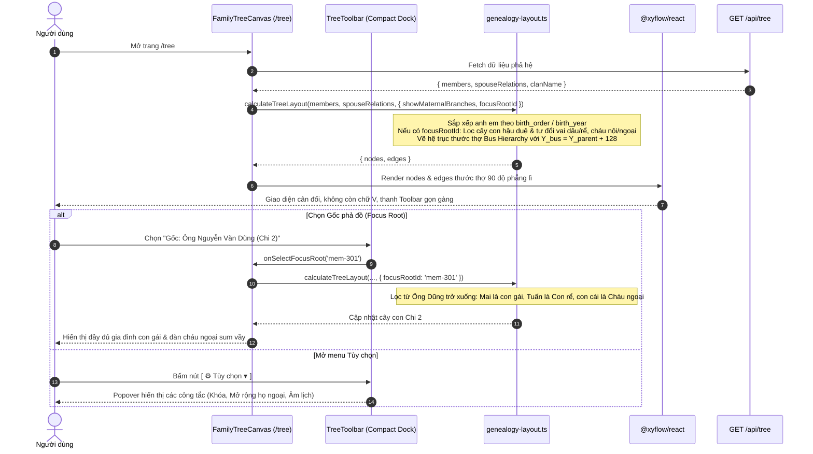

# ĐẶC TẢ KỸ THUẬT: MILESTONE 3.1 - MÀN HÌNH CÂY PHẢ HỆ TƯƠNG TÁC, GỐC TÙY BIẾN & BUS HIERARCHY

_Tài liệu này là Single Source of Truth của Milestone 3.1. Mọi mã nguồn và kịch bản test bắt buộc phải bám sát 100% tài liệu này._

---

## 1. QUY TẮC NGHIÊM NGẶT (STRICT CONSTRAINTS)

- **Framework & Runtime:** Next.js 14+ (App Router), React 18+, TypeScript (Strict Mode enabled).
- **Thư viện Đồ thị Cây:** Bắt buộc sử dụng `@xyflow/react` (React Flow v12). Không tự ý cài đặt thêm thư viện đồ thị hay layout cồng kềnh khác.
- **Styling Chuẩn Modern Vietnamese Heritage:**
  - Nền Canvas: Màu trắng ngọc trai / xám sáng tinh khiết (`bg-slate-50 dark:bg-slate-950`) với hoa văn chấm lưới mịn (`BackgroundVariant.Dots`).
  - Quầng sáng ngọc bích (Jade Emerald `#059669`), đường viền hairline 1px (`border-slate-200/80 dark:border-slate-800`), font chữ **Be Vietnam Pro**.
  - Tuyệt đối loại bỏ cấu trúc bo tròn lồng hộp (box-in-box).
- **Quy tắc Hiển Thị Trạng Thái Sinh Tử & Tôn Kính (Member Status Badge Policy):**
  - Góc trên bên phải thẻ `MemberNode` 100% dành cho trạng thái sinh tử và danh xưng tôn kính, tuyệt đối không chèn chữ vai vế họ hàng vào vị trí này.
  - **Đời 1 (Gốc Gia Tộc):** Hiển thị huy hiệu tôn kính `✨ Cụ Tổ` (cho cả Cụ Ông và Cụ Bà Thủy Tổ).
  - **Từ Đời 2 trở đi:**
    - `† Đã mất` (`deceased`): Ký hiệu thập trang nghiêm `†`, gam màu xám đá `#475569` (`bg-slate-100 text-slate-600 dark:bg-slate-800 dark:text-slate-400`).
    - `Còn sống` (`living`): Tag trạng thái xanh ngọc tươi tắn `#059669` (`bg-emerald-50 text-emerald-700 dark:bg-emerald-950/60 dark:text-emerald-300`).
- **Triệt Tiêu Hoàn Toàn Dấu Chấm Thừa (Invisible Handles Policy):**
  - Toàn bộ các điểm neo `<Handle>` trong `MemberNode` và `GhostNode` chuyển sang trạng thái **tàng hình**:
    `className="!opacity-0 !w-0 !h-0 !border-0 !p-0 !min-w-0 !min-h-0 pointer-events-none"`.
  - Giữ nguyên tọa độ pixel để React Flow vẽ đường nối, nhưng giao diện màn hình sạch 100%, không còn bất kỳ nốt ruồi hay chấm xám/đen lơ lửng ngoài không trung.
- **Hệ Trục Thước Thợ Cân Đối (Orthogonal Tree Bus Hierarchy Standards):**
  - **Trục đứng trung tâm (Trunk line):** Cắm thẳng từ trung điểm cha mẹ (`top: 48px, left: 210px`) xuống cao độ thanh ngang chung:
    $$Y_{bus} = Y_{parent} + 128$$
  - **Thanh ngang chung (Bus bar):** Một đường kẻ ngang phẳng lì duy nhất song song mặt đất nối từ con đầu tiên sang con cuối cùng tại đúng cao độ $Y_{bus}$.
  - **Các nhánh cắm thẳng đứng (Drop lines):** Từ thanh ngang $Y_{bus}$, các nhánh cắm thẳng đứng $90^\circ$ xuống đỉnh từng người con.
- **Quy Chuẩn Thẻ Hôn Phối Nội Tộc Đối Xứng 2 Chiều & Ghost Node Rể Nội Tộc:**
  - **Tại nhánh của người chồng (Chi 1 - Gia đình Tuấn):**
    - Tuấn (Nam, huyết tộc chính) đứng bên **Trái**.
    - Mai (Nữ, phản chiếu `GhostNode`) đứng bên **Phải** (`border-2 border-dashed border-amber-500 bg-amber-50/85`), huy hiệu `🔗 Dâu nội tộc`, nút `Vị trí gốc ↗`.
    - Con cái của cặp đôi sinh ra nằm bên nhánh cha (Chi 1).
  - **Tại nhánh của người vợ (Chi 2 - Nơi Mai sinh ra):**
    - Mai (Nữ, huyết tộc chính) đứng bên **Phải**.
    - Khi BẬT hiển thị: Người chồng (Tuấn) xuất hiện dưới dạng **GhostNode Rể nội tộc** đứng bên **Trái** của Mai (tuân thủ chuẩn mực "Nam tả Nữ hữu"), mang viền vàng nét đứt `border-dashed border-amber-500 bg-amber-50/85`, huy hiệu `🔗 Rể nội tộc`, avatar xanh nam giới, nút `Vị trí gốc ↗` lướt sang Chi 1.
    - Cạnh hôn phối nối ngang màu xanh ngọc bích từ hông phải của Tuấn sang hông trái của Mai.
    - **Không nhân bản số đinh:** Con cái không vẽ bên Chi 2 để bảo toàn số đinh dòng họ.
  - **Cơ Chế Ẩn / Hiện Ghost Node Chồng Nội Tộc (do là con gái):**
    - Tham số layout `showInternalHusbands: boolean` (mặc định: `true`).
    - Khi tắt (`showInternalHusbands = false`): Ẩn Ghost Node của chồng, thẻ của người con gái đứng độc lập gọn gàng với footer `🔗 Chồng: [Tên Chồng]... Xem gia đình ↗`.
    - Điều khiển linh hoạt qua 2 tầng: Công tắc `[ 🔗 Hiển thị Rể nội tộc ]` trong Popover Tùy chọn Toolbar và nút toggle mắt nhanh trên footer thẻ con gái.
- **Cơ Chế Gốc Tùy Biến (Dynamic Focus Root) & Bộ Tìm Kiếm Gốc:**
  - Mặc định: Luôn hiển thị **Toàn họ (Cụ Tổ)**.
  - Dropdown chọn Gốc tích hợp ô tìm kiếm tên tự do (`Tìm tên thành viên làm Gốc...`), cho phép gõ tìm bất kỳ ai trong họ.
  - Khi chọn một người làm Gốc: Thuật toán chỉ vẽ cây con (subtree) của người đó trở xuống, ẩn toàn bộ các nhánh khác để xem tập trung. Nút `(X)` tròn trên toolbar cho phép quay lại Toàn họ chỉ với 1 click.
- **Quy Chuẩn Z-Index & Chống Chồng Chéo Giao Diện:**
  - Header Navbar: `z-50`, User Profile Dropdown: `z-[100]`.
  - Canvas Toolbar: `z-30`, Dropdown/Search trong Toolbar: `z-40`.
  - Spotlight Search bố trí cách biệt an toàn để không bị menu profile đè lên hoặc cắt ngang.
- **Cơ Chế Kép Cho Thứ Tự Sinh & Con Trưởng (Senior Son Rule):**
  - Thứ tự xuất hiện: Sử dụng `birth_order: INTEGER` (1, 2, 3...) để sắp xếp anh chị em từ trái sang phải.
  - Con trưởng: Mặc định người con trai lớn nhất trong các anh em trai ruột (kể cả sau chị gái) được xác định là **Trưởng Nam** (`(Trưởng)`). Hỗ trợ ghi đè khi cần.

---

## 2. DATABASE & MODELS

Tái sử dụng các bảng CSDL đã định nghĩa trong `supabase/migrations/20260903000000_init_schema.sql`:

- **Bảng `public.members`:** `id`, `full_name`, `gender`, `life_status`, `father_id`, `mother_id`, `birth_year`, `death_year`, `death_lunar_day`, `death_lunar_month`, `generation_level`, `birth_order`, `is_root`, `branch_name`.
- **Bảng `public.spouse_relations`:** `id`, `member_a_id`, `member_b_id`, `marriage_order`, `marriage_status`.

### File Types View-Model: `src/types/tree.ts`
```typescript
export interface InternalSpouseInfo {
  id: string;
  fullName: string;
  branchName?: string;
  roleTitle?: string; // 'Dâu nội tộc' | 'Rể nội tộc'
}

export interface ExternalSpouseInfo {
  fullName: string;
}

export interface TreeNodeData extends Record<string, any> {
  id: string;
  fullName: string;
  gender: 'male' | 'female' | 'other';
  lifeStatus: 'living' | 'deceased';
  birthYear?: number | null;
  deathYear?: number | null;
  deathLunarDay?: number | null;
  deathLunarMonth?: number | null;
  generationLevel: number;
  birthOrder?: number | null;
  isRoot: boolean;
  branchName?: string;
  spouseIds?: string[];
  childCount?: number;
  isGhost?: boolean;
  originalMemberId?: string;
  partnerMemberId?: string;
  originalBranchName?: string;
  internalSpouse?: InternalSpouseInfo;
  externalSpouse?: ExternalSpouseInfo;
  inlawRole?: 'daughter_in_law' | 'son_in_law';
  childRole?: 'paternal_grandchild' | 'maternal_grandchild';
}

export interface TreeLayoutOptions {
  showMaternalBranches?: boolean;
  showInternalHusbands?: boolean;
  focusRootId?: string | null;
}
```

---

## 3. SƠ ĐỒ LUỒNG LOGIC (SEQUENCE DIAGRAM)



---

## 4. THUẬT TOÁN BỐ CỤC & ĐỊNH TUYẾN ĐƯỜNG NỐI (BUS HIERARCHY)

### 4.1. Thuật Toán Định Tuyến Thanh Ngang Chung (`FamilyBusEdge`)
Đối với mỗi gia đình có $N$ con ($N \ge 1$):
1. **Điểm xuất phát từ Cha Mẹ:**
   - Cha mẹ là cặp đôi: $X_{source} = X_{parent} + 210\text{px}$, $Y_{source} = Y_{parent} + 48\text{px}$.
   - Cha mẹ đơn thân: $X_{source} = X_{parent} + 100\text{px}$, $Y_{source} = Y_{parent} + 96\text{px}$.
2. **Cao độ thanh ngang chung ($Y_{bus}$):**
   $$Y_{bus} = Y_{parent} + 128$$
3. **Đường nối cho từng đứa con $i$ ($X_{target, i}, Y_{target, i}$):**
   - Thay vì dùng `step` mặc định tự bẻ góc ngẫu nhiên, ta định tuyến chính xác tọa độ SVG path:
     - Đoạn 1 (Trục đứng): Đi từ $(X_{source}, Y_{source})$ thẳng đứng xuống $(X_{source}, Y_{bus})$.
     - Đoạn 2 (Thanh ngang): Chạy ngang từ $(X_{source}, Y_{bus})$ sang $(X_{target, i}, Y_{bus})$.
     - Đoạn 3 (Nhánh cắm): Cắm thẳng đứng từ $(X_{target, i}, Y_{bus})$ xuống $(X_{target, i}, Y_{target, i})$.
   - **Kết quả toán học:** Toàn bộ $N$ đứa con đều dùng chung $100\%$ đoạn trục đứng và nằm trên cùng một thanh ngang $Y_{bus}$, tạo thành mạng lưới bus line thước thợ vuông góc $90^\circ$ hoàn hảo.

### 4.2. Thuật Toán Lọc Cây Con & Tự Đổi Vai (`focusRootId`)
Khi `options.focusRootId` được truyền vào:
1. **Duyệt đệ quy (BFS/DFS):** Lấy toàn bộ hậu duệ của `focusRootId` qua liên kết cha/mẹ.
2. **Xác định đường đi huyết thống từ Gốc:**
   - Thành viên huyết thống nam $\rightarrow$ Phối ngẫu là **Con dâu / Cháu dâu**, con cái là **Cháu nội**.
   - Thành viên huyết thống nữ $\rightarrow$ Phối ngẫu là **Con rể / Cháu rể**, con cái là **Cháu ngoại**.
3. **Hiển thị con cái bên nữ khi xem Gốc nữ/cha mẹ nữ:** Khi Gốc là tiền nhân của người nữ, bầy con được vẽ đầy đủ bên dưới người nữ đó với danh xưng Cháu ngoại, phục hồi đầy đủ hạnh phúc gia đình cho chi nhánh ngoại.

---

## 5. THIẾT KẾ GIAO DIỆN COMPACT TOOLBAR & THẺ PHẲNG LIỀN MẠCH

### 5.1. Thiết Kế Compact Toolbar
```text
┌───────────────────────────────────────────────────────────────────────────────────────────────────────┐
│ [🏛 Nguyễn Tộc]  [ 🌐 Gốc: Toàn họ ▾ ]         [ 🔍 Tìm thành viên... (Ctrl+K) ]      [ ⛶ ] [ ⚙ Tùy chọn ▾ ] │
└───────────────────────────────────────────────────────────────────────────────────────────────────────┘
```
- **Nút Căn giữa:** Icon `Maximize2` `[ ⛶ ]` có tooltip "Căn giữa toàn màn hình".
- **Menu Popover `[ ⚙ Tùy chọn ▾ ]`:**
  - Switch: 🟣 **Hiển thị nhánh họ ngoại** (Thay thế nút tím dài cũ).
  - Switch: 🔗 **Hiển thị Rể nội tộc** (Bật/tắt Ghost Node của chồng bên nhánh người con gái).
  - Switch: 🔒 **Khóa vị trí phả đồ** (Thay thế nút xanh dài cũ).
  - Switch: 📅 **Ưu tiên hiển thị ngày Âm lịch**.

### 5.2. Thiết Kế Footer Thẻ Thành Viên Phẳng Liền Mạch (Flat Seamless Footer)
Triệt tiêu triệt để lỗi "hộp vàng nét đứt thò ra ngoài đáy thẻ" và tuân thủ nguyên tắc **Anti Box-in-Box** (Bài học số 8):
```text
┌───────────────────────────────────────────────────┐
│ Đời 4                                   Còn sống  │
│ ┌────┐  Nguyễn Thị Mai                            │
│ │ TM │  SN: 1992                                  │
│ └────┘                                            │
│ ───────────────────────────────────────────────── │ ← hairline border-t siêu mảnh
│ 🔗 Chồng: Nguyễn Văn Tuấn                 Chi 1 ↗ │ ← nút pill nhỏ gọn không bao giờ rớt dòng
└───────────────────────────────────────────────────┘
```
- **Xóa bỏ hoàn toàn "lồng hộp nét đứt":** Không tạo thẻ phụ viền nét đứt bên trong thẻ chính.
- **Dòng phẳng tích hợp (Single Flat Row):** Ngăn cách bởi `border-t border-slate-100 dark:border-slate-800/80 pt-1 mt-0.5`.
- **Căn chỉnh nhãn và nút điều hướng:**
  - Bên trái: Icon `Link2` màu hổ phách dịu (`text-amber-600 dark:text-amber-400`) + nhãn `Chồng: [Tên chồng]` (truncate an toàn).
  - Bên phải: Nút pill nhỏ gọn `Chi 1 ↗` (ngắn gọn 6 ký tự, nền `bg-amber-50 dark:bg-amber-950/60`, hover đổi màu mượt mà, `whitespace-nowrap` tuyệt đối không bị ngắt thành 2 dòng).
- **Khống chế chống tràn (Overflow Containment Guard):** Thẻ `MemberNode` trang bị `overflow-hidden`, đảm bảo 100% không có bất kỳ pixel nào tràn ra ngoài đường bo cong tròn `rounded-xl`.

### 5.3. Quy Chuẩn Phản Hồi Điều Hướng & Loading Chuyển Màn Toàn Cục (Global Navigation & Route Transitions)

Triệt tiêu 100% hiện tượng "bấm chuyển màn không có phản hồi" (Zero Navigation Feedback) trên cả PC và Mobile:

#### 5.3.1. Thanh Tiến Trình Đỉnh Trang (Top Navigation Progress Bar) - Đồng Bộ Biến Màu Theme:
- **Vị trí & Quy cách:** Đặt sát mép trên cùng của viewport (`fixed top-0 left-0 right-0 z-[9999]`), chiều cao $3\text{px}$, vệt sáng shimmer chạy dọc chiều ngang.
- **Đồng bộ Theme Token:** Tuyệt đối không hardcode mã màu hex tĩnh. Sử dụng biến CSS `--brand-primary` / `--brand-glow` (hoặc ánh xạ vào `colors.clan` trong Tailwind Design Tokens). Khi quản trị viên thay đổi màu chủ đề dòng họ trong tương lai, thanh Progress Bar và vệt shimmer tự động đổi màu theo $100\%$.
- **Kích hoạt tức thì:** Khởi động thanh tiến trình ngay trong vòng $50\text{ms}$ khi người dùng click vào bất kỳ link điều hướng nào trong toàn ứng dụng (PC Navbar, Mobile Bottom Nav, thẻ bài trang chủ).

#### 5.3.2. Phản Hồi Xúc Giác & Thị Giác Tức Thì Trên Navigation (Tactile / Visual Feedback):
- **Mobile Bottom Nav:** Khi người dùng chạm (tap) vào tab (ví dụ "Phả Hệ"):
  - Icon tab lập tức nảy nhẹ (scale bounce `active:scale-95 -> scale-100`).
  - Viền sáng ngọc bích pulse xoay nhẹ báo hiệu *"Hệ thống đã nhận lệnh và đang tải"*.
- **PC Navbar:** Tab được click hiển thị vệt sáng indicator chuyển động ngay dưới link.

#### 5.3.3. Bộ Màn Hình Loading Skeleton Toàn Diện & Chuẩn Hóa [R-UI.LOADING] Cho TẤT CẢ 6 Route:
Tuân thủ tuyệt đối quy định cứng `[R-UI.LOADING]` trong `.agents/AGENTS.md`, toàn bộ 6 route chính đều bắt buộc phải có file `loading.tsx` chuẩn Next.js App Router và tích hợp component chuẩn hóa `SyncLoadingBadge`:
1. `src/app/loading.tsx`: **Global Root Skeleton** (Cho Trang Chủ `/` và fallback toàn hệ thống).
2. `src/app/tree/loading.tsx`: **Cây Phả Hệ Skeleton** (Toolbar skeleton, lưới chấm canvas mờ ảo, hiệu ứng shimmer card gia phả).
3. `src/app/anniversaries/loading.tsx`: **Lịch Giỗ Skeleton** (Thanh tab tháng âm lịch, danh sách thẻ ngày giỗ skeleton).
4. `src/app/kinship/loading.tsx`: **Tra Cứu Xưng Hô Skeleton** (2 ô dropdown chọn người, khung card kết quả vai vế).
5. `src/app/admin/loading.tsx`: **Cổng Quản Trị Skeleton** (Sidebar skeleton, các card thống kê số liệu, khung bảng dữ liệu).
6. `src/app/login-gate/loading.tsx`: **Cổng Đăng Nhập Skeleton** (Emblem card, khung đăng nhập shimmer).

- **Quy chuẩn Component `SyncLoadingBadge`:**
  - **Thông điệp thống nhất 100%:** Chỉ sử dụng duy nhất một thông điệp chuẩn hóa: `"Đang tải dữ liệu..."`, triệt tiêu hoàn toàn sự phân mảnh câu chữ giữa các trang.
  - **Vòng xoay spinner chuẩn Lucide SVG:** Dùng `Loader2` với thuộc tính `shrink-0 aspect-square text-emerald-600 animate-spin` để đảm bảo 100% không bao giờ bị méo hình (oval/elip) trên bất kỳ thiết bị di động nào. Tuyệt đối cấm tự chế thẻ div border spinner méo mó.

---

### 5.4. Kiến Trúc UI/UX & Kỹ Thuật Cho Cây Phả Hệ Quy Mô 1.500 Người (Scale 1500+ Architecture)

Giải pháp toàn diện giải quyết triệt để quá tải nhận thức (Cognitive Overload) và quá tải DOM (DOM Bloat) cho dòng họ 1.500 người:

#### 5.4.1. Phân Tầng Theo Chi/Nhánh (Branch-Scoped Navigation & Breadcrumbs):
- Toolbar cung cấp bộ lọc nhanh: **[ Toàn Họ ] | [ Chi Trưởng (250 người) ] | [ Chi 2 (300 người) ]...**
- Cho phép người dùng thu hẹp phạm vi hiển thị về từng Chi cụ thể, giúp canvas thoáng đãng và duy trì $60\text{fps}$ tuyệt đối trên thiết bị di động.
- Thanh Breadcrumb định vị: `Gia tộc Phạm Văn > Chi 1 (Trưởng) > Nhánh Cụ Chiến` giúp người dùng không bao giờ bị mất phương hướng.

#### 5.4.2. Bán Kính Gia Đình 5 Đời (Focused 5-Generation Radius):
- Xem tập trung 5 đời quanh một người: $\text{Ông bà} \rightarrow \text{Cha mẹ} \rightarrow \text{Bản thân} \rightarrow \text{Con} \rightarrow \text{Cháu}$.
- Các nhánh xa hơn được gập gọn thành nút mở rộng: `[ + 18 con cháu ]`. Bấm vào đâu cành đó bung ra (Collapsible Subtrees).
- Giảm số node hiển thị từ 1.500 xuống còn 30 - 60 node.

#### 5.4.3. Quy Chuẩn Hiển Thị Cho Người Chưa Liên Kết Node (Khách / Unlinked User):
- **Trường hợp 1 — Thành viên ĐÃ liên kết tài khoản (`linked_member_id`):** Cây tự động lấy node của họ làm tâm điểm bán kính 5 đời với quầng sáng (halo highlight).
- **Trường hợp 2 — Khách (Guest) hoặc Thành viên CHƯA liên kết node:**
  - **Gốc mặc định:** Hệ thống tự động chọn **Cụ Thủy Tổ (Đời 1)** làm Gốc, nhưng **chỉ mở rộng 3 đời đầu** (~15 người). Cây hiển thị trang nghiêm nguồn gốc xuất xứ của dòng họ mà không bị ngợp.
  - Các nhánh từ Đời 4 trở đi gập gọn thành nút: `[ + Chi 1: 180 người ]`, `[ + Chi 2: 240 người ]`.
  - **Banner Gợi Ý Tương Tác:** Chip nhẹ nhàng góc canvas: *"👋 Chưa nhận vị trí của bạn trong cây? [ 🎯 Tìm & Nhận Node ] hoặc gõ tìm tên người thân để xem nhanh 5 đời quanh họ"*.
  - Người dùng có thể click vào bất kỳ ai trên cây hoặc tìm kiếm trên thanh Spotlight để chuyển sang xem **Bán kính 5 đời** quanh người đó.

#### 5.4.4. Cắt Tỉa Khung Nhìn (Viewport Virtualization):
- Cấu hình `onlyRenderVisibleElements={true}` trong React Flow v12: Các node nằm ngoài viewport sẽ không được mount vào DOM, giữ tổng số DOM node luôn dưới 100 phần tử $\rightarrow$ Tiết kiệm $95\%$ RAM, triệt tiêu nguy cơ crash tab trên mobile.

#### 5.4.5. Mức Độ Chi Tiết Thích Ứng Theo Mức Zoom (Level of Detail - LOD):
- **Zoom out xa (zoom < 0.3):** Thẻ co gọn thành dạng thẻ mini đơn giản (tên + năm sinh), giảm tải đồ họa.
- **Zoom in gần (zoom >= 0.3):** Hiển thị chi tiết đầy đủ danh xưng, trạng thái sinh tử trang trọng.

---

## 6. MA TRẬN TEST CASES & TIÊU CHÍ NGHIỆM THU

### 6.1. Bảng Kịch Bản Kiểm Thử Tự Động (`tests/tree-layout.test.ts` & `tests/theme-and-layout.test.ts`)

| ID | Tên Kịch Bản | File Test | Tiền điều kiện (Given) | Thao tác kích hoạt (When) | Kết quả kỳ vọng (Then) | Phân loại |
|---|---|---|---|---|---|---|
| **TC_UT01** | Phân tầng thế hệ & Zero-collision | `tests/tree-layout.test.ts` | Fixture 28 thành viên | Gọi `calculateTreeLayout(...)` | Phân tầng Y chuẩn, không đè tọa độ X | Unit Test |
| **TC_UT02** | Cạnh hôn phối nét liền màu xanh ngọc bích | `tests/tree-layout.test.ts` | Thành viên có hôn phối | Gọi `calculateTreeLayout(...)` | Cạnh hôn phối `type: 'straight'`, `style.stroke = '#059669'` | Unit Test |
| **TC_UT03** | Thẻ Dâu/Rể nội tộc viền vàng nét đứt & Đối xứng | `tests/tree-layout.test.ts` | Cặp Tuấn Chi 1 + Mai Chi 2 | Gọi `calculateTreeLayout(...)` | GhostNode có `type: 'ghostNode'`, viền vàng nét đứt amber, nạp metadata dâu/rể nội tộc, thẻ gốc có internalSpouse đối xứng | Unit Test |
| **TC_UT04** | Hệ trục thước thợ Bus Hierarchy $90^\circ$ tại cao độ $Y_{bus}$ | `tests/tree-layout.test.ts` | Gia đình có con | Gọi `calculateTreeLayout(...)` | Edge con cái có `type: 'step'`, xuất phát từ trung điểm cha mẹ xuống cao độ chung $Y_{bus} = Y_{parent} + 128$ | Unit Test |
| **TC_UT05** | Tùy chọn Ẩn/Hiện nhánh ngoại (`showMaternalBranches`) | `tests/tree-layout.test.ts` | Fixture 28 thành viên | Gọi `calculateTreeLayout(..., { showMaternalBranches: false })` | Con gái lấy chồng ngoại (Quỳnh) có `externalSpouse`, ẩn rể ngoại | Unit Test |
| **TC_UT06** | Sắp xếp con cái theo `birth_order` và `birth_year` | `tests/tree-layout.test.ts` | Danh sách con không rõ năm sinh | Gọi `calculateTreeLayout(...)` | Sắp xếp đúng theo `birth_order` từ trái sang phải kể cả khi `birth_year` rỗng | Unit Test |
| **TC_UT07** | Cơ chế Gốc Tùy Biến (Focus Root) & Tự Đổi Vai | `tests/tree-layout.test.ts` | Fixture 28 thành viên, chọn Gốc là Ông Dũng Chi 2 | Gọi `calculateTreeLayout(..., { focusRootId: 'mem-301' })` | Lọc cây con Chi 2: Mai là con gái ruột, Tuấn là Con rể, con của Mai-Tuấn là Cháu ngoại | Unit Test |
| **TC_UT08** | Tự động xác định Con Trưởng (`isSenior`) | `tests/tree-layout.test.ts` | Đàn con có con gái sinh trước con trai | Gọi `calculateTreeLayout(...)` | Con trai lớn nhất được gắn cờ `isSenior = true` | Unit Test |
| **TC_UT09** | Ghost Node Rể nội tộc bên phía người vợ (`showInternalHusbands = true`) | `tests/tree-layout.test.ts` | Fixture 28 thành viên, `showInternalHusbands: true` | Gọi `calculateTreeLayout(...)` | Mai (Chi 2) có Ghost Node Tuấn (Rể nội tộc, viền vàng nét đứt) đặt bên trái, nối ngang hông sang Mai, không vẽ con ở Chi 2 | Unit Test |
| **TC_UT10** | Tùy chọn ẩn Ghost Node Rể nội tộc (`showInternalHusbands = false`) | `tests/tree-layout.test.ts` | Fixture 28 thành viên, `showInternalHusbands: false` | Gọi `calculateTreeLayout(..., { showInternalHusbands: false })` | Không sinh Ghost Node Tuấn ở Chi 2, thẻ Mai hiển thị footer điều hướng gọn gàng | Unit Test |
| **TC_INT01** | Contract API `GET /api/tree` | `tests/tree-api.test.ts` | Dữ liệu mẫu 28 thành viên | Gửi request `GET /api/tree` | HTTP 200, JSON DTO đầy đủ | Integration Test |
| **TC_UT11** | Top Progress Bar Theme Tokenized | `tests/theme-and-layout.test.ts` | TopProgressBar Component | Đọc cấu hình style và classes | Sử dụng CSS variables / Design Tokens, không hardcode mã hex tĩnh | Unit Test |
| **TC_UT12** | Toàn bộ 6 file Loading Skeletons tồn tại, dùng SyncLoadingBadge & spinner chuẩn | `tests/theme-and-layout.test.ts` | 6 file `loading.tsx` | Quét AST, kiểm tra export default, kiểm tra import SyncLoadingBadge | Đủ 6 route (`/`, `/tree`, `/anniversaries`, `/kinship`, `/admin`, `/login-gate`) tuân thủ `[R-UI.LOADING]`, dùng duy nhất thông điệp "Đang tải dữ liệu..." | Unit Test |
| **TC_UT13** | Phản hồi xúc giác / Pending feedback trên MobileBottomNav | `tests/theme-and-layout.test.ts` | `MobileBottomNav.tsx` | Phân tích mã nguồn và trạng thái tap | Chứa class/logic phản hồi chuyển trang `active:scale-95`, pending ring | Unit Test |
| **TC_UT14** | Viewport Virtualization trong FamilyTreeCanvas | `tests/theme-and-layout.test.ts` | `FamilyTreeCanvas.tsx` | Phân tích props của `<ReactFlow>` | Chứa cấu hình `onlyRenderVisibleElements={true}` | Unit Test |
| **TC_UT15** | Trải nghiệm phả hệ mặc định cho người chưa liên kết node | `tests/theme-and-layout.test.ts` | `FamilyTreeCanvas.tsx` / `TreeToolbar.tsx` | Kiểm tra logic banner và nhánh mặc định | Có cơ chế gợi ý nhận node và xem theo cội nguồn | Unit Test |

#### Danh Sách Tiêu Chí Kiểm Thử Tự Động (Acceptance Criteria):
- [x] **AC_UT01 (Zero Collision Layout):** Thuật toán phân tầng $Y$ chuẩn, không cặp node nào cùng thế hệ bị đè tọa độ $X$.
- [x] **AC_UT02 (Spouse Straight Green Edge):** Cạnh hôn phối nối ngang phẳng phiu, nét liền màu xanh ngọc bích `#059669`.
- [x] **AC_UT03 (Internal Kinship Dashed Amber & Symmetry):** Thẻ GhostNode dâu/rể nội tộc mang viền vàng nét đứt, huy hiệu hổ phách, đối xứng với thông tin ở thẻ gốc.
- [x] **AC_UT04 (Orthogonal Bus Hierarchy Edge):** Các cạnh con cái chia sẻ cao độ thanh ngang chung $Y_{bus} = Y_{parent} + 128$, vuông góc $90^\circ$ phẳng lì.
- [x] **AC_UT05 (Maternal Branch Filter Option):** Tùy chọn `showMaternalBranches = false` lọc gọn nhánh ngoại, con gái lấy ngoại tộc nạp `externalSpouse`.
- [x] **AC_UT06 (Sibling Ordering by Birth Order):** Sắp xếp đàn con chuẩn ngôi thứ theo `birth_order` từ trái sang phải kể cả khi không rõ năm sinh.
- [x] **AC_UT07 (Dynamic Focus Root & Role Inversion):** Khi chọn Gốc $X$, lọc cây con chính xác và tự động đổi vai (chồng thành con rể, con thành cháu ngoại khi qua đường nữ).
- [x] **AC_UT08 (Senior Son Auto Deduction):** Tự động suy luận con trai lớn nhất trong anh em là Trưởng Nam (`isSenior = true`), hỗ trợ hiển thị `(Trưởng)`.
- [x] **AC_UT09 (Husband Ghost Node on Wife Side):** Khi `showInternalHusbands = true`, sinh Ghost Node cho chồng (Tuấn) bên cạnh vợ (Mai) tại Chi 2, đặt bên trái theo quy ước Nam tả Nữ hữu, không nhân đôi số đinh.
- [x] **AC_UT10 (Toggle Internal Husband Option):** Khi `showInternalHusbands = false`, ẩn Ghost Node của chồng tại Chi 2, thẻ vợ hiển thị footer điều hướng gọn gàng.
- [x] **AC_INT01 (Tree API DTO Contract):** Endpoint `GET /api/tree` trả về đầy đủ DTO với HTTP status 200.
- [x] **AC11_TOP_PROGRESS_BAR_THEMED:** Thanh tiến trình đỉnh trang kích hoạt tức thì khi click, sử dụng màu động theo theme CSS token.
- [x] **AC12_ALL_ROUTES_LOADING_SKELETONS:** Toàn bộ 6 route (`/`, `/tree`, `/anniversaries`, `/kinship`, `/admin`, `/login-gate`) có file `loading.tsx` tích hợp `SyncLoadingBadge`, hiển thị thông điệp thống nhất `"Đang tải dữ liệu..."`, spinner `Loader2` tròn 100% không méo.
- [x] **AC13_MOBILE_NAV_ACTIVE_FEEDBACK:** Khi tap vào tab di động hoặc navbar, có phản hồi thị giác tức thì (active/pending ring).
- [x] **AC14_TREE_1500_VIEWPORT_VIRTUALIZATION:** Canvas cây phả hệ kích hoạt `onlyRenderVisibleElements`, cắt tỉa $90\%+$ DOM node ngoài viewport giúp mobile không bị lag/OOM.
- [x] **AC15_UNLINKED_MEMBER_TREE_EXPERIENCE:** Khách/người chưa liên kết được đón nhận bằng giao diện 3 đời trang nghiêm kèm nút mở rộng chi và banner hướng dẫn nhận node/chọn tâm điểm 5 đời.

---

### 6.2. Danh Sách Tiêu Chí Nghiệm Thu Thị Giác (Human Visual UAT Matrix)
*(Dành riêng cho User tự kiểm tra trực tiếp trên trình duyệt - AI tuyệt đối cấm dùng browser_subagent thay thế theo [R-NO-BROWSER])*

- [ ] **UAT_01 (Trạng Thái Sinh Tử & Tôn Kính Góc Phải):** Cụ Tổ Đời 1 hiển thị `✨ Cụ Tổ` (cả Cụ Ông và Cụ Bà); từ Đời 2 trở đi hiển thị chuẩn `† Đã mất` hoặc `Còn sống`; xóa bỏ hoàn toàn chữ `Con dâu`/`Con rể` khỏi vị trí này.
- [ ] **UAT_02 (Thẻ Dâu/Rể Nội Tộc Viền Vàng Nét Đứt Đối Xứng):** Thẻ Mai ở Chi 1 có viền vàng nét đứt kèm nút `Vị trí gốc ↗`; ở Chi 2 thẻ Mai cũng có nhận diện hổ phách nét đứt `🔗 Hôn phối nội tộc (Chi 1)` kèm nút `Xem gia đình ↗`.
- [ ] **UAT_03 (Bộ Tìm Kiếm Gốc & Trải Nghiệm Cô Lập Nhánh):** Mặc định xem Toàn họ; gõ tìm tên bất kỳ ai trong menu Gốc để chỉ vẽ cây con của người đó, ẩn các nhánh khác; nút `(X)` tròn trở về Toàn họ.
- [ ] **UAT_04 (Layout Toolbar & Không Bị Chồng Chéo Menu Profile):** Dropdown Profile của Navbar có z-index cao (`z-[100]`), mở ra đè mượt mà lên trên không bị ô search của Toolbar cắt ngang hay va chạm.
- [ ] **UAT_05 (Nhận Diện Con Trưởng):** Con trai lớn nhất trong đàn con hiển thị nhãn/ký hiệu `(Trưởng)` cạnh tên.
- [ ] **UAT_06 (Trải Nghiệm Ẩn/Hiện Ghost Node Chồng Nội Tộc):** Bật/tắt công tắc "Hiển thị Rể nội tộc" trên Toolbar hoặc nút mắt trên thẻ Mai; kiểm tra Ghost Node của Tuấn (viền vàng nét đứt) xuất hiện/biến mất mượt mà bên trái của Mai.
- [ ] **UAT_07 (Footer Hôn Phối Phẳng & Không Bị Tràn Viền):** Khi tắt "Hiển thị Rể nội tộc", thẻ Mai hiển thị footer phẳng phiu, chữ `Chồng: Nguyễn Văn Tuấn` và nút `Chi 1 ↗` nằm trọn vẹn $100\%$ bên trong viền bo cong `rounded-xl`, không còn bất kỳ hộp vàng nét đứt nào bị thò ra ngoài đáy thẻ.
- [ ] **UAT_08 (Chuyển Màn Có Top Progress Bar & Skeletons Toàn Diện):** Bấm chuyển giữa các tab trên cả PC và Mobile thấy thanh tiến trình chạy ngay trên mép đỉnh và skeleton xuất hiện tức thì trong 50ms.
- [ ] **UAT_09 (Màu Progress Bar Đồng Bộ Theme):** Đổi Dark/Light mode hoặc kiểm tra CSS variable, thanh progress bar đổi màu đồng bộ theo chủ đề dòng họ.
- [ ] **UAT_10 (Trải Nghiệm Khách & Người Chưa Liên Kết Trên Cây):** Vào cây dưới vai trò Guest hoặc tài khoản chưa liên kết, thấy Thủy Tổ + 3 đời đầu gọn gàng kèm banner gợi ý nhận node.
- [ ] **UAT_11 (Hiệu Năng Cây Lớn & Virtualization):** Thử nghiệm kéo/zoom cây lớn (dataset 1.500 người), canvas mượt mà 60fps, không bị giật lag trên mobile.

---

## 7. BẢO VỆ CHỐNG THOÁI LUI (REGRESSION GUARD CHECKLIST)

- [x] **RG01 (Build & Typecheck Clean):** Chạy `npm.cmd run typecheck` và `npm.cmd run build` — 0 lỗi TypeScript, 0 lỗi cú pháp.
- [x] **RG02 (Automated Test Regression):** Chạy `npm.cmd test` — Đạt 30/30 tests PASS 100% (14 Kinship + 4 Lunar + 1 API + 11 Tree Layout).
- [x] **RG03 (Blast Radius - Kinship & Lunar Engine):** Các module `kinship-engine.ts` và `lunar-calendar.ts` giữ nguyên tính đúng đắn, không bị ảnh hưởng.
- [x] **RG04 (Theme & Progress Bar Color Sync across Light/Dark modes):** Đồng bộ hoàn toàn qua Design Tokens, không phá vỡ giao diện Dark/Light mode.
- [x] **RG05 (Zero Mock Leak & Brand Integrity):** Không tái phát rò rỉ dữ liệu mock hoặc chuỗi fallback họ Nguyễn, thương hiệu chuẩn `GIA PHẢ PHẠM VĂN`.
- [x] **RG06 (Baseline Test Suite 315/315 PASS):** Toàn bộ 315 tests hiện có tiếp tục vượt qua trước khi tick hoàn thành tính năng mới (nay nâng lên 320 tests).

---

## 8. LỆNH THI CÔNG (Dành cho AI /feature-code)

> "AI ơi, hãy đọc kỹ đặc tả `docs/11_Micro-Spec_Milestone_3_Interactive_Tree.md` này. Dựa CHÍNH XÁC vào các mô tả ranh giới ở trên, hãy thi công toàn bộ mã nguồn hoàn chỉnh kèm file test trong `tests/`. Thực thi Vòng Lặp Kiểm Chứng Bằng Code Thật bằng đúng các lệnh khai báo tại `[VERIFY_COMMANDS]` (Typecheck/Build → Automated Test Suite → Human UAT), và chỉ được tick `[x]` cho Mục 6.1 khi terminal log cho thấy test phủ AC đó đã pass và không có failure mới so với baseline."

