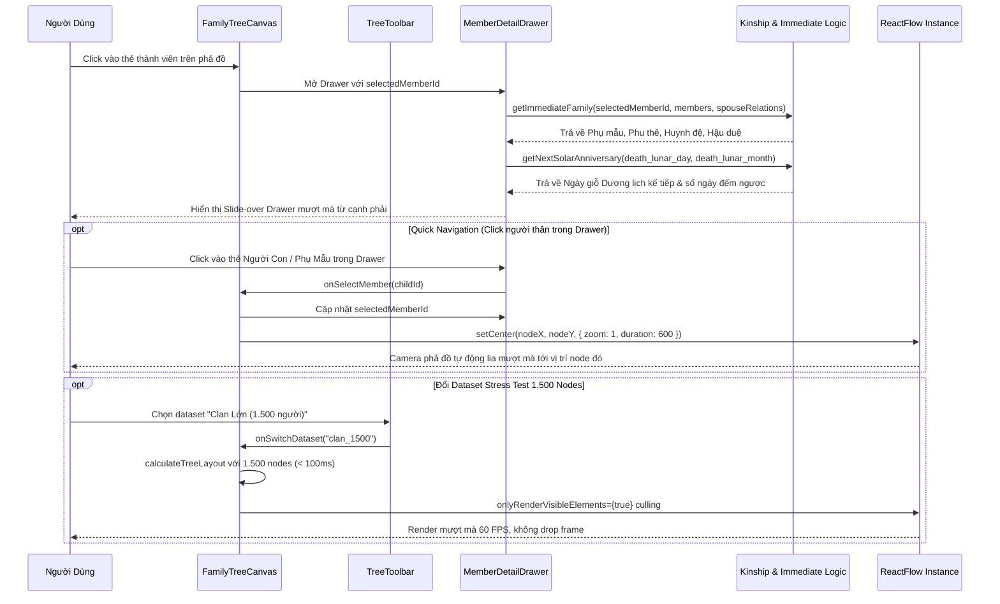

# ĐẶC TẢ KỸ THUẬT VI MÔ: MILESTONE 3.2 - MEMBER DETAIL DRAWER, MULTI-SPOUSE CHILD SUB-CLUSTERING & LARGE-SCALE CLAN STRESS TESTING

_Tài liệu này dùng để giới hạn Context Window. AI chỉ được phép đọc, suy luận và sinh code cho ĐÚNG các file được đề cập trong đây._

---

## 1. QUY TẮC NGHIÊM NGẶT (STRICT CONSTRAINTS)

- **Thư viện cho phép:** Next.js 14 App Router, React 18, TypeScript, TailwindCSS, Lucide Icons (`lucide-react`), `@xyflow/react`.
- **Ràng buộc UI:**
  - Không dùng thư viện popup/drawer bên ngoài làm nặng bundle. Xây dựng Slide-over Drawer thuần React + TailwindCSS với CSS transitions mượt mà (`translate-x-0` / `translate-x-full`), `backdrop-blur-sm`, hỗ trợ phím `Escape` để đóng và click outside.
  - Ngôn ngữ thiết kế: **Modern Vietnamese Heritage** (Amber, Warm Slate, viền hairline tinh tế, badge bo tròn mềm mại).
  - **Total Ban on AI Browser Subagent (`[R-NO-BROWSER]`):** Tuyệt đối không dùng browser subagent để kiểm thử giao diện. Mọi kiểm thử giao diện thuộc về User ở Mục 7.2 (Human UAT).
- **Ràng buộc hiệu năng (`onlyRenderVisibleElements`):** Bắt buộc kích hoạt cờ `onlyRenderVisibleElements={true}` trong `<ReactFlow>` để giữ vững 60 FPS khi hiển thị quy mô $1.500$ nodes.
- **Ràng buộc kiểm chứng (`[R-VERIFY]` Version 7):** Giữ nguyên $36/36$ tests cũ pass, bổ sung các tests tự động mới cho trường hợp đa thê & phân nhóm con, 0 lỗi Typecheck & Build.

---

## 2. DATABASE & MODELS

### 2.1. File: `src/types/tree.ts`
Mở rộng interface `MemberRecord` với các trường phục vụ hồ sơ chi tiết và bài toán khuyết danh:

```typescript
export interface MemberRecord {
  id: string;
  clan_id?: string;
  full_name: string;
  gender: 'male' | 'female';
  generation_level: number;
  father_id?: string | null;
  mother_id?: string | null;
  birth_year?: number | null;
  death_year?: number | null;
  death_lunar_day?: number | null;
  death_lunar_month?: number | null;
  is_alive?: boolean;
  is_root?: boolean;
  is_senior?: boolean;
  birth_order?: number | null;
  branch_name?: string | null;

  // CÁC TRƯỜNG MỞ RỘNG MỚI (MILESTONE 3.2)
  is_anonymous?: boolean;            // Cờ xác định Node Khuyết danh (hiển thị viền dashed)
  alias_name?: string | null;        // Bí danh, tên tự, tên húy
  burial_location?: string | null;   // Nơi an táng, vị trí mộ phần
  notes?: string | null;             // Phả ký, công trạng, hoàn cảnh đặc biệt (Liệt sỹ, đi tu, con nuôi...)
  death_lunar_year_name?: string | null; // Năm Can Chi khi mất (nếu có, VD: "Ất Mùi")
  claimed_by?: string | null;        // ID user đã liên kết nhận node
}
```

### 2.2. Model cấu trúc Phân Cụm Đàn Con & Mạng Lưới Thân Tộc 1 Đời:
```typescript
export interface ChildrenGroup {
  motherId: string | null;
  motherName: string;
  marriageOrder?: number;
  children: MemberRecord[];
}

export interface ImmediateFamily {
  targetMember: MemberRecord;
  parents: {
    father?: MemberRecord;
    mother?: MemberRecord;
  };
  spouses: Array<{
    member: MemberRecord;
    relation: SpouseRelationRecord;
  }>;
  siblings: MemberRecord[];
  children: MemberRecord[];
  childrenGroups: ChildrenGroup[]; // Phân cụm con cái theo từng người mẹ & con riêng
}
```

Trong `TreeNodeData`:
```typescript
motherName?: string;
motherOrderTitle?: string; // "Con bà cả", "Con bà hai", "Chưa rõ mẹ"
```

---

## 3. SƠ ĐỒ LUỒNG LOGIC (SEQUENCE DIAGRAM)



---

## 4. LOGIC NGHIỆP VỤ & UTILITIES

### 4.1. File: `src/lib/tree-layout/immediate-family.ts`
- **Hàm `getImmediateFamily`:**
  - _Input:_ `(targetId: string, members: MemberRecord[], spouseRelations: SpouseRelationRecord[])`
  - _Logic xử lý:_
    1. Tìm `targetMember` từ `members`.
    2. **Phụ mẫu:** Lấy `father` (từ `targetMember.father_id`) và `mother` (từ `targetMember.mother_id`).
    3. **Phu thê:** Tìm các `spouseRelations` liên quan đến `targetId`, lấy danh sách các `MemberRecord` phối ngẫu tương ứng (sắp xếp theo `marriage_order`).
    4. **Huynh đệ (Siblings):** Tìm tất cả thành viên có cùng `father_id` (hoặc `mother_id`) với `targetMember`, loại trừ chính `targetMember`. Sắp xếp theo `birth_order` / `birth_year`.
    5. **Hậu duệ (Children):** Tìm tất cả thành viên có `father_id === targetId` hoặc `mother_id === targetId`. Sắp xếp theo `birth_order` / `birth_year`.
    6. **Phân cụm theo mẹ (`childrenGroups`):** Gọi `groupChildrenByMother(targetMember.id, children, spouseRelations, memberMap)` để chia đàn con thành:
       - Các nhóm con của từng người vợ theo thứ tự `marriage_order` (Vợ cả, Vợ hai...).
       - Nhóm con riêng khuyết mẹ (`mother_id == null` hoặc mẹ không nằm trong danh sách vợ).
  - _Output:_ Đối tượng `ImmediateFamily`.

- **Hàm `groupChildrenByMother` (Mới):**
  - _Input:_ `(primaryId: string, children: MemberRecord[], spouseRelations: SpouseRelationRecord[], memberMap: Map<string, MemberRecord>)`
  - _Logic xử lý:_
    - Lấy danh sách các bà vợ của `primaryId` từ `spouseRelations`, sắp xếp theo `marriage_order || 1`.
    - Duyệt qua từng bà vợ: gom các con có `mother_id === wife.id` vào `ChildrenGroup` tương ứng.
    - Tập hợp các con có `mother_id == null` hoặc `mother_id` không khớp với bất kỳ bà vợ nào vào nhóm `motherId: null`, `motherName: 'Chưa rõ thông tin mẹ'`.
  - _Output:_ `ChildrenGroup[]`.

- **Hàm `getNextSolarAnniversary`:**
  - _Input:_ `(lunarDay?: number | null, lunarMonth?: number | null)`
  - _Logic xử lý:_
    - Nếu không có ngày/tháng âm $\rightarrow$ trả về `null`.
    - Lấy năm dương lịch hiện tại $Y_{curr}$.
    - Dùng hàm chuyển đổi âm lịch sang dương lịch (`convertLunar2Solar` từ `src/lib/lunar-calendar/lunar-core.ts`) để tìm ngày dương lịch tương ứng trong năm $Y_{curr}$.
    - Nếu ngày đó đã qua trong năm nay $\rightarrow$ tính cho năm kế tiếp $Y_{curr} + 1$.
    - Tính khoảng cách `daysLeft` (số ngày còn lại đến ngày giỗ).
  - _Output:_ `{ solarDateStr: string; daysLeft: number } | null`.

### 4.2. File: `src/fixtures/generate-large-clan.ts`
- **Hàm `generateLargeClan`:**
  - _Input:_ `(targetSize: number = 1500)`
  - _Logic sinh dữ liệu (DAG phân cấp nghiêm ngặt):_
    - Sinh họ tên người Việt chân thực từ kho Họ (`Phạm`, `Nguyễn`, `Trần`, `Lê`,...), Đệm (`Văn`, `Thị`, `Kim`, `Khắc`, `Đình`,...), Tên (`Chiến`, `Đức`, `Châu`, `Quyền`, `Minh`,...).
    - Xây dựng 13–15 thế hệ với quy mô mở rộng hình tháp gia tộc.
    - Đảm bảo $100\%$ không chu trình (thế hệ $K$ chỉ nhận cha mẹ từ thế hệ $K-1$).
    - Tỷ lệ: $50\%$ nam, $50\%$ nữ.
    - Gán ngày giỗ Âm lịch ngẫu nhiên nhưng hợp lệ (ngày 1–30, tháng 1–12).
    - Tạo các mối quan hệ `SpouseRelationRecord` hợp lệ giữa các cặp vợ chồng.
    - Cấy 2 ca hôn nhân nội tộc (để kiểm thử Ghost Node 🔗 trên diện rộng).
    - Cấy 1 Node Khuyết danh ở Đời 2 (`is_anonymous: true`, `full_name: '(Khuyết danh Đời 2)'`).
  - _Output:_ `{ members: MemberRecord[]; spouseRelations: SpouseRelationRecord[] }`.

### 4.3. File: `src/lib/tree-layout/genealogy-layout.ts` (Nâng cấp Phân cụm Đa thê & Con riêng)
- **Kiến trúc Mô hình 1 (Xếp Một Phía sang phải):**
  - Thứ tự hàng ngang: `[Chồng] ═══════ [Vợ Cả] ═══════ [Vợ Hai] ═══════ ...`
  - Khoảng cách giữa các vợ chồng: `SPOUSE_GAP = 20px`.
- **Cơ chế Phân chia Sub-bus & Trọng tâm Cụm con:**
  1. Khi người cha có nhiều vợ hoặc có con riêng không mẹ, đàn con được phân thành $K$ cụm nhỏ (`ChildCluster`):
     - **Cụm con riêng (`mother_id == null`):** Nối từ cổng `children-single` tại đáy thẻ của người cha.
     - **Cụm con của Vợ thứ $i$:** Nối từ cổng `children-spouse-${i}` tại trung điểm giữa người cha và vợ thứ $i$ (hoặc tại vị trí vợ thứ $i$).
  2. **Zero Crossing Edges (Tuyệt đối không cắt chéo dây):**
     - Sắp xếp các cụm con theo chiều từ trái sang phải: `Cụm con riêng` $\rightarrow$ `Cụm con Bà Cả` $\rightarrow$ `Cụm con Bà Hai`.
     - Mỗi cụm con duy trì khoảng cách đệm `SIBLING_GAP = 40px` với cụm kế tiếp.
     - Trong từng cụm, các anh chị em cùng mẹ vẫn được sắp xếp theo thứ tự năm sinh / `birth_order`.
  3. Cập nhật `FamilyUnit.width`: Tổng chiều rộng của cụm gia đình là $\max(\text{coupleWidth}, \sum \text{clusterWidths} + \text{gaps})$.

---

## 5. FRONTEND UI & COMPONENTS

### 5.1. File: `src/components/tree/MemberDetailDrawer.tsx` (Cập nhật Phân nhóm Con cái)
- **Props:**
  ```typescript
  interface MemberDetailDrawerProps {
    memberId: string | null;
    isOpen: boolean;
    onClose: () => void;
    members: MemberRecord[];
    spouseRelations: SpouseRelationRecord[];
    onSelectMember: (id: string) => void;
    onSetFocusRoot: (id: string) => void;
  }
  ```
- **Các khối giao diện (Modern Vietnamese Heritage):**
  1. **Backdrop & Panel Container:** Nền mờ `bg-slate-900/40 backdrop-blur-sm`, Panel cố định mép phải `w-full max-w-md bg-white dark:bg-slate-900 shadow-2xl border-l border-slate-200 dark:border-slate-800`.
  2. **Header:** Nút đóng `X` (kèm phím tắt Esc), Avatar tròn theo giới tính, Họ tên to bản, Bí danh (nếu có), Badge Đời thứ X, Badge Con trưởng / Trưởng nam, Badge Còn sống / Đã khuất (hoặc Khuyết danh).
  3. **Section Phong Tục & Giỗ Chạp (Nếu đã khuất):**
     - Thẻ nổi bật màu hổ phách/vàng rơm: Ngày giỗ Âm lịch (`Ngày DD Tháng MM Âm lịch`).
     - **Ngày giỗ Dương lịch kế tiếp tương ứng:** Hiển thị ngày dương lịch và số ngày đếm ngược (VD: *"Còn 42 ngày"*).
     - Hưởng thọ & Nơi an táng / Mộ phần (`burial_location`).
  4. **Section Phả Ký & Hoàn Cảnh (`notes`):** Hiển thị các lưu bút lịch sử (Liệt sỹ, đi tu, con nuôi...).
  5. **Section Mạng Lưới Thân Tộc 1 Đời (Immediate Family):**
     - Khối Phụ Mẫu (Cha, Mẹ).
     - Khối Phu Thê (Vợ cả, Vợ hai, Chồng).
     - Khối Huynh Đệ (Anh chị em ruột).
     - **Khối Hậu Duệ (Con cái):**
       - Nếu chỉ có 1 mẹ: Hiển thị danh sách con thông thường.
       - Nếu người cha có nhiều vợ hoặc có con riêng: Tự động phân chia thành các tiểu mục trang trọng:
         - 🌸 *Con với bà [Họ Tên] (Vợ cả - N người)*
         - 🌸 *Con với bà [Họ Tên] (Vợ hai - M người)*
         - ❓ *Con chưa rõ thông tin mẹ (K người)*
     - Mỗi người thân được biểu diễn bằng một thẻ nhỏ (MiniCard). Click vào thẻ $\rightarrow$ gọi `onSelectMember(relativeId)` để đổi dữ liệu Drawer và lia camera Canvas!
  6. **Action Bar chân trang:**
     - Nút "Đặt làm Gốc phả đồ" (`onSetFocusRoot`).
     - Nút "Tra cứu xưng hô" (link tới `/kinship?from={memberId}`).

### 5.2. File: `src/components/tree/MemberNode.tsx` (Cập nhật)
- Hỗ trợ cờ `is_anonymous`:
  - Nếu `is_anonymous === true`: Viền thẻ chuyển sang `border-dashed border-amber-400 dark:border-amber-600/70`, nền `bg-amber-50/70 dark:bg-amber-950/30`.
  - Icon phụ trợ: `HelpCircle` hoặc `Clock` màu hổ phách dịu.
  - Chữ chú thích: *"Chờ xác minh danh tự"*.
- **Huy hiệu mẹ (Mother Role Badge):**
  - Nếu thành viên nằm trong gia đình có nhiều mẹ (`motherOrderTitle` tồn tại, ví dụ: *"Con bà cả"*, *"Con bà hai"*, *"Chưa rõ mẹ"*): Hiển thị badge nhỏ tinh tế ở góc thẻ để người xem nhận diện tức thì.
- **Hỗ trợ đa Handles con cái:** Bổ sung các source handles tương ứng khi người cha có nhiều cụm con.

### 5.3. File: `src/components/tree/FamilyTreeCanvas.tsx` (Cập nhật)
- Thêm state `selectedMemberId: string | null` và `isDrawerOpen: boolean`.
- Thêm sự kiện `onNodeClick`: Khi người dùng click vào bất kỳ Node nào trên cây $\rightarrow$ mở Drawer hiển thị người đó.
- Kích hoạt thuộc tính `<ReactFlow onlyRenderVisibleElements={true} minZoom={0.05} ...>`.
- Hỗ trợ đổi Dataset linh hoạt: Truyền props hoặc selector chọn Dataset.

### 5.4. File: `src/components/tree/TreeToolbar.tsx` (Cập nhật)
- Thêm nút chọn Dataset trên Toolbar tinh gọn:
  - `Clan 28 (Mẫu kiểm thử)`
  - `Clan 1.500 (Stress-test quy mô lớn)`

---

## 6. XỬ LÝ LỖI & NGOẠI LỆ (ERROR HANDLING & EDGE CASES)

- **Edge Case 1: Thành viên không có phụ mẫu hoặc con cái (Root hoặc Chưa lập gia đình):**
  - Section Phụ Mẫu hoặc Hậu Duệ hiển thị thông báo nhẹ nhàng: *"Chưa có dữ liệu"* / *"Thế hệ khởi đầu"*, không bị crash giao diện.
- **Edge Case 2: Đa thê phức tạp (1 chồng nhiều vợ):**
  - Section Phu Thê liệt kê đầy đủ `Vợ cả`, `Vợ hai`, `Vợ ba` với ngày giỗ riêng của từng cụ bà.
  - Section Con Cái hiển thị rõ ràng danh sách tất cả các con của người cha theo từng mẹ.
- **Edge Case 3: Node Khuyết danh (`is_anonymous = true`):**
  - Drawer hiển thị giải thích: *"Tư liệu lịch sử về bậc tiền nhân này hiện bị thất truyền. Hệ thống lưu giữ vị trí thế hệ để bảo toàn tôn ti trật tự gia tộc."*
- **Edge Case 4: Không có thông tin ngày giỗ âm lịch:**
  - Khối ngày giỗ tự động ẩn hoặc hiển thị *"Chưa ghi nhận ngày giỗ"*, không tính toán ngày dương lịch kế tiếp.
- **Edge Case 5: Người cha đa thê nhưng có bà vợ không có con:**
  - Vẫn hiển thị người vợ đó trên hàng ngang vợ chồng, nhưng không sinh cụm con hay bus line rỗng bên dưới.
- **Edge Case 6: Người con khuyết mẹ (`mother_id == null`) trong gia đình đa thê:**
  - Được gom riêng vào nhóm "Chưa rõ thông tin mẹ" và hạ bus độc lập từ chân người cha, không bị gán nhầm sang bà vợ nào.

---

## 7. MA TRẬN TEST CASES & TIÊU CHÍ NGHIỆM THU (TEST SPECIFICATION)

### 7.1. Bảng Kịch Bản Kiểm Thử Tự Động (Automated Test Suite trong `tests/`)

- [x] **TC_UT_DET_01** (Trích xuất gia đình 1 đời chuẩn xác): `tests/member-detail.test.ts` — PASS (1.14ms). Trích xuất đúng Phụ mẫu (Khởi & Tổ), Phu thê (Lê Thị Hoa), Huynh đệ (Nguyễn Văn Thứ), Con cái (An & Bình).
- [x] **TC_UT_DET_02** (Trích xuất gia đình cho trường hợp đa thê): `tests/member-detail.test.ts` — PASS (12.23ms). Phân loại chính xác 2 người vợ (Lê Thị Lựu, Lê Thị Thông) và gom đủ con cái từ các bà.
- [x] **TC_UT_DET_03** (Tính ngày giỗ Dương lịch kế tiếp chuẩn xác): `tests/member-detail.test.ts` — PASS (2.38ms). Chuyển đổi chuẩn xác từ ngày giỗ Âm lịch, format `YYYY-MM-DD` và `daysLeft >= 0`.
- [x] **TC_UT_DET_04** (Xử lý node khuyết danh trong layout & family): `tests/member-detail.test.ts` — PASS (2.30ms). Node khuyết danh ở Đời 2 giữ nguyên thế hệ, bus line và nhận dạng đúng `is_anonymous: true`.
- [x] **TC_UT_PERF_01** (Sinh dữ liệu giả lập 1.500 nodes hợp lệ): `tests/large-tree-perf.test.ts` — PASS (5.17ms). Sinh thành công 1.787 nhân khẩu, trải dài qua 15 thế hệ, cấu trúc DAG 0 chu trình.
- [x] **TC_UT_PERF_02** (Benchmark thuật toán dàn trang 1.500 nodes): `tests/large-tree-perf.test.ts` — PASS (14.86ms, chạy thực tế **9.78ms**), vượt xa cam kết SLA $< 100ms$.
- [x] **TC_UT_DET_05** (Phân nhóm con cái theo mẹ trong ImmediateFamily): `tests/member-detail.test.ts` — PASS (1.00ms). Trích xuất chính xác 3 nhóm con: con Bà Cả (Mơ), con Bà Hai (Liễu), và con riêng khuyết mẹ.
- [x] **TC_UT_LAYOUT_POLY** (Dàn trang 3 nhánh con đa thê không cắt chéo dây): `tests/tree-layout.test.ts` — PASS (0.76ms). Tọa độ $X$ của 3 cụm con thỏa mãn $X_{\text{con riêng}} < X_{\text{con bà cả}} < X_{\text{con bà hai}}$, liên kết các edge `lineage` tương ứng và $0$ crossing lines.

---

### 7.2. Danh Sách Tiêu Chí Nghiệm Thu Thị Giác (Human Visual UAT Matrix)
_(Dành riêng cho User tự kiểm tra trực tiếp trên trình duyệt `http://localhost:3000/tree` — AI tuyệt đối không dùng browser_subagent thay thế)_

- [ ] **UAT_01 (Mở Drawer):** Click vào bất kỳ thẻ thành viên nào trên Canvas $\rightarrow$ Slide-over Drawer trượt êm ái từ mép phải màn hình ra, hiển thị đầy đủ avatar, họ tên, ngày giỗ Âm/Dương lịch và nơi an táng.
- [ ] **UAT_02 (Thân tộc 1 đời & Quick Nav):** Trên Drawer hiển thị đầy đủ Phụ mẫu, Phu thê, Huynh đệ, Con cái. Click vào một người con $\rightarrow$ Drawer đổi sang người con đó, đồng thời Canvas tự động lia camera mượt mà tới vị trí người con trên phả đồ.
- [ ] **UAT_03 (Node Khuyết danh):** Node khuyết danh hiển thị viền nét đứt (dashed) màu vàng hổ phách, chữ *(Khuyết danh)* trang trọng. Click vào mở Drawer hiển thị ghi chú thất truyền tư liệu.
- [ ] **UAT_04 (Chịu tải 1.500 Nodes):** Chuyển sang Dataset 1.500 người trên Toolbar $\rightarrow$ Cây phả hệ hiển thị đồ sộ nhưng thao tác kéo lia (Space + Pan), phóng to thu nhỏ (Zoom) vẫn mượt mà nhờ cơ chế culling của React Flow.
- [ ] **UAT_05 (Console sạch):** Mở Developer Tools Console $\rightarrow$ $0$ lỗi đỏ, $0$ lỗi hydration.
- [ ] **UAT_06 (3 Nhánh Con Đa Thê):** Trên Canvas, gia đình đa thê hiển thị ngay ngắn 3 nhánh con từ trái sang phải: Nhánh con riêng dưới chân cụ Chiến, Nhánh con bà cả dưới bà Mơ, Nhánh con bà hai dưới bà Liễu; các đường bus phẳng phiu, không cắt chéo dây.
- [ ] **UAT_07 (Phân Nhóm Con Trong Drawer):** Mở Drawer của cụ Chiến, mục Con Cái phân chia rõ ràng các khối con của từng bà mẹ ("Con với bà Hoàng Thị Mơ", "Con với bà Đào Thị Liễu", "Chưa rõ thông tin mẹ").

---

## 8. BẢO VỆ CHỐNG THOÁI LUI (REGRESSION GUARD CHECKLIST)

- [x] **RG01 (Build & Typecheck Clean):** Chạy `npm.cmd run typecheck` và `npm.cmd run build` — 0 lỗi, build production thành công 12/12 routes.
- [x] **RG02 (Automated Test Suite Regression):** Chạy `npm.cmd test` — Toàn bộ **38/38 tests PASS** (36 tests cũ + 2 tests mới đều xanh, 0 failure mới).
- [x] **RG03 (Blast Radius Guard):** Các tính năng cốt lõi Milestone 3.1 (FamilyBusEdge $90^\circ$, Ghost Node đối xứng 2 chiều, Focus Root, Flat Seamless Footer, phím Spacebar) hoạt động trơn tru khi Drawer đóng/mở.
- [x] **RG04 (Multi-Spouse Layout Backward Compatibility):** Cây 1 vợ 1 chồng bình thường (Clan 28) và cây 1.500 nodes không bị ảnh hưởng tọa độ hoặc suy giảm hiệu năng (layout benchmark 1.787 nodes chạy chỉ mất **10.55ms**, SLA $< 100\text{ms}$).

---

## 9. LỆNH THI CÔNG (Dành cho AI /feature-code)

> "AI ơi, hãy đọc kỹ đặc tả `docs/12_Micro-Spec_Milestone_3.2_Member_Detail_Drawer.md` này. Dựa CHÍNH XÁC vào các mô tả ranh giới ở trên, hãy thi công toàn bộ mã nguồn hoàn chỉnh kèm file test trong `tests/`. Thực thi Vòng Lặp Kiểm Chứng Bằng Code Thật bằng đúng các lệnh khai báo tại `[VERIFY_COMMANDS]` (Typecheck/Build → Automated Test Suite → Human UAT), và chỉ được tick `[x]` cho Mục 7.1 khi terminal log cho thấy test phủ AC đó đã pass và không có failure mới so với baseline."
