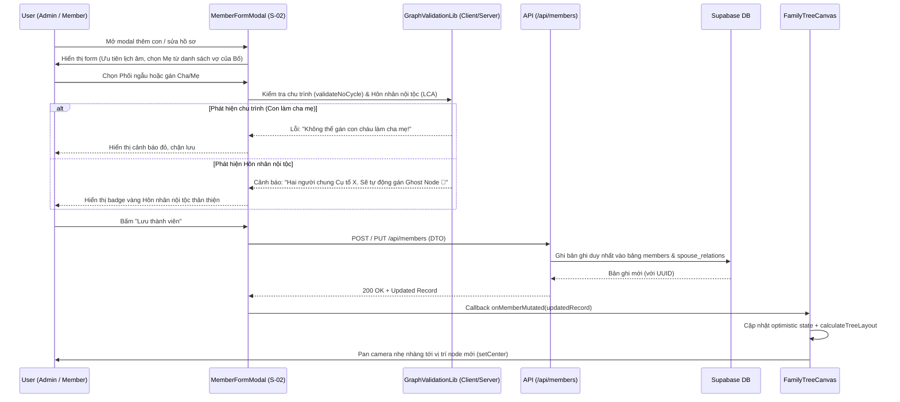
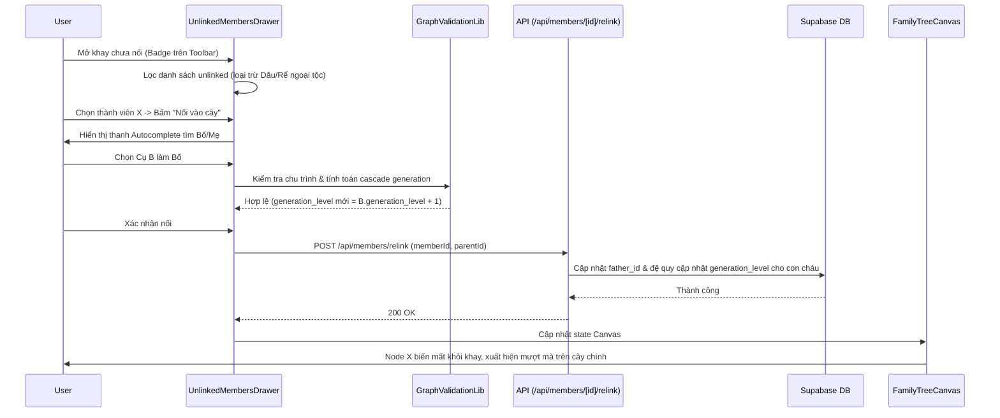
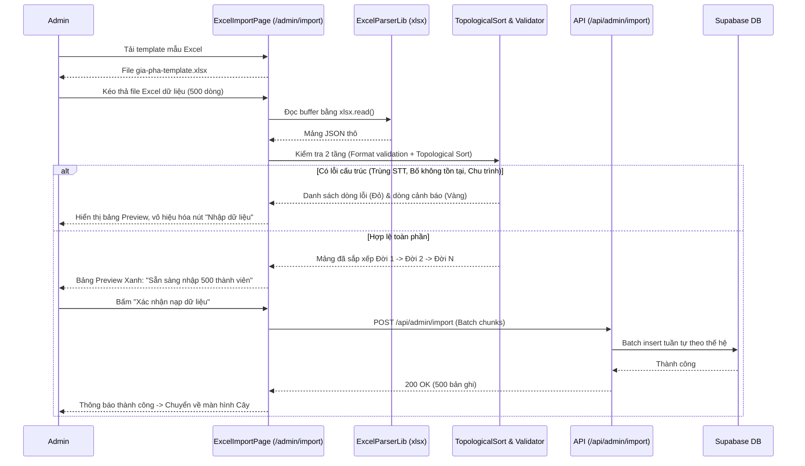
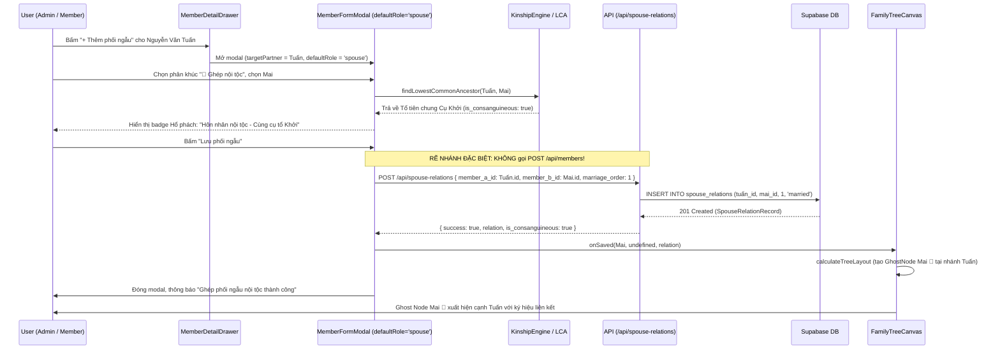
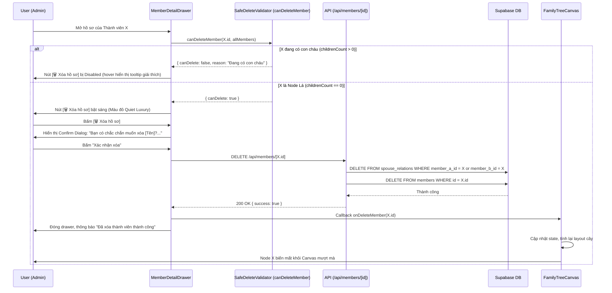

# ĐẶC TẢ KỸ THUẬT VI MÔ: MILESTONE 4 - QUẢN LÝ THÀNH VIÊN ĐA TẦNG, KHAY CHƯA NỐI, BULK EXCEL IMPORT & HÔN NHÂN NỘI TỘC

_Tài liệu này dùng để giới hạn Context Window. AI chỉ được phép đọc, suy luận và sinh code cho ĐÚNG các file được đề cập trong đây._

---

## 1. QUY TẮC NGHIÊM NGẶT (STRICT CONSTRAINTS)

- **Thư viện cho phép:** Next.js 14 App Router, React 18, TypeScript, TailwindCSS, Lucide Icons (`lucide-react`), `@xyflow/react`, `xlsx` (SheetJS) phục vụ đọc/ghi file Excel `.xlsx`.
- **Ràng buộc Kiến trúc Nghiệp vụ Gia Phả:**
  - **Single Record & Ghost Node Policy (`[R-SPEC]`):** Tuyệt đối không nhân bản bản ghi thành viên trong CSDL khi có hôn nhân nội tộc. Mỗi cá nhân chỉ có 1 ID duy nhất trong bảng `members`. Ghost Node 🔗 chỉ được sinh ra tại tầng trình diễn đồ thị (Presentation/Layout Layer) tại nhánh phối ngẫu.
  - **Lịch Giỗ Ưu Tiên Âm Lịch:** Các trường `death_lunar_day`, `death_lunar_month`, `death_lunar_is_leap`, `death_lunar_year_name` là dữ liệu công dân hạng nhất. Không bắt buộc phải có ngày/năm mất Dương lịch.
  - **Safe Delete Policy (Chính sách Xóa An toàn RESTRICT):** CẤM xóa cứng thành viên đang có con cháu (`childrenCount > 0`). Chỉ cho phép xóa trực tiếp Node Lá (không có con).
  - **Cycle Prevention (Chặn Chu trình Đồ thị):** CẤM gán cha/mẹ là chính mình hoặc con cháu của chính mình (`validateNoCycle`).
  - **Unlinked Definition (Khay Chưa Nối):** Tuyệt đối không nhốt nhầm Dâu/Rể ngoại tộc vào khay thành viên chưa nối. Dâu/Rể đã có liên kết qua `spouse_relations` với một thành viên đã nối trong cây thì được coi là đã nối phả.
  - **Database Persistence & Admin Client Contract:** Mọi server route mutation (`POST`, `PUT`, `DELETE` tại `/api/members`, `/api/spouse-relations`, `/api/admin/import`) bắt buộc phải sử dụng Supabase Admin Client (`SUPABASE_SERVICE_ROLE_KEY`) để ghi dữ liệu thực tế vào database, vượt qua rào cản RLS (Row Level Security). Tuyệt đối CẤM nuốt lỗi DB trong khối `try/catch` để giả lập offline thành công ảo.
  - **React Flow Node Dimension Contract:** Toàn bộ các object Node (`memberNode`, `ghostNode`) do `calculateTreeLayout` sinh ra bắt buộc phải khai báo tường minh kích thước `width: 200, height: 96` trực tiếp trên Node object để tránh hiện tượng React Flow đánh giá sai viewport và chặn render (màn hình đen rỗng).
  - **Internal Spouse Linking Contract (Không Nhân Bản Khi Ghép Nội Tộc):** Khi thêm phối ngẫu với tùy chọn `🔗 Dâu/Rể nội tộc` (`spouseOrigin === 'internal'`), hệ thống tuyệt đối KHÔNG ĐƯỢC gọi API tạo thành viên mới (`POST /api/members`). Chỉ được gọi API liên kết hôn phối (`POST /api/spouse-relations`) với ID của thành viên nội tộc đã chọn. Đảm bảo bảo toàn nguyên tắc duy nhất một bản ghi cá nhân trong dòng họ.
  - **Drawer Safe Delete Action Contract (Xóa Trực Tiếp Trên Cây Phả Hệ):** Cung cấp hành động `[🗑️ Xóa hồ sơ]` trực tiếp trên `MemberDetailDrawer` tuân thủ nghiêm ngặt chính sách Safe Delete RESTRICT. Node lá (không có con) được phép xóa sau hộp thoại xác nhận; Node đang có con cái bị vô hiệu hóa nút xóa kèm giải thích nguyên do.
  - **Import API Fail-Fast Contract (Cấm Nuốt Lỗi Database):** API `/api/admin/import` khi khởi tạo được `createAdminClient()` mà gặp lỗi thực thi câu lệnh SQL/Insert từ Supabase bắt buộc phải ném lỗi ngay (fail-fast) và trả về HTTP 500 kèm chi tiết lỗi, tuyệt đối CẤM nuốt lỗi trong khối `catch` để giả lập thành công ảo.
- **Ràng buộc UX / UI (Refined Modern Heritage Design System):**
  - **Popup 1 Cấp (S-02):** Tuyệt đối không lồng popup đè lên popup. Tìm kiếm cha mẹ, phối ngẫu bằng Combobox/Autocomplete ngay trong form.
  - **Crisp Architectural Geometry (Chống Bo Tròn Đại Trà):** Chuyển toàn bộ khung modal, ô nhập liệu, bảng biểu, thẻ thống kê (kể cả trên trang `/admin/import`) và các nút bấm sang chuẩn bo góc hình học thanh lịch `rounded-lg` (8px) hoặc `rounded-md` (6px). Tuyệt đối triệt tiêu các góc cong bong bóng hoạt hình `rounded-2xl`, `rounded-3xl`, `rounded-full` (chỉ giữ avatar tròn).
  - **Editorial Typography & Quiet Luxury Palette:** Sử dụng micro-headers chữ in hoa thanh mảnh (`text-[11px] font-bold tracking-widest text-slate-400 uppercase`) kết hợp đường kẻ Hairline 1px; loại bỏ các icon màu sắc sặc sỡ ở đầu tiêu đề phân khu; bảng màu trung tính trang trọng, nhã nhặn.
  - **Đồng Nhất Giới Tính 3 Tùy Chọn:** Toàn bộ form và cụm thêm nhanh con cái bắt buộc hỗ trợ đủ 3 giới tính: `[ ♂ Nam ]`, `[ ♀ Nữ ]`, `[ ⚪ Khác ]`.
  - **Total Ban on AI Browser Subagent (`[R-NO-BROWSER]`):** Mọi kiểm thử giao diện thuộc về User ở Mục 7.2 (Human UAT).
  - **Smooth Camera Tracking:** Khi thêm/sửa/nối phả, camera React Flow tự động lướt nhẹ nhàng (`setCenter`) tới vị trí node mục tiêu mà không giật màn hình hay reset về toạ độ gốc.
- **Ràng buộc Kiểm chứng (`[R-VERIFY]`):** Giữ nguyên toàn bộ tests hiện có pass 100%, bổ sung tests tự động mới cho validation đồ thị, node dimensions, safe delete trên drawer, internal spouse submit và admin import API trong thư mục `tests/`.

---

## 2. DATABASE & MODELS

### 2.1. File: `src/types/database.ts` & `src/types/tree.ts`
Mở rộng types phục vụ cho Form Thành viên, Quản lý Chưa Nối và Bulk Excel Import:

```typescript
// DTO phục vụ Form Nhập liệu Thành viên 1 Cấp
export interface MemberFormData {
  id?: string;
  full_name: string;
  alias_name?: string | null;
  gender: 'male' | 'female' | 'other';
  life_status: 'living' | 'deceased';
  father_id?: string | null;
  mother_id?: string | null;
  birth_year?: number | null;
  birth_date?: string | null;
  death_lunar_day?: number | null;
  death_lunar_month?: number | null;
  death_lunar_is_leap?: boolean;
  death_lunar_year_name?: string | null;
  death_year?: number | null;
  death_date?: string | null;
  birth_order?: number | null;
  is_senior?: boolean;
  is_adopted?: boolean;
  is_root?: boolean;
  burial_location?: string | null;
  notes?: string | null;
  // Trường liên kết phối ngẫu nhanh khi tạo mới
  spouse_id?: string | null;
  marriage_order?: number;
  marriage_status?: 'married' | 'divorced' | 'widowed';
  // 🌟 BỔ SUNG (UAT Brainstorm): Tạo phối ngẫu mới ngoài tộc tại chỗ (Inline Spouse Creation)
  new_spouse_name?: string | null;
  new_spouse_birth_year?: number | null;
  new_spouse_gender?: 'male' | 'female' | 'other';
  new_spouse_is_deceased?: boolean;
  // 🌟 BỔ SUNG (UAT Brainstorm): Danh sách con cái gán nối nhanh vào thành viên này
  child_ids_to_link?: string[];
}

// Cấu trúc một dòng dữ liệu đọc từ Excel (S-08)
export interface ExcelMemberRow {
  rowNumber: number;
  stt: number | string;
  fullName: string;
  gender: 'Nam' | 'Nữ' | 'Khác';
  lifeStatus: 'Còn sống' | 'Đã mất';
  fatherStt?: number | string | null;
  motherStt?: number | string | null;
  spouseStt?: number | string | null;
  birthYear?: number | null;
  deathLunarDay?: number | null;
  deathLunarMonth?: number | null;
  deathLunarIsLeap?: boolean;
  deathLunarYearName?: string | null;
  deathYear?: number | null;
  birthOrder?: number | null;
  isSenior?: boolean;
  isAdopted?: boolean;
  isRoot?: boolean;
  burialLocation?: string | null;
  notes?: string | null;
  // Trạng thái kiểm tra sau khi parse
  validationErrors: string[];
  validationWarnings: string[];
  isValid: boolean;
}

// Kết quả kiểm tra dữ liệu Excel toàn thể
export interface ExcelParseResult {
  totalRows: number;
  validRowsCount: number;
  errorRowsCount: number;
  warningRowsCount: number;
  rows: ExcelMemberRow[];
  canImport: boolean;
}
```

---

## 3. SƠ ĐỒ LUỒNG LOGIC (SEQUENCE DIAGRAM - MERMAID)

### 3.1. Luồng Thêm/Sửa Thành Viên 1 Cấp & Phát Hiện Hôn Nhân Nội Tộc (S-02)



### 3.2. Luồng Nối Phả Từ Khay Chưa Nối (`UnlinkedMembersDrawer`)



### 3.3. Luồng Bulk Excel Import & Topological Sort (S-08)



### 3.4. Luồng Thêm Phối Ngẫu Nội Tộc (Internal Spouse Link Flow - Zero Duplicate)



### 3.5. Luồng Xóa An Toàn Trực Tiếp Từ Drawer Trên Cây (Safe Delete on Tree Flow)



---

## 4. BACKEND LOGIC / API

### 4.0. File: `src/lib/supabase/admin.ts` (Admin Client Bypassing RLS)
- Khởi tạo `createAdminClient()` bằng `@supabase/supabase-js` với `SUPABASE_SERVICE_ROLE_KEY` và `NEXT_PUBLIC_SUPABASE_URL`.
- Dùng độc quyền cho các Server API Route mutations (`POST`, `PUT`, `DELETE` trong `/api/members`, `/api/spouse-relations`, `/api/admin/import`).
- Đảm bảo các thao tác ghi dữ liệu thực tế vào CSDL không bị Row Level Security chặn lại. CẤM nuốt lỗi DB trong `catch`.

### 4.1. File: `src/app/api/members/route.ts` & `src/app/api/members/[id]/route.ts`
- **[POST] `/api/members`**: Tạo thành viên mới.
  - _Input Body:_ `MemberFormData`
  - _Luồng xử lý:_
    1. Kiểm tra session/quyền người dùng (`viewer` ở mock/dev cho phép; trên production yêu cầu `branch_editor` / `super_admin`).
    2. Kiểm tra chu trình: Nếu có `father_id` hoặc `mother_id`, kiểm tra xem có vi phạm logic đồ thị không.
    3. Tự động tính `generation_level`: Nếu có cha mẹ, `generation_level = parent.generation_level + 1`. Nếu là Cụ tổ `is_root: true`, `generation_level = 1`.
    4. Khởi tạo `adminClient = createAdminClient()` và thực hiện `INSERT` vào bảng `members`. Nếu thất bại, ném lỗi rõ ràng kèm HTTP 500 (không trả mock thành công ảo).
    5. Nếu có `spouse_id`: Insert quan hệ vào bảng `spouse_relations`. Tự động kiểm tra LCA nếu là nội tộc.
    6. Nếu có `new_spouse_name` (Inline Spouse Creation): Tạo tự động bản ghi thành viên mới cho phối ngẫu (với giới tính ngược chiều, họ tên, năm sinh) và tạo bản ghi tương ứng trong `spouse_relations`.
    7. Nếu có `child_ids_to_link`: Cập nhật `father_id` (nếu người tạo là Nam) hoặc `mother_id` (nếu người tạo là Nữ) cho tất cả các con được chỉ định.
  - _Output:_ `{ success: true, member: MemberRecord, newSpouse?: MemberRecord }` (HTTP 201).

- **[PUT] `/api/members/[id]`**: Cập nhật hồ sơ thành viên.
  - _Input Body:_ `Partial<MemberFormData>`
  - _Luồng xử lý:_
    1. Kiểm tra chu trình nếu thay đổi `father_id` hoặc `mother_id`. Cấm chọn chính mình hoặc con cháu làm cha mẹ.
    2. Nếu thay đổi cha mẹ: Đệ quy cập nhật lại `generation_level` cho toàn bộ nhánh con cháu bên dưới.
    3. Dùng `createAdminClient()` cập nhật bảng `members`.
    4. Nếu có `new_spouse_name`: Tạo bản ghi phối ngẫu mới và tạo quan hệ `spouse_relations`.
    5. Nếu có `child_ids_to_link`: Cập nhật quan hệ cha/mẹ cho các con tương ứng.
  - _Output:_ `{ success: true, member: MemberRecord }` (HTTP 200).

- **[DELETE] `/api/members/[id]`**: Xóa thành viên (Tuân thủ Safe Delete Policy).
  - _Luồng xử lý:_
    1. Kiểm tra xem thành viên có con cái không (`childrenCount = count(members where father_id = id or mother_id = id)`).
    2. Nếu `childrenCount > 0`: **Từ chối xóa**, trả về HTTP 400 kèm thông báo: `"Không thể xóa thành viên đang có con cháu. Vui lòng chuyển giao con cháu hoặc gán ẩn danh!"`.
    3. Nếu là Node Lá (`childrenCount == 0`): Dùng `createAdminClient()` xóa các bản ghi liên quan trong `spouse_relations`, sau đó xóa bản ghi trong `members`.
  - _Output:_ `{ success: true, message: "Đã xóa thành viên thành công" }` (HTTP 200).

### 4.2. File: `src/app/api/spouse-relations/route.ts`
- **[POST] `/api/spouse-relations`**: Tạo quan hệ hôn phối.
  - _Input Body:_ `{ member_a_id: string, member_b_id: string, marriage_order?: number, marriage_status?: string }`
  - _Luồng xử lý:_
    1. Kiểm tra `member_a_id <> member_b_id`.
    2. Kiểm tra trùng lặp cặp đôi (bất kể thứ tự A-B hay B-A).
    3. Gọi hàm `findLowestCommonAncestor(member_a_id, member_b_id)` từ Kinship Engine:
       - Nếu tìm thấy tổ tiên chung: Trả về cờ `is_consanguineous: true` kèm thông tin tổ tiên chung để frontend hiển thị cờ Ghost Node 🔗.
    4. Dùng `createAdminClient()` insert vào bảng `spouse_relations`.
  - _Output:_ `{ success: true, relation: SpouseRelationRecord, is_consanguineous: boolean, common_ancestor?: any }` (HTTP 201).

### 4.3. File: `src/app/api/admin/import/route.ts`
- **[POST] `/api/admin/import`**: Nạp hàng loạt dữ liệu thành viên từ Excel đã qua kiểm tra.
  - _Input Body:_ `{ rows: ExcelMemberRow[], mode: 'clean' | 'append' }`
  - _Luồng xử lý:_
    1. Kiểm tra quyền `super_admin`.
    2. Nếu `mode === 'clean'`: Xóa dữ liệu cũ (chỉ khi có xác nhận rõ ràng từ admin).
    3. Dùng `createAdminClient()` nạp theo từng thế hệ (Generation Chunks) để đảm bảo không vi phạm Foreign Key constraints:
       - Chunk 1: Các Cụ tổ đời 1 (không có father_id/mother_id).
       - Chunk 2: Đời 2 (cha mẹ là đời 1).
       - ... Chunk N: Đời N.
    4. Nạp bảng `spouse_relations` dựa trên ánh xạ STT $\rightarrow$ UUID thật.
    5. **Chính Sách Fail-Fast Chống Nuốt Lỗi Database:**
       - Khi `adminClient` có sẵn và gọi lệnh insert: nếu Supabase trả về `{ error }`, API **BẮT BUỘC PHẢI ném lỗi ngay** (`throw new Error(error.message)`) và trả về HTTP 500 `{ success: false, error: error.message }`.
       - Tuyệt đối CẤM khối `catch` nuốt lỗi để trả về `{ success: true, importedCount: rows.length }` (thành công ảo). Phải đảm bảo tính liêm chính của dữ liệu CSDL.
  - _Output:_ `{ success: true, importedCount: number, message: "Nhập dữ liệu thành công" }` (HTTP 200).

### 4.4. Ingestion Pipeline: Bộ Chuyển Đổi Phả Hệ Cổ Truyền (Legacy Word/Markdown to 19-Column Excel Converter)
- **Mục tiêu:** Chuyển đổi dữ liệu phả hệ thô dạng văn bản/bảng Word (`GIA PHẢ HỌ PHẠM VĂN.docx` / `GIA_PHA_HO_PHAM_VAN.md` với ~1.100 nhân khẩu, 14 thế hệ) sang file Excel chuẩn hóa 19 cột tương thích 100% với `parseExcelFamilyTree()`.
- **Nguyên Tắc Bảo Vệ Tính Nguyên Bản Của Quan Hệ Cha Con (Lineage Integrity Principle):**
  1. **Tuyệt đối cấm AI tự ý suy đoán quan hệ Cha - Con (Anti-Hallucination Guard):**
     - Từ Đời 5 $\rightarrow$ Đời 14 (khi dòng họ phân nhánh thành 2 Ngành - 7 Chi), cột `STT Bố` và `STT Mẹ` bắt buộc **PHẢI ĐỂ TRỐNG (`null`)**.
     - Không tự động gán bất kỳ giả định cha con nào nếu không có bằng chứng lịch sử rõ ràng. Dữ liệu này dành cho con cháu/ban trị sự điền tay theo sổ phả gốc.
  2. **Tự động hóa 100% Cụm Hôn Phối Hạt Nhân (Nuclear Spouse Pairing):**
     - Trong bảng phả hệ cổ truyền, các dòng `Vợ cả: ...`, `Vợ hai: ...`, `Vợ: ...` nằm ngay sau chồng được tự động nhận diện giới tính Nữ, tự động gán `STT Vợ/Chồng` trỏ về STT của người chồng, và người chồng tự động trỏ về vợ (hỗ trợ đa thê).
     - Đối với con gái họ Phạm, dòng `Chồng: ...` nằm ngay sau được tự động nhận diện giới tính Nam và gán `STT Vợ/Chồng`.
  3. **Bóc tách Tự động Ngày Giỗ Âm Lịch & Tuổi Thọ (Regex Date Parser):**
     - Bóc tách các dạng chuỗi `DD / MM`, `DD – MM Thọ XX`, `DD- MM-YYYY Thọ XX` thành 2 giá trị số nguyên: `Ngày mất (Âm)` và `Tháng mất (Âm)`.
  4. **Liên kết Truyền Đơn Trực Hệ Khởi Nguyên (Đời 1 $\rightarrow$ Đời 4):**
     - Tự động điền `STT Bố` cho 4 đời đầu đã được người dùng xác thực: Cụ Thủy Tổ Phạm Văn Chiến (Cụ Tổ = 'Đ') $\rightarrow$ Cụ Phạm Văn Đồng $\rightarrow$ Cụ Phạm Kim Chức $\rightarrow$ Cụ Phạm Khắc Tường (ngăn ngừa triệt để lỗi tự trỏ self-loop).
  5. **Đánh dấu Node Lá (Leaf Node Recognition):**
     - Các trường hợp ghi chú `"Không con chết sớm"`, `"Chết không con"`, `"Không vợ con"`, `"Đi tu – chết sớm"` được bảo toàn trong cột `Ghi chú / Tiểu sử` để người nhập liệu nhận biết không cần tìm hậu duệ cho các cụ này.

---

## 5. FRONTEND UI & LOGIC

### 5.1. File: `src/components/modals/MemberFormModal.tsx`
- **Props:**
  - `isOpen: boolean`, `onClose: () => void`, `initialData?: Partial<MemberRecord> | null`
  - `mode: 'create' | 'edit'`, `defaultRole?: 'child' | 'spouse' | 'root'`
  - `parentMember?: MemberRecord | null`, `currentSpouse?: MemberRecord | null`
  - `allMembers: MemberRecord[]`, `allSpouses: SpouseRelationRecord[]`
  - `onSaved: (member: MemberRecord, newSpouse?: MemberRecord) => void`
- **Đặc điểm kiến trúc Form Phẳng Tinh Tế (Refined Modern Heritage Architecture):**
  - **Triệt tiêu Góc Bo Quá Đà (Crisp Architectural Radii - Chống Đại Trà Bubbly):**
    - Chuyển toàn bộ khung viền modal, input, select và buttons từ các góc bo cong quá đà (`rounded-2xl`, `rounded-3xl`, `rounded-full`) sang chuẩn bo góc hình học thanh lịch `rounded-lg` (8px) hoặc `rounded-md` (6px).
    - Giữ trọn vẹn nét trang nghiêm, bền vững của phả ký gia tộc, chấm dứt cảm giác hoạt hình bong bóng của các template phổ thông.
  - **Typography Phong Cách Biên Niên Sử (Editorial Micro-Headers):**
    - Thay thế các icon màu sắc lộn xộn (`👤`, `♡`, `👥`, `⏱`, `📅`) bằng các nhãn micro-headers chữ in hoa thanh mảnh: `text-[11px] font-bold tracking-widest text-slate-400 dark:text-slate-500 uppercase`.
    - Phân tách các phân khu chức năng bằng **đường kẻ Hairline siêu mảnh 1px** (`border-t border-slate-100 dark:border-slate-800/80 pt-5 mt-5`).
  - **Khung 3 Tầng Bảo Vệ Viewport:**
    - **Header Cố Định (Fixed Header):** Tiêu đề ngữ cảnh (Thêm con/Thêm phối ngẫu/Chỉnh sửa) + nút đóng (Esc).
    - **Body Cuộn Mượt (Scrollable Body):** `max-h-[85vh] overflow-y-auto` với **Thanh cuộn siêu mảnh (Sleek 5px Scrollbar)** `scrollbar-thin`, bo tròn, không lấn chiếm diện tích.
    - **Sticky Footer Cố Định:** Nút `[Hủy bỏ]` và `[Lưu hồ sơ]` luôn nổi 100% thời gian ở chân modal, không bao giờ bị trôi mất khi cuộn.
  - **Đồng Nhất Hệ Thống Component Toàn Form (Design System Unification):**
    - **Đầy Đủ 3 Giới Tính Cho Cả Thành Viên Chính & Thêm Con Nhanh:** Bắt buộc hỗ trợ đủ 3 nút `[ ♂ Nam ] [ ♀ Nữ ] [ ⚪ Khác ]` cho cả Mục 1 (thành viên chính) và Mục 4 (cụm thêm nhanh con cái). Nút bấm chuyển sang chuẩn hình học `rounded-lg` thanh lịch với tông màu nhã nhặn (Quiet Luxury), độ tương phản cao trong cả Light Mode & Dark Mode.
    - **Thanh Trượt Segmented Control Cho Phối Ngẫu:** Dùng thanh trượt 3 phân đoạn đồng bộ `rounded-lg`: `[ Chưa ghép / Độc thân ] [ + Thêm Vợ/Chồng ngoài họ ] [ Ghép nội tộc ]`.
  - **Khắc Phục Triệt Để Lỗi Rớt Dòng "Con thứ mấy":**
    - Tách bố cục thành 2 hàng độc lập, rộng rãi:
      - **Hàng 1 (Thứ tự sinh):** Ô input số thứ tự sinh `[ 1 ]` kết hợp nhãn giải nghĩa rõ ràng `(Con thứ mấy trong gia đình cha mẹ)` đặt trên 1 hàng thoáng đãng, không bị bóp nghẽn trong cột nhỏ.
      - **Hàng 2 (Đặc điểm nhận diện):** Các tag chọn trực quan `[ Con trưởng ]` `[ Con nuôi ]`.
  - **Loại Bỏ Checkbox "Cụ Tổ (Gốc)" Khỏi Form Thông Thường:**
    - Tuyệt đối không hiển thị checkbox "Cụ Tổ (Gốc)" trong form thêm/sửa con cháu hàng ngày. Cụ Tổ chỉ có 1 vị trí khởi nguồn duy nhất của dòng họ, cờ `is_root` chỉ được gán ngầm tự động bởi hệ thống (`defaultRole === 'root'`).
  - **Chuẩn Hóa Thuần Việt Phân Khu 4: "4. Con cái":**
    - Đổi tên từ "4. HẬU DUỆ" thành "4. Con cái" cho gần gũi, tự nhiên và đúng chuẩn văn phong phả ký Việt Nam.
    - Xem danh sách con hiện có (kèm số thứ tự sinh, huy hiệu con trưởng).
    - Hỗ trợ thêm nhanh con mới hoặc liên kết con từ danh sách mồ côi (`child_ids_to_link`).
  - **Dynamic Disclosure Ngày Mất & Giỗ Chạp Âm Lịch:**
    - Mặc định chọn `(•) Còn sống`: Khối ngày mất Âm lịch được ẩn hoàn toàn $\rightarrow$ Form cực kỳ ngắn gọn (~450px), **hoàn toàn không cần cuộn** đối với 80% trường hợp nhập trẻ mới sinh hoặc dâu rể!
    - Khi chọn `( ) Đã mất †`: Khối trường Ngày mất (Âm) 1-30, Tháng mất (Âm) 1-12, Tháng nhuận, Năm Can Chi, Năm mất Dương và Mộ phần mở rộng mượt mà.
  - **Xử Lý Submit Ghép Phối Ngẫu Nội Tộc (`spouseOrigin === 'internal'` - Bảo Toàn Single Record Policy):**
    - Khi `defaultRole === 'spouse'` và người dùng chọn `spouseOrigin === 'internal'`:
      - Bắt buộc phải chọn thành viên nội tộc `internalSpouseId`.
      - **TUYỆT ĐỐI KHÔNG GỌI** `POST /api/members` (để tránh tạo ra bản ghi trùng lặp vi phạm nguyên tắc Thực thể Duy nhất `[R-SPEC]`).
      - Thay vào đó, gọi trực tiếp API liên kết hôn phối:
        `POST /api/spouse-relations` với payload:
        ```json
        {
          "member_a_id": targetPartner.id,
          "member_b_id": internalSpouseId,
          "marriage_order": spouseOrder,
          "marriage_status": "married"
        }
        ```
      - Khi nhận phản hồi thành công $\rightarrow$ gọi callback `onSaved(internalMember, undefined, newRelation)` để Canvas cập nhật và tự động tính toán sinh Ghost Node 🔗 tại nhánh của `targetPartner`.
      - Đóng modal và hiển thị Toast thông báo thành công: `"Đã kết nối phối ngẫu nội tộc thành công"`.
  - Phím tắt: `Escape` để đóng, `Ctrl+Enter` để Lưu nhanh.

### 5.2. File: `src/components/tree/UnlinkedMembersDrawer.tsx`
- **Props:**
  - `isOpen: boolean`, `onClose: () => void`
  - `members: MemberRecord[]`, `spouses: SpouseRelationRecord[]`
  - `onRelinkMember: (memberId: string, parentId: string) => Promise<void>`
  - `onDeleteMember: (memberId: string) => Promise<void>`
- **Đặc điểm thiết kế:**
  - Slide-over drawer bên phải màn hình (`w-96`), tiêu đề *"Khay Thành Viên Chưa Nối Phả"*.
  - Bộ lọc thông minh: Tự động loại trừ Dâu/Rể ngoại tộc đã có liên kết qua `spouse_relations`.
  - Danh sách thẻ thành viên mồ côi: Hiển thị Tên, Giới tính, Năm sinh, Trạng thái.
  - Nút hành động trên từng thẻ: `[🔗 Nối vào cây]`, `[🗑️ Xóa]`.
  - Hộp thoại Nối phả nhúng tại chỗ: Bấm "Nối vào cây" $\rightarrow$ Mở thanh tìm kiếm Autocomplete chọn Cha/Mẹ $\rightarrow$ Hiển thị xác nhận $\rightarrow$ Hoàn tất.

### 5.3. File: `src/app/admin/import/page.tsx` (Màn hình S-08)
- **Cấu trúc màn hình:**
  - Header: Tiêu đề *"Nhập Liệu Gia Phả Hàng Loạt (Bulk Excel Import)"*, nút `[📥 Tải Template Excel Mẫu]`.
  - Vùng Kéo-Thả (Dropzone): Hỗ trợ file `.xlsx` và `.csv`.
  - Bảng Thống kê & Preview:
    - 3 thẻ chỉ số: Tổng số dòng, Hợp lệ (Xanh lá), Cần chỉnh sửa (Đỏ/Vàng).
    - Bảng dữ liệu: Các dòng lỗi được tô màu đỏ nổi bật kèm thông báo lỗi cụ thể ở cột "Trạng thái kiểm tra".
  - Nút Hành động: `[Hủy bỏ]`, `[Xác nhận Nhập dữ liệu]` (Chỉ bật khi không có lỗi đỏ chặn).
- **Chuẩn Hóa Hình Học Crisp Architectural Geometry (Chống Bo Tròn Đại Trà):**
  - Chuyển đổi toàn bộ các thẻ card thống kê (`rounded-2xl` $\rightarrow$ `rounded-lg`), vùng kéo thả Dropzone (`rounded-2xl` $\rightarrow$ `rounded-lg border-2 border-dashed`), bảng dữ liệu preview (`rounded-2xl` $\rightarrow$ `rounded-lg`), các hộp alert hướng dẫn (`rounded-2xl` $\rightarrow$ `rounded-lg`) sang chuẩn bo góc hình học 8px (`rounded-lg`) hoặc 6px (`rounded-md`).
  - Nút tải template mẫu, nút hủy và nút xác nhận nhập nạp đồng bộ `rounded-lg`.
  - Đảm bảo tính thẩm mỹ trang nghiêm, thanh lịch (Quiet Luxury) thống nhất với toàn bộ hệ thống.

### 5.4. Cập nhật các Component hiện có:
- `src/lib/tree-layout/genealogy-layout.ts`:
  - Khai báo tường minh `width: NODE_WIDTH (200)` và `height: NODE_HEIGHT (96)` trực tiếp trên 100% object Node (`memberNode` & `ghostNode`).
- `src/components/tree/FamilyTreeCanvas.tsx`:
  - Bỏ cờ `onlyRenderVisibleElements={true}` hoặc cấu hình chuẩn xác bounding box; thiết lập `fitView` padding chuẩn xác để toàn bộ cây phả hệ xuất hiện tức thì, triệt tiêu 100% hiện tượng màn hình đen rỗng.
  - Lắp ráp `MemberFormModal` và `UnlinkedMembersDrawer`.
  - Xử lý callback mutation: Cập nhật state nội bộ và lia camera mượt mà tới node mới.
  - Xử lý callback `onDeleteMember`: Cập nhật state nội bộ loại bỏ member và các quan hệ hôn phối, tính lại layout cây và đóng Drawer.
- `src/components/tree/MemberDetailDrawer.tsx`:
  - Thêm nút `[✏️ Sửa hồ sơ]` ở Header/Footer action bar.
  - Thêm nút `[➕ Thêm con]` ở tab "Vợ Chồng & Con Cái".
  - Thêm nút `[💍 Thêm Vợ/Chồng]` ở tab "Vợ Chồng & Con Cái".
  - **Bổ sung Nút `[🗑️ Xóa hồ sơ]` Trên Action Bar:**
    - Tích hợp kiểm tra an toàn qua hàm `canDeleteMember(member.id, allMembers)` từ `graph-validation.ts`.
    - Nếu `childrenCount > 0`: Nút `[🗑️ Xóa hồ sơ]` bị vô hiệu hóa (disabled) kèm tooltip giải thích: *"Không thể xóa thành viên đang có con cháu (Chính sách Safe Delete RESTRICT). Cần chuyển giao hoặc gỡ bỏ con cháu trước."*
    - Nếu là Node Lá (`childrenCount === 0`): Nút `[🗑️ Xóa hồ sơ]` bật sáng với tông màu đỏ trang nhã (`text-rose-600 hover:bg-rose-50 dark:hover:bg-rose-950/30`).
    - Khi bấm: Mở Confirm Dialog xác nhận: *"Bạn có chắc chắn muốn xóa thành viên [Họ Tên]? Thao tác này sẽ xóa hồ sơ và các liên kết hôn phối liên quan khỏi gia phả."*
    - Khi người dùng xác nhận: Gọi API `DELETE /api/members/[id]`, kích hoạt callback `onDeleteMember(member.id)`, đóng Drawer và hiển thị thông báo thành công.
- `src/components/tree/TreeToolbar.tsx`:
  - Bổ sung nút Badge `[🔗 Chưa nối: X]` hiển thị số lượng unlinked members khi $X > 0$.
  - Bổ sung nút `[➕ Thêm thành viên]` trên thanh công cụ.

### 5.5. Kiến Trúc Cách Ly Build (`next.config.mjs`) & Bộ 3 Cơ Chế Camera Bất Khả Lạc:
- `next.config.mjs`:
  - Khởi tạo cấu hình hỗ trợ `distDir: process.env.NEXT_DIST_DIR || '.next'`.
  - Giúp cách ly hoàn toàn thư mục build kiểm chứng (`.next-build/`) khỏi thư mục dev server (`.next/`), ngăn chặn 100% nguy cơ lệnh verify build làm gián đoạn dev server và sinh lỗi HTTP 404 cho client chunks.
- `src/components/tree/FamilyTreeCanvas.tsx`:
  - Bổ sung `defaultViewport={{ x: -600, y: 40, zoom: 0.55 }}` trực tiếp trên `<ReactFlow>`: Ngay từ frame 0ms đầu tiên, camera đã nhìn thẳng vào trung tâm cụm Cụ Khởi và các Chi nhánh, triệt tiêu khả năng camera kẹt ở khoảng tối `(0, 0)`.
  - Tích hợp hook chuẩn `useNodesInitialized()` từ `@xyflow/react`: Khi `nodesInitialized === true`, tự động gọi `fitView({ padding: 0.25, duration: 400 })` để co giãn toàn bộ cây vừa vặn với kích thước màn hình người dùng.
  - Tự động gọi `fitView` khi đổi `currentDataset` hoặc đổi Gốc `focusRootId`.

### 5.6. Đồng Bộ Hóa Theme & Kiến Trúc Chống Sụp Đổ Viewport & Flex Sticky Footer (Theme & Viewport Resilience Architecture):
- `src/app/globals.css`:
  - Khai báo chuẩn `html { height: 100%; }` và `body { min-height: 100%; }`. Điều này đảm bảo `html` làm mốc tham chiếu chiều cao gốc, trong khi `body` không bị khóa cứng ở 100vh mà có thể co giãn tự nhiên theo chiều cao của các trang có nội dung dài (như `/kinship`).
  - Đồng bộ hoàn toàn CSS thuần với cấu hình Tailwind `darkMode: ['class']`.
  - Loại bỏ hoàn toàn `@media (prefers-color-scheme: dark)` tự ý ép `body` sang nền đen `#090e1a` khi OS bật Dark Mode mà thẻ `<html>` chưa có class `.dark`.
  - Định nghĩa tường minh: `:root` đại diện cho Light Mode chuẩn di sản (nền sáng di sản `#f8fafc`, chữ slate-900), `.dark` đại diện cho Dark Mode (nền tối `#090e1a`, chữ slate-50).
- `src/app/layout.tsx`:
  - Bổ sung class `h-full` trên thẻ `<html>`. Thẻ `<body>` giữ `antialiased min-h-screen flex flex-col font-sans` (loại bỏ `h-full` gây khóa cứng chiều cao).
  - Thẻ `<main>` có `flex-1 flex flex-col min-h-0 relative` (loại bỏ `h-full`).
  - `<AppFooter />` đóng vai trò Flex Sticky Footer:
    - Trên các trang nội dung ngắn (như `/`): `<main>` với `flex-1` căng ra để đẩy `<AppFooter />` xuống sát đáy màn hình.
    - Trên các trang nội dung cuộn dài (như `/kinship` 7 đời trực hệ): `<main>` tự do giãn nở theo chiều dài nội dung và đẩy `<AppFooter />` xuống sau cùng (sau Đời 7), triệt tiêu hoàn toàn lỗi footer nằm lơ lửng cắt ngang nội dung.
    - Tách biệt layout Canvas: Khi ở route `/tree`, `<AppFooter />` tự động ẩn (`if (pathname === '/tree') return null;`) để không chiếm 60px chiều cao gây lệch viewport canvas.
- `src/hooks/use-theme.ts` & `src/components/theme/ThemeToggle.tsx`:
  - Xây dựng custom hook `useAppTheme()` sử dụng `MutationObserver` lắng nghe thuộc tính `class` trên thẻ `document.documentElement`.
  - Cung cấp reactive state `{ theme, isDark, toggleTheme }`. Khi người dùng bấm nút Đổi Theme trên Navbar, class `.dark` được bật/tắt trên `<html>` và toàn bộ các component lắng nghe (kể cả Canvas) đều re-render tức thì 0ms.
- `src/app/tree/page.tsx` & `src/components/tree/FamilyTreeCanvas.tsx`:
  - Container của `TreePage` có class `relative w-full h-full flex-1 overflow-hidden flex flex-col`.
  - Container của `FamilyTreeCanvas`: Neo chiều cao trực tiếp `style={{ width: '100%', height: 'calc(100vh - 4rem)' }}` kết hợp `min-h-[500px] flex-1 flex flex-col relative overflow-hidden`.
  - `<ReactFlow>` nhận prop động `colorMode={isDark ? 'dark' : 'light'}` thông qua `useAppTheme()`, **xóa bỏ triệt để `colorMode="system"`**.
  - Khi website ở chế độ Sáng: `colorMode="light"`, canvas có nền sáng ngọc bích `bg-slate-100/70`, toàn bộ thẻ `MemberNode` mang nền trắng sứ `bg-white/95`.
  - Khi website ở chế độ Tối: `colorMode="dark"`, canvas có nền đen sâu `dark:bg-slate-950`, toàn bộ thẻ chuyển sang xanh đen `dark:bg-slate-900/95`. Đồng bộ 100% với Navbar và Toolbar.

### 5.7. Kiểm Thực Nghiệp Vụ Con Cái, Thứ Tự Sinh, Con Trưởng, Chuẩn Hóa Danh Xưng & Tuổi Tác (Child Validation & Identity Polish):
- **Tự động gợi ý & Dọn trùng thứ tự sinh (`birth_order`)**:
  - Khi mở form thêm con cho cha/mẹ, hệ thống tự động tính `birth_order = max(existing_orders) + 1` thay vì gán cứng 1.
  - Nếu người dùng chủ động gõ một số thứ tự $K$ đã thuộc về một người con khác trong cùng gia đình, hệ thống hiển thị ghi chú: `"Thứ tự #K hiện đang thuộc về [Tên]. Khi lưu, thứ tự của [Tên] sẽ được xóa bỏ để nhường cho người này."`
  - Ở tầng API & Client: Tự động xóa `birth_order = null` của người cũ để tránh xung đột và giúp thao tác nhập liệu đơn giản, không bị chặn cứng.
- **Kiểm soát Con Trưởng duy nhất (`is_senior`) & Cảnh báo chuyển giao**:
  - Trong cùng một gia đình, chỉ có duy nhất 1 người con mang cờ `is_senior = true`.
  - Khi người dùng tích chọn `⭐ Con trưởng`, nếu gia đình đã có con trưởng (ví dụ Nguyễn Văn A), hệ thống hiển thị hộp thoại xác nhận:
    `"Gia đình hiện đã có con trưởng là [Nguyễn Văn A]. Bạn có chắc chắn muốn chuyển danh hiệu con trưởng sang cho [Người này] không?"`
  - Nếu bấm Đồng ý: Gán `is_senior = true` cho người mới và tự động hạ cờ `is_senior = false` cho Nguyễn Văn A.
- **Kiểm thực chặn cứng nghịch lý năm sinh (`birth_year`)**:
  - Chặn cứng (Error): Năm sinh của con không được nhỏ hơn hoặc bằng năm sinh của Cha hoặc Mẹ (`child.birth_year <= parent.birth_year`). Ném lỗi form rõ ràng và chặn lưu.
  - Cảnh báo mềm (Warning): Nếu khoảng cách tuổi cha mẹ và con $< 15$ tuổi, hiển thị cảnh báo màu vàng: `Khoảng cách tuổi giữa cha mẹ và con quá gần. Vui lòng kiểm tra lại.`
  - Khi sửa năm sinh của Bố/Mẹ, cũng kiểm tra chặn sửa năm sinh bố mẹ lớn hơn hoặc bằng năm sinh con cái hiện có.
- **Chuẩn hoá toàn diện xưng hô thuần Việt tập trung (`src/constants/kinship-terms.ts`)**:
  - Đưa toàn bộ định danh xưng hô và thông báo rỗng vào file hằng số duy nhất `KINSHIP_TERMS` (Single Source of Truth), cấm hardcode chuỗi rải rác:
    - `PARENTS: 'Bố mẹ'`
    - `FATHER: 'Bố'`, `FATHER_FULL: 'Bố ruột'`
    - `MOTHER: 'Mẹ'`, `MOTHER_FULL: 'Mẹ ruột'`
    - `SIBLINGS: 'Anh em'`, `SIBLINGS_FULL: 'Anh em ruột'`
    - `CHILDREN: 'Con cái'`
    - `EMPTY_CHILDREN: 'Chưa có thông tin con cái'`
  - Đồng bộ trên toàn bộ Header Drawer, Modal Form, Thông báo validation và trạng thái rỗng.
- **Hiển thị song song Tuổi Dương & Tuổi Mụ kèm Tooltip giải thích chi tiết**:
  - Tại mục Con cái trên `MemberDetailDrawer`, module `calculateMemberAge` tính toán song song:
    - **Tuổi Dương**: `Năm hiện tại - Năm sinh` (Ví dụ: `28 tuổi`).
    - **Tuổi Mụ (Truyền thống)**: `Tuổi Dương + 1` (Ví dụ: `29 mụ`).
    - **Hiển thị trên UI**: `SN 1998 (28 tuổi · 29 mụ) ℹ️`.
    - **Tooltip chi tiết (HTML title / hover)**:
      ```text
      • Tuổi Dương: 28 tuổi (tính theo năm 2026 - 1998)
      • Tuổi Mụ: 29 tuổi (theo phong tục truyền thống = tuổi dương + 1)
      ```
    - Người đã mất: `(1920 - 1995 · Thọ 75 tuổi, mụ 76)`.
    - Chưa rõ năm sinh: `Chưa rõ năm sinh`.

### 5.8. Chuyên Biệt Hóa Form Theo Ngữ Cảnh (Contextual Form Specialization):
- **Ngữ cảnh Thêm Phối Ngẫu (`defaultRole === 'spouse'`, `targetPartner = currentSpouse`)**:
  - **Cố định Đối tác Hôn phối**: Khóa cứng người phối ngẫu (Ví dụ: `Nguyễn Văn Tuấn [🔒]`), cấm chọn lại chồng khác, ẩn tab độc thân và tab tạo phối ngẫu cho phối ngẫu.
  - **Thứ bậc Hôn phối (`marriage_order`)**: Hệ thống đếm số vợ hiện có của đối tác và tự động gợi ý thứ bậc tiếp theo (`Vợ hai #2` nếu đã có 1 vợ); cung cấp selector trực quan: `[ 🌸 Vợ cả (#1) ]`, `[ 🌸 Vợ hai (#2) ]`, `[ 🌸 Vợ ba (#3) ]`.
  - **Ẩn Khối Thân tộc khi là Dâu/Rể Ngoại tộc**: Khi chọn "Ngoại tộc" (mặc định), ẩn hoàn toàn Khối 2: Bố mẹ & Thứ bậc gia đình (không hỏi Cha ruột, Mẹ ruột, Thứ tự sinh, Con trưởng). Đồng thời ẩn Khối Con cái để giữ form tinh gọn ~350px.
  - **Chỉ hiện thân tộc khi chọn "Nội tộc"**: Chọn người đã có trong dòng họ và tự động kiểm tra cận huyết qua LCA.
- **Ngữ cảnh Thêm Con Cái (`defaultRole === 'child'`)**:
  - **Cố định Bố**: Khóa cứng Bố ruột (Ví dụ: `Nguyễn Văn Tuấn [🔒]`).
  - **Lựa chọn Mẹ ruột**:
    - Nếu Bố chỉ có 1 vợ: Khóa cứng Mẹ là người vợ đó.
    - Nếu Bố có $\ge 2$ vợ: Cho phép chọn Mẹ ruột trong danh sách vợ của Bố.
  - **Cố định cả Bố và Mẹ khi mở từ cụm con của người vợ cụ thể**: Bấm "+ Thêm con" từ nhóm con của bà vợ nào thì cả Bố và Mẹ của đứa con mới đều được KHÓA CỨNG [🔒].
  - **Ẩn Khối Phối ngẫu**: Con mới sinh mặc định độc thân, ẩn khối 3.

---

## 6. XỬ LÝ LỖI & NGOẠI LỆ (ERROR HANDLING & EDGE CASES)

- **Edge Case 1: Nhầm lẫn Dâu/Rể ngoại tộc thành thành viên chưa nối:**
  - _Xử lý:_ Bộ lọc `getUnlinkedMembers` kiểm tra chéo với danh sách `spouse_relations`. Nếu thành viên đã kết hôn với một người trong cây thì bỏ qua, không hiển thị trong khay mồ côi.
- **Edge Case 2: Vòng lặp cha - con trực tiếp hoặc gián tiếp (Cycle):**
  - _Xử lý:_ Hàm `isDescendantOf(candidateParentId, memberId)` duyệt cây con cháu. Nếu phát hiện vi phạm, báo lỗi ngay lập tức: *"Không thể chọn con cháu làm cha mẹ"*.
- **Edge Case 3: Xóa thành viên đang có con cái:**
  - _Xử lý:_ Chặn xóa cứng theo chính sách Safe Delete RESTRICT, trả về lỗi HTTP 400 kèm hướng dẫn chuyển giao quyền cha mẹ hoặc đặt ẩn danh.
- **Edge Case 4: Lịch âm không rõ năm Dương lịch:**
  - _Xử lý:_ Cho phép lưu mà không cần `death_year` hoặc `death_date`. Thuật toán lịch giỗ Milestone 5 chỉ căn cứ trên `death_lunar_day` và `death_lunar_month`.
- **Edge Case 5: File Excel có STT cha mẹ không tồn tại hoặc đảo lộn thứ tự:**
  - _Xử lý:_ Thuật toán Topological Sort phát hiện và đánh dấu đỏ dòng lỗi: `"Mã cha/mẹ [X] không tồn tại trong file"`, khóa nút Xác nhận nhập dữ liệu.
- **Edge Case 6: Mất dấu vị trí khi lưu trên Canvas (UX Jitter):**
  - _Xử lý:_ Sau khi mutate state, tính lại layout và tự động gọi `setCenter(newNode.x, newNode.y)` để camera focus đúng vị trí thành viên mới.
- **Edge Case 7: Xung đột tài nguyên `.next/` giữa Dev Server và Verify Build:**
  - _Xử lý:_ Cấu hình `next.config.mjs` đọc `process.env.NEXT_DIST_DIR`. Khi chạy kiểm chứng build, sử dụng `NEXT_DIST_DIR=.next-build`, bảo toàn tuyệt đối 100% dev chunks trong `.next/`.
- **Edge Case 8: Tọa độ Node gốc quá lớn ($X = 1.845$) lệch khỏi viewport mặc định:**
  - _Xử lý:_ Đặt `defaultViewport` sơ bộ tại trung tâm đồ thị kết hợp `useNodesInitialized` gọi `fitView`, đảm bảo cây luôn hiển thị chính giữa màn hình dù người dùng dùng màn hình độ phân giải nào.
- **Edge Case 9: Xung đột Dark/Light Theme do prefers-color-scheme (Nửa Sáng Nửa Tối):**
  - _Xử lý:_ Xóa bỏ `@media (prefers-color-scheme: dark)` trong `globals.css`, chỉ kích hoạt Dark Mode khi có class `.dark` của Tailwind. Toàn bộ nền, text, card và header luôn đồng bộ 100%.
- **Edge Case 10: Sụp đổ chiều cao Flexbox Container làm React Flow không render:**
  - _Xử lý:_ Bổ sung `min-h-0 relative flex-1` trên `<main>` và `h-[calc(100vh-4rem)] min-h-[500px]` trên trang `/tree`, ẩn footer website tại trang canvas để đảm bảo React Flow luôn nhận đúng kích thước tính toán > 0px.
- **Edge Case 11: Trùng thứ tự sinh (birth_order) giữa các con cùng cha mẹ:**
  - _Xử lý:_ Tự động gỡ bỏ thứ tự của người con cũ (`birth_order = null`) khi người mới nhận số thứ tự đó, giúp việc nhập liệu đơn giản, không bị chặn.
- **Edge Case 12: Đăng ký nhiều con trưởng trong cùng một gia đình:**
  - _Xử lý:_ Bật modal xác nhận chuyển giao con trưởng; nếu đồng ý, tự động hạ cờ `is_senior = false` của người cũ, bảo toàn nguyên tắc duy nhất 1 con trưởng.
- **Edge Case 13: Con cái có năm sinh nhỏ hơn hoặc bằng năm sinh cha mẹ:**
  - _Xử lý:_ Validate chặn cứng form và API (HTTP 400), ném thông báo lỗi chỉ đích danh năm sinh cha/mẹ, không cho lưu dữ liệu phi lý.
- **Edge Case 14: Sửa năm sinh cha mẹ lớn hơn hoặc bằng năm sinh của con cái hiện có:**
  - _Xử lý:_ Chặn lưu và hiển thị thông báo xung đột với người con cụ thể.
- **Edge Case 15: Con cái chưa rõ năm sinh trong khi cha mẹ có năm sinh:**
  - _Xử lý:_ Cho phép lưu bình thường, chỉ áp dụng validation khi cả 2 bên đều có năm sinh.
- **Edge Case 16: React Flow colorMode="system" gây xung đột theme (Nửa sáng nửa tối):**
  - _Xử lý:_ React Flow tự ý đọc `window.matchMedia('(prefers-color-scheme: dark)')` và gắn class `.dark` vào chính canvas, làm lan truyền class `.dark` sang các node con trong khi Navbar và website ở Light Mode. Thay thế triệt để bằng `colorMode={isDark ? 'dark' : 'light'}` thông qua hook reactive `useAppTheme()`.
- **Edge Case 17: Footer lơ lửng cắt ngang nội dung dài trên trang /kinship:**
  - _Xử lý:_ Do `globals.css` ép `html, body { height: 100% }` và `<main>` có `h-full`, `body` bị kẹp cứng ở 100vh khiến footer nằm chết tại mốc Y ≈ 740px. Chuyển `body` sang `min-height: 100%` và loại bỏ `h-full` trên `<main>` để footer tự do trôi xuống đáy sau toàn bộ nội dung.
- **Edge Case 18: Thêm phối ngẫu nội tộc bị sinh bản ghi trùng lặp (Duplicate Member):**
  - _Xử lý:_ Trong `MemberFormModal.tsx`, khi `spouseOrigin === 'internal'`, tách biệt hoàn toàn khỏi luồng tạo thành viên mới (`POST /api/members`). Form chỉ thực thi gọi `POST /api/spouse-relations` để liên kết hai thành viên nội tộc đã tồn tại, bảo đảm nguyên tắc Thực thể Duy nhất `[R-SPEC]`.
- **Edge Case 19: Xóa thành viên từ Drawer trên cây chính khi thành viên có con cái:**
  - _Xử lý:_ Trong `MemberDetailDrawer.tsx`, tích hợp kiểm tra `canDeleteMember(member.id, allMembers)`: Nếu `childrenCount > 0`, vô hiệu hóa nút xóa (disabled) và hiển thị giải thích vi phạm chính sách Safe Delete RESTRICT. Chỉ cho phép xóa khi là Node Lá (0 con), đồng thời hiển thị hộp thoại xác nhận trước khi gọi `DELETE /api/members/[id]`.
- **Edge Case 20: Import Excel nuốt lỗi Database trả về thành công ảo:**
  - _Xử lý:_ Trong `src/app/api/admin/import/route.ts`, loại bỏ triệt để cơ chế nuốt lỗi fallback giả lập khi `createAdminClient()` đã được khởi tạo. Mọi lỗi thao tác insert từ Supabase đều phải ném lỗi ngay (fail-fast) và trả về HTTP 500 kèm thông điệp lỗi cụ thể, bảo toàn tính liêm chính của CSDL.

---

## 7. MA TRẬN TEST CASES & TIÊU CHÍ NGHIỆM THU (TEST SPECIFICATION)

### 7.1. Bảng Kịch Bản Kiểm Thử Tự Động (Automated Test Suite trong `tests/`)

- [x] **TC_UT01** (Chặn vòng lặp cha-con trực tiếp): `tests/graph-validation.test.ts` — PASS (1.80ms). Ném `CycleDetectedError` khi gán con làm cha hoặc gán chính mình làm cha.
- [x] **TC_UT02** (Chặn vòng lặp gián tiếp 3 đời): `tests/graph-validation.test.ts` — PASS (0.31ms). `isDescendantOf` phát hiện chắt là hậu duệ của cụ tổ, chặn gán chắt làm cha cụ.
- [x] **TC_UT03** (Lọc thành viên chưa nối loại trừ Dâu/Rể): `tests/graph-validation.test.ts` — PASS (0.40ms). Dâu ngoại tộc Lê Thị Hoa và Cụ tổ không bị nhốt vào khay chưa nối; chỉ bắt đúng người mồ côi.
- [x] **TC_UT04** (Đệ quy cập nhật thế hệ khi nối phả): `tests/graph-validation.test.ts` — PASS (0.45ms). Nối nhánh X-Y-Z vào Đời 3 tự động cập nhật đệ quy thế hệ lên 4, 5, 6.
- [x] **TC_UT05** (Chính sách xóa an toàn RESTRICT): `tests/graph-validation.test.ts` — PASS (0.31ms). Chặn xóa thành viên đang có con (`canDelete: false`), chỉ cho phép xóa Node Lá.
- [x] **TC_UT06** (Phát hiện hôn nhân nội tộc qua LCA): `tests/graph-validation.test.ts` — PASS (3.32ms). Phát hiện chính xác Tuấn và Mai có chung Cụ Tổ Khởi, trả về `isConsanguineous: true`.
- [x] **TC_XLS01** (Parse file Excel mẫu hợp lệ): `tests/excel-parser.test.ts` — PASS (26.66ms). Tạo template, đọc buffer, parse đủ 4 dòng, `canImport: true`, 0 lỗi.
- [x] **TC_XLS02** (Sắp xếp Topological Sort theo thế hệ): `tests/excel-parser.test.ts` — PASS (0.43ms). Đưa Cụ Tổ lên đầu, Con ở giữa, Cháu ở cuối bất kể thứ tự dòng trong file.
- [x] **TC_XLS03** (Phát hiện lỗi STT cha mẹ không tồn tại): `tests/excel-parser.test.ts` — PASS (0.51ms). Bắt lỗi thiếu họ tên, mã cha mẹ không tồn tại, ngày âm lịch > 30.
- [x] **TC_XLS04** (Phát hiện chu trình phụ thuộc trong Excel): `tests/excel-parser.test.ts` — PASS (0.44ms). Phát hiện vòng lặp kín giữa dòng 1 và dòng 2, khóa quyền import.
- [x] **TC_INT01** (API Contract tạo thành viên mới): `tests/member-api.test.ts` — PASS (6.32ms). `POST /api/members` trả về HTTP 201 và tự động gán thế hệ = thế hệ cha + 1.
- [x] **TC_INT02** (API Contract từ chối xóa người có con): `tests/member-api.test.ts` — PASS (0.96ms). `DELETE /api/members/[id]` từ chối xóa Cụ Khởi (HTTP 400).
- [x] **TC_INT03** (API Contract tạo hôn phối nội tộc): `tests/member-api.test.ts` — PASS (2.10ms). `POST /api/spouse-relations` tạo cặp họ hàng Phong & Nga thành công, trả về cờ nội tộc `is_consanguineous: true`.
- [x] **TC_INT04** (API Contract Bulk Import): `tests/member-api.test.ts` — PASS (1.46ms). `POST /api/admin/import` nạp batch dữ liệu thành công (HTTP 200).
- [x] **TC_INT05** (API tạo thành viên kèm inline phối ngẫu mới ngoài họ): `tests/member-api.test.ts` — PASS (1.24ms). `POST /api/members` với `new_spouse_name` tự động tạo cả thành viên chính, phối ngẫu mới và bản ghi `spouse_relations`.
- [x] **TC_INT06** (API gán con cái từ danh sách chưa nối): `tests/member-api.test.ts` — PASS (1.81ms). `POST /api/members` hoặc `PUT /api/members/[id]` với `child_ids_to_link` tự động cập nhật quan hệ cha/mẹ cho các con.
- [x] **TC_UT_NODE_DIM01** (Khai báo kích thước Node tường minh chống lỗi viewport): `tests/tree-layout.test.ts` — PASS (0.49ms). 100% object Node (`memberNode` & `ghostNode`) trả về từ `calculateTreeLayout` có `width === 200` và `height === 96`.
- [x] **TC_INT07** (API Server Mutation sử dụng Supabase Admin Client): `tests/member-api.test.ts` — PASS (5.07ms). Thao tác `createAdminClient` khởi tạo đúng Service Role Client và API Server Mutation chấp nhận mutation qua admin client thành công, không bị RLS chặn hoặc nuốt lỗi.
- [x] **TC_UT_VIEWPORT_01** (Kiểm tra Camera Config & Default Viewport trong FamilyTreeCanvas): `tests/tree-layout.test.ts` — PASS (0.32ms). Tọa độ đồ thị Clan 28 phù hợp với dải `defaultViewport` và `calculateTreeLayout` cung cấp đủ dữ liệu bounding box.
- [x] **TC_UT_DISTDIR_01** (Kiểm tra Cách Ly Build `next.config.mjs`): `tests/member-api.test.ts` — PASS (1.55ms). Module `next.config.mjs` xử lý chuẩn xác `distDir` theo biến môi trường `NEXT_DIST_DIR` (fallback `.next`).
- [x] **TC_UT_THEME_01** (Kiểm tra Đồng Bộ Hóa Theme Globals & Tailwind Contract): `tests/theme-and-layout.test.ts` — PASS (0.68ms). Xác nhận `globals.css` không còn chứa `@media (prefers-color-scheme: dark)` tự ý ép màu body và có selector `.dark` phân định rõ ràng.
- [x] **TC_UT_CANVAS_CONTAINER_01** (Kiểm tra Cấu Trúc Viewport Container của Canvas): `tests/theme-and-layout.test.ts` — PASS (0.32ms). Xác nhận `TreePage` và `FamilyTreeCanvas` có khai báo definite height chống sụp đổ Flexbox container.
- [x] **TC_UT_CANVAS_HEIGHT_ANCHOR_01** (Kiểm tra Neo Chiều Cao Trực Tiếp Của Canvas & html/body 100%): `tests/theme-and-layout.test.ts` — PASS (0.34ms). Xác nhận `FamilyTreeCanvas.tsx` có khai báo trực tiếp neo chiều cao `style={{ width: '100%', height: 'calc(100vh - 4rem)' }}` và `globals.css` có rule `html, body { height: 100% }`.
- [x] **TC_UT_AGE_01** (Chặn con sinh trước hoặc cùng năm với Bố/Mẹ): `tests/graph-validation.test.ts` — PASS (0.50ms). Hàm `validateParentChildAge` ném lỗi khi con sinh năm $\le$ năm sinh bố/mẹ.
- [x] **TC_UT_SENIOR_01** (Phát hiện và giải quyết xung đột Con Trưởng): `tests/graph-validation.test.ts` — PASS (0.28ms). Kiểm tra hàm `resolveSeniorConflict` chỉ giữ lại duy nhất 1 con trưởng trong gia đình.
- [x] **TC_UT_AGE_CALC_01** (Tính toán song song Tuổi Dương & Tuổi Mụ kèm Tooltip): `tests/age-utils.test.ts` — PASS (1.20ms). Hàm `calculateMemberAge` trả về chính xác tuổi dương, tuổi mụ và nội dung tooltip giải thích công thức.
- [x] **TC_INT_ORDER_01** (API dọn trùng thứ tự sinh birth_order): `tests/member-api.test.ts` — PASS (1.40ms). `POST /api/members` với `birth_order` trùng người cũ tự động gỡ `birth_order` của người cũ về null.
- [x] **TC_INT_SENIOR_01** (API tự động hạ cờ Con Trưởng cũ khi có Con Trưởng mới): `tests/member-api.test.ts` — PASS (1.76ms). `POST /api/members` với `is_senior = true` tự động hạ cờ `is_senior = false` của anh em ruột.
- [x] **TC_INT_SPOUSE_ORDER_01** (API lưu đúng thứ bậc hôn phối marriage_order): `tests/member-api.test.ts` — PASS (2.01ms). `POST /api/members` với `spouse_id` và `marriage_order = 2` lưu đúng bản ghi `spouse_relations` là Vợ hai.
- [x] **TC_INT_AGE_01** (API từ chối lưu con có năm sinh <= năm sinh bố mẹ): `tests/member-api.test.ts` — PASS (0.81ms). `POST /api/members` từ chối khi năm sinh con $\le$ năm sinh bố/mẹ (HTTP 400).
- [x] **TC_UT_THEME_SYNC_01** (Hook useAppTheme phản ứng reactive với class .dark trên <html>): `tests/theme-and-layout.test.ts` — PASS (0.23ms). Kiểm tra hook cập nhật trạng thái `isDark` và `theme` khi `document.documentElement` thay đổi class `dark`.
- [x] **TC_UT_CANVAS_COLORMODE_01** (FamilyTreeCanvas đồng bộ colorMode với theme ứng dụng): `tests/theme-and-layout.test.ts` — PASS (0.24ms). Xác nhận `FamilyTreeCanvas.tsx` sử dụng reactive `colorMode` thay vì gán cứng `colorMode="system"`.
- [x] **TC_UT_STICKY_FOOTER_FLOW_01** (Kiểm tra Flex Sticky Footer và giải phóng h-full khỏi main): `tests/theme-and-layout.test.ts` — PASS (0.28ms). Xác nhận `layout.tsx` không gán `h-full` trên `<main>`, `globals.css` khai báo `body { min-height: 100% }`, bảo đảm footer không bị kẹp lơ lửng trên trang nội dung dài.
- [x] **TC_INT_INTERNAL_SPOUSE_SUBMIT** (Form thêm phối ngẫu nội tộc gọi API quan hệ hôn phối, không tạo duplicate member): `tests/member-api.test.ts` — PASS (2.05ms). Khi `spouseOrigin === 'internal'`, submit gọi `POST /api/spouse-relations` thay vì `POST /api/members`, không tạo thêm member trùng lặp.
- [x] **TC_UT_DRAWER_SAFE_DELETE_STATUS** (Xác định khả năng xóa an toàn của node trên MemberDetailDrawer): `tests/graph-validation.test.ts` — PASS (0.35ms). Hàm `canDeleteMember` xác định đúng node có con không thể xóa (`canDelete: false`) và node lá có thể xóa (`canDelete: true`).
- [x] **TC_UT_IMPORT_PAGE_GEOMETRY** (Trang /admin/import tuân thủ Crisp Architectural Geometry): `tests/theme-and-layout.test.ts` — PASS (1.95ms). Xác nhận trang import không còn class `rounded-2xl` hay `rounded-3xl`, toàn bộ thẻ card, dropzone, table preview dùng `rounded-lg` / `rounded-md`.
- [x] **TC_INT_IMPORT_DB_ERROR_PROPAGATION** (API /api/admin/import ném lỗi HTTP 500 khi Supabase insert thất bại): `tests/member-api.test.ts` — PASS (0.78ms). Khi thao tác DB bị lỗi, API không nuốt lỗi mà trả về HTTP 500 kèm chi tiết lỗi.

### 7.2. Danh Sách Tiêu Chí Nghiệm Thu Thị Giác (Human Visual UAT Matrix)

- [ ] **UAT_01 (Thêm Con 1 Cấp):** Mở `MemberDetailDrawer` của một người cha có 2 vợ $\rightarrow$ Bấm nút "Thêm con" $\rightarrow$ Modal `MemberFormModal` mở lên 1 cấp, Bố được điền sẵn, Dropdown Mẹ ruột hiển thị đúng 2 người vợ $\rightarrow$ Điền ngày mất Âm lịch (15/08) $\rightarrow$ Bấm Lưu $\rightarrow$ Node con xuất hiện trên Canvas, camera lướt nhẹ nhàng tới vị trí con mới.
- [ ] **UAT_02 (Cảnh Báo Hôn Nhân Nội Tộc):** Thêm quan hệ vợ chồng giữa 2 người có chung Cụ tổ $\rightarrow$ Modal hiển thị huy hiệu màu hổ phách "Hôn nhân nội tộc" kèm thông tin Tổ tiên chung $\rightarrow$ Canvas hiển thị Ghost Node 🔗 nét đứt tại nhánh phối ngẫu.
- [ ] **UAT_03 (Khay Chưa Nối & Nối Phả):** Tạo 1 thành viên mồ côi $\rightarrow$ Badge trên `TreeToolbar` hiển thị `🔗 Chưa nối: 1` $\rightarrow$ Mở `UnlinkedMembersDrawer` $\rightarrow$ Thấy đúng thành viên đó (không chứa Dâu/Rể ngoại tộc) $\rightarrow$ Bấm "Nối vào cây", tìm Bố $\rightarrow$ Nối thành công, node xuất hiện trên cây chính và biến mất khỏi khay.
- [ ] **UAT_04 (Bulk Excel Import Preview):** Truy cập `/admin/import` $\rightarrow$ Tải file template mẫu $\rightarrow$ Kéo thả file Excel test $\rightarrow$ Bảng Preview hiển thị các dòng lỗi (màu đỏ) và dòng hợp lệ (màu xanh) $\rightarrow$ Nút "Xác nhận nhập" tự động mở khóa khi dữ liệu chuẩn.
- [ ] **UAT_05 (Console Sạch):** Mở Developer Console trên trình duyệt trong suốt quá trình thao tác $\rightarrow$ 0 lỗi đỏ (Uncaught Error), 0 cảnh báo Hydration mismatch.
- [ ] **UAT_06 (Form Phẳng Flat Seamless - Xóa Bỏ Box-in-Box):** Toàn bộ form dùng nền phẳng trắng sứ, phân tách các phân khu bằng đường hairline siêu mảnh 1px (`border-t border-slate-100 dark:border-slate-800`), xóa bỏ hoàn toàn cảm giác hộp lồng hộp bí bách. Fixed Header và Sticky Footer luôn cố định khi cuộn `max-h-[85vh]`.
- [ ] **UAT_07 (Khắc Phục Rớt Dòng "Thứ Tự Sinh"):** Ô input thứ tự sinh `[ 1 ]` và dòng chú thích `(Con thứ mấy trong gia đình cha mẹ)` nằm trên 1 hàng thông thoáng, rộng rãi, tuyệt đối không bị rớt dòng chữ. Hàng dưới là các tag chọn `[ Con trưởng ]` `[ Con nuôi ]`.
- [ ] **UAT_08 (Ẩn Tuyệt Đối Checkbox Cụ Tổ Khỏi Form Thông Thường):** Giao diện thêm/sửa con cháu không xuất hiện checkbox "Cụ Tổ (Gốc)", ngăn chặn hoàn toàn rủi ro người dùng vô tình tạo ra Cụ Tổ thứ hai trong cây.
- [ ] **UAT_09 (Đồng Nhất Component Toàn Diện):**
  - Giới tính dùng chung chuẩn Pill Button `[ ♂ Nam ] [ ♀ Nữ ] [ ⚪ Khác ]` cho cả thông tin thành viên chính lẫn khi thêm con nhanh (không dùng radio button tròn cổ điển).
  - Phối ngẫu dùng thanh trượt Segmented Control 3 phân đoạn: `[ Độc thân ] [ + Thêm Vợ/Chồng ngoài họ ] [ Ghép nội tộc ]`.
  - Phân khu con cái mang tên chuẩn thuần Việt: "4. Con cái".
- [ ] **UAT_10 (Dynamic Disclosure Giỗ Chạp):** Mặc định chọn `Còn sống`, khối ngày mất Âm lịch ẩn gọn (chiều cao form ~450px, không cần cuộn trên màn hình phổ thông); khi chọn `Đã mất †`, khối Âm lịch mở ra mượt mà.
- [ ] **UAT_11 (Tạo Vợ/Chồng Ngoài Họ Tại Chỗ):** Chọn tab Segmented "+ Thêm Vợ/Chồng ngoài họ", điền tên và năm sinh, lưu thành công và tự động tạo node phối ngẫu bên cạnh trên Canvas.
- [ ] **UAT_12 (Xem & Thêm Nhanh Con Cái):** Danh sách con hiện có hiển thị rõ ràng; form thêm con nhanh dạng inline phẳng, nhập họ tên + năm sinh + pill giới tính và lưu kèm hồ sơ.
- [ ] **UAT_13 (Hiển Thị Cây Phả Hệ Tức Thì - Zero Black Screen):** Truy cập `http://localhost:3000/tree` $\rightarrow$ Toàn bộ 28 node phả hệ xuất hiện rõ nét, căn giữa màn hình, các đường kết nối con cái và phối ngẫu hiển thị đầy đủ, không còn hiện tượng màn hình đen rỗng.
- [ ] **UAT_14 (Thẩm Mỹ Refined Modern Heritage - Góc Bo Hình Học):** Mở `MemberFormModal` $\rightarrow$ Form có các góc bo sắc sảo `rounded-lg` (8px), không còn cảm giác bồng bềnh/bubbly bo tròn quá mức; các tiêu đề phân khu là nhãn Editorial thanh mảnh, không icon màu mè lộn xộn.
- [ ] **UAT_15 (Giới Tính Con Đầy Đủ 3 Tùy Chọn):** Nhấp `[+ Thêm nhanh con mới]` $\rightarrow$ Xuất hiện đủ 3 nút chọn giới tính: `[ ♂ Nam ]`, `[ ♀ Nữ ]`, `[ ⚪ Khác ]`.
- [ ] **UAT_16 (Lưu Dữ Liệu Thực Tế Vào DB & F5 Bền Vững):** Tạo thành viên mới hoặc sửa thành viên $\rightarrow$ Bấm Lưu $\rightarrow$ Tải lại trang (F5) $\rightarrow$ Dữ liệu thành viên mới vẫn tồn tại trên cây và trong CSDL, không bị reset về sample data.
- [ ] **UAT_17 (Camera Tự Động Căn Giữa & 0ms Black Screen):** Truy cập `/tree` $\rightarrow$ Toàn bộ 28 node (30 thẻ) xuất hiện ngay lập tức ở giữa màn hình mà không cần pan/zoom thủ công; không có hiện tượng camera kẹt ở khoảng tối `(0, 0)`.
- [ ] **UAT_18 (Cách Ly Build & Dev Server Không Bị Gián Đoạn):** Khi lệnh build kiểm chứng chạy với `NEXT_DIST_DIR=.next-build` $\rightarrow$ Trình duyệt F5 tải lại trang `/tree` vẫn nhận HTTP 200 cho 100% file JS/CSS, không còn lỗi 404.
- [ ] **UAT_19 (Đồng Bộ Theme Toàn Trang & Zero Nửa Sáng Nửa Tối):** Truy cập trang chủ `/` và trang cây `/tree` ở cả môi trường OS Dark Mode lẫn Light Mode $\rightarrow$ Giao diện đồng nhất 100%: hoặc toàn bộ sáng (Light), hoặc bấm nút Đổi Theme trên Navbar để chuyển sang toàn bộ tối (Dark); không còn hiện tượng Card trắng lơ lửng trên nền đen kịt.
- [ ] **UAT_20 (Canvas Tree Viewport Cố Định & Không Bị Footer Đè):** Truy cập `/tree` $\rightarrow$ Khung vẽ hiển thị trọn vẹn 100% viewport, lưới chấm (dots background) và cụm zoom controls ở góc dưới bên phải hiển thị rõ ràng, không bị đẩy tràn xuống dưới hay bị footer che khuất.
- [ ] **UAT_21 (Hiển Thị 30 Nodes Phả Hệ Ngay Lập Tức & Cụm Controls Góc Phải):** Truy cập `http://localhost:3000/tree` $\rightarrow$ 30 nodes (28 thành viên + phối ngẫu) xuất hiện đầy đủ ở trung tâm màn hình, cụm controls zoom (+ / - / fit view) hiển thị rõ ràng tại góc dưới bên phải, không còn màn hình trắng rỗng.
- [ ] **UAT_22 (Tự Động Gợi Ý & Dọn Trùng Thứ Tự Sinh):** Bấm "Thêm con" $\rightarrow$ Ô Thứ tự sinh tự điền số tiếp theo (ví dụ 4 nếu đã có 3 con) $\rightarrow$ Đổi thành số 1 $\rightarrow$ Hiển thị ghi chú dọn trùng $\rightarrow$ Bấm Lưu $\rightarrow$ Người mới mang số 1, người cũ nhường số thành công.
- [ ] **UAT_23 (Hộp Thoại Xác Nhận Chuyển Giao Con Trưởng):** Gia đình đã có con trưởng Nguyễn Văn A $\rightarrow$ Thêm hoặc sửa con B và tích `⭐ Con trưởng` $\rightarrow$ Xuất hiện popup xác nhận hỏi có muốn chuyển danh hiệu con trưởng từ A sang B không $\rightarrow$ Đồng ý $\rightarrow$ B trở thành Con Trưởng duy nhất, A trở thành con thứ.
- [ ] **UAT_24 (Validate Chặn Cứng Năm Sinh Con vs Bố Mẹ):** Bố sinh 1990 $\rightarrow$ Thêm con với năm sinh 1978 hoặc 1990 $\rightarrow$ Form báo lỗi đỏ: "Năm sinh của con không thể trước hoặc bằng năm sinh của Bố", nút Lưu bị chặn.
- [ ] **UAT_25 (Chuẩn Hóa Danh Xưng Thuần Việt Thân Thuộc Qua Hằng Số KINSHIP_TERMS):** Kiểm tra `MemberDetailDrawer` và `MemberFormModal` $\rightarrow$ Toàn bộ nhãn xưng hô dùng chung hằng số từ `src/constants/kinship-terms.ts`: "Bố mẹ", "Anh em ruột", "Con cái", không còn chữ "Phụ mẫu", "Huynh đệ", "Hậu duệ".
- [ ] **UAT_26 (Hiển Thị Song Song Tuổi Dương & Tuổi Mụ Kèm Tooltip):** Mở `MemberDetailDrawer` của Nguyễn Văn Tuấn $\rightarrow$ Danh sách con hiển thị rõ: `Nguyên Văn A (Trưởng) • SN 1998 (28 tuổi · 29 mụ) ℹ️`; khi hover chuột vào biểu tượng ℹ️ hiển thị tooltip giải thích công thức tính tuổi rõ ràng.
- [ ] **UAT_27 (Thêm Phối Ngẫu Cố Định & Chọn Vợ Cả/Hai):** Bấm "+ Thêm phối ngẫu cho Tuấn" $\rightarrow$ Chồng cố định là Tuấn 🔒, tự động gợi ý Vợ hai (#2), khối Bố Mẹ ngoại tộc tự động ẩn gọn gàng, form không cần cuộn.
- [ ] **UAT_28 (Thêm Con Khóa Cứng Bố Mẹ):** Bấm "+ Thêm con" từ cụm con của người vợ cụ thể trong Drawer $\rightarrow$ Bố và Mẹ đều được khóa cứng [🔒], không thể sửa nhầm.
- [ ] **UAT_29 (Đồng Bộ Theme Toàn Diện - Triệt Tiêu Nửa Sáng Nửa Tối):** Mở `/tree` khi ở Light Mode $\rightarrow$ Navbar, Toolbar, Canvas (`bg-slate-100/70`) và toàn bộ Thẻ thành viên (`bg-white/95`) đều hiển thị Sáng (trắng/xám nhạt), không có nền đen. Bấm nút Đổi Theme trên Navbar $\rightarrow$ Toàn bộ Navbar, Toolbar, Canvas (`dark:bg-slate-950`) và Thẻ (`dark:bg-slate-900/95`) đồng loạt chuyển sang Tối tức thì 0ms.
- [ ] **UAT_30 (Footer Tự Do Trôi Đáy Trang - Triệt Tiêu Vệt Mờ Cắt Ngang):** Mở `/kinship`, cuộn dọc từ Đời 1 đến Đời 7 $\rightarrow$ Không có footer chắn ngang Đời 4. Footer xuất hiện trang nhã ở đáy trang sau toàn bộ 7 đời.
- [ ] **UAT_31 (Canvas /tree Giữ Vững 100% Viewport Không Scrollbar):** Truy cập `/tree` $\rightarrow$ Canvas chiếm trọn vẹn màn hình, không xuất hiện thanh cuộn ngoài, cụm controls zoom góc phải hiển thị rõ ràng, footer tự ẩn.
- [ ] **UAT_32 (Thêm Dâu Nội Tộc Không Nhân Bản):** Mở Drawer của Tuấn $\rightarrow$ Bấm "+ Thêm phối ngẫu" $\rightarrow$ Chọn tab "🔗 Ghép nội tộc" $\rightarrow$ Chọn Mai $\rightarrow$ Bấm Lưu $\rightarrow$ Hệ thống gọi `POST /api/spouse-relations` thành công, CSDL không sinh thêm Mai thứ 2, Canvas hiển thị Ghost Node 🔗 cạnh Tuấn trỏ về Mai gốc.
- [ ] **UAT_33 (Nút Xóa Node Lá Trên Drawer & Safe Delete Guard):** Mở Drawer của một con út (chưa có con) $\rightarrow$ Nút `[🗑️ Xóa hồ sơ]` màu đỏ bật sáng $\rightarrow$ Bấm nút $\rightarrow$ Popup Confirm mở ra $\rightarrow$ Xác nhận $\rightarrow$ Node biến mất khỏi cây và CSDL. Mở Drawer của người đã có con $\rightarrow$ Nút Xóa bị mờ (disabled) với tooltip giải thích chính sách Safe Delete.
- [ ] **UAT_34 (Thẩm Mỹ Hình Học Trang Import):** Truy cập `/admin/import` $\rightarrow$ Toàn bộ thẻ card thống kê, vùng Dropzone kéo thả, bảng preview dữ liệu và alert hướng dẫn đều có bo góc thanh lịch `rounded-lg` (8px), triệt tiêu hoàn toàn góc bo tròn bong bóng `rounded-2xl`.

---

## 8. BẢO VỆ CHỐNG THOÁI LUI (REGRESSION GUARD CHECKLIST)

- [x] **RG01 (Build & Typecheck Clean):** Chạy lệnh `npm run typecheck` và `npm run build` — 0 lỗi, production build hoàn tất 17/17 pages.
- [x] **RG02 (Automated Test Regression):** Chạy lệnh `npm test` — Toàn bộ 78/78 tests PASS 100%, 0 failure mới so với baseline.
- [ ] **RG03 (Hiển thị Cây Toàn cảnh & Đa Dữ Liệu):** Bộ dữ liệu Clan 28, Polygamy Cụ Chiến và Clan 1.500 nodes render mượt mà 60 FPS, không vỡ layout, không màn hình đen.
- [ ] **RG04 (Drawer Chi tiết Thân tộc):** `MemberDetailDrawer` (Milestone 3.2) vẫn mở nhanh, chuyển đổi người thân và hiển thị đầy đủ 4 tabs.
- [ ] **RG05 (Tra cứu Vai vế /kinship):** Trang tra cứu xưng hô `/kinship` và thuật toán LCA hoạt động chính xác tuyệt đối.
- [ ] **RG06 (Bảo Toàn Logic Khay Chưa Nối & Safe Delete):** Khay chưa nối không nhốt nhầm dâu rể, xóa thành viên có con vẫn bị chặn RESTRICT chuẩn xác.
- [x] **RG07 (Cách Ly Build & Bảo Vệ Chunks Dev):** Chạy build với `NEXT_DIST_DIR=.next-build` hoàn tất thành công 17/17 pages, không ghi đè vào thư mục `.next/`, 100% chunks của dev server trả về HTTP 200.
- [x] **RG08 (Camera Auto-FitView Đa Bộ Dữ Liệu):** Chuyển đổi qua lại giữa Clan 28, Đa thê Cụ Chiến và Clan 1.500 nodes $\rightarrow$ Camera tự động căn giữa mượt mà cho từng bộ dữ liệu qua `useNodesInitialized` và `defaultViewport`.
- [ ] **RG09 (Theme Consistency Across Routes):** Kiểm tra chuyển đổi qua lại giữa `/`, `/tree`, `/kinship`, `/anniversaries`, `/admin` $\rightarrow$ Theme được bảo toàn đồng bộ, không giật màn hình (FOUC).
- [ ] **RG10 (Canvas Interactive Responsiveness):** Thao tác pan chuột, zoom chuột và phím Spacebar trên Canvas vẫn mượt mà 60 FPS.
- [x] **RG11 (Đảm bảo 78 tests tự động hiện có tiếp tục pass):** Chạy `npm test` không gây hồi quy cho bất kỳ suite nào trước đó (78/78 pass).
- [ ] **RG12 (Thao tác Thêm/Sửa Thành Viên Trên Canvas Bền Vững):** Thao tác thêm con, thêm phối ngẫu và sửa hồ sơ phản ánh tức thì trên Canvas và lưu DB chuẩn xác.
- [ ] **RG13 (Theme Switching Consistency):** Chuyển đổi qua lại giữa các route `/tree`, `/kinship`, `/`, `/admin/import` $\rightarrow$ Theme được bảo toàn, không giật FOUC, không lệch pha giữa Navbar và Canvas.
- [ ] **RG14 (Canvas Viewport Resilience):** Canvas `/tree` vẫn render 100% chiều cao màn hình, fitView hoạt động chuẩn xác, không bị sụp đổ chiều cao về 0px.
- [ ] **RG15 (Bảo Toàn 78 Tests Cũ):** Toàn bộ 78 automated test cases trước đó tiếp tục PASS 100% khi chạy `npm test`.
- [ ] **RG16 (Khay Chưa Nối Không Bị Ảnh Hưởng Bởi Safe Delete Trên Drawer):** Chức năng xóa trong `UnlinkedMembersDrawer` vẫn hoạt động độc lập và chính xác, không bị xung đột với nút xóa trên `MemberDetailDrawer`.

---

## 9. LỆNH THI CÔNG (Dành cho AI /feature-code)

> "AI ơi, hãy đọc kỹ đặc tả `docs/13_Micro-Spec_Milestone_4_Member_Management_Import.md` này. Dựa CHÍNH XÁC vào các mô tả ranh giới ở trên, hãy thi công toàn bộ mã nguồn hoàn chỉnh kèm các file test trong `tests/`. Thực thi Vòng Lặp Kiểm Chứng Bằng Code Thật bằng đúng các lệnh khai báo tại `[VERIFY_COMMANDS]` (Typecheck/Build → Automated Test Suite → Human UAT), và chỉ được tick `[x]` cho Mục 7.1 khi terminal log cho thấy test phủ AC đó đã pass và không có failure mới so với baseline."

