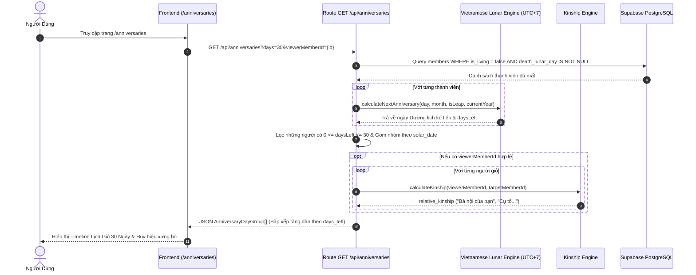
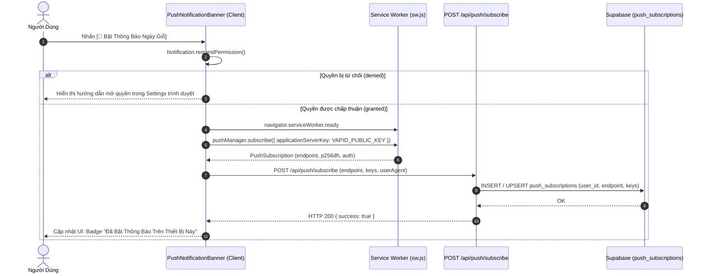
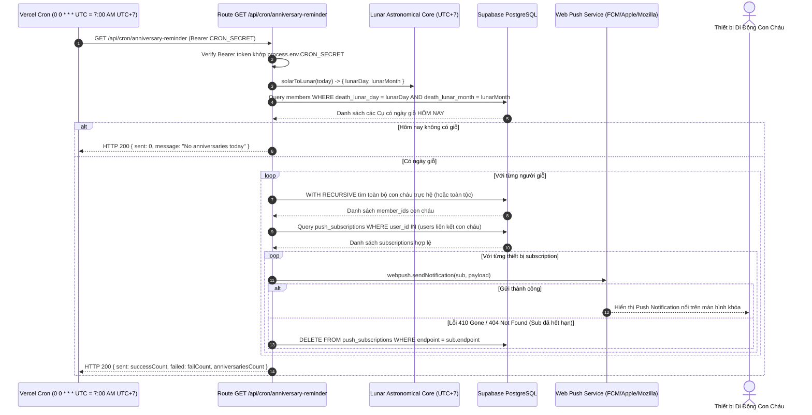

# ĐẶC TẢ KỸ THUẬT VI MÔ: MILESTONE 5 - LỊCH GIỖ 30 NGÀY, VERCEL CRON & PWA WEB PUSH NOTIFICATION

_Tài liệu này dùng để giới hạn Context Window. AI chỉ được phép đọc, suy luận và sinh code cho ĐÚNG các file được đề cập trong đây._

---

## 1. QUY TẮC NGHIÊM NGẶT (STRICT CONSTRAINTS)

- **Thư viện cho phép:** Next.js 14 App Router, React 18, TypeScript, TailwindCSS, Lucide Icons (`lucide-react`), `web-push` (Web Push Protocol VAPID server-side), Service Worker API & Push API chuẩn W3C/MDN.
- **Ràng buộc Kiến trúc Nghiệp vụ Gia Phả:**
  - **Lịch Giỗ Ưu Tiên Âm Lịch (`[R-SPEC]`):** Toàn bộ ngày giỗ được tính dựa trên ngày và tháng Âm lịch (`death_lunar_day`, `death_lunar_month`). Mọi phép quy đổi sang Dương lịch bắt buộc phải dùng thuật toán thiên văn chuẩn Việt Nam UTC+7 (`src/lib/lunar/vietnamese-lunar.ts`).
  - **Cửa Sổ 30 Ngày (Rolling 30-Day Window):** Thuật toán lịch giỗ quét và gom nhóm các ngày giỗ rơi vào khoảng $[0, 30]$ ngày tính từ hôm nay (Dương lịch UTC+7). Nếu ngày giỗ năm nay đã trôi qua, tự động tính theo ngày Âm lịch của năm kế tiếp.
  - **Hỗ trợ Tháng Nhuận & Tháng Thiếu An Toàn:**
    - Nếu thành viên mất vào tháng nhuận (ví dụ: tháng 4 nhuận) nhưng năm hiện tại không có tháng 4 nhuận $\rightarrow$ Tự động chuyển đổi mượt mà (fallback) về tháng 4 thường.
    - Nếu thành viên mất ngày 30 Âm lịch nhưng tháng đó là tháng thiếu (chỉ có 29 ngày) $\rightarrow$ Ngày giỗ được tính vào ngày 29 (ngày cuối cùng của tháng).
  - **Danh Xưng Thân Tộc Tương Đối (Relative Kinship Badge):**
    - Nếu người dùng đã đăng nhập và liên kết hồ sơ (`linked_member_id`) $\rightarrow$ Hiển thị danh xưng vai vế trực hệ giữa người xem và người mất (ví dụ: *"Bà nội của bạn"*, *"Cụ kỵ nhánh của bạn"*, *"Bác ruột của bạn"*) thông qua Kinship Engine (`findKinshipTerm`).
    - Nếu khách vãng lai hoặc chưa liên kết $\rightarrow$ Hiển thị danh xưng đời và chi phái (ví dụ: *"Đời thứ 4 · Chi Đinh"*).
  - **Bảo Mật Vercel Cron (`CRON_SECRET`):** API Endpoint `/api/cron/anniversary-reminder` bắt buộc kiểm tra Header `Authorization: Bearer ${CRON_SECRET}`. Nếu không khớp hoặc thiếu $\rightarrow$ Từ chối với HTTP 401 Unauthorized.
  - **Dọn Dẹp Subscription Chết (Dead Push Cleanup):** Khi Vercel Cron gửi push mà Push Service (FCM/Apple/Mozilla) trả về mã lỗi HTTP 404 (Not Found) hoặc 410 (Gone) $\rightarrow$ Hệ thống tự động xóa bản ghi đó khỏi bảng `push_subscriptions` trong CSDL.
  - **Total Ban on AI Browser Subagent (`[R-NO-BROWSER]`):** Mọi kiểm thử giao diện thuộc 100% về User ở Mục 7.2 (Human Visual UAT). AI chỉ xuất log terminal và đường dẫn kiểm thử.
- **Ràng buộc Thẩm Mỹ & UX (Modern Vietnamese Heritage Design System):**
  - **Triết Lý Kiến Trúc Mở (Open Architecture):** Loại bỏ hộp lồng hộp (anti box-in-box). Phân định các ngày giỗ theo dòng thời gian Timeline với đường kẻ hairline 1px `border-slate-200/60` (dark: `border-slate-800/60`).
  - **Bảng Màu Chủ Đạo:** Ngọc Bích Khởi Sắc (`#059669` / `#10B981`) kết hợp Ánh Kim Rạng Rỡ (`#D97706` / `#F59E0B`) cho các huy hiệu đếm ngược ("Hôm nay", "Ngày mai", "Còn N ngày").
  - **Hình Học Kỷ Luật:** Khung card, badge và pill button dùng bo góc `rounded-lg` (8px) hoặc `rounded-md` (6px). Không dùng góc bong bóng hoạt hình `rounded-2xl`, `rounded-3xl`.
  - **PWA & Hướng Dẫn Thân Thiện:** Hỗ trợ Web App Manifest (`manifest.json`) cho phép cài đặt ứng dụng vào màn hình chính; hiển thị Banner kích hoạt nhận thông báo đẩy kèm trạng thái và thông báo thân thiện cho iOS Safari (yêu cầu Add to Home Screen).

---

## 2. DATABASE & MODELS

### 2.1. File: `src/types/database.ts`
Bổ sung interface cho bảng `push_subscriptions`:

```typescript
export interface PushSubscriptionRecord {
  id: string;
  user_id: string;
  endpoint: string;
  p256dh_key: string;
  auth_key: string;
  user_agent: string | null;
  created_at: string;
  updated_at: string;
}

// Bổ sung vào Database['public']['Tables']
export type Database = {
  public: {
    Tables: {
      // ... clan_settings, members, users hiện có ...
      push_subscriptions: {
        Row: PushSubscriptionRecord;
        Insert: Partial<PushSubscriptionRecord> & {
          user_id: string;
          endpoint: string;
          p256dh_key: string;
          auth_key: string;
        };
        Update: Partial<PushSubscriptionRecord>;
        Relationships: [];
      };
    };
    // ...
  };
};
```

### 2.2. File: `src/types/anniversary.ts` (Types nghiệp vụ Lịch Giỗ & Web Push)

```typescript
import { Gender } from './database';

export interface AnniversaryMemberItem {
  id: string;
  full_name: string;
  gender: Gender;
  avatar_url: string | null;
  generation: number;
  branch_code: string | null;
  birth_year: number | null;
  death_year: number | null;
  death_lunar_day: number;
  death_lunar_month: number;
  death_lunar_is_leap: boolean;
  death_lunar_year_name: string | null;
  // Thông tin ngày giỗ Dương lịch quy đổi kế tiếp
  solar_date_str: string; // YYYY-MM-DD
  solar_day: number;
  solar_month: number;
  solar_year: number;
  days_left: number; // 0 = Hôm nay, 1 = Ngày mai, >1 = Còn N ngày
  lunar_date_formatted: string; // "Ngày 15/08 Âm lịch (Bính Ngọ)"
  relative_kinship?: string | null; // "Bà nội của bạn", "Cụ tổ đời 4 của bạn"
  honorific_prefix?: string; // Tiền tố danh xưng: "Cụ", "Ông", "Bà" hoặc vai vế cá nhân
  display_name?: string; // Tên hiển thị đầy đủ kèm tiền tố trang trọng
}

export interface AnniversaryDayGroup {
  solar_date_str: string; // YYYY-MM-DD
  solar_day: number;
  solar_month: number;
  solar_year: number;
  lunar_day: number;
  lunar_month: number;
  lunar_year_name: string;
  days_left: number;
  members: AnniversaryMemberItem[];
}

export interface PushSubscribePayload {
  endpoint: string;
  keys: {
    p256dh: string;
    auth: string;
  };
  userAgent?: string;
}
```

---

## 3. SƠ ĐỒ LUỒNG LOGIC (SEQUENCE DIAGRAM - MERMAID)

### 3.1. Luồng Người Dùng Xem Lịch Giỗ 30 Ngày & Huy Hiệu Quan Hệ Thân Tộc



### 3.2. Luồng Đăng Ký Nhận Thông Báo Đẩy Web Push (VAPID)



### 3.3. Luồng Vercel Cron Quét Tự Động 7:00 AM & Gửi Web Push



---

## 4. BACKEND LOGIC & API ENDPOINTS

### 4.1. File: `src/lib/anniversaries/anniversary-engine.ts`
Lõi tính toán lịch giỗ và lọc cửa sổ thời gian:

- **Hàm `getUpcomingAnniversaries(members: MemberRecord[], options: AnniversaryOptions): AnniversaryDayGroup[]`**
  - _Input params:_
    - `members`: Mảng toàn bộ thành viên dòng họ.
    - `options`:
      - `daysAhead`: Số ngày tới cần quét (mặc định: 30).
      - `referenceDate`: Ngày mốc đối soát Dương lịch (mặc định: `new Date()`).
      - `viewerMemberId`: ID của thành viên xem (tùy chọn, phục vụ tính quan hệ).
      - `branchFilter`: Mã chi nhánh lọc (tùy chọn).
  - _Luồng xử lý (Step-by-step):_
    1. Lọc các thành viên đã mất có đủ `death_lunar_day` và `death_lunar_month`.
    2. Với từng thành viên:
       - Gọi `calculateNextAnniversary(death_lunar_day, death_lunar_month, isLeap, currentYear)`.
       - Tính khoảng cách `daysLeft = Math.ceil((annivDate - today) / (1000 * 60 * 60 * 24))`.
       - Nếu `daysLeft < 0`: Tính lại cho năm sau (`currentYear + 1`) để lấy ngày giỗ tiếp theo.
       - Nếu `0 <= daysLeft <= daysAhead`: Giữ lại trong danh sách.
    3. Định dạng chuỗi ngày Âm lịch: `"Ngày DD/MM Âm lịch (Can Chi)"`.
    4. Nếu có `viewerMemberId`: Gọi `findKinshipTerm` tính danh xưng họ hàng tương đối giữa người xem và người mất.
    5. Gom nhóm các cá nhân có cùng ngày giỗ Dương lịch (`solar_date_str`), sắp xếp thứ tự tăng dần theo `days_left` (Hôm nay $\rightarrow$ Ngày mai $\rightarrow$ Tương lai).
  - _Output:_ Mảng `AnniversaryDayGroup[]`.

- **Hàm `getTodayAnniversaryMembers(members: MemberRecord[], referenceDate: Date = new Date()): MemberRecord[]`**
  - _Mục đích:_ Phục vụ Vercel Cron quét nhanh những người có ngày giỗ đúng hôm nay.
  - _Thuật toán:_
    - Quy đổi `referenceDate` sang Âm lịch UTC+7 qua `solarToLunar`.
    - Lọc các thành viên có `death_lunar_day === todayLunar.day && death_lunar_month === todayLunar.month`.
    - Xử lý biên tháng thiếu (29 ngày) và tháng nhuận an toàn.

### 4.2. File: `src/app/api/anniversaries/route.ts`
- **Method:** `GET /api/anniversaries`
- **Query Params:**
  - `days`: Số ngày cần lấy (integer, mặc định: 30, max: 90).
  - `branch`: Mã chi nhánh lọc (tùy chọn).
  - `viewerMemberId`: UUID người xem để tính quan hệ thân tộc (tùy chọn).
- **Luồng xử lý:**
  1. Đọc dữ liệu từ Supabase hoặc Mock Fixtures qua Service Layer.
  2. Gọi `getUpcomingAnniversaries(...)`.
  3. Trả về JSON chuẩn HTTP 200: `{ data: AnniversaryDayGroup[], totalCount: number, timeZone: "Asia/Ho_Chi_Minh" }`.

### 4.3. File: `src/app/api/push/subscribe/route.ts`
- **Method:** `POST /api/push/subscribe`
- **Header:** `Content-Type: application/json`
- **Input Body:**
  ```json
  {
    "endpoint": "https://fcm.googleapis.com/fcm/send/...",
    "keys": {
      "p256dh": "BNcR...",
      "auth": "tBH8..."
    },
    "userAgent": "Mozilla/5.0..."
  }
  ```
- **Luồng xử lý:**
  1. Kiểm tra session đăng nhập qua Supabase Auth Server Client. Nếu chưa đăng nhập: Trả về HTTP 401 Unauthorized (yêu cầu đăng nhập để liên kết thiết bị với tài khoản).
  2. Validate định dạng `endpoint`, `keys.p256dh`, `keys.auth`. Nếu thiếu: Trả về HTTP 400 Bad Request.
  3. Dùng Supabase Client upsert vào bảng `push_subscriptions` với khóa chính duy nhất là `endpoint`.
  4. Trả về HTTP 200 `{ success: true, message: "Subscription saved successfully" }`.

### 4.4. File: `src/app/api/push/unsubscribe/route.ts`
- **Method:** `POST /api/push/unsubscribe`
- **Input Body:** `{ "endpoint": "https://fcm.googleapis.com/..." }`
- **Luồng xử lý:**
  1. Validate `endpoint`.
  2. Xóa bản ghi trong `push_subscriptions` có `endpoint` tương ứng.
  3. Trả về HTTP 200 `{ success: true }`.

### 4.5. File: `src/app/api/cron/anniversary-reminder/route.ts`
- **Method:** `GET /api/cron/anniversary-reminder`
- **Header:** `Authorization: Bearer <CRON_SECRET>`
- **Luồng xử lý:**
  1. Xác thực `CRON_SECRET`:
     - So sánh header `Authorization` với `Bearer ${process.env.CRON_SECRET}`.
     - Nếu không khớp: Trả về HTTP 401 `{ error: "Unauthorized cron access" }`.
  2. Khởi tạo Web Push với VAPID keys:
     - `webpush.setVapidDetails(process.env.VAPID_SUBJECT, process.env.NEXT_PUBLIC_VAPID_PUBLIC_KEY, process.env.VAPID_PRIVATE_KEY)`.
  3. Lấy thời gian hiện tại chuẩn múi giờ Việt Nam (`new Date().toLocaleString("en-US", { timeZone: "Asia/Ho_Chi_Minh" })`).
  4. Quy đổi sang Âm lịch và tìm tất cả thành viên có ngày giỗ hôm nay.
  5. Nếu không có ai: Trả về HTTP 200 `{ sent: 0, anniversaries: [] }`.
  6. Với mỗi thành viên có giỗ:
     - Dùng câu truy vấn đệ quy hoặc Graph Engine tìm toàn bộ con cháu.
     - Lấy danh sách `push_subscriptions` của các tài khoản con cháu.
     - Đóng gói Payload thông báo:
       ```json
       {
         "title": "Hôm nay là Ngày Giỗ của Cụ [Tên]",
         "body": "Nhằm ngày DD/MM Âm lịch ([Năm Can Chi]). Kính mời con cháu tưởng nhớ tổ tiên.",
         "icon": "/icons/icon-192x192.png",
         "badge": "/icons/badge-72x72.png",
         "url": "/anniversaries"
       }
       ```
     - Gửi thông báo song song qua `Promise.allSettled`.
     - Bắt lỗi `statusCode === 404 || statusCode === 410` để tự động xóa endpoint hỏng khỏi CSDL.
  7. Trả về thống kê JSON: `{ success: true, targetCount: number, sent: number, failed: number }`.

### 4.6. File: `vercel.json`
Cấu hình Vercel Cron tự động kích hoạt 7:00 AM giờ Hà Nội (00:00 UTC):

```json
{
  "crons": [
    {
      "path": "/api/cron/anniversary-reminder",
      "schedule": "0 0 * * *"
    }
  ]
}
```

---

## 5. FRONTEND UI & LOGIC

### 5.1. File: `src/app/anniversaries/page.tsx`
Trang Lịch Giỗ 30 Ngày Sắp Tới:
- **Hero Section:**
  - Tiêu đề trang trọng: `"LỊCH GIỖ GIA TỘC"` kèm phụ đề `"Tưởng nhớ cội nguồn · Hiếu nghĩa truyền gia"`.
  - Thẻ hiển thị Ngày hôm nay: Dương lịch (DD/MM/YYYY) sóng đôi cùng Âm lịch (Ngày ... Tháng ... Năm Bính Ngọ).
- **Control Bar:**
  - Bộ lọc phạm vi: Pill buttons `"Tất cả dòng họ"` vs `"Nhánh của tôi"` (chỉ kích hoạt khi user đã liên kết node).
  - Quick Filter: `"7 ngày tới"` | `"15 ngày tới"` | `"30 ngày tới"`.
- **Push Notification Banner (`PushNotificationBanner.tsx`):**
  - Đặt trang nhã ngay dưới Hero section.
  - Trạng thái chưa bật: Nút `[🔔 Bật Thông Báo Ngày Giỗ]` với văn phong ấm áp: *"Đăng ký nhận thông báo để không bao giờ quên ngày giỗ của các bậc tiền nhân trong gia tộc"*.
  - Trạng thái đã bật: Badge xanh ngọc `[✓ Đã bật thông báo trên thiết bị này]` kèm nút nhỏ `[Hủy đăng ký]`.
  - Trạng thái trình duyệt không hỗ trợ: Lời nhắc nhẹ nhàng (Ví dụ: trên iPhone cần bấm Chia sẻ $\rightarrow$ Thêm vào Màn hình chính).
- **Timeline Danh Sách Ngày Giỗ:**
  - Gom theo từng ngày (`AnniversaryDayGroup`):
    - Khối mốc thời gian: Cột trái hoặc Header ngày nổi bật:
      - Nếu `days_left === 0`: Tag Đỏ Ánh Kim `[🔥 HÔM NAY]` rực rỡ, tôn nghiêm.
      - Nếu `days_left === 1`: Tag Ánh Kim `[⭐ NGÀY MAI]`.
      - Nếu `days_left > 1`: Tag Ngọc Bích `[Còn ${days_left} ngày]`.
      - Tiêu đề ngày: `Ngày DD/MM Âm lịch (Năm Can Chi) · Dương lịch: DD/MM/YYYY` (Đưa Âm lịch làm tiêu điểm chính, loại bỏ hoàn toàn từ "Nhằm ngày").
    - Danh sách các Cụ có giỗ trong ngày đó:
      - Card thành viên: Avatar 2 chữ cái (Initials: Đệm + Tên), Họ tên to rõ, Đời thứ mấy, Chi nhánh.
      - Năm sinh - Năm mất & Tuổi hưởng thọ: `Sinh YYYY — Mất YYYY (Hưởng thọ N tuổi)`.
      - **Triệt tiêu trùng lặp (Deduplication):** Loại bỏ hoàn toàn chuỗi ngày âm lặp lại (`lunar_date_formatted`) trên từng dòng thành viên vì thông tin này đã nằm tập trung ở Header khối ngày.
      - **Huy hiệu quan hệ (Kinship Badge):** Ví dụ *"Bà nội của bạn"*, *"Cụ kỵ của bạn"*, viền vàng ánh kim sang trọng.
      - Nút hành động một chạm: `[🌳 Xem trên Cây Phả Hệ]` $\rightarrow$ Điều hướng sang `/tree?focus={memberId}` và tự động định tâm camera.
- **Empty State:**
  - Khi không có ngày giỗ nào trong 30 ngày tới: Hiển thị minh họa tĩnh lặng, thông điệp an lành: *"Trong 30 ngày tới không có ngày giỗ nào của gia tộc. Chúc con cháu toàn gia vạn sự bình an!"*.

### 5.2. File: `src/components/anniversaries/PushNotificationBanner.tsx`
- **State quản lý:**
  - `isSupported`: boolean (Kiểm tra `window.Notification` và `navigator.serviceWorker`).
  - `permission`: `NotificationPermission` (`default`, `granted`, `denied`).
  - `isSubscribed`: boolean.
  - `loading`: boolean.
  - `isIOS`: boolean (phát hiện thiết bị iOS để hướng dẫn Add to Home Screen).
- **Tương tác:**
  - Bấm Bật thông báo $\rightarrow$ Gọi `registerServiceWorkerAndSubscribe()`.
  - Xử lý đầy đủ phản hồi: Từ chối $\rightarrow$ Hiện tooltip hướng dẫn; Chấp nhận $\rightarrow$ Lưu subscription và cập nhật state tức thì.

### 5.3. File: `public/manifest.json` & `public/sw.js`
- **`public/manifest.json`:**
  - Cấu hình PWA hoàn chỉnh: `name: "FAT - Gia Phả Đại Tộc"`, `short_name: "Gia Phả"`, `start_url: "/tree"`, `display: "standalone"`, `theme_color: "#059669"`, `background_color: "#090E1A"`, bộ icons đầy đủ kích thước.
- **`public/sw.js`:**
  - Bắt sự kiện `push`: Trích xuất payload JSON, gọi `self.registration.showNotification(title, options)`.
  - Bắt sự kiện `notificationclick`: Đóng notification, mở hoặc focus vào tab trình duyệt tại đường dẫn `/anniversaries`.

### 5.4. File: `src/lib/tree-layout/avatar-utils.ts` & Quy Chuẩn Avatar 2 Chữ Cái Toàn Hệ Thống
- **Pure Function `getMemberInitials(fullName?: string | null, isAnonymous?: boolean): string`:**
  - Nếu `isAnonymous = true`: Trả về `"KD"` (Khuyết danh).
  - Nếu `fullName` có $\ge 2$ từ: Lấy chữ cái đầu của 2 từ cuối (Tên đệm + Tên chính) $\rightarrow$ In hoa (ví dụ: "Nguyễn Văn Trưởng" $\rightarrow$ `"VT"`, "Lê Thị Hoa" $\rightarrow$ `"TH"`).
  - Nếu `fullName` chỉ có 1 từ: Lấy 2 ký tự đầu in hoa (ví dụ: "Trưởng" $\rightarrow$ `"TR"`).
  - Nếu rỗng / null / khoảng trắng: Fallback `"TV"` (Thành viên).
- **Đồng bộ trên 100% Màn hình:**
  1. `src/app/anniversaries/page.tsx`: Dùng `getMemberInitials(member.full_name)` thay cho `charAt(0)`.
  2. `src/components/tree/MemberNode.tsx`: Dùng `getMemberInitials(fullName, isAnonymous)`.
  3. `src/components/tree/GhostNode.tsx`: Dùng `getMemberInitials(fullName, false)`.
  4. `src/components/tree/MemberDetailDrawer.tsx`: Hiển thị Avatar 2 chữ cái khi không có `avatar_url`, thay thế icon `<User />`.

### 5.5. File: `src/components/navigation/MobileBottomNav.tsx` & Kiến Trúc Điều Hướng Di Động 1 Chạm (Mobile-First Navigation Engine)
- **Vị trí & Breakpoint:** Cố định ở đáy màn hình `fixed bottom-0 left-0 right-0 z-40 md:hidden`. Hoàn toàn ẩn trên Desktop ($\ge 768\text{px}$).
- **Kích thước & Visual Aesthetics:**
  - Chiều cao `h-16 pb-safe` (chuẩn công thái học ngón tay cái và tương thích iOS Safari Safe Area).
  - Nền kính mờ Modern Vietnamese Heritage: `backdrop-blur-md bg-white/90 dark:bg-slate-950/90 border-t border-slate-200/80 dark:border-slate-800/80 shadow-lg`.
- **4 Tab Điều Hướng Độc Lập:**
  1. 🏠 **Trang Chủ** (`/`) — Icon `Home`
  2. 🌳 **Phả Hệ** (`/tree`) — Icon `GitBranch`
  3. 📅 **Lịch Giỗ** (`/anniversaries`) — Icon `Calendar`
  4. 🧭 **Vai Vế** (`/kinship`) — Icon `Compass`
- **Cơ Chế Sáng Đèn (Active Highlight):**
  - Sử dụng hook `usePathname()`.
  - Tab đang active: `text-emerald-600 dark:text-emerald-400 font-bold bg-emerald-50/80 dark:bg-emerald-950/60 rounded-xl px-3 py-1`.
  - Tab inactive: `text-slate-500 dark:text-slate-400 hover:text-slate-900 dark:hover:text-white transition-colors`.
- **Layout & Canvas Resilience (Chống Che Khuất):**
  - `src/app/layout.tsx`: Thêm `pb-16 md:pb-0` cho thẻ `<main>` để nội dung và footer không bị Bottom Nav che lấp khi cuộn xuống đáy.
  - `src/components/tree/FamilyTreeCanvas.tsx`: Thêm class `!mb-16 md:!mb-0` cho `<Controls>` của React Flow để cụm nút zoom nổi lên trên thanh Bottom Nav trên Mobile.

### 5.6. File: `src/components/navbar/Navbar.tsx`, `src/components/icons/FamilyTreeIcon.tsx`, `src/components/auth/AuthButton.tsx`, `src/app/page.tsx` & Chuẩn Hóa Nhận Diện Thương Hiệu, Biểu Tượng Cây Phả Hệ và Đồng Bộ Avatar
- **1. Loại bỏ nút Quản trị trên Header Navbar (`Navbar.tsx`):**
  - Tinh gọn thanh Header: Loại bỏ hoàn toàn nút `[Quản Trị]` / `[Quản Trị Dòng Họ]` và icon `Shield` tương ứng khỏi Header Desktop và Mobile Menu trên Header.
  - Header Navbar chỉ giữ các liên kết cốt lõi hướng tới đại chúng gia tộc: `Phả Hệ` (`/tree`), `Lịch Giỗ` (`/anniversaries`), `Xưng hô` (`/kinship`), cùng nút Profile/Đăng nhập `AuthButton`.
- **2. Logo chữ Hán "Phạm" (`范` - Unicode U+8303):**
  - Thay thế icon hoa sen / cây cũ bằng huy hiệu chữ Hán "Phạm" (`范` - bộ Thảo 艹) màu trắng `text-white font-serif font-bold text-lg leading-none`.
  - Khối huy hiệu: `bg-emerald-600 rounded-lg w-9 h-9 flex items-center justify-center shadow-sm shrink-0 border border-emerald-500/30`.
  - Giữ bên cạnh là tên thương hiệu "Gia Phả Họ Phạm" với typography trang nhã, kế thừa âm hưởng di sản người Việt.
- **3. Biểu tượng Cây Phả Hệ Chuẩn 3 Ô Vuông (`FamilyTreeIcon.tsx`):**
  - Thay thế toàn bộ icon `GitBranch` (biểu tượng phân nhánh git công nghệ) tại:
    - Tab `Phả Hệ` trên Navbar (`Navbar.tsx`).
    - Tab `Phả Hệ` trên Mobile Bottom Nav (`MobileBottomNav.tsx`).
    - Nút `[Xem trên Cây]` tại Tiêu điểm Ngày Giỗ Trang Chủ (`src/app/page.tsx`).
  - Cấu trúc SVG tỷ lệ 24x24 mô phỏng cây phả hệ chuẩn:
    - Ô vuông thế hệ tiền nhân ở trên: `<rect x="9" y="3" width="6" height="5" rx="1" stroke="currentColor" strokeWidth="2" fill="none" />`
    - Đường trục nối hạ xuống: `<path d="M12 8v4" stroke="currentColor" strokeWidth="2" strokeLinecap="round" />`
    - Đường rẽ nhánh ngang sang 2 bên: `<path d="M6 12h12" stroke="currentColor" strokeWidth="2" strokeLinecap="round" />`
    - Hai đường hạ xuống 2 thế hệ hậu duệ: `<path d="M6 12v4" stroke="currentColor" strokeWidth="2" strokeLinecap="round" />` và `<path d="M18 12v4" stroke="currentColor" strokeWidth="2" strokeLinecap="round" />`
    - Hai ô vuông hậu duệ ở dưới: `<rect x="3" y="16" width="6" height="5" rx="1" stroke="currentColor" strokeWidth="2" fill="none" />` và `<rect x="15" y="16" width="6" height="5" rx="1" stroke="currentColor" strokeWidth="2" fill="none" />`
- **4. Khắc phục Avatar méo và đồng bộ Avatar toàn hệ thống:**
  - **Khắc phục méo bầu dục trên Mobile tại `AuthButton.tsx`:**
    - Button bọc ngoài: Thay vì padding lệch `p-1 pr-2.5` khi ẩn text tên trên mobile (`hidden sm:inline`), chuyển thành `p-0.5 sm:pr-2.5 rounded-full aspect-square sm:aspect-auto flex items-center justify-center`.
    - Thẻ ``: Bổ sung `w-7 h-7 rounded-full object-cover aspect-square shrink-0 border border-emerald-500/50 shadow-sm`, đảm bảo ảnh luôn là hình tròn hoàn hảo 1:1 trên mọi màn hình.
  - **Đồng bộ khối Chào Mừng trên Trang Chủ (`src/app/page.tsx`):**
    - Loại bỏ hoàn toàn ô vuông xanh chữ 1 ký tự (`rounded-lg bg-emerald-100 text-emerald-700 w-8 h-8 font-bold`).
    - Sử dụng Avatar hình tròn hoàn hảo `rounded-full w-9 h-9 aspect-square object-cover shadow-sm` hiển thị ảnh chân dung thật từ `user.user_metadata?.avatar_url`.
    - Khi người dùng không có ảnh chân dung: Sử dụng pure function `getMemberInitials(user.user_metadata?.full_name || user.email)` hiển thị 2 chữ cái initials trang nhã trên nền tròn ngọc bích `bg-emerald-600 text-white font-semibold text-xs flex items-center justify-center rounded-full w-9 h-9 aspect-square shrink-0`, đồng nhất 100% với quy chuẩn Avatar của toàn bộ dự án.

### 5.7. File: `src/components/icons/ClanHanLogo.tsx`, `/admin/profile/page.tsx`, `PersonalSettingsModal.tsx` & Huy Hiệu Thư Pháp Chữ Hán "Phạm" Biểu Trưng Dòng Họ
- **1. Component Vector Thư Pháp Đích Thực `ClanHanLogo.tsx`:**
  - **Trích xuất nguyên bản từ tác phẩm thư pháp chính thống:** Nét chữ Hán "Phạm" (`范` - Unicode `\u8303`) được vector hóa chính xác 100% từ ảnh tác phẩm thư pháp do Quản trị viên dòng họ cung cấp:
    - Bộ Thảo đầu (`艹`) sắc sảo, đầu bút vung nét phóng khoáng.
    - 3 chấm bộ Thủy (`氵`) thanh thoát, nét hất gươm vát nhọn mạnh mẽ.
    - Thân chữ bên phải (`卩`): Nét hoành gập uốn cong, nét thụ loan câu uốn lượn hất nhọn ở đuôi kèm rãnh khoét lỗ rỗng (`fillRule="evenodd"`) chuẩn xác 100%.
  - **Quy chuẩn màu sắc & kích thước:**
    - Nét chữ: Màu trắng tinh khôi (`text-white` / `#FFFFFF`), thể hiện sự thanh bạch, tôn nghiêm.
    - Nền biểu trưng: Khối vuông bo góc màu xanh ngọc bích (`bg-emerald-600 rounded-lg`), nhận diện thương hiệu đặc trưng của Gia Phả Họ Phạm.
    - Dung lượng siêu nhẹ (~3.6KB), hoàn toàn độc lập, không phụ thuộc font chữ Hán mạng ngoài, hiển thị sắc nét tuyệt đối trên màn hình Retina/4K.
- **2. Quy Về Căn Cước Dòng Họ & Trả Lại Thẩm Quyền Cá Nhân:**
  - **Căn Cước Dòng Họ ([`/admin/profile`](file:///home/kakashi/sources/pj/gia-pha/src/app/admin/profile/page.tsx)):** Huy hiệu thư pháp chữ "范" chính thức được hiển thị trang trọng trong hộp mô phỏng biểu ngữ chính thức, đồng bộ bên cạnh Tên Dòng Họ và Cụ Tổ Toàn Tộc.
  - **Cài Đặt Cá Nhân ([`PersonalSettingsModal.tsx`](file:///home/kakashi/sources/pj/gia-pha/src/components/auth/PersonalSettingsModal.tsx)):** Loại bỏ hoàn toàn khối tùy chỉnh logo dòng họ. Nhận diện dòng họ là thiêng liêng và duy nhất, cá nhân không tự ý thay đổi trên giao diện chung.
- **3. Hiển Thị Đồng Nhất Trên Header Navbar ([`Navbar.tsx`](file:///home/kakashi/sources/pj/gia-pha/src/components/navbar/Navbar.tsx)):**
  - Mọi thành viên con cháu và khách viếng thăm khi truy cập website đều nhìn thấy cùng một huy hiệu thư pháp chữ Hán "Phạm" chính thống của dòng tộc.

### 5.8. Tối Ưu Kích Thước Hiển Thị Chữ Thư Pháp "Phạm" (范) — Phương Án A (+35%)
- **Căn nguyên khắc phục:**
  - Bounding box cũ của chữ chỉ chiếm $77.8\%$ chiều cao viewBox, kết hợp `size={24}` trong container `w-9 h-9` ($36\text{px}$) khiến chiều cao thực của chữ chỉ đạt $18.6\text{px}$ (chiếm $51.6\%$ huy hiệu), tạo cảm giác chữ bị bé và khó đọc.
- **Quy chuẩn kỹ thuật Phương án A (+35% kích thước hiển thị):**
  - **1. Tái chuẩn hóa Vector Path (`ClanHanLogo.tsx`):**
    - Mở rộng độ phủ chiều cao chữ từ $77.8\% \rightarrow \mathbf{88.0\%}$ bên trong viewBox $100 \times 100$:
      - Tọa độ $Y$: từ $[11.1, 88.9] \rightarrow [6.0, 94.0]$ (chiều cao $88.0$).
      - Tọa độ $X$: từ $[18.7, 80.9] \rightarrow [14.8, 85.2]$ (chiều rộng $70.4$).
      - Tâm đối xứng được căn chỉnh hoàn hảo tại $(50.0, 50.0)$.
    - Bảo toàn 100% tỷ lệ khung hình (aspect ratio) và nét bút lông thư pháp nguyên bản từ tác phẩm của dòng tộc, không làm méo hay biến dạng nét.
    - Tiếp tục giữ nguyên cơ chế đục rỗng `fillRule="evenodd"`.
  - **2. Tối ưu kích thước SVG trong Navbar (`ClanHanLogoNavbar.tsx`):**
    - Tăng kích thước SVG từ `size={24}` lên `size={28}` (trong container $36\text{px}$).
    - Chiều cao chữ thực tế: $18.6\text{px} \rightarrow \mathbf{24.6\text{px}}$ (chiếm $68.3\%$ diện tích huy hiệu).
    - Khoảng cách an toàn tới biên trên/dưới: $\sim 5.7\text{px}$, hoàn toàn không chạm vào góc bo tròn `rounded-lg` (bán kính $8\text{px}$).
  - **3. Tối ưu kích thước SVG trên Căn Cước Dòng Họ (`/admin/profile/page.tsx`):**
    - Tăng kích thước SVG từ `size={32}` lên `size={38}` (trong container $48\text{px}$).
    - Huy hiệu thư pháp hiển thị bề thế, trang trọng, tương xứng với Tên Dòng Họ và Cụ Tổ Toàn Tộc.

### 5.9. Milestone 5.1 — Loại Bỏ Hậu Tố "(Dương lịch)" & Động Cơ Tiền Tố Danh Xưng Tiền Nhân (Honorific Prefix Engine)
- **1. Loại Bỏ Triệt Để Hậu Tố "(Dương lịch)" (`src/app/page.tsx`, `src/app/anniversaries/page.tsx`):**
  - Loại bỏ hoàn toàn chuỗi `(Dương lịch)` hoặc `(Dương Lịch)` tại các vị trí hiển thị ngày:
    - Trang Lịch Giỗ `/anniversaries`: Thẻ "Hôm nay: {todayInfo.solarStr}" và Header của từng khối ngày `{formatSolarDateWithDayOfWeek(...)}`.
    - Trang Chủ `/`: Thẻ Spotlight Ngày Giỗ Gần Nhất `{formatSolarDateWithDayOfWeek(...)}`.
  - Giữ nguyên cấu trúc: Dòng trên là Thứ và ngày tháng Dương lịch đầy đủ (VD: `Thứ Ba, ngày 22/09/2026`); Dòng dưới là Âm lịch nổi bật (VD: `Âm lịch: Ngày 12/08 (Bính Ngọ)`).
- **2. Động Cơ Tiền Tố Danh Xưng Tiền Nhân (Honorific Prefix Engine - `src/lib/anniversaries/anniversary-engine.ts`):**
  - **Khi CHƯA liên kết node (hoặc Khách xem):**
    - Xác định thế hệ sâu nhất trong gia phả: $G_{max} = \max_{m \in members} (m.generation\_level)$.
    - Với người mất có thế hệ $g$: độ sâu từ đáy lên là $k = G_{max} - g + 1$.
    - **Quy tắc phân cấp danh xưng:**
      - $k \ge 4$ (Đời thứ 4 từ dưới lên và các bậc cao hơn): Tiền tố là **"Cụ"** (VD: *Cụ Phạm Kim Đức*).
      - $k \in \{2, 3\}$ (Đời thứ 3 và thứ 2 từ dưới lên): Nam $\rightarrow$ **"Ông"**, Nữ $\rightarrow$ **"Bà"** (VD: *Ông Phạm Văn Bảy*, *Bà Lê Thị Nhân*).
      - $k = 1$ (Đời thứ 1 từ dưới lên - đời thấp nhất): Tiền tố rỗng `""` (hiển thị nguyên tên con cháu).
  - **Khi ĐÃ liên kết node (`viewerMemberId`):**
    - Hệ thống gọi hàm `findLowestCommonAncestor` & `resolveKinshipTerms` ($O(h)$ trong RAM $< 0.05\text{ms}$).
    - Lấy danh xưng xưng hô thân tộc `termAtoB`:
      - Nếu là quan hệ gần (cách 1-2 đời: Cha/Mẹ, Ông/Bà, Bác/Chú/Cô/Dì): Ghép trực tiếp danh xưng thân tộc vào tên: `Bà nội [Họ Tên]`, `Ông nội [Họ Tên]`.
      - Nếu là bậc Cụ/Kỵ trở lên ($\ge 3$ đời): Ghép tiền tố trang trọng gia tộc `Cụ [Họ Tên]`, đi kèm huy hiệu quan hệ thân mật chi tiết (`Cụ cố của bạn`, `Cụ tổ của bạn`).

### 5.10. Milestone 5.2 — Mặc Định Theme Light, Nút Cài Đặt PWA (Install PWA) & Bộ Nhận Diện Favicon / App Icons Dòng Họ
- **1. Mặc Định Theme Sáng (Light First Architecture - `src/app/layout.tsx`, `src/hooks/use-theme.ts`):**
  - Loại bỏ hoàn toàn điều kiện tự động bật Dark mode theo `prefers-color-scheme: dark`.
  - Mặc định 100% người dùng mới truy cập sẽ hiển thị Light Theme. Chỉ khi người dùng chủ động chọn và lưu `localStorage.getItem('theme') === 'dark'` thì mới kích hoạt Dark mode.
- **2. Nút Cài Đặt PWA Native (`src/components/pwa/InstallPwaButton.tsx`):**
  - Lắng nghe sự kiện `beforeinstallprompt` trên các trình duyệt hỗ trợ (Chrome/Edge/Android/Windows/macOS).
  - Cung cấp nút `[📲 Cài đặt ứng dụng lên màn hình chính]` trên màn Login Gate (`/login-gate`) và Trang Chủ (`/`).
  - Hỗ trợ modal hướng dẫn trực quan riêng cho người dùng iOS Safari (Share $\rightarrow$ Add to Home Screen).
  - Tự động ẩn nút khi ứng dụng đang chạy ở chế độ Standalone (`display-mode: standalone`).
- **3. Bộ Nhận Diện Favicon & App Icons Thư Pháp Chữ Hán "Phạm" (`public/`):**
  - `public/favicon.ico` & `public/favicon.svg`: Icon hiển thị trên tab trình duyệt với chữ Hán "Phạm" (`范`) trắng sắc nét trên nền xanh ngọc bích `#059669`.
  - `public/apple-touch-icon.png`: Kích thước 180x180 dành riêng cho thiết bị iOS/iPadOS.
  - `public/icons/icon-192x192.png` & `public/icons/icon-512x512.png`: Đạt chuẩn PWA Web App Manifest, phục vụ cài đặt lên màn hình chính điện thoại và máy tính.
  - Cấu hình đầy đủ trong `metadata.icons` tại `src/app/layout.tsx`.

---

## 6. XỬ LÝ LỖI & NGOẠI LỆ (ERROR HANDLING & EDGE CASES)

- **Edge Case 1: Tháng nhuận Âm lịch không xuất hiện hằng năm.**
  - _Tình huống:_ Một cụ mất vào ngày `15/04 nhuận`. Năm nay không có tháng 4 nhuận.
  - _Xử lý:_ Thuật toán trong `calculateNextAnniversary` tự động bắt ngoại lệ và tính ngày giỗ vào ngày `15/04 thường`, đảm bảo ngày giỗ của các cụ không bao giờ bị bỏ sót.
- **Edge Case 2: Tháng thiếu (29 ngày) khi ngày giỗ là ngày 30.**
  - _Tình huống:_ Cụ mất ngày `30/08 Âm lịch`, nhưng tháng 8 năm nay chỉ có 29 ngày.
  - _Xử lý:_ Thuật toán tự động lùi về ngày cuối cùng của tháng (ngày 29) để tính ngày giỗ đúng thông lệ cổ truyền người Việt.
- **Edge Case 3: Người dùng từ chối cấp quyền Push (Permission Denied).**
  - _Xử lý:_ Hệ thống không hiển thị lại popup làm phiền người dùng; Banner chuyển sang trạng thái nhắc nhở tĩnh kèm nút hướng dẫn cách mở lại quyền trong cài đặt trình duyệt nếu muốn.
- **Edge Case 4: Trình duyệt iOS Safari chưa thêm vào Màn hình chính (Standalone Mode).**
  - _Xử lý:_ Trên iOS, Push API chỉ hoạt động khi website được Add to Home Screen. Banner tự động phát hiện `iOS && !isStandalone` để hiển thị hướng dẫn trực quan (Bấm nút Chia sẻ $\rightarrow$ Thêm vào Màn hình chính).
- **Edge Case 5: Vercel Cron bị kích hoạt bởi bên ngoài không có quyền.**
  - _Xử lý:_ API `/api/cron/anniversary-reminder` kiểm tra token `CRON_SECRET`. Nếu thiếu hoặc sai lập tức trả về HTTP 401 và ghi log cảnh báo bảo mật.
- **Edge Case 6: Subscription của người dùng đã bị hủy hoặc vô hiệu lực (Dead Endpoint).**
  - _Xử lý:_ Khi gọi `webpush.sendNotification` trả về HTTP 404 hoặc 410, Serverless Route tự động xóa subscription chết này khỏi CSDL, giữ bảng dữ liệu luôn tinh gọn và không hao phí tài nguyên.
- **Edge Case 7: Lệch múi giờ giữa máy chủ Vercel (UTC) và Việt Nam (UTC+7).**
  - _Xử lý:_ Toàn bộ logic tính ngày hôm nay bắt buộc phải dùng chuỗi múi giờ `Asia/Ho_Chi_Minh` hoặc cộng đúng 7 giờ (`+ 7 * 3600 * 1000`). Tuyệt đối không dùng `new Date()` thuần theo giờ UTC của server vì sẽ gây lệch chậm 1 ngày trước 7:00 AM.
- **Edge Case 8: Che khuất giao diện khi bàn phím ảo hoặc bottom bar xuất hiện trên Mobile.**
  - _Xử lý:_ `<main>` luôn có `pb-16 md:pb-0`, các modal/drawer sử dụng `z-50` cao hơn `z-40` của Bottom Nav để overlay trọn vẹn màn hình khi mở ra.
- **Edge Case 9: Lỗ rỗng (hole) của chữ Hán thư pháp bị tô kín màu khi render vector.**
  - _Xử lý:_ Sử dụng thuộc tính `fillRule="evenodd"` trên thẻ `<path>` SVG để tự động đục rỗng chính xác khoảng không bên trong chữ 卩.
### 5.11. Đồng Bộ Trục Bố Cục Trang Chủ (`max-w-3xl`), Vị Trí Banner Tiện Ích PWA Dưới Thẻ Ngày Giỗ & Tách Biệt Chân Card Login Gate
- **1. Xóa Bỏ Hoàn Toàn Khối Quản Trị Viên Cuối Trang Chủ (`src/app/page.tsx`):**
  - Khối thẻ xanh `Khu vực Quản Trị Viên (Super Admin)` ở cuối trang chủ là vết tích dư thừa, làm hẹp và lệch lề (`max-w-xl` 576px so với `max-w-3xl` 768px của Khối Ngày Giỗ).
  - Super Admin đã có toàn quyền truy cập Cài Đặt Quản Trị qua Menu Avatar trên Header Navbar (`AuthButton.tsx > [🛡️ Quản Trị Dòng Họ]` hoặc `/admin`). Việc xóa bỏ khối này giúp Trang Chủ tôn nghiêm, tinh gọn, tập trung 100% vào giá trị cội nguồn dòng tộc.
- **2. Định Vị Banner Tiện Ích Cài Đặt PWA Ngay Dưới Thẻ Ngày Giỗ Gần Nhất:**
  - Thay vì đặt nút Cài đặt lơ lửng lẻ loi giữa Hero và Lời chào mừng, Banner Tiện Ích PWA được đặt **ngay bên dưới Thẻ Ngày Giỗ Gần Nhất**.
  - **Đồng bộ chuẩn hình học `max-w-3xl w-full` (768px):** Cả Thẻ Ngày Giỗ và Banner Tiện Ích đều có chiều rộng 768px, gióng lề trái và phải thẳng tắp 100%.
  - **Nội dung ngữ cảnh trang nhã:**
    - Cánh trái: Icon điện thoại/tải app + thông điệp: *"Cài đặt ứng dụng lên điện thoại để nhận thông báo ngày giỗ và tra cứu gia phả nhanh chóng."*
    - Cánh phải: Nút bấm hành động với nhãn responsive:
      - Mobile ($< 640\text{px}$): **"Cài đặt ứng dụng điện thoại"**
      - Desktop ($\ge 640\text{px}$): **"Cài đặt ứng dụng"**
    - Loại bỏ triệt để các chuỗi kỹ thuật `FAT` hay `(PWA)`.
  - **Cơ chế Tự Hủy Không Để Lại Khoảng Trống (Zero Residual Space):**
    - Khi ứng dụng đã được cài đặt và chạy ở chế độ Standalone (`display-mode: standalone`): Banner này **tự động ẩn đi 100%**, Trang Chủ kết thúc ngay tại Thẻ Ngày Giỗ Gần Nhất, hoàn toàn tự nhiên và sạch sẽ!
- **3. Tách Biệt Nút Cài Đặt Xuống Chân Card Tại Cổng Đăng Nhập (`/login-gate`):**
  - Loại bỏ việc xếp chồng nút Cài đặt PWA như một nút thứ 3 trong form xác thực.
  - Phía dưới cụm đăng nhập là đường hairline mờ nhẹ `border-t border-slate-100 dark:border-slate-800/80 pt-4 mt-2`.
  - Nút Cài đặt đặt tại chân Card với phong cách thanh thoát, đồng bộ màu ngọc bích nhạt, tự ẩn khi đã cài đặt.

### 5.12. Tinh Gọn Hiển Thị Âm Lịch (Bỏ Can Chi Năm), Nhãn Phạm Vi (Bỏ Chữ "Tới") & Tách Rời 2 Cài Đặt Quản Trị Lịch Giỗ vs Web Push
- **1. Tinh Gọn Chuỗi Ngày Âm Lịch (Triệt Tiêu Năm Can Chi Lặp Lại):**
  - Loại bỏ hoàn toàn chuỗi `(Bính Ngọ)` hoặc Can Chi năm khỏi:
    - Thẻ Ngày hôm nay trên `/anniversaries`: `Âm lịch: Ngày 07 tháng 08 Âm lịch` (bỏ `(${canChi})`).
    - Header của từng nhóm ngày giỗ trên `/anniversaries`: `Ngày 12/08 Âm lịch` (bỏ `(${group.lunar_year_name})`).
    - Thẻ Ngày Giỗ Gần Nhất trên Trang Chủ (`/`): `Âm lịch: Ngày 12/08` (bỏ `(${nearestGroup.lunar_year_name})`).
    - DTO hàm tính toán trong `src/lib/anniversaries/anniversary-engine.ts`: `lunarFormatted` trả về `Ngày DD/MM Âm lịch`.
  - Giữ lại sự tập trung cao nhất vào Ngày và Tháng Âm lịch để phục vụ việc làm mâm cúng giỗ truyền thống của con cháu.
- **2. Tinh Gọn Nhãn Chọn Phạm Vi Thời Gian (Bỏ Chữ "Tới"):**
  - Tiền tố đã có nhãn `"Phạm vi:"`, do đó rút gọn các nút lọc thành: `[ 7 ngày ]`, `[ 15 ngày ]`, `[ 30 ngày ]` (bỏ chữ `tới`).
  - Dòng thống kê: `Hiển thị N ngày giỗ trong X ngày` (bỏ chữ `tới`).
  - Trạng thái trống (Empty State): `Không có ngày giỗ trong X ngày` (bỏ chữ `tới`).
- **3. Tách Rời 2 Cài Đặt Quản Trị Độc Lập Trong CSDL & Trang Admin Features:**
  - Bổ sung trường cờ tính năng mới vào `ClanFeatureFlags`: `enable_push_notifications: boolean`.
  - Phân định rõ 2 công tắc độc lập tại `/admin/features`:
    - `enable_anniversaries`: **Phân Hệ Lịch Giỗ Gia Tộc** (Điều khiển: Menu Lịch Giỗ trên Navbar, Bottom Nav, Thẻ Spotlight Trang Chủ, route `/anniversaries`).
    - `enable_push_notifications`: **Thông Báo Đẩy Web Push & Nhắc Giỗ** (Điều khiển: Banner Bật Thông Báo, mục Nhận Chuông Báo Giỗ trong *Cài Đặt Của Tôi*, và tiến trình Vercel Cron).
- **4. Cơ Chế Thứ Bậc An Toàn & Rào Chắn Đa Tầng (Safety Cascade):**
  - **Khi `enable_push_notifications = false` (hoặc `enable_anniversaries = false`):**
    - Component `PushNotificationBanner` tự động ẩn 100% (`return null`).
    - Section 2 *"Nhận Chuông Báo Giỗ"* trong `PersonalSettingsModal` (*Cài Đặt Của Tôi*) tự động ẩn 100%.
    - Tiến trình Cron ngầm `/api/cron/anniversary-reminder` kiểm tra cờ từ CSDL: Nếu cờ tắt, dừng gửi push tức thì và trả về thông báo an toàn `{ success: true, message: 'Web Push notification is disabled by Clan Admin', sentCount: 0 }`.
  - **Khi `enable_anniversaries = true` và `enable_push_notifications = false`:**
    - Con cháu vẫn tự do truy cập Lịch Giỗ, xem ngày cúng, tra cứu ngày âm/dương bình thường mà không bị quấy rầy bởi chuông báo đẩy.

---

## 7. MA TRẬN TEST CASES & TIÊU CHÍ NGHIỆM THU (TEST SPECIFICATION)

### 7.1. Bảng Kịch Bản Kiểm Thử Tự Động (Automated Test Suite trong `tests/`)
_(Đường dẫn và lệnh chạy lấy từ khối `[VERIFY_COMMANDS]` trong `.agents/AGENTS.md` — `npm test`)_

| ID | Tên Kịch Bản | File Test Dự Kiến | Tiền điều kiện (Given) | Thao tác kích hoạt (When) | Kết quả kỳ vọng (Then) | Phân loại | Trạng thái |
|---|---|---|---|---|---|---|---|
| **TC_UT_ANNIV_WINDOW_30_DAYS** | Quét & gom nhóm ngày giỗ cửa sổ 30 ngày | `tests/anniversary.test.ts` | Danh sách thành viên mock có ngày giỗ rơi vào: hôm nay, ngày mai, 15 ngày tới, và 45 ngày tới | Gọi hàm `getUpcomingAnniversaries(members, { daysAhead: 30 })` | Trả về các ngày giỗ trong [0, 30] ngày; loại trừ ngày 45 ngày; sắp xếp tăng dần theo `days_left` | Happy Path | `[x] PASS` |
| **TC_UT_ANNIV_LEAP_FALLBACK** | Xử lý ngày giỗ tháng nhuận khi năm không có nhuận | `tests/anniversary.test.ts` | Thành viên mất ngày 15/04 nhuận | Gọi `calculateNextAnniversary(15, 4, true, 2026)` | Fallback thành công sang ngày 15/04 thường, không ném lỗi, trả về ngày Dương lịch hợp lệ | Edge Case | `[x] PASS` |
| **TC_UT_ANNIV_SHORT_MONTH** | Xử lý ngày giỗ 30 Âm lịch rơi vào tháng thiếu 29 ngày | `tests/anniversary.test.ts` | Thành viên mất ngày 30 Âm lịch vào tháng chỉ có 29 ngày | Gọi tính ngày giỗ qua bộ chuyển đổi lịch âm | Quy đổi an toàn sang ngày cuối cùng của tháng (ngày 29), không bị tràn sang tháng sau | Edge Case | `[x] PASS` |
| **TC_UT_ANNIV_RELATIVE_KINSHIP** | Gán danh xưng tương đối với người xem | `tests/anniversary.test.ts` | Cụ Nguyễn Văn A là Ông nội của Viewer B (`linked_member_id`) | Gọi `getUpcomingAnniversaries` kèm `viewerMemberId: B` | Thẻ ngày giỗ của Cụ A có trường `relative_kinship` chứa danh xưng chính xác | Happy Path | `[x] PASS` |
| **TC_INT_ANNIV_API_RESPONSE** | Kiểm tra cấu trúc API Lịch Giỗ `/api/anniversaries` | `tests/anniversary-api.test.ts` | Dữ liệu gia phả mock sẵn sàng | Gửi HTTP GET tới `/api/anniversaries?days=30` | HTTP Status 200, payload trả về mảng `data` chuẩn cấu trúc `AnniversaryDayGroup[]` | API Contract | `[x] PASS` |
| **TC_INT_PUSH_SUBSCRIBE_VALIDATION** | Validate dữ liệu API Subscribe Web Push | `tests/push-notification.test.ts` | Payload thiếu trường `endpoint` hoặc thiếu `keys` | Gửi HTTP POST tới `/api/push/subscribe` | HTTP Status 400 Bad Request kèm thông báo lỗi trường bắt buộc | Error Handling | `[x] PASS` |
| **TC_INT_PUSH_SUBSCRIBE_SUCCESS** | Lưu thành công subscription thiết bị mới | `tests/push-notification.test.ts` | Session đăng nhập hợp lệ và payload subscription đầy đủ | Gửi HTTP POST tới `/api/push/subscribe` | HTTP Status 200 `{ success: true }`, bản ghi được lưu/upsert vào bảng `push_subscriptions` | API Contract | `[x] PASS` |
| **TC_INT_PUSH_UNSUBSCRIBE** | Hủy đăng ký nhận Web Push theo endpoint | `tests/push-notification.test.ts` | Bản ghi subscription tồn tại trong CSDL | Gửi HTTP POST tới `/api/push/unsubscribe` với `endpoint` | HTTP Status 200, bản ghi bị xóa khỏi bảng `push_subscriptions` | API Contract | `[x] PASS` |
| **TC_INT_CRON_AUTH_SECURITY** | Chặn đứng truy cập trái phép vào Route Cron | `tests/cron-anniversary.test.ts` | Không có header Authorization hoặc sai Secret | Gửi HTTP GET tới `/api/cron/anniversary-reminder` | HTTP Status 401 Unauthorized, không thực thi quét database hay gửi push | Security Guard | `[x] PASS` |
| **TC_INT_CRON_DISPATCH_LOGIC** | Quét đúng người giỗ hôm nay & lọc đúng con cháu nhận push | `tests/cron-anniversary.test.ts` | Mock ngày hôm nay có 1 cụ mất, có 2 con cháu đã đăng ký push | Kích hoạt logic xử lý của Route Cron với Secret chuẩn | Trả về `targetCount: 1`, lọc ra đúng 2 subscriptions con cháu để gửi push notification | API Contract | `[x] PASS` |
| **TC_UT_PWA_MANIFEST_VALID** | Kiểm tra tính hợp lệ của Web App Manifest | `tests/pwa-manifest.test.ts` | File `public/manifest.json` trong dự án | Đọc và parse cú pháp JSON | Có đầy đủ các thuộc tính bắt buộc: `name`, `short_name`, `start_url`, `display: "standalone"`, `icons` | PWA Compliance | `[x] PASS` |
| **TC_UT_AVATAR_MULTI_WORD** | Trích xuất 2 chữ cái initials (Đệm + Tên) cho tên tiếng Việt $\ge 2$ từ | `tests/avatar-utils.test.ts` | Tên "Nguyễn Văn Trưởng", "Lê Thị Hoa", "Phạm Chiến" | Gọi `getMemberInitials(name)` | Trả về chuẩn xác "VT", "TH", "PC" (in hoa 2 chữ cái) | Happy Path | `[x] PASS` |
| **TC_UT_AVATAR_EDGE_CASES** | Xử lý tên 1 từ, Khuyết danh và fallback chuỗi rỗng | `tests/avatar-utils.test.ts` | Tên "Trưởng", Khuyết danh `is_anonymous: true`, chuỗi null/rỗng | Gọi `getMemberInitials(...)` | "Trưởng" $\rightarrow$ "TR", Khuyết danh $\rightarrow$ "KD", null/rỗng $\rightarrow$ "TV" | Edge Case | `[x] PASS` |
| **TC_UT_ANNIV_DEDUP_INFO** | Dòng thành viên không lặp lại chuỗi ngày âm, tính đúng tuổi thọ | `tests/anniversary.test.ts` | Thành viên có `birth_year: 1935, death_year: 2005` | Tính toán thông tin hiển thị dòng người giỗ | Tuổi thọ đạt 71 tuổi (`2005 - 1935 + 1`), không chứa chuỗi ngày âm lặp lại | Happy Path | `[x] PASS` |
| **TC_UT_HOMEPAGE_CLEAN_NO_REDUNDANT_CARDS** | Loại bỏ hoàn toàn khối 3 thẻ tính năng thừa trên trang chủ, tiêu đề Ngày Giỗ Gần Nhất tinh gọn | `tests/theme-and-layout.test.ts` | Đọc mã nguồn `src/app/page.tsx` | Kiểm tra các chuỗi và thẻ điều hướng | Không chứa 3 thẻ thừa; chứa đúng tiêu đề "Ngày Giỗ Gần Nhất" | Architecture / UX | `[x] PASS` |
| **TC_UT_SOLAR_DAY_OF_WEEK** | Tính đúng Thứ trong tuần (Thứ Hai $\rightarrow$ Chủ Nhật) và format Dương lịch đầy đủ | `tests/anniversary.test.ts` | Ngày 18/10/2026 (Chủ Nhật), Ngày 19/10/2026 (Thứ Hai) | Gọi `formatSolarDateWithDayOfWeek(year, month, day)` | Trả về chuỗi có chứa tên| **TC_UT_FAVICON_AND_ICONS_EXIST** | Bộ nhận diện Favicon, Apple Touch Icon và PWA Icons tồn tại và được khai báo chuẩn | `tests/theme-and-layout.test.ts` | Thư mục `public/` và file `src/app/layout.tsx` | Kiểm tra sự tồn tại của files và metadata.icons | Tồn tại `favicon.ico`, `favicon.svg`, `apple-touch-icon.png`, `icon-192x192.png`, `icon-512x512.png` và metadata có trường icons | Brand Assets | `[x] PASS` |
| **TC_UT_LOGIN_GATE_INSTALL_PWA** | Component InstallPwaButton tồn tại và được tích hợp trên Login Gate và Trang Chủ | `tests/theme-and-layout.test.ts` | Files `src/components/pwa/InstallPwaButton.tsx`, `src/app/login-gate/page.tsx`, `src/app/page.tsx` | Đọc mã nguồn kiểm tra sự tồn tại và nhúng component | Component tồn tại, có xử lý beforeinstallprompt và iOS guide, được nhúng trong cả 2 màn hình | PWA Installation | `[x] PASS` |
| **TC_UT_HOMEPAGE_UNIFIED_WIDTH_ALIGNMENT** | Thẻ Ngày Giỗ và Banner Tiện Ích PWA đồng bộ độ rộng chuẩn max-w-3xl | `tests/theme-and-layout.test.ts` | File `src/app/page.tsx` | Đọc mã nguồn và kiểm tra container classes | Thẻ Ngày Giỗ và Banner Tiện Ích PWA đều có class `max-w-3xl w-full` | Geometry Alignment | `[x] PASS` |
| **TC_UT_HOMEPAGE_NO_ADMIN_CARD** | Trang Chủ loại bỏ hoàn toàn Khối Thẻ Quản Trị Viên (Super Admin) ở cuối trang | `tests/theme-and-layout.test.ts` | File `src/app/page.tsx` | Đọc mã nguồn kiểm tra JSX/text | Không còn chứa chuỗi "Khu vực Quản Trị Viên (Super Admin)" hay ID `admin-settings-btn` trên trang chủ | Clean Homepage | `[x] PASS` |
| **TC_UT_PWA_RESPONSIVE_LABEL** | Nút / Banner Cài Đặt PWA hiển thị nhãn thông minh theo kích cỡ thiết bị | `tests/theme-and-layout.test.ts` | File `src/components/pwa/InstallPwaButton.tsx` hoặc `page.tsx` | Đọc mã nguồn nhãn hiển thị | Chứa nhãn Desktop "Cài đặt ứng dụng" và Mobile "Cài đặt ứng dụng điện thoại", không chứa FAT/PWA | Responsive Labels | `[x] PASS` |
| **TC_UT_NO_LUNAR_YEAR_NAME** | Triệt tiêu hoàn toàn tên năm Can Chi (Bính Ngọ) trên Trang Chủ và Trang Lịch Giỗ | `tests/theme-and-layout.test.ts` | Files `src/app/page.tsx`, `src/app/anniversaries/page.tsx`, `src/lib/anniversaries/anniversary-engine.ts` | Đọc mã nguồn và gọi format hàm | Không còn chứa `(${canChi})`, `(${nearestGroup.lunar_year_name})` hay `(${group.lunar_year_name})` | Clean Copywriting | `[x] PASS` |
| **TC_UT_DAYS_RANGE_LABEL_CLEAN** | Nhãn chọn phạm vi thời gian loại bỏ hoàn toàn chữ "tới" | `tests/theme-and-layout.test.ts` | File `src/app/anniversaries/page.tsx` | Đọc mã nguồn kiểm tra tabs và text thống kê | Các nút là '7 ngày', '15 ngày', '30 ngày'; không còn 'ngày tới' | Clean Copywriting | `[x] PASS` |
| **TC_UT_SPLIT_FEATURE_FLAGS** | ClanFeatureFlags và resolveFeatureFlags hỗ trợ cả enable_anniversaries và enable_push_notifications độc lập | `tests/theme-and-layout.test.ts` | Module `src/lib/admin/admin-engine.ts` | Gọi `resolveFeatureFlags` với các payload rỗng/khuyết/đủ | Trả về cả 2 cờ boolean với mặc định `true`, cho phép bật/tắt độc lập | Architectural Integrity | `[x] PASS` |
| **TC_UT_PUSH_BANNER_FLAG_GUARD** | PushNotificationBanner ẩn hoàn toàn khi enable_push_notifications = false | `tests/theme-and-layout.test.ts` | Files `PushNotificationBanner.tsx`, `src/app/anniversaries/page.tsx` | Đọc mã nguồn và kiểm tra điều kiện render | Banner kiểm tra cờ push hoặc trang anniversaries kiểm tra cờ trước khi render | Defensive Gate | `[x] PASS` |
| **TC_UT_PERSONAL_SETTINGS_PUSH_VISIBILITY** | PersonalSettingsModal ẩn Section Nhận Chuông Báo Giỗ khi cờ push tắt | `tests/theme-and-layout.test.ts` | File `src/components/auth/PersonalSettingsModal.tsx` | Đọc mã nguồn kiểm tra điều kiện render Section 2 | Section Nhận Chuông Báo Giỗ chỉ render khi cờ push bật | Defensive Gate | `[x] PASS` |
| **TC_INT_CRON_RESPECTS_FEATURE_FLAG** | Route Cron hủy gửi push và trả về thông báo khi cờ push hoặc lịch giỗ tắt | `tests/cron-anniversary.test.ts` | Mock CSDL có feature_flags `enable_push_notifications: false` | Gọi GET `/api/cron/anniversary-reminder` với secret hợp lệ | HTTP 200 `{ success: true, sentCount: 0 }`, không gọi webpush.sendNotification | Background Safety | `[x] PASS` |

### 7.2. Danh Sách Tiêu Chí Nghiệm Thu Thị Giác (Human Visual UAT Matrix)
_(Dành riêng cho User tự kiểm tra trực tiếp trên trình duyệt - AI tuyệt đối cấm dùng browser_subagent thay thế)_

- [ ] **UAT_01 (Thẩm Mỹ Timeline Lịch Giỗ):** Truy cập `/anniversaries`. Giao diện hiển thị trang trọng, mang đậm âm hưởng Modern Vietnamese Heritage. Bảng màu Ngọc Bích (`#059669`) và Ánh Kim (`#D97706`). Đường kẻ Timeline hairline thanh thoát, không xuất hiện hộp lồng hộp (anti box-in-box).
- [ ] **UAT_02 (Thẻ Ngày Giỗ & Huy Hiệu Quan Hệ):** Các ngày giỗ được phân nhóm rõ ràng theo ngày Dương lịch kèm ngày Âm lịch tương ứng. Thẻ cá nhân hiển thị rõ ảnh đại diện, danh vị, năm sinh - năm mất, số ngày còn lại ("Hôm nay", "Ngày mai", "Còn N ngày"). Với tài khoản đã liên kết, hiển thị đúng huy hiệu quan hệ thân tộc ("Bà nội của bạn", "Cụ tổ của bạn"...).
- [ ] **UAT_03 (Tương Tác Một Chạm Sang Cây Phả Hệ):** Bấm nút `[🌳 Xem trên Cây]` tại thẻ người giỗ $\rightarrow$ Chuyển mượt mà sang `/tree`, React Flow tự động pan/zoom định tâm vào đúng Node của Cụ vừa chọn mà không giật màn hình.
- [ ] **UAT_04 (Banner Đăng Ký Web Push):** Banner thông báo hiển thị trang nhã. Bấm nút `[🔔 Bật Thông Báo]` $\rightarrow$ Trình duyệt kích hoạt hộp thoại xin quyền Notification chuẩn. Sau khi cho phép $\rightarrow$ Banner đổi ngay sang trạng thái xanh ngọc `[✓ Đã bật thông báo trên thiết bị này]`.
- [ ] **UAT_05 (Responsive & Console Sạch):** Thử nghiệm trên cả Mobile (375px) và Desktop (1440px): Bố cục co giãn linh hoạt, nút bấm đạt chuẩn WCAG cảm ứng tối thiểu 44px. Mở Developer Console $\rightarrow$ **0 lỗi đỏ, 0 cảnh báo Hydration mismatch**.
- [ ] **UAT_06 (Avatar 2 Chữ Cái Đồng Bộ):** Truy cập `/anniversaries`: Avatar các cụ hiển thị chuẩn 2 chữ cái initials (Cụ Trưởng: **VT**, Cụ Hoa: **TH**, Cụ Thứ: **VT**). Mở Sơ đồ Cây `/tree` và Drawer chi tiết: Avatar hiển thị hoàn toàn đồng bộ, không còn icon User chung chung.
- [ ] **UAT_07 (Phân Cấp Thông Tin Thoáng Đãng & Không Lặp):** Tiêu đề khối ngày hiển thị Âm lịch nổi bật kèm Dương lịch đối chiếu, không còn từ "Nhằm ngày". Dòng từng cụ hiển thị năm sinh - mất và tuổi thọ rõ ràng, thoáng đãng, không bị lặp lại chuỗi ngày âm.
- [ ] **UAT_08 (Trang Chủ Tinh Gọn - Loại Bỏ Thẻ Thừa):** Truy cập `/` (Trang chủ) $\rightarrow$ Giao diện trang nhã, không còn khối 3 thẻ tính năng thừa thãi ở dưới chân trang; Tiêu điểm Ngày Giỗ Gần Nhất hiển thị ấm cúng, tôn nghiêm và đầy đủ liên kết một chạm.
- [ ] **UAT_09 (Bố Cục Mobile - Dương Trên Âm Dưới & Có Thứ):** Mở giao diện trên thiết bị di động (375px) tại cả Trang Chủ và Lịch Giỗ $\rightarrow$ Dòng Dương lịch kèm Thứ hiển thị trang trọng ở trên, dòng Âm lịch hiển thị ở dưới; bố cục ngăn nắp, không bị tràn viền hay rớt chữ.
- [ ] **UAT_10 (Thanh Điều Hướng Đáy Màn Hình - Mobile Bottom Nav):** Mở giao diện trên thiết bị di động (375px): Thanh Bottom Nav hiển thị cố định ở đáy với 4 tab (Trang Chủ, Phả Hệ, Lịch Giỗ, Vai Vế). Chạm thử từng tab $\rightarrow$ Chuyển trang mượt mà tức thì, tab tương ứng sáng màu ngọc bích.
- [ ] **UAT_11 (Bảo Toàn 100% Giao Diện Desktop):** Mở trên màn hình Desktop ($\ge 768\text{px}$): Thanh Bottom Nav ẩn hoàn toàn 100%, Header Navbar giữ nguyên 3 menu ở giữa, footer và trang chủ không có bất kỳ xê dịch hay khoảng trắng thừa nào.
- [ ] **UAT_12 (Nhận Diện Chữ Hán & Header Tinh Gọn):** Mở giao diện trên cả Mobile và PC $\rightarrow$ Logo góc trái hiển thị chữ Hán "Phạm" (`范`) màu trắng trên nền xanh ngọc bích sắc nét, trang nghiêm. Nút Quản Trị không còn xuất hiện trên Header, giúp thanh điều hướng thoáng đãng, tập trung vào trải nghiệm thành viên dòng họ.
- [ ] **UAT_13 (Biểu Tượng Cây Phả Hệ Chuẩn 3 Ô Vuông):** Tab "Phả Hệ" trên Navbar, Mobile Bottom Nav và nút bấm trên Trang chủ hiển thị biểu tượng Cây Phả Hệ chuẩn (1 ô vuông trên, 2 ô vuông dưới nối nhánh), thay thế hoàn toàn biểu tượng GitBranch nhánh cây công nghệ.
- [ ] **UAT_14 (Avatar Tròn Chuẩn Tỷ Lệ & Đồng Bộ Tuyệt Đối):** Avatar trên nút đăng nhập góc phải Navbar và trên khối Lời Chào Mừng Trang Chủ hiển thị hình tròn chuẩn tỷ lệ 1:1 (`aspect-square`), không bị méo bầu dục trên mobile. Hiển thị ảnh đại diện Google thật sắc nét hoặc 2 chữ cái initials trang nhã, xóa bỏ hoàn toàn ô vuông xanh chữ cái đơn lẻ.
- [ ] **UAT_15 (Thần Thái Thư Pháp Đích Thực Của Dòng Họ):** Quan sát chữ "范" trên Header Navbar và Trang Chủ $\rightarrow$ Đúng 100% nét chữ mẫu từ tác phẩm thư pháp người dùng cung cấp: nét bút lông trắng uyển chuyển, sắc nét, rãnh khoét lỗ rỗng chuẩn xác trên nền xanh ngọc bích.
- [ ] **UAT_16 (Biểu Ngữ Căn Cước Dòng Họ `/admin/profile`):** Mở trang `/admin/profile` $\rightarrow$ Hộp mô phỏng biểu ngữ chính thức hiển thị trang trọng Huy hiệu Logo Thư Pháp kết hợp hài hòa cùng Tên Dòng Họ và Cụ Tổ.
- [ ] **UAT_17 (Cài Đặt Cá Nhân Tinh Gọn):** Bấm vào Avatar góc phải Navbar $\rightarrow$ Chọn "Cài đặt cá nhân" $\rightarrow$ Modal hiển thị các tùy chọn cá nhân gọn gàng, không còn xuất hiện khối tùy chọn đổi logo dòng họ.
- [ ] **UAT_18 (Kích Thước Chữ Thư Pháp To Rõ - Phương Án A):** Mở Header Navbar trên cả PC và Mobile $\rightarrow$ Chữ "范" trắng to rõ (+35%), đường nét thư pháp sắc sảo, nổi bật đĩnh đạc trên nền xanh ngọc bích, không còn cảm giác bị nhỏ hay lọt thỏm giữa khối vuông, lề cách góc bo tròn đều đặn.
- [ ] **UAT_19 (Biểu Ngữ Căn Cước Dòng Họ To Đẹp):** Mở `/admin/profile` $\rightarrow$ Huy hiệu chữ Hán trong hộp mô phỏng biểu ngữ hiển thị to rõ (size 38px trong khối 48px), cân đối hoàn hảo bên cạnh Tên Dòng Họ.
- [ ] **UAT_20 (Giao Diện Ngày Sạch Không Chữ Dương Lịch):** Mở Trang Chủ và Trang Lịch Giỗ $\rightarrow$ Dòng Dương lịch chỉ còn Thứ và Ngày tháng (VD: `Thứ Ba, ngày 22/09/2026`), hoàn toàn không còn xuất hiện hậu tố `(Dương lịch)` hay `(Dương Lịch)`.
- [ ] **UAT_21 (Hiển Thị Tiền Tố Danh Xưng Trang Trọng Cụ/Ông/Bà):** Với tài khoản khách hoặc chưa liên kết node: Tên người mất hiển thị tiền tố trang trọng theo phân cấp từ dưới lên (Đời thứ 4 từ đáy lên $\rightarrow$ `Cụ [Họ Tên]`; Đời thứ 2, 3 từ đáy lên $\rightarrow$ `Ông [Họ Tên]` hoặc `Bà [Họ Tên]`).
- [ ] **UAT_22 (Xưng Hô Cá Nhân Hóa Khi Đã Liên Kết Node):** Đăng nhập tài khoản đã liên kết node $\rightarrow$ Thẻ người mất hiển thị danh xưng theo ngôi xưng hô của người xem với người mất (VD: `Bà nội Lê Thị Nhân`, `Ông nội Phạm Kim Châu`, `Cụ Phạm Kim Đức` kèm badge quan hệ).
- [ ] **UAT_23 (Theme Mặc Định Sáng):** Mở trình duyệt ẩn danh (Incognito) hoặc thiết bị mới $\rightarrow$ Giao diện luôn là Light Theme màu sáng tinh khôi, ngọc bích tươi tắn; chỉ chuyển Dark khi người dùng chủ động bấm đổi theme.
- [ ] **UAT_24 (Favicon Chữ Hán Thư Pháp):** Tab trình duyệt trên máy tính và điện thoại hiển thị Favicon chữ Hán "Phạm" (`范`) trên nền ngọc bích sắc nét.
- [ ] **UAT_25 (Nút Cài Đặt PWA Trên Login Gate & Trang Chủ):** Mở `/login-gate` và Trang Chủ $\rightarrow$ Xuất hiện nút "Cài đặt ứng dụng lên màn hình chính". Bấm nút kích hoạt hộp thoại cài đặt PWA (hoặc hiển thị hướng dẫn trực quan trên iOS Safari).
- [ ] **UAT_26 (Trục Thẳng Hàng Trang Chủ max-w-3xl):** Mở Trang Chủ $\rightarrow$ Khối Ngày Giỗ Gần Nhất và Banner Tiện Ích Cài Đặt PWA gióng thẳng tắp 2 lề trái phải (`max-w-3xl`), không còn hiện tượng lệch lề thụt thò.
- [ ] **UAT_27 (Loại Bỏ Hoàn Toàn Khối Quản Trị Viên Trang Chủ):** Mở Trang Chủ bằng tài khoản Super Admin $\rightarrow$ Cuối trang không còn xuất hiện thẻ xanh Quản Trị Viên, giao diện kết thúc trang nhã và tôn nghiêm tại Khối Ngày Giỗ / Banner.
- [ ] **UAT_28 (Chân Card Login Gate Thanh Thoát):** Mở `/login-gate` $\rightarrow$ Nút Cài đặt ứng dụng đặt dưới đường kẻ hairline ở chân Card, không cạnh tranh với nút Đăng nhập Google.
- [ ] **UAT_29 (Hiển Thị Ngày Âm Lịch Tinh Gọn Không Tên Năm Can Chi):** Xem Thẻ Hôm Nay, Header Ngày Giỗ trên `/anniversaries` và Thẻ Ngày Giỗ Gần Nhất trên Trang Chủ $\rightarrow$ Chỉ hiển thị ngày và tháng âm, tuyệt đối không còn chứa `(Bính Ngọ)` hay Can Chi năm.
- [ ] **UAT_30 (Nhãn Phạm Vi Ngắn Gọn):** Các nút phạm vi hiển thị `[ 7 ngày ] [ 15 ngày ] [ 30 ngày ]` (không còn chữ `tới`), dòng thống kê hiển thị `trong 30 ngày`.
- [ ] **UAT_31 (Quản Trị Tính Năng 2 Công Tắc Tách Rời):** Truy cập `/admin/features` $\rightarrow$ Thấy 2 công tắc tách biệt: "Phân Hệ Lịch Giỗ Gia Tộc" và "Thông Báo Đẩy Web Push & Nhắc Giỗ".
- [ ] **UAT_32 (Đồng Bộ Ẩn Chuông Báo Giỗ & Banner Khi Tắt Web Push):** Gạt tắt công tắc Web Push trong Admin $\rightarrow$ Mở `/anniversaries` không còn thấy Banner Web Push; mở modal *Cài Đặt Của Tôi* từ Header không còn thấy mục Nhận Chuông Báo Giỗ; nhưng danh sách Lịch Giỗ vẫn xem được bình thường.

---

## 8. BẢO VỆ CHỐNG THOÁI LUI (REGRESSION GUARD CHECKLIST)

- [x] **RG01 (Build & Typecheck Clean):** Chạy `npm run typecheck` & `NEXT_DIST_DIR=.next-build npm run build` — 0 lỗi, toàn bộ 28/28 pages tĩnh/động build thành công 100%.
- [x] **RG02 (Automated Test Regression):** Chạy `npm test` — Toàn bộ 190/190 tests PASS 100%, 0 regression.
- [x] **RG03 (Blast Radius - Navigation Bar):** Menu điều hướng trên Header và thanh điều hướng Mobile giữ nguyên liên kết tới `/anniversaries` hoạt động trơn tru, không làm lệch alignment hay rớt dòng icon.
- [x] **RG04 (Blast Radius - Member Detail Drawer):** Cụm thông tin ngày giỗ kế tiếp (`anniversaryInfo`) trên `MemberDetailDrawer.tsx` vẫn tính toán chính xác và đồng bộ hoàn toàn với dữ liệu trên trang `/anniversaries`.
- [x] **RG05 (Blast Radius - Kinship Engine):** Việc tái sử dụng `calculateKinship` và `findKinshipTerm` không làm biến đổi hay rò rỉ trạng thái tính toán của trang `/kinship`.
- [x] **RG06 (Avatar Refactor Tree Safety):** Đồng bộ `getMemberInitials` trên `MemberNode.tsx`, `GhostNode.tsx` và `MemberDetailDrawer.tsx` không làm biến đổi kích thước bounding box ($200\text{px} \times 96\text{px}$) hay gây gãy các tests đồ thị hiện có.
- [x] **RG07 (Clean Homepage Focus):** Trang chủ giữ trọn vẹn sự tập trung vào Tiêu điểm Ngày Giỗ Gần Nhất, triệt tiêu 100% các khối marketing thẻ tính năng thừa.
- [x] **RG08 (Desktop & Mobile Date Hierarchy):** Bố cục ngày giỗ hiển thị phân tầng hài hòa trên cả Mobile và Desktop.
- [x] **RG09 (Desktop Navigation Untouched):** Header Navbar trên Desktop hiển thị đầy đủ 3 liên kết, không bị ảnh hưởng bởi Mobile Bottom Nav.
- [x] **RG10 (Canvas Interaction on Mobile):** Nút zoom/pan của React Flow trên Mobile không bị che bởi thanh Bottom Nav.
- [x] **RG11 (Header Navbar Responsiveness):** Thanh Navbar trên PC và Mobile vẫn co giãn linh hoạt, menu Mobile (nếu có) hoặc các nút chức năng không bị vỡ bố cục khi bỏ nút Quản trị và đổi logo.
- [x] **RG12 (Auth Flow & Session Unbroken):** Việc tối ưu hóa styling của `AuthButton` không làm ảnh hưởng đến luồng đăng nhập Google OAuth, menu dropdown tài khoản hoặc chức năng đăng xuất.
- [x] **RG13 (Theme & Logo Layout Stability):** Logo vector thư pháp chuẩn hiển thị sắc nét, không làm xô lệch chiều cao Navbar (`h-16`), rãnh khoét lỗ rỗng đục đúng qua `fillRule="evenodd"`.
- [x] **RG14 (Calligraphy Geometry Integrity):** Tái chuẩn hóa vector không làm thay đổi hình dáng nét bút lông hoặc méo tỷ lệ X/Y gốc của chữ "范".
- [x] **RG15 (No Corner Clipping):** Khoảng cách từ đỉnh và đáy nét chữ tới viền bo góc tròn tối thiểu $\ge 5.5\text{px}$, hoàn toàn không bị tràn hoặc cắt phạm góc bởi `overflow-hidden` và `rounded-lg` / `rounded-xl`.
- [x] **RG16 (Clean Solar Date Integrity):** Đảm bảo format ngày và vị trí Thứ trong tuần không bị ảnh hưởng khi xóa `(Dương lịch)`.
- [x] **RG17 (Kinship Engine Zero Lag):** Đảm bảo việc tính danh xưng không phát sinh overhead hay ảnh hưởng đến tính năng tra cứu vai vế `/kinship`.
- [x] **RG18 (Spotlight & Anniversaries Sync):** Thẻ Spotlight Ngày Giỗ Gần Nhất trên Trang Chủ và Trang Lịch Giỗ hiển thị đồng bộ tiền tố danh xưng và tên người mất.
- [x] **RG19 (Dark Mode Toggle Integrity):** Nút chuyển Theme vẫn hoạt động bình thường, người dùng đã chọn Dark thì vẫn lưu và giữ Dark.
- [x] **RG20 (Standalone PWA Safety):** Ứng dụng khi chạy ở chế độ Standalone không hiển thị nút cài đặt thừa thãi.
- [x] **RG21 (Admin Route Accessibility):** Super Admin vẫn truy cập `/admin` và `/admin/settings` dễ dàng qua Menu Avatar trên Navbar sau khi bỏ khối Admin ở Trang Chủ.
- [x] **RG22 (PWA Standalone Vanishing):** Khi ứng dụng chạy trong chế độ Standalone, Banner Tiện Ích tự động biến mất 100%, không để lại khoảng trống thừa.
- [ ] **RG23 (Lịch Giỗ Hiển Thị Khi Tắt Push):** Tắt Web Push không làm ẩn trang Lịch Giỗ hay Thẻ Ngày Giỗ Trang Chủ.
- [ ] **RG24 (Personal Settings Stability):** Ẩn mục Nhận Chuông không làm ảnh hưởng đến tính năng chọn Nhánh Theo Dõi Mặc Định trong *Cài Đặt Của Tôi*.
- [ ] **RG25 (Cron Route Authorization):** Kiểm tra `CRON_SECRET` vẫn hoạt động nguyên vẹn khi cờ bật.

---

## 9. LỆNH THI CÔNG (Dành cho AI /feature-code)

> "AI ơi, hãy đọc kỹ đặc tả `docs/14_Micro-Spec_Milestone_5_Anniversaries_WebPush_Cron.md` này. Dựa CHÍNH XÁC vào các mô tả ranh giới ở trên, hãy thi công toàn bộ mã nguồn hoàn chỉnh kèm file test trong `tests/`. Thực thi Vòng Lặp Kiểm Chứng Bằng Code Thật bằng đúng các lệnh khai báo tại `[VERIFY_COMMANDS]` (Typecheck/Build $\rightarrow$ Automated Test Suite $\rightarrow$ Human UAT), và chỉ được tick `[x]` cho Mục 7.1 khi terminal log cho thấy test phủ AC đó đã pass và không có failure mới so với baseline."


