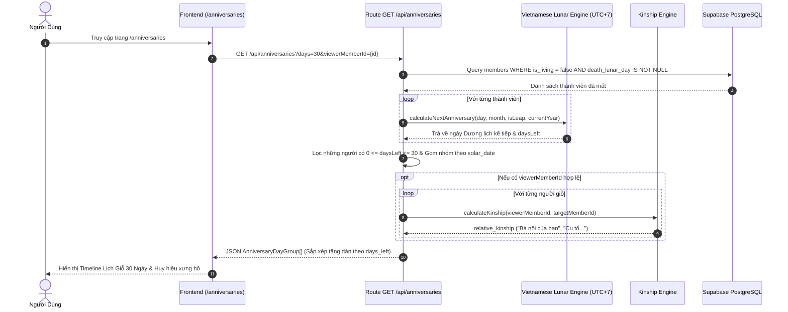
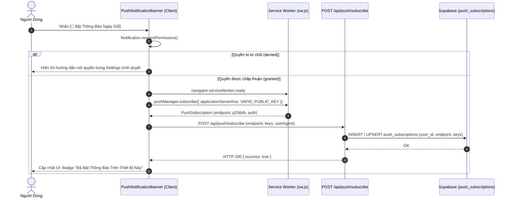
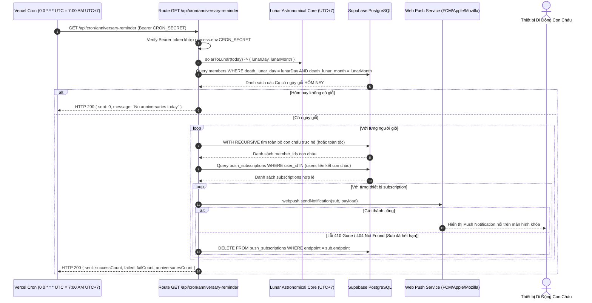

# ĐẶC TẢ KỸ THUẬT VI MÔ: MILESTONE 5 - LỊCH GIỖ 30 NGÀY, VERCEL CRON & PWA WEB PUSH NOTIFICATION

_Tài liệu này dùng để giới hạn Context Window. AI chỉ được phép đọc, suy luận và sinh code cho ĐÚNG các file được đề cập trong đây._

---

## 1. QUY TẮC NGHIÊM NGẶT (STRICT CONSTRAINTS)

- **Thư viện cho phép:** Next.js 14 App Router, React 18, TypeScript, TailwindCSS, Lucide Icons (`lucide-react`), `web-push` (Web Push Protocol VAPID server-side), Service Worker API & Push API chuẩn W3C/MDN.
- **Ràng buộc Kiến trúc Nghiệp vụ Gia Phả:**
  - **Lịch Giỗ Ưu Tiên Âm Lịch (`[R-SPEC]`):** Toàn bộ ngày giỗ được tính dựa trên ngày và tháng Âm lịch (`death_lunar_day`, `death_lunar_month`). Mọi phép quy đổi sang Dương lịch bắt buộc phải dùng thuật toán thiên văn chuẩn Việt Nam UTC+7 (`src/lib/lunar/vietnamese-lunar.ts`).
  - **Cửa Sổ 30 Ngày (Rolling 30-Day Window):** Thuật toán lịch giỗ quét và gom nhóm các ngày giỗ rơi vào khoảng $[0, 30]$ ngày tính từ hôm nay (Dương lịch UTC+7). Nếu ngày giỗ năm nay đã trôi qua, tự động tính theo ngày Âm lịch của năm kế tiếp.
  - **Hỗ trợ Tháng Nhuận & Tháng Thiếu An Toàn:**
    - Nếu thành viên mất vào tháng nhuận (ví dụ: tháng 4 nhuận) nhưng năm hiện tại không có tháng 4 nhuận $\rightarrow$ Tự động chuyển đổi mượt mà (fallback) về tháng 4 thường.
    - Nếu thành viên mất ngày 30 Âm lịch nhưng tháng đó là tháng thiếu (chỉ có 29 ngày) $\rightarrow$ Ngày giỗ được tính vào ngày 29 (ngày cuối cùng của tháng).
  - **Danh Xưng Thân Tộc Tương Đối (Relative Kinship Badge):**
    - Nếu người dùng đã đăng nhập và liên kết hồ sơ (`linked_member_id`) $\rightarrow$ Hiển thị danh xưng vai vế trực hệ giữa người xem và người mất (ví dụ: *"Bà nội của bạn"*, *"Cụ kỵ nhánh của bạn"*, *"Bác ruột của bạn"*) thông qua Kinship Engine (`findKinshipTerm`).
    - Nếu khách vãng lai hoặc chưa liên kết $\rightarrow$ Hiển thị danh xưng đời và chi phái (ví dụ: *"Đời thứ 4 · Chi Đinh"*).
  - **Bảo Mật Vercel Cron (`CRON_SECRET`):** API Endpoint `/api/cron/anniversary-reminder` bắt buộc kiểm tra Header `Authorization: Bearer ${CRON_SECRET}`. Nếu không khớp hoặc thiếu $\rightarrow$ Từ chối với HTTP 401 Unauthorized.
  - **Dọn Dẹp Subscription Chết (Dead Push Cleanup):** Khi Vercel Cron gửi push mà Push Service (FCM/Apple/Mozilla) trả về mã lỗi HTTP 404 (Not Found) hoặc 410 (Gone) $\rightarrow$ Hệ thống tự động xóa bản ghi đó khỏi bảng `push_subscriptions` trong CSDL.
  - **Total Ban on AI Browser Subagent (`[R-NO-BROWSER]`):** Mọi kiểm thử giao diện thuộc 100% về User ở Mục 7.2 (Human Visual UAT). AI chỉ xuất log terminal và đường dẫn kiểm thử.
- **Ràng buộc Thẩm Mỹ & UX (Modern Vietnamese Heritage Design System):**
  - **Triết Lý Kiến Trúc Mở (Open Architecture):** Loại bỏ hộp lồng hộp (anti box-in-box). Phân định các ngày giỗ theo dòng thời gian Timeline với đường kẻ hairline 1px `border-slate-200/60` (dark: `border-slate-800/60`).
  - **Bảng Màu Chủ Đạo:** Ngọc Bích Khởi Sắc (`#059669` / `#10B981`) kết hợp Ánh Kim Rạng Rỡ (`#D97706` / `#F59E0B`) cho các huy hiệu đếm ngược ("Hôm nay", "Ngày mai", "Còn N ngày").
  - **Hình Học Kỷ Luật:** Khung card, badge và pill button dùng bo góc `rounded-lg` (8px) hoặc `rounded-md` (6px). Không dùng góc bong bóng hoạt hình `rounded-2xl`, `rounded-3xl`.
  - **PWA & Hướng Dẫn Thân Thiện:** Hỗ trợ Web App Manifest (`manifest.json`) cho phép cài đặt ứng dụng vào màn hình chính; hiển thị Banner kích hoạt nhận thông báo đẩy kèm trạng thái và thông báo thân thiện cho iOS Safari (yêu cầu Add to Home Screen).

---

## 2. DATABASE & MODELS

### 2.1. File: `src/types/database.ts`
Bổ sung interface cho bảng `push_subscriptions`:

```typescript
export interface PushSubscriptionRecord {
  id: string;
  user_id: string;
  endpoint: string;
  p256dh_key: string;
  auth_key: string;
  user_agent: string | null;
  created_at: string;
  updated_at: string;
}

// Bổ sung vào Database['public']['Tables']
export type Database = {
  public: {
    Tables: {
      // ... clan_settings, members, users hiện có ...
      push_subscriptions: {
        Row: PushSubscriptionRecord;
        Insert: Partial<PushSubscriptionRecord> & {
          user_id: string;
          endpoint: string;
          p256dh_key: string;
          auth_key: string;
        };
        Update: Partial<PushSubscriptionRecord>;
        Relationships: [];
      };
    };
    // ...
  };
};
```

### 2.2. File: `src/types/anniversary.ts` (Types nghiệp vụ Lịch Giỗ & Web Push)

```typescript
import { Gender } from './database';

export interface AnniversaryMemberItem {
  id: string;
  full_name: string;
  gender: Gender;
  avatar_url: string | null;
  generation: number;
  branch_code: string | null;
  birth_year: number | null;
  death_year: number | null;
  death_lunar_day: number;
  death_lunar_month: number;
  death_lunar_is_leap: boolean;
  death_lunar_year_name: string | null;
  // Thông tin ngày giỗ Dương lịch quy đổi kế tiếp
  solar_date_str: string; // YYYY-MM-DD
  solar_day: number;
  solar_month: number;
  solar_year: number;
  days_left: number; // 0 = Hôm nay, 1 = Ngày mai, >1 = Còn N ngày
  lunar_date_formatted: string; // "Ngày 15/08 Âm lịch (Bính Ngọ)"
  relative_kinship?: string | null; // "Bà nội của bạn", "Cụ tổ đời 4 của bạn"
}

export interface AnniversaryDayGroup {
  solar_date_str: string; // YYYY-MM-DD
  solar_day: number;
  solar_month: number;
  solar_year: number;
  lunar_day: number;
  lunar_month: number;
  lunar_year_name: string;
  days_left: number;
  members: AnniversaryMemberItem[];
}

export interface PushSubscribePayload {
  endpoint: string;
  keys: {
    p256dh: string;
    auth: string;
  };
  userAgent?: string;
}
```

---

## 3. SƠ ĐỒ LUỒNG LOGIC (SEQUENCE DIAGRAM - MERMAID)

### 3.1. Luồng Người Dùng Xem Lịch Giỗ 30 Ngày & Huy Hiệu Quan Hệ Thân Tộc



### 3.2. Luồng Đăng Ký Nhận Thông Báo Đẩy Web Push (VAPID)



### 3.3. Luồng Vercel Cron Quét Tự Động 7:00 AM & Gửi Web Push



---

## 4. BACKEND LOGIC & API ENDPOINTS

### 4.1. File: `src/lib/anniversaries/anniversary-engine.ts`
Lõi tính toán lịch giỗ và lọc cửa sổ thời gian:

- **Hàm `getUpcomingAnniversaries(members: MemberRecord[], options: AnniversaryOptions): AnniversaryDayGroup[]`**
  - _Input params:_
    - `members`: Mảng toàn bộ thành viên dòng họ.
    - `options`:
      - `daysAhead`: Số ngày tới cần quét (mặc định: 30).
      - `referenceDate`: Ngày mốc đối soát Dương lịch (mặc định: `new Date()`).
      - `viewerMemberId`: ID của thành viên xem (tùy chọn, phục vụ tính quan hệ).
      - `branchFilter`: Mã chi nhánh lọc (tùy chọn).
  - _Luồng xử lý (Step-by-step):_
    1. Lọc các thành viên đã mất có đủ `death_lunar_day` và `death_lunar_month`.
    2. Với từng thành viên:
       - Gọi `calculateNextAnniversary(death_lunar_day, death_lunar_month, isLeap, currentYear)`.
       - Tính khoảng cách `daysLeft = Math.ceil((annivDate - today) / (1000 * 60 * 60 * 24))`.
       - Nếu `daysLeft < 0`: Tính lại cho năm sau (`currentYear + 1`) để lấy ngày giỗ tiếp theo.
       - Nếu `0 <= daysLeft <= daysAhead`: Giữ lại trong danh sách.
    3. Định dạng chuỗi ngày Âm lịch: `"Ngày DD/MM Âm lịch (Can Chi)"`.
    4. Nếu có `viewerMemberId`: Gọi `findKinshipTerm` tính danh xưng họ hàng tương đối giữa người xem và người mất.
    5. Gom nhóm các cá nhân có cùng ngày giỗ Dương lịch (`solar_date_str`), sắp xếp thứ tự tăng dần theo `days_left` (Hôm nay $\rightarrow$ Ngày mai $\rightarrow$ Tương lai).
  - _Output:_ Mảng `AnniversaryDayGroup[]`.

- **Hàm `getTodayAnniversaryMembers(members: MemberRecord[], referenceDate: Date = new Date()): MemberRecord[]`**
  - _Mục đích:_ Phục vụ Vercel Cron quét nhanh những người có ngày giỗ đúng hôm nay.
  - _Thuật toán:_
    - Quy đổi `referenceDate` sang Âm lịch UTC+7 qua `solarToLunar`.
    - Lọc các thành viên có `death_lunar_day === todayLunar.day && death_lunar_month === todayLunar.month`.
    - Xử lý biên tháng thiếu (29 ngày) và tháng nhuận an toàn.

### 4.2. File: `src/app/api/anniversaries/route.ts`
- **Method:** `GET /api/anniversaries`
- **Query Params:**
  - `days`: Số ngày cần lấy (integer, mặc định: 30, max: 90).
  - `branch`: Mã chi nhánh lọc (tùy chọn).
  - `viewerMemberId`: UUID người xem để tính quan hệ thân tộc (tùy chọn).
- **Luồng xử lý:**
  1. Đọc dữ liệu từ Supabase hoặc Mock Fixtures qua Service Layer.
  2. Gọi `getUpcomingAnniversaries(...)`.
  3. Trả về JSON chuẩn HTTP 200: `{ data: AnniversaryDayGroup[], totalCount: number, timeZone: "Asia/Ho_Chi_Minh" }`.

### 4.3. File: `src/app/api/push/subscribe/route.ts`
- **Method:** `POST /api/push/subscribe`
- **Header:** `Content-Type: application/json`
- **Input Body:**
  ```json
  {
    "endpoint": "https://fcm.googleapis.com/fcm/send/...",
    "keys": {
      "p256dh": "BNcR...",
      "auth": "tBH8..."
    },
    "userAgent": "Mozilla/5.0..."
  }
  ```
- **Luồng xử lý:**
  1. Kiểm tra session đăng nhập qua Supabase Auth Server Client. Nếu chưa đăng nhập: Trả về HTTP 401 Unauthorized (yêu cầu đăng nhập để liên kết thiết bị với tài khoản).
  2. Validate định dạng `endpoint`, `keys.p256dh`, `keys.auth`. Nếu thiếu: Trả về HTTP 400 Bad Request.
  3. Dùng Supabase Client upsert vào bảng `push_subscriptions` với khóa chính duy nhất là `endpoint`.
  4. Trả về HTTP 200 `{ success: true, message: "Subscription saved successfully" }`.

### 4.4. File: `src/app/api/push/unsubscribe/route.ts`
- **Method:** `POST /api/push/unsubscribe`
- **Input Body:** `{ "endpoint": "https://fcm.googleapis.com/..." }`
- **Luồng xử lý:**
  1. Validate `endpoint`.
  2. Xóa bản ghi trong `push_subscriptions` có `endpoint` tương ứng.
  3. Trả về HTTP 200 `{ success: true }`.

### 4.5. File: `src/app/api/cron/anniversary-reminder/route.ts`
- **Method:** `GET /api/cron/anniversary-reminder`
- **Header:** `Authorization: Bearer <CRON_SECRET>`
- **Luồng xử lý:**
  1. Xác thực `CRON_SECRET`:
     - So sánh header `Authorization` với `Bearer ${process.env.CRON_SECRET}`.
     - Nếu không khớp: Trả về HTTP 401 `{ error: "Unauthorized cron access" }`.
  2. Khởi tạo Web Push với VAPID keys:
     - `webpush.setVapidDetails(process.env.VAPID_SUBJECT, process.env.NEXT_PUBLIC_VAPID_PUBLIC_KEY, process.env.VAPID_PRIVATE_KEY)`.
  3. Lấy thời gian hiện tại chuẩn múi giờ Việt Nam (`new Date().toLocaleString("en-US", { timeZone: "Asia/Ho_Chi_Minh" })`).
  4. Quy đổi sang Âm lịch và tìm tất cả thành viên có ngày giỗ hôm nay.
  5. Nếu không có ai: Trả về HTTP 200 `{ sent: 0, anniversaries: [] }`.
  6. Với mỗi thành viên có giỗ:
     - Dùng câu truy vấn đệ quy hoặc Graph Engine tìm toàn bộ con cháu.
     - Lấy danh sách `push_subscriptions` của các tài khoản con cháu.
     - Đóng gói Payload thông báo:
       ```json
       {
         "title": "Hôm nay là Ngày Giỗ của Cụ [Tên]",
         "body": "Nhằm ngày DD/MM Âm lịch ([Năm Can Chi]). Kính mời con cháu tưởng nhớ tổ tiên.",
         "icon": "/icons/icon-192x192.png",
         "badge": "/icons/badge-72x72.png",
         "url": "/anniversaries"
       }
       ```
     - Gửi thông báo song song qua `Promise.allSettled`.
     - Bắt lỗi `statusCode === 404 || statusCode === 410` để tự động xóa endpoint hỏng khỏi CSDL.
  7. Trả về thống kê JSON: `{ success: true, targetCount: number, sent: number, failed: number }`.

### 4.6. File: `vercel.json`
Cấu hình Vercel Cron tự động kích hoạt 7:00 AM giờ Hà Nội (00:00 UTC):

```json
{
  "crons": [
    {
      "path": "/api/cron/anniversary-reminder",
      "schedule": "0 0 * * *"
    }
  ]
}
```

---

## 5. FRONTEND UI & LOGIC

### 5.1. File: `src/app/anniversaries/page.tsx`
Trang Lịch Giỗ 30 Ngày Sắp Tới:
- **Hero Section:**
  - Tiêu đề trang trọng: `"LỊCH GIỖ GIA TỘC"` kèm phụ đề `"Tưởng nhớ cội nguồn · Hiếu nghĩa truyền gia"`.
  - Thẻ hiển thị Ngày hôm nay: Dương lịch (DD/MM/YYYY) sóng đôi cùng Âm lịch (Ngày ... Tháng ... Năm Bính Ngọ).
- **Control Bar:**
  - Bộ lọc phạm vi: Pill buttons `"Tất cả dòng họ"` vs `"Nhánh của tôi"` (chỉ kích hoạt khi user đã liên kết node).
  - Quick Filter: `"7 ngày tới"` | `"15 ngày tới"` | `"30 ngày tới"`.
- **Push Notification Banner (`PushNotificationBanner.tsx`):**
  - Đặt trang nhã ngay dưới Hero section.
  - Trạng thái chưa bật: Nút `[🔔 Bật Thông Báo Ngày Giỗ]` với văn phong ấm áp: *"Đăng ký nhận thông báo để không bao giờ quên ngày giỗ của các bậc tiền nhân trong gia tộc"*.
  - Trạng thái đã bật: Badge xanh ngọc `[✓ Đã bật thông báo trên thiết bị này]` kèm nút nhỏ `[Hủy đăng ký]`.
  - Trạng thái trình duyệt không hỗ trợ: Lời nhắc nhẹ nhàng (Ví dụ: trên iPhone cần bấm Chia sẻ $\rightarrow$ Thêm vào Màn hình chính).
- **Timeline Danh Sách Ngày Giỗ:**
  - Gom theo từng ngày (`AnniversaryDayGroup`):
    - Khối mốc thời gian: Cột trái hoặc Header ngày nổi bật:
      - Nếu `days_left === 0`: Tag Đỏ Ánh Kim `[🔥 HÔM NAY]` rực rỡ, tôn nghiêm.
      - Nếu `days_left === 1`: Tag Ánh Kim `[⭐ NGÀY MAI]`.
      - Nếu `days_left > 1`: Tag Ngọc Bích `[Còn ${days_left} ngày]`.
      - Tiêu đề ngày: `Ngày DD/MM Âm lịch (Năm Can Chi) · Dương lịch: DD/MM/YYYY` (Đưa Âm lịch làm tiêu điểm chính, loại bỏ hoàn toàn từ "Nhằm ngày").
    - Danh sách các Cụ có giỗ trong ngày đó:
      - Card thành viên: Avatar 2 chữ cái (Initials: Đệm + Tên), Họ tên to rõ, Đời thứ mấy, Chi nhánh.
      - Năm sinh - Năm mất & Tuổi hưởng thọ: `Sinh YYYY — Mất YYYY (Hưởng thọ N tuổi)`.
      - **Triệt tiêu trùng lặp (Deduplication):** Loại bỏ hoàn toàn chuỗi ngày âm lặp lại (`lunar_date_formatted`) trên từng dòng thành viên vì thông tin này đã nằm tập trung ở Header khối ngày.
      - **Huy hiệu quan hệ (Kinship Badge):** Ví dụ *"Bà nội của bạn"*, *"Cụ kỵ của bạn"*, viền vàng ánh kim sang trọng.
      - Nút hành động một chạm: `[🌳 Xem trên Cây Phả Hệ]` $\rightarrow$ Điều hướng sang `/tree?focus={memberId}` và tự động định tâm camera.
- **Empty State:**
  - Khi không có ngày giỗ nào trong 30 ngày tới: Hiển thị minh họa tĩnh lặng, thông điệp an lành: *"Trong 30 ngày tới không có ngày giỗ nào của gia tộc. Chúc con cháu toàn gia vạn sự bình an!"*.

### 5.2. File: `src/components/anniversaries/PushNotificationBanner.tsx`
- **State quản lý:**
  - `isSupported`: boolean (Kiểm tra `window.Notification` và `navigator.serviceWorker`).
  - `permission`: `NotificationPermission` (`default`, `granted`, `denied`).
  - `isSubscribed`: boolean.
  - `loading`: boolean.
  - `isIOS`: boolean (phát hiện thiết bị iOS để hướng dẫn Add to Home Screen).
- **Tương tác:**
  - Bấm Bật thông báo $\rightarrow$ Gọi `registerServiceWorkerAndSubscribe()`.
  - Xử lý đầy đủ phản hồi: Từ chối $\rightarrow$ Hiện tooltip hướng dẫn; Chấp nhận $\rightarrow$ Lưu subscription và cập nhật state tức thì.

### 5.3. File: `public/manifest.json` & `public/sw.js`
- **`public/manifest.json`:**
  - Cấu hình PWA hoàn chỉnh: `name: "FAT - Gia Phả Đại Tộc"`, `short_name: "Gia Phả"`, `start_url: "/tree"`, `display: "standalone"`, `theme_color: "#059669"`, `background_color: "#090E1A"`, bộ icons đầy đủ kích thước.
- **`public/sw.js`:**
  - Bắt sự kiện `push`: Trích xuất payload JSON, gọi `self.registration.showNotification(title, options)`.
  - Bắt sự kiện `notificationclick`: Đóng notification, mở hoặc focus vào tab trình duyệt tại đường dẫn `/anniversaries`.

### 5.4. File: `src/lib/tree-layout/avatar-utils.ts` & Quy Chuẩn Avatar 2 Chữ Cái Toàn Hệ Thống
- **Pure Function `getMemberInitials(fullName?: string | null, isAnonymous?: boolean): string`:**
  - Nếu `isAnonymous = true`: Trả về `"KD"` (Khuyết danh).
  - Nếu `fullName` có $\ge 2$ từ: Lấy chữ cái đầu của 2 từ cuối (Tên đệm + Tên chính) $\rightarrow$ In hoa (ví dụ: "Nguyễn Văn Trưởng" $\rightarrow$ `"VT"`, "Lê Thị Hoa" $\rightarrow$ `"TH"`).
  - Nếu `fullName` chỉ có 1 từ: Lấy 2 ký tự đầu in hoa (ví dụ: "Trưởng" $\rightarrow$ `"TR"`).
  - Nếu rỗng / null / khoảng trắng: Fallback `"TV"` (Thành viên).
- **Đồng bộ trên 100% Màn hình:**
  1. `src/app/anniversaries/page.tsx`: Dùng `getMemberInitials(member.full_name)` thay cho `charAt(0)`.
  2. `src/components/tree/MemberNode.tsx`: Dùng `getMemberInitials(fullName, isAnonymous)`.
  3. `src/components/tree/GhostNode.tsx`: Dùng `getMemberInitials(fullName, false)`.
  4. `src/components/tree/MemberDetailDrawer.tsx`: Hiển thị Avatar 2 chữ cái khi không có `avatar_url`, thay thế icon `<User />`.

---

## 6. XỬ LÝ LỖI & NGOẠI LỆ (ERROR HANDLING & EDGE CASES)

- **Edge Case 1: Tháng nhuận Âm lịch không xuất hiện hằng năm.**
  - _Tình huống:_ Một cụ mất vào ngày `15/04 nhuận`. Năm nay không có tháng 4 nhuận.
  - _Xử lý:_ Thuật toán trong `calculateNextAnniversary` tự động bắt ngoại lệ và tính ngày giỗ vào ngày `15/04 thường`, đảm bảo ngày giỗ của các cụ không bao giờ bị bỏ sót.
- **Edge Case 2: Tháng thiếu (29 ngày) khi ngày giỗ là ngày 30.**
  - _Tình huống:_ Cụ mất ngày `30/08 Âm lịch`, nhưng tháng 8 năm nay chỉ có 29 ngày.
  - _Xử lý:_ Thuật toán tự động lùi về ngày cuối cùng của tháng (ngày 29) để tính ngày giỗ đúng thông lệ cổ truyền người Việt.
- **Edge Case 3: Người dùng từ chối cấp quyền Push (Permission Denied).**
  - _Xử lý:_ Hệ thống không hiển thị lại popup làm phiền người dùng; Banner chuyển sang trạng thái nhắc nhở tĩnh kèm nút hướng dẫn cách mở lại quyền trong cài đặt trình duyệt nếu muốn.
- **Edge Case 4: Trình duyệt iOS Safari chưa thêm vào Màn hình chính (Standalone Mode).**
  - _Xử lý:_ Trên iOS, Push API chỉ hoạt động khi website được Add to Home Screen. Banner tự động phát hiện `iOS && !isStandalone` để hiển thị hướng dẫn trực quan (Bấm nút Chia sẻ $\rightarrow$ Thêm vào Màn hình chính).
- **Edge Case 5: Vercel Cron bị kích hoạt bởi bên ngoài không có quyền.**
  - _Xử lý:_ API `/api/cron/anniversary-reminder` kiểm tra token `CRON_SECRET`. Nếu thiếu hoặc sai lập tức trả về HTTP 401 và ghi log cảnh báo bảo mật.
- **Edge Case 6: Subscription của người dùng đã bị hủy hoặc vô hiệu lực (Dead Endpoint).**
  - _Xử lý:_ Khi gọi `webpush.sendNotification` trả về HTTP 404 hoặc 410, Serverless Route tự động xóa subscription chết này khỏi CSDL, giữ bảng dữ liệu luôn tinh gọn và không hao phí tài nguyên.
- **Edge Case 7: Lệch múi giờ giữa máy chủ Vercel (UTC) và Việt Nam (UTC+7).**
  - _Xử lý:_ Toàn bộ logic tính ngày hôm nay bắt buộc phải dùng chuỗi múi giờ `Asia/Ho_Chi_Minh` hoặc cộng đúng 7 giờ (`+ 7 * 3600 * 1000`). Tuyệt đối không dùng `new Date()` thuần theo giờ UTC của server vì sẽ gây lệch chậm 1 ngày trước 7:00 AM.

---

## 7. MA TRẬN TEST CASES & TIÊU CHÍ NGHIỆM THU (TEST SPECIFICATION)

### 7.1. Bảng Kịch Bản Kiểm Thử Tự Động (Automated Test Suite trong `tests/`)
_(Đường dẫn và lệnh chạy lấy từ khối `[VERIFY_COMMANDS]` trong `.agents/AGENTS.md` — `npm test`)_

| ID | Tên Kịch Bản | File Test Dự Kiến | Tiền điều kiện (Given) | Thao tác kích hoạt (When) | Kết quả kỳ vọng (Then) | Phân loại | Trạng thái |
|---|---|---|---|---|---|---|---|
| **TC_UT_ANNIV_WINDOW_30_DAYS** | Quét & gom nhóm ngày giỗ cửa sổ 30 ngày | `tests/anniversary.test.ts` | Danh sách thành viên mock có ngày giỗ rơi vào: hôm nay, ngày mai, 15 ngày tới, và 45 ngày tới | Gọi hàm `getUpcomingAnniversaries(members, { daysAhead: 30 })` | Trả về các ngày giỗ trong [0, 30] ngày; loại trừ ngày 45 ngày; sắp xếp tăng dần theo `days_left` | Happy Path | `[x] PASS` |
| **TC_UT_ANNIV_LEAP_FALLBACK** | Xử lý ngày giỗ tháng nhuận khi năm không có nhuận | `tests/anniversary.test.ts` | Thành viên mất ngày 15/04 nhuận | Gọi `calculateNextAnniversary(15, 4, true, 2026)` | Fallback thành công sang ngày 15/04 thường, không ném lỗi, trả về ngày Dương lịch hợp lệ | Edge Case | `[x] PASS` |
| **TC_UT_ANNIV_SHORT_MONTH** | Xử lý ngày giỗ 30 Âm lịch rơi vào tháng thiếu 29 ngày | `tests/anniversary.test.ts` | Thành viên mất ngày 30 Âm lịch vào tháng chỉ có 29 ngày | Gọi tính ngày giỗ qua bộ chuyển đổi lịch âm | Quy đổi an toàn sang ngày cuối cùng của tháng (ngày 29), không bị tràn sang tháng sau | Edge Case | `[x] PASS` |
| **TC_UT_ANNIV_RELATIVE_KINSHIP** | Gán danh xưng tương đối với người xem | `tests/anniversary.test.ts` | Cụ Nguyễn Văn A là Ông nội của Viewer B (`linked_member_id`) | Gọi `getUpcomingAnniversaries` kèm `viewerMemberId: B` | Thẻ ngày giỗ của Cụ A có trường `relative_kinship` chứa danh xưng chính xác | Happy Path | `[x] PASS` |
| **TC_INT_ANNIV_API_RESPONSE** | Kiểm tra cấu trúc API Lịch Giỗ `/api/anniversaries` | `tests/anniversary-api.test.ts` | Dữ liệu gia phả mock sẵn sàng | Gửi HTTP GET tới `/api/anniversaries?days=30` | HTTP Status 200, payload trả về mảng `data` chuẩn cấu trúc `AnniversaryDayGroup[]` | API Contract | `[x] PASS` |
| **TC_INT_PUSH_SUBSCRIBE_VALIDATION** | Validate dữ liệu API Subscribe Web Push | `tests/push-notification.test.ts` | Payload thiếu trường `endpoint` hoặc thiếu `keys` | Gửi HTTP POST tới `/api/push/subscribe` | HTTP Status 400 Bad Request kèm thông báo lỗi trường bắt buộc | Error Handling | `[x] PASS` |
| **TC_INT_PUSH_SUBSCRIBE_SUCCESS** | Lưu thành công subscription thiết bị mới | `tests/push-notification.test.ts` | Session đăng nhập hợp lệ và payload subscription đầy đủ | Gửi HTTP POST tới `/api/push/subscribe` | HTTP Status 200 `{ success: true }`, bản ghi được lưu/upsert vào bảng `push_subscriptions` | API Contract | `[x] PASS` |
| **TC_INT_PUSH_UNSUBSCRIBE** | Hủy đăng ký nhận Web Push theo endpoint | `tests/push-notification.test.ts` | Bản ghi subscription tồn tại trong CSDL | Gửi HTTP POST tới `/api/push/unsubscribe` với `endpoint` | HTTP Status 200, bản ghi bị xóa khỏi bảng `push_subscriptions` | API Contract | `[x] PASS` |
| **TC_INT_CRON_AUTH_SECURITY** | Chặn đứng truy cập trái phép vào Route Cron | `tests/cron-anniversary.test.ts` | Không có header Authorization hoặc sai Secret | Gửi HTTP GET tới `/api/cron/anniversary-reminder` | HTTP Status 401 Unauthorized, không thực thi quét database hay gửi push | Security Guard | `[x] PASS` |
| **TC_INT_CRON_DISPATCH_LOGIC** | Quét đúng người giỗ hôm nay & lọc đúng con cháu nhận push | `tests/cron-anniversary.test.ts` | Mock ngày hôm nay có 1 cụ mất, có 2 con cháu đã đăng ký push | Kích hoạt logic xử lý của Route Cron với Secret chuẩn | Trả về `targetCount: 1`, lọc ra đúng 2 subscriptions con cháu để gửi push notification | API Contract | `[x] PASS` |
| **TC_UT_PWA_MANIFEST_VALID** | Kiểm tra tính hợp lệ của Web App Manifest | `tests/pwa-manifest.test.ts` | File `public/manifest.json` trong dự án | Đọc và parse cú pháp JSON | Có đầy đủ các thuộc tính bắt buộc: `name`, `short_name`, `start_url`, `display: "standalone"`, `icons` | PWA Compliance | `[x] PASS` |
| **TC_UT_AVATAR_MULTI_WORD** | Trích xuất 2 chữ cái initials (Đệm + Tên) cho tên tiếng Việt $\ge 2$ từ | `tests/avatar-utils.test.ts` | Tên "Nguyễn Văn Trưởng", "Lê Thị Hoa", "Phạm Chiến" | Gọi `getMemberInitials(name)` | Trả về chuẩn xác "VT", "TH", "PC" (in hoa 2 chữ cái) | Happy Path | `[x] PASS` |
| **TC_UT_AVATAR_EDGE_CASES** | Xử lý tên 1 từ, Khuyết danh và fallback chuỗi rỗng | `tests/avatar-utils.test.ts` | Tên "Trưởng", Khuyết danh `is_anonymous: true`, chuỗi null/rỗng | Gọi `getMemberInitials(...)` | "Trưởng" $\rightarrow$ "TR", Khuyết danh $\rightarrow$ "KD", null/rỗng $\rightarrow$ "TV" | Edge Case | `[x] PASS` |
| **TC_UT_ANNIV_DEDUP_INFO** | Dòng thành viên không lặp lại chuỗi ngày âm, tính đúng tuổi thọ | `tests/anniversary.test.ts` | Thành viên có `birth_year: 1935, death_year: 2005` | Tính toán thông tin hiển thị dòng người giỗ | Tuổi thọ đạt 71 tuổi (`2005 - 1935 + 1`), không chứa chuỗi ngày âm lặp lại | Happy Path | `[x] PASS` |

### 7.2. Danh Sách Tiêu Chí Nghiệm Thu Thị Giác (Human Visual UAT Matrix)
_(Dành riêng cho User tự kiểm tra trực tiếp trên trình duyệt - AI tuyệt đối cấm dùng browser_subagent thay thế)_

- [ ] **UAT_01 (Thẩm Mỹ Timeline Lịch Giỗ):** Truy cập `/anniversaries`. Giao diện hiển thị trang trọng, mang đậm âm hưởng Modern Vietnamese Heritage. Bảng màu Ngọc Bích (`#059669`) và Ánh Kim (`#D97706`). Đường kẻ Timeline hairline thanh thoát, không xuất hiện hộp lồng hộp (anti box-in-box).
- [ ] **UAT_02 (Thẻ Ngày Giỗ & Huy Hiệu Quan Hệ):** Các ngày giỗ được phân nhóm rõ ràng theo ngày Dương lịch kèm ngày Âm lịch tương ứng. Thẻ cá nhân hiển thị rõ ảnh đại diện, danh vị, năm sinh - năm mất, số ngày còn lại ("Hôm nay", "Ngày mai", "Còn N ngày"). Với tài khoản đã liên kết, hiển thị đúng huy hiệu quan hệ thân tộc ("Bà nội của bạn", "Cụ tổ của bạn"...).
- [ ] **UAT_03 (Tương Tác Một Chạm Sang Cây Phả Hệ):** Bấm nút `[🌳 Xem trên Cây]` tại thẻ người giỗ $\rightarrow$ Chuyển mượt mà sang `/tree`, React Flow tự động pan/zoom định tâm vào đúng Node của Cụ vừa chọn mà không giật màn hình.
- [ ] **UAT_04 (Banner Đăng Ký Web Push):** Banner thông báo hiển thị trang nhã. Bấm nút `[🔔 Bật Thông Báo]` $\rightarrow$ Trình duyệt kích hoạt hộp thoại xin quyền Notification chuẩn. Sau khi cho phép $\rightarrow$ Banner đổi ngay sang trạng thái xanh ngọc `[✓ Đã bật thông báo trên thiết bị này]`.
- [ ] **UAT_05 (Responsive & Console Sạch):** Thử nghiệm trên cả Mobile (375px) và Desktop (1440px): Bố cục co giãn linh hoạt, nút bấm đạt chuẩn WCAG cảm ứng tối thiểu 44px. Mở Developer Console $\rightarrow$ **0 lỗi đỏ, 0 cảnh báo Hydration mismatch**.
- [ ] **UAT_06 (Avatar 2 Chữ Cái Đồng Bộ):** Truy cập `/anniversaries`: Avatar các cụ hiển thị chuẩn 2 chữ cái initials (Cụ Trưởng: **VT**, Cụ Hoa: **TH**, Cụ Thứ: **VT**). Mở Sơ đồ Cây `/tree` và Drawer chi tiết: Avatar hiển thị hoàn toàn đồng bộ, không còn icon User chung chung.
- [ ] **UAT_07 (Phân Cấp Thông Tin Thoáng Đãng & Không Lặp):** Tiêu đề khối ngày hiển thị Âm lịch nổi bật kèm Dương lịch đối chiếu, không còn từ "Nhằm ngày". Dòng từng cụ hiển thị năm sinh - mất và tuổi thọ rõ ràng, thoáng đãng, không bị lặp lại chuỗi ngày âm.

---

## 8. BẢO VỆ CHỐNG THOÁI LUI (REGRESSION GUARD CHECKLIST)

- [x] **RG01 (Build & Typecheck Clean):** Chạy `npm run typecheck` & `NEXT_DIST_DIR=.next-build npm run build` — 0 lỗi, toàn bộ 20/20 pages tĩnh/động build thành công 100%.
- [x] **RG02 (Automated Test Regression):** Chạy `npm test` — Toàn bộ 94/94 tests (82 tests cũ + 12 tests mới) PASS 100%, 0 regression.
- [x] **RG03 (Blast Radius - Navigation Bar):** Menu điều hướng trên Header và thanh điều hướng Mobile giữ nguyên liên kết tới `/anniversaries` hoạt động trơn tru, không làm lệch alignment hay rớt dòng icon.
- [x] **RG04 (Blast Radius - Member Detail Drawer):** Cụm thông tin ngày giỗ kế tiếp (`anniversaryInfo`) trên `MemberDetailDrawer.tsx` vẫn tính toán chính xác và đồng bộ hoàn toàn với dữ liệu trên trang `/anniversaries`.
- [x] **RG05 (Blast Radius - Kinship Engine):** Việc tái sử dụng `calculateKinship` và `findKinshipTerm` không làm biến đổi hay rò rỉ trạng thái tính toán của trang `/kinship`.
- [x] **RG06 (Avatar Refactor Tree Safety):** Đồng bộ `getMemberInitials` trên `MemberNode.tsx`, `GhostNode.tsx` và `MemberDetailDrawer.tsx` không làm biến đổi kích thước bounding box ($200\text{px} \times 96\text{px}$) hay gây gãy các tests đồ thị hiện có.

---

## 9. LỆNH THI CÔNG (Dành cho AI /feature-code)

> "AI ơi, hãy đọc kỹ đặc tả `docs/14_Micro-Spec_Milestone_5_Anniversaries_WebPush_Cron.md` này. Dựa CHÍNH XÁC vào các mô tả ranh giới ở trên, hãy thi công toàn bộ mã nguồn hoàn chỉnh kèm file test trong `tests/`. Thực thi Vòng Lặp Kiểm Chứng Bằng Code Thật bằng đúng các lệnh khai báo tại `[VERIFY_COMMANDS]` (Typecheck/Build $\rightarrow$ Automated Test Suite $\rightarrow$ Human UAT), và chỉ được tick `[x]` cho Mục 7.1 khi terminal log cho thấy test phủ AC đó đã pass và không có failure mới so với baseline."
