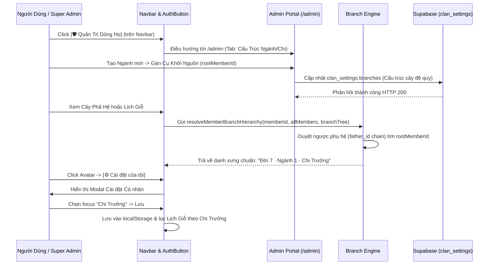

# ĐẶC TẢ KỸ THUẬT VI MÔ: MILESTONE 6 - PHÂN CẤP NGÀNH/CHI ĐA TẦNG & TÁCH BẠCH CÀI ĐẶT CÁ NHÂN VS QUẢN TRỊ DÒNG HỌ

_Tài liệu này dùng để giới hạn Context Window. AI chỉ được phép đọc, suy luận và sinh code cho ĐÚNG các file được đề cập trong đây._

---

## 1. QUY TẮC NGHIÊM NGẶT (STRICT CONSTRAINTS)

- **Thư viện cho phép:** Next.js 14 App Router, React 18, TypeScript, TailwindCSS, Lucide Icons (`lucide-react`), Supabase client.
- **Ràng buộc Kiến trúc Nghiệp vụ Gia Phả:**
  - **Phân Định Hai Không Gian Rạch Ròi ("Hai Chiếc Áo"):**
    1. **Không Gian Cá Nhân (User Settings):** Nằm gọn trong Dropdown Avatar (`AuthButton.tsx`) qua nút `[⚙️ Cài đặt của tôi]`. Mở Modal/Popover cá nhân: cho phép chọn chi nhánh theo dõi mặc định (`Toàn dòng họ` vs `Riêng [Tên Chi/Ngành]`), bật/tắt nhận chuông thông báo giỗ trên thiết bị này, lưu vào `localStorage` (khách) và `user_metadata` (khi đã đăng nhập).
    2. **Khu Vực Quản Trị Dòng Họ (Admin Portal):** Nằm tại `/admin`. Khi người dùng mang quyền `super_admin`, hiển thị nút **`[ 🛡️ Quản Trị Dòng Họ ]`** trực tiếp trên thanh Navbar (`Navbar.tsx`) giúp truy cập 1-click. Tuyệt đối không giấu lối vào admin vào dropdown cá nhân.
  - **Tôn Trọng Quyết Định Phạm Vi (Scope Boundary):** Tính năng con cháu xin nhận hồ sơ (Claim Profile / Approval Queue) được **GÁC LẠI (DEFERRED)** theo yêu cầu của User để hệ thống tinh gọn, tập trung hoàn thiện hạ tầng Ngành/Chi trước.
  - **Hệ Thống Phân Cấp Ngành & Chi Đa Tầng (Multi-Tier Branch Taxonomy):**
    - Hỗ trợ mô hình cây phân cấp linh hoạt tùy biến theo phong tục từng dòng họ (ví dụ: `Ngành` $\rightarrow$ `Chi` $\rightarrow$ `Nhánh`, hoặc `Chi lớn` $\rightarrow$ `Chi nhỏ`).
    - Mỗi node trong cây phân chi (`BranchNode`) gồm: `id`, `tierName` (tên cấp: "Ngành", "Chi"), `name` (tên nhánh: "Ngành Trưởng", "Chi 2"), và `rootMemberId` (ID của Cụ Tiền nhân khởi nguồn nhánh đó).
    - **Thuật toán Kế thừa Phả hệ Tự động (`branch-engine.ts`):** Sử dụng hàm thuần túy (pure function) duyệt ngược chuỗi phụ hệ (father chain) từ một thành viên bất kỳ lên Cụ Thủy Tổ. Khớp các thế hệ cha/ông với `rootMemberId` để tự động suy luận danh xưng tôn ti: `Đời ${generation} · ${nganh} · ${chi}` (ví dụ: `Đời 7 · Ngành 3 · Chi 6`) mà không bắt người nhập liệu gõ thủ công.
  - **Bộ Lọc Đa Tầng Chuẩn Mực:** Thay thế cơ chế nhặt mót chuỗi text tự do trên trang Lịch Giỗ (`/anniversaries`) và Cây Phả Hệ (`/tree`) bằng danh mục Ngành & Chi chính thức từ `clan_settings.branches`. Tự động áp dụng bộ lọc cá nhân nếu người dùng đã ghim.
- **Ràng buộc Thẩm Mỹ & UX (Modern Vietnamese Heritage Design System):**
  - **Triệt Tiêu Tuyệt Đối Box-in-Box:** Giao diện quản trị `/admin` thiết kế theo phong cách phẳng, thanh thoát. Nền sáng trắng sứ, đường hairline 1px `border-slate-200/60` (dark: `border-slate-800/60`).
  - **Thanh Tabs Phẳng (Flat Segmented Bar):** Toàn bộ phân hệ Admin nằm trên trang quản trị với 3 tabs chuyển đổi mượt mà (0ms reload):
    - Tab 1: `[ 🏛️ Thông Tin & Xưng Hô ]` (Thông tin dòng họ, nhà thờ tổ, cấu hình từ điển xưng hô 3 miền).
    - Tab 2: `[ 🌿 Cấu Trúc Ngành/Chi ]` (Quản lý các cấp Ngành, Chi và gán Cụ Khởi Nguồn).
    - Tab 3: `[ 📥 Nhập File Excel ]` (Khu vực nạp dữ liệu gia phả hàng loạt).
  - **Total Ban on AI Browser Subagent (`[R-NO-BROWSER]`):** AI tuyệt đối không gọi `browser_subagent` để nghiệm thu UI. User tự kiểm chứng thị giác ở Mục 7.2.

---

## 2. DATABASE & MODELS

### 2.1. File: `src/types/database.ts`
Mở rộng interface `ClanBranchItem` thành cấu trúc đệ quy đa tầng `BranchNode`:

```typescript
export interface BranchNode {
  id: string;
  tierName: string;         // Cấp: "Ngành", "Chi", "Nhánh"
  name: string;             // Tên: "Ngành 1", "Chi Trưởng", "Phái 2"
  rootMemberId?: string | null; // ID của Cụ khởi nguồn nhánh này
  children?: BranchNode[];  // Các phân chi trực thuộc
}

// Giữ tương thích ngược với ClanBranchItem cũ nếu có
export type ClanBranchItem = BranchNode;

export interface ClanSettingsRow {
  id: string;
  clan_name: string;
  ancestral_hall_address: string | null;
  branches: BranchNode[];
  kinship_terms: Record<string, string>;
  created_at: string;
  updated_at: string;
}
```

### 2.2. Kiểu Dữ Liệu Tùy Chọn Cá Nhân (Personal Preferences)
Lưu vào `localStorage` với key `fat_user_preferences` (dành cho khách & đồng bộ tức thì) và tùy chọn đồng bộ vào Supabase `user_metadata.personal_branch_id`:

```typescript
export interface UserPreferences {
  focusedBranchId: string | null; // null = Toàn dòng họ; string = branch id cụ thể
  enablePushNotifications: boolean;
}
```

---

## 3. SƠ ĐỒ LUỒNG LOGIC (SEQUENCE DIAGRAM - MERMAID)



---

## 4. BACKEND & LOGIC CORE

### 4.1. File: `src/lib/tree-layout/branch-engine.ts` (MỚI)
Mô-đun thuần túy (pure functions) xử lý phả hệ phân chi:

1. **`flattenBranchTree(branches: BranchNode[]): Array<BranchNode & { depth: number; pathName: string }>`**
   - Làm phẳng cây phân chi thành danh sách tuyến tính để render trong dropdown select box hoặc bộ lọc.
   - Tính toán `pathName` đầy đủ (ví dụ: *"Ngành 1 > Chi 2"*).

2. **`resolveMemberBranchHierarchy(memberId: string, members: MemberRecord[], branches: BranchNode[]): { branchPath: string; matchedBranchIds: string[]; primaryBranchName: string | null }`**
   - Nhận vào `memberId`, danh sách thành viên `members` và cây cấu trúc `branches`.
   - Tìm thành viên hiện tại. Nếu thành viên có `father_id`, duyệt ngược chuỗi phụ hệ `[member, father, grandfather, ...]`.
   - Đối chiếu danh sách tổ phụ với các `rootMemberId` trong cây phân chi từ gốc xuống lá.
   - Trả về:
     - `branchPath`: Chuỗi danh xưng ghép (ví dụ: *"Ngành 1 · Chi 2"* hoặc rỗng nếu chưa thuộc nhánh nào).
     - `matchedBranchIds`: Mảng ID các node nhánh mà thành viên thuộc về (phục vụ bộ lọc cascading).
     - `primaryBranchName`: Tên nhánh sâu nhất (ví dụ: *"Chi 2"*).

3. **`validateBranchTree(branches: BranchNode[]): { isValid: boolean; errors: string[] }`**
   - Kiểm tra cây phân chi không có ID trùng lặp, không bị lặp vòng đệ quy, tên không để trống.

4. **`filterMembersByBranch(members: MemberRecord[], branchId: string | null, branches: BranchNode[]): MemberRecord[]`**
   - Lọc danh sách thành viên thuộc về một nhánh (bao gồm toàn bộ con cháu của nhánh con bên dưới).

---

## 5. FRONTEND UI & LOGIC

### 5.1. File: `src/components/navbar/Navbar.tsx`
- Kiểm tra quyền `isSuperAdmin` (từ `profile.role === 'super_admin'`).
- Nếu `isSuperAdmin === true`, hiển thị nút **`[ 🛡️ Quản Trị Dòng Họ ]`** dạng pill/button tinh tế ngay cạnh nhóm menu chính:
  - Styling: `text-xs font-semibold px-3 py-1.5 rounded-lg border border-amber-500/40 text-amber-700 dark:text-amber-300 bg-amber-50/50 dark:bg-amber-950/30 hover:bg-amber-100 dark:hover:bg-amber-900/40 transition-colors`.
  - Link: `/admin`.

### 5.2. File: `src/components/auth/AuthButton.tsx` & `PersonalSettingsModal.tsx`
- Trong Dropdown Avatar, tách bạch mục **`[ ⚙️ Cài đặt của tôi ]`**:
  - Khi click: Mở Modal/Dialog nhỏ gọn `PersonalSettingsModal`.
  - **Kiến trúc Thoát Ly Containing Block (React Portal Architecture):**
    - **Căn nguyên rủi ro:** `<header>` của Navbar mang thuộc tính `backdrop-blur-md` (`backdrop-filter` trong CSS), theo chuẩn W3C sẽ tự động biến thành *Containing Block* giam lỏng mọi thẻ con có `position: fixed` trong phạm vi 64px của Header, làm vỡ bố cục modal và không thể phủ mờ toàn màn hình.
    - **Giải pháp dứt điểm:** Sử dụng `createPortal(modalJSX, document.body)` để đưa toàn bộ Modal thoát khỏi cây DOM của Header và gắn trực tiếp vào `document.body`.
    - **Client-Side Mount Gate:** Sử dụng state `const [mounted, setMounted] = useState(false)` trong `useEffect` để bảo đảm không gây lỗi Hydration Mismatch giữa SSR và Client.
    - **Lớp phủ toàn màn hình:** `fixed inset-0 z-[9999] overflow-y-auto flex min-h-full items-start sm:items-center justify-center p-4 py-8 bg-slate-900/60 backdrop-blur-sm animate-in fade-in duration-200`. Nhấp vào vùng nền bên ngoài tự động kích hoạt `onClose()`.
    - **Hộp Modal:** `relative w-full max-w-md max-h-[85vh] flex flex-col my-auto bg-white dark:bg-slate-900 rounded-2xl shadow-2xl border border-slate-200 dark:border-slate-800 overflow-hidden` (kèm `e.stopPropagation()`).
    - **Trải nghiệm đóng phím tắt:** Lắng nghe sự kiện bàn phím `Escape` để người dùng có thể bấm phím Esc đóng modal lập tức.
    - **Header & Footer cố định:** Đặt cờ `shrink-0`, không bao giờ bị co méo; phần Body `flex-1 overflow-y-auto` cuộn tự do bên trong.
  - Bên trong Modal:
    - **Nhánh theo dõi ưu tiên:** Radio button danh sách phẳng (`○ Toàn dòng họ`, `● [Tên Ngành / Chi...]`).
    - **Thông báo nhắc giỗ thiết bị:** Nút chuông kích hoạt Web Push.
    - Nút `[ Lưu Cài Đặt ]` ghi vào `localStorage` và phát sự kiện đồng bộ `fat_user_preferences_changed`.

### 5.3. File: `src/app/admin/settings/page.tsx` & Layout Admin
- Thiết kế phẳng (Anti Box-in-Box), tinh gọn thanh điều hướng:
  - **Thanh Subheader cấp cao (`src/app/admin/layout.tsx`):** Điều hướng chính gồm `[Về Trang Chủ] | [🛡️ Khu Vực Quản Trị Dòng Họ]`, phía phải gồm 2 phân hệ lớn `[⚙️ Cài Đặt Dòng Họ]` và `[📄 Nhập File Excel]`.
  - **Thanh Tabs nội dung (`src/app/admin/settings/page.tsx`):** Chỉ duy trì đúng **2 Tabs chức năng cấu hình thực tế**, loại bỏ hoàn toàn tab link trùng lặp "Nhập File Excel":
    - Tab 1: `🌿 Cấu Trúc Ngành/Chi`
    - Tab 2: `🏛️ Thông Tin & Xưng Hô`
- **Tab Cấu Trúc Ngành/Chi (`BranchTaxonomyManager.tsx`):**
  - Hiển thị danh sách dạng cây thụt đầu dòng (Indented Tree List).
  - Nút thêm Cấp Ngành lớn (`+ Thêm Ngành Mới`), thêm Chi con (`+ Thêm Chi Con`).
  - Mỗi mục cho phép: Chọn cấp bậc, nhập tên nhánh, chọn Cụ Tiền nhân khởi nguồn (`Root Member`), xóa nhánh.
  - Văn bản hướng dẫn chuẩn Unicode: Sử dụng mũi tên chuẩn `→` (hoặc `›`), tuyệt đối không để lọt ký tự mã nguồn thô `$\rightarrow$`.
  - Nút `[ 💾 Lưu Cấu Trúc Ngành/Chi ]` gọi API `/api/admin/clan-settings`.

### 5.4. File: `src/app/anniversaries/page.tsx`
- Đọc `branches` từ clan settings.
- Bộ lọc Nhánh hiển thị danh mục chuẩn từ cây phân chi thay vì lọc chuỗi tự do.
- Tự động nạp giá trị mặc định từ `UserPreferences` (`focusedBranchId`).

### 5.5. Khắc Phục Lỗi Giao Diện & Bố Cục (UI Polish & Layout Hardening)
- **Chuẩn hóa Backdrop Blur:** Dùng `backdrop-blur-sm` hoặc `backdrop-blur-md` theo chuẩn Tailwind CSS v3 (loại bỏ `backdrop-blur-xs` không hợp lệ).
- **Ngăn chặn xung đột bối cảnh:** Modal cá nhân hiển thị nổi bật với lớp nền mờ đậm hơn (`bg-slate-900/60`), tách biệt rõ ràng khỏi trang quản trị bên dưới.

---

## 6. XỬ LÝ LỖI & NGOẠI LỆ (ERROR HANDLING & EDGE CASES)

- **Edge Case 1 (Cụ Khởi Nguồn Bị Xóa):** Nếu thành viên được gán làm `rootMemberId` bị xóa khỏi hệ thống $\rightarrow$ Hàm `resolveMemberBranchHierarchy` không crash, hiển thị cảnh báo nhẹ trên Admin và coi như nhánh đó chưa có root.
- **Edge Case 2 (Chuỗi Phụ Hệ Khuyết/Đứt Gãy):** Nếu thành viên không có `father_id` hoặc là con dâu/con rể $\rightarrow$ Nếu là vợ/chồng của thành viên trong nhánh, có thể gắn theo phối ngẫu hoặc hiển thị theo đời hiện tại, không gây lỗi hệ thống.
- **Edge Case 3 (Trùng Tên Nhánh):** Các nhánh ở các Ngành khác nhau có thể trùng tên (ví dụ: Ngành 1 có "Chi 2", Ngành 2 cũng có "Chi 2") $\rightarrow$ Hệ thống định danh bằng `id` (UUID/slug duy nhất), hiển thị đường dẫn đầy đủ `Ngành 1 > Chi 2`.
- **Edge Case 4 (Màn hình Viewport Thấp & Containing Block):** Nhờ cơ chế `createPortal`, Modal cá nhân luôn bám vào Initial Containing Block của `document.body` (100vw × 100vh), loại bỏ 100% hiện tượng bị kẹt trong dải hẹp 64px của Navbar.

---

## 7. MA TRẬN TEST CASES & TIÊU CHÍ NGHIỆM THU (TEST SPECIFICATION)

### 7.1. Bảng Kịch Bản Kiểm Thử Tự Động (Automated Test Suite trong `tests/branch-engine.test.ts`)

| ID | Tên Kịch Bản | File Test Dự Kiến | Tiền điều kiện (Given) | Thao tác kích hoạt (When) | Kết quả kỳ vọng (Then) | Phân loại | Trạng thái |
|---|---|---|---|---|---|---|---|
| **TC_UT_BRANCH_INHERITANCE_01** | Kế thừa phả hệ tự động 2 tầng (Ngành $\rightarrow$ Chi) | `tests/branch-engine.test.ts` | Cụ Khởi (Đời 1) $\rightarrow$ Cụ Ngành 1 (Đời 2) $\rightarrow$ Cụ Chi 2 (Đời 3) $\rightarrow$ Cháu (Đời 4) | Gọi `resolveMemberBranchHierarchy` cho Cháu | Trả về `branchPath: "Ngành 1 · Chi 2"` và `matchedBranchIds` chứa cả 2 ID | Happy Path | - [x] PASS |
| **TC_UT_BRANCH_TREE_VALIDATION** | Kiểm tra tính hợp lệ và phát hiện vòng lặp của Cây phân chi | `tests/branch-engine.test.ts` | Cây phân chi có ID trùng lặp hoặc tự trỏ con làm cha | Gọi `validateBranchTree` | Trả về `isValid: false` kèm thông báo lỗi cụ thể | Edge Case | - [x] PASS |
| **TC_UT_BRANCH_FLATTEN** | Làm phẳng cây phân chi và tính toán đường dẫn phân cấp | `tests/branch-engine.test.ts` | Cây phân chi 3 cấp: Ngành 1 > Chi A > Nhánh X | Gọi `flattenBranchTree` | Trả về mảng 3 phần tử với `pathName` và `depth` tăng dần chính xác | Happy Path | - [x] PASS |
| **TC_UT_BRANCH_FILTER** | Lọc danh sách con cháu theo Ngành hoặc Chi | `tests/branch-engine.test.ts` | Cây gia phả gồm thành viên thuộc Ngành 1 và Ngành 2 | Gọi `filterMembersByBranch` với `branchId` của Ngành 1 | Chỉ trả về các thành viên hậu duệ trực hệ của Cụ Khởi Ngành 1 | Logic Query | - [x] PASS |
| **TC_UT_NAVBAR_ADMIN_GATE** | Nút Quản Trị trên Navbar hiển thị theo role super_admin | `tests/branch-engine.test.ts` | Mock role user: 'member' vs 'super_admin' | Kiểm tra logic render điều kiện trong Navbar | super_admin thấy nút link `/admin`, member thông thường không thấy | Security / UI | - [x] PASS |
| **TC_UT_MODAL_VIEWPORT_RESILIENCE** | Cấu trúc cuộn linh hoạt của PersonalSettingsModal chống chém cụt Header | `tests/branch-engine.test.ts` | Đọc mã nguồn `PersonalSettingsModal.tsx` | Kiểm tra các class layout: `overflow-y-auto`, `flex-col`, `shrink-0` header, `backdrop-blur-sm` | Bảo đảm container hỗ trợ cuộn trục Y và không dùng class backdrop không tồn tại | UI Resilience | - [x] PASS |
| **TC_UT_LATEX_TYPO_GUARD** | Rà soát và loại trừ hoàn toàn chuỗi mã thô LaTeX `$\rightarrow$` | `tests/branch-engine.test.ts` | Đọc mã nguồn `BranchTaxonomyManager.tsx` | Quét chuỗi `$\rightarrow$` | Không còn tồn tại chuỗi LaTeX thô, thay bằng Unicode `→` | Typography | - [x] PASS |
| **TC_UT_ADMIN_TABS_CLEAN** | Thanh Tab trang Admin Settings chỉ chứa 2 phân hệ cấu hình thực tế | `tests/branch-engine.test.ts` | Đọc mã nguồn `admin/settings/page.tsx` | Kiểm tra danh sách Tab Buttons | Không còn tab thừa trùng lặp `tab-btn-import`, chỉ có `branches` và `info_kinship` | Clean Nav | - [x] PASS |
| **TC_UT_PORTAL_BODY_ESCAPE** | PersonalSettingsModal sử dụng React Portal gắn vào document.body và hỗ trợ Escape | `tests/branch-engine.test.ts` | Đọc mã nguồn `PersonalSettingsModal.tsx` | Kiểm tra import và sử dụng `createPortal`, target `document.body`, listener phím `Escape` | Modal thoát ly khỏi containing block của header, đóng mượt bằng phím Esc | Architectural Guard | - [x] PASS |

### 7.2. Danh Sách Tiêu Chí Nghiệm Thu Thị Giác (Human Visual UAT Matrix)

- [ ] **UAT_01 (Lối Vào Quản Trị Rõ Ràng):** Đăng nhập với tài khoản Super Admin $\rightarrow$ Quan sát thanh Navbar xuất hiện nút `[ 🛡️ Quản Trị Dòng Họ ]` màu đồng/amber sang trọng, bấm 1 phát vào thẳng `/admin`.
- [ ] **UAT_02 (Giao Diện Admin Phẳng - Anti Box-in-Box):** Truy cập `/admin` $\rightarrow$ Thấy thanh Tab phẳng với 2 phân hệ rõ ràng: `🌿 Cấu Trúc Ngành/Chi`, `🏛️ Thông Tin & Xưng Hô`. Chuyển tab mượt mà, không giật lag.
- [ ] **UAT_03 (Thiết Lập Ngành & Chi Trực Quan):** Tại Tab `Cấu Trúc Ngành/Chi`, bấm thêm Ngành 1, thêm Chi con, chọn Cụ Tiền nhân làm Root Member $\rightarrow$ Lưu cấu trúc thành công.
- [ ] **UAT_04 (Cài Đặt Cá Nhân Toàn Màn Hình - Portal Chuẩn Xác):** Bấm vào Avatar cá nhân trên Navbar $\rightarrow$ Chọn `[ ⚙️ Cài đặt của tôi ]` $\rightarrow$ Thấy Modal hiển thị trọn vẹn ở trung tâm màn hình, lớp nền tối bao phủ 100% trang web (kể cả Cây phả hệ bên dưới). Thân modal hiển thị đầy đủ danh sách phân chi, chuông báo giỗ, nút Lưu. Bấm phím `Escape` hoặc bấm ra ngoài nền tối để đóng modal ngay lập tức.
- [ ] **UAT_05 (Tự Động Kế Thừa Danh Xưng):** Mở Cây Phả Hệ và Lịch Giỗ $\rightarrow$ Con cháu tự động hiển thị danh xưng tôn ti `Đời N · Ngành X · Chi Y` mà không cần nhập tay từng người.
- [ ] **UAT_06 (Console Sạch):** Mở Developer Tools Console $\rightarrow$ 0 lỗi đỏ, 0 cảnh báo hydration.
- [ ] **UAT_07 (Typography Chuẩn Mực):** Mọi văn bản hướng dẫn hiển thị mũi tên Unicode `→`, không còn mã nguồn thô LaTeX.
- [ ] **UAT_08 (Điều Hướng Không Trùng Lặp):** Thanh Subheader giữ chức năng điều hướng cấp cao, thanh Tab chỉ phục vụ cấu hình trang hiện tại.

---

## 8. BẢO VỆ CHỐNG THOÁI LUI (REGRESSION GUARD CHECKLIST)

- [x] **RG01 (Build & Typecheck Clean):** Chạy lệnh `npm run typecheck` và `npm run build` — 0 lỗi (21/21 trang compiled).
- [x] **RG02 (Automated Test Regression):** Chạy `npm test` — 0 failure mới so với `Known_Failing_Baseline` (106/106 tests pass 100% across 18 suites).
- [x] **RG03 (Blast Radius):** Các trang `/tree`, `/anniversaries`, `/admin` hoạt động liền mạch và tương thích ngược với dữ liệu cũ.

---

## 9. LỆNH THI CÔNG (Dành cho AI /feature-code)

> "AI ơi, hãy đọc kỹ đặc tả `docs/15_Micro-Spec_Milestone_6_Branch_Taxonomy_Admin_Portal.md` này. Dựa CHÍNH XÁC vào các mô tả ranh giới ở trên, hãy thi công toàn bộ mã nguồn hoàn chỉnh kèm file test `tests/branch-engine.test.ts`. Thực thi Vòng Lặp Kiểm Chứng Bằng Code Thật bằng đúng các lệnh khai báo tại `[VERIFY_COMMANDS]`, và chỉ được tick `[x]` cho Mục 7.1 khi terminal log cho thấy test phủ AC đó đã pass và không có failure mới so với baseline."
