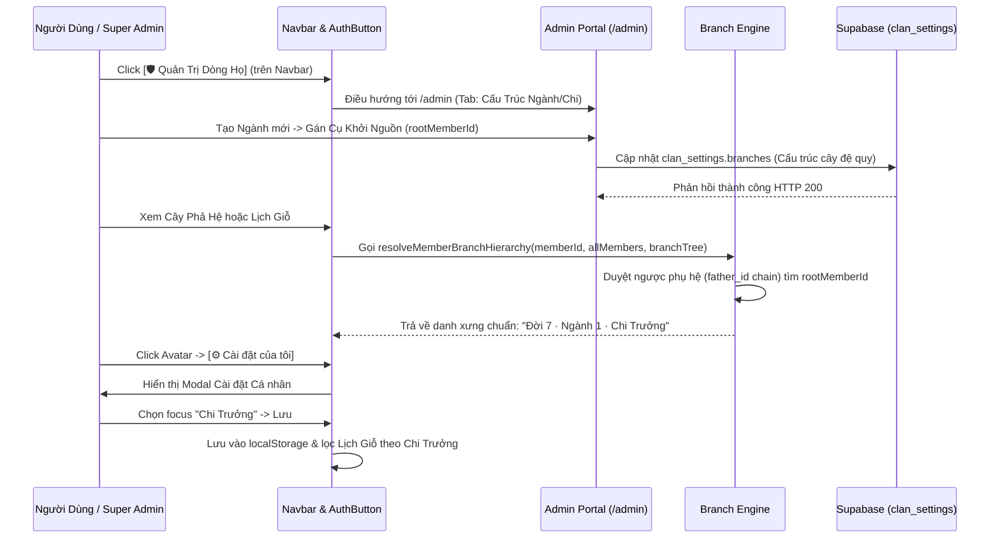

# ĐẶC TẢ KỸ THUẬT VI MÔ: MILESTONE 6 - PHÂN CẤP NGÀNH/CHI ĐA TẦNG & TÁCH BẠCH CÀI ĐẶT CÁ NHÂN VS QUẢN TRỊ DÒNG HỌ

_Tài liệu này dùng để giới hạn Context Window. AI chỉ được phép đọc, suy luận và sinh code cho ĐÚNG các file được đề cập trong đây._

---

## 1. QUY TẮC NGHIÊM NGẶT (STRICT CONSTRAINTS)

- **Thư viện cho phép:** Next.js 14 App Router, React 18, TypeScript, TailwindCSS, Lucide Icons (`lucide-react`), Supabase client.
- **Ràng buộc Kiến trúc Nghiệp vụ Gia Phả:**
  - **Phân Định Hai Không Gian Rạch Ròi ("Hai Chiếc Áo"):**
    1. **Không Gian Cá Nhân (User Settings):** Nằm gọn trong Dropdown Avatar (`AuthButton.tsx`) qua nút `[⚙️ Cài đặt của tôi]`. Mở Modal/Popover cá nhân: cho phép chọn chi nhánh theo dõi mặc định (`Toàn dòng họ` vs `Riêng [Tên Chi/Ngành]`), bật/tắt nhận chuông thông báo giỗ trên thiết bị này, lưu vào `localStorage` (khách) và `user_metadata` (khi đã đăng nhập).
    2. **Khu Vực Quản Trị Dòng Họ (Admin Portal):** Nằm tại `/admin`. Khi người dùng mang quyền `super_admin`, hiển thị nút **`[ 🛡️ Quản Trị Dòng Họ ]`** trực tiếp trên thanh Navbar (`Navbar.tsx`) giúp truy cập 1-click. Tuyệt đối không giấu lối vào admin vào dropdown cá nhân.
  - **Tôn Trọng Quyết Định Phạm Vi (Scope Boundary):** Tính năng con cháu xin nhận hồ sơ (Claim Profile / Approval Queue) được **GÁC LẠI (DEFERRED)** theo yêu cầu của User để hệ thống tinh gọn, tập trung hoàn thiện hạ tầng Ngành/Chi trước.
  - **Hệ Thống Phân Cấp Ngành & Chi Đa Tầng (Multi-Tier Branch Taxonomy):**
    - Hỗ trợ mô hình cây phân cấp linh hoạt tùy biến theo phong tục từng dòng họ (ví dụ: `Ngành` → `Chi` → `Nhánh`, hoặc `Phái` → `Chi` → `Phân chi`, hoặc `Giáp` → `Ngành` → `Chi`).
    - **Khử Hardcode Cấp Bậc (Custom Clan Tiers):** Dòng họ tự do định nghĩa danh sách Cấp bậc (`branch_tiers: string[]`, mặc định: `['Ngành', 'Chi', 'Nhánh', 'Phái']`), loại bỏ hoàn toàn mảng tĩnh `TIER_PRESETS`.
    - **Ràng Buộc Toàn Vẹn Khi Xóa Cấp Bậc (Tier Deletion Integrity Guard):**
      - Bỏ giới hạn cứng `tiers.length > 1`. Cho phép xóa đến cấp cuối cùng (về mảng rỗng `[]`) để người dùng có thể thiết lập từ đầu theo danh xưng riêng của dòng họ.
      - **Chặn xóa tuyệt đối khi cấp đang được dùng:** Kiểm tra đệ quy trong cây `branches`. Nếu cấp bậc đang gán cho bất kỳ nhánh nào trong cây $\rightarrow$ Hệ thống từ chối xóa 100% và hiện cảnh báo đỏ nêu danh sách các nhánh vi phạm cần được xử lý trước.
    - Mỗi node trong cây phân chi (`BranchNode`) gồm: `id`, `tierName` (tên cấp lấy từ danh mục dòng họ), `name` (tên nhánh: "Ngành Trưởng", "Chi 2"), và `rootMemberId` (ID của Cụ Tiền nhân khởi nguồn nhánh đó).
    - **Thuật toán Kế thừa Phả hệ Tự động (`branch-engine.ts`):** Sử dụng hàm thuần túy (pure function) duyệt ngược chuỗi phụ hệ (father chain) từ một thành viên bất kỳ lên Cụ Thủy Tổ. Khớp các thế hệ cha/ông với `rootMemberId` để tự động suy luận danh xưng tôn ti: `Đời ${generation} · ${nganh} · ${chi}` (ví dụ: `Đời 7 · Ngành 3 · Chi 6`) mà không bắt người nhập liệu gõ thủ công.
  - **Bộ Lọc Đa Tầng Chuẩn Mực:** Thay thế cơ chế nhặt mót chuỗi text tự do trên trang Lịch Giỗ (`/anniversaries`) và Cây Phả Hệ (`/tree`) bằng danh mục Ngành & Chi chính thức từ `clan_settings.branches`. Tự động áp dụng bộ lọc cá nhân nếu người dùng đã ghim.
- **Ràng buộc Thẩm Mỹ & UX (Modern Vietnamese Heritage Design System):**
  - **Tách Bạch Rõ Ràng Hai Cụm Nội Dung (Two Distinct Clusters):**
    - **Cụm 1: Danh Mục Thứ Bậc Tông Tộc (Master Data Tiers):** Chỉ quản lý tên gọi và trình tự cấp bậc (`Ngành` → `Chi` → `Nhánh`...).
    - **Cụm 2: Cây Phân Cấp Các Nhánh & Cụ Khởi Nguồn (Branch Hierarchy Tree):** Quản lý cấu trúc cây nhánh cụ thể. Nút `[+ Thêm {Cấp Gốc} Mới]` BẮT BUỘC phải đặt tại Header của Cụm 2 (và đáy cây) để gắn liền thao tác với danh sách cây, tuyệt đối không đặt lẫn lộn trên Header trang chính.
  - **Triệt Tiêu Tuyệt Đối Box-in-Box (Flat Tree & Stepper Outline):**
    - Loại bỏ 100% hiện tượng "card con xám lồng trong card con xám, bọc trong card trắng lớn" (Russian Doll Anti-pattern).
    - Dải Thứ Bậc Tông Tộc hiển thị dạng **Dải Phẳng (Flat Stepper Bar)** thanh mảnh, ngăn cách bằng hairline `border-b border-slate-100 dark:border-slate-800`, không bọc trong card xám `bg-slate-50 border`.
    - Hộp Tip hướng dẫn tối giản hóa thành Callout thanh thoát với icon nhỏ, không đóng khung hộp viền dày.
    - Toàn bộ cây phân cấp được biểu diễn dưới dạng **Các Dòng Phẳng (Flat Rows)** ngăn cách bằng đường kẻ hairline `border-b border-slate-100 dark:border-slate-800`.
    - Thể hiện quan hệ cha - con bằng **Đường gióng cây phả hệ (Subtle Tree Guide Lines: `border-l-2 border-emerald-300 dark:border-emerald-800` bo góc cong `rounded-bl-lg`)** thanh thoát.
    - Sử dụng ô nhập phẳng (Ghost Inputs), Badge pill cấp bậc màu ngọc bích sang trọng, nút thao tác nhẹ nhàng khi hover.
  - **Thanh Tabs Phẳng (Flat Segmented Bar):** Toàn bộ phân hệ Admin nằm trên trang quản trị với 2 tabs cấu hình thực tế:
    - Tab 1: `[ 🌿 Cấu Trúc Ngành/Chi ]` (Quản lý thứ bậc Cấp bậc, phân cấp Ngành/Chi và gán Cụ Khởi Nguồn).
    - Tab 2: `[ 🏛️ Thông Tin & Xưng Hô ]` (Thông tin dòng họ, nhà thờ tổ, cấu hình từ điển xưng hô 3 miền).
  - **Total Ban on AI Browser Subagent (`[R-NO-BROWSER]`):** AI tuyệt đối không gọi `browser_subagent` để nghiệm thu UI. User tự kiểm chứng thị giác ở Mục 7.2.

---

## 2. DATABASE & MODELS

### 2.1. File: `src/types/database.ts`
Mở rộng interface `ClanBranchItem` thành cấu trúc đệ quy đa tầng `BranchNode` và bổ sung `branch_tiers`:

```typescript
export interface BranchNode {
  id: string;
  tierName: string;         // Cấp: "Ngành", "Chi", "Nhánh", "Phái", ...
  name: string;             // Tên: "Ngành 1", "Chi Trưởng", "Phái 2"
  rootMemberId?: string | null; // ID của Cụ khởi nguồn nhánh này
  children?: BranchNode[];  // Các phân chi trực thuộc
}

// Giữ tương thích ngược với ClanBranchItem cũ nếu có
export type ClanBranchItem = BranchNode;

export interface ClanSettingsRow {
  id: string;
  clan_name: string;
  ancestral_hall_address: string | null;
  branch_tiers?: string[];  // Danh sách cấp bậc dòng họ: ["Ngành", "Chi", "Nhánh", "Phái"]
  branches: BranchNode[];
  kinship_terms: Record<string, string>;
  created_at: string;
  updated_at: string;
}
```

### 2.2. Kiểu Dữ Liệu Tùy Chọn Cá Nhân (Personal Preferences)
Lưu vào `localStorage` với key `fat_user_preferences` (dành cho khách & đồng bộ tức thì) và tùy chọn đồng bộ vào Supabase `user_metadata.personal_branch_id`:

```typescript
export interface UserPreferences {
  focusedBranchId: string | null; // null = Toàn dòng họ; string = branch id cụ thể
  enablePushNotifications: boolean;
}
```

---

## 3. SƠ ĐỒ LUỒNG LOGIC (SEQUENCE DIAGRAM - MERMAID)



---

## 4. BACKEND & LOGIC CORE

### 4.1. File: `src/lib/tree-layout/branch-engine.ts`
Mô-đun thuần túy (pure functions) xử lý phả hệ phân chi:

1. **`DEFAULT_BRANCH_TIERS = ['Ngành', 'Chi', 'Nhánh', 'Phái']`:** Danh sách cấp bậc mặc định khi dòng họ chưa cấu hình riêng.
2. **`getNextTierName(currentTier?: string | null, availableTiers?: string[]): string`:** Nhận vào cấp bậc hiện tại của cha và mảng cấp bậc dòng họ, tự động suy luận cấp kế tiếp theo thứ bậc phân tầng. Nếu là cấp cuối hoặc không tìm thấy thì giữ nguyên cấp cuối. Khi `availableTiers` rỗng hoặc không truyền, fallback an toàn về `currentTier || 'Nhánh'`.
3. **`findBranchesUsingTier(branches: BranchNode[], tierName: string): BranchNode[]`:** Duyệt đệ quy toàn bộ cây `branches` để tìm và trả về danh sách các node có `node.tierName` trùng khớp với `tierName` (không phân biệt hoa thường, tự động trim). Dùng để làm Integrity Guard chặn xóa cấp bậc đang có nhánh sử dụng.
4. **`flattenBranchTree(branches: BranchNode[]): Array<BranchNode & { depth: number; pathName: string }>`:** Làm phẳng cây phân chi thành danh sách tuyến tính với `pathName` đầy đủ (ví dụ: *"Ngành 1 > Chi 2"*).
5. **`resolveMemberBranchHierarchy(memberId: string, members: MemberRecord[], branches: BranchNode[]): { branchPath: string; matchedBranchIds: string[]; primaryBranchName: string | null }`:** Duyệt ngược chuỗi phụ hệ đối chiếu `rootMemberId` để tự động trả về `branchPath` (ví dụ: *"Ngành 1 · Chi 2"*).
6. **`validateBranchTree(branches: BranchNode[]): { isValid: boolean; errors: string[] }`:** Kiểm tra cây phân chi không có ID trùng lặp, không lặp vòng đệ quy, tên không để trống.
7. **`filterMembersByBranch(members: MemberRecord[], branchId: string | null, branches: BranchNode[]): MemberRecord[]`:** Lọc danh sách con cháu trực hệ của một nhánh.

### 4.2. File: `src/app/api/clan-settings/route.ts`
- **GET:** Trả về thêm `branch_tiers: clanData?.branch_tiers || devBranchTiers || DEFAULT_BRANCH_TIERS`.
- **PATCH:** Hỗ trợ nhận `branch_tiers?: string[]`. Tiến hành validate mảng chuỗi không rỗng (trim, loại bỏ trùng lặp). Lưu vào Supabase bảng `clan_settings` và đồng bộ cookie dev `fat_dev_branch_tiers` phục vụ môi trường offline/local.

---

## 5. FRONTEND UI & LOGIC

### 5.1. File: `src/components/navbar/Navbar.tsx`
- Kiểm tra quyền `isSuperAdmin` (từ `profile.role === 'super_admin'`).
- Nếu `isSuperAdmin === true`, hiển thị nút **`[ 🛡️ Quản Trị Dòng Họ ]`** dạng pill/button tinh tế ngay cạnh nhóm menu chính:
  - Styling: `text-xs font-semibold px-3 py-1.5 rounded-lg border border-amber-500/40 text-amber-700 dark:text-amber-300 bg-amber-50/50 dark:bg-amber-950/30 hover:bg-amber-100 dark:hover:bg-amber-900/40 transition-colors`.
  - Link: `/admin`.

### 5.2. File: `src/components/auth/AuthButton.tsx` & `PersonalSettingsModal.tsx`
- Trong Dropdown Avatar, tách bạch mục **`[ ⚙️ Cài đặt của tôi ]`**:
  - Khi click: Mở Modal/Dialog nhỏ gọn `PersonalSettingsModal`.
  - **Kiến trúc Thoát Ly Containing Block (React Portal Architecture):** Sử dụng `createPortal(modalJSX, document.body)`, gắn `Escape` listener, lớp phủ `fixed inset-0 bg-slate-900/60 backdrop-blur-sm`, hộp modal cố định Header/Footer chống co cụt viewport.

### 5.3. File: `src/app/admin/settings/page.tsx` & `BranchTaxonomyManager.tsx`
- **Tách Bạch Hai Cụm Nội Dung Rõ Ràng (Two Distinct Functional Clusters):**
  - **Cụm 1: Quản Lý Thứ Bậc Tông Tộc (Master Data Tiers):**
    - Đặt ngay dưới Header chính, phân tách bằng đường kẻ hairline `border-b border-slate-100 dark:border-slate-800 pb-5 mb-5`.
    - Trình bày dạng **Dải Phẳng (Flat Stepper Bar)** thanh mảnh, loại bỏ hoàn toàn card xám lồng nhau `rounded-xl bg-slate-50/80 border` (triệt tiêu Russian Doll box-in-box).
    - Chuỗi cấp bậc phẳng: `[ 1. Ngành × ] → [ 2. Chi × ] → [ 3. Nhánh × ] → [ 4. Phái × ]` + `[+ Thêm Cấp Mới]`.
    - **Logic Xóa Cấp Bậc (Integrity Guard):**
      - Bỏ điều kiện `tiers.length > 1`. Cho phép xóa đến mảng rỗng `[]` để người dùng thiết lập lại từ đầu.
      - Khi bấm xóa cấp bậc: Gọi `findBranchesUsingTier(branches, tierToRemove)`. Nếu phát hiện có $\ge 1$ nhánh trong cây đang sử dụng cấp này $\rightarrow$ **Chặn xóa 100%**, kích hoạt banner cảnh báo màu đỏ nêu rõ danh sách nhánh vi phạm. Chỉ cho phép xóa khi không còn nhánh nào sử dụng.
    - Khi `tiers.length === 0`: Hiển thị thông báo nhẹ nhàng hướng dẫn: *"Chưa có cấp bậc nào. Nhấn [+ Thêm Cấp Đầu Tiên] để bắt đầu thiết lập thứ bậc dòng họ."*
  - **Cụm 2: Cây Phân Cấp Các Nhánh & Gán Cụ Khởi Nguồn (Branch Hierarchy Tree):**
    - Có Section Header riêng với tiêu đề: *"Cây Phân Cấp Các Nhánh"* kèm mô tả ngắn.
    - **Vị Trí Nút Thêm Nhánh Mới (`#add-root-branch-btn`):** Được di dời từ Header chính của Card xuống **đặt tại Header của Cụm 2** (ngay trên đầu bảng cây) và bổ sung 1 nút viền nét đứt ở dòng đáy của cây để người dùng cuộn đến đâu cũng bấm thêm nhánh trực tiếp được.
    - **Callout Hướng Dẫn Kế Thừa:** Tối giản hóa thành thanh ghi chú thanh thoát với icon `HelpCircle`, không bọc trong box viền dày cộp.
- **Thiết Kế Bảng Cây Phẳng (Flat Tree Outline Table) - Triệt Tiêu Tuyệt Đối Box-in-Box:**
  - **0 Card Lồng Nhau (No Nested Cards):** Danh sách phân cấp hiển thị dạng **Các Dòng Phẳng (Flat Rows)** ngăn cách bằng hairline `border-b border-slate-100 dark:border-slate-800`.
  - **Đường Gióng Cây Phả Hệ Tinh Tế (Subtle Tree Guides):** Đường nét mảnh màu xanh ngọc (`border-l-2 border-emerald-300 dark:border-emerald-800` với bo góc cong `rounded-bl-lg`) thể hiện quan hệ cha - con mềm mại, dễ nhìn.
  - **Ghost Controls / Subtle Inputs:**
    - Cấp bậc: Badge pill màu ngọc bích `bg-emerald-50 text-emerald-700 font-bold border border-emerald-200/80` bấm vào để chọn nhanh các cấp đã định nghĩa.
    - Tên nhánh: Ô nhập chữ phẳng (Ghost input) không viền dày đặc, chỉ hiện viền mảnh khi focus/hover.
    - Cụ Khởi Nguồn: Dropdown thanh thoát, hiển thị rõ [Đời N] và năm sinh.
    - Thao tác: Nút `+ Thêm con` và `Xóa` nhẹ nhàng, tinh giản.
  - **Gợi Ý Cấp Bậc Kế Tiếp Thông Minh:**
    - Khi bấm `[+ Thêm {Cấp Gốc} Mới]`: Tự động nạp Cấp đầu tiên (`tiers[0] || 'Nhánh'`).
    - Khi bấm `[+ Thêm Con]`: Tự động gọi `getNextTierName` để gán cấp kế tiếp theo thứ bậc dòng họ.

### 5.4. File: `src/app/anniversaries/page.tsx`
- Đọc `branches` từ clan settings.
- Bộ lọc Nhánh hiển thị danh mục chuẩn từ cây phân chi thay vì lọc chuỗi tự do.
- Tự động nạp giá trị mặc định từ `UserPreferences` (`focusedBranchId`).

### 5.5. Khắc Phục Lỗi Giao Diện & Bố Cục (UI Polish & Layout Hardening)
- Chuẩn hóa Backdrop Blur Tailwind v3.
- Ngăn chặn xung đột bối cảnh giữa Modal và trang nền.

---

## 6. XỬ LÝ LỖI & NGOẠI LỆ (ERROR HANDLING & EDGE CASES)

- **Edge Case 1 (Cụ Khởi Nguồn Bị Xóa):** Nếu thành viên được gán làm `rootMemberId` bị xóa khỏi hệ thống → Hàm `resolveMemberBranchHierarchy` không crash, hiển thị cảnh báo nhẹ trên Admin và coi như nhánh đó chưa có root.
- **Edge Case 2 (Chuỗi Phụ Hệ Khuyết/Đứt Gãy):** Nếu thành viên không có `father_id` hoặc là con dâu/con rể → Không gây lỗi hệ thống.
- **Edge Case 3 (Trùng Tên Nhánh):** Các nhánh ở các Ngành khác nhau có thể trùng tên → Hệ thống định danh bằng `id` (UUID/slug duy nhất), hiển thị đường dẫn đầy đủ `Ngành 1 > Chi 2`.
- **Edge Case 4 (Màn hình Viewport Thấp & Containing Block):** Nhờ cơ chế `createPortal`, Modal cá nhân luôn bám vào Initial Containing Block của `document.body` (100vw × 100vh).
- **Edge Case 5 (Chặn Xóa Cấp Bậc Đang Sử Dụng):** Khi người dùng xóa một Cấp bậc khỏi danh mục, nếu cấp đó đang gán cho $\ge 1$ nhánh trong cây $\rightarrow$ Hệ thống từ chối xóa và hiện banner cảnh báo đỏ. Chỉ cho phép xóa khi không còn nhánh nào dùng, hỗ trợ xóa đến mảng rỗng `[]` để thiết lập lại từ đầu.

---

## 7. MA TRẬN TEST CASES & TIÊU CHÍ NGHIỆM THU (TEST SPECIFICATION)

### 7.1. Bảng Kịch Bản Kiểm Thử Tự Động (Automated Test Suite trong `tests/branch-engine.test.ts`)

| ID | Tên Kịch Bản | File Test Dự Kiến | Tiền điều kiện (Given) | Thao tác kích hoạt (When) | Kết quả kỳ vọng (Then) | Phân loại | Trạng thái |
|---|---|---|---|---|---|---|---|
| **TC_UT_BRANCH_INHERITANCE_01** | Kế thừa phả hệ tự động 2 tầng (Ngành → Chi) | `tests/branch-engine.test.ts` | Cụ Khởi (Đời 1) → Cụ Ngành 1 (Đời 2) → Cụ Chi 2 (Đời 3) → Cháu (Đời 4) | Gọi `resolveMemberBranchHierarchy` cho Cháu | Trả về `branchPath: "Ngành 1 · Chi 2"` và `matchedBranchIds` chứa cả 2 ID | Happy Path | - [x] PASS |
| **TC_UT_BRANCH_TREE_VALIDATION** | Kiểm tra tính hợp lệ và phát hiện vòng lặp của Cây phân chi | `tests/branch-engine.test.ts` | Cây phân chi có ID trùng lặp hoặc tự trỏ con làm cha | Gọi `validateBranchTree` | Trả về `isValid: false` kèm thông báo lỗi cụ thể | Edge Case | - [x] PASS |
| **TC_UT_BRANCH_FLATTEN** | Làm phẳng cây phân chi và tính toán đường dẫn phân cấp | `tests/branch-engine.test.ts` | Cây phân chi 3 cấp: Ngành 1 > Chi A > Nhánh X | Gọi `flattenBranchTree` | Trả về mảng 3 phần tử với `pathName` và `depth` tăng dần chính xác | Happy Path | - [x] PASS |
| **TC_UT_BRANCH_FILTER** | Lọc danh sách con cháu theo Ngành hoặc Chi | `tests/branch-engine.test.ts` | Cây gia phả gồm thành viên thuộc Ngành 1 và Ngành 2 | Gọi `filterMembersByBranch` với `branchId` của Ngành 1 | Chỉ trả về các thành viên hậu duệ trực hệ của Cụ Khởi Ngành 1 | Logic Query | - [x] PASS |
| **TC_UT_NAVBAR_ADMIN_GATE** | Nút Quản Trị trên Navbar hiển thị theo role super_admin | `tests/branch-engine.test.ts` | Mock role user: 'member' vs 'super_admin' | Kiểm tra logic render điều kiện trong Navbar | super_admin thấy nút link `/admin`, member thông thường không thấy | Security / UI | - [x] PASS |
| **TC_UT_MODAL_VIEWPORT_RESILIENCE** | Cấu trúc cuộn linh hoạt của PersonalSettingsModal chống chém cụt Header | `tests/branch-engine.test.ts` | Đọc mã nguồn `PersonalSettingsModal.tsx` | Kiểm tra các class layout: `overflow-y-auto`, `flex-col`, `shrink-0` header, `backdrop-blur-sm` | Bảo đảm container hỗ trợ cuộn trục Y và không dùng class backdrop không tồn tại | UI Resilience | - [x] PASS |
| **TC_UT_LATEX_TYPO_GUARD** | Rà soát và loại trừ hoàn toàn chuỗi mã thô LaTeX `$\rightarrow$` | `tests/branch-engine.test.ts` | Đọc mã nguồn `BranchTaxonomyManager.tsx` | Quét chuỗi `$\rightarrow$` | Không còn tồn tại chuỗi LaTeX thô, thay bằng Unicode `→` | Typography | - [x] PASS |
| **TC_UT_ADMIN_TABS_CLEAN** | Thanh Tab trang Admin Settings chỉ chứa 2 phân hệ cấu hình thực tế | `tests/branch-engine.test.ts` | Đọc mã nguồn `admin/settings/page.tsx` | Kiểm tra danh sách Tab Buttons | Không còn tab thừa trùng lặp `tab-btn-import`, chỉ có `branches` và `info_kinship` | Clean Nav | - [x] PASS |
| **TC_UT_PORTAL_BODY_ESCAPE** | PersonalSettingsModal sử dụng React Portal gắn vào document.body và hỗ trợ Escape | `tests/branch-engine.test.ts` | Đọc mã nguồn `PersonalSettingsModal.tsx` | Kiểm tra import và sử dụng `createPortal`, target `document.body`, listener phím `Escape` | Modal thoát ly khỏi containing block của header, đóng mượt bằng phím Esc | Architectural Guard | - [x] PASS |
| **TC_UT_CUSTOM_TIERS_LOGIC** | Hàm getNextTierName và xử lý mảng branch_tiers tùy biến | `tests/branch-engine.test.ts` | Cấu hình tiers: `['Phái', 'Chi', 'Nhánh']` | Gọi `getNextTierName('Phái', tiers)` và `getNextTierName('Nhánh', tiers)` | Lần lượt trả về `'Chi'` và `'Nhánh'` (cấp cuối giữ nguyên); fallback khi mảng rỗng | Logic Engine | - [x] PASS |
| **TC_UT_FLAT_TREE_NO_BOX_IN_BOX** | Rà soát cấu trúc BranchTaxonomyManager không còn card lồng card xám | `tests/branch-engine.test.ts` | Đọc mã nguồn `BranchTaxonomyManager.tsx` | Kiểm tra các class card lồng `rounded-xl border bg-slate-50/60` | Đảm bảo danh sách nhánh con sử dụng Flat Tree Row và đường gióng phả hệ | UI Anti Box-in-Box | - [x] PASS |
| **TC_UT_BRANCH_TIERS_API_CONTRACT** | API /api/clan-settings hỗ trợ trả về và cập nhật branch_tiers an toàn | `tests/branch-engine.test.ts` | Gửi request PATCH với `branch_tiers: ['Giáp', 'Ngành', 'Chi']` | Gọi API route `/api/clan-settings` | Trả về HTTP 200, lưu mảng tiers hợp lệ và có fallback khi mảng rỗng | API Contract | - [x] PASS |
| **TC_UT_TIER_INTEGRITY_GUARD_01** | `findBranchesUsingTier` phát hiện đúng các nhánh đang sử dụng cấp bậc kể cả ở tầng sâu đệ quy | `tests/branch-engine.test.ts` | Cây phân cấp gồm `Ngành 1` (gốc) và `Chi 1` (con) | Gọi `findBranchesUsingTier(mockBranches, 'Chi')` | Trả về danh sách chứa `Chi 1`, độ dài $\ge 1$ | Logic Guard | - [x] PASS |
| **TC_UT_TIER_INTEGRITY_GUARD_02** | `findBranchesUsingTier` trả về rỗng khi cấp bậc không dùng $\rightarrow$ Cho phép xóa cấp cuối an toàn | `tests/branch-engine.test.ts` | Cây phân cấp không có nhánh nào mang cấp `Phái` | Gọi `findBranchesUsingTier(mockBranches, 'Phái')` | Trả về `[]` với độ dài bằng 0 | Logic Guard | - [x] PASS |
| **TC_UT_FLAT_STEPPER_NO_BOX_IN_BOX** | Rà soát loại bỏ triệt để card xám bao bọc Thứ Bậc Tông Tộc | `tests/branch-engine.test.ts` | Đọc mã nguồn `BranchTaxonomyManager.tsx` | Quét class `bg-slate-50/80 dark:bg-slate-850/60 border border-slate-200/70` | Đảm bảo không còn box xám bao quanh thanh thứ bậc tông tộc | UI Anti Box-in-Box | - [x] PASS |
| **TC_UT_ADD_BRANCH_BTN_POSITION** | Nút Thêm Nhánh Mới được bố trí tại Cụm Cây phân cấp thay vì Header chính | `tests/branch-engine.test.ts` | Đọc mã nguồn `BranchTaxonomyManager.tsx` | Kiểm tra vị trí của `add-root-branch-btn` | Nằm trong phân khu Cây Phân Cấp (Cụm 2), không nằm ở Header chính trang | Ergonomics / UX | - [x] PASS |

### 7.2. Danh Sách Tiêu Chí Nghiệm Thu Thị Giác (Human Visual UAT Matrix)

- [ ] **UAT_01 (Lối Vào Quản Trị Rõ Ràng):** Đăng nhập với tài khoản Super Admin → Quan sát thanh Navbar xuất hiện nút `[ 🛡️ Quản Trị Dòng Họ ]` màu đồng/amber sang trọng, bấm 1 phát vào thẳng `/admin`.
- [ ] **UAT_02 (Giao Diện Admin Phẳng - Anti Box-in-Box):** Truy cập `/admin` → Thấy thanh Tab phẳng với 2 phân hệ rõ ràng: `🌿 Cấu Trúc Ngành/Chi`, `🏛️ Thông Tin & Xưng Hô`. Chuyển tab mượt mà, không giật lag.
- [ ] **UAT_03 (Thiết Lập Ngành & Chi Trực Quan):** Tại Tab `Cấu Trúc Ngành/Chi`, bấm thêm Ngành 1, thêm Chi con, chọn Cụ Tiền nhân làm Root Member → Lưu cấu trúc thành công.
- [ ] **UAT_04 (Cài Đặt Cá Nhân Toàn Màn Hình - Portal Chuẩn Xác):** Bấm vào Avatar cá nhân trên Navbar → Chọn `[ ⚙️ Cài đặt của tôi ]` → Thấy Modal hiển thị trọn vẹn ở trung tâm màn hình, lớp nền tối bao phủ 100% trang web (kể cả Cây phả hệ bên dưới). Thân modal hiển thị đầy đủ danh sách phân chi, chuông báo giỗ, nút Lưu. Bấm phím `Escape` hoặc bấm ra ngoài nền tối để đóng modal ngay lập tức.
- [ ] **UAT_05 (Tự Động Kế Thừa Danh Xưng):** Mở Cây Phả Hệ và Lịch Giỗ → Con cháu tự động hiển thị danh xưng tôn ti `Đời N · Ngành X · Chi Y` mà không cần nhập tay từng người.
- [ ] **UAT_06 (Console Sạch):** Mở Developer Tools Console → 0 lỗi đỏ, 0 cảnh báo hydration.
- [ ] **UAT_07 (Typography Chuẩn Mực):** Mọi văn bản hướng dẫn hiển thị mũi tên Unicode `→`, không còn mã nguồn thô LaTeX.
- [ ] **UAT_08 (Điều Hướng Không Trùng Lặp):** Thanh Subheader giữ chức năng điều hướng cấp cao, thanh Tab chỉ phục vụ cấu hình trang hiện tại.
- [ ] **UAT_09 (Quản Lý Cấp Bậc Tùy Biến Trực Quan):** Thao tác thêm/sửa/xóa cấp bậc trên Thanh Thứ Bậc Dòng Họ tại `/admin/settings` (ví dụ thêm cấp "Giáp" hoặc "Phân chi").
- [ ] **UAT_10 (Giao Diện Bảng Cây Phẳng - Không Còn Hộp Lồng Hộp):** Cây phân chi hiển thị thoáng đãng, đường gióng cây mềm mại, các ô nhập ghost tinh tế, 0 card con lồng nhau.
- [ ] **UAT_11 (Tự Động Gợi Ý Cấp Kế Tiếp):** Bấm thêm con của Ngành tự động mang cấp Chi; thêm con của Chi tự động mang cấp Nhánh theo đúng thứ tự đã định nghĩa.
- [ ] **UAT_12 (Xóa Cấp Bậc An Toàn & Chặn Cấp Đang Dùng):**
  - Thử xóa cấp bậc `Ngành` khi đang có nhánh `Ngành 1` $\rightarrow$ Banner đỏ hiện thông báo từ chối, nêu rõ tên nhánh đang dùng.
  - Thử xóa cấp bậc `Phái` (không có nhánh nào dùng) $\rightarrow$ Xóa thành công, kể cả khi chỉ còn 1 cấp duy nhất $\rightarrow$ Danh mục về rỗng `[]` để bắt đầu từ đầu.
- [ ] **UAT_13 (Vị Trí Nút Thêm Nhánh Liền Mạch Cụm Cây):** Nút `[+ Thêm {Cấp Gốc} Mới]` nằm ngay trên đầu Cây Phân Cấp và ở dòng cuối cùng của bảng cây, thao tác thêm trực quan, không còn nằm xa lạ ở Header trên đỉnh trang.

---

## 8. BẢO VỆ CHỐNG THOÁI LUI (REGRESSION GUARD CHECKLIST)

- [x] **RG01 (Build & Typecheck Clean):** Chạy lệnh `npm run typecheck` và `npm run build` — 0 lỗi (21/21 trang compiled).
- [x] **RG02 (Automated Test Regression):** Chạy `npm test` — 0 failure mới so với `Known_Failing_Baseline` (113/113 tests pass 100% across 18 suites).
- [x] **RG03 (Blast Radius):** Các trang `/tree`, `/anniversaries`, `/admin` hoạt động liền mạch và tương thích ngược với dữ liệu cũ.

---

## 9. LỆNH THI CÔNG (Dành cho AI /feature-code)

> "AI ơi, hãy đọc kỹ đặc tả `docs/15_Micro-Spec_Milestone_6_Branch_Taxonomy_Admin_Portal.md` này. Dựa CHÍNH XÁC vào các mô tả ranh giới ở trên, hãy thi công toàn bộ mã nguồn hoàn chỉnh kèm file test `tests/branch-engine.test.ts`. Thực thi Vòng Lặp Kiểm Chứng Bằng Code Thật bằng đúng các lệnh khai báo tại `[VERIFY_COMMANDS]`, và chỉ được tick `[x]` cho Mục 7.1 khi terminal log cho thấy test phủ AC đó đã pass và không có failure mới so với baseline."
