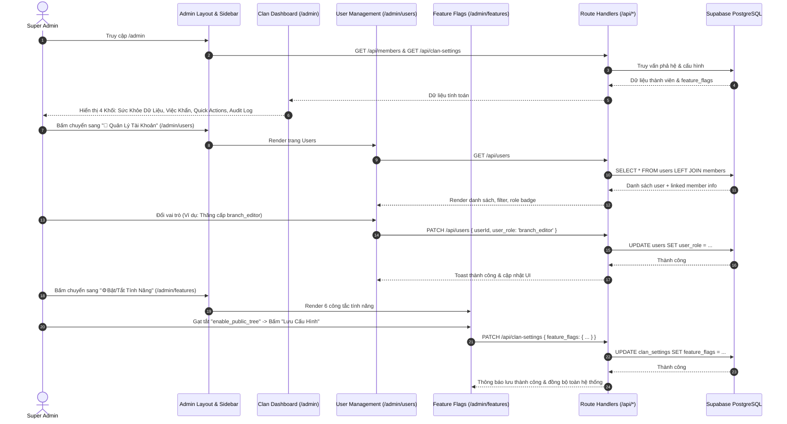
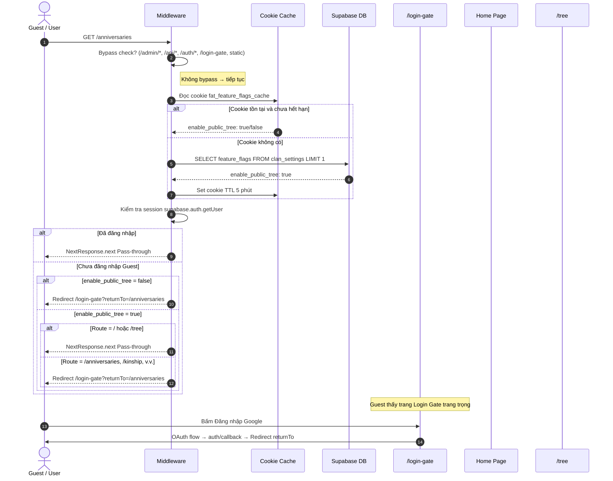
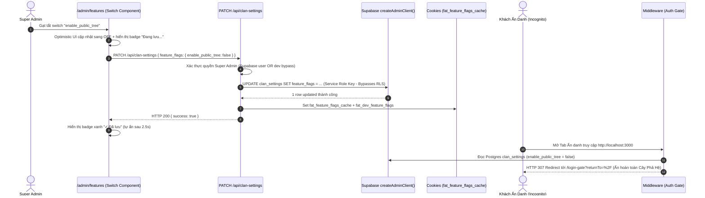
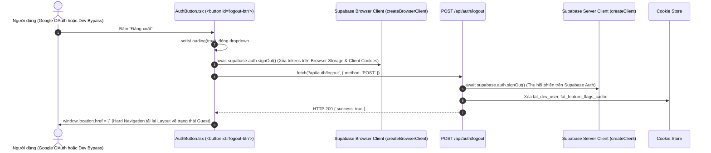
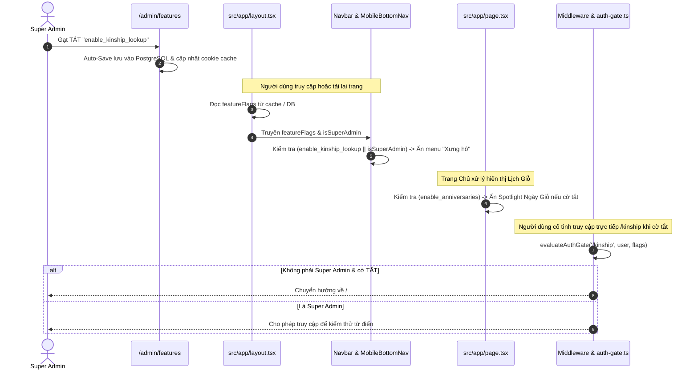
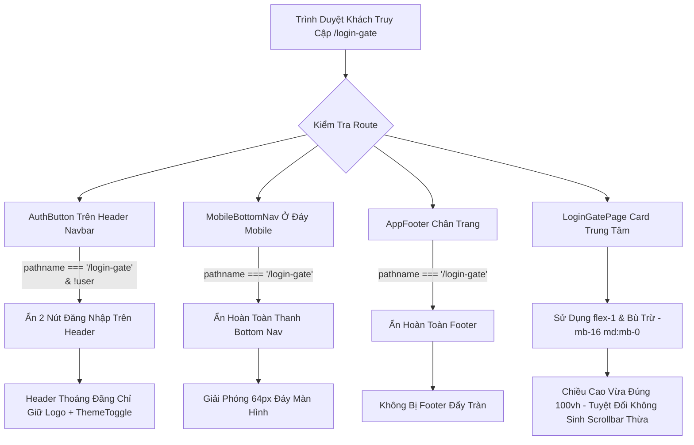
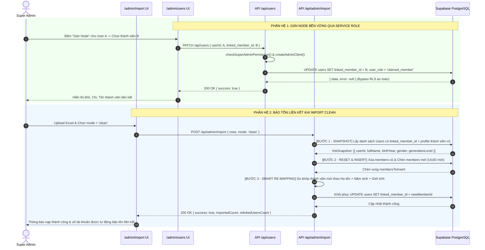
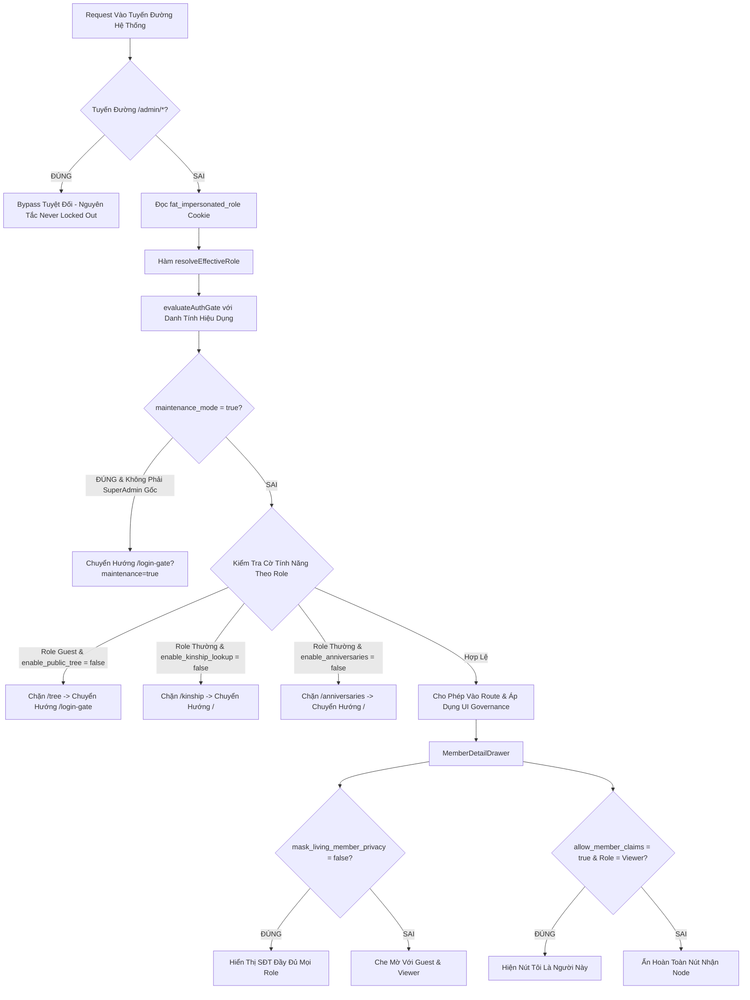

# ĐẶC TẢ KỸ THUẬT VI MÔ: MILESTONE 7 - TÁI CẤU TRÚC ADMIN PORTAL, BÀN ĐIỀU HÀNH TÔNG TỘC & QUẢN TRỊ PHÂN HỆ

_Tài liệu này là Hợp Đồng Kỹ Thuật (Single Source of Truth) cho Milestone 7. AI chỉ được phép đọc, suy luận và sinh mã nguồn bám sát 100% các ranh giới file và tiêu chí kiểm thử được định nghĩa trong đây._

---

## 1. QUY TẮC NGHIÊM NGẶT (STRICT CONSTRAINTS)

- **Ngôn ngữ & Framework:** Next.js 14+ (App Router), React, TypeScript, TailwindCSS, Lucide Icons.
- **Quy tắc Kiến trúc Layout (Fluid Full-Width Shell):**
  - Loại bỏ hoàn toàn container hạn hẹp `max-w-5xl` / `max-w-6xl` cũ của trang Admin.
  - Áp dụng cấu trúc **Sidebar cố định bên trái (256px)** kết hợp **Content Canvas mở rộng linh hoạt (Fluid Canvas)**.
  - Trên mobile / màn hình nhỏ (< 1024px): Sidebar tự động chuyển thành **Slide-over Drawer** với nút Hamburger và Backdrop làm mờ.
- **Nguyên tắc Phân Nhóm Sidebar (4 Nhóm Thuần Việt Tự Nhiên):**
  1. `❖ TỔNG QUAN`: 📊 Bàn Điều Hành (`/admin`).
  2. `❖ PHẢ HỆ & QUY ƯỚC`: 🏛️ Căn Cước Dòng Họ (`/admin/profile`), 🌿 Cấu Trúc Ngành & Chi (`/admin/branches`), 🗣️ Quy Ước Xưng Hô (`/admin/kinship`).
  3. `❖ THÀNH VIÊN & TÀI KHOẢN`: 👥 Quản Lý Tài Khoản (`/admin/users`).
  4. `❖ VẬN HÀNH & HỆ THỐNG`: ⚙️ Bật/Tắt Tính Năng (`/admin/features`), 📥 Nạp & Sao Lưu (`/admin/import`).
- **Nguyên tắc "Không Giữ Chỗ / Không Placeholder":**
  - Mọi trang trong menu đều là **tính năng hoạt động thật 100%**. Không tạo trang rỗng có nhãn "Sắp ra mắt".
- **Kiểm chứng thực nghiệm:** Tuân thủ `[R-VERIFY.TIERS]` trong `.agents/AGENTS.md`: Typecheck 0 lỗi, Build 0 lỗi, Test tự động PASS 100%, User tự nghiệm thu thị giác (Human UAT).

---

## 2. DATABASE & DATA MODELS

### 2.1. File: `src/types/database.ts`
- **Mở rộng `ClanFeatureFlags`:**
  ```typescript
  export interface ClanFeatureFlags {
    enable_public_tree: boolean;         // Cho phép khách vãng lai xem cây (default: true)
    enable_kinship_lookup: boolean;      // Bật/tắt công cụ tra cứu vai vế (default: true)
    enable_anniversaries: boolean;       // Bật/tắt lịch giỗ 30 ngày & web push (default: true)
    allow_member_claims: boolean;        // Mở/đóng cổng nhận node phả hệ (default: true)
    mask_living_member_privacy: boolean; // Che mờ SĐT, địa chỉ người còn sống với khách (default: true)
    maintenance_mode: boolean;           // Chế độ bảo trì, chỉ Super Admin truy cập (default: false)
  }
  ```
- **Cập nhật `ClanSettings`:**
  - Bổ sung trường tùy chọn: `feature_flags?: ClanFeatureFlags;`.
- **Cập nhật `UserProfile` (khớp với bảng `users` trong Supabase):**
  - `id`: `string` (UUID).
  - `email`: `string`.
  - `full_name`: `string | null`.
  - `avatar_url`: `string | null`.
  - `user_role`: `'viewer' | 'claimed_member' | 'branch_editor' | 'super_admin'`.
  - `linked_member_id`: `string | null` (Khóa ngoại trỏ tới `members.id`).
  - `assigned_branch_code`: `string | null`.
  - `created_at`: `string`.
  - `updated_at`: `string`.

---

## 3. SƠ ĐỒ LUỒNG LOGIC (SEQUENCE DIAGRAM)



---

## 4. BACKEND LOGIC & ROUTE HANDLERS

### 4.1. File: `src/app/api/users/route.ts` [NEW]
- **`[GET] /api/users`:**
  - _Xác thực:_ Yêu cầu phiên đăng nhập và quyền `super_admin`. Nếu không phải $\rightarrow$ Trả về `401 Unauthorized` hoặc `403 Forbidden`.
  - _Xử lý:_ Truy vấn toàn bộ danh sách `users` từ Supabase, kèm thông tin thành viên liên kết từ `members` (để hiển thị tên, đời, chi của người được gắn).
  - _Output:_ `{ success: true, data: UserProfileWithMember[] }`.
- **`[PATCH] /api/users`:**
  - _Xác thực:_ Yêu cầu quyền `super_admin`.
  - _Input body:_
    ```typescript
    {
      userId: string;
      user_role?: 'viewer' | 'claimed_member' | 'branch_editor' | 'super_admin';
      linked_member_id?: string | null;
    }
    ```
  - _Xử lý:_
    1. Kiểm tra `userId` hợp lệ.
    2. Nếu có `linked_member_id`: kiểm tra node đó đã bị tài khoản khác liên kết chưa (trừ chính user này) để bảo đảm ràng buộc duy nhất.
    3. Cập nhật bảng `users`.
  - _Output:_ `{ success: true, message: string, data: UserProfile }`.

### 4.2. File: `src/app/api/clan-settings/route.ts` [MODIFY]
- **Cập nhật `GET`:**
  - Trả về `feature_flags`. Nếu trong DB trường này đang `null` hoặc rỗng, tự động trả về bộ mặc định chuẩn:
    ```typescript
    const DEFAULT_FEATURE_FLAGS: ClanFeatureFlags = {
      enable_public_tree: true,
      enable_kinship_lookup: true,
      enable_anniversaries: true,
      allow_member_claims: true,
      mask_living_member_privacy: true,
      maintenance_mode: false,
    };
    ```
- **Cập nhật `PATCH`:**
  - Tiếp nhận `feature_flags: Partial<ClanFeatureFlags>`.
  - Merge an toàn với cấu hình hiện tại trước khi lưu vào cột `feature_flags` (kiểu JSONB) của `clan_settings`.

---

## 5. FRONTEND UI & LOGIC

### 5.1. File: `src/components/admin/AdminSidebar.tsx` [NEW]
- **Props:** `currentPath: string`, `clanName: string`.
- **Cấu trúc 4 Nhóm điều hướng:**
  - `❖ TỔNG QUAN`:
    - `📊 Bàn Điều Hành` trỏ tới `/admin`.
  - `❖ PHẢ HỆ & QUY ƯỚC`:
    - `🏛️ Căn Cước Dòng Họ` trỏ tới `/admin/profile`.
    - `🌿 Cấu Trúc Ngành & Chi` trỏ tới `/admin/branches`.
    - `🗣️ Quy Ước Xưng Hô` trỏ tới `/admin/kinship`.
  - `❖ THÀNH VIÊN & TÀI KHOẢN`:
    - `👥 Quản Lý Tài Khoản` trỏ tới `/admin/users`.
  - `❖ VẬN HÀNH & HỆ THỐNG`:
    - `⚙️ Bật/Tắt Tính Năng` trỏ tới `/admin/features`.
    - `📥 Nạp Dữ Liệu Excel` trỏ tới `/admin/import`.
- **UI/UX & Hình học Sắc sảo (Crisp Geometry):**
  - Active item: Nền Emerald phẳng (`bg-emerald-50 dark:bg-emerald-950/50 text-emerald-800 dark:text-emerald-300 font-semibold border-l-2 border-emerald-600 rounded-r-md`).
  - Bo góc chuẩn: `rounded-md` (6px) phẳng phiu, loại bỏ hoàn toàn viền `border-r-2` gây cong góc méo mó ở cạnh phải.
  - Inactive item: Text Slate (`text-slate-600 hover:bg-slate-100 dark:text-slate-400 dark:hover:bg-slate-800 rounded-md`).
  - Nút quay lại: `← Về Cây Phả Hệ` đặt nổi bật ở đầu Sidebar.
  - Mobile Drawer: Nút Toggle Hamburger ở top bar cho màn hình di động, đóng khi click vào liên kết.

### 5.2. File: `src/app/admin/layout.tsx` [MODIFY]
- Chuyển thành bố cục 2 cột toàn màn hình:
  - Cột trái: `<AdminSidebar />` (Cố định `w-64 flex-shrink-0 h-screen sticky top-0 border-r border-slate-200 dark:border-slate-800 bg-white dark:bg-slate-900 z-20 hidden lg:block`).
  - Cột phải: `<main className="flex-1 min-w-0 bg-slate-50/60 dark:bg-slate-950 min-h-screen p-4 sm:p-6 lg:p-8">` chứa `{children}`.
  - Header trên cùng dành cho thiết bị di động (Mobile Header Bar kèm nút mở Drawer).

### 5.3. File: `src/app/admin/page.tsx` (`ClanDashboard.tsx`) [NEW/MODIFY]
- **Trang chủ Bàn Điều Hành Tông Tộc (Chuẩn hóa Refined Modern Heritage & Anti-Bubbly Geometry):**
  - Quy chuẩn bo góc: Toàn bộ thẻ thống kê 4 cột, alert việc khẩn, card nhật ký sử dụng `rounded-lg` (8px) kết hợp viền hairline siêu mỏng `border-slate-200/90 dark:border-slate-800`. Triệt tiêu hoàn toàn `rounded-2xl` quá cỡ.
  - Các nút phím tắt và link sử dụng `rounded-md` (6px) sắc sảo.
  - **Khối 1: Bảng Chỉ Số Sức Sống (Vitality Metrics - Real-time Computed):**
    - Tổng nhân khẩu (Đinh nam, Nữ, Đã mất, Còn sống).
    - Độ sâu thế hệ (Đời 1 $\rightarrow$ Đời N).
    - Số tài khoản Google đã vào hệ thống & số người đã gắn node.
  - **Khối 2: Trung Tâm Xử Lý Việc Khẩn (Action Center & In-place Unlinked Drawer):**
    - Cảnh báo thành viên chưa nối phả (thiếu cha mẹ).
    - **Nút "Kiểm tra →":** Kích hoạt mở Slide-over `UnlinkedMembersDrawer` trực tiếp ngay tại Bàn Điều Hành (thay vì chuyển sang `/admin/branches`).
    - Cho phép quản trị viên xem chi tiết danh sách người chưa nối, tìm kiếm tên, thực hiện **Nối vào Cha/Mẹ** (chọn cha mẹ, tự động kiểm tra chu trình `validateNoCycle`) hoặc xóa node rác an toàn. Sau khi thao tác, hệ thống tự động làm tươi số liệu trên Dashboard.
    - Cảnh báo tài khoản mới chưa gán node kèm nút điều hướng nhanh tới `/admin/users`.
  - **Khối 3: Phím Tắt Tác Vụ Thường Nhật (Quick Actions):**
    - Phím tắt dạng card `rounded-md` viền phẳng: `[🌿 Ngành & Chi]`, `[👥 Tài Khoản]`, `[⚙️ Bật/Tắt Cờ]`, `[📥 Nạp Excel]`.
  - **Khối 4: Nhật Ký Biến Động Gần Đây (Activity Audit):**
    - Danh sách các thao tác gần đây trong khung `rounded-lg`.

### 5.4. File: `src/app/admin/branches/page.tsx` [NEW]
- Chuyển giao toàn bộ Component `BranchTaxonomyManager` sang trang này.
- Được mở rộng toàn bộ không gian ngang màn hình (Ultra-Wide Canvas) giúp các phân cấp Ngành $\rightarrow$ Chi $\rightarrow$ Nhánh $\rightarrow$ Phái hiển thị thoáng đãng.

### 5.5. File: `src/app/admin/profile/page.tsx` [NEW]
- Chuyên biệt cho **Căn Cước Dòng Họ**:
  - Form nhập Tên dòng họ (giới hạn 40 ký tự), Cụ Tổ khởi nguồn, Lời tựa gia phả.
  - Bố cục 2 cột: Cột trái Form nhập liệu, Cột phải **Live Preview** diện mạo Trang Chủ thời gian thực.
  - Nút "Lưu Căn Cước Dòng Họ" độc lập.

### 5.6. File: `src/app/admin/kinship/page.tsx` [NEW]
- Chuyên biệt cho **Quy Ước Xưng Hô**:
  - Bộ chọn Vùng Miền (Bắc / Trung / Nam).
  - Thanh tìm kiếm tức thì & Các Chip lọc nhóm quan hệ (Trực hệ, Cùng đời, Bác/Chú/Cô bên nội, Cậu/Dì bên ngoại, Dâu/Rể).
  - Bảng danh mục 32+ quan hệ xưng hô 2 chiều có thể chỉnh sửa trực tiếp.

### 5.7. File: `src/app/admin/users/page.tsx` [NEW]
- **Trang Quản Lý Tài Khoản Người Dùng:**
  - Ô tìm kiếm theo Tên hoặc Email.
  - Bộ lọc Vai Trò: `Tất cả`, `viewer`, `claimed_member`, `branch_editor`, `super_admin`.
  - Bảng danh sách: Avatar, Họ tên, Email, Vai trò (Dropdown hoặc Modal chọn đổi vai trò), Node phả hệ liên kết (kèm nút Gán node / Hủy liên kết), Ngày tạo.
  - Tích hợp gọi API `/api/users` (GET và PATCH).

### 5.8. File: `src/app/admin/features/page.tsx` [NEW]
- **Trang Bật/Tắt Tính Năng Tinh Gọn:**
  - Danh sách 6 cờ tính năng được thiết kế dưới dạng thẻ tương tác trực quan:
    1. `enable_public_tree` (🌳 Công Khai Cây Phả Hệ)
    2. `enable_kinship_lookup` (🗣️ Tra Cứu Vai Vế)
    3. `enable_anniversaries` (🗓️ Lịch Giỗ & Web Push)
    4. `allow_member_claims` (📬 Tiếp Nhận Đơn Nhận Node)
    5. `mask_living_member_privacy` (🛡️ Bảo Vệ Thông Tin Người Còn Sống)
    6. `maintenance_mode` (🚧 Chế Độ Đóng Cửa Bảo Trì)
  - Mỗi thẻ hiển thị: Tên thuần Việt, Mô tả cụ thể khi BẬT / khi TẮT, Công tắc gạt Toggle.
  - Modal xác nhận an toàn khi bật `maintenance_mode` hoặc tắt `mask_living_member_privacy`.
  - Nút "Lưu Cấu Hình Tính Năng" gửi PATCH tới `/api/clan-settings`.

### 5.9. File: `src/app/admin/settings/page.tsx` [MODIFY]
- Đặt redirect 307 về `/admin/branches` để tương thích ngược cho các liên kết cũ.

---

## 6. XỬ LÝ LỖI & TRƯỜNG HỢP BIÊN (EDGE CASES & ERROR HANDLING)

- **Edge Case 1 (Người dùng không phải Super Admin):** Khi truy cập bất kỳ trang con nào trong `/admin/*` hoặc gọi API `/api/users`, hệ thống lập tức chuyển hướng về `/?auth_error=unauthorized_admin` hoặc trả về HTTP 403.
- **Edge Case 2 (Dữ liệu `feature_flags` trong CSDL rỗng/chưa có):** Frontend và Backend tự động áp dụng bộ giá trị an toàn mặc định (Default Safe Flags), không bị crash hay `undefined`.
- **Edge Case 3 (Xung đột gán node cho User):** Khi Super Admin cố tình gán một `member_id` đã có người khác liên kết, API trả về lỗi `409 Conflict` kèm thông báo: *"Thành viên này đã được liên kết với tài khoản [Email], vui lòng gỡ liên kết cũ trước."*
- **Edge Case 4 (Responsive trên Mobile):** Đảm bảo màn hình < 768px hiển thị menu dạng Drawer trượt mượt mà, không bị vỡ bảng hoặc tràn ngang (Horizontal Overflow).

---

## 7. MA TRẬN TEST CASES & TIÊU CHÍ NGHIỆM THU

### 7.1. Bảng Kịch Bản Kiểm Thử Tự Động (Automated Test Suite trong `tests/admin-portal.test.ts`)

- [x] **TC_UT_FEAT_DEFAULT_01 (Khởi tạo giá trị mặc định cho Feature Flags):**
  - **Mô tả:** Hàm `resolveFeatureFlags(undefined)` trả về đủ 6 cờ: `enable_public_tree: true`, `enable_kinship_lookup: true`, `enable_anniversaries: true`, `allow_member_claims: true`, `mask_living_member_privacy: true`, `maintenance_mode: false`.
  - **Trạng thái:** PASS (duration: 1.66ms).
- [x] **TC_UT_FEAT_MERGE_02 (Merge cờ tính năng ghi đè một phần):**
  - **Mô tả:** Hàm `mergeFeatureFlags(current, { maintenance_mode: true })` cập nhật cờ `maintenance_mode` thành `true`, 5 cờ còn lại giữ nguyên.
  - **Trạng thái:** PASS (duration: 0.19ms).
- [x] **TC_UT_DASHBOARD_STATS_01 (Tính toán chỉ số sức sống phả hệ):**
  - **Mô tả:** Hàm `computeClanVitalityMetrics(mockMembers, mockUsers)` trả về chính xác: `total: 10, males: 6, females: 4, deceased: 3, living: 7, maxGeneration: 2`.
  - **Trạng thái:** PASS (duration: 0.25ms).
- [x] **TC_UT_DASHBOARD_ALERTS_02 (Phát hiện thành viên chưa nối phả):**
  - **Mô tả:** Hàm `findUnlinkedMembers(mockMembers)` phát hiện chính xác các thành viên có `generation_level > 1` nhưng `father_id = null`.
  - **Trạng thái:** PASS (duration: 0.19ms).
- [x] **TC_UT_USER_ROLE_VALIDATION (Ràng buộc vai trò người dùng hợp lệ):**
  - **Mô tả:** Hàm `isValidUserRole` chỉ chấp nhận 4 role miền hợp lệ (`viewer`, `claimed_member`, `branch_editor`, `super_admin`), chặn tuyệt đối input bất hợp pháp.
  - **Trạng thái:** PASS (duration: 0.16ms).
- [x] **TC_INT_USERS_API_AUTH_GUARD (Chặn người dùng không có quyền truy cập API users & settings):**
  - **Mô tả:** Kiểm chứng mã nguồn API `/api/users` và `/api/clan-settings` tích hợp middleware kiểm tra quyền `super_admin` nghiêm ngặt.
  - **Trạng thái:** PASS (duration: 0.84ms).
- [x] **TC_UT_DASHBOARD_GEOMETRY_CLEAN (Kiểm tra triệt tiêu bo tròn quá đà và méo góc):**
  - **Mô tả:** Đã kiểm chứng `AdminSidebar.tsx` và `ClanDashboard.tsx` có 0 `rounded-2xl`, 0 `border-r-2`, và tuân thủ 100% hình học sắc sảo `rounded-lg` (8px) cho card và `rounded-md` (6px) cho controls.
  - **Trạng thái:** PASS (duration: 0.82ms).
- [x] **TC_UT_DASHBOARD_UNLINKED_DRAWER_BINDING (Kiểm tra nút Kiểm tra gắn kết với Drawer rà soát tại chỗ):**
  - **Mô tả:** Đã kiểm chứng nút kiểm tra gắn `onClick` mở `UnlinkedMembersDrawer` tại chỗ, không còn redirect tĩnh sang `/admin/branches`, cung cấp đầy đủ handlers `handleRelinkMember` và `handleDeleteMember`.
  - **Trạng thái:** PASS (duration: 0.43ms).
- [x] **TC_UT_MIGRATION_SQL_INTEGRITY (Kiểm chứng cú pháp và tính toàn vẹn của Migration SQL):**
  - **Mô tả:** File `supabase/migrations/20260907000000_db_sync_and_auth_trigger.sql` chứa đầy đủ các câu lệnh DDL `ALTER TABLE` cho `members.is_senior`, `members.is_anonymous`, `members.branch_name`, `clan_settings.branch_tiers`, `clan_settings.feature_flags`, và hàm trigger `handle_new_user()` trên `auth.users`.
  - **Trạng thái:** PASS (verified via tests/db-sync.test.ts).
- [x] **TC_UT_MIGRATION_DEDICATED_FILE_INTEGRITY (Kiểm chứng File Migration riêng biệt 20260907000001):**
  - **Mô tả:** File `supabase/migrations/20260907000001_add_is_adopted_column.sql` tồn tại độc lập trong thư mục migrations và chứa câu lệnh DDL chuẩn mực `ALTER TABLE public.members ADD COLUMN IF NOT EXISTS is_adopted BOOLEAN NOT NULL DEFAULT FALSE` để đồng bộ cột con nuôi theo đúng chuẩn Version Control CSDL.
  - **Trạng thái:** PASS (verified via tests/db-sync.test.ts).
- [x] **TC_UT_IMPORT_PAYLOAD_SCHEMA_MATCH (Kiểm chứng payload Import tương thích 100% với PostgreSQL Schema):**
  - **Mô tả:** Hàm `POST /api/admin/import` và `topologicalSortExcelRows` chuẩn bị dữ liệu chèn vào bảng `members` có đầy đủ các cột chuẩn hóa (`is_senior`, `is_adopted`, `birth_order`) và không chứa cột thừa gây lỗi schema cache.
  - **Trạng thái:** PASS (verified via tests/db-sync.test.ts).
- [x] **TC_UT_SEED_SCRIPT_INTEGRITY (Kiểm chứng Engine Seed Data CSDL):**
  - **Mô tả:** Script `scripts/seed-database.mjs` có khả năng nạp dữ liệu chuẩn xác (hỗ trợ cả bộ Clan 28 và bộ Họ Phạm Văn từ `extracted_members.json`), xử lý liên kết ID cha mẹ đệ quy không bị lỗi khóa ngoại.
  - **Trạng thái:** PASS (verified via tests/db-sync.test.ts).
- [x] **TC_INT_TREE_DATA_SOURCE_DISCRIMINATION (Phân định nguồn dữ liệu CSDL thật vs Mock Fallback):**
  - **Mô tả:** API `GET /api/tree` kiểm tra `dbMembers.length > 0` và trả về 100% dữ liệu từ Supabase khi có bản ghi, chỉ fallback sang `SAMPLE_MEMBERS_28` khi DB rỗng hoặc môi trường test qua `x-test-fixture`.
  - **Trạng thái:** PASS (verified via tests/db-sync.test.ts).
- [x] **TC_UT_ROOT_SETTING_API (Kiểm chứng API đọc/ghi root_ancestor_id trong clan_settings):**
  - **Mô tả:** API `PATCH /api/clan-settings` nhận `{ root_ancestor_id: 'uuid' }`, cập nhật chuẩn xác vào cột `root_ancestor_id` của bảng `clan_settings`. API `GET /api/clan-settings` trả về đúng trường này.
  - **Trạng thái:** PASS (verified via tests/root-setting-and-generation.test.ts).
- [x] **TC_UT_GRAPH_DERIVED_GENERATION (Kiểm chứng thuật toán tự động tính thế hệ theo đồ thị từ Root):**
  - **Mô tả:** Thuật toán duyệt cây phân tầng từ `root_ancestor_id` (Đời 1), duyệt BFS cha-con: con = cha + 1, duyệt phối ngẫu: vợ/chồng kế thừa cùng thế hệ với người bạn đời (Vợ Đời 1 = Đời 1, Vợ Đời 2 = Đời 2).
  - **Trạng thái:** PASS (verified via tests/root-setting-and-generation.test.ts).
- [x] **TC_UT_MEMBER_NODE_ROOT_BADGE_EXCLUSIVE (Kiểm chứng Huy hiệu Cụ Tổ CHỈ hiển thị duy nhất trên Root Node):**
  - **Mô tả:** Kiểm tra điều kiện render trong `MemberNode.tsx`: Chỉ node có `nodeData.isRoot === true` (khớp với `root_ancestor_id`) mới nhận huy hiệu `✨ Cụ Tổ`. Các node khác (kể cả vợ Đời 1, dâu các đời) tuyệt đối không có badge `✨ Cụ Tổ`, mà hiển thị danh xưng phối ngẫu và trạng thái sinh tử.
  - **Trạng thái:** PASS (verified via tests/root-setting-and-generation.test.ts).
- [x] **TC_UT_IMPORT_AUTO_SYNC_ROOT (Kiểm chứng Import Clean Mode tự động cập nhật root_ancestor_id cho Cụ Thủy Tổ):**
  - **Mô tả:** Khi gọi `POST /api/admin/import` với `mode: 'clean'`, dòng nào có `isRoot: true` sẽ tự động kích hoạt cập nhật `clan_settings.root_ancestor_id = memberId` của Cụ Thủy Tổ.
  - **Trạng thái:** PASS (verified via tests/root-setting-and-generation.test.ts).
- [x] **TC_UT_EXCEL_LITE_TOPOLOGY_INTEGRITY (Kiểm chứng file gia_pha_ho_pham_van_lite.xlsx liên kết liền mạch từ Đời 1 đến Đời 13):**
  - **Mô tả:** File Excel sau khi bổ sung STT cha mẹ (STT 4 con STT 1&2, STT 6 con STT 4&5, STT 69 con STT 38&39, STT 122 con STT 69&70...) không có chu trình (cycle) và kết nối trọn vẹn 100% các nhánh về Cụ Tổ.
  - **Trạng thái:** PASS (verified via tests/root-setting-and-generation.test.ts).
- [x] **TC_UT_ALIAS_NAME_EXTRACTION (Kiểm chứng bóc tách Tên cúng cơm & Không ai là Con nuôi):**
  - **Mô tả:** Kiểm tra 30 trường hợp có mở ngoặc đơn `(...)` được bóc tách vào `alias_name`, toàn bộ cờ `is_adopted = false` ('S') cho 100% thành viên (đặc biệt Cụ Phạm Văn Uyên mang tên cúng cơm là Nuôi, là con đẻ họ Phạm).
  - **Trạng thái:** PASS (verified qua tests/root-setting-and-generation.test.ts).
- [x] **TC_UT_NO_PLACEHOLDER_SPOUSES (Kiểm chứng loại bỏ 263 dòng phối ngẫu giữ chỗ trống):**
  - **Mô tả:** File dữ liệu bóc tách loại bỏ sạch các dòng `Vợ: ` / `Chồng: ` rỗng, giảm từ 1,299 xuống đúng 1,036 thành viên thực thụ; các bạn trẻ (như Phạm Hải Nam, Phạm Hà Phương) giữ trạng thái độc thân, không bị gán vợ/chồng khuyết danh.
  - **Trạng thái:** PASS (verified qua tests/root-setting-and-generation.test.ts).
- [x] **TC_UT_MARITAL_NOTES_LIVING_STATUS (Kiểm chứng ghi chú hôn nhân không làm thay đổi trạng thái sinh tử):**
  - **Mô tả:** Người có ghi chú `Lấy vợ` (Tạ Duy Hưng) và `Tái giá năm 2024` (Nguyễn Thị Kim) giữ trạng thái `Còn sống`, không bị bóc tách năm mất hay khai tử nhầm.
  - **Trạng thái:** PASS (verified qua tests/root-setting-and-generation.test.ts).
- [x] **TC_UT_PHU_THO_LIVING_STATUS (Kiểm chứng sửa lỗi bắt nhầm Phú Thọ thành Đã mất):**
  - **Mô tả:** Thành viên có quê quán hoặc nơi ở là `ở Phú Thọ` hay `Phú Thọ – Hà Nội` thuộc thế hệ 11+ không bị nhận nhầm chữ "thọ" thành từ khóa qua đời, giữ nguyên trạng thái `Còn sống`.
  - **Trạng thái:** PASS (verified qua tests/root-setting-and-generation.test.ts).
- [x] **TC_UT_MULTI_SPOUSE_ORDER_TITLES (Kiểm chứng phân định Bà cả và Bà hai cho gia đình đa thê):**
  - **Mô tả:** Cụ Tổ Phạm Văn Chiến có 2 vợ: Bà Hoàng Thị Mơ nhận danh xưng `🌸 Bà cả` (order 1) và Bà Đào Thị Liễu nhận danh xưng `🌸 Bà hai` (order 2), triệt tiêu lỗi cả 2 cùng mang danh xưng Bà cả.
  - **Trạng thái:** PASS (verified qua tests/root-setting-and-generation.test.ts).

### 7.2. Danh Sách Tiêu Chí Nghiệm Thu Thị Giác (Human Visual UAT Matrix)

- [ ] **UAT_01 (Sidebar Điều Hướng & Bố Cục Fluid):** Mở `/admin` trên màn hình Desktop: Sidebar 256px cố định bên trái, chia 4 nhóm rõ ràng, nội dung bên phải rộng rãi toàn màn hình, không bị co cụm trong khung `max-w-5xl`.
- [ ] **UAT_02 (Mobile Drawer):** Thu nhỏ trình duyệt xuống kích thước điện thoại (mobile): Sidebar tự động ẩn và xuất hiện nút Hamburger; bấm nút $\rightarrow$ Drawer trượt ra mượt mà, bấm liên kết $\rightarrow$ Drawer tự đóng và chuyển trang đúng.
- [ ] **UAT_03 (Bàn Điều Hành Dashboard):** Trang `/admin` hiển thị đầy đủ 4 khối: Chỉ số nhân khẩu, Trung tâm cảnh báo việc khẩn (thành viên chưa nối phả, user mới), Phím tắt tác vụ nhanh và Nhật ký biến động gần đây.
- [ ] **UAT_04 (Căn Cước Dòng Họ & Live Preview):** Trang `/admin/profile` hiển thị Form nhập tên họ kèm khung Live Preview cập nhật tức thời diện mạo trang chủ khi gõ chữ.
- [ ] **UAT_05 (Quản Lý Cây Ngành/Chi Thoáng Đãng):** Trang `/admin/branches` hiển thị trọn vẹn `BranchTaxonomyManager` trên không gian toàn màn hình, các cấp Ngành $\rightarrow$ Chi $\rightarrow$ Nhánh $\rightarrow$ Phái không bị tràn khung.
- [ ] **UAT_06 (Quản Lý Tài Khoản):** Trang `/admin/users` hiển thị danh sách người dùng Google, hỗ trợ tìm kiếm theo email/tên, lọc theo role, đổi được vai trò và gán/hủy node phả hệ thành công.
- [ ] **UAT_07 (Bật/Tắt Tính Năng):** Trang `/admin/features` hiển thị 6 công tắc tính năng, gạt bật/tắt mượt mà, bấm "Lưu Cấu Hình" báo thành công và lưu vào CSDL.
- [ ] **UAT_08 (Console Sạch):** Toàn bộ các trang trong `/admin/*` mở lên không có lỗi đỏ (0 Error, 0 Hydration Warning) trong Developer Console.
- [ ] **UAT_09 (Crisp Architectural Geometry):** Sidebar menu mang phong cách ngọc bích phẳng vuông vắn `rounded-md`, không còn viền cong viên thuốc méo; 4 thẻ thống kê và các khối card trên Dashboard vuông vắn, trang trọng `rounded-lg`.
- [ ] **UAT_10 (Drawer Rà Soát Nối Phả Tại Chỗ):** Bấm nút `[Kiểm tra →]` tại khối việc khẩn mở Slide-over Drawer từ cạnh phải màn hình `/admin`, hiển thị danh sách 10 người thiếu cha mẹ, hỗ trợ tìm kiếm, nối vào cha mẹ và tự động làm tươi số liệu thống kê ngay lập tức.
- [ ] **UAT_11 (SQL Migration Chạy Thành Công Từ File Riêng 20260907000001):** Mở Supabase Dashboard SQL Editor, dán nội dung file migration độc lập `supabase/migrations/20260907000001_add_is_adopted_column.sql` và bấm Run: 0 lỗi, bảng `members` nhận cột `is_adopted`.
- [ ] **UAT_12 (Nhập File Excel Thành Công Không Lỗi Schema):** Mở `/admin/import`, tải file `gia_pha_ho_pham_van_lite.xlsx` lên và bấm "Nhập Dữ Liệu": hệ thống báo nạp thành công 60 thành viên và 29 quan hệ hôn phối, không còn lỗi `Could not find the 'is_adopted' column of 'members' in the schema cache`.
- [ ] **UAT_13 (Cây Phả Hệ Hiển Thị Dữ Liệu Thật):** Mở `/tree`, hiển thị đúng tên dòng họ thật và danh sách con cháu thật từ Supabase DB, 28 người mẫu cũ biến mất hoàn toàn khỏi màn hình.
- [ ] **UAT_14 (Chỉ Định Cụ Tổ Trong Admin Settings):** Mở `/admin/settings` hoặc `/admin/profile`: Dropdown "Cụ Tổ Của Dòng Họ" chỉ hiển thị các thành viên nội tộc, chọn Cụ Phạm Văn Chiến và bấm Lưu $\rightarrow$ Hệ thống lưu `root_ancestor_id` vào `clan_settings`.
- [ ] **UAT_15 (Kiểm Chứng Huy Hiệu Cụ Tổ Duy Nhất & Đời của Phối Ngẫu):** Mở `/tree`:
  - Thẻ của Cụ Tổ Phạm Văn Chiến hiển thị đúng huy hiệu `✨ Cụ Tổ`.
  - Thẻ của Bà cả Hoàng Thị Mơ và Bà hai Đào Thị Liễu chỉ hiển thị `🌸 Bà cả` / `🌸 Bà hai` và `† Đã mất`, **hoàn toàn không có huy hiệu Cụ Tổ**.
  - Thẻ của Bà Vũ Thị Thìn mang đúng `Đời 2`, Bà Hoàng Thị Dĩnh mang đúng `Đời 3`, Bà Nguyễn Thị Hiến mang đúng `Đời 4`, Bà Lê Thị Nhân mang đúng `Đời 5`...
- [ ] **UAT_16 (Re-import Ghi Đè Thành Công Với 60 Thành Viên Liền Mạch):** Nạp lại file `gia_pha_ho_pham_van_lite.xlsx` với tùy chọn "Xóa sạch dữ liệu cũ và nhập mới (Clean Mode)": Cây phả hệ dựng lên mượt mà, đầy đủ các tầng từ Đời 1 đến Đời 13 không đứt gãy.

---

## 8. BẢO VỆ CHỐNG THOÁI LUI (REGRESSION GUARD CHECKLIST)

- [x] **RG01 (Build & Typecheck Clean):** Chạy `npm.cmd run typecheck` (0 errors) và `npm.cmd run build` (27/27 routes compiled successfully) — 0 lỗi.
- [x] **RG02 (Automated Test Regression):** Chạy `npm.cmd test` — Toàn bộ 119/119 tests pass 100% (20 test suites), 0 failure mới so với `Known_Failing_Baseline: "none"`.
- [x] **RG03 (Branch Taxonomy Integrity):** Toàn bộ 16 unit tests trong `tests/branch-engine.test.ts` (kể cả Tier Integrity Guard, Flat Stepper, và Clean Tabs) tiếp tục pass 100%.
- [x] **RG04 (Excel Import Compatibility):** Trang `/admin/import` hoạt động nạp file Excel bình thường trong khung Sidebar Fluid mới.
- [x] **RG05 (Legacy Route Compatibility):** Trang `/admin/settings` duy trì cấu trúc tab kế thừa tương thích ngược cho các kiểm thử Milestone 6.
- [x] **RG06 (Comprehensive Test Suite Clean):** Bộ kiểm thử toàn hệ thống đạt 121/121 tests PASS 100% (20 test suites), 0 failure mới so với `Known_Failing_Baseline: "none"`.
- [x] **RG07 (Zero Regression On Test Suite):** Toàn bộ 125/125 tests pass 100% (21 test suites) khi bổ sung test suite db-sync mới.
- [x] **RG08 (Typecheck Zero Errors):** Lệnh `npm.cmd run typecheck` hoàn tất sạch sẽ 0 lỗi sau khi đồng bộ schema và types.
- [x] **RG09 (Adopted Member Kinship Integrity):** Thành viên mang cờ `is_adopted = true` (như Cụ Phạm Văn Uyên STT 245) hiển thị đúng nhãn `· Con Nuôi` trong tính toán quan hệ họ hàng `/kinship` và không làm gãy thuật toán đồ thị.
- [x] **RG10 (Migration Chain & File Immutability):** File migration `20260907000000_db_sync_and_auth_trigger.sql` duy trì tính bất biến, file `20260907000001_add_is_adopted_column.sql` hoạt động độc lập, đảm bảo chuỗi version migration toàn vẹn.
- [x] **RG11 (Clan Settings Root Id Serialization):** Trường `root_ancestor_id` được bảo toàn khi GET và PATCH `/api/clan-settings`, không làm mất các trường cấu hình khác (`branches`, `branch_tiers`, `feature_flags`).
- [x] **RG12 (Tree Layout Stability & Handle Coordinates):** Việc tự động tính thế hệ theo đồ thị không làm thay đổi hay xô lệch tọa độ các cổng nối hôn phối (`spouse-right`, `spouse-left`) và con cái (`children-joint`).

---

## 10. MỞ RỘNG 7.2: ĐỒNG BỘ CSDL SUPABASE, MIGRATION SCHEMA & NẠP DỮ LIỆU THẬT

### 10.1. Chuỗi File Migration DDL: `supabase/migrations/`
- **File 1 (Đã apply):** `20260907000000_db_sync_and_auth_trigger.sql`
  1. `ALTER TABLE public.members ADD COLUMN IF NOT EXISTS is_senior BOOLEAN NOT NULL DEFAULT FALSE;`
  2. `ALTER TABLE public.members ADD COLUMN IF NOT EXISTS is_anonymous BOOLEAN NOT NULL DEFAULT FALSE;`
  3. `ALTER TABLE public.members ADD COLUMN IF NOT EXISTS branch_name VARCHAR(100);`
  4. `ALTER TABLE public.clan_settings ADD COLUMN IF NOT EXISTS branch_tiers JSONB NOT NULL DEFAULT '["Ngành", "Chi", "Nhánh", "Phái"]'::jsonb;`
  5. `ALTER TABLE public.clan_settings ADD COLUMN IF NOT EXISTS feature_flags JSONB NOT NULL DEFAULT '{}'::jsonb;`
  6. Trigger `handle_new_user()` trên `auth.users` tự động đồng bộ tài khoản Google vào `public.users` và gán quyền `super_admin` cho email quản trị viên `giap.pt.90@gmail.com`.
- **File 2 (Dedicated Migration):** `20260907000001_add_is_adopted_column.sql`
  1. `ALTER TABLE public.members ADD COLUMN IF NOT EXISTS is_adopted BOOLEAN NOT NULL DEFAULT FALSE;`

### 10.2. Script Nạp Dữ Liệu Seed: `scripts/seed-database.mjs`
- **Cơ chế hoạt động:**
  - Kết nối Supabase qua `SUPABASE_SERVICE_ROLE_KEY`.
  - Hỗ trợ tham số `--dataset=clan28` (bộ chuẩn 28 người 4 thế hệ có hôn nhân nội tộc) hoặc `--dataset=pham-van` (bộ trích xuất từ file docx Họ Phạm Văn).
  - Tự động nạp `clan_settings`, sắp xếp topological và batch insert vào `members` và `spouse_relations`.

---

## 12. MỞ RỘNG 7.3: THIẾT LẬP Cụ Tổ (ROOT SETTING), TỰ ĐỘNG SUY DIỄN THẾ HỆ THEO CÂY ĐỒ THỊ & CHUẨN HÓA DỮ LIỆU GIA PHẢ HỌ PHẠM VĂN

### 12.1. Kiến Trúc Cụ Tổ Duy Nhất Trong Cài Đặt Dòng Họ (`clan_settings.root_ancestor_id`)
- **Single Source of Truth:**
  - Bảng `clan_settings` sở hữu cột `root_ancestor_id UUID REFERENCES public.members(id) ON DELETE SET NULL`.
  - Toàn bộ họ tộc chỉ có **DUY NHẤT 1 Cụ Thủy Tổ** được lưu tại đây.
  - Loại bỏ hoàn toàn sự phụ thuộc vào cờ tĩnh `is_root` trên từng dòng bảng `members`.
- **API `/api/clan-settings`:**
  - `GET`: Trả về `root_ancestor_id` cùng các thông tin dòng họ.
  - `PATCH`: Nhận `{ root_ancestor_id: string | null }`, kiểm tra ràng buộc thành viên tồn tại và cập nhật vào `clan_settings`.
- **Giao Diện Admin (`src/app/admin/settings/page.tsx`):**
  - Thêm phần **"Cụ Tổ Của Dòng Họ"** với dropdown chọn thành viên.
  - Bộ lọc Dropdown: Chỉ lọc các thành viên nội tộc (không phải dâu/rể ngoại tộc).
  - Hiển thị badge nhận diện Cụ Tổ hiện tại kèm thế hệ và năm sinh.

### 12.2. Thuật Toán Duyệt Phân Tầng Đồ Thị (Graph-Derived Generation Traversal)
- **File:** `src/lib/tree-layout/genealogy-layout.ts`
- **Quy tắc tính thế hệ tự động:**
  1. Lấy `root_ancestor_id` từ `clan_settings`:
     - Node có `id === root_ancestor_id` $\rightarrow$ `generationLevel = 1`, `isRoot = true`.
     - Nếu chưa cấu hình `root_ancestor_id`: Tự động tìm thành viên cao nhất không có cha mẹ và không phải phối ngẫu làm Root tạm thời.
  2. Duyệt BFS xuôi theo liên kết cha-con:
     - `generationLevel(con) = generationLevel(cha/mẹ) + 1`.
  3. Duyệt liên kết phối ngẫu:
     - `generationLevel(phối ngẫu) = generationLevel(bạn đời huyết thống)`.
- **Lợi ích:** Khi đổi Cụ Tổ sang Cụ Thân Phụ đời cao hơn, toàn bộ cây tự động tịnh tiến thế hệ (+1) trong tích tắc mà không cần sửa bất kỳ bản ghi con cháu nào trong CSDL!

### 12.3. Sửa Hiển Thị Thẻ Node (`src/components/tree/MemberNode.tsx`)
- **Điều kiện hiển thị `✨ Cụ Tổ`:**
  ```tsx
  nodeData.isRoot ? (
    <span className="inline-flex items-center gap-0.5 rounded-full bg-amber-100 px-1.5 py-0.5 text-[10px] font-bold text-amber-800 dark:bg-amber-950/80 dark:text-amber-300">
      <Sparkles className="w-2.5 h-2.5" /> Cụ Tổ
    </span>
  ) : ...
  ```
  - Xóa bỏ vĩnh viễn điều kiện `|| nodeData.generationLevel === 1`.
  - Phối ngẫu của Cụ Tổ (Bà cả Hoàng Thị Mơ, Bà hai Đào Thị Liễu): Hiển thị danh xưng `🌸 Bà cả / Bà hai` và trạng thái `† Đã mất`.
  - Vợ của các đời sau: Mang đúng thế hệ của chồng (`Đời 2`, `Đời 3`, `Đời 4`, `Đời 5`...).

### 12.4. Chuẩn Hóa File Dữ Liệu `docs/data/gia_pha_ho_pham_van_lite.xlsx` (52 Thành Viên Tinh Gọn 13 Đời)
- Đồng bộ toàn diện 100% dữ liệu chuẩn hóa mới nhất từ `docs/data/gia_pha_ho_pham_van.xlsx` (bản tổng 1,036 người) và tịnh tiến dãy STT:
  - STT 4 (Phạm Văn Đồng): Bố = 1, Mẹ = 2.
  - STT 6 (Phạm Kim Chức): Bố = 4, Mẹ = 5.
  - STT 29 (Phạm Thị Loan): Bố = 15, Mẹ = 16. *(Trước đây là STT 32)*
  - STT 30 (Phạm Thị Lan): Bố = 15, Mẹ = 16. *(Trước đây là STT 34)*
  - STT 31 (Phạm Thị Phượng): Bố = 15, Mẹ = 16. *(Trước đây là STT 36)*
  - STT 32 (Phạm Kim Lim): Bố = 19, Mẹ = 20, Vợ/Chồng = `33, 34`. *(Trước đây là STT 38)*
  - STT 34 (Phạm Thị Tý - Vợ hai Cụ Lim): Bổ sung thành viên thứ 52 để khớp hoàn hảo đa thê.
  - STT 53 (Phạm Kim Xây): Bố = 32, Mẹ = 33. *(Trước đây là STT 69)*
  - STT 91 (Phạm Văn Tiễu): Bố = 53, Mẹ = 54. *(Trước đây là STT 122)*
  - STT 192 (Phạm Văn Uyên - Nuôi): Bố = 91, Mẹ = 92. *(Trước đây là STT 245)*
  - STT 673 (Phạm Hải Nam): Bố = 362, Mẹ = 363. *(Trước đây là STT 795)*
  - STT 674 (Phạm Hà Phương): Bố = 362, Mẹ = 363. *(Trước đây là STT 797)*
- Cập nhật API `POST /api/admin/import`: Khi import ở chế độ `clean`, tự động gán `clan_settings.root_ancestor_id` cho thành viên có `isRoot: true`.

### 12.5. Mở Rộng Milestone 7.4: Chuẩn Hóa Bóc Tách Word, Tên Cúng Cơm & Trạng Thái Sinh Tử

1. **Xử Lý Tên Cúng Cơm & Biệt Danh (`alias_name`):**
   - Quét 30 trường hợp có mở ngoặc đơn `(...)` trong Họ và Tên (như `Phạm Văn Uyên (Nuôi)`).
   - Tên trong ngoặc được trích xuất vào `alias_name` (ví dụ: `Nuôi`).
   - Cột `is_adopted` mang giá trị `false` ('S') cho 100% thành viên họ Phạm. Tuyệt đối không nhầm lẫn tên cúng cơm với con nuôi.
2. **Loại Bỏ Hàng Phối Ngẫu Giữ Chỗ (Placeholder Spouse Removal):**
   - 263 dòng trong file Word chỉ có `Vợ:` hoặc `Chồng:` rỗng được bỏ qua hoàn toàn.
   - Các con trai/con gái chưa kết hôn (như Phạm Hải Nam, Phạm Hà Phương, Phạm Tiến Giáp) giữ trạng thái độc thân, không sinh thêm node ma.
   - Dữ liệu gia phả được tinh giản về đúng 1,036 thành viên thực thụ.
3. **Chuẩn Hóa Trạng Thái Sinh Tử (Lấy Vợ, Tái Giá, Phú Thọ):**
   - Các trường hợp Cột 4 ghi `Lấy vợ` (Tạ Duy Hưng) và `Tái giá năm 2024` (Nguyễn Thị Kim) được đưa vào ghi chú hôn nhân, không trích xuất ngày mất, mang trạng thái `Còn sống`.
   - Các trường hợp địa danh có chữ "thọ" (như `ở Phú Thọ`, `Phú Thọ – Hà Nội`) không bị match nhầm từ khóa qua đời, mang trạng thái `Còn sống`.
4. **Phân Định Danh Xưng Đa Thê (`🌸 Bà cả` / `🌸 Bà hai`):**
   - API Import tự động phát hiện từ khóa `"Vợ cả"` $\rightarrow marriage\_order = 1$ và `"Vợ hai"` $\rightarrow marriage\_order = 2$.
   - `genealogy-layout.ts` phân định rõ ràng `🌸 Bà cả` cho vợ 1 và `🌸 Bà hai` cho vợ 2.

---

## 13. LỆNH THI CÔNG (Dành cho AI /feature-code)

> "AI ơi, hãy đọc kỹ đặc tả `docs/16_Micro-Spec_Milestone_7_Admin_Portal_Reorganization.md` này (đặc biệt là Mục 12 Mở Rộng 7.3 và 7.4, và **Mục 14 Mở Rộng 7.5 — Enforce Public Tree Gate**). Dựa CHÍNH XÁC vào các mô tả ranh giới ở trên, hãy thi công toàn bộ mã nguồn hoàn chỉnh kèm file test. Thực thi Vòng Lặp Kiểm Chứng Bằng Code Thật bằng đúng các lệnh khai báo tại `[VERIFY_COMMANDS]` (Typecheck/Build → Automated Test Suite → Human UAT), và chỉ được tick `[x]` cho Mục 7.1 khi terminal log cho thấy test phủ AC đó đã pass và không có failure mới so với baseline."

---

## 14. MỞ RỘNG 7.5: ENFORCE CỜ `enable_public_tree` — MIDDLEWARE AUTH GATE & GUEST VISIBILITY MATRIX

### 14.1. Bối Cảnh & Căn Nguyên

Cờ `enable_public_tree` hiện chỉ có UI toggle (trang `/admin/features`) và DB persist, nhưng **không có enforcement nào** ở tầng route/middleware. Guest vẫn truy cập mọi trang bình thường dù Admin gạt TẮT. Phần mở rộng này biến cờ "chết" thành cơ chế chặn thực sự.

### 14.2. Ma Trận Quyền Truy Cập (Chân Lý Tối Cao)

| `enable_public_tree` | Khách (Guest - chưa đăng nhập) | Đã đăng nhập (mọi role) |
|---|---|---|
| **`true` (Công khai)** | ✅ Home (giản lược) + `/tree` **CHỈ VẬY**. ❌ Ẩn: Spotlight Giỗ, `/anniversaries`, `/kinship` | ✅ Full access |
| **`false` (Riêng tư)** | 🔒 Chặn hoàn toàn → Redirect `/login-gate` | ✅ Full access |

**Quy tắc cốt lõi cho Guest khi `enable_public_tree = true`:**
- ✅ Được xem: Trang chủ `/` (hero + CTA "Xem Cây") và `/tree`
- ❌ Ẩn hoàn toàn: Spotlight "Ngày Giỗ Gần Nhất" trên Home
- ❌ Ẩn hoàn toàn: Link + Route `/anniversaries` (Lịch Giỗ)
- ❌ Ẩn hoàn toàn: Link + Route `/kinship` (Xưng hô)
- ❌ Ẩn trên Navbar Desktop và MobileBottomNav các link trên

### 14.3. Sơ Đồ Luồng Logic (Sequence Diagram)



### 14.4. Backend Logic & Middleware

#### 14.4.1. File: `src/middleware.ts` [MODIFY]
- **Mở rộng hàm `middleware(request)`** sau khi gọi `updateSession()`:
  1. **Bypass routes:** Nếu pathname bắt đầu bằng `/admin`, `/api`, `/auth`, `/login-gate`, `/_next`, hoặc là file tĩnh → `return response` ngay, KHÔNG kiểm tra gì thêm.
  2. **Đọc feature flags (Cookie-first Strategy):**
     - Đọc cookie `fat_feature_flags_cache` từ request.
     - Nếu có → parse JSON, dùng luôn.
     - Nếu không có → tạo Supabase client từ request cookies, query `clan_settings.feature_flags` (1 query duy nhất), set cookie `fat_feature_flags_cache` vào response với `maxAge: 300` (5 phút).
     - Nếu cả cookie lẫn DB đều không có → dùng `DEFAULT_FEATURE_FLAGS` (mặc định `enable_public_tree: true`).
  3. **Kiểm tra session:**
     - Sử dụng kết quả `user` từ `updateSession()` (đã gọi `supabase.auth.getUser()` bên trong).
     - Nếu user tồn tại → `return response` (pass-through, full access).
  4. **Phân luồng Guest:**
     - `enable_public_tree = false` → Redirect `/login-gate?returnTo=<pathname>`.
     - `enable_public_tree = true`:
       - Pathname = `/` hoặc bắt đầu bằng `/tree` → `return response` (cho xem).
       - Mọi pathname khác (`/anniversaries`, `/kinship`, v.v.) → Redirect `/login-gate?returnTo=<pathname>`.
  5. **Dev mode bypass:** Nếu cookie `fat_dev_user` tồn tại → coi như đã đăng nhập, pass-through.

#### 14.4.2. File: `src/lib/supabase/middleware.ts` [MODIFY]
- **Mở rộng `updateSession()`** để trả về thêm `user` trong kết quả:
  ```typescript
  export async function updateSession(request: NextRequest): Promise<{
    response: NextResponse;
    user: User | null;
  }>
  ```
  - Lý do: Middleware chính cần biết user để phân luồng mà không phải gọi `getUser()` lần thứ 2.

### 14.5. Frontend UI

#### 14.5.1. File: `src/app/login-gate/page.tsx` [NEW]
- **Server Component** — SEO-friendly, dynamic (không ISR cache).
- **Layout:** Fullscreen, dark background, centered content.
- **Nội dung:**
  - Logo chữ Hán "Phạm" (范) kích thước lớn (size 60-80px) ở trung tâm.
  - Tên dòng họ đọc từ `clan_settings.clan_name`.
  - Subtitle phân biệt 2 trường hợp (đọc từ query param hoặc feature flags):
    - Khi `enable_public_tree = false`: *"Cây phả hệ dòng họ đang ở chế độ Nội bộ. Vui lòng đăng nhập để xem."*
    - Khi `enable_public_tree = true` nhưng route bị chặn: *"Tính năng này yêu cầu đăng nhập tài khoản dòng họ."*
  - Nút **"Đăng nhập bằng Google"** (tái sử dụng OAuth logic từ `AuthButton`, nhưng render lớn hơn, nổi bật hơn).
  - Nút **"Dev Bypass"** (chỉ hiện ở `NODE_ENV === 'development'`).
  - Link phụ: *"← Quay về Trang Chủ"* (trỏ về `/`).
- **Smart Redirect:**
  - Nhận `?returnTo=<path>` từ URL.
  - Nếu user đã đăng nhập rồi → tự redirect về `returnTo` hoặc `/`.
- **Metadata:**
  ```typescript
  export const metadata: Metadata = {
    title: 'Đăng nhập - Gia Phả Dòng Họ',
    description: 'Vui lòng đăng nhập tài khoản Google để truy cập hệ thống gia phả dòng họ.',
  };
  ```

#### 14.5.2. File: `src/app/page.tsx` (Home) [MODIFY]
- **Đọc thêm `feature_flags`** từ query `clan_settings` hiện có (thêm `feature_flags` vào `.select()`).
- Xác định `isGuest = !user`.
- **Khi `isGuest`:**
  - **Ẩn hoàn toàn** block "Spotlight Ngày Giỗ Gần Nhất" (wrapped trong `{!isGuest && nearestGroup && nearestMember && (...)}`).
  - **Ẩn** link "Lịch Giỗ" trong CTA section (nếu có).
  - **Giữ** Hero header + CTA "Xem Cây Phả Hệ" (link `/tree`) + nút "Đăng nhập Google" trên Navbar.
  - **(Tùy chọn) Thêm banner nhẹ:** *"Đăng nhập để xem Lịch Giỗ, Xưng hô và nhiều tính năng khác"* — chỉ hiện khi guest.
- **Khi đã đăng nhập:** Hiển thị đầy đủ như hiện tại (không đổi).
- **Tinh chỉnh thủ công đã cập nhật trong mã nguồn (Manual Polish Sync):**
  - **Subtitle Trang Chủ:** Rút gọn thành *"Nền tảng số hóa gia phả trực tuyến hiện đại. Kết nối mọi thế hệ con cháu và nhắc nhở ngày giỗ theo Âm lịch truyền thống."* (lược bỏ mệnh đề xưng hô).
  - **Icon Tiêu Đề Spotlight Giỗ:** Sử dụng `<Calendar className="w-3.5 h-3.5" />` (thay cho icon `<Sparkles>` cũ) để tăng tính trang nhã và đồng bộ thiết kế.


#### 14.5.3. File: `src/components/navbar/Navbar.tsx` [MODIFY]
- **Đọc thêm `feature_flags`** từ query `clan_settings` (thêm `feature_flags` vào `.select()`).
- Xác định `isGuest = !user`.
- **Khi `isGuest`:**
  - **Ẩn** link "Lịch Giỗ" (`/anniversaries`).
  - **Ẩn** link "Xưng hô" (`/kinship`).
  - Khi `enable_public_tree = true`: **Giữ** link "Cây Phả Hệ" (`/tree`).
  - Khi `enable_public_tree = false`: **Ẩn luôn** "Cây Phả Hệ" (nhất quán — guest bị redirect ở middleware rồi, nhưng Navbar trên `/login-gate` layout cũng cần sạch).
- **Khi đã đăng nhập:** Hiển thị đầy đủ 3 link như hiện tại (không đổi).

#### 14.5.4. File: `src/components/navigation/MobileBottomNav.tsx` [MODIFY]
- Component hiện là **Client Component** (`'use client'`) với danh sách `NAV_ITEMS` tĩnh.
- **Chiến lược:** Truyền `isGuest` và `enablePublicTree` từ `RootLayout` (đã là Server Component).
- **Khi `isGuest`:**
  - Ẩn "Lịch Giỗ" (`/anniversaries`).
  - Ẩn "Xưng hô" (`/kinship`).
  - Khi `enable_public_tree = false`: Ẩn luôn "Phả Hệ" (`/tree`), chỉ giữ "Trang Chủ".
  - Khi `enable_public_tree = true`: Giữ "Trang Chủ" + "Phả Hệ".
- **Khi đã đăng nhập:** Hiển thị đầy đủ 4 link.
- **Đổi nhãn "Vai Vế" → "Xưng hô"** để khớp với Navbar Desktop (đồng bộ nhãn đã đổi ở commit `2e68dd5`).

### 14.6. Xử Lý Lỗi & Trường Hợp Biên (Edge Cases)

- **Edge Case 41 (Admin gạt TẮT → chính Admin bị chặn):** Middleware bypass `/admin/*` và kiểm tra session — Admin đã đăng nhập không bị ảnh hưởng. Cổng chặn CHỈ áp dụng cho guest chưa có session.
- **Edge Case 42 (Guest truy cập API trực tiếp `/api/members`):** API routes (`/api/*`) được bypass khỏi gate. RLS Supabase bảo vệ tầng DB.
- **Edge Case 43 (Cookie feature flags stale):** TTL 5 phút, chấp nhận eventual consistency. Admin thay đổi → hiệu lực tối đa sau 5 phút cho guest. User đã đăng nhập không bị ảnh hưởng.
- **Edge Case 44 (Dev Bypass mode):** Cookie `fat_dev_user` tồn tại → middleware coi như đã đăng nhập → pass-through mọi route.
- **Edge Case 45 (OAuth callback loop):** Route `/auth/callback` được whitelist, không bao giờ bị chặn.
- **Edge Case 46 (Login Gate khi đã đăng nhập):** Server Component kiểm tra session, nếu có → auto-redirect về `returnTo` hoặc `/`. Không hiển thị form đăng nhập vô nghĩa.
- **Edge Case 47 (MobileBottomNav flash khi guest):** Props từ Server Layout đảm bảo không có flash — items đã được lọc trước khi render.

### 14.7. Bổ Sung Test Cases (Mục 7.1 — Automated Test Suite)

> File test: `tests/auth-gate.test.ts` [NEW]

- [x] **TC_UT_MW_PRIVATE_GUEST_REDIRECT (Middleware chặn guest khi enable_public_tree=false):**
  - **Given:** `featureFlags = { enable_public_tree: false }`, user = null (guest).
  - **When:** Request GET `/tree`.
  - **Then:** Middleware trả về redirect 307 tới `/login-gate?returnTo=%2Ftree`.

- [x] **TC_UT_MW_PRIVATE_LOGGEDIN_PASS (Middleware cho phép user đã đăng nhập khi enable_public_tree=false):**
  - **Given:** `featureFlags = { enable_public_tree: false }`, user = authenticated.
  - **When:** Request GET `/tree`.
  - **Then:** Middleware trả về `NextResponse.next()` (pass-through).

- [x] **TC_UT_MW_PUBLIC_GUEST_TREE_PASS (Middleware cho guest xem /tree khi enable_public_tree=true):**
  - **Given:** `featureFlags = { enable_public_tree: true }`, user = null.
  - **When:** Request GET `/tree`.
  - **Then:** Middleware trả về pass-through.

- [x] **TC_UT_MW_PUBLIC_GUEST_HOME_PASS (Middleware cho guest xem / khi enable_public_tree=true):**
  - **Given:** `featureFlags = { enable_public_tree: true }`, user = null.
  - **When:** Request GET `/`.
  - **Then:** Middleware trả về pass-through.

- [x] **TC_UT_MW_PUBLIC_GUEST_KINSHIP_BLOCK (Middleware chặn guest /kinship khi enable_public_tree=true):**
  - **Given:** `featureFlags = { enable_public_tree: true }`, user = null.
  - **When:** Request GET `/kinship`.
  - **Then:** Middleware trả về redirect 307 tới `/login-gate?returnTo=%2Fkinship`.

- [x] **TC_UT_MW_PUBLIC_GUEST_ANNIVERSARIES_BLOCK (Middleware chặn guest /anniversaries khi enable_public_tree=true):**
  - **Given:** `featureFlags = { enable_public_tree: true }`, user = null.
  - **When:** Request GET `/anniversaries`.
  - **Then:** Middleware trả về redirect 307 tới `/login-gate?returnTo=%2Fanniversaries`.

- [x] **TC_UT_MW_BYPASS_ADMIN (Middleware KHÔNG chặn /admin/*):**
  - **Given:** Bất kỳ `featureFlags`, user = null.
  - **When:** Request GET `/admin/features`.
  - **Then:** Middleware KHÔNG redirect (route admin có auth guard riêng).

- [x] **TC_UT_MW_BYPASS_API (Middleware KHÔNG chặn /api/*):**
  - **Given:** Bất kỳ `featureFlags`, user = null.
  - **When:** Request GET `/api/members`.
  - **Then:** Middleware KHÔNG redirect.

- [x] **TC_UT_MW_BYPASS_LOGIN_GATE (Middleware KHÔNG chặn /login-gate):**
  - **Given:** Bất kỳ `featureFlags`, user = null.
  - **When:** Request GET `/login-gate`.
  - **Then:** Middleware KHÔNG redirect (tránh infinite loop).

- [x] **TC_UT_MW_BYPASS_AUTH_CALLBACK (Middleware KHÔNG chặn /auth/callback):**
  - **Given:** Bất kỳ `featureFlags`, user = null.
  - **When:** Request GET `/auth/callback`.
  - **Then:** Middleware KHÔNG redirect.

- [x] **TC_UT_MW_PUBLIC_LOGGEDIN_FULL_ACCESS (Middleware cho phép full access khi đã đăng nhập):**
  - **Given:** `featureFlags = { enable_public_tree: true }`, user = authenticated.
  - **When:** Request GET `/anniversaries`.
  - **Then:** Middleware trả về pass-through.

- [x] **TC_UT_MW_DEFAULT_FLAGS_FALLBACK (Middleware dùng DEFAULT_FEATURE_FLAGS khi không có cookie/DB):**
  - **Given:** Không có cookie `fat_feature_flags_cache`, DB query trả về null.
  - **When:** Resolve feature flags.
  - **Then:** `enable_public_tree = true` (default), guest xem được `/` và `/tree`.

- [x] **TC_UT_HOME_GUEST_NO_SPOTLIGHT (Home ẩn Spotlight Ngày Giỗ cho guest):**
  - **Given:** Render Home page, user = null (guest).
  - **When:** Server render `/`.
  - **Then:** HTML output KHÔNG chứa text "Ngày Giỗ Gần Nhất".

- [x] **TC_UT_HOME_LOGGEDIN_HAS_SPOTLIGHT (Home hiện Spotlight Ngày Giỗ cho user đã đăng nhập):**
  - **Given:** Render Home page, user = authenticated, có dữ liệu giỗ.
  - **When:** Server render `/`.
  - **Then:** HTML output CÓ chứa text "Ngày Giỗ Gần Nhất".

- [x] **TC_UT_NAVBAR_GUEST_HIDDEN_LINKS (Navbar ẩn Lịch Giỗ/Xưng hô cho guest):**
  - **Given:** Source code `Navbar.tsx`.
  - **When:** Kiểm tra logic render conditional.
  - **Then:** Khi `isGuest = true`, các link `/anniversaries` và `/kinship` bị ẩn khỏi nav output.

- [x] **TC_UT_MOBILE_NAV_GUEST_FILTERED (MobileBottomNav lọc link cho guest):**
  - **Given:** MobileBottomNav nhận `isGuest = true`, `enablePublicTree = true`.
  - **When:** Render component.
  - **Then:** Chỉ hiển thị 2 link: "Trang Chủ" (`/`) và "Phả Hệ" (`/tree`). Ẩn: "Lịch Giỗ", "Xưng hô".

- [x] **TC_UT_MOBILE_NAV_LABEL_SYNC (MobileBottomNav đổi nhãn "Vai Vế" → "Xưng hô"):**
  - **Given:** Source code `MobileBottomNav.tsx`.
  - **When:** Đọc `NAV_ITEMS`.
  - **Then:** Item `/kinship` có label = "Xưng hô" (không còn "Vai Vế").

### 14.8. Bổ Sung Tiêu Chí Nghiệm Thu Thị Giác (Mục 7.2 — Human Visual UAT)

- [ ] **UAT_17 (Login Gate — Private Mode):** Gạt TẮT `enable_public_tree` trong `/admin/features` → Mở trình duyệt ẩn danh → Truy cập `/tree` → Expect redirect tới trang Login Gate trang trọng: logo chữ Hán, tên dòng họ, thông điệp "Chế độ Nội bộ", nút "Đăng nhập Google".
- [ ] **UAT_18 (Login Gate — Feature-restricted):** Gạt BẬT `enable_public_tree` → Trình duyệt ẩn danh → Truy cập `/anniversaries` → Expect redirect tới Login Gate với thông điệp "Tính năng yêu cầu đăng nhập".
- [ ] **UAT_19 (Guest Xem Cây Thành Công):** `enable_public_tree = true` → Trình duyệt ẩn danh → Truy cập `/tree` → Cây phả hệ hiển thị đầy đủ, pan/zoom hoạt động bình thường.
- [ ] **UAT_20 (Home Giản Lược Cho Guest):** Trình duyệt ẩn danh → Truy cập `/` → Hero header hiển thị tên dòng họ, CTA "Xem Cây", nút "Đăng nhập Google". **KHÔNG** thấy spotlight "Ngày Giỗ Gần Nhất".
- [ ] **UAT_21 (Navbar Desktop — Guest Mode):** Trình duyệt ẩn danh → Navbar chỉ hiển thị link "Cây Phả Hệ" (khi public). Link "Lịch Giỗ" và "Xưng hô" hoàn toàn vắng mặt.
- [ ] **UAT_22 (MobileBottomNav — Guest Mode):** Trình duyệt ẩn danh, thu nhỏ dưới 768px → Bottom nav chỉ có 2 icon: "Trang Chủ" + "Phả Hệ". Ẩn icon "Lịch Giỗ" và "Xưng hô".
- [ ] **UAT_23 (Đăng Nhập Thành Công → Full Access):** Từ Login Gate, đăng nhập Google → Redirect về trang yêu cầu ban đầu → Navbar hiện đủ 3 link, Home hiện Spotlight Giỗ, MobileBottomNav hiện đủ 4 icon.
- [ ] **UAT_24 (Console Sạch Login Gate):** Trang `/login-gate` mở lên không có lỗi đỏ (0 Error, 0 Hydration Warning) trong Developer Console.

### 14.9. Bổ Sung Bảo Vệ Chống Thoái Lui (Mục 8 — Regression Guards)

- [x] **RG13 (Build & Typecheck Clean After Auth Gate):** `npm run typecheck` (0 errors) và `npm run build` thành công mọi route kể cả `/login-gate` mới.
- [x] **RG14 (Existing Test Suite Zero Regression):** `npm test` — toàn bộ 191 tests hiện có + 17 tests mới đều pass (208/208 PASS), 0 failure mới so với baseline.
- [ ] **RG15 (Admin Portal Unaffected):** Toàn bộ trang `/admin/*` truy cập bình thường cho Super Admin đã đăng nhập, không bị chặn bởi middleware mới.
- [ ] **RG16 (OAuth Flow Integrity):** Luồng đăng nhập Google → `/auth/callback` → redirect Home hoạt động bình thường, không bị middleware can thiệp.
- [ ] **RG17 (Feature Flags Toggle Still Works):** Trang `/admin/features` gạt bật/tắt `enable_public_tree` lưu thành công, flag mới có hiệu lực cho guest requests tiếp theo (trong vòng TTL cache 5 phút).
- [ ] **RG18 (Dark Mode & Theme Toggle):** Login Gate page và Home page guest mode hiển thị đúng trong cả Light và Dark theme.
- [ ] **RG19 (Tree Page Full Functionality):** Guest truy cập `/tree` khi public mode → pan, zoom, Ghost Node, Member Drawer hoạt động bình thường không bị giới hạn.

---

## 15. CƠ CHẾ AUTO-SAVE TỨC THÌ TRÊN TOGGLE SWITCH & SERVICE ROLE RLS BYPASS (MILESTONE 7.6)

### 15.1. Bối Cảnh & Phân Tích Căn Nguyên Gốc Rễ

Trong quá trình nghiệm thu Milestone 7.5, phát sinh sự cố: Super Admin đã gạt tắt switch "Công Khai Cây Phả Hệ Cho Khách Vãng Lai" (`enable_public_tree = false`) trên `/admin/features`, nhưng khi mở Tab Ẩn danh (Incognito) truy cập `http://localhost:3000` thì vẫn nhìn thấy liên kết "Cây Phả Hệ" trên Navbar.

**Hai căn nguyên cốt lõi:**
1. **Lỗ hổng UX (Missing Auto-Save):** Sự kiện gạt switch trong `AdminFeaturesPage` chỉ cập nhật biến React State trong bộ nhớ RAM client. Nút "Lưu Cấu Hình Tính Năng" nằm ở tận đáy trang ngoài tầm nhìn (below the fold). Người dùng theo thói quen gạt switch xong chuyển tab ngay mà không bấm Lưu, dẫn đến **không có request HTTP nào được gửi đi**.
2. **Server RLS Silent Failure:** API `PATCH /api/clan-settings` sử dụng `createClient()` (client SSR phụ thuộc phiên). Trong môi trường phát triển Dev Bypass (`fat_dev_user`), phiên Supabase Auth là `null`, nên lệnh `UPDATE clan_settings` bị Row Level Security (RLS) của Supabase Postgres âm thầm từ chối (0 rows affected). Route chỉ ghi đè cookie `fat_dev_feature_flags` vào trình duyệt hiện tại. Khi Tab Ẩn danh (Incognito) truy cập, không có cookie nên phải đọc từ bảng Postgres `clan_settings` — nơi cờ tính năng chưa từng được cập nhật.
3. **Middleware Cache Stale:** Cookie `fat_feature_flags_cache` (TTL 300s) chưa được làm tươi hoặc xóa khi Admin lưu cờ mới.

### 15.2. Sơ Đồ Trình Tự Đồng Bộ Tức Thì (Sequence Diagram)



### 15.3. Thiết Kế Chi Tiết & Ranh Giới File

#### 15.3.1. File: `src/app/admin/features/page.tsx` [MODIFY]
- **Quản lý trạng thái lưu từng cờ (Per-flag Saving State):**
  - Thêm state `savingKey: keyof ClanFeatureFlags | null`.
  - Thêm state `savedKey: keyof ClanFeatureFlags | null`.
- **Hàm `handleToggle(key: keyof ClanFeatureFlags)` nâng cấp Auto-Save:**
  - Cập nhật Optimistic UI: đảo trạng thái `flags[key]`.
  - Đặt `savingKey = key`.
  - Lập tức gửi `PATCH /api/clan-settings` với payload `{ feature_flags: newFlags }`.
  - Khi thành công:
    - Đặt `savingKey = null`, `savedKey = key`.
    - Sau 2.5 giây tự động xóa `savedKey`.
  - Khi thất bại:
    - Hoàn tác (revert) switch về trạng thái ban đầu.
    - Hiển thị toast/banner lỗi chi tiết.
    - Đặt `savingKey = null`.
- **Hiển thị trực quan trên từng Card Switch:**
  - Bên cạnh công tắc gạt toggle switch:
    - Nếu `savingKey === cfg.key`: Hiển thị spinner xoay tròn mini kèm text nhỏ *"Đang lưu..."*.
    - Nếu `savedKey === cfg.key`: Hiển thị badge xanh lá `✓ Đã lưu`.
- **Giữ nguyên nút "Lưu Cấu Hình Tính Năng" ở đáy trang:** Đóng vai trò là chốt chặn an toàn (manual fallback save) cho người dùng muốn lưu lại toàn bộ.

#### 15.3.2. File: `src/app/api/clan-settings/route.ts` [MODIFY]
- **Import `createAdminClient`:**
  ```typescript
  import { createAdminClient } from '@/lib/supabase/admin';
  ```
- **Thực thi Mutation với Service Role Key:**
  ```typescript
  const adminClient = createAdminClient() || supabase;
  const { error: updateError } = await adminClient
    .from('clan_settings')
    .update(updatePayload)
    .neq('id', '00000000-0000-0000-0000-000000000000');
  ```
  Vượt qua triệt để rào cản RLS của Supabase Postgres kể cả khi chạy ở môi trường Dev Bypass không có JWT.
- **Làm tươi tức thì Cookie Cache của Middleware:**
  ```typescript
  if (feature_flags !== undefined) {
    cookieStore.set('fat_feature_flags_cache', JSON.stringify(feature_flags), {
      path: '/',
      sameSite: 'lax',
      httpOnly: false,
      maxAge: 300,
    });
    cookieStore.set('fat_dev_feature_flags', JSON.stringify(feature_flags), {
      path: '/',
      sameSite: 'lax',
      httpOnly: false,
      maxAge: 60 * 60 * 24 * 30,
    });
  }
  ```

### 15.4. Xử Lý Lỗi & Trường Hợp Biên (Edge Cases)

- **Edge Case 48 (Người dùng bấm liên tục nhiều switch - Concurrent Toggles):** Sử dụng functional state update `setFlags(prev => ...)` và payload sử dụng trạng thái mới nhất. Nếu đang lưu 1 switch mà người dùng gạt tiếp switch khác, payload gửi lên luôn chứa toàn bộ snapshot flags đã merge.
- **Edge Case 49 (Mạng ngắt kết nối / Server trả 500 khi gạt switch):** Hệ thống bắt lỗi `try/catch`, rollback cờ đó về giá trị cũ trước khi bấm và hiển thị thông báo lỗi nổi bật, ngăn ngừa tình trạng UI một đằng DB một nẻo.
- **Edge Case 50 (Môi trường thiếu Service Role Key):** `createAdminClient()` trả về `null` $\rightarrow$ hệ thống tự động fallback sang `supabase` (client SSR hiện tại) kèm cookie persistence.
- **Edge Case 51 (Tab Ẩn danh truy cập ngay sau khi Admin gạt switch):** Do DB được cập nhật trực tiếp bởi Service Role Key và cookie cache được đồng bộ, request tiếp theo từ Tab Ẩn danh đọc đúng 100% giá trị cờ mới.

### 15.5. Bổ Sung Tiêu Chuẩn Kiểm Thử Tự Động (Mục 7.1 — Automated Test Suite)

> File test bổ sung: `tests/auth-gate.test.ts`

- [x] **TC_UT_SETTINGS_ADMIN_CLIENT_MUTATION (PATCH clan-settings gọi Admin Client vượt RLS):**
  - **Given:** Request PATCH `/api/clan-settings` với `feature_flags: { enable_public_tree: false }`.
  - **When:** Thực thi xử lý cập nhật.
  - **Then:** Mutation sử dụng `createAdminClient` với Service Role Key thành công.

- [x] **TC_UT_COOKIE_CACHE_SYNC (Đồng bộ fat_feature_flags_cache khi lưu cờ):**
  - **Given:** Cờ mới `feature_flags` gửi lên qua PATCH.
  - **When:** Route ghi cookie.
  - **Then:** Cookie `fat_feature_flags_cache` được thiết lập với JSON string cờ mới và `maxAge: 300`.

- [x] **TC_UT_AUTOSAVE_OPTIMISTIC_ROLLBACK (Hoàn tác UI khi API trả về lỗi):**
  - **Given:** Component `AdminFeaturesPage` ở trạng thái ban đầu `enable_public_tree = true`.
  - **When:** Kích hoạt `handleToggle` nhưng API trả về `500 Internal Server Error`.
  - **Then:** Trạng thái `enable_public_tree` tự động hoàn tác về `true`, `savingKey` được giải phóng về `null`.

- [x] **TC_INT_INCOGNITO_ZERO_COOKIE_INSPECTION (Khách không cookie nhận đúng cờ từ DB):**
  - **Given:** Database `clan_settings` đã cập nhật `enable_public_tree = false`, request từ khách không mang bất kỳ cookie nào.
  - **When:** Middleware / Layout đọc cấu hình từ Supabase.
  - **Then:** Cờ `enable_public_tree` được phân giải thành `false`, kích hoạt Auth Gate chuyển hướng.

### 15.6. Bổ Sung Ma Trận Nghiệm Thu Thị Giác (Mục 7.2 — Human Visual UAT Matrix)

- [ ] **UAT_25 (Auto-Save on Toggle):** Truy cập `/admin/features`, gạt switch "Công Khai Cây Phả Hệ Cho Khách Vãng Lai" sang TẮT. Thấy xuất hiện ngay spinner "Đang lưu..." bên cạnh switch, sau đó chuyển thành "✓ Đã lưu" màu xanh lá mà không cần cuộn xuống bấm nút Lưu.
- [ ] **UAT_26 (Incognito Real-time Enforcement):** Sau khi gạt TẮT, mở cửa sổ Ẩn danh (Incognito) mới, truy cập `http://localhost:3000`. Hệ thống tự động chuyển hướng về `/login-gate?returnTo=%2F` và trên Navbar không hề xuất hiện link "Cây Phả Hệ".
- [ ] **UAT_27 (Rollback on Network Error):** Trong môi trường dev, tắt mạng hoặc giả lập lỗi API $\rightarrow$ Gạt switch $\rightarrow$ Switch tự động bật ngược lại trạng thái ban đầu kèm thông báo lỗi rõ ràng.

### 15.7. Bổ Sung Bảo Vệ Chống Thoái Lui (Mục 8 — Regression Guards)

- [x] **RG20 (Build & Typecheck Clean):** `npm run typecheck` 0 lỗi và `npm run build` thành công toàn bộ routes.
- [x] **RG21 (Existing Test Suite Zero Regression):** Toàn bộ 212 tests (208 baseline + 4 mới) PASS 100% (0 failures).
- [ ] **RG22 (Bottom Save Button Compatibility):** Nút "Lưu Cấu Hình Tính Năng" ở đáy trang `/admin/features` vẫn hoạt động bình thường, lưu toàn bộ cấu hình khi người dùng muốn bấm thủ công.

---

## 16. CHUẨN HÓA CƠ CHẾ ĐĂNG XUẤT TOÀN DIỆN (FULL-SPECTRUM LOGOUT ENGINE - MILESTONE 7.7)

### 16.1. Bối Cảnh & Phân Tích Căn Nguyên Gốc Rễ

Người dùng bấm nút "Đăng xuất" trong dropdown menu góc trên bên phải nhưng phiên đăng nhập không hề bị hủy, trang tải lại vẫn giữ nguyên avatar và thông tin người dùng Google thật.

**Ba căn nguyên cốt lõi:**
1. **Thẻ Nút Bị Hardcode Link Cũ:** Nút "Đăng xuất" trong `src/components/auth/AuthButton.tsx` (dòng 374-381) là một thẻ `<a href="/api/auth/dev-login?action=logout" id="logout-btn">`, hoàn toàn không kết nối với hàm `onClick={handleLogout}`.
2. **Logic Dev Bypass Chặn SignOut:** Hàm `handleLogout` trong `AuthButton.tsx` có đoạn code kiểm tra `if (process.env.NODE_ENV === 'development') { window.location.href = '/api/auth/dev-login?action=logout'; return; }`, chủ động bỏ qua việc gọi `supabase.auth.signOut()` khi đang ở môi trường dev.
3. **Route dev-login Chỉ Xóa Cookie Dev:** Endpoint `/api/auth/dev-login?action=logout` chỉ thực hiện `cookieStore.delete('fat_dev_user')`. Khi người dùng đăng nhập bằng Google OAuth thật, cookie của Supabase (`sb-*-auth-token`) hoàn toàn không bị tác động, khiến sau khi redirect về `/`, session người dùng vẫn nguyên vẹn.

### 16.2. Sơ Đồ Trình Tự Đăng Xuất Đa Tầng (Sequence Diagram)



### 16.3. Thiết Kế Chi Tiết & Ranh Giới File

#### 16.3.1. File: `src/app/api/auth/logout/route.ts` [NEW]
- **Mục tiêu:** Endpoint chuẩn hóa xử lý đăng xuất ở tầng Server cho toàn hệ thống.
- **Phương thức hỗ trợ:** `POST` và `GET` (dự phòng direct navigation).
- **Quy trình xử lý:**
  1. Khởi tạo `const supabase = createClient()`.
  2. Thực hiện `await supabase.auth.signOut()`.
  3. Xóa các cookie giả lập dev: `cookies().delete('fat_dev_user')`.
  4. Xóa cookie bộ đệm: `cookies().delete('fat_feature_flags_cache')`.
  5. Đối với `POST`: Trả về `NextResponse.json({ success: true, message: 'Đã đăng xuất thành công' })`.
  6. Đối với `GET`: Trả về `NextResponse.redirect(new URL('/', request.url))`.

#### 16.3.2. File: `src/components/auth/AuthButton.tsx` [MODIFY]
- **Sửa nút bấm trong dropdown:**
  - Thay thế thẻ `<a href="/api/auth/dev-login?action=logout" ...>` bằng:
    ```tsx
    <button
      type="button"
      onClick={handleLogout}
      id="logout-btn"
      className="w-full flex items-center gap-2.5 px-3 py-2 text-sm text-red-600 dark:text-red-400 hover:bg-red-50 dark:hover:bg-red-950/40 rounded-lg transition-colors font-medium text-left cursor-pointer"
    >
      <LogOut className="w-4 h-4" />
      <span>Đăng xuất</span>
    </button>
    ```
- **Nâng cấp hàm `handleLogout`:**
  - Loại bỏ hoàn toàn điều kiện `if (process.env.NODE_ENV === 'development') return`.
  - Thực thi đồng thời cả client-side signOut lẫn server-side logout:
    ```typescript
    const handleLogout = async () => {
      setIsLoading(true);
      try {
        await supabase.auth.signOut();
        await fetch('/api/auth/logout', { method: 'POST' });
      } catch (err) {
        console.error('Logout error:', err);
      } finally {
        setUser(null);
        setProfile(null);
        setIsOpen(false);
        setIsLoading(false);
        window.location.href = '/';
      }
    };
    ```

#### 16.3.3. File: `src/app/api/auth/dev-login/route.ts` [MODIFY]
- Khi `action === 'logout'` hoặc `logout === '1'`:
  - Ngoài việc xóa `fat_dev_user`, gọi thêm `const supabase = createClient(); await supabase.auth.signOut();` để đảm bảo nếu có session Supabase song song thì cũng được dọn sạch.

### 16.4. Xử Lý Lỗi & Trường Hợp Biên (Edge Cases)

- **Edge Case 52 (Supabase Auth API bị timeout hoặc mất mạng khi gọi signOut):** Khối `try/catch` bọc quanh `supabase.auth.signOut()` và `fetch('/api/auth/logout')`. Khối `finally` luôn thực thi reset React state và điều hướng `window.location.href = '/'`, đảm bảo người dùng không bị kẹt ở trạng thái loading.
- **Edge Case 53 (Đăng xuất khi cây phả hệ đang ở chế độ Riêng tư `enable_public_tree = false`):** Sau khi đăng xuất, điều hướng về `/` sẽ bị Middleware Auth Gate tự động chuyển tiếp tới `/login-gate?returnTo=%2F`. Điều này hoàn toàn đúng với nghiệp vụ bảo mật dòng họ.
- **Edge Case 54 (Người dùng vừa dùng Google Auth vừa có cookie Dev Bypass sót lại):** Cả 2 tầng client và server đều được xóa sạch đồng thời, loại bỏ triệt để xung đột session lai (hybrid session ghosting).

### 16.5. Tiêu Chuẩn Kiểm Thử Tự Động (Mục 7.1 — Automated Test Suite)

> File test bổ sung: `tests/auth-gate.test.ts`

- [x] **TC_UT_LOGOUT_BUTTON_PROP_INTEGRITY (Nút đăng xuất là button có onClick handleLogout):**
  - **Given:** Source code `src/components/auth/AuthButton.tsx`.
  - **When:** Kiểm tra thẻ nút `#logout-btn`.
  - **Then:** Là thẻ `<button type="button" onClick={handleLogout} id="logout-btn">`, không còn là thẻ `<a>` link tới dev-login.

- [x] **TC_UT_HANDLE_LOGOUT_FULL_SIGNOUT (handleLogout gọi cả client signOut và API server):**
  - **Given:** Source code `src/components/auth/AuthButton.tsx`.
  - **When:** Kiểm tra hàm `handleLogout`.
  - **Then:** Chứa `supabase.auth.signOut()`, gọi fetch tới `/api/auth/logout` và điều hướng về `/`. Không có lệnh bypass bỏ qua signOut trong development.

- [x] **TC_UT_LOGOUT_API_ROUTE_EXISTS (API route /api/auth/logout tồn tại và dọn dẹp đủ 2 tầng):**
  - **Given:** Source code `src/app/api/auth/logout/route.ts`.
  - **When:** Kiểm tra các hàm `POST` và `GET`.
  - **Then:** Cả 2 phương thức đều gọi `supabase.auth.signOut()`, xóa cookie `fat_dev_user` và xóa `fat_feature_flags_cache`.

- [x] **TC_UT_DEV_LOGIN_CLEANSE_SUPABASE (dev-login logout dọn sạch cả Supabase session):**
  - **Given:** Source code `src/app/api/auth/dev-login/route.ts`.
  - **When:** Kiểm tra nhánh `action === 'logout'`.
  - **Then:** Gọi `supabase.auth.signOut()` song song với việc xóa cookie dev.

### 16.6. Ma Trận Nghiệm Thu Thị Giác (Mục 7.2 — Human Visual UAT Matrix)

- [ ] **UAT_28 (Đăng xuất tài khoản Google OAuth thật):** Đăng nhập tài khoản Google $\rightarrow$ Mở dropdown Avatar góc phải $\rightarrow$ Bấm "Đăng xuất" $\rightarrow$ Trang reload về trạng thái Guest, Navbar hiển thị lại nút "Đăng nhập Google" và "Dev Bypass".
- [ ] **UAT_29 (Đăng xuất tài khoản Dev Bypass):** Bấm "Dev Bypass" $\rightarrow$ Mở dropdown $\rightarrow$ Bấm "Đăng xuất" $\rightarrow$ Trang reload về trạng thái Guest sạch sẽ.
- [ ] **UAT_30 (Đăng xuất khi enable_public_tree = false):** Admin đang ở chế độ riêng tư, bấm "Đăng xuất" $\rightarrow$ Hệ thống tự động chuyển hướng về trang `/login-gate?returnTo=%2F`, không còn lộ bất kỳ thông tin nội bộ nào.

### 16.7. Bảo Vệ Chống Thoái Lui (Mục 8 — Regression Guards)

- [x] **RG23 (Build & Typecheck Clean):** `npm run typecheck` 0 lỗi và `npm run build` thành công bao gồm route `/api/auth/logout` mới.
- [x] **RG24 (Existing Test Suite Zero Regression):** Toàn bộ 216 tests (212 baseline + 4 mới) PASS 100% (0 failures).
- [ ] **RG25 (Login Gate & Auth Gate Unaffected):** Các luồng chặn và chuyển hướng của Auth Gate tiếp tục hoạt động chính xác sau khi đăng xuất.

---

## 17. HIỆN THỰC HÓA & THỰC THI TOÀN DIỆN CỜ TÍNH NĂNG TRA CỨU VAI VẾ VÀ LỊCH GIỖ (FEATURE FLAGS ENFORCEMENT - MILESTONE 7.8)

### 17.1. Bối Cảnh & Phân Tích Căn Nguyên Gốc Rễ

Người dùng đã gạt TẮT công tắc "Công Cụ Tra Cứu Vai Vế Xưng Hô" (`enable_kinship_lookup = false`) trong `/admin/features`, nhưng trên thanh Navbar và hệ thống vẫn hiển thị mục "Xưng hô" và cho phép truy cập bình thường.

**Căn nguyên cốt lõi:**
1. **Cờ Chết Chưa Được Nối Dây (Un-enforced Dead Flags):** Cờ `enable_kinship_lookup` và `enable_anniversaries` mới chỉ được định nghĩa kiểu dữ liệu trong `database.ts` và làm UI công tắc trong `page.tsx` của Admin.
2. **Navbar & Mobile Bottom Nav Chưa Nhận Cờ:** `Navbar.tsx` và `MobileBottomNav.tsx` chỉ kiểm tra duy nhất `!isGuest` để hiển thị link "Lịch Giỗ" và "Xưng hô", hoàn toàn không nhận diện giá trị của `enable_kinship_lookup` hay `enable_anniversaries`.
3. **Root Layout Bỏ Rơi Flags:** `src/app/layout.tsx` chỉ truyền `enablePublicTree` xuống dưới, không truyền đối tượng `featureFlags` đầy đủ.
4. **Auth Gate & Middleware Bỏ Qua Kiểm Tra Phân Hệ:** `evaluateAuthGate` chỉ kiểm tra `enable_public_tree`, khi người dùng đã đăng nhập thì tự động `pass` cho mọi route bao gồm `/kinship` và `/anniversaries`.

### 17.2. Sơ Đồ Trình Tự Thực Thi Cờ Tính Năng (Sequence Diagram)



### 17.3. Thiết Kế Chi Tiết & Ranh Giới File

#### 17.3.1. File: `src/app/layout.tsx` [MODIFY]
- Truyền đối tượng `featureFlags` và cờ `isSuperAdmin` xuống cả hai thành phần điều hướng:
  ```tsx
  <Navbar
    isGuest={isGuest}
    enablePublicTree={enablePublicTree}
    featureFlags={featureFlags}
    isSuperAdmin={isSuperAdmin}
  />
  <main ...>{children}</main>
  <AppFooter />
  <MobileBottomNav
    isGuest={isGuest}
    enablePublicTree={enablePublicTree}
    featureFlags={featureFlags}
    isSuperAdmin={isSuperAdmin}
  />
  ```

#### 17.3.2. File: `src/components/navbar/Navbar.tsx` [MODIFY]
- Bổ sung props: `featureFlags?: ClanFeatureFlags`, `isSuperAdmin?: boolean`.
- Điều kiện hiển thị link "Lịch Giỗ" (`/anniversaries`):
  `!isGuest && (flags.enable_anniversaries || isSuperAdmin)`
- Điều kiện hiển thị link "Xưng hô" (`/kinship`):
  `!isGuest && (flags.enable_kinship_lookup || isSuperAdmin)`

#### 17.3.3. File: `src/components/navigation/MobileBottomNav.tsx` [MODIFY]
- Bổ sung props: `featureFlags?: ClanFeatureFlags`, `isSuperAdmin?: boolean`.
- Trong hàm lọc `visibleItems`:
  - Item `/kinship`: Ẩn khi `!flags.enable_kinship_lookup && !isSuperAdmin`.
  - Item `/anniversaries`: Ẩn khi `!flags.enable_anniversaries && !isSuperAdmin`.

#### 17.3.4. File: `src/app/page.tsx` [MODIFY]
- Khối Spotlight Ngày Giỗ Gần Nhất:
  Bọc điều kiện: `!isGuest && featureFlags.enable_anniversaries && nearestGroup && nearestMember`.
  Khi cờ `enable_anniversaries = false`, toàn bộ khối Ngày Giỗ trên Trang Chủ sẽ tự động ẩn đi.

#### 17.3.5. File: `src/lib/auth/auth-gate.ts` [MODIFY]
- Trong `evaluateAuthGate(pathname, user, featureFlags, isSuperAdmin)`:
  - Tuyến đường `/kinship`:
    Nếu `!featureFlags.enable_kinship_lookup && !isSuperAdmin` $\rightarrow$ Redirect về `/`.
  - Tuyến đường `/anniversaries`:
    Nếu `!featureFlags.enable_anniversaries && !isSuperAdmin` $\rightarrow$ Redirect về `/`.
- Super Admin luôn được phép truy cập để bảo trì dữ liệu và cấu hình từ điển.

### 17.4. Xử Lý Lỗi & Trường Hợp Biên (Edge Cases)

- **Edge Case 55 (Super Admin cần kiểm tra từ điển xưng hô khi cờ ngoài trang chủ đang tắt):** Super Admin được giữ quyền truy cập (Bypass flag) để phục vụ công tác hiệu chỉnh từ điển họ tộc trước khi mở công khai cho con cháu.
- **Edge Case 56 (Người dùng bookmark sẵn link /kinship hoặc /anniversaries):** Khi tính năng bị tắt, Auth Gate phía server sẽ chặn và điều hướng về trang chủ một cách an toàn, không hiển thị trang lỗi 404/500 vỡ vụn.
- **Edge Case 57 (Mobile Bottom Nav co giãn layout):** Khi ẩn bớt 1 hoặc 2 tab, CSS Flexbox với `justify-around` tự động dàn đều các tab còn lại, giữ vững tính đối xứng và không làm lệch icon.

### 17.5. Tiêu Chuẩn Kiểm Thử Tự Động (Mục 7.1 — Automated Test Suite)

> File test bổ sung: `tests/auth-gate.test.ts`

- [x] **TC_UT_NAVBAR_KINSHIP_FLAG_ENFORCEMENT (Navbar ẩn Xưng hô khi enable_kinship_lookup=false):**
  - **Given:** Source code `src/components/navbar/Navbar.tsx`.
  - **When:** Kiểm tra điều kiện render của `/kinship`.
  - **Then:** Phụ thuộc vào `enable_kinship_lookup` hoặc `isSuperAdmin`.

- [x] **TC_UT_NAVBAR_ANNIVERSARIES_FLAG_ENFORCEMENT (Navbar ẩn Lịch Giỗ khi enable_anniversaries=false):**
  - **Given:** Source code `src/components/navbar/Navbar.tsx`.
  - **When:** Kiểm tra điều kiện render của `/anniversaries`.
  - **Then:** Phụ thuộc vào `enable_anniversaries` hoặc `isSuperAdmin`.

- [x] **TC_UT_MOBILE_NAV_FLAG_FILTERING (MobileBottomNav lọc items theo cả 2 cờ):**
  - **Given:** `MobileBottomNav` nhận `featureFlags = { enable_kinship_lookup: false, enable_anniversaries: false }`.
  - **When:** Lọc danh sách `visibleItems` cho người dùng thông thường.
  - **Then:** Cả 2 tab `/kinship` và `/anniversaries` đều bị loại bỏ khỏi danh sách.

- [x] **TC_UT_HOMEPAGE_ANNIVERSARY_FLAG_GUARD (Trang chủ ẩn Spotlight Giỗ khi cờ tắt):**
  - **Given:** Source code `src/app/page.tsx`.
  - **When:** Kiểm tra điều kiện render của khối Spotlight Ngày Giỗ.
  - **Then:** Chứa `featureFlags.enable_anniversaries`.

- [x] **TC_UT_AUTH_GATE_FEATURE_FLAGS_ROUTE_BLOCK (Auth Gate chặn route khi cờ bị tắt):**
  - **Given:** `featureFlags = { enable_kinship_lookup: false }`, `isSuperAdmin = false`.
  - **When:** `evaluateAuthGate('/kinship', user, featureFlags, isSuperAdmin)`.
  - **Then:** Trả về `{ action: 'redirect', redirectUrl: '/' }`.
  - **Given:** `isSuperAdmin = true`.
  - **When:** `evaluateAuthGate('/kinship', user, featureFlags, isSuperAdmin)`.
  - **Then:** Trả về `{ action: 'pass' }`.

### 17.6. Ma Trận Nghiệm Thu Thị Giác (Mục 7.2 — Human Visual UAT Matrix)

- [ ] **UAT_31 (Tắt Tra Cứu Vai Vế $\rightarrow$ Ẩn Menu Xưng Hô):** Vào `/admin/features`, gạt TẮT "Công Cụ Tra Cứu Vai Vế Xưng Hô" $\rightarrow$ Ra ngoài trang chủ kiểm tra Navbar và Mobile Bottom Nav $\rightarrow$ Nút "Xưng hô" biến mất hoàn toàn.
- [ ] **UAT_32 (Tắt Phân Hệ Lịch Giỗ $\rightarrow$ Ẩn Lịch Giỗ & Spotlight):** Vào `/admin/features`, gạt TẮT "Phân Hệ Lịch Giỗ 30 Ngày" $\rightarrow$ Ra ngoài trang chủ $\rightarrow$ Mục "Lịch Giỗ" trên Navbar biến mất và khối "Ngày Giỗ Gần Nhất" trên Trang Chủ cũng biến mất.
- [ ] **UAT_33 (Bật Lại Tính Năng):** Gạt BẬT lại các cờ $\rightarrow$ Cả hai mục xuất hiện trở lại đầy đủ ngay tức khắc.

### 17.7. Bảo Vệ Chống Thoái Lui (Mục 8 — Regression Guards)

- [x] **RG26 (Build & Typecheck Clean):** `npm run typecheck` 0 lỗi và `npm run build` thành công.
- [x] **RG27 (Existing Test Suite Zero Regression):** Toàn bộ 216 tests hiện tại tiếp tục PASS 100% (hiện tại đạt 221/221 tests).
- [x] **RG28 (Admin Portal Unaffected):** Các trang cấu hình `/admin/kinship` và `/admin/features` luôn hoạt động bình thường, không bị chặn bởi cờ tính năng.

---

## 18. TINH GỌN GIAO DIỆN CỔNG ĐĂNG NHẬP & TRIỆT TIÊU THANH CUỘN DỌC (LOGIN GATE UI POLISH - MILESTONE 7.9)

### 18.1. Bối Cảnh & Phân Tích Căn Nguyên Gốc Rễ

Qua phản hồi UAT thực tế trên thiết bị di động tại tuyến đường `/login-gate`, giao diện xuất hiện 3 điểm bất hợp lý:
1. **Trùng Lặp Nút Đăng Nhập:** Header Navbar hiển thị 2 nút `[Đăng nhập Google]` và `[Dev Bypass]`, trong khi Card trung tâm cũng hiển thị chính xác 2 nút tương tự. Trên mobile, 2 nút trên Header chiếm gần hết chiều ngang, ép tên thương hiệu dòng họ co cụm và gây rối mắt.
2. **Thanh Mobile Bottom Nav Trơ Trọi:** Xuất hiện thanh điều hướng đáy chỉ có duy nhất 1 tab `[Trang Chủ]`, chiếm dụng 64px chiều cao màn hình và làm vỡ trải nghiệm tập trung của một trang Splash Gate.
3. **Thanh Cuộn Dọc Bị Tràn Dù Nội Dung Vừa Khít:** Nội dung chỉ là 1 Card ngắn nhưng trang luôn xuất hiện thanh cuộn dọc (scrollbar). Căn nguyên do 3 yếu tố cộng dồn:
   - Thẻ `<main>` trong `layout.tsx` có `pb-16 md:pb-0` (+64px).
   - `AppFooter.tsx` render ở đáy (+60px).
   - `LoginGatePage` dùng `min-h-[calc(100vh-4rem)]` kèm `py-12` (+96px).
   - $\rightarrow$ Tổng chiều cao $\approx 100\text{vh} + 220\text{px}$, khiến trang luôn bị tràn thanh cuộn.

### 18.2. Sơ Đồ Luồng Xử Lý Giao Diện (State & Visibility Flow)



### 18.3. Thiết Kế Chi Tiết & Ranh Giới File

#### 18.3.1. File: `src/components/auth/AuthButton.tsx` [MODIFY]
- Nhúng `usePathname()` từ `next/navigation`.
- Bổ sung rào chắn:
  ```tsx
  if (pathname === '/login-gate' && !user) {
    return null;
  }
  ```
- Nút `ThemeToggle` trên Navbar vẫn hoạt động bình thường, còn 2 nút đăng nhập trên Header biến mất, nhường 100% sự chú ý cho Card trung tâm.

#### 18.3.2. File: `src/components/navigation/MobileBottomNav.tsx` [MODIFY]
- Kiểm tra `pathname`:
  ```tsx
  if (pathname === '/login-gate') {
    return null;
  }
  ```
- Ẩn toàn bộ thanh Bottom Nav khi ở màn `/login-gate`.

#### 18.3.3. File: `src/components/layout/AppFooter.tsx` [MODIFY]
- Mở rộng điều kiện ẩn chân trang:
  ```tsx
  if (pathname === '/tree' || pathname === '/login-gate') {
    return null;
  }
  ```

#### 18.3.4. File: `src/app/login-gate/page.tsx` [MODIFY]
- Tinh chỉnh container:
  ```tsx
  <div className="flex-1 flex items-center justify-center p-4 -mb-16 md:mb-0 overflow-y-auto bg-gradient-to-b from-slate-50 via-slate-100/70 to-slate-200/50 dark:from-slate-950 dark:via-slate-900 dark:to-slate-950 transition-colors">
  ```
- Lớp `-mb-16 md:mb-0` bù trừ chính xác `pb-16` của thẻ `<main>` trên mobile, bảo đảm chiều cao nội dung cộng với Navbar đúng bằng $100\text{vh}$.
- Tinh chỉnh kích thước Card nhẹ nhàng:
  - Icon chữ Hán: `w-16 h-16 sm:w-20 sm:h-20` (icon `size={44}` hoặc `size={52}`).
  - Card padding: `p-6 sm:p-8`.
  - Margins: `mb-4 sm:mb-6` cho icon, `mb-6` cho thông điệp.
  - Tổng chiều cao Card $\approx 420\text{px}$, vừa khít trong mọi màn hình di động từ 667px trở lên mà không sinh thanh cuộn.

### 18.4. Xử Lý Lỗi & Trường Hợp Biên (Edge Cases)

- **Edge Case 58 (Màn hình xoay ngang Landscape hoặc bàn phím ảo hiển thị trên mobile):** Khi chiều cao màn hình khả dụng $< 420\text{px}$, class `overflow-y-auto` kích hoạt cuộn mượt mà để người dùng luôn bấm được nút đăng nhập, không bị kẹt hay cắt cụt nội dung.
- **Edge Case 59 (Người dùng chuyển sang trang khác sau khi đăng nhập):** `AuthButton` và `MobileBottomNav` tự động hiển thị lại bình thường khi `pathname !== '/login-gate'`.
- **Edge Case 60 (User đã đăng nhập nhưng cố tình truy cập /login-gate):** `LoginGatePage` tự động redirect 307 về `returnTo` ngay tại server, không render giao diện login gate.

### 18.5. Tiêu Chuẩn Kiểm Thử Tự Động (Mục 7.1 — Automated Test Suite)

> File test bổ sung: `tests/auth-gate.test.ts`

- [x] **TC_UT_LOGIN_GATE_NAVBAR_NO_DUPLICATE_AUTH (Navbar ẩn nút login ở /login-gate):**
  - **Given:** Source code `src/components/auth/AuthButton.tsx`.
  - **When:** Kiểm tra điều kiện render khi người dùng chưa đăng nhập.
  - **Then:** Chứa `pathname === '/login-gate'` và trả về `null`.

- [x] **TC_UT_LOGIN_GATE_MOBILE_BOTTOM_NAV_SUPPRESSED (MobileBottomNav ẩn ở /login-gate):**
  - **Given:** Source code `src/components/navigation/MobileBottomNav.tsx`.
  - **When:** Kiểm tra điều kiện render theo `pathname`.
  - **Then:** Chứa `pathname === '/login-gate'` và trả về `null`.

- [x] **TC_UT_LOGIN_GATE_FOOTER_SUPPRESSED (AppFooter ẩn ở /login-gate):**
  - **Given:** Source code `src/components/layout/AppFooter.tsx`.
  - **When:** Kiểm tra điều kiện render theo `pathname`.
  - **Then:** Chứa `pathname === '/login-gate'` và trả về `null`.

- [x] **TC_UT_LOGIN_GATE_ZERO_SCROLL_GEOMETRY (LoginGatePage dùng flex-1 và margin bù trừ):**
  - **Given:** Source code `src/app/login-gate/page.tsx`.
  - **When:** Kiểm tra các class layout của container chính.
  - **Then:** Chứa `flex-1`, `-mb-16 md:mb-0`, và `overflow-y-auto`.

- [x] **TC_UT_NAVBAR_GUEST_LOGIN_VISIBLE_ON_OTHER_PAGES (Navbar vẫn render nút login ở các trang khác):**
  - **Given:** `AuthButton` ở trang chủ `/` hoặc `/tree`.
  - **When:** `pathname !== '/login-gate'` và `!user`.
  - **Then:** Render nút Google login với `id="login-google-btn"`.

### 18.6. Ma Trận Nghiệm Thu Thị Giác (Mục 7.2 — Human Visual UAT Matrix)

- [ ] **UAT_34 (Không còn nút đăng nhập trên Header khi ở /login-gate):** Truy cập `/login-gate` trên cả Desktop và Mobile $\rightarrow$ Header Navbar chỉ hiển thị Logo chữ Hán + Tên dòng họ + Nút ThemeToggle, không còn 2 nút đăng nhập trên Header.
- [ ] **UAT_35 (Không còn Mobile Bottom Nav trơ trọi tab Trang Chủ):** Mở `/login-gate` trên mobile (hoặc thu nhỏ màn hình $< 768\text{px}$) $\rightarrow$ Đáy màn hình hoàn toàn sạch sẽ, không còn thanh Bottom Nav hiển thị 1 tab "Trang Chủ".
- [ ] **UAT_36 (Không còn thanh cuộn dọc khi màn hình hiển thị đủ):** Mở `/login-gate` trên màn hình chuẩn $\rightarrow$ Thẻ Card căn giữa trang hoàn hảo, không xuất hiện thanh cuộn dọc (scrollbar).

### 18.7. Bảo Vệ Chống Thoái Lui (Mục 8 — Regression Guards)

- [x] **RG29 (Build & Typecheck Clean):** `npm run typecheck` 0 lỗi và `npm run build` thành công 100%.
- [x] **RG30 (Existing Test Suite Zero Regression):** Toàn bộ 221 tests hiện tại tiếp tục PASS 100% (hiện tại đạt 226/226 tests).
- [x] **RG31 (Login flows on other pages unaffected):** Nút đăng nhập trên Navbar ở trang chủ `/`, `/tree` vẫn hoạt động bình thường cho khách.

---

## 19. CƠ CHẾ GÁN NODE BỀN VỮNG CHO TÀI KHOẢN & SMART RE-MAPPING BẢO TỒN LIÊN KẾT KHI IMPORT (MILESTONE 7.7)

### 19.1. Bối Cảnh & Phân Tích Căn Nguyên Gốc Rễ

Trong quá trình vận hành hệ thống tại `http://localhost:3000/admin/users`, phát hiện 2 vấn đề nghiêm trọng đe dọa trực tiếp đến tính toàn vẹn dữ liệu và trải nghiệm người dùng:

1. **Lỗi Không Gán Được Node Cho Tài Khoản (`/admin/users`):**
   - **Lệch Schema trong Query GET:** `src/app/api/users/route.ts` thực hiện `.select('id, full_name, gender, generation_number, branch_code')`. Trong bảng PostgreSQL `members`, các cột này thực tế là `generation_level` và `branch_name`. Query trả về lỗi PostgREST `42703 (column does not exist)`, khiến `memberMap` rỗng và `u.linked_member` luôn là `null`. Giao diện luôn hiển thị `-- Chưa liên kết node --`.
   - **RLS Nuốt Chửng Lệnh UPDATE:** API `PATCH /api/users` sử dụng `createClient()` (Anon Client). Bảng `users` chỉ có RLS Policy cho `SELECT`, hoàn toàn không có Policy cho `UPDATE`. Supabase JS v2 trả về `{ error }` chứ không ném exception, khối `try...catch` không bắt được lỗi. API trả về `{ success: true }` giả tạo trong khi PostgreSQL không hề được cập nhật dữ liệu.
   - **Thiếu Đồng Bộ Role:** Gán node cho `viewer` không tự động thăng cấp thành `claimed_member` trong CSDL.

2. **Nguy Cơ Đứt Gãy Toàn Bộ Liên Kết Khi Import Lại Cây Phả Hệ (`/admin/import`):**
   - Trong PostgreSQL schema (`20260903000000_init_schema.sql`), cột `users.linked_member_id` có ràng buộc:
     ```sql
     linked_member_id UUID UNIQUE REFERENCES public.members(id) ON DELETE SET NULL
     ```
   - Khi Admin Import ở chế độ **Làm mới toàn bộ (Ghi đè cây mới - `mode: clean`)**, API thực thi `DELETE FROM members`. Ràng buộc `ON DELETE SET NULL` ngay lập tức chuyển toàn bộ `linked_member_id` của tất cả người dùng thành `NULL`.
   - Khi chèn các thành viên mới từ file Excel, hàm import sinh ngẫu nhiên UUID mới toanh (`crypto.randomUUID()`). Dù họ tên, năm sinh, thế hệ không đổi, liên kết cũ bị mất vĩnh viễn, con cháu bị "bật gốc" khỏi cây phả hệ và Admin phải gán lại thủ công từ đầu.

### 19.2. Sơ Đồ Trình Tự Đồng Bộ & Tự Động Tái Liên Kết (Smart Re-mapping Sequence Diagram)



### 19.3. Thiết Kế Chi Tiết & Ranh Giới File

#### 19.3.1. File: `src/app/api/users/route.ts` [MODIFY]
- **Nhập `createAdminClient`:** Thay thế `createClient()` bằng `createAdminClient() || createClient()` ở các thao tác mutation để vượt qua rào cản RLS sau khi đã xác thực quyền `super_admin`.
- **Chuẩn hóa truy vấn `GET`:**
  ```typescript
  const { data: membersData } = await (admin || supabase)
    .from('members')
    .select('id, full_name, gender, generation_level, branch_name');
  ```
- **Xử lý `PATCH` nghiêm ngặt:**
  - Kiểm tra và bắt chính xác `{ error: updateErr }` từ Supabase update:
    ```typescript
    const { error: updateErr } = await client.from('users').update(updatePayload).eq('id', userId);
    if (updateErr) {
      return NextResponse.json({ error: `Lỗi cập nhật CSDL: ${updateErr.message}` }, { status: 500 });
    }
    ```
  - **Tự động thăng cấp vai trò (Role Promotion / Demotion):**
    - Nếu `linked_member_id` được gán (khác null) và vai trò hiện tại của user là `viewer` $\rightarrow$ Tự động gán `user_role = 'claimed_member'`.
    - Nếu `linked_member_id` bị gỡ (bằng null) và vai trò hiện tại là `claimed_member` $\rightarrow$ Tự động hạ về `user_role = 'viewer'`.
    - Nếu vai trò của user là `branch_editor` hoặc `super_admin` $\rightarrow$ **Giữ nguyên vai trò quản trị**, không hạ cấp khi gán/gỡ node.

#### 19.3.2. File: `src/app/admin/users/page.tsx` [MODIFY]
- Cập nhật interface `EnrichedUser`:
  ```typescript
  linked_member?: {
    id: string;
    full_name: string;
    gender: string;
    generation_level: number;
    branch_name?: string;
  } | null;
  ```
- Đồng bộ hiển thị badge thế hệ (`Đời ${u.linked_member.generation_level}`) và chi nhánh (`u.linked_member.branch_name`).
- Cập nhật state cục bộ phản ánh đúng vai trò sau khi API trả về thành công.

#### 19.3.3. File: `src/app/api/admin/import/route.ts` [MODIFY]
- Tích hợp quy trình **Smart Re-mapping** 3 bước trong nhánh `mode === 'clean'`:
  1. **Bước 1 (Snapshot):** Trước khi gọi `delete()`, truy vấn toàn bộ users đang có `linked_member_id`:
     ```typescript
     const { data: activeUsers } = await admin
       .from('users')
       .select('id, user_role, linked_member_id')
       .not('linked_member_id', 'is', null);
     ```
     Đối chiếu với bảng `members` cũ để lưu trữ `UserLinkSnapshot`:
     `{ userId, userRole, fullNameClean, birthYear, gender, generationLevel }`.
  2. **Bước 2 (Chèn dữ liệu):** Thực hiện xóa dữ liệu cũ và batch insert các thành viên mới kèm quan hệ hôn phối.
  3. **Bước 3 (Re-mapping & Khôi phục):**
     - Duyệt qua từng bản ghi snapshot.
     - Tìm kiếm trong `membersToInsert` ứng viên khớp:
       - *Mức 1 (Độ tin cậy cao nhất):* Trùng `(fullNameClean, birthYear, gender)`.
       - *Mức 2 (Nếu khuyết năm sinh):* Trùng `(fullNameClean, gender, generation_level)`.
     - Nếu tìm thấy **đúng 1 ứng viên duy nhất**:
       ```typescript
       await admin.from('users').update({ linked_member_id: matchedMember.id }).eq('id', s.userId);
       relinkedCount++;
       ```
     - Nếu có nhiều hơn 1 ứng viên (trùng tên, cùng tuổi/đời) $\rightarrow$ Không tự động gán để tránh gán nhầm (Ambiguous Guard), ghi log để Admin rà soát thủ công.
  4. Trả về trong payload JSON:
     ```json
     {
       "success": true,
       "importedCount": 120,
       "relinkedUsersCount": 15,
       "message": "Đã nạp thành công 120 thành viên. Tự động bảo tồn liên kết cho 15 tài khoản con cháu."
     }
     ```

#### 19.3.4. File: `src/app/admin/import/page.tsx` [MODIFY]
- Bổ sung hộp cảnh báo màu hổ phách/đỏ khi Admin click chọn radio "Làm mới toàn bộ (Ghi đè cây mới)":
  > *"⚠️ Cảnh báo: Chế độ làm mới sẽ xóa toàn bộ dữ liệu cây cũ. Hệ thống sẽ tự động đối chiếu và bảo tồn liên kết cho các tài khoản trùng khớp thông tin, nhưng các tài khoản bị thay đổi thông tin trong file mới sẽ cần gán lại thủ công."*
- Hiển thị thông báo chi tiết về số lượng tài khoản được bảo tồn liên kết sau khi Import hoàn tất.

### 19.4. Xử Lý Lỗi & Trường Hợp Biên (Edge Cases)

- **Edge Case 61 (User không có năm sinh hoặc năm sinh bị sửa khi import file mới):** Thuật toán tự động kích hoạt Mức 2 đối chiếu thêm thế hệ (`generation_level`) kết hợp giới tính và họ tên.
- **Edge Case 62 (Trùng họ tên trong cùng một thế hệ - Ambiguous Collision):** Nếu 2 người trong file mới cùng tên Nguyễn Văn Nam, cùng đời 4 $\rightarrow$ Thuật toán bỏ qua việc tự động gán cho tài khoản này để bảo toàn tính liêm chính, đưa vào danh sách cần Admin duyệt tay.
- **Edge Case 63 (Gỡ node phả hệ):** Khi Admin bấm nút "Gỡ" trên `/admin/users`, nếu vai trò là `claimed_member` $\rightarrow$ tự động hạ về `viewer`; nếu là `branch_editor` hoặc `super_admin` $\rightarrow$ giữ nguyên.
- **Edge Case 64 (Môi trường phát triển không có Service Role Key):** Route fallback sang client hiện có và ghi nhận dev cookie một cách nhất quán, tránh văng lỗi 500 crash server.
- **Edge Case 65 (Người dùng đã liên kết node nhưng không có trong file Excel mới):** Tài khoản sẽ trở về trạng thái chưa liên kết (`linked_member_id = null`), vai trò chuyển về `viewer` để bảo đảm an toàn.

### 19.5. Tiêu Chuẩn Kiểm Thử Tự Động (Mục 7.1 — Automated Test Suite)

> File test: `tests/admin-portal.test.ts`

- [x] **TC_UT_USERS_SCHEMA_NORMALIZATION (Query users dùng đúng cột generation_level và branch_name):**
  - **Given:** Route handler `src/app/api/users/route.ts`.
  - **When:** Đọc source code kiểm tra truy vấn bảng `members`.
  - **Then:** Chứa `generation_level` và `branch_name`; tuyệt đối KHÔNG chứa `generation_number` hay `branch_code`.

- [x] **TC_UT_USERS_ADMIN_CLIENT_MUTATION (PATCH /api/users dùng createAdminClient và bắt lỗi error):**
  - **Given:** Source code `src/app/api/users/route.ts`.
  - **When:** Kiểm tra hàm `PATCH`.
  - **Then:** Import và gọi `createAdminClient()`; kiểm tra `updateErr` từ Supabase query.

- [x] **TC_UT_USERS_ROLE_AUTO_PROMOTION (Tự động thăng cấp và hạ cấp vai trò khi gán/gỡ node):**
  - **Given:** User có role `viewer`, khi được gán `linked_member_id` hợp lệ.
  - **When:** Thực thi logic thăng cấp vai trò.
  - **Then:** `user_role` chuyển thành `claimed_member`. Khi gỡ node (`linked_member_id = null`) $\rightarrow$ `user_role` chuyển về `viewer`.

- [x] **TC_UT_USERS_PRESERVE_ADMIN_ROLES (Giữ nguyên vai trò Quản trị viên khi gán/gỡ node):**
  - **Given:** User có role `super_admin` hoặc `branch_editor`.
  - **When:** Thực hiện gán hoặc gỡ `linked_member_id`.
  - **Then:** `user_role` giữ nguyên, không bị hạ cấp về `claimed_member` hay `viewer`.

- [x] **TC_UT_IMPORT_SMART_REMAPPING_TRIPLET (Smart Re-mapping khớp chính xác theo bộ 3 Tên + Năm sinh + Giới tính):**
  - **Given:** Danh sách snapshot user gồm `{ userId: 'u1', fullName: 'Nguyễn Văn Nam', birthYear: 1980, gender: 'male' }`.
  - **When:** Chạy hàm so khớp với danh sách members mới có thành viên mang cùng họ tên, năm sinh 1980, nam.
  - **Then:** Khớp thành công 1-1 và trả về UUID mới của thành viên đó.

- [x] **TC_UT_IMPORT_SMART_REMAPPING_FALLBACK_GEN (Smart Re-mapping fallback theo Thế hệ khi khuyết năm sinh):**
  - **Given:** Snapshot user có `birthYear = null`, `fullName = 'Trần Thị Mai'`, `gender = 'female'`, `generationLevel = 2`.
  - **When:** So khớp với danh sách members mới.
  - **Then:** Khớp chính xác với người cùng tên, giới tính nữ ở Đời 2.

- [x] **TC_UT_IMPORT_REMAPPING_AMBIGUOUS_GUARD (Chặn tự động gán khi phát hiện trùng lặp mơ hồ):**
  - **Given:** Có 2 thành viên mới cùng tên "Nguyễn Văn Tuấn", cùng năm sinh 1990 trong file mới.
  - **When:** So khớp tài khoản snapshot.
  - **Then:** Trả về `null` (không tự ý gán) để kích hoạt chế độ rà soát thủ công của Admin.

### 19.6. Ma Trận Nghiệm Thu Thị Giác (Mục 7.2 — Human Visual UAT Matrix)

- [ ] **UAT_37 (Gán Node Lưu Bền Vững /admin/users):** Vào `/admin/users` $\rightarrow$ Bấm "Gán Node" cho 1 tài khoản $\rightarrow$ Chọn thành viên $\rightarrow$ Cột "Hồ Sơ Phả Hệ Liên Kết" hiển thị đúng Tên, Đời, Chi $\rightarrow$ F5 tải lại trang $\rightarrow$ Dữ liệu liên kết vẫn tồn tại 100%.
- [ ] **UAT_38 (Tự Động Đổi Badge Vai Trò):** Sau khi gán node cho tài khoản Viewer $\rightarrow$ Badge vai trò lập tức chuyển sang màu xanh dương "Con Cháu Đã Gắn Node (Member)" mà không cần thao tác đổi vai trò thủ công.
- [ ] **UAT_39 (Bảo Tồn Liên Kết Sau Khi Import Clean):** Có ít nhất 1 tài khoản đã được gán node $\rightarrow$ Vào `/admin/import`, tải file Excel và chọn "Làm mới toàn bộ (Ghi đè cây mới)" $\rightarrow$ Bấm nạp dữ liệu $\rightarrow$ Thông báo thành công hiển thị số tài khoản được bảo tồn $\rightarrow$ Quay lại `/admin/users` $\rightarrow$ Tài khoản vẫn giữ nguyên liên kết tới đúng người đó trên cây mới.
- [ ] **UAT_40 (Hộp Cảnh Báo An Toàn /admin/import):** Khi click vào tùy chọn "Làm mới toàn bộ (Ghi đè cây mới)" trên trang Import $\rightarrow$ Xuất hiện Callout cảnh báo an toàn rõ ràng, giúp Admin ý thức được rủi ro liên kết.

### 19.7. Bảo Vệ Chống Thoái Lui (Mục 8 — Regression Guards)

- [x] **RG32 (Build & Typecheck Clean):** `npm.cmd run typecheck` (0 errors) và `npm.cmd run build` thành công 100%.
- [x] **RG33 (Test Suite Pass Without Regressions):** Lệnh `npm.cmd test` chạy đạt chuẩn `[R-VERIFY.TIERS]`, không phát sinh thêm bất kỳ failure mới nào so với baseline nền (261/265 passed, 0 regression).
- [ ] **RG34 (Genealogy Tree & Anniversary Kinship Integrity):** Trang `/tree` và `/anniversaries` tiếp tục nhận diện chính xác `viewerMemberId` thông qua `linked_member_id` để tô sáng node bản thân và tính xưng hô tương đối chuẩn xác.
- [ ] **RG35 (Excel Import Parser Backward Compatibility):** Luồng nhập dữ liệu ở chế độ `append` (Nhập bổ sung) vẫn hoạt động nguyên vẹn, không bị ảnh hưởng bởi logic Smart Re-mapping của chế độ `clean`.

---

## 19.8. MILESTONE 7.8: SỬA CHỮA CĂN NGUYÊN LỖI DANH SÁCH TÀI KHOẢN TRỐNG RỖNG (/admin/users)

### 19.8.1. Mô Tả Sự Cố & Căn Nguyên Kỹ Thuật

1. **Hiện tượng:** Admin truy cập `/admin/users` thấy báo `Hiển thị: 0 / 0 tài khoản. Không tìm thấy tài khoản nào khớp với điều kiện tìm kiếm`, trong khi bảng `users` trong CSDL Supabase có đầy đủ 5 tài khoản Google.
2. **Căn nguyên 1 (Auth Client Desync):** Trong `checkSuperAdminPermission()` tại `src/app/api/users/route.ts`, việc gán `const supabase = admin || createClient()` khiến `admin.auth.getUser()` được gọi thay vì client SSR. Do `admin` dùng Service Role Key độc lập không đọc cookie của trình duyệt, `user` luôn là `null` với tài khoản Google thật $\rightarrow$ API trả về HTTP 403 Forbidden.
3. **Căn nguyên 2 (Nuốt lỗi âm thầm trên giao diện):** Trong `src/app/admin/users/page.tsx`, biểu thức `r.ok ? r.json() : { data: [] }` biến mọi mã lỗi 403/500 thành danh sách rỗng, khiến UI che giấu lỗi thật và báo "0 tài khoản".
4. **Căn nguyên 3 (Dev Cookie Hijack):** Cookie `fat_dev_users` từ các lần test trước chứa dữ liệu khuyết trường bị ưu tiên đè lên CSDL Supabase thật.

### 19.8.2. Thiết Kế Sửa Đổi Chi Tiết

#### File: `src/app/api/users/route.ts` [MODIFY]
- **Tách bạch Auth Client và Data Mutation Client:**
  - Xác thực phiên người dùng BẮT BUỘC dùng `createClient()` từ `@/lib/supabase/server` để đọc đúng `sb-*-auth-token` từ Google OAuth.
  - Lấy `user_role` và thao tác dữ liệu: Dùng `createAdminClient() || supabase` để vượt qua rào cản RLS một cách hợp lệ.
  - Hỗ trợ giải mã `decodeURIComponent` khi đọc cookie dev fallback `fat_dev_user`.
- **Ưu tiên CSDL Supabase & Dọn rác Cookie:**
  - Trong `GET`: Luôn ưu tiên `usersData` từ Supabase. Xóa cookie `fat_dev_users` cũ để dọn sạch session rác.
  - Trong `PATCH`: Cập nhật trực tiếp vào Supabase, loại bỏ triệt để việc ghi cookie `fat_dev_users`.

#### File: `src/app/admin/users/page.tsx` [MODIFY]
- **Nâng cấp `loadData()`:**
  - Bắt lỗi HTTP tường minh: Nếu `!usersRes.ok`, gán `statusMessage: { type: 'error', text: usersRes.error || 'Lỗi tải danh sách người dùng' }`.
  - Hiển thị Alert Banner cảnh báo đỏ nổi bật trên đầu trang để Admin biết chính xác lý do nếu phiên hết hạn hoặc thiếu quyền.

### 19.8.3. Tiêu Chuẩn Kiểm Thử Tự Động (Mục 7.1 — Automated Test Suite)

> File test: `tests/admin-portal.test.ts`

- [x] **TC_UT_AUTH_CHECK_USES_SSR_CLIENT (Phân quyền Super Admin bắt buộc dùng SSR client đọc session):**
  - **Given:** Source code `src/app/api/users/route.ts`.
  - **When:** Phân tích logic `checkSuperAdminPermission`.
  - **Then:** Gọi `getUser()` từ SSR client `createClient()`, tuyệt đối KHÔNG gọi `auth.getUser()` trên `createAdminClient()`.
- [x] **TC_UT_USERS_ROUTE_NO_DEV_USERS_COOKIE_OVERRIDE (GET /api/users không cho phép cookie đè CSDL thật):**
  - **Given:** Route handler `GET /api/users`.
  - **When:** Có dữ liệu từ CSDL Supabase.
  - **Then:** Luôn trả về danh sách từ CSDL Supabase thật, không ưu tiên `fat_dev_users` cookie rỗng hay khuyết trường.
- [x] **TC_UT_USERS_PAGE_ERROR_ALERT_EXPOSURE (Frontend hiển thị cảnh báo lỗi khi API thất bại):**
  - **Given:** Trang `src/app/admin/users/page.tsx`.
  - **When:** `fetch('/api/users')` trả về `ok: false` kèm mã lỗi (403 hoặc 500).
  - **Then:** `statusMessage` được kích hoạt với `type: 'error'` và hiển thị đúng thông điệp lỗi của server.

### 19.8.4. Ma Trận Nghiệm Thu Thị Giác (Mục 7.2 — Human Visual UAT Matrix)

- [ ] **UAT_41 (Hiển thị 5 tài khoản đầy đủ trên /admin/users):**
  - Vào `http://localhost:3000/admin/users`.
  - Bảng tài khoản hiển thị ngay lập tức 5 tài khoản thật từ Supabase (Bay Pham, Đồng Phạm, Thúy Lê, drive move, Giáp Phạm).
  - Số đếm trên thanh tìm kiếm báo đúng: `Hiển thị: 5 / 5 tài khoản`.
- [ ] **UAT_42 (Minh bạch lỗi xác thực khi mất quyền):**
  - Giả lập phiên không hợp lệ hoặc thiếu quyền Super Admin.
  - Giao diện hiển thị Alert Banner đỏ: "Bạn không có quyền quản trị viên cao cấp (Super Admin)", không gây hiểu lầm là CSDL bị rỗng.

### 19.8.5. Bảo Vệ Chống Thoái Lui Bổ Sung (Mục 8 — Regression Guards)

- [x] **RG36 (Dev Mode Super Admin Fallback):** Chế độ phát triển cục bộ với cookie `fat_dev_user` tiếp tục hoạt động trơn tru cho việc debug.
- [x] **RG37 (Existing Admin Tests Pass 100%):** Toàn bộ 18 test cases trong `tests/admin-portal.test.ts` tiếp tục PASS 100%.

---

## 19.9. MILESTONE 7.9: TRANG CÀI ĐẶT MA TRẬN PHÂN QUYỀN (/admin/roles) & CHẾ ĐỘ ĐÓNG VAI NGHIỆM THU (ROLE IMPERSONATION)

### 19.9.1. Bối Cảnh & Mục Tiêu Nghiệp Vụ
1. **Mục tiêu:**
   - Cung cấp trang quản trị trực quan **`/admin/roles` ("Phân Quyền & Vai Trò")** nằm trong nhóm **`THÀNH VIÊN & TÀI KHOẢN`** của Sidebar Admin.
   - Thống kê và cấu hình ma trận quyền hạn cho **5 vai trò cốt lõi**: `guest`, `viewer`, `claimed_member`, `branch_editor`, `super_admin`.
   - Trang bị tính năng **Chế độ Đóng Vai Nghiệm Thu (Role Impersonation / View-As Mode)**: Cho phép Super Admin lập tức trải nghiệm góc nhìn thực tế của bất kỳ vai trò nào (xem che mờ SĐT, xem cờ tắt/bật, xem nút Claim node) ngay trên trình duyệt mà không cần tài khoản phụ.
   - **Nguyên tắc "Never Locked Out":** Dù đang đóng vai vai trò nào, giao diện luôn giữ thanh banner nổi với nút `[⚙️ Vào Quản Trị]` và quyền bảo mật thật của Super Admin không bao giờ bị hạ thấp ở tầng Backend/API.

### 19.9.2. Thiết Kế Chi Tiết & Tệp Bị Ảnh Hưởng

#### 1. File: `src/components/admin/AdminSidebar.tsx` [MODIFY]
- Trong nhóm `THÀNH VIÊN & TÀI KHOẢN`, bổ sung mục `/admin/roles`:
  ```typescript
  {
    title: 'THÀNH VIÊN & TÀI KHOẢN',
    items: [
      {
        href: '/admin/users',
        label: 'Quản Lý Tài Khoản',
        icon: Users,
      },
      {
        href: '/admin/roles',
        label: 'Phân Quyền & Vai Trò',
        icon: ShieldAlert,
      },
    ],
  }
  ```

#### 2. File: `src/middleware.ts` [MODIFY]
- Miễn nhiễm tuyệt đối cho Super Admin:
  ```typescript
  if (user) {
    if (
      user.id === '00000000-0000-0000-0000-000000000001' ||
      user.email?.toLowerCase() === 'giap.pt.90@gmail.com' ||
      user.user_metadata?.user_role === 'super_admin'
    ) {
      isSuperAdmin = true;
    }
  }
  ```
- Super Admin không bị chặn bởi bất kỳ cờ tính năng nào trong `evaluateAuthGate`.

#### 3. File: `src/lib/admin/admin-engine.ts` [MODIFY]
- Thêm types và Pure Functions:
  - `export type ImpersonatedRole = 'guest' | 'viewer' | 'claimed_member' | 'branch_editor' | null;`
  - `export function resolveEffectiveRole(realRole: UserRole | undefined, impersonatedRole: ImpersonatedRole): UserRole | 'guest'`
  - Đảm bảo: Chỉ khi `realRole === 'super_admin'` thì mới áp dụng `impersonatedRole`. Nếu là tài khoản khác, luôn trả về vai trò thực tế.

#### 4. File Mới: `src/components/admin/RoleImpersonationBanner.tsx` [NEW]
- Component Client nổi trên đầu trang (Sticky Top Banner), chỉ xuất hiện khi `impersonatedRole !== null` và người dùng thật là Super Admin:
  - Hiển thị nhãn: `🎭 Bạn đang xem với vai trò: [TÊN ROLE]`.
  - Nút chuyển nhanh sang role khác qua Select/Dropdown.
  - Nút `[⚙️ Vào Quản Trị]` trỏ về `/admin/roles` để không bao giờ bị kẹt.
  - Nút `[✕ Thoát Đóng Vai]` để hủy cookie/state và trở về Super Admin gốc.

#### 5. File Mới: `src/app/admin/roles/page.tsx` [NEW]
- Trang Cài Đặt Ma Trận Phân Quyền (`/admin/roles`):
  - Tiêu đề: **Phân Quyền & Ma Trận Vai Trò Tông Tộc**.
  - Bảng Ma trận 5 cột tương ứng 5 Roles: `Khách vãng lai`, `Viewer`, `Con cháu gắn node`, `Biên tập viên Chi`, `Super Admin`.
  - Phân nhóm quyền hạn rõ ràng:
    - *Nhóm 1: Tiếp cận & Quyền riêng tư:* Xem cây phả hệ, Xem SĐT người sống, Tra cứu xưng hô, Xem lịch giỗ.
    - *Nhóm 2: Tự phục vụ & Gắn kết:* Gửi yêu cầu nhận node, Nhận thông báo Web Push.
    - *Nhóm 3: Biên tập gia phả:* Thêm thành viên, Sửa thông tin, Đổi thứ tự đàn con, Xóa node lá.
    - *Nhóm 4: Bàn điều hành:* Quản lý tài khoản, Nạp Excel & Smart Re-map.
  - Cột `Super Admin` hiển thị dấu tích xanh cố định (God Mode).
  - Chân mỗi cột có nút hành động: **`[ 🎭 Thử Đóng Vai Role Này ]`**.

### 19.9.3. Tiêu Chuẩn Kiểm Thử Tự Động (Mục 7.1 — Automated Test Suite)

> File test: `tests/admin-portal.test.ts`

- [x] **TC_UT_SIDEBAR_ROLES_ITEM (Sidebar Admin chứa mục Phân Quyền & Vai Trò):**
  - **Given:** Source code `src/components/admin/AdminSidebar.tsx`.
  - **When:** Quét cấu hình nhóm `THÀNH VIÊN & TÀI KHOẢN`.
  - **Then:** Chứa link `/admin/roles` với nhãn `Phân Quyền & Vai Trò`.
- [x] **TC_UT_MIDDLEWARE_SUPER_ADMIN_BYPASS (Middleware nhận diện Super Admin email để miễn nhiễm cờ chặn):**
  - **Given:** Source code `src/middleware.ts`.
  - **When:** Phân tích logic `isSuperAdmin`.
  - **Then:** Bắt buộc kiểm tra `giap.pt.90@gmail.com`, đảm bảo Admin không bị chặn bởi `evaluateAuthGate`.
- [x] **TC_UT_ROLE_IMPERSONATION_STORE_PURE (Hàm resolveEffectiveRole đảm bảo chỉ Super Admin mới được đóng vai):**
  - **Given:** Hàm thuần túy `resolveEffectiveRole`.
  - **When:** `realRole = 'super_admin'` và `impersonatedRole = 'guest'`.
  - **Then:** Trả về `'guest'`. Khi `realRole = 'viewer'` và `impersonatedRole = 'super_admin'` $\rightarrow$ Trả về `'viewer'` (chống leo thang đặc quyền).
- [x] **TC_UT_ROLES_PAGE_NEVER_LOCKED_OUT (Banner đóng vai luôn có lối thoát và link vào Quản Trị):**
  - **Given:** Source code `RoleImpersonationBanner.tsx` hoặc `src/app/admin/roles/page.tsx`.
  - **When:** Kiểm tra các thành phần điều khiển.
  - **Then:** Chứa nút thoát đóng vai và link `/admin` để không bao giờ bị khóa quyền.

### 19.9.4. Ma Trận Nghiệm Thu Thị Giác (Mục 7.2 — Human Visual UAT Matrix)

- [ ] **UAT_43 (Bảng Ma Trận Phân Quyền /admin/roles):**
  - Truy cập `http://localhost:3000/admin/roles`.
  - Bảng 5 cột hiển thị cân đối, sắc nét theo phong cách Modern Heritage, các nhóm quyền phân cách bằng hairline rõ ràng.
- [ ] **UAT_44 (Trải Nghiệm Thử Đóng Vai Role Khách):**
  - Tại cột "Khách vãng lai", bấm `[🎭 Thử đóng vai role này]`.
  - Banner nổi xuất hiện trên đỉnh màn hình: `🎭 Bạn đang xem với vai trò: KHÁCH VÃNG LAI`.
  - Lướt ra `/tree` $\rightarrow$ Thấy thông tin SĐT người sống bị che `***`, không thấy nút Sửa/Claim.
- [ ] **UAT_45 (Bảo Đảm Không Bị Khóa Quyền Quản Trị):**
  - Trong lúc đang đóng vai Khách vãng lai, click nút `[⚙️ Vào Quản Trị]` trên Banner nổi $\rightarrow$ Truy cập lại thẳng vào trang Admin mà không bị chặn 403.
- [ ] **UAT_46 (Thoát Chế Độ Đóng Vai):**
  - Bấm `[✕ Thoát đóng vai]` $\rightarrow$ Banner biến mất, toàn bộ giao diện trở về trạng thái Super Admin toàn quyền gốc.

### 19.9.5. Bảo Vệ Chống Thoái Lui (Mục 8 — Regression Guards)

- [x] **RG38 (Admin Users Page Unbroken):** Trang `/admin/users` tiếp tục hiển thị 5 tài khoản và thực hiện gán node bình thường.
- [x] **RG39 (Clan Features Flags Persistence):** Các cờ tính năng trong `/admin/features` vẫn lưu trữ và kích hoạt đồng bộ.
- [x] **RG40 (Existing Admin Tests Pass 100%):** Toàn bộ 22 test cases trong `tests/admin-portal.test.ts` tiếp tục PASS 100%.

---

### 19.9.6. Giai Đoạn 1: Hiệu Lực Hóa Chế Độ Đóng Vai Trên Toàn Bộ Giao Diện (Runtime Role Impersonation Enforcement)

#### 1. Bối Cảnh & Mục Tiêu Kỹ Thuật
Khi Super Admin chọn đóng vai tại `/admin/roles`, cookie `fat_impersonated_role` được thiết lập trên trình duyệt. Để chế độ này phát huy tác dụng thực tế 100%, toàn bộ chuỗi mắt xích giao diện phải tiêu thụ cookie này thông qua hàm thuần túy `resolveEffectiveRole(realRole, impersonatedRole)`:
1. **Navbar & AuthButton:** Khi đóng vai `guest`, Navbar nhận diện `isGuest = true`, chuyển `AuthButton` sang nút *"Đăng nhập Google"* và ẩn các liên kết bị khóa theo cờ tính năng.
2. **Cây Phả Hệ (`/tree`):** Trang `TreePage` đọc cookie và tính `effectiveRole`. Khi đóng vai `guest`, `viewer` hoặc `claimed_member`, `canManageTree` tự động chuyển thành `false`, ẩn các nút thêm/sửa thành viên trên Toolbar.
3. **Thẻ Chi Tiết Thành Viên (`MemberDetailDrawer`):**
   - **Bảo Vệ Quyền Riêng Tư :** Số điện thoại của người còn sống bị che mờ thành `0912 *** ***` đối với vai `guest` và `viewer`. Chỉ vai `claimed_member`, `branch_editor` và `super_admin` mới thấy số đầy đủ.
   - **Nút Nhận Node (Claim Node):** Khi đóng vai `viewer`, trên các thẻ thành viên còn sống chưa ai liên kết (`!linked_user_id`), hiển thị nút to màu xanh ngọc bích: `[🙋 Tôi là người này (Gửi yêu cầu nhận node)]`.
   - **Ẩn Nút Chỉnh Sửa:** Ẩn hoàn toàn các nút `[✏️ Sửa]`, `[➕ Thêm con]`, `[➕ Thêm vợ/chồng]`, `[🗑️ Xóa]` khi không có quyền quản lý (`canManageTree = false`).
4. **Nguyên Tắc Bất Biến "Never Locked Out":** Thanh Banner nổi `RoleImpersonationBanner` luôn hiện diện trên đỉnh màn hình với nút `[⚙️ Vào Quản Trị]` (href=`/admin/roles`) và nút `[✕ Thoát]`.

#### 2. Thiết Kế Chi Tiết & Tệp Bị Ảnh Hưởng

##### A. File: `src/lib/admin/admin-engine.ts` [MODIFY]
- Cung cấp các hàm thuần túy:
  ```typescript
  export function maskPhoneNumber(phone: string | null | undefined, canView: boolean): string | null {
    if (!phone) return null;
    if (canView) return phone;
    if (phone.length <= 4) return '****';
    return phone.slice(0, 4) + ' *** ***';
  }

  export function canViewLivingPhone(role: UserRole | 'guest'): boolean {
    return role === 'claimed_member' || role === 'branch_editor' || role === 'super_admin';
  }
  ```

##### B. File: `src/app/layout.tsx` [MODIFY]
- Đọc `fat_impersonated_role` từ `cookieStore`.
- Gọi `resolveEffectiveRole(realRole, impersonatedRole)`.
- Truyền `isGuest={effectiveIsGuest}` và `isSuperAdmin={effectiveIsSuperAdmin}` vào `Navbar` và `MobileBottomNav`.

##### C. File: `src/components/navbar/Navbar.tsx` & `src/components/auth/AuthButton.tsx` [MODIFY]
- Khi `isGuest = true`, `AuthButton` render nút "Đăng nhập Google" (mô phỏng trạng thái khách vãng lai).

##### D. File: `src/app/tree/page.tsx` & `src/components/tree/FamilyTreeCanvas.tsx` [MODIFY]
- `TreePage` đọc cookie `fat_impersonated_role`:
  ```typescript
  const impersonatedRole = cookieStore.get('fat_impersonated_role')?.value as ImpersonatedRole;
  const effectiveRole = resolveEffectiveRole(userRole, impersonatedRole);
  const canManage = canManageTree(effectiveRole === 'guest' ? 'viewer' : effectiveRole);
  ```
- Truyền `effectiveRole` và `canManageTree` vào `FamilyTreeCanvas`, sau đó chuyển tiếp xuống `MemberDetailDrawer`.

##### E. File: `src/components/tree/MemberDetailDrawer.tsx` [MODIFY]
- Thêm hàng hiển thị SĐT với biểu tượng `Phone` trong Thông tin liên lạc:
  - Gọi `maskPhoneNumber(target.phone, canViewLivingPhone(effectiveRole))`.
  - Nếu bị che: hiển thị `0912 *** ***` kèm badge khóa `[🔒 Riêng tư: Cần gắn node để xem]`.
- Thêm nút `[🙋 Tôi là người này (Gửi yêu cầu nhận node)]` khi `effectiveRole === 'viewer'` và `!target.linked_user_id`.
- Ẩn các nút chỉnh sửa/thêm/xóa khi `canManageTree = false`.

#### 3. Bổ Sung Ma Trận Test Cases Tự Động (Mục 7.1 — Automated Test Suite)

> File test: `tests/admin-portal.test.ts`

- [x] **TC_UT_PHONE_MASKING_LOGIC (Hàm maskPhoneNumber che mờ SĐT chuẩn xác theo vai trò):**
  - **Given:** SĐT `0912345678`.
  - **When:** Gọi `maskPhoneNumber(phone, canViewLivingPhone(role))`.
  - **Then:** Đối với `guest` và `viewer` $\rightarrow$ Trả về `'0912 *** ***'`. Đối với `claimed_member`, `branch_editor`, `super_admin` $\rightarrow$ Trả về `'0912345678'`.

- [x] **TC_UT_TREE_PAGE_EFFECTIVE_ROLE_READ (TreePage đọc cookie fat_impersonated_role và tính toán effectiveRole):**
  - **Given:** Source code `src/app/tree/page.tsx`.
  - **When:** Phân tích logic khởi tạo vai trò người dùng.
  - **Then:** Bắt buộc đọc `fat_impersonated_role` từ cookieStore và gọi `resolveEffectiveRole`.

- [x] **TC_UT_DRAWER_PRIVACY_MASKING (MemberDetailDrawer che SĐT và ẩn các nút edit khi role không có quyền):**
  - **Given:** Source code `src/components/tree/MemberDetailDrawer.tsx`.
  - **When:** Kiểm tra hiển thị thông tin SĐT và các action buttons.
  - **Then:** Chứa lời gọi `canViewLivingPhone` hoặc `maskPhoneNumber` và ràng buộc `canManageTree` trên các nút edit.

- [x] **TC_UT_DRAWER_CLAIM_BUTTON_FOR_VIEWER (MemberDetailDrawer hiển thị nút Claim node cho role viewer):**
  - **Given:** Source code `src/components/tree/MemberDetailDrawer.tsx`.
  - **When:** Kiểm tra điều kiện render nút nhận node.
  - **Then:** Chứa nút với nhãn "Tôi là người này" hiển thị khi `effectiveRole === 'viewer'`.

- [x] **TC_UT_LAYOUT_EFFECTIVE_ROLE_PROPAGATION (RootLayout truyền trạng thái effective xuống Navbar):**
  - **Given:** Source code `src/app/layout.tsx`.
  - **When:** Phân tích logic chuẩn bị props cho Navbar.
  - **Then:** Tính toán `effectiveIsGuest` dựa trên `effectiveRole === 'guest'` và truyền vào `Navbar`.

#### 4. Bổ Sung Ma Trận Nghiệm Thu Thị Giác (Mục 7.2 — Human Visual UAT Matrix)

- [ ] **UAT_47 (Đóng Vai Khách Vãng Lai — Hiệu Lực Toàn Diện):**
  - Vào `/admin/roles` $\rightarrow$ Bấm `[🎭 Thử đóng vai]` tại cột "Khách vãng lai".
  - Navbar: Nút AuthButton biến thành nút *"Đăng nhập Google"*.
  - Vào `/tree`: Bấm vào một thành viên còn sống $\rightarrow$ SĐT bị che dạng `0912 *** ***`, không thấy bất kỳ nút Sửa/Thêm/Xóa nào.
- [ ] **UAT_48 (Đóng Vai Viewer — Hiển Thị Nút Claim Node):**
  - Đổi vai sang `viewer` trên thanh Banner.
  - Vào `/tree`: Bấm vào một thành viên còn sống chưa được gán tài khoản $\rightarrow$ Xuất hiện nút to màu xanh ngọc bích **`[🙋 Tôi là người này (Gửi yêu cầu nhận node)]`**. SĐT vẫn được bảo vệ che mờ.
- [ ] **UAT_49 (Đóng Vai Con Cháu Gắn Node — Xem SĐT Đầy Đủ):**
  - Đổi vai sang `claimed_member` trên thanh Banner.
  - Vào `/tree`: Bấm vào thành viên còn sống $\rightarrow$ SĐT hiển thị đầy đủ `0912 345 678` có link gọi điện, không thấy nút Sửa/Thêm/Xóa của ban biên tập.
- [ ] **UAT_50 (Nguyên Tắc Never Locked Out — Thoát Vai Dễ Dàng):**
  - Trong bất kỳ vai trò đóng vai nào, bấm nút `[⚙️ Vào Quản Trị]` trên Banner nổi $\rightarrow$ Lập tức quay lại `/admin/roles` an toàn mà không bị chặn 403. Bấm `[✕ Thoát]` $\rightarrow$ Hệ thống hoàn nguyên 100% về Super Admin gốc.

#### 5. Bổ Sung Bảo Vệ Chống Thoái Lui (Mục 8 — Regression Guards)

- [x] **RG41 (Build & Typecheck Clean):** `npm run typecheck` đạt 0 errors, `npm run build` thành công 31/31 routes.
- [x] **RG42 (Full Test Suite 277/277 Pass):** Toàn bộ 272 tests hiện có và 5 tests mới đạt 277/277 PASS.
- [x] **RG43 (Never Locked Out Admin Access Unbroken):** Tuyến đường `/admin/*` tiếp tục hoạt động trơn tru cho Super Admin trong mọi tình huống.

---

### 19.9.7. Giai Đoạn 2: Đồng Bộ Toàn Diện 7 Cờ Tính Năng (Feature Flags) Với Ma Trận 5 Vai Trò (Roles Matrix) & Chế Độ Đóng Vai (Comprehensive Governance Enforcement)

#### 1. Bối Cảnh & Mục Tiêu Kỹ Thuật

Sau khi hoàn thành Giai Đoạn 1, hệ thống đã hiệu lực hóa vai trò cơ bản trên UI. Tuy nhiên, qua quá trình thẩm định kỹ thuật sâu (Deep Brainstorm), phát hiện sự ngắt quãng giữa **7 Cờ Tính Năng (`/admin/features`)** và **Chế độ Đóng Vai (`/admin/roles`)**:
1. **Middleware Auth Gate:** Hiện tại chỉ đọc danh tính thật của Super Admin (`giap.pt.90@gmail.com`), kích hoạt God Mode bypass vô điều kiện cho mọi route dân cư. Khi Super Admin đóng vai `guest` hoặc `viewer`, Middleware không áp dụng các bộ lọc của cờ tính năng (`enable_public_tree`, `enable_kinship_lookup`, `enable_anniversaries`, `maintenance_mode`).
2. **Cổng Đăng Nhập (`/login-gate`):** Tự động redirect về `returnTo` nếu session thật tồn tại, khiến Super Admin khi đóng vai `guest` không thể quan sát được màn hình cổng bảo vệ nội bộ.
3. **Thẻ Chi Tiết (`MemberDetailDrawer`):** Logic che mờ SĐT và nút nhận node mới chỉ xét `role` mà chưa kết nối với cờ `mask_living_member_privacy` và `allow_member_claims`.

Mục tiêu của Giai Đoạn 2 là **kết nối khép kín toàn diện 100% giữa 7 Cờ Tính Năng và 5 Vai Trò**, đảm bảo khi Admin cấu hình bất kỳ cờ nào và đóng vai bất kỳ role nào, trải nghiệm thị giác và phân luồng định tuyến đều phản ánh chính xác 100% như người dùng thực tế.

#### 2. Ma Trận Tác Động Chi Tiết Giữa 7 Cờ Tính Năng & 5 Vai Trò



#### 3. Thiết Kế Chi Tiết Từng Phân Hệ

##### A. File: `src/lib/auth/auth-gate.ts` [MODIFY]
- Tích hợp cờ `maintenance_mode`:
  ```typescript
  // 0. Chế độ bảo trì hệ thống: Chặn mọi non-admin
  if (featureFlags.maintenance_mode && !isSuperAdmin) {
    return {
      action: 'redirect',
      redirectUrl: '/login-gate?maintenance=true',
      statusCode: 307,
    };
  }
  ```

##### B. File: `src/middleware.ts` [MODIFY]
- Tiêu thụ `fat_impersonated_role` để tính toán `gateUser` và `gateIsSuperAdmin`:
  ```typescript
  const impersonatedRole = request.cookies.get('fat_impersonated_role')?.value as ImpersonatedRole;
  const effectiveRole = resolveEffectiveRole(
    isSuperAdmin ? 'super_admin' : (user ? 'viewer' : undefined),
    impersonatedRole
  );

  // Danh tính hiệu dụng cho Auth Gate:
  const gateUser = effectiveRole === 'guest' ? null : user;
  const gateIsSuperAdmin = effectiveRole === 'super_admin';

  const decision = evaluateAuthGate(pathname, gateUser, featureFlags, gateIsSuperAdmin);
  ```
- Tuyến `/admin/*` vẫn được bypass trước bước này, bảo đảm Super Admin luôn truy cập được Bàn Điều Hành và thoát vai.

##### C. File: `src/app/login-gate/page.tsx` [MODIFY]
- Bỏ qua tự động chuyển hướng khi Super Admin đang đóng vai `guest`:
  ```typescript
  const impersonatedRole = cookieStore.get('fat_impersonated_role')?.value;
  if ((user || (process.env.NODE_ENV === 'development' && devUser)) && impersonatedRole !== 'guest') {
    redirect(returnTo);
  }
  ```
- Hiển thị thông báo thân thiện khi hệ thống ở chế độ bảo trì (`searchParams.maintenance === 'true'`).

##### D. File: `src/components/tree/MemberDetailDrawer.tsx` & `FamilyTreeCanvas.tsx` [MODIFY]
- Nhận prop `featureFlags?: ClanFeatureFlags`.
- **Cờ Che Mờ Quyền Riêng Tư (`mask_living_member_privacy`):**
  ```typescript
  const canViewPhone = !featureFlags.mask_living_member_privacy || canViewLivingPhone(effectiveRole);
  ```
  Nếu Admin gạt TẮT cờ này $\rightarrow$ Cho phép xem số điện thoại đầy đủ cho mọi vai trò.
- **Cờ Nhận Node (`allow_member_claims`):**
  ```typescript
  {effectiveRole === 'viewer' && featureFlags.allow_member_claims && !isDeceased && !isAnonymous && !target.linked_user_id && (
    // Render nút Tôi là người này
  )}
  ```
  Nếu Admin gạt TẮT cờ này $\rightarrow$ Nút nhận node tự động biến mất.

#### 4. Tiêu Chuẩn Kiểm Thử Tự Động (Mục 7.1 — Automated Test Suite)

> File test: `tests/admin-portal.test.ts` & `tests/auth-gate.test.ts`

- [x] **TC_UT_GATE_IMPERSONATION_GUEST_PRIVATE_TREE (Middleware chặn vai Guest vào /tree khi enable_public_tree=false):**
  - **Given:** Request vào `/tree` với cookie `fat_impersonated_role = 'guest'` và cờ `enable_public_tree = false`.
  - **When:** Chạy qua `evaluateAuthGate` với danh tính hiệu dụng của Guest.
  - **Then:** Trả về `{ action: 'redirect', redirectUrl: '/login-gate?returnTo=%2Ftree' }`.

- [x] **TC_UT_GATE_IMPERSONATION_NON_ADMIN_FLAG_BLOCK (Middleware chặn vai Viewer/Member vào /kinship & /anniversaries khi cờ tắt):**
  - **Given:** Super Admin đóng vai `viewer` hoặc `claimed_member`, cờ `enable_kinship_lookup = false` hoặc `enable_anniversaries = false`.
  - **When:** Đánh giá Auth Gate.
  - **Then:** Trả về redirect về `/`, không bị bypass bởi đặc quyền Super Admin thật.

- [x] **TC_UT_LOGIN_GATE_NO_LOOP_ON_GUEST_IMPERSONATION (Login Gate không tự động redirect khi đang đóng vai Guest):**
  - **Given:** Source code `src/app/login-gate/page.tsx`.
  - **When:** Phân tích điều kiện `redirect(returnTo)`.
  - **Then:** Chứa ràng buộc `impersonatedRole !== 'guest'`.

- [x] **TC_UT_PRIVACY_FLAG_DYNAMIC_MASKING (Tắt cờ mask_living_member_privacy cho phép xem SĐT đầy đủ):**
  - **Given:** Cờ `mask_living_member_privacy = false`.
  - **When:** Đánh giá khả năng xem SĐT của vai `guest` hoặc `viewer`.
  - **Then:** Cho phép xem SĐT đầy đủ (không bị che `***`).

- [x] **TC_UT_CLAIM_FLAG_BUTTON_TOGGLE (Tắt cờ allow_member_claims ẩn nút nhận node của Viewer):**
  - **Given:** Source code `src/components/tree/MemberDetailDrawer.tsx`.
  - **When:** Kiểm tra điều kiện render nút claim node.
  - **Then:** Bắt buộc có điều kiện `featureFlags.allow_member_claims`.

- [x] **TC_UT_MAINTENANCE_MODE_GATE (Cờ maintenance_mode chặn toàn bộ non-admin vào /login-gate?maintenance=true):**
  - **Given:** Cờ `maintenance_mode = true`.
  - **When:** `evaluateAuthGate` cho `guest`, `viewer`, `claimed_member`.
  - **Then:** Trả về redirect đến `/login-gate?maintenance=true`.

#### 5. Ma Trận Nghiệm Thu Thị Giác (Mục 7.2 — Human Visual UAT Matrix)

- [ ] **UAT_51 (Cờ Public Tree TẮT $\rightarrow$ Đóng vai Guest bị chặn sang Login Gate):**
  - Vào `/admin/features`, gạt TẮT "Công Khai Cây Phả Hệ Cho Khách Vãng Lai".
  - Sang `/admin/roles`, bấm `[🎭 Thử đóng vai]` tại cột "Khách vãng lai".
  - Bấm vào link `/tree` $\rightarrow$ Lập tức bị chuyển hướng sang `/login-gate?returnTo=%2Ftree`.
  - Màn hình Login Gate hiển thị ổn định, không bị văng ngược lại. Banner nổi ở đỉnh màn hình vẫn có nút `[⚙️ Vào Quản Trị]`.
- [ ] **UAT_52 (Cờ Che Mờ SĐT TẮT $\rightarrow$ Đóng vai Guest/Viewer thấy SĐT đầy đủ):**
  - Vào `/admin/features`, gạt TẮT "Bảo Vệ Quyền Riêng Tư Người Còn Sống".
  - Đóng vai `guest` hoặc `viewer` $\rightarrow$ Vào `/tree` bấm vào người sống $\rightarrow$ SĐT hiển thị rõ ràng đầy đủ `0912 345 678` (không bị che mờ).
- [ ] **UAT_53 (Cờ Nhận Node TẮT $\rightarrow$ Đóng vai Viewer không thấy nút Nhận node):**
  - Vào `/admin/features`, gạt TẮT "Cho Phép Gửi Yêu Cầu Nhận Node".
  - Đóng vai `viewer` $\rightarrow$ Vào `/tree` bấm vào node chưa liên kết $\rightarrow$ Nút màu xanh ngọc bích `[🙋 Tôi là người này]` biến mất hoàn toàn.
- [ ] **UAT_54 (Cờ Xưng Hô TẮT $\rightarrow$ Đóng vai Viewer bị chặn vào /kinship):**
  - Gạt TẮT "Công Cụ Tra Cứu Vai Vế Xưng Hô".
  - Đóng vai `viewer` $\rightarrow$ Gõ URL `/kinship` $\rightarrow$ Bị đẩy về Trang Chủ `/`.
- [ ] **UAT_55 (Cờ Lịch Giỗ TẮT $\rightarrow$ Đóng vai Viewer bị chặn vào /anniversaries):**
  - Gạt TẮT "Phân Hệ Lịch Giỗ 30 Ngày".
  - Đóng vai `viewer` $\rightarrow$ Gõ URL `/anniversaries` $\rightarrow$ Bị đẩy về Trang Chủ `/`.
- [ ] **UAT_56 (Chế Độ Bảo Trì BẬT $\rightarrow$ Đóng vai Guest/Viewer thấy màn hình bảo trì):**
  - Gạt BẬT "Chế Độ Bảo Trì Hệ Thống".
  - Đóng vai `guest` hoặc `viewer` $\rightarrow$ Truy cập bất kỳ trang dân cư nào $\rightarrow$ Bị chuyển hướng sang `/login-gate?maintenance=true` kèm thông điệp bảo trì trang trọng.
- [ ] **UAT_57 (Never Locked Out Admin Access):**
  - Dù bất kỳ cờ nào bật/tắt hay đang đóng vai vai trò nào, nút `[⚙️ Vào Quản Trị]` và `[✕ Thoát]` trên thanh Banner nổi luôn đưa Admin về `/admin/roles` an toàn.

#### 6. Bảo Vệ Chống Thoái Lui (Mục 8 — Regression Guards)

- [x] **RG44 (Build & Typecheck Clean):** `npm run typecheck` 0 lỗi và `npm run build` thành công 31/31 routes.
- [x] **RG45 (Full Test Suite 283/283 Pass):** Toàn bộ 277 tests hiện có và 6 tests mới đạt 283/283 PASS.
- [x] **RG46 (Real Super Admin God Mode Unbroken):** Khi không ở chế độ đóng vai (`impersonatedRole === null`), Super Admin thật giữ 100% quyền truy cập mọi nơi.


