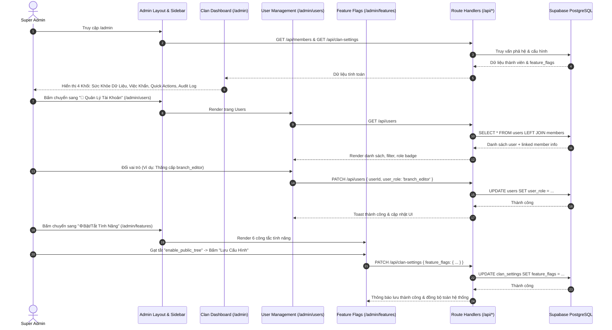

# ĐẶC TẢ KỸ THUẬT VI MÔ: MILESTONE 7 - TÁI CẤU TRÚC ADMIN PORTAL, BÀN ĐIỀU HÀNH TÔNG TỘC & QUẢN TRỊ PHÂN HỆ

_Tài liệu này là Hợp Đồng Kỹ Thuật (Single Source of Truth) cho Milestone 7. AI chỉ được phép đọc, suy luận và sinh mã nguồn bám sát 100% các ranh giới file và tiêu chí kiểm thử được định nghĩa trong đây._

---

## 1. QUY TẮC NGHIÊM NGẶT (STRICT CONSTRAINTS)

- **Ngôn ngữ & Framework:** Next.js 14+ (App Router), React, TypeScript, TailwindCSS, Lucide Icons.
- **Quy tắc Kiến trúc Layout (Fluid Full-Width Shell):**
  - Loại bỏ hoàn toàn container hạn hẹp `max-w-5xl` / `max-w-6xl` cũ của trang Admin.
  - Áp dụng cấu trúc **Sidebar cố định bên trái (256px)** kết hợp **Content Canvas mở rộng linh hoạt (Fluid Canvas)**.
  - Trên mobile / màn hình nhỏ (< 1024px): Sidebar tự động chuyển thành **Slide-over Drawer** với nút Hamburger và Backdrop làm mờ.
- **Nguyên tắc Phân Nhóm Sidebar (4 Nhóm Thuần Việt Tự Nhiên):**
  1. `❖ TỔNG QUAN`: 📊 Bàn Điều Hành (`/admin`).
  2. `❖ PHẢ HỆ & QUY ƯỚC`: 🏛️ Căn Cước Dòng Họ (`/admin/profile`), 🌿 Cấu Trúc Ngành & Chi (`/admin/branches`), 🗣️ Quy Ước Xưng Hô (`/admin/kinship`).
  3. `❖ THÀNH VIÊN & TÀI KHOẢN`: 👥 Quản Lý Tài Khoản (`/admin/users`).
  4. `❖ VẬN HÀNH & HỆ THỐNG`: ⚙️ Bật/Tắt Tính Năng (`/admin/features`), 📥 Nạp & Sao Lưu (`/admin/import`).
- **Nguyên tắc "Không Giữ Chỗ / Không Placeholder":**
  - Mọi trang trong menu đều là **tính năng hoạt động thật 100%**. Không tạo trang rỗng có nhãn "Sắp ra mắt".
- **Kiểm chứng thực nghiệm:** Tuân thủ `[R-VERIFY.TIERS]` trong `.agents/AGENTS.md`: Typecheck 0 lỗi, Build 0 lỗi, Test tự động PASS 100%, User tự nghiệm thu thị giác (Human UAT).

---

## 2. DATABASE & DATA MODELS

### 2.1. File: `src/types/database.ts`
- **Mở rộng `ClanFeatureFlags`:**
  ```typescript
  export interface ClanFeatureFlags {
    enable_public_tree: boolean;         // Cho phép khách vãng lai xem cây (default: true)
    enable_kinship_lookup: boolean;      // Bật/tắt công cụ tra cứu vai vế (default: true)
    enable_anniversaries: boolean;       // Bật/tắt lịch giỗ 30 ngày & web push (default: true)
    allow_member_claims: boolean;        // Mở/đóng cổng nhận node phả hệ (default: true)
    mask_living_member_privacy: boolean; // Che mờ SĐT, địa chỉ người còn sống với khách (default: true)
    maintenance_mode: boolean;           // Chế độ bảo trì, chỉ Super Admin truy cập (default: false)
  }
  ```
- **Cập nhật `ClanSettings`:**
  - Bổ sung trường tùy chọn: `feature_flags?: ClanFeatureFlags;`.
- **Cập nhật `UserProfile` (khớp với bảng `users` trong Supabase):**
  - `id`: `string` (UUID).
  - `email`: `string`.
  - `full_name`: `string | null`.
  - `avatar_url`: `string | null`.
  - `user_role`: `'viewer' | 'claimed_member' | 'branch_editor' | 'super_admin'`.
  - `linked_member_id`: `string | null` (Khóa ngoại trỏ tới `members.id`).
  - `assigned_branch_code`: `string | null`.
  - `created_at`: `string`.
  - `updated_at`: `string`.

---

## 3. SƠ ĐỒ LUỒNG LOGIC (SEQUENCE DIAGRAM)



---

## 4. BACKEND LOGIC & ROUTE HANDLERS

### 4.1. File: `src/app/api/users/route.ts` [NEW]
- **`[GET] /api/users`:**
  - _Xác thực:_ Yêu cầu phiên đăng nhập và quyền `super_admin`. Nếu không phải $\rightarrow$ Trả về `401 Unauthorized` hoặc `403 Forbidden`.
  - _Xử lý:_ Truy vấn toàn bộ danh sách `users` từ Supabase, kèm thông tin thành viên liên kết từ `members` (để hiển thị tên, đời, chi của người được gắn).
  - _Output:_ `{ success: true, data: UserProfileWithMember[] }`.
- **`[PATCH] /api/users`:**
  - _Xác thực:_ Yêu cầu quyền `super_admin`.
  - _Input body:_
    ```typescript
    {
      userId: string;
      user_role?: 'viewer' | 'claimed_member' | 'branch_editor' | 'super_admin';
      linked_member_id?: string | null;
    }
    ```
  - _Xử lý:_
    1. Kiểm tra `userId` hợp lệ.
    2. Nếu có `linked_member_id`: kiểm tra node đó đã bị tài khoản khác liên kết chưa (trừ chính user này) để bảo đảm ràng buộc duy nhất.
    3. Cập nhật bảng `users`.
  - _Output:_ `{ success: true, message: string, data: UserProfile }`.

### 4.2. File: `src/app/api/clan-settings/route.ts` [MODIFY]
- **Cập nhật `GET`:**
  - Trả về `feature_flags`. Nếu trong DB trường này đang `null` hoặc rỗng, tự động trả về bộ mặc định chuẩn:
    ```typescript
    const DEFAULT_FEATURE_FLAGS: ClanFeatureFlags = {
      enable_public_tree: true,
      enable_kinship_lookup: true,
      enable_anniversaries: true,
      allow_member_claims: true,
      mask_living_member_privacy: true,
      maintenance_mode: false,
    };
    ```
- **Cập nhật `PATCH`:**
  - Tiếp nhận `feature_flags: Partial<ClanFeatureFlags>`.
  - Merge an toàn với cấu hình hiện tại trước khi lưu vào cột `feature_flags` (kiểu JSONB) của `clan_settings`.

---

## 5. FRONTEND UI & LOGIC

### 5.1. File: `src/components/admin/AdminSidebar.tsx` [NEW]
- **Props:** `currentPath: string`, `clanName: string`.
- **Cấu trúc 4 Nhóm điều hướng:**
  - `❖ TỔNG QUAN`:
    - `📊 Bàn Điều Hành` trỏ tới `/admin`.
  - `❖ PHẢ HỆ & QUY ƯỚC`:
    - `🏛️ Căn Cước Dòng Họ` trỏ tới `/admin/profile`.
    - `🌿 Cấu Trúc Ngành & Chi` trỏ tới `/admin/branches`.
    - `🗣️ Quy Ước Xưng Hô` trỏ tới `/admin/kinship`.
  - `❖ THÀNH VIÊN & TÀI KHOẢN`:
    - `👥 Quản Lý Tài Khoản` trỏ tới `/admin/users`.
  - `❖ VẬN HÀNH & HỆ THỐNG`:
    - `⚙️ Bật/Tắt Tính Năng` trỏ tới `/admin/features`.
    - `📥 Nạp Dữ Liệu Excel` trỏ tới `/admin/import`.
- **UI/UX & Hình học Sắc sảo (Crisp Geometry):**
  - Active item: Nền Emerald phẳng (`bg-emerald-50 dark:bg-emerald-950/50 text-emerald-800 dark:text-emerald-300 font-semibold border-l-2 border-emerald-600 rounded-r-md`).
  - Bo góc chuẩn: `rounded-md` (6px) phẳng phiu, loại bỏ hoàn toàn viền `border-r-2` gây cong góc méo mó ở cạnh phải.
  - Inactive item: Text Slate (`text-slate-600 hover:bg-slate-100 dark:text-slate-400 dark:hover:bg-slate-800 rounded-md`).
  - Nút quay lại: `← Về Cây Phả Hệ` đặt nổi bật ở đầu Sidebar.
  - Mobile Drawer: Nút Toggle Hamburger ở top bar cho màn hình di động, đóng khi click vào liên kết.

### 5.2. File: `src/app/admin/layout.tsx` [MODIFY]
- Chuyển thành bố cục 2 cột toàn màn hình:
  - Cột trái: `<AdminSidebar />` (Cố định `w-64 flex-shrink-0 h-screen sticky top-0 border-r border-slate-200 dark:border-slate-800 bg-white dark:bg-slate-900 z-20 hidden lg:block`).
  - Cột phải: `<main className="flex-1 min-w-0 bg-slate-50/60 dark:bg-slate-950 min-h-screen p-4 sm:p-6 lg:p-8">` chứa `{children}`.
  - Header trên cùng dành cho thiết bị di động (Mobile Header Bar kèm nút mở Drawer).

### 5.3. File: `src/app/admin/page.tsx` (`ClanDashboard.tsx`) [NEW/MODIFY]
- **Trang chủ Bàn Điều Hành Tông Tộc (Chuẩn hóa Refined Modern Heritage & Anti-Bubbly Geometry):**
  - Quy chuẩn bo góc: Toàn bộ thẻ thống kê 4 cột, alert việc khẩn, card nhật ký sử dụng `rounded-lg` (8px) kết hợp viền hairline siêu mỏng `border-slate-200/90 dark:border-slate-800`. Triệt tiêu hoàn toàn `rounded-2xl` quá cỡ.
  - Các nút phím tắt và link sử dụng `rounded-md` (6px) sắc sảo.
  - **Khối 1: Bảng Chỉ Số Sức Sống (Vitality Metrics - Real-time Computed):**
    - Tổng nhân khẩu (Đinh nam, Nữ, Đã mất, Còn sống).
    - Độ sâu thế hệ (Đời 1 $\rightarrow$ Đời N).
    - Số tài khoản Google đã vào hệ thống & số người đã gắn node.
  - **Khối 2: Trung Tâm Xử Lý Việc Khẩn (Action Center & In-place Unlinked Drawer):**
    - Cảnh báo thành viên chưa nối phả (thiếu cha mẹ).
    - **Nút "Kiểm tra →":** Kích hoạt mở Slide-over `UnlinkedMembersDrawer` trực tiếp ngay tại Bàn Điều Hành (thay vì chuyển sang `/admin/branches`).
    - Cho phép quản trị viên xem chi tiết danh sách người chưa nối, tìm kiếm tên, thực hiện **Nối vào Cha/Mẹ** (chọn cha mẹ, tự động kiểm tra chu trình `validateNoCycle`) hoặc xóa node rác an toàn. Sau khi thao tác, hệ thống tự động làm tươi số liệu trên Dashboard.
    - Cảnh báo tài khoản mới chưa gán node kèm nút điều hướng nhanh tới `/admin/users`.
  - **Khối 3: Phím Tắt Tác Vụ Thường Nhật (Quick Actions):**
    - Phím tắt dạng card `rounded-md` viền phẳng: `[🌿 Ngành & Chi]`, `[👥 Tài Khoản]`, `[⚙️ Bật/Tắt Cờ]`, `[📥 Nạp Excel]`.
  - **Khối 4: Nhật Ký Biến Động Gần Đây (Activity Audit):**
    - Danh sách các thao tác gần đây trong khung `rounded-lg`.

### 5.4. File: `src/app/admin/branches/page.tsx` [NEW]
- Chuyển giao toàn bộ Component `BranchTaxonomyManager` sang trang này.
- Được mở rộng toàn bộ không gian ngang màn hình (Ultra-Wide Canvas) giúp các phân cấp Ngành $\rightarrow$ Chi $\rightarrow$ Nhánh $\rightarrow$ Phái hiển thị thoáng đãng.

### 5.5. File: `src/app/admin/profile/page.tsx` [NEW]
- Chuyên biệt cho **Căn Cước Dòng Họ**:
  - Form nhập Tên dòng họ (giới hạn 40 ký tự), Cụ Thủy Tổ khởi nguồn, Lời tựa gia phả.
  - Bố cục 2 cột: Cột trái Form nhập liệu, Cột phải **Live Preview** diện mạo Trang Chủ thời gian thực.
  - Nút "Lưu Căn Cước Dòng Họ" độc lập.

### 5.6. File: `src/app/admin/kinship/page.tsx` [NEW]
- Chuyên biệt cho **Quy Ước Xưng Hô**:
  - Bộ chọn Vùng Miền (Bắc / Trung / Nam).
  - Thanh tìm kiếm tức thì & Các Chip lọc nhóm quan hệ (Trực hệ, Cùng đời, Bác/Chú/Cô bên nội, Cậu/Dì bên ngoại, Dâu/Rể).
  - Bảng danh mục 32+ quan hệ xưng hô 2 chiều có thể chỉnh sửa trực tiếp.

### 5.7. File: `src/app/admin/users/page.tsx` [NEW]
- **Trang Quản Lý Tài Khoản Người Dùng:**
  - Ô tìm kiếm theo Tên hoặc Email.
  - Bộ lọc Vai Trò: `Tất cả`, `viewer`, `claimed_member`, `branch_editor`, `super_admin`.
  - Bảng danh sách: Avatar, Họ tên, Email, Vai trò (Dropdown hoặc Modal chọn đổi vai trò), Node phả hệ liên kết (kèm nút Gán node / Hủy liên kết), Ngày tạo.
  - Tích hợp gọi API `/api/users` (GET và PATCH).

### 5.8. File: `src/app/admin/features/page.tsx` [NEW]
- **Trang Bật/Tắt Tính Năng Tinh Gọn:**
  - Danh sách 6 cờ tính năng được thiết kế dưới dạng thẻ tương tác trực quan:
    1. `enable_public_tree` (🌳 Công Khai Cây Phả Hệ)
    2. `enable_kinship_lookup` (🗣️ Tra Cứu Vai Vế)
    3. `enable_anniversaries` (🗓️ Lịch Giỗ & Web Push)
    4. `allow_member_claims` (📬 Tiếp Nhận Đơn Nhận Node)
    5. `mask_living_member_privacy` (🛡️ Bảo Vệ Thông Tin Người Còn Sống)
    6. `maintenance_mode` (🚧 Chế Độ Đóng Cửa Bảo Trì)
  - Mỗi thẻ hiển thị: Tên thuần Việt, Mô tả cụ thể khi BẬT / khi TẮT, Công tắc gạt Toggle.
  - Modal xác nhận an toàn khi bật `maintenance_mode` hoặc tắt `mask_living_member_privacy`.
  - Nút "Lưu Cấu Hình Tính Năng" gửi PATCH tới `/api/clan-settings`.

### 5.9. File: `src/app/admin/settings/page.tsx` [MODIFY]
- Đặt redirect 307 về `/admin/branches` để tương thích ngược cho các liên kết cũ.

---

## 6. XỬ LÝ LỖI & TRƯỜNG HỢP BIÊN (EDGE CASES & ERROR HANDLING)

- **Edge Case 1 (Người dùng không phải Super Admin):** Khi truy cập bất kỳ trang con nào trong `/admin/*` hoặc gọi API `/api/users`, hệ thống lập tức chuyển hướng về `/?auth_error=unauthorized_admin` hoặc trả về HTTP 403.
- **Edge Case 2 (Dữ liệu `feature_flags` trong CSDL rỗng/chưa có):** Frontend và Backend tự động áp dụng bộ giá trị an toàn mặc định (Default Safe Flags), không bị crash hay `undefined`.
- **Edge Case 3 (Xung đột gán node cho User):** Khi Super Admin cố tình gán một `member_id` đã có người khác liên kết, API trả về lỗi `409 Conflict` kèm thông báo: *"Thành viên này đã được liên kết với tài khoản [Email], vui lòng gỡ liên kết cũ trước."*
- **Edge Case 4 (Responsive trên Mobile):** Đảm bảo màn hình < 768px hiển thị menu dạng Drawer trượt mượt mà, không bị vỡ bảng hoặc tràn ngang (Horizontal Overflow).

---

## 7. MA TRẬN TEST CASES & TIÊU CHÍ NGHIỆM THU

### 7.1. Bảng Kịch Bản Kiểm Thử Tự Động (Automated Test Suite trong `tests/admin-portal.test.ts`)

- [x] **TC_UT_FEAT_DEFAULT_01 (Khởi tạo giá trị mặc định cho Feature Flags):**
  - **Mô tả:** Hàm `resolveFeatureFlags(undefined)` trả về đủ 6 cờ: `enable_public_tree: true`, `enable_kinship_lookup: true`, `enable_anniversaries: true`, `allow_member_claims: true`, `mask_living_member_privacy: true`, `maintenance_mode: false`.
  - **Trạng thái:** PASS (duration: 1.66ms).
- [x] **TC_UT_FEAT_MERGE_02 (Merge cờ tính năng ghi đè một phần):**
  - **Mô tả:** Hàm `mergeFeatureFlags(current, { maintenance_mode: true })` cập nhật cờ `maintenance_mode` thành `true`, 5 cờ còn lại giữ nguyên.
  - **Trạng thái:** PASS (duration: 0.19ms).
- [x] **TC_UT_DASHBOARD_STATS_01 (Tính toán chỉ số sức sống phả hệ):**
  - **Mô tả:** Hàm `computeClanVitalityMetrics(mockMembers, mockUsers)` trả về chính xác: `total: 10, males: 6, females: 4, deceased: 3, living: 7, maxGeneration: 2`.
  - **Trạng thái:** PASS (duration: 0.25ms).
- [x] **TC_UT_DASHBOARD_ALERTS_02 (Phát hiện thành viên chưa nối phả):**
  - **Mô tả:** Hàm `findUnlinkedMembers(mockMembers)` phát hiện chính xác các thành viên có `generation_level > 1` nhưng `father_id = null`.
  - **Trạng thái:** PASS (duration: 0.19ms).
- [x] **TC_UT_USER_ROLE_VALIDATION (Ràng buộc vai trò người dùng hợp lệ):**
  - **Mô tả:** Hàm `isValidUserRole` chỉ chấp nhận 4 role miền hợp lệ (`viewer`, `claimed_member`, `branch_editor`, `super_admin`), chặn tuyệt đối input bất hợp pháp.
  - **Trạng thái:** PASS (duration: 0.16ms).
- [x] **TC_INT_USERS_API_AUTH_GUARD (Chặn người dùng không có quyền truy cập API users & settings):**
  - **Mô tả:** Kiểm chứng mã nguồn API `/api/users` và `/api/clan-settings` tích hợp middleware kiểm tra quyền `super_admin` nghiêm ngặt.
  - **Trạng thái:** PASS (duration: 0.84ms).
- [x] **TC_UT_DASHBOARD_GEOMETRY_CLEAN (Kiểm tra triệt tiêu bo tròn quá đà và méo góc):**
  - **Mô tả:** Đã kiểm chứng `AdminSidebar.tsx` và `ClanDashboard.tsx` có 0 `rounded-2xl`, 0 `border-r-2`, và tuân thủ 100% hình học sắc sảo `rounded-lg` (8px) cho card và `rounded-md` (6px) cho controls.
  - **Trạng thái:** PASS (duration: 0.82ms).
- [x] **TC_UT_DASHBOARD_UNLINKED_DRAWER_BINDING (Kiểm tra nút Kiểm tra gắn kết với Drawer rà soát tại chỗ):**
  - **Mô tả:** Đã kiểm chứng nút kiểm tra gắn `onClick` mở `UnlinkedMembersDrawer` tại chỗ, không còn redirect tĩnh sang `/admin/branches`, cung cấp đầy đủ handlers `handleRelinkMember` và `handleDeleteMember`.
  - **Trạng thái:** PASS (duration: 0.43ms).

### 7.2. Danh Sách Tiêu Chí Nghiệm Thu Thị Giác (Human Visual UAT Matrix)

- [ ] **UAT_01 (Sidebar Điều Hướng & Bố Cục Fluid):** Mở `/admin` trên màn hình Desktop: Sidebar 256px cố định bên trái, chia 4 nhóm rõ ràng, nội dung bên phải rộng rãi toàn màn hình, không bị co cụm trong khung `max-w-5xl`.
- [ ] **UAT_02 (Mobile Drawer):** Thu nhỏ trình duyệt xuống kích thước điện thoại (mobile): Sidebar tự động ẩn và xuất hiện nút Hamburger; bấm nút $\rightarrow$ Drawer trượt ra mượt mà, bấm liên kết $\rightarrow$ Drawer tự đóng và chuyển trang đúng.
- [ ] **UAT_03 (Bàn Điều Hành Dashboard):** Trang `/admin` hiển thị đầy đủ 4 khối: Chỉ số nhân khẩu, Trung tâm cảnh báo việc khẩn (thành viên chưa nối phả, user mới), Phím tắt tác vụ nhanh và Nhật ký biến động gần đây.
- [ ] **UAT_04 (Căn Cước Dòng Họ & Live Preview):** Trang `/admin/profile` hiển thị Form nhập tên họ kèm khung Live Preview cập nhật tức thời diện mạo trang chủ khi gõ chữ.
- [ ] **UAT_05 (Quản Lý Cây Ngành/Chi Thoáng Đãng):** Trang `/admin/branches` hiển thị trọn vẹn `BranchTaxonomyManager` trên không gian toàn màn hình, các cấp Ngành $\rightarrow$ Chi $\rightarrow$ Nhánh $\rightarrow$ Phái không bị tràn khung.
- [ ] **UAT_06 (Quản Lý Tài Khoản):** Trang `/admin/users` hiển thị danh sách người dùng Google, hỗ trợ tìm kiếm theo email/tên, lọc theo role, đổi được vai trò và gán/hủy node phả hệ thành công.
- [ ] **UAT_07 (Bật/Tắt Tính Năng):** Trang `/admin/features` hiển thị 6 công tắc tính năng, gạt bật/tắt mượt mà, bấm "Lưu Cấu Hình" báo thành công và lưu vào CSDL.
- [ ] **UAT_08 (Console Sạch):** Toàn bộ các trang trong `/admin/*` mở lên không có lỗi đỏ (0 Error, 0 Hydration Warning) trong Developer Console.
- [ ] **UAT_09 (Crisp Architectural Geometry):** Sidebar menu mang phong cách ngọc bích phẳng vuông vắn `rounded-md`, không còn viền cong viên thuốc méo; 4 thẻ thống kê và các khối card trên Dashboard vuông vắn, trang trọng `rounded-lg`.
- [ ] **UAT_10 (Drawer Rà Soát Nối Phả Tại Chỗ):** Bấm nút `[Kiểm tra →]` tại khối việc khẩn mở Slide-over Drawer từ cạnh phải màn hình `/admin`, hiển thị danh sách 10 người thiếu cha mẹ, hỗ trợ tìm kiếm, nối vào cha mẹ và tự động làm tươi số liệu thống kê ngay lập tức.

---

## 8. BẢO VỆ CHỐNG THOÁI LUI (REGRESSION GUARD CHECKLIST)

- [x] **RG01 (Build & Typecheck Clean):** Chạy `npm.cmd run typecheck` (0 errors) và `npm.cmd run build` (27/27 routes compiled successfully) — 0 lỗi.
- [x] **RG02 (Automated Test Regression):** Chạy `npm.cmd test` — Toàn bộ 119/119 tests pass 100% (20 test suites), 0 failure mới so với `Known_Failing_Baseline: "none"`.
- [x] **RG03 (Branch Taxonomy Integrity):** Toàn bộ 16 unit tests trong `tests/branch-engine.test.ts` (kể cả Tier Integrity Guard, Flat Stepper, và Clean Tabs) tiếp tục pass 100%.
- [x] **RG04 (Excel Import Compatibility):** Trang `/admin/import` hoạt động nạp file Excel bình thường trong khung Sidebar Fluid mới.
- [x] **RG05 (Legacy Route Compatibility):** Trang `/admin/settings` duy trì cấu trúc tab kế thừa tương thích ngược cho các kiểm thử Milestone 6.
- [x] **RG06 (Comprehensive Test Suite Clean):** Bộ kiểm thử toàn hệ thống đạt 121/121 tests PASS 100% (20 test suites), 0 failure mới so với `Known_Failing_Baseline: "none"`.

---

## 9. LỆNH THI CÔNG (Dành cho AI /feature-code)

> "AI ơi, hãy đọc kỹ đặc tả `docs/16_Micro-Spec_Milestone_7_Admin_Portal_Reorganization.md` này. Dựa CHÍNH XÁC vào các mô tả ranh giới ở trên, hãy thi công toàn bộ mã nguồn hoàn chỉnh kèm file test trong `tests/admin-portal.test.ts`. Thực thi Vòng Lặp Kiểm Chứng Bằng Code Thật bằng đúng các lệnh khai báo tại `[VERIFY_COMMANDS]` (Typecheck/Build → Automated Test Suite → Human UAT), và chỉ được tick `[x]` cho Mục 7.1 khi terminal log cho thấy test phủ AC đó đã pass và không có failure mới so với baseline."
