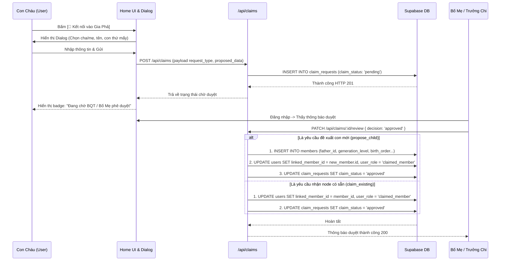
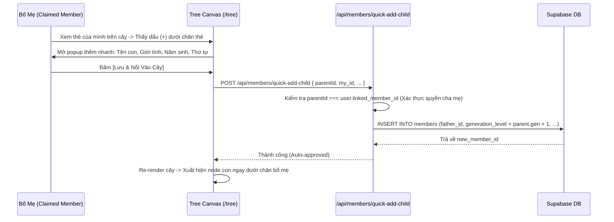

# ĐẶC TẢ KỸ THUẬT VI MÔ: MILESTONE 8 - NỐI PHẢ ĐA TẦNG, TỰ NHẬN HỒ SƠ & PHÊ DUYỆT PHÂN TÁN THEO HUYẾT THỐNG

_Tài liệu này là Hợp Đồng Kỹ Thuật (Single Source of Truth) cho Milestone 8. AI chỉ được phép đọc, suy luận và sinh mã nguồn bám sát 100% các ranh giới file và tiêu chí kiểm thử được định nghĩa trong đây._

---

## 1. QUY TẮC NGHIÊM NGẶT (STRICT CONSTRAINTS)

- **Ngôn ngữ & Framework:** Next.js 14+ (App Router), React, TypeScript, TailwindCSS, Lucide Icons, Supabase Client.
- **Ràng buộc Kiến trúc Nghiệp vụ Gia Phả:**
  - **Mô Hình Phân Quyền Quản Trị & Phê Duyệt 3 Tầng (3-Tier Governance Hierarchy):**
    1. **Tầng 1 — Quản Trị Tối Cao (`super_admin`):** Toàn quyền toàn phả, xem và duyệt mọi phiếu, có quyền gán (assign) các phiếu "Tìm Cội Nguồn" cho Trưởng Chi xác minh.
    2. **Tầng 2 — Trưởng Chi / Thư Ký Chi (`branch_editor`):** Phụ trách toàn bộ cây con thuộc Chi của mình (`assigned_branch_code`) bất kể người đó thuộc đời nào. Có cổng quản trị riêng biệt tại `/branch`. Duyệt các hồ sơ con cháu thuộc Chi hoặc phiếu được Super Admin giao.
    3. **Tầng 3 — Chủ Hộ / Bố Mẹ (`claimed_member`):** 
       - Phụ trách tiểu gia đình trực hệ của mình (Bản thân, Vợ/Chồng, Con đẻ).
       - Có nút `(+)` trực tiếp dưới chân thẻ của mình trên Cây Phả Hệ (`/tree`) để thêm con đẻ/hôn phối (Auto-approved).
       - Trong Drawer chi tiết (`MemberDetailDrawer`): Cho phép bật nút `[Chỉnh sửa]` và `[+ Thêm Con]` đối với bản thân, vợ/chồng, và con đẻ của mình; các thành viên khác ngoài phạm vi này giữ nguyên chế độ Chỉ Xem (Read-only).
       - Nhận và phê duyệt tài khoản của con cái khi con gửi yêu cầu claim node.
  - **Điểm Chạm Nhận Diện Tại Màn Hình Home (`src/app/page.tsx`):**
    - Thay thế box lời chào tĩnh bằng **Khung Nhận Diện Tông Tộc (Identity & Context Hub)**.
    - Với thành viên đã gắn node: Hiển thị Đời, Chi/Ngành, nút xem vị trí trên Cây (`/tree?focus={id}`) và Quick Branch Selector.
    - Với người dùng đang có phiếu chờ duyệt: Hiển thị badge trạng thái màu amber kèm nút xem/hủy yêu cầu.
    - Với khách / thành viên chưa gắn node: Hiển thị nút kêu gọi nổi bật **`[ 🔗 Kết nối vào Gia Phả ]`**.
  - **Quy Trình Kết Nối Gia Phả 2 Tab Tinh Gọn (Connect Genealogy Dialog):**
    - **Tab 1: "Tôi đã có tên trên cây" (2 Chạm):** Tìm tên mình (kèm ngữ cảnh Cha/Mẹ & Chi để không nhầm người trùng tên) $\rightarrow$ Gửi yêu cầu nhận node có sẵn.
    - **Tab 2: "Tôi chưa có trên cây (Bổ sung mới)" (3 Bước):**
      + Nhập: Họ tên (tự điền từ Google), Giới tính, Năm sinh (tùy chọn).
      + Chọn Cha/Mẹ trên cây $\rightarrow$ Hệ thống tự động tính thế hệ (`generation_level = parent.gen + 1`) và tự động gán Chi/Ngành (`focusedBranchId`).
      + Chọn Thứ tự sinh (`birth_order`): Tự động hiển thị danh sách anh chị em hiện có và **chọn sẵn số con tiếp theo**.
      + Tùy chọn *"Chưa rõ Cha/Mẹ trên cây"*: Cho phép điền text tự do thông tin cha mẹ/ông bà ngoài đời $\rightarrow$ Tạo **Phiếu Tìm Cội Nguồn** (Lưu trong `claim_requests`, tuyệt đối không tạo node rác vào bảng `members`).
  - **Tách Biệt Hoàn Toàn Cổng Quản Trị Chi Nhánh (`/branch`):**
    - Trưởng Chi truy cập qua nút **`[ 🌿 Quản Trị Chi Nhánh ]`** trên Navbar.
    - Giao diện độc lập hoàn toàn với `/admin`, không sợ chồng chéo hay ảnh hưởng tới các cấu hình hệ thống tối cao.
  - **Kiểm Chứng Thực Nghiệm Bằng Code Thật (`[R-VERIFY]`):**
    - Tuân thủ nghiêm ngặt: Typecheck 0 lỗi, Build 0 lỗi, Test tự động PASS 100%, User tự nghiệm thu thị giác (Human UAT).

---

## 1.1. PHÂN KỲ TRIỂN KHAI 3 GIAI ĐOẠN (PHASED ROADMAP & CHECKLIST)

Để đảm bảo tính liên tục của bộ nhớ hệ thống (Memory Persistence) qua nhiều phiên làm việc, tiến độ Milestone 8 được chia làm 3 chặng độc lập:

### 🌟 Giai Đoạn 1 (Phase 1): Điểm Chạm Home Onboarding & Hạ Tầng Gửi Hồ Sơ
- [ ] **Phase 1.1 (Data & Types):** Mở rộng migration CSDL `claim_requests` và cập nhật TypeScript types trong `src/types/database.ts`.
- [ ] **Phase 1.2 (Claim Logic Engine):** Xây dựng `src/lib/claims/claim-engine.ts` (validate, deduce branch focus, format context card).
- [ ] **Phase 1.3 (Backend APIs):** Viết `POST /api/claims` và `GET /api/claims/my-requests`.
- [ ] **Phase 1.4 (Home UI):** Xây dựng `IdentityContextWidget.tsx` (Khung nhận diện tông tộc tại Home) và `ConnectGenealogyModal.tsx` (Dialog kết nối gia phả 2 tab).
- [ ] **Phase 1.5 (Test & Verify Phase 1):** Phủ các test cases `TC_UT_CLAIM_AUTO_DEDUCE_BRANCH`, `TC_UT_CLAIM_PROPOSE_CHILD_VALIDATION`, `TC_UT_CLAIM_PREVENT_ORPHAN_IN_DB`, `TC_UT_SEARCH_MEMBER_CONTEXT_CARD`. Typecheck và Build sạch. Nghiệm thu thị giác Home Onboarding.

### 🌟 Giai Đoạn 2 (Phase 2): Dấu (+) Thêm Con Trên Cây & Quyền Chủ Hộ (`claimed_member`)
- [ ] **Phase 2.1 (Backend Quick Add):** Viết API `POST /api/members/quick-add-child` (Auto-approved khi `parentId === my_linked_id`).
- [ ] **Phase 2.2 (Canvas Direct Add):** Thêm nút tròn ngọc bích `(+)` dưới chân node thẻ cá nhân của mình & vợ/chồng trên `FamilyTreeCanvas.tsx`.
- [ ] **Phase 2.3 (Drawer Scoped Permissions):** Mở khóa `[Chỉnh sửa]` và `[+ Thêm Con]` trong `MemberDetailDrawer.tsx` cho tiểu gia đình (Bản thân, Vợ/Chồng, Con đẻ).
- [ ] **Phase 2.4 (Test & Verify Phase 2):** Phủ test `TC_UT_CLAIM_CAN_MANAGE_PARENT`, `TC_UT_CLAIM_AUTO_APPROVE_PARENT_ADD`. Nghiệm thu thị giác nút `(+)` trên cây.

### 🌟 Giai Đoạn 3 (Phase 3): Phê Duyệt Phân Tán (3 Tầng), Cơ Chế Assign & Cổng Quản Trị Chi `/branch`
- [ ] **Phase 3.1 (Review APIs):** Viết `GET /api/claims/pending` và `PATCH /api/claims/[id]/review` (xử lý duyệt 3 tầng: Bố mẹ / Trưởng Chi / Super Admin).
- [ ] **Phase 3.2 (Family Approval UI):** Thông báo duyệt hồ sơ con cái tại Lời chào Home & Chuông thông báo cho Bố Mẹ.
- [ ] **Phase 3.3 (Branch Portal):** Xây dựng Cổng Quản Trị Chi Nhánh `src/app/branch/page.tsx` dành cho `branch_editor`.
- [ ] **Phase 3.4 (Super Admin Assign):** Bổ sung nút ủy quyền `[ ↗️ Giao cho Trưởng Chi ]` và nâng cấp modal gán node tại `/admin/users`.
- [ ] **Phase 3.5 (Test & Full Verification):** Phủ toàn bộ test còn lại (`TC_UT_CLAIM_CAN_MANAGE_BRANCH`, `TC_UT_CLAIM_ASSIGN_TO_BRANCH_EDITOR`, `TC_INT_CLAIMS_API_AUTH_GUARD`), kiểm tra Regression Guards (`RG01`..`RG03`). Nghiệm thu toàn trình.

---

## 2. DATABASE & DATA MODELS

### 2.1. Cập Nhật Bảng: `public.claim_requests`
Bổ sung các trường hỗ trợ phân loại phiếu, lưu thông tin đề xuất và cơ chế ủy quyền (assign):

```sql
-- Migration bổ sung các cột mới cho claim_requests
ALTER TABLE public.claim_requests
  ALTER COLUMN member_id DROP NOT NULL; -- Cho phép null khi là yêu cầu propose_child hoặc find_origin

ALTER TABLE public.claim_requests
  ADD COLUMN IF NOT EXISTS request_type VARCHAR(20) NOT NULL DEFAULT 'claim_existing'
    CHECK (request_type IN ('claim_existing', 'propose_child', 'find_origin')),
  ADD COLUMN IF NOT EXISTS proposed_data JSONB,
  ADD COLUMN IF NOT EXISTS assigned_to UUID REFERENCES public.users(id) ON DELETE SET NULL,
  ADD COLUMN IF NOT EXISTS target_branch_code VARCHAR(50);
```

### 2.2. Interface TypeScript: `src/types/database.ts`

```typescript
export type ClaimRequestType = 'claim_existing' | 'propose_child' | 'find_origin';
export type ClaimStatus = 'pending' | 'approved' | 'rejected';

export interface ProposedChildData {
  full_name: string;
  gender: 'male' | 'female';
  birth_year?: number | null;
  birth_order?: number | null;
  parent_id?: string | null;       // ID thành viên cha hoặc mẹ trên cây
  parent_relation?: 'father' | 'mother';
  raw_parent_info?: string | null; // Ghi chú cha/mẹ ngoài đời khi chưa có trên cây
  raw_ancestor_info?: string | null; // Ghi chú ông/bà/nhánh nghi vấn
  notes?: string | null;
}

export interface ClaimRequestRow {
  id: string;
  user_id: string;
  member_id: string | null;
  request_type: ClaimRequestType;
  claim_status: ClaimStatus;
  proposed_data: ProposedChildData | null;
  verification_notes: string | null;
  assigned_to: string | null;       // User ID của Trưởng Chi được giao duyệt
  target_branch_code: string | null;
  reviewed_by: string | null;
  rejection_reason: string | null;
  created_at: string;
  updated_at: string;
}
```

---

## 3. SƠ ĐỒ LUỒNG LOGIC (SEQUENCE DIAGRAM - MERMAID)

### 3.1. Luồng Con Cháu Gửi Yêu Cầu & Bố Mẹ / Trưởng Chi Duyệt



### 3.2. Luồng Bố Mẹ Bấm Dấu `(+)` Thêm Con Trực Tiếp Trên Cây (Auto-Approved)



---

## 4. BACKEND LOGIC & API SPECIFICATION

### 4.1. `POST /api/claims` (Gửi Yêu Cầu Liên Kết / Bổ Sung)
- **Tập tin:** `src/app/api/claims/route.ts`
- **Quyền hạn:** Mọi người dùng đã đăng nhập (Google Auth).
- **Body Input:**
  ```typescript
  {
    request_type: 'claim_existing' | 'propose_child' | 'find_origin';
    member_id?: string;             // Dành cho claim_existing
    proposed_data?: ProposedChildData; // Dành cho propose_child hoặc find_origin
    verification_notes?: string;
  }
  ```
- **Xử lý:**
  1. Lấy `userId` từ Supabase auth session.
  2. Kiểm tra xem user này đã có phiếu nào ở trạng thái `pending` chưa $\rightarrow$ Nếu có: Trả về lỗi 400 *"Bạn đang có một yêu cầu chờ duyệt, vui lòng chờ xử lý"*.
  3. Nếu là `claim_existing`: Kiểm tra `member_id` có bị user khác link chưa $\rightarrow$ Nếu đã link: Báo lỗi 400 *"Thành viên này đã được liên kết với tài khoản khác"*.
  4. Nếu là `propose_child`: Kiểm tra `parent_id` hợp lệ. Tự động truy vấn Chi của `parent_id` để điền `target_branch_code`.
  5. INSERT vào `claim_requests`.
  6. Trả về HTTP 201 `{ success: true, data: claimRequest }`.

### 4.2. `GET /api/claims/pending` (Lấy Danh Sách Phiếu Cần Duyệt Theo Phân Quyền)
- **Tập tin:** `src/app/api/claims/pending/route.ts`
- **Xử lý:**
  - Nếu `super_admin`: Lấy toàn bộ phiếu có `claim_status = 'pending'`.
  - Nếu `branch_editor`: Lấy các phiếu có `target_branch_code === user.assigned_branch_code` HOẶC `assigned_to === user.id`.
  - Nếu `claimed_member` (Bố Mẹ): Lấy các phiếu có `proposed_data->>'parent_id' === user.linked_member_id` HOẶC yêu cầu claim chính con đẻ của mình.
  - Trả về mảng phiếu enriched với thông tin user gửi và thông tin cha mẹ/thành viên liên quan.

### 4.3. `PATCH /api/claims/[id]/review` (Phê Duyệt / Từ Chối / Giao Việc)
- **Tập tin:** `src/app/api/claims/[id]/review/route.ts`
- **Body Input:**
  ```typescript
  {
    decision: 'approved' | 'rejected' | 'assign';
    assigned_to?: string;        // Khi decision === 'assign'
    rejection_reason?: string;   // Khi decision === 'rejected'
  }
  ```
- **Xử lý:**
  1. Xác thực quyền duyệt: Người gọi phải là Super Admin, Trưởng Chi phụ trách, hoặc Bố Mẹ của node đích.
  2. Nếu `decision === 'assign'`: Cập nhật `assigned_to = body.assigned_to`.
  3. Nếu `decision === 'rejected'`: Cập nhật `claim_status = 'rejected'`, `rejection_reason = body.rejection_reason`, `reviewed_by = user.id`.
  4. Nếu `decision === 'approved'`:
     - Nếu `request_type === 'claim_existing'`:
       + Cập nhật `users.linked_member_id = claim.member_id`, `user_role = 'claimed_member'`.
     - Nếu `request_type === 'propose_child'`:
       + Tạo bản ghi mới trong `members`.
       + Cập nhật `users.linked_member_id = newMember.id`, `user_role = 'claimed_member'`.
     - Đánh dấu `claim_status = 'approved'`, `reviewed_by = user.id`.
  5. Trả về HTTP 200 `{ success: true, message: 'Xử lý yêu cầu thành công' }`.

### 4.4. `POST /api/members/quick-add-child` (Thêm Con Đẻ Trực Tiếp Trên Cây - Auto-Approved)
- **Tập tin:** `src/app/api/members/quick-add-child/route.ts`
- **Xử lý:**
  1. Lấy thông tin user hiện tại (`user.linked_member_id`).
  2. Xác thực: `parentId` gửi lên bắt buộc phải là `user.linked_member_id` (hoặc vợ/chồng của user).
  3. Tính `generation_level = parent.generation_level + 1`.
  4. INSERT vào `members` với `father_id` (hoặc `mother_id`), `birth_order`, `full_name`, `gender`, `birth_year`.
  5. Trả về HTTP 201 kèm bản ghi member mới tạo.

---

## 5. FRONTEND UI & COMPONENTS SPECIFICATION

### 5.1. Khung Nhận Diện Tông Tộc Tại Màn Hình Home: `src/components/home/IdentityContextWidget.tsx`
- Vị trí: Đặt tại `src/app/page.tsx`, ngay dưới tiêu đề dòng họ.
- **Trạng thái 1: Thành viên đã gắn node:**
  - Avatar, Tên thành viên trong phả hệ.
  - Huy hiệu danh xưng: `[ 🌿 Đời {X} · {Tên Chi/Ngành} ]`.
  - Nút **`[ 👁️ Xem trên Cây ]`** trỏ tới `/tree?focus={linked_member_id}`.
  - Dropdown Quick Branch Selector: Cho phép đổi nhanh nhánh xem mà không cần mở Modal Settings.
- **Trạng thái 2: Đang có phiếu chờ duyệt:**
  - Badge màu hổ phách: `[ ⏳ Đang chờ BQT/Bố Mẹ duyệt: {Tên hồ sơ} ]`.
  - Nút hủy yêu cầu (nếu gửi nhầm).
- **Trạng thái 3: Khách / Chưa gắn node:**
  - Nút nổi bật: **`[ 🔗 Kết nối vào Gia Phả ]`** với hiệu ứng hover ngọc bích sang trọng, thu hút con cháu bấm vào.

### 5.2. Dialog Kết Nối Gia Phả: `src/components/modals/ConnectGenealogyModal.tsx`
- Thiết kế 2 Tab phẳng, hỗ trợ phím `Escape` và Portal gắn vào `document.body`:
  - **Tab 1: "Tôi đã có tên trên cây"**:
    - Ô tìm kiếm tên mình.
    - Danh sách kết quả hiển thị dạng **Thẻ Ngữ Cảnh 3 Thế Hệ**: Tên, Đời, Chi, Cha Mẹ (`Con cụ X & bà Y`).
    - Nút 1-chạm: `[ Chính là tôi ]` $\rightarrow$ Gửi yêu cầu.
  - **Tab 2: "Tôi chưa có trên cây (Bổ sung mới)"**:
    - Họ tên (tự điền từ Google), Giới tính (Pills Nam/Nữ), Năm sinh.
    - Ô tìm kiếm Cha/Mẹ trên cây. Khi chọn Cha/Mẹ:
      + Tự động hiển thị danh sách anh chị em hiện có.
      + Dải nút chọn thứ tự sinh (`birth_order`) với **số con tiếp theo được chọn sẵn**.
    - Tùy chọn *"Chưa rõ Cha/Mẹ trên cây"*: Hiện ô nhập text tự do cha mẹ/ông bà ngoài đời để gửi Phiếu Tìm Cội Nguồn.

### 5.3. Dấu `(+)` Thêm Con Trực Tiếp Trên Canvas Cây: `src/components/tree/FamilyTreeCanvas.tsx`
- Kiểm tra điều kiện: Nếu node hiển thị trên cây có `node.id === userProfile.linked_member_id` (hoặc là spouse của user):
  - Hiển thị một nút tròn nhỏ **`[ + ]`** kích thước 24x24px, màu xanh ngọc bích `bg-emerald-600 text-white rounded-full shadow-md` ngay dưới chân thẻ node.
  - Khi click vào: Mở form popup mini thêm nhanh con đẻ.

### 5.4. Cổng Quản Trị Chi Nhánh: `src/app/branch/page.tsx`
- Dành riêng cho `branch_editor`:
  - Header: Hiển thị tên Chi được giao phụ trách (ví dụ: *"Cổng Quản Trị: Chi 2 - Ngành 1"*).
  - Tab 1: **"Hàng Đợi Duyệt Con Cháu"**: Danh sách các phiếu claim thuộc chi mình, nút 1-click `[ Phê duyệt ]` hoặc `[ Từ chối ]`.
  - Tab 2: **"Thành Viên Trong Chi"**: Bảng danh sách con cháu thuộc Chi, có bộ lọc theo đời và công cụ sửa nhanh thông tin.

---

## 6. XỬ LÝ LỖI & CÁC TRƯỜNG HỢP BIÊN (EDGE CASES)

- **Edge Case 1 (Trùng người nhận node):** Node A đã được liên kết với User X, nếu User Y tiếp tục gửi claim node A $\rightarrow$ Hệ thống lập tức chặn từ frontend (thẻ bị disabled) và chặn ở Backend API với lỗi HTTP 400.
- **Edge Case 2 (Spam gửi yêu cầu):** Một tài khoản chỉ được phép có tối đa 1 phiếu ở trạng thái `pending`. Không cho phép gửi dồn dập nhiều phiếu.
- **Edge Case 3 (Bố Mẹ tự thêm con trùng thứ tự sinh `birth_order`):** Nếu bố mẹ chọn số con đã có người nhận, hệ thống tự động chèn người mới vào và dịch chuyển các con sinh sau tăng `birth_order` lên 1 nấc (sử dụng logic giống `api/members/reorder`).
- **Edge Case 4 (Phiếu Tìm Cội Nguồn không có cha mẹ trên cây):** Tuyệt đối KHÔNG INSERT vào bảng `members`. Chỉ lưu payload văn bản trong `claim_requests.proposed_data` cho đến khi Super Admin hoặc Trưởng Chi ghép nối thành công.
- **Edge Case 5 (Trưởng Chi đời thấp quản lý cả chi lớn):** Rào chắn API kiểm tra phạm vi cây con phụ hệ theo `assigned_branch_code`, không kiểm tra `generation_level`. Đảm bảo người đời thấp vẫn sửa và duyệt được toàn bộ con cháu trong Chi được giao.

---

## 7. MA TRẬN TEST CASES & TIÊU CHÍ NGHIỆM THU (TEST SPECIFICATION)

### 7.1. Bảng Kịch Bản Kiểm Thử Tự Động (Automated Test Suite trong `tests/decentralized-claim.test.ts`)

| ID | Tên Kịch Bản | File Test Dự Kiến | Tiền điều kiện (Given) | Thao tác kích hoạt (When) | Kết quả kỳ vọng (Then) | Phân loại | Trạng thái |
|---|---|---|---|---|---|---|---|
| **TC_UT_CLAIM_CAN_MANAGE_PARENT** | Bố mẹ có quyền quản lý và thêm con trực hệ của mình | `tests/decentralized-claim.test.ts` | User gắn với node cha A; node con B có `father_id = A` | Gọi hàm `canUserManageMember(user, B.id)` | Trả về `true`; thử với node họ hàng C trả về `false` | Unit Logic | - [ ] PENDING |
| **TC_UT_CLAIM_CAN_MANAGE_BRANCH** | Trưởng Chi quản lý toàn bộ con cháu trong chi bất kể đời | `tests/decentralized-claim.test.ts` | User là `branch_editor` Chi 2 (Đời 7); Cụ X thuộc Chi 2 (Đời 4) | Gọi hàm `canUserManageMember(user, X.id)` | Trả về `true`; thử với Cụ Y thuộc Chi 1 trả về `false` | Security RBAC | - [ ] PENDING |
| **TC_UT_CLAIM_AUTO_APPROVE_PARENT_ADD** | Bố mẹ thêm con đẻ trực tiếp được duyệt tự động | `tests/decentralized-claim.test.ts` | Bố mẹ gọi API quick-add-child với `parentId = my_linked_id` | Gọi hàm xử lý thêm con đẻ | Bản ghi mới tạo có `father_id = my_id`, `generation_level = parent.gen + 1` | Logic Data | - [ ] PENDING |
| **TC_UT_CLAIM_AUTO_DEDUCE_BRANCH** | Tự động khởi tạo Chi Nhánh khi user được gắn node | `tests/decentralized-claim.test.ts` | Node thành viên thuộc Chi 2; cây branches có Chi 2 | Gọi hàm `deduceUserBranchFocus(memberId, branches)` | Trả về ID của Chi 2 làm focusedBranchId mặc định | Happy Path | - [ ] PENDING |
| **TC_UT_CLAIM_PROPOSE_CHILD_VALIDATION** | Kiểm tra tính hợp lệ của phiếu đề xuất con mới | `tests/decentralized-claim.test.ts` | Payload thiếu họ tên hoặc thiếu giới tính | Gọi hàm `validateProposedChildData(payload)` | Trả về `isValid: false` kèm thông báo lỗi cụ thể | Validation | - [ ] PENDING |
| **TC_UT_CLAIM_PREVENT_ORPHAN_IN_DB** | Phiếu Tìm Cội Nguồn không tạo node trôi nổi vào members | `tests/decentralized-claim.test.ts` | User gửi phiếu find_origin không có cha mẹ trên cây | Gọi API POST /api/claims | Phiếu lưu vào `claim_requests`, bảng `members` giữ nguyên số lượng | Data Integrity | - [ ] PENDING |
| **TC_UT_CLAIM_ASSIGN_TO_BRANCH_EDITOR** | Super Admin ủy quyền phiếu cho Trưởng Chi xác minh | `tests/decentralized-claim.test.ts` | Phiếu đang pending; Super Admin gán `assigned_to = editorId` | Gọi API review với action assign | Cột `assigned_to` được cập nhật, Trưởng Chi thấy phiếu trong danh sách | Workflow | - [ ] PENDING |
| **TC_INT_CLAIMS_API_AUTH_GUARD** | Chặn người dùng không có quyền duyệt phiếu | `tests/decentralized-claim.test.ts` | User thường (viewer) cố tình gọi API duyệt phiếu | Gửi PATCH /api/claims/:id/review | Trả về HTTP 403 Forbidden | Security Guard | - [ ] PENDING |
| **TC_UT_SEARCH_MEMBER_CONTEXT_CARD** | Thẻ tra cứu hiển thị đầy đủ thông tin Cha Mẹ và Chi Nhánh | `tests/decentralized-claim.test.ts` | 2 thành viên trùng tên: "Phạm Văn Tuấn" ở Chi 1 và Chi 2 | Gọi hàm formatMemberContextCard | Cả 2 đều có chuỗi nhận diện phân biệt rõ ràng tên cha và chi | UX Precision | - [ ] PENDING |

### 7.2. Danh Sách Tiêu Chí Nghiệm Thu Thị Giác (Human Visual UAT Matrix)

- [ ] **UAT_01 (Khung Nhận Diện Tại Home):** Mở màn hình Home khi chưa liên kết node $\rightarrow$ Thấy nút `[ 🔗 Kết nối vào Gia Phả ]` màu ngọc bích nổi bật, trang nhã.
- [ ] **UAT_02 (Modal Kết Nối 2 Tab Mượt Mà):** Bấm nút Kết nối $\rightarrow$ Mở dialog 2 Tab. Chuyển đổi giữa *"Tôi đã có tên"* và *"Tôi chưa có"* tức thì, không giật lag.
- [ ] **UAT_03 (Tra Cứu Có Ngữ Cảnh Cha Mẹ):** Tại Tab 1, gõ tên mình $\rightarrow$ Thấy các kết quả hiển thị rõ ràng: Tên, Đời, Tên Bố Mẹ, Chi Nhánh, không sợ nhận nhầm người trùng tên.
- [ ] **UAT_04 (Tự Động Gợi Ý Con Thứ Mấy):** Tại Tab 2, chọn Cha Mẹ đã có con trên cây $\rightarrow$ Hệ thống tự động hiển thị danh sách anh chị em và chọn sẵn số con tiếp theo `#3`.
- [ ] **UAT_05 (Dấu `(+)` Trực Tiếp Dưới Node Của Mình Trên Cây):** Đăng nhập với tài khoản đã liên kết $\rightarrow$ Mở `/tree` $\rightarrow$ Thấy dấu `(+)` tròn nhỏ màu ngọc bích dưới chân node của mình, bấm vào thêm con hiển thị ngay lập tức.
- [ ] **UAT_06 (Cổng Quản Trị Chi Nhánh `/branch`):** Đăng nhập tài khoản `branch_editor` $\rightarrow$ Thấy nút `[ 🌿 Quản Trị Chi Nhánh ]` trên Navbar $\rightarrow$ Vào trang chỉ thấy danh sách và phiếu duyệt của Chi mình.
- [ ] **UAT_07 (Console Sạch):** Mở Developer Console $\rightarrow$ 0 lỗi đỏ, 0 cảnh báo hydration.

---

## 8. BẢO VỆ CHỐNG THOÁI LUI (REGRESSION GUARD CHECKLIST)

- [ ] **RG01 (Build & Typecheck Clean):** Chạy lệnh `npm.cmd run typecheck` và `npm.cmd run build` — 0 lỗi.
- [ ] **RG02 (Automated Test Regression):** Chạy lệnh `Test` — 0 failure mới so với `Known_Failing_Baseline` (Tối thiểu 354 tests pass).
- [ ] **RG03 (Blast Radius):** Màn hình Cây phả hệ (`/tree`), Lịch giỗ (`/anniversaries`), Admin Portal (`/admin`), và Personal Settings hoạt động bình thường, không bị phá vỡ.

---

## 9. LỆNH THI CÔNG (Dành cho AI /feature-code)

> "AI ơi, hãy đọc kỹ đặc tả `docs/17_Micro-Spec_Milestone_8_Member_Onboarding_Decentralized_Approval.md` này. Dựa CHÍNH XÁC vào các mô tả ranh giới ở trên, hãy thi công toàn bộ mã nguồn hoàn chỉnh kèm file test `tests/decentralized-claim.test.ts`. Thực thi Vòng Lặp Kiểm Chứng Bằng Code Thật bằng đúng các lệnh khai báo tại `[VERIFY_COMMANDS]` (Typecheck/Build → Automated Test Suite → Human UAT), và chỉ được tick `[x]` cho Mục 7.1 khi terminal log cho thấy test phủ AC đó đã pass và không có failure mới so với baseline."
