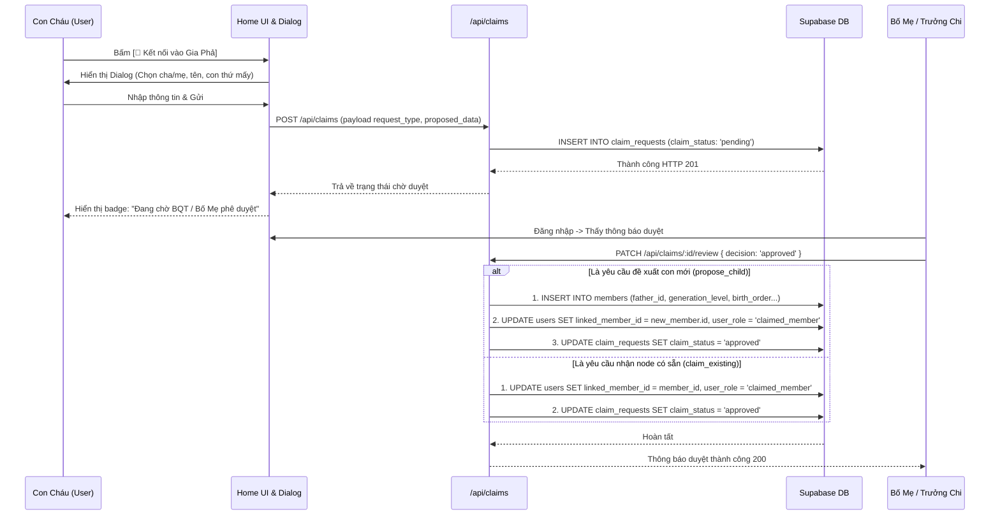
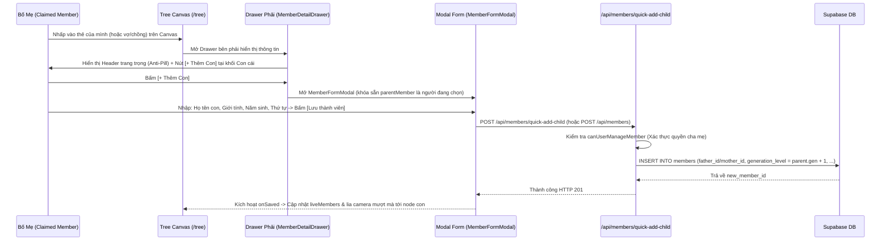

# ĐẶC TẢ KỸ THUẬT VI MÔ: MILESTONE 8 - NỐI PHẢ ĐA TẦNG, TỰ NHẬN HỒ SƠ & PHÊ DUYỆT PHÂN TÁN THEO HUYẾT THỐNG

_Tài liệu này là Hợp Đồng Kỹ Thuật (Single Source of Truth) cho Milestone 8. AI chỉ được phép đọc, suy luận và sinh mã nguồn bám sát 100% các ranh giới file và tiêu chí kiểm thử được định nghĩa trong đây._

---

## 1. QUY TẮC NGHIÊM NGẶT (STRICT CONSTRAINTS)

- **Ngôn ngữ & Framework:** Next.js 14+ (App Router), React, TypeScript, TailwindCSS, Lucide Icons, Supabase Client.
- **Ràng buộc Kiến trúc Nghiệp vụ Gia Phả:**
  - **Mô Hình Phân Quyền Quản Trị & Phê Duyệt 3 Tầng (3-Tier Governance Hierarchy):**
    1. **Tầng 1 — Quản Trị Tối Cao (`super_admin`):** Toàn quyền toàn phả, xem và duyệt mọi phiếu, có quyền gán (assign) các phiếu "Tìm Cội Nguồn" cho Trưởng Chi xác minh.
    2. **Tầng 2 — Trưởng Chi / Thư Ký Chi (`branch_editor`):** Phụ trách toàn bộ cây con thuộc Chi của mình (`assigned_branch_code`) bất kể người đó thuộc đời nào. Truy cập Cổng Quản Trị Phê Duyệt (`/admin/claims`) trong không gian `AdminShell` được scoped theo Chi phụ trách. Duyệt các hồ sơ con cháu thuộc Chi hoặc phiếu được Super Admin giao.
    3. **Tầng 3 — Chủ Hộ / Bố Mẹ (`claimed_member`):** 
       - Phụ trách Gia Đình Của Bạn trực hệ của mình (Bản thân, Vợ/Chồng, Con đẻ chưa tự liên kết tài khoản).
       - **Tuyệt đối không dùng nút (+) trôi nổi trên thẻ Canvas:** Giữ Cây Gia Phả 100% sạch sẽ, tôn nghiêm, triệt tiêu nguy cơ bấm nhầm khi pan/zoom hoặc che khuất dây bus huyết thống.
       - **Tập trung 100% vào Drawer Tác Vụ Phải (`MemberDetailDrawer`):**
         + **Anti-Pill Design:** Triệt tiêu hoàn toàn sự lạm dụng 5-6 pill badges san sát nhau ở Header; thay bằng Typography phân cấp sang trọng (`Đời 6 · Chi 2 - Ngành 1 · Con trưởng`), trạng thái sinh tử thể hiện bằng text tinh tế (`● Còn sống` hoặc `Đã mất (Năm - Năm)`).
         + **Tác vụ theo đúng ngữ cảnh (Contextual Actions):** Nút `[+ Thêm Con]` đặt ngay tiêu đề khối Con Cái; nút `[+ Thêm Vợ/Chồng]` đặt ngay tiêu đề khối Hôn Phối; nút `[Sửa hồ sơ]` đặt tại Action Bar. Nút bấm thiết kế chuẩn mực (`rounded-lg` viền mỏng), tuyệt đối không dùng pill tags làm nút bấm.
         + **Phân quyền hẹp (RBAC Scope):** Chỉ bật các nút Thêm/Sửa khi xem đối tượng thuộc Gia Đình Của Bạn; khi xem họ hàng xa hoặc khách thì toàn bộ nút Thêm/Sửa bị ẩn hoàn toàn (Chỉ xem).
         + **Khóa tuyệt đối quyền Xóa:** `claimed_member` không có quyền xóa bất kỳ thành viên nào (chỉ Super Admin / Branch Editor mới được xóa).
       - Nhận và phê duyệt tài khoản của con cái khi con gửi yêu cầu claim node.
  - **Điểm Chạm Nhận Diện Tại Màn Hình Home (`src/app/page.tsx`):**
    - Thay thế box lời chào tĩnh bằng **Khung Nhận Diện Tông Tộc (Identity & Context Hub)**.
    - Với thành viên đã gắn node: Hiển thị Đời, Chi/Ngành, nút xem vị trí trên Cây (`/tree?focus={id}`) và Quick Branch Selector.
    - Với người dùng đang có phiếu chờ duyệt: Hiển thị badge trạng thái màu amber kèm nút xem/hủy yêu cầu.
    - Với khách / thành viên chưa gắn node: Hiển thị nút kêu gọi nổi bật **`[ 🔗 Kết nối vào Gia Phả ]`**.
  - **Quy Trình Kết Nối Gia Phả 2 Tab Tinh Gọn (Connect Genealogy Dialog):**
    - **Tab 1: "Tôi đã có tên trên cây" (2 Chạm):** Tìm tên mình (kèm ngữ cảnh Cha/Mẹ & Chi để không nhầm người trùng tên) $\rightarrow$ Gửi yêu cầu nhận node có sẵn.
    - **Tab 2: "Tôi chưa có trên cây" (3 Bước):**
      + Nhập: Họ tên (tự điền từ Google), Giới tính, Năm sinh (tùy chọn).
      + Chọn Cha/Mẹ trên cây $\rightarrow$ Hệ thống tự động tính thế hệ (`generation_level = parent.gen + 1`) và tự động gán Chi/Ngành (`focusedBranchId`).
      + Chọn Thứ tự sinh (`birth_order`): Tự động hiển thị danh sách anh chị em hiện có và **chọn sẵn số con tiếp theo**.
      + Tùy chọn *"Chưa rõ Cha/Mẹ trên cây"*: Cho phép điền text tự do thông tin cha mẹ/ông bà ngoài đời $\rightarrow$ Tạo **Phiếu Tìm Cội Nguồn** (Lưu trong `claim_requests`, tuyệt đối không tạo node rác vào bảng `members`).
  - **Hợp Nhất Vào Khu Vực Quản Trị (`AdminShell`):**
    - Toàn bộ chức năng phê duyệt và điều phối phả hệ nằm trong **`AdminShell`** tại route chính thức **`/admin/claims`** với Sidebar điều hướng cố định 256px bên trái và Fluid Canvas mở rộng 100% bên phải.
    - Phân quyền theo phạm vi (Role-Based Scoping): Super Admin quản lý toàn họ; Trưởng Chi sử dụng Sidebar scoped theo Chi; Bố Mẹ duyệt con cái qua Drawer ngữ cảnh trực tiếp trên Cây.
    - Tuyệt đối CẤM tạo trang con cô lập ngoài hệ thống hoặc dùng container hạn hẹp `max-w-5xl`.
  - **Kiểm Chứng Thực Nghiệm Bằng Code Thật (`[R-VERIFY]`):**
    - Tuân thủ nghiêm ngặt: Typecheck 0 lỗi, Build 0 lỗi, Test tự động PASS 100%, User tự nghiệm thu thị giác (Human UAT).

---

## 1.1. PHÂN KỲ TRIỂN KHAI 3 GIAI ĐOẠN (PHASED ROADMAP & CHECKLIST)

Để đảm bảo tính liên tục của bộ nhớ hệ thống (Memory Persistence) qua nhiều phiên làm việc, tiến độ Milestone 8 được chia làm 3 chặng độc lập:

### 🌟 Giai Đoạn 1 (Phase 1): Điểm Chạm Home Onboarding & Hạ Tầng Gửi Hồ Sơ
- [x] **Phase 1.1 (Data & Types):** Mở rộng migration CSDL `claim_requests` và cập nhật TypeScript types trong `src/types/database.ts`.
- [x] **Phase 1.2 (Claim Logic Engine):** Xây dựng `src/lib/claims/claim-engine.ts` (validate, deduce branch focus, format context card).
- [x] **Phase 1.3 (Backend APIs):** Viết `POST /api/claims` và `GET /api/claims/my-requests`.
- [x] **Phase 1.4 (Home UI):** Xây dựng `IdentityContextWidget.tsx` (Khung nhận diện tông tộc tại Home) và `ConnectGenealogyModal.tsx` (Dialog kết nối gia phả 2 tab).
- [x] **Phase 1.5 (Test & Verify Phase 1):** Phủ các test cases `TC_UT_CLAIM_AUTO_DEDUCE_BRANCH`, `TC_UT_CLAIM_PROPOSE_CHILD_VALIDATION`, `TC_UT_CLAIM_PREVENT_ORPHAN_IN_DB`, `TC_UT_SEARCH_MEMBER_CONTEXT_CARD`. Typecheck và Build sạch. Nghiệm thu thị giác Home Onboarding.
- [x] **Phase 1.6 (Refinement UX & Kinship Logic):** Cố định layout Tab 1, đưa nhân thân lên đầu Tab 2, đa thê & stepper con.
- [x] **Phase 1.7 (Privacy-First & Validation):** Lọc bỏ hồ sơ đã link Tab 1, gợi ý thứ tự con, nguyện vọng Con Trưởng, validate phiếu rỗng.
- [x] **Phase 1.8 (Wizard 2-Step & Zero Double-Scrollbar):** Bước 1 gọn gàng 220px 0 scrollbar, Bước 2 Inline Flat List không che khuất, 1 luồng cuộn duy nhất.

### 🌟 Giai Đoạn 2 (Phase 2): Quyền Tự Quản Gia Đình Của Bạn Trong Drawer Phải (Anti-Pill & Scoped Actions)
- [x] **Phase 2.1 (Backend Scoped APIs):** Nâng cấp `POST /api/members/quick-add-child` và `PUT /api/members/[id]` cho phép `claimed_member` thêm con và sửa thông tin Gia Đình Của Bạn; giữ khóa `DELETE /api/members/[id]` 100%.
- [x] **Phase 2.2 (Drawer Redesign & Anti-Pill):** Tinh chỉnh `MemberDetailDrawer.tsx`: Dẹp bỏ rừng pill badges trong Header thay bằng Typography phân cấp cao cấp; bổ sung các nút tác vụ ngữ cảnh `[+ Thêm Con]` ở khối Con cái, `[+ Thêm Vợ/Chồng]` ở khối Hôn phối, và `[Sửa hồ sơ]` ở Action Bar.
- [x] **Phase 2.3 (Canvas Wiring & Optimistic Update):** Truyền `userProfile` (role & linked node) từ `src/app/tree/page.tsx` xuống `FamilyTreeCanvas.tsx` $\rightarrow$ `MemberDetailDrawer`; kết nối handler mở `MemberFormModal` với cha/mẹ được khóa sẵn; tự động chèn node con vào cây và lia camera mượt mà sau khi lưu.
- [x] **Phase 2.4 (Test & Verify Phase 2):** Phủ test `TC_UT_CLAIM_AUTO_APPROVE_PARENT_ADD`, các test API guards (`TC_INT_MEMBERS_API_CLAIMED_MEMBER_*`), kiểm tra bảo vệ con đã claim tài khoản. Nghiệm thu thị giác Drawer.
- [x] **Phase 2.5 (Tam Đại Đồng Đường & Thuần Việt Hóa Thân Tộc):** Mở rộng RBAC cho ông/bà F0 quản lý cháu F2 chưa claim; thuần Việt hóa Vợ/Chồng theo giới tính mục tiêu; định vị nhãn thân tộc `Con cái (Cháu của bạn)`; bổ sung tooltip cho nút `[Đặt làm Gốc]`.

### 🌟 Giai Đoạn 3 (Phase 3): Phê Duyệt Phân Tán (3 Tầng), Đồng Nhất Entry Point & Giao Diện Phẳng Chuẩn Admin Settings
- [ ] **Phase 3.1 (Core Logic & Review APIs):**
  + Xây dựng hàm `canUserReviewClaim` trong `src/lib/claims/claim-engine.ts` xác thực quyền phê duyệt 3 tầng (Bố mẹ / Trưởng Chi / Super Admin).
  + Viết API `GET /api/claims/pending` lấy danh sách phiếu chờ duyệt scoped theo vai trò người dùng (kèm thông tin enriched).
  + Viết API `PATCH /api/claims/[id]/review` xử lý 3 quyết định (`approved`, `rejected`, `assign`) kèm cơ chế Insert & Shift tịnh tiến thứ tự con (`birth_order`).
- [ ] **Phase 3.2 (Đồng Nhất Entry Point & Tích Hợp AdminSidebar):**
  + Gỡ bỏ hoàn toàn link `[ Quản trị Chi ]` khỏi `src/components/navbar/Navbar.tsx` để giữ thanh điều hướng thanh thoát, tôn nghiêm cho 3 chức năng công cộng (`Cây Gia Phả`, `Lịch Giỗ`, `Xưng hô`).
  + Bổ sung mục **`[Phê Duyệt Hồ Sơ]`** (kèm badge pending) vào **`AdminSidebar.tsx`** thuộc nhóm `THÀNH VIÊN & TÀI KHOẢN`.
  + Dropdown Avatar (`AuthButton.tsx`) bổ sung Quick Shortcut dẫn thẳng tới `/admin/claims`.
  + Route cũ `/branch` thiết lập chuyển hướng (redirect 307) về `/admin/claims`.
- [ ] **Phase 3.3 (Phê Duyệt Hồ Sơ Chuẩn AdminShell - Fluid Canvas & Zero Layout Shift):**
  + Xây dựng trang `src/app/admin/claims/page.tsx` kế thừa 100% `AdminLayout` và `AdminShell` (Sidebar 256px + Fluid Canvas 100%).
  + Triệt tiêu hoàn toàn Tab ngang `activeTab`. Màn hình chuyên biệt 100% cho Hàng đợi Duyệt phiếu (Approval Queue).
  + Bảng dữ liệu phẳng cố định cột (`w-[38%]`, `w-[22%]`, `w-[15%]`, `w-[25%]`), hairline divider, zero layout shift.
  + Bộ chọn Chi nhánh (Branch Selector Dropdown) đặt trên thanh công cụ lọc của bảng, không thay đổi cấu trúc trang.
  + Scoped Views: Super Admin quản lý toàn họ; Trưởng Chi dùng Sidebar scoped cho Chi; Bố Mẹ duyệt con cái qua Drawer ngữ cảnh trực tiếp trên Cây.
- [ ] **Phase 3.4 (Tương Tác Deep Zoom & Camera Focus Trên Cây):**
  + Màn hình `/tree` đón nhận `searchParams: { focus?: string }`.
  + `FamilyTreeCanvas.tsx` kích hoạt lia camera mượt mà `reactFlowInstance.setCenter(x, y, { zoom: 1.15, duration: 800 })`, tự động mở Drawer chi tiết thành viên và bật hiệu ứng viền phát sáng (Highlight Pulse) 2.5s.
- [ ] **Phase 3.5 (Test & Full Verification):**
  + Bổ sung các test cases tự động cho Entry Point, Scoped Views, Fixed Layout và Focus Zoom.
  + Kiểm chứng 3 tầng `[R-VERIFY]` (Typecheck 0 lỗi, Build 37/37 routes xanh, Test suite pass 100%).
  + Bàn giao `Dev_URL` nghiệm thu thị giác theo Ma trận UAT.

---

## 2. DATABASE & DATA MODELS

### 2.1. Cập Nhật Bảng: `public.claim_requests`
Bổ sung các trường hỗ trợ phân loại phiếu, lưu thông tin đề xuất và cơ chế ủy quyền (assign):

```sql
-- Migration bổ sung các cột mới cho claim_requests
ALTER TABLE public.claim_requests
  ALTER COLUMN member_id DROP NOT NULL; -- Cho phép null khi là yêu cầu propose_child hoặc find_origin

ALTER TABLE public.claim_requests
  ADD COLUMN IF NOT EXISTS request_type VARCHAR(20) NOT NULL DEFAULT 'claim_existing'
    CHECK (request_type IN ('claim_existing', 'propose_child', 'find_origin')),
  ADD COLUMN IF NOT EXISTS proposed_data JSONB,
  ADD COLUMN IF NOT EXISTS assigned_to UUID REFERENCES public.users(id) ON DELETE SET NULL,
  ADD COLUMN IF NOT EXISTS target_branch_code VARCHAR(50);
```

### 2.2. Interface TypeScript: `src/types/database.ts`

```typescript
export type ClaimRequestType = 'claim_existing' | 'propose_child' | 'find_origin';
export type ClaimStatus = 'pending' | 'approved' | 'rejected';

export interface ProposedChildData {
  full_name: string;
  gender: 'male' | 'female';
  birth_year?: number | null;
  birth_order?: number | null;
  is_senior?: boolean | null;      // Nguyện vọng Con Trưởng (Trưởng Nam gánh dòng)
  parent_id?: string | null;       // ID thành viên cha hoặc mẹ trên cây
  parent_relation?: 'father' | 'mother';
  spouse_id?: string | null;       // ID người mẹ cụ thể khi đa thê
  is_stepchild?: boolean;          // Đánh dấu con riêng (không chọn người còn lại)
  raw_parent_info?: string | null; // Ghi chú cha/mẹ ngoài đời khi chưa có trên cây
  raw_ancestor_info?: string | null; // Ghi chú ông/bà/nhánh nghi vấn
  notes?: string | null;
}

export interface ClaimRequestRow {
  id: string;
  user_id: string;
  member_id: string | null;
  request_type: ClaimRequestType;
  claim_status: ClaimStatus;
  proposed_data: ProposedChildData | null;
  verification_notes: string | null;
  assigned_to: string | null;       // User ID của Trưởng Chi được giao duyệt
  target_branch_code: string | null;
  reviewed_by: string | null;
  rejection_reason: string | null;
  created_at: string;
  updated_at: string;
}
```

---

## 3. SƠ ĐỒ LUỒNG LOGIC (SEQUENCE DIAGRAM - MERMAID)

### 3.1. Luồng Con Cháu Gửi Yêu Cầu & Bố Mẹ / Trưởng Chi Duyệt



### 3.2. Luồng Bố Mẹ Thao Tác Trong Drawer Phải Để Thêm Con Đẻ (Auto-Approved)



---

## 4. BACKEND LOGIC & API SPECIFICATION

### 4.1. `POST /api/claims` (Gửi Yêu Cầu Liên Kết / Bổ Sung)
- **Tập tin:** `src/app/api/claims/route.ts`
- **Quyền hạn:** Mọi người dùng đã đăng nhập (Google Auth).
- **Body Input:**
  ```typescript
  {
    request_type: 'claim_existing' | 'propose_child' | 'find_origin';
    member_id?: string;             // Dành cho claim_existing
    proposed_data?: ProposedChildData; // Dành cho propose_child hoặc find_origin
    verification_notes?: string;
  }
  ```
- **Xử lý:**
  1. Lấy `userId` từ Supabase auth session.
  2. Kiểm tra xem user này đã có phiếu nào ở trạng thái `pending` chưa $\rightarrow$ Nếu có: Trả về lỗi 400 *"Bạn đang có một yêu cầu chờ duyệt, vui lòng chờ xử lý"*.
  3. Nếu là `claim_existing`: Kiểm tra `member_id` có bị user khác link chưa $\rightarrow$ Nếu đã link: Báo lỗi 400 *"Thành viên này đã được liên kết với tài khoản khác"*.
  4. Nếu là `propose_child`: Kiểm tra `parent_id` hợp lệ. Tự động truy vấn Chi của `parent_id` để điền `target_branch_code`.
  5. Nếu là `find_origin`: Bắt buộc kiểm tra `proposed_data.raw_parent_info` không được để trống $\rightarrow$ Nếu thiếu: Báo lỗi 400 *"Vui lòng nhập Tên Bố / Mẹ ngoài đời để Ban Quản Trị có thông tin đối chiếu"*.
  6. INSERT vào `claim_requests`.
  7. Trả về HTTP 201 `{ success: true, data: claimRequest }`.

### 4.2. `GET /api/claims/pending` (Lấy Danh Sách Phiếu Cần Duyệt Theo Phân Quyền)
- **Tập tin:** `src/app/api/claims/pending/route.ts`
- **Quyền hạn:** Người dùng đã đăng nhập mang vai trò `super_admin`, `branch_editor`, hoặc `claimed_member` (có liên kết node). Khách / Viewer thông thường bị chặn HTTP 403 Forbidden.
- **Xử lý Scoped Data:**
  1. Lấy thông tin user hiện tại (`userId`, `user_role`, `linked_member_id`, `assigned_branch_code`).
  2. Truy vấn bảng `claim_requests` với điều kiện `claim_status = 'pending'`:
     - Nếu `super_admin`: Lấy toàn bộ phiếu pending trên toàn phả hệ.
     - Nếu `branch_editor`: Lấy các phiếu thỏa mãn `target_branch_code === user.assigned_branch_code` **HOẶC** được giao đích danh `assigned_to === user.id`.
     - Nếu `claimed_member`: Lấy các phiếu thỏa mãn `proposed_data->>'parent_id' === user.linked_member_id` HOẶC yêu cầu claim chính node con đẻ của mình (`member.father_id === user.linked_member_id || member.mother_id === user.linked_member_id`).
  3. **Làm giàu dữ liệu (Data Enrichment):**
     - Kèm thông tin tài khoản người nộp: Họ tên Google, email, ảnh avatar.
     - Kèm thông tin Cha/Mẹ được đề xuất (tên, đời, chi, bạn đời).
     - Kèm thông tin Trưởng Chi được gán (`assigned_to` full name & email).
  4. Trả về HTTP 200 `{ success: true, data: enrichedClaims }`.

### 4.3. `PATCH /api/claims/[id]/review` (Phê Duyệt / Từ Chối / Giao Việc)
- **Tập tin:** `src/app/api/claims/[id]/review/route.ts`
- **Body Input:**
  ```typescript
  {
    decision: 'approved' | 'rejected' | 'assign';
    assigned_to?: string;        // Bắt buộc khi decision === 'assign'
    rejection_reason?: string;   // Tùy chọn khi decision === 'rejected'
  }
  ```
- **Xử lý Chi Tiết:**
  1. Lấy thông tin user gọi API (`callerUser`). Chặn ngay HTTP 401 nếu chưa đăng nhập.
  2. Tìm kiếm bản ghi phiếu trong `claim_requests` theo `params.id`. Nếu không tồn tại hoặc `claim_status !== 'pending'`: Trả về HTTP 400/404 *"Yêu cầu không tồn tại hoặc đã được xử lý trước đó"*.
  3. **Kiểm tra quyền phê duyệt bằng `canUserReviewClaim`:**
     - Gọi `canUserReviewClaim(callerUser, claimRequest, members, branches, spouseRelations)`.
     - Nếu trả về `false`: Lập tức chặn HTTP 403 Forbidden *"Bạn không có quyền hạn phê duyệt hoặc xử lý phiếu này"*.
  4. **Xử lý quyết định `decision === 'assign'` (Ủy quyền cho Trưởng Chi):**
     - Chỉ cho phép `super_admin` thực hiện.
     - Kiểm tra `body.assigned_to` phải là một user hợp lệ có vai trò `branch_editor` hoặc `super_admin`.
     - UPDATE `claim_requests SET assigned_to = body.assigned_to, updated_at = NOW()`.
     - Trả về HTTP 200 `{ success: true, message: 'Đã ủy quyền phiếu cho Trưởng Chi xử lý' }`.
  5. **Xử lý quyết định `decision === 'rejected'` (Từ chối phiếu):**
     - UPDATE `claim_requests SET claim_status = 'rejected', rejection_reason = body.rejection_reason || 'Không thỏa mãn điều kiện đối chiếu', reviewed_by = callerUser.id, updated_at = NOW()`.
     - Trả về HTTP 200 `{ success: true, message: 'Đã từ chối yêu cầu kết nối' }`.
  6. **Xử lý quyết định `decision === 'approved'` (Chấp thuận phiếu):**
     - **Trường hợp A: `request_type === 'claim_existing'`:**
       * Kiểm tra an toàn: Node `claim.member_id` chưa bị tài khoản khác liên kết trong lúc chờ duyệt.
       * UPDATE `users SET linked_member_id = claim.member_id, user_role = (CASE WHEN user_role = 'viewer' THEN 'claimed_member' ELSE user_role END) WHERE id = claim.user_id`.
       * UPDATE `claim_requests SET claim_status = 'approved', reviewed_by = callerUser.id, updated_at = NOW()`.
     - **Trường hợp B: `request_type === 'propose_child'`:**
       * Trích xuất `proposed_data` từ phiếu.
       * Tìm kiếm bản ghi của Cha/Mẹ (`parent_id`). Tính toán `generation_level = parent.generation_level + 1`.
       * Thiết lập `father_id` và `mother_id`:
         + Nếu parent là Nam: `father_id = parent_id`; nếu có `spouse_id` thì `mother_id = spouse_id`.
         + Nếu parent là Nữ: `mother_id = parent_id`; nếu có `spouse_id` thì `father_id = spouse_id`.
       * **Cơ chế Insert & Shift tịnh tiến thứ tự con (Edge Case 3):**
         + Xác định thứ tự sinh mục tiêu `targetOrder = proposed_data.birth_order || 1`.
         + Truy vấn toàn bộ con hiện có của người cha/mẹ đó.
         + Nếu có các con có `birth_order >= targetOrder`, thực hiện tịnh tiến: `UPDATE members SET birth_order = birth_order + 1 WHERE ... AND birth_order >= targetOrder`.
       * INSERT bản ghi mới vào bảng `members` (`full_name`, `gender`, `birth_year`, `birth_order = targetOrder`, `is_senior = proposed_data.is_senior`, `father_id`, `mother_id`, `generation_level`).
       * UPDATE `users SET linked_member_id = newMember.id, user_role = 'claimed_member' WHERE id = claim.user_id`.
       * UPDATE `claim_requests SET claim_status = 'approved', member_id = newMember.id, reviewed_by = callerUser.id, updated_at = NOW()`.
  7. Trả về HTTP 200 `{ success: true, message: 'Phê duyệt yêu cầu thành công' }`.

### 4.7. Hàm Xác Thực Quyền Phê Duyệt Phiếu: `src/lib/claims/claim-engine.ts`
- **Hàm `canUserReviewClaim`:**
  ```typescript
  export function canUserReviewClaim(
    user: { id?: string; user_role?: string; linked_member_id?: string | null; assigned_branch_code?: string | null } | null | undefined,
    claim: ClaimRequestRow,
    members: MemberRecord[],
    branches: BranchNode[] = [],
    spouseRelations: SpouseRelationRecord[] = []
  ): boolean;
  ```
- **Quy tắc phân tầng:**
  1. `super_admin`: Luôn trả về `true` cho mọi phiếu.
  2. `branch_editor`:
     - Trả về `true` nếu phiếu được giao đích danh `claim.assigned_to === user.id`.
     - Trả về `true` nếu phiếu có `claim.target_branch_code === user.assigned_branch_code`.
     - Trả về `true` nếu node đích hoặc node cha/mẹ được đề xuất thuộc cây con của `user.assigned_branch_code` (sử dụng `resolveMemberBranchHierarchy`).
  3. `claimed_member` (Bố/Mẹ):
     - Trả về `true` nếu là phiếu `propose_child` và `claim.proposed_data?.parent_id === user.linked_member_id`.
     - Trả về `true` nếu là phiếu `claim_existing` và node đích là con đẻ của mình (`targetMember.father_id === user.linked_member_id || targetMember.mother_id === user.linked_member_id`).
  4. Mọi trường hợp khác (khách, họ hàng xa, không liên quan): Trả về `false`.

### 4.4. `POST /api/members/quick-add-child` (Thêm Con Đẻ Tự Duyệt Cho Gia Đình Của Bạn)
- **Tập tin:** `src/app/api/members/quick-add-child/route.ts` (hoặc mở rộng `POST /api/members`)
- **Xử lý:**
  1. Lấy thông tin user hiện tại (`user.linked_member_id`, `user.user_role`).
  2. Xác thực quyền bằng `canUserManageMember`:
     - Nếu `super_admin` / `branch_editor`: Được phép thêm theo phạm vi quản trị.
     - Nếu `claimed_member`: `parentId` gửi lên bắt buộc phải là `user.linked_member_id` (hoặc bạn đời của user trong bảng `spouse_relations`).
     - Người ngoài / Viewer: Chặn ngay HTTP 403 Forbidden.
  3. Tính toán dữ liệu tự động:
     - `generation_level = parent.generation_level + 1`.
     - Tự động gán `father_id` (nếu parent là nam) hoặc `mother_id` (nếu parent là nữ).
     - Hỗ trợ gán `mother_id` / `father_id` phối ngẫu tương ứng khi có chọn người mẹ/bố cụ thể.
     - Tự động xác định `birth_order` (max + 1 nếu không chỉ định).
  4. INSERT vào `members`.
  5. Trả về HTTP 201 `{ success: true, member: newMember }`.

### 4.4.B. `POST /api/members` (Thêm Vợ/Chồng Gia Đình Của Bạn Cho Claimed Member)
- **Tập tin:** `src/app/api/members/route.ts`
- **Xử lý:**
  1. Lấy thông tin user hiện tại (`user.linked_member_id`, `user.user_role`).
  2. Khi `defaultRole === 'spouse'`, Frontend gửi `body.spouse_id` (chứa ID của người phối ngẫu đang thao tác).
  3. Backend nhận diện: `const targetManageId = parentId || body.spouse_id || (body as any).current_spouse_id;`.
  4. Xác thực quyền bằng `canUserManageMember(userProfile, targetManageId)`:
     - Nếu `claimed_member`: Cho phép khi `targetManageId === user.linked_member_id` (thêm vợ/chồng cho chính mình) hoặc là bạn đời hiện có của user.
     - Nếu người ngoài / không liên quan: Chặn HTTP 403 Forbidden *"Thành viên chỉ có quyền thêm con hoặc vợ/chồng cho Gia Đình Của Bạn của mình"*.
  5. **Kế thừa thế hệ chính xác (Generation Parity):**
     - Khi có `body.spouse_id`, tự động lấy `generation_level = spouse.generation_level` (kế thừa cùng đời với người phối ngẫu, ví dụ Đời 13). Tuyệt đối không để rơi vào fallback `generation_level = 1`.
  6. INSERT bản ghi người phối ngẫu vào `members` và tự động INSERT mối quan hệ vào `spouse_relations`.
  7. Trả về HTTP 201 `{ success: true, member: newMember, newSpouseRelation }`.

### 4.5. `PUT /api/members/[id]` (Mở Khóa Quyền Sửa Hồ Sơ Gia Đình Của Bạn)
- **Tập tin:** `src/app/api/members/[id]/route.ts`
- **Xử lý:**
  1. Lấy thông tin user hiện tại (`user.linked_member_id`, `user.user_role`).
  2. Kiểm tra quyền sở hữu bằng `canUserManageMember`:
     - Nếu `super_admin` / `branch_editor`: Toàn quyền sửa theo phân cấp.
     - Nếu `claimed_member`: Được phép sửa nếu `params.id` là:
       * Chính bản thân mình (`id === user.linked_member_id`).
       * Vợ/chồng của mình (`isSpouse === true`).
       * Con đẻ của mình CHƯA tự liên kết tài khoản (`linked_user_id === null`).
       * ⚠️ *Rào chắn bảo vệ con đã trưởng thành:* Nếu con đẻ đã có `linked_user_id !== null` $\rightarrow$ Từ chối HTTP 403 *"Thành viên này đã có tài khoản riêng tự quản lý"*.
     - Người ngoài / Viewer: Chặn HTTP 403 Forbidden.
  3. **Khóa các trường cấu trúc cốt lõi:** Người dùng `claimed_member` chỉ được cập nhật thông tin cá nhân (`full_name`, `alias_name`, `gender`, `birth_year`, `birth_date`, `death_year`, `death_date`, `avatar_url`, `phone`, `notes`, `burial_location`). TUYỆT ĐỐI KHÔNG cho phép đổi `generation_level`, `father_id`, `mother_id` hay `branch_id` (chỉ Admin mới có quyền tái cấu trúc cây).
  4. UPDATE `members` và trả về HTTP 200 `{ success: true, member: updatedMember }`.

### 4.6. `DELETE /api/members/[id]` (Khóa Tuyệt Đối Quyền Xóa Với Chủ Hộ)
- **Tập tin:** `src/app/api/members/[id]/route.ts`
- **Nguyên tắc bảo vệ toàn phả:**
  - `claimed_member` TUYỆT ĐỐI KHÔNG CÓ QUYỀN XÓA bất kỳ thành viên nào (kể cả con đẻ vừa thêm nhầm).
  - Nếu `claimed_member` gửi yêu cầu DELETE $\rightarrow$ Lập tức chặn HTTP 403 Forbidden *"Chỉ Quản Trị Viên mới có quyền xóa hồ sơ khỏi Cây Gia Phả"*.
  - Muốn gỡ bỏ hồ sơ, chủ hộ liên hệ Ban Quản Trị / Trưởng Chi để tránh phá hủy cây do thao tác nhầm.

---

## 5. FRONTEND UI & COMPONENTS SPECIFICATION

### 5.1. Khung Nhận Diện Tông Tộc Tại Màn Hình Home: `src/components/home/IdentityContextWidget.tsx`
- Vị trí: Đặt tại `src/app/page.tsx`, ngay dưới tiêu đề dòng họ.
- **Trạng thái 1: Thành viên đã gắn node (Identity Honor Card):**
  - Avatar, Tên thành viên trong Gia Phả.
  - Huy hiệu danh xưng: `[ Đời {X} · {Tên Chi/Ngành} ]`.
  - Nút hành động duy nhất, sắc sảo: **`[  Xem trên Cây ]`** trỏ tới `/tree?focus={linked_member_id}`.
  - *(Lưu ý: Loại bỏ 100% Dropdown Chọn Chi Nhánh thừa thãi khỏi khung này để giữ trọn tính tôn nghiêm của Thẻ Danh Tính; việc lọc xem nhánh đã có sẵn trên Toolbar của trang `/tree` và `/anniversaries`).*
- **Trạng thái 2: Đang có phiếu chờ duyệt:**
  - Badge màu hổ phách: `[ ⏳ Đang chờ BQT/Bố Mẹ duyệt: {Tên hồ sơ} ]`.
  - Nút `[Hủy]` yêu cầu (nếu gửi nhầm).
- **Trạng thái 3: Khách / Chưa gắn node:**
  - Nút nổi bật: **`[ 🔗 Kết nối vào Gia Phả ]`** với hiệu ứng hover ngọc bích sang trọng, thu hút con cháu bấm vào.

### 5.2. Dialog Kết Nối Gia Phả: `src/components/modals/ConnectGenealogyModal.tsx`
- **Kiến Trúc Quy Trình Wizard 2 Bước (Zero Double-Scrollbar & Pure Flow):**
  - **Khóa Cứng Chiều Cao Khung Modal (Fixed Height Modal):** Khung Modal cố định chiều cao `h-[600px] max-h-[88vh] flex flex-col overflow-hidden` cho cả 2 tab.
  - **Neo Đỉnh Nhẹ (Top-Aligned):** Container modal dùng `items-start pt-10 sm:pt-14` (thay vì `items-center`) để cố định mép trên của modal, tránh hiện tượng tâm modal bị giật nảy $\Delta H / 2$.
  - **Triệt Tiêu 100% Hiện Tượng 2 Thanh Cuộn Kề Nhau (Zero Double-Scrollbar):** Thay vì nhồi nhét toàn bộ 10 trường vào cùng 1 màn hình và dùng dropdown nổi đè lên các trường khác, Tab 2 được chia thành 2 bước tuần tự đĩnh đạc:

- Thiết kế 2 Tab phẳng, hỗ trợ phím `Escape` và Portal gắn vào `document.body`:
  - **Tab 1: "Tôi đã có tên trên cây" (Nhận Node Đã Có - Bảo Mật Tuyệt Đối):**
    - Ô tìm kiếm tên mình trên cây.
    - **Lọc sạch 100% hồ sơ đã có chủ (Privacy & Security First):** Chỉ hiển thị các thành viên CHƯA có ai liên kết tài khoản (`!claimedMemberIds.includes(m.id)`). Tuyệt đối không hiển thị các node đã có chủ để tránh lộ dữ liệu cá nhân và tranh chấp tài khoản.
    - Nếu không tìm thấy hồ sơ nào chưa liên kết: Hiển thị thông báo rõ ràng: *"Không tìm thấy người nào chưa liên kết phù hợp với tên '...' (Bạn có thể chuyển sang tab 'Tôi chưa có trên cây' để đề xuất thêm mới)"*.
    - Danh sách kết quả hiển thị dạng **Thẻ Ngữ Cảnh 3 Thế Hệ**: Tên, Năm sinh, Đời, Chi, Cha Mẹ (`Con cụ X & bà Y`).
    - Khóa chiều cao container (`h-52 overflow-y-auto`) chống hiện tượng giật nảy layout khi gõ phím.
    - Nút 1-chạm: `[ Chính là tôi ]` $\rightarrow$ Gửi yêu cầu.
  - **Tab 2: "Tôi chưa có trên cây" (Wizard 2 Bước Tuần Tự):**
    - **Bước 1: Thông tin cá nhân của bạn (`newMemberStep === 1`):**
      + Thanh chỉ báo tiến trình mini: `[ Bước 1: Thông tin của bạn (Đang làm) ] ── ( Bước 2: Bố Mẹ & Cội nguồn )`.
      + Họ và tên của bạn: * (tự điền từ Google, sửa được).
      + Giới tính: * (Nam / Nữ).
      + Năm sinh: (Tùy chọn, ví dụ: 1995).
      + Màn hình gọn gàng (~220px), **tuyệt đối 0 có thanh cuộn nào**.
      + Chân modal Bước 1: Nút bấm `[ Tiếp Tục: Chọn Bố Mẹ → ]` (bị disabled khi `!fullName.trim()`).
    - **Bước 2: Cội nguồn trong họ (`newMemberStep === 2`):**
      + Dòng tóm tắt Bước 1 trên đầu: `[ ✓ Bạn: [Họ tên] · [Nam/Nữ] · [Năm sinh] (Bấm để sửa) ]` cho phép người dùng click để quay lại Bước 1 bất cứ lúc nào.
      + Toàn bộ không gian modal rộng rãi dành riêng cho cội nguồn:
        * Ô tìm kiếm Cha hoặc Mẹ trên Cây.
        * **Kết quả tìm kiếm hiển thị dạng Thẻ Phẳng (Inline List)** trực tiếp dưới ô tìm kiếm: tối đa 4 người phù hợp nhất kèm thông tin vợ/chồng, đời, chi. Không dùng floating dropdown lơ lửng, không che khuất checkbox hay textarea.
        * Khi đã chọn Cha (hoặc Mẹ):
          - Thẻ xác nhận cha mẹ + Nút `Đổi`.
          - *Nếu có 1 vợ/chồng:* Tự động xác nhận Mẹ là người vợ đó.
          - *Nếu đa thê ($\ge 2$ vợ/chồng):* Hiển thị danh sách Radio phân biệt rõ từng người mẹ: `(•) Mẹ (Bà cả): Chu Thị Hà`, `( ) Mẹ (Bà hai): Nguyễn Thị Mai`.
          - *Hỗ trợ con riêng minh bạch:* Tùy chọn `( ) Con riêng của Bố/Mẹ (Không chọn người còn lại)` $\rightarrow$ Gán `parent_id` và để trống `spouse_id`.
          - *Số thứ tự con trong gia đình & Gợi ý thông minh (Smart Birth Order):* Stepper `[ - ]` **Số 3** `[ + ]` kèm câu giải thích vị trí tức thì (trước ai, sau ai, ai chuyển bậc).
          - *Nguyện vọng Con Trưởng (Trưởng Nam):* Khi chọn Nam, checkbox `[ ] Tôi là Con Trưởng (Trưởng Nam gánh dòng)`.
        * Checkbox chuyển đổi linh hoạt sang Phiếu Yêu Cầu (Khi chưa rõ Cha Mẹ trên Cây).
        * Lời nhắn xác minh gửi BQT / Bố Mẹ.
      + **Chân modal Bước 2 (Pinned Sticky Footer):**
        * Nút bên trái: `[ ← Quay lại ]` (trở về Bước 1).
        * Nút bên phải: `[ Gửi Yêu Cầu Xét Duyệt ]` / `[ Gửi Yêu Cầu Xác Minh ]` (bị disabled khi chưa chọn bố mẹ hoặc chưa nhập tên ngoài đời).
      + **Triệt tiêu 100% hiện tượng 2 thanh cuộn kề nhau:** Toàn bộ modal chỉ có đúng 1 luồng cuộn tự nhiên duy nhất của cả form nếu nội dung dài, không có thanh cuộn con nào bên trong.

### 5.3. Trung Tâm Tác Vụ Ngữ Cảnh Trong Drawer Phải: `src/components/tree/MemberDetailDrawer.tsx`
- **Triết lý Anti-Pill & Nghệ Thuật Kiểu Chữ (Typography Hierarchy):**
  - **Dọn sạch Header (Zero Pill Spams):** Bãi bỏ hoàn toàn việc nhồi nhét 5-6 pill badges bo tròn nhiều màu. Thay thế bằng Typography phân cấp sang trọng, tôn nghiêm:
    + Họ tên lớn, đậm nét (`text-lg font-bold text-slate-900 dark:text-slate-50`).
    + Dòng danh xưng thế hệ & chi nhánh thanh lịch: `Đời {generation_level} · {branch_name || 'Chi phái chưa xếp'}` kèm ký hiệu ` Con trưởng` dạng text trang nhã dùng dấu chấm ngăn cách (`·`).
    + Trạng thái sinh tử tinh tế: Một dot nhỏ `● Còn sống` (ngọc bích) hoặc biểu tượng ngọn nến `Đã mất ({sinh} - {mất})` dạng text mộc mạc, không đóng khung viên thuốc lòe loẹt.
- **Tác Vụ Ngữ Cảnh Chuẩn Mực (Contextual Action Buttons):**
  - Nút bấm thiết kế chuẩn mực (`rounded-lg border border-slate-200 dark:border-slate-700 bg-white dark:bg-slate-800 hover:bg-slate-50 dark:hover:bg-slate-700/80 px-2.5 py-1.5 text-xs font-semibold shadow-xs transition-colors`), tuyệt đối không dùng pill tags làm nút bấm.
  - **Tại Khối Con Cái (Children Section):**
    + Khi người xem ($F_0$) mở Drawer của Con mình ($F_1$): Tiêu đề khối con cái đổi thành **`Con cái (Cháu của bạn) (N):`** để định vị thân tộc trực quan.
    + Đặt nút **`[+ Thêm Con]`** ngay góc phải header của danh sách con cái khi người xem có quyền quản lý người này $\rightarrow$ Gọi `onAddChild(targetMember)`.
  - **Tại Khối Phối Ngẫu (Spouse Section - Thuần Việt hóa 100%):**
    + Loại bỏ thuật ngữ hành chính "Phối ngẫu". Tự động phân hóa theo giới tính của thành viên đang mở:
      * Nếu thành viên là **Nam** $\rightarrow$ Tiêu đề khối: **`Vợ (N):`**; Nút bấm: **`[+ Thêm vợ]`**.
      * Nếu thành viên là **Nữ** $\rightarrow$ Tiêu đề khối: **`Chồng (N):`**; Nút bấm: **`[+ Thêm chồng]`**.
    + Trong `MemberFormModal`: Tiêu đề tự động gán `Thêm thông tin Vợ` hoặc `Thêm thông tin Chồng` với placeholder tự nhiên.
- **Thanh Điều Khiển Chân Drawer (Footer Action Bar):**
  - **Nút `[✏️ Sửa hồ sơ]`:** Hiển thị khi `canUserManageMember(currentUser, target.id, ...)` trả về `true` (Bao gồm Bản thân $F_0$, Vợ/Chồng, Con đẻ $F_1$, và Cháu trực hệ $F_2$ chưa tự liên kết tài khoản, hoặc Admin/Trưởng Chi).
  - **Nút `[↕️ Sắp xếp con]`:** Hiển thị khi người này có con và user có quyền quản lý.
  - **Nút `[Đặt làm Gốc]`:** Có Tooltip và thuộc tính `title` giải thích tường minh: *"Lọc cây gia phả lấy người này làm gốc, xem riêng nhánh con cháu của họ và tự động đổi góc nhìn xưng hô thân tộc"*. Mở cho toàn bộ người dùng (kể cả khách / viewer).
  - **Nút `[🔍 Tra cứu xưng hô]`:** Mở cho toàn bộ người dùng.
  - **Nút `[🗑️ Xóa hồ sơ]`:** Chỉ hiển thị cho `super_admin` và `branch_editor` khi thành viên không có con; ẩn hoàn toàn đối với `claimed_member`.
- **Dây Nối Trạng Thái Từ Server Tới Canvas:**
  - `src/app/tree/page.tsx` trích xuất thông tin người dùng đang đăng nhập (`userProfile`: `id`, `user_role`, `linked_member_id`, `assigned_branch_code`) và truyền xuống `FamilyTreeCanvas.tsx`.
  - `FamilyTreeCanvas.tsx` truyền `currentUser` vào `MemberDetailDrawer` để tính toán quyền hạn tức thì.
  - Khi thêm con/sửa hồ sơ thành công từ Modal: Tự động kích hoạt `handleMemberSaved` $\rightarrow$ Cập nhật `liveMembers` $\rightarrow$ Cây phả hệ tự động chèn node và lia camera nhẹ nhàng tới node mới mà không cần F5 toàn trang.

### 5.4. Phê Duyệt Hồ Sơ Trong Khu Vực Quản Trị (Admin Claims Portal): `src/app/admin/claims/page.tsx`
- **Kế thừa 100% Kiến Trúc AdminShell (`[R-SPEC.INVARIANT]`):**
  - Cổng Phê Duyệt nằm trọn vẹn trong route `src/app/admin/claims/page.tsx` thừa hưởng `AdminLayout` và `AdminShell`.
  - Cột trái: Cố định `<AdminSidebar />` (256px) với đầy đủ các nhóm điều hướng Quản Trị Dòng Họ.
  - Cột phải: Fluid Full-Width Canvas (`p-4 sm:p-6 lg:p-8`), loại bỏ vĩnh viễn container hạn hẹp `max-w-5xl mx-auto`.
  - Không còn hiện tượng co giật kích thước màn hình ("Zero Layout Shift").
- **Triệt Tiêu Hoàn Toàn Tab Ngang (`activeTab`):**
  - Màn hình tập trung chuyên biệt 100% cho **Hàng đợi Phê Duyệt (Approval Queue)**.
  - TUYỆT ĐỐI CẤM dùng các nút bấm Tab chuyển trạng thái giữa duyệt phiếu và danh sách thành viên chi làm xáo trộn layout.
- **Thanh Công Cụ Lọc Tinh Gọn (Filter Bar & Branch Selector):**
  - Đặt bộ chọn Chi nhánh (Branch Selector Dropdown) phẳng phiu ngay trên thanh công cụ lọc của bảng:
    - *Super Admin:* Dropdown chọn xem "Toàn dòng họ" hoặc lọc phiếu theo từng Chi cụ thể.
    - *Trưởng Chi:* Mặc định khóa cứng và hiển thị các phiếu thuộc Chi mình phụ trách (`assigned_branch_code`).
- **Bảng Cố Định Cấu Trúc Chiều Ngang (Fixed Column Table Layout):**
  - Dùng hairline dividers `divide-y divide-slate-100 dark:divide-slate-800`.
  - Tỷ lệ độ rộng cột chuẩn mực:
    - `w-[38%]`: Thành viên & Người gửi đề xuất (Avatar, Họ tên, quan hệ đề xuất, ghi chú).
    - `w-[22%]`: Loại yêu cầu & Chi nhánh đích.
    - `w-[15%]`: Thế hệ & Ngày gửi phiếu.
    - `w-[25%]`: Cụm nút thao tác (`[Cây]` lia camera, `[Từ chối]` mở prompt lý do, `[Duyệt]` phê duyệt tức thì).

### 5.5. Tích Hợp AdminSidebar & Lối Tắt Nhanh (Navigation & Entry Point)
- **Menu Quản Trị Chính Thức:**
  - Bổ sung mục điều hướng **`[Phê Duyệt Hồ Sơ]`** trực tiếp vào `src/components/admin/AdminSidebar.tsx` thuộc nhóm **`THÀNH VIÊN & TÀI KHOẢN`**.
  - Hiển thị Badge số lượng phiếu `pending` (nền hổ phách, chữ đậm) cập nhật realtime.
- **Lối Tắt Nhanh (Quick Shortcut) Trên Dropdown Avatar:**
  - Trong Dropdown Avatar người dùng (`src/components/auth/AuthButton.tsx`), duy trì mục `[Phê Duyệt Hồ Sơ]` (kèm badge) đặt ngay dưới *"Cài đặt của tôi"*.
  - Mục này đóng vai trò 1-click Quick Shortcut dẫn thẳng tới `/admin/claims`.
- **Chuyển Hướng Route Cũ:**
  - Route `/branch` và `/approvals` tự động thực hiện Redirect 307 về `/admin/claims`.
- **Phân Định Trải Nghiệm 3 Nhóm Người Dùng (Role-Based Scoping & Sidebar Isolation):**
  - Cả 3 nhóm người dùng đều truy cập qua menu `[Phê Duyệt Hồ Sơ]` trên Dropdown Avatar và duyệt tại Cổng Phê Duyệt `/admin/claims` trong không gian `AdminShell` chuẩn mực.
  - Phân quyền cổng Layout (`src/app/admin/layout.tsx`): Cho phép `claimed_member` truy cập nếu đích đến là `/admin/claims`. Nếu họ cố truy cập các route quản trị nhạy cảm (`/admin/users`, `/admin/profile`, `/admin/import`), layout lập tức chuyển hướng unauthorized.
  - Phân quyền Menu Sidebar (`src/components/admin/AdminSidebar.tsx`):
    - *Super Admin:* Toàn quyền trên `/admin/claims` với `AdminSidebar` hiển thị đầy đủ 4 nhóm danh mục quản trị, huy hiệu `Super Admin`.
    - *Trưởng Chi (`branch_editor`):* Truy cập `/admin/claims` với `AdminSidebar` scoped theo Chi (chỉ thấy các chức năng thuộc thẩm quyền của Chi mình), huy hiệu `Ban Biên Tập Chi`.
    - *Bố Mẹ (`claimed_member`):* Truy cập `/admin/claims` với `AdminSidebar` cách ly tối đa (Sidebar Isolation):
      * Ẩn toàn bộ 4 nhóm quản trị hệ thống (`TỔNG QUAN`, `GIA PHẢ & QUY ƯỚC`, `VẬN HÀNH & HỆ THỐNG`, và các mục Quản lý user/role).
      * Chỉ hiển thị duy nhất nhóm **`Gia Đình Của Bạn`** với mục **`[Phê Duyệt Hồ Sơ Con Cháu]`** (kèm realtime badge) và footer **`[ ⬅️ Về Cây Gia Phả ]`**.
      * Huy hiệu vai trò hiển thị trang trọng: `Con Cháu` / `Thành Viên`.
      * Bảng hiển thị tiêu đề scoped: `"Phê Duyệt Hồ Sơ Con Cháu"`, chỉ lọc các phiếu liên quan đến con cái/Gia Đình Của Bạn của mình.

### 5.6. Tương Tác Deep Zoom & Camera Focus Trên Cây Phả Hệ (`/tree?focus=...`)
- **Đón Nhận Tham Số Tìm Kiếm:**
  - Route `/tree` tại `src/app/tree/page.tsx` nhận `searchParams: { focus?: string }` và truyền xuống `FamilyTreeCanvas.tsx`.
- **Cơ Chế Điều Hướng Camera Mượt Mà:**
  - `FamilyTreeCanvas.tsx` lắng nghe `initialFocusMemberId`:
    1. **Pan & Zoom chuẩn xác:** Gọi `reactFlowInstance.setCenter(node.x, node.y, { zoom: 1.15, duration: 800 })` lia camera mượt mà đưa node vào đúng chính giữa màn hình.
    2. **Mở Drawer Tức Thì:** Tự động set `selectedMemberId = focusId` để mở `MemberDetailDrawer` hiển thị hồ sơ chi tiết.
    3. **Hiệu Ứng Viền Phát Sáng (Highlight Pulse):** Kích hoạt hiệu ứng viền phát sáng quanh node mục tiêu trong 2.5s để người dùng nhận diện ngay lập tức vị trí trên Cây, không làm rác canvas.

### 5.7. Giao Diện Ủy Quyền Của Super Admin: `src/app/admin/users/page.tsx`
- Trong danh sách yêu cầu kết nối / người dùng tại trang Admin:
- Với các phiếu `find_origin` (hoặc phiếu cần thẩm định thực địa), Super Admin có nút hành động: **`[ ↗️ Giao cho Trưởng Chi ]`**.
- Modal ủy quyền: Cho phép chọn Trưởng Chi từ danh sách người dùng mang vai trò `branch_editor` $\rightarrow$ Gán `assigned_to` để Trưởng Chi thấy phiếu trong Cổng Duyệt của Chi.

### 5.8. Đồng Bộ Ma Trận Phân Quyền (`/admin/roles`) & Cờ Quản Trị Rủi Ro (`/admin/features`)
- **Đồng bộ Ma trận Phân quyền (`src/app/admin/roles/page.tsx`):**
  - Cập nhật danh sách `PERMISSION_MATRIX_DEFINITIONS` trong `src/lib/admin/admin-engine.ts`:
    * Nhóm 3 (Biên tập): Bổ sung `manage_own_family` ("Tự Quản Thông Tin Gia Đình Của Bạn") với `claimed_member: true`, `branch_editor: true`, `super_admin: true`.
    * Nhóm 4 (Điều hành): Bổ sung `review_family_claims` ("Phê Duyệt Hồ Sơ Con Cháu") với `claimed_member: true`, `branch_editor: true`, `super_admin: true`.
    * Nhóm 4 (Điều hành): Bổ sung `review_branch_claims` ("Phê Duyệt & Thẩm Định Hồ Sơ Chi Nhánh") với `branch_editor: true`, `super_admin: true`.
    * Cập nhật `manage_users_claims` thành "Quản Trị Toàn Tộc, Ủy Quyền & Đổi Vai Trò" dành riêng cho `super_admin`.
- **Cờ Tính Năng Quản Trị Rủi Ro (`allow_member_self_edit`):**
  - Bổ sung vào `ClanFeatureFlags`: `allow_member_self_edit: boolean` (mặc định: `true`).
  - Giao diện `/admin/features`: Hiển thị thẻ *"Cho Phép Con Cháu Tự Sửa Thông Tin Gia Đình"* với icon `Users`, công tắc gạt On/Off, safetyTag `An Toàn`.
  - **Cơ chế Kill Switch khi cờ bị TẮT (`false`):**
    * Frontend: Trong `MemberDetailDrawer.tsx`, khi `currentUser.user_role === 'claimed_member'` và `featureFlags.allow_member_self_edit === false`, `canManageCurrentMember` tự động trả về `false`, ẩn các nút `+ Thêm con`, `+ Thêm vợ/chồng`, `✏️ Sửa hồ sơ`.
    * Backend: Các API `POST /api/members`, `PUT /api/members/:id`, `POST /api/members/quick-add-child` lập tức chặn HTTP 403 Forbidden nếu người gọi là `claimed_member`.
    * Quyền của `super_admin` và `branch_editor` được bảo toàn nguyên vẹn, không bị ảnh hưởng bởi cờ này.
- **Chuẩn hóa Thuật ngữ Danh Xưng:**
  - Thay thế 100% thuật ngữ `"Tiểu Gia Đình"` thành danh xưng ấm áp, tôn nghiêm: **`"Gia Đình Của Bạn"`** (Sidebar menu, badge cổng duyệt, subtitle, API response messages).

---

## 6. XỬ LÝ LỖI & CÁC TRƯỜNG HỢP BIÊN (EDGE CASES)

- **Edge Case 1 (Trùng người nhận node):** Node A đã được liên kết với User X, nếu User Y tiếp tục gửi claim node A $\rightarrow$ Hệ thống lập tức chặn từ frontend (thẻ bị disabled) và chặn ở Backend API với lỗi HTTP 400.
- **Edge Case 2 (Spam gửi yêu cầu):** Một tài khoản chỉ được phép có tối đa 1 phiếu ở trạng thái `pending`. Không cho phép gửi dồn dập nhiều phiếu.
- **Edge Case 3 (Phê duyệt chèn thứ tự sinh - Insert & Shift):** Khi duyệt phiếu có `birth_order = k`, toàn bộ các con hiện có của cha/mẹ có `birth_order >= k` sẽ tự động được tịnh tiến `birth_order + 1` (sử dụng logic giống `api/members/reorder`). Tuyệt đối không ghi đè làm mất hoặc sai lệch thông tin của con hiện có.
- **Edge Case 4 (Phiếu Tìm Cội Nguồn không có cha mẹ trên cây):** Tuyệt đối KHÔNG INSERT vào bảng `members`. Chỉ lưu payload văn bản trong `claim_requests.proposed_data` cho đến khi Super Admin hoặc Trưởng Chi ghép nối thành công.
- **Edge Case 5 (Trưởng Chi đời thấp quản lý cả chi lớn):** Rào chắn API kiểm tra phạm vi cây con phụ hệ theo `assigned_branch_code`, không kiểm tra `generation_level`. Đảm bảo người đời thấp vẫn sửa và duyệt được toàn bộ con cháu trong Chi được giao.
- **Edge Case 6 (Bảo vệ ngôi vị Con Trưởng - Senior Protection):** Hệ thống TUYỆT ĐỐI KHÔNG tự động tước bỏ quyền Con Trưởng (`is_senior = true`) của thành viên hiện có trên cây phả hệ, kể cả khi có người mới chèn vào vị trí số 1 hoặc khai báo nguyện vọng Trưởng Nam. Chỉ Super Admin / Trưởng Tộc trên màn hình duyệt mới có quyền chỉ định chuyển giao quyền Trưởng Nam khi đã đối chiếu gia phả chính xác.
- **Edge Case 7 (Bảo vệ con đã tự nhận tài khoản - Autonomous Claimed Child):** Khi con đẻ đã tự đăng nhập và liên kết tài khoản riêng (`linked_user_id !== null`), quyền sửa đổi hồ sơ cá nhân thuộc về chính người con đó. Bố mẹ không được phép sửa đổi họ tên hay thông tin cá nhân của con trên hệ thống để tránh tranh chấp dữ liệu.
- **Edge Case 8 (Khóa hoàn toàn quyền Xóa node với Chủ Hộ - Restrict Member Deletion):** `claimed_member` tuyệt đối không có quyền xóa bất kỳ thành viên nào (kể cả con đẻ vừa tạo). Thao tác xóa node có nguy cơ làm đứt gãy nhánh cây, chỉ `super_admin` và `branch_editor` mới có quyền xóa qua giao diện quản trị an toàn khi thỏa mãn điều kiện `canDeleteMember`.
- **Edge Case 9 (Mô hình Tam Đại Đồng Đường & Quyền Quản Lý Cháu F2):** Người dùng `claimed_member` ($F_0$) có quyền thêm và sửa thông tin nhân khẩu của Cháu trực hệ ($F_2$). Nếu Cháu ($F_2$) hoặc Con ($F_1$ cha/mẹ của cháu) đã tự đăng nhập liên kết tài khoản riêng (`linked_user_id !== null` hoặc `claimed_by !== null`), quyền sửa đổi của $F_0$ trên $F_2$ sẽ tự động bị thu hồi theo nguyên tắc tự chủ cá nhân.

---

## 7. MA TRẬN TEST CASES & TIÊU CHÍ NGHIỆM THU (TEST SPECIFICATION)

### 7.1. Bảng Kịch Bản Kiểm Thử Tự Động (Automated Test Suite trong `tests/decentralized-claim.test.ts`)

| ID | Tên Kịch Bản | File Test Dự Kiến | Tiền điều kiện (Given) | Thao tác kích hoạt (When) | Kết quả kỳ vọng (Then) | Phân loại | Trạng thái |
|---|---|---|---|---|---|---|---|
| **TC_UT_CLAIM_CAN_MANAGE_PARENT** | Bố mẹ có quyền quản lý và thêm con trực hệ của mình | `tests/decentralized-claim.test.ts` | User gắn với node cha A; node con B có `father_id = A` | Gọi hàm `canUserManageMember(user, B.id)` | Trả về `true`; thử với node họ hàng C trả về `false` | Unit Logic | - [x] PASS |
| **TC_UT_CLAIM_CAN_MANAGE_BRANCH** | Trưởng Chi quản lý toàn bộ con cháu trong chi bất kể đời | `tests/decentralized-claim.test.ts` | User là `branch_editor` Chi 2 (Đời 7); Cụ X thuộc Chi 2 (Đời 4) | Gọi hàm `canUserManageMember(user, X.id)` | Trả về `true`; thử với Cụ Y thuộc Chi 1 trả về `false` | Security RBAC | - [x] PASS |
| **TC_UT_CLAIM_AUTO_APPROVE_PARENT_ADD** | Bố mẹ thêm con đẻ trực tiếp được duyệt tự động | `tests/decentralized-claim.test.ts` | Bố mẹ gọi API quick-add-child với `parentId = my_linked_id` | Gọi hàm xử lý thêm con đẻ | Bản ghi mới tạo có `father_id = my_id`, `generation_level = parent.gen + 1` | Logic Data | - [x] PASS |
| **TC_INT_MEMBERS_API_CLAIMED_MEMBER_CHILD_ADD** | API chấp thuận khi claimed_member thêm con cho chính mình hoặc vợ chồng | `tests/decentralized-claim.test.ts` | User là claimed_member linked với node A; payload có `parentId = A` | Gửi POST /api/members/quick-add-child | Trả về HTTP 201 Created kèm dữ liệu node con mới tạo | API Auth Guard | - [x] PASS |
| **TC_INT_MEMBERS_API_CLAIMED_MEMBER_EDIT_HOUSEHOLD** | API chấp thuận khi claimed_member sửa thông tin Gia Đình Của Bạn | `tests/decentralized-claim.test.ts` | User là claimed_member; gửi PUT sửa thông tin bản thân hoặc vợ | Gửi PUT /api/members/:id | Trả về HTTP 200 OK với thông tin đã cập nhật | API Auth Guard | - [x] PASS |
| **TC_INT_MEMBERS_API_CLAIMED_MEMBER_BLOCKED_UNAUTHORIZED** | Chặn claimed_member sửa hoặc thêm vào nhánh họ hàng khác | `tests/decentralized-claim.test.ts` | User là claimed_member; cố tình gọi PUT sửa cụ tổ hoặc chú bác | Gửi PUT /api/members/:otherId | Trả về HTTP 403 Forbidden | Security RBAC | - [x] PASS |
| **TC_INT_MEMBERS_API_CLAIMED_MEMBER_CANNOT_DELETE** | Chặn claimed_member gọi API xóa thành viên | `tests/decentralized-claim.test.ts` | User là claimed_member; cố tình gọi DELETE thành viên | Gửi DELETE /api/members/:childId | Trả về HTTP 403 Forbidden | Data Protection | - [x] PASS |
| **TC_UT_CLAIM_CANNOT_EDIT_CLAIMED_CHILD** | Không cho phép bố mẹ sửa hồ sơ con đẻ đã tự liên kết tài khoản | `tests/decentralized-claim.test.ts` | Con đẻ C có `father_id = A` nhưng đã có `linked_user_id` | Gọi hàm `canUserManageMember(userA, C.id)` | Trả về `false` (con tự quản lý tài khoản) | Privacy Guard | - [x] PASS |
| **TC_UT_CLAIM_AUTO_DEDUCE_BRANCH** | Tự động khởi tạo Chi Nhánh khi user được gắn node | `tests/decentralized-claim.test.ts` | Node thành viên thuộc Chi 2; cây branches có Chi 2 | Gọi hàm `deduceUserBranchFocus(memberId, branches)` | Trả về ID của Chi 2 làm focusedBranchId mặc định | Happy Path | - [x] PASS |
| **TC_UT_CLAIM_PROPOSE_CHILD_VALIDATION** | Kiểm tra tính hợp lệ của phiếu đề xuất con mới | `tests/decentralized-claim.test.ts` | Payload thiếu họ tên hoặc thiếu giới tính | Gọi hàm `validateProposedChildData(payload)` | Trả về `isValid: false` kèm thông báo lỗi cụ thể | Validation | - [x] PASS |
| **TC_UT_CLAIM_PREVENT_ORPHAN_IN_DB** | Phiếu Tìm Cội Nguồn không tạo node trôi nổi vào members | `tests/decentralized-claim.test.ts` | User gửi phiếu find_origin không có cha mẹ trên cây | Gọi API POST /api/claims | Phiếu lưu vào `claim_requests`, bảng `members` giữ nguyên số lượng | Data Integrity | - [x] PASS |
| **TC_UT_CLAIM_CAN_USER_REVIEW_CLAIM** | Xác thực quyền duyệt 3 tầng (Bố mẹ / Trưởng Chi / Super Admin) qua hàm canUserReviewClaim | `tests/decentralized-claim.test.ts` | Khởi tạo claim_requests với các nhánh và cha mẹ khác nhau | Gọi hàm `canUserReviewClaim` với các vai trò user | Super Admin luôn true; Trưởng Chi true khi đúng chi/assigned; Bố mẹ true khi là con; Người ngoài false | Security RBAC | - [x] PASS |
| **TC_UT_CLAIM_ASSIGN_TO_BRANCH_EDITOR** | Super Admin ủy quyền phiếu cho Trưởng Chi xác minh | `tests/decentralized-claim.test.ts` | Phiếu đang pending; Super Admin gán `assigned_to = editorId` | Gọi API review với action assign | Cột `assigned_to` được cập nhật, Trưởng Chi thấy phiếu trong danh sách | Workflow | - [x] PASS |
| **TC_INT_CLAIMS_API_AUTH_GUARD** | Chặn người dùng không có quyền duyệt phiếu | `tests/decentralized-claim.test.ts` | User thường (viewer) cố tình gọi API duyệt phiếu | Gửi PATCH /api/claims/:id/review | Trả về HTTP 403 Forbidden | Security Guard | - [x] PASS |
| **TC_INT_CLAIMS_API_PENDING_FILTER_BY_ROLE** | API pending lọc danh sách phiếu chặt chẽ theo phân quyền người gọi | `tests/decentralized-claim.test.ts` | Có 3 phiếu: Chi 1, Chi 2 và phiếu con riêng của Bố A | Gửi GET /api/claims/pending với header từng user | Super Admin thấy 3; Trưởng Chi 1 thấy 1; Bố A thấy phiếu con mình | Data Scoping | - [x] PASS |
| **TC_UT_CLAIM_APPROVE_PROPOSE_CHILD_INSERT_SHIFT** | Phê duyệt đề xuất con mới tự động chèn node vào members và tịnh tiến thứ tự con sau | `tests/decentralized-claim.test.ts` | Cha có 2 con thứ tự 1 và 2; duyệt phiếu con mới chọn thứ tự 2 | Gọi logic duyệt propose_child | Con mới có thứ tự 2, con thứ 2 cũ tự động tịnh tiến thành thứ 3 | Kinship Integrity | - [x] PASS |
| **TC_UT_ANTI_PILL_CLAIMS_PORTAL** | Cổng /admin/claims tuân thủ nghiêm ngặt chuẩn Anti-Pill, không lạm dụng rounded-full | `tests/decentralized-claim.test.ts` | File src/app/admin/claims/page.tsx và các component liên quan | Kiểm tra AST/mã nguồn JSX | Không có rounded-full làm badge/button; dùng typography phân cấp và rounded-lg cho nút | Anti-Pill Guard | - [x] PASS |
| **TC_UT_SEARCH_MEMBER_CONTEXT_CARD** | Thẻ tra cứu hiển thị đầy đủ thông tin Cha Mẹ và Chi Nhánh | `tests/decentralized-claim.test.ts` | 2 thành viên trùng tên: "Phạm Văn Tuấn" ở Chi 1 và Chi 2 | Gọi hàm formatMemberContextCard | Cả 2 đều có chuỗi nhận diện phân biệt rõ ràng tên cha và chi | UX Precision | - [x] PASS |
| **TC_UT_CLAIM_PREVENT_CLAIM_ALREADY_LINKED** | Chặn nhận hồ sơ đã có tài khoản khác liên kết | `tests/decentralized-claim.test.ts` | Thành viên m6 đã có user liên kết; User B cố tình gửi claim m6 | Gọi API POST /api/claims | Trả về HTTP 400 Bad Request kèm thông báo đã có người liên kết | Data Guard | - [x] PASS |
| **TC_UT_CLAIM_MULTI_SPOUSE_DETECTION** | Tự động nhận diện bạn đời của Cha/Mẹ, hỗ trợ đa thê và con riêng | `tests/decentralized-claim.test.ts` | Bố có 2 vợ (Chu Thị Hà, Nguyễn Thị Mai); hoặc con riêng | Gọi hàm trích xuất bạn đời và sinh payload | Trả về danh sách 2 bà mẹ kèm lựa chọn con riêng chính xác | Kinship Logic | - [x] PASS |
| **TC_UT_CLAIM_FLEXIBLE_BIRTH_ORDER** | Bộ chọn thứ tự con linh hoạt, hỗ trợ gia đình đông con (> 6 con) | `tests/decentralized-claim.test.ts` | Gia đình có 8 người con, người dùng chọn con thứ 9 | Xác thực payload thứ tự sinh | Chấp nhận birth_order = 9, không bị giới hạn cứng mảng 1..6 | Family Scale | - [x] PASS |
| **TC_UT_CLAIM_SEARCH_FILTER_OUT_CLAIMED** | Lọc bỏ 100% hồ sơ đã liên kết khỏi kết quả tra cứu Tab 1 | `tests/decentralized-claim.test.ts` | Member A và B trùng tên "Giáp"; Member A đã được liên kết | Gọi hàm lọc tìm kiếm | Chỉ trả về Member B; Member A bị loại bỏ 100% | Security Privacy | - [x] PASS |
| **TC_UT_CLAIM_FIND_ORIGIN_REQUIRE_RAW_PARENT** | Ràng buộc bắt buộc Tên Bố/Mẹ ngoài đời khi gửi Phiếu Yêu Cầu | `tests/decentralized-claim.test.ts` | Phiếu find_origin có full_name nhưng để trống raw_parent_info | Gọi hàm validate hoặc API POST /api/claims | Trả về isValid: false / HTTP 400 yêu cầu nhập tên bố mẹ | Form Validation | - [x] PASS |
| **TC_UT_CLAIM_SMART_BIRTH_ORDER_SUGGESTION** | Gợi ý thứ tự con thông minh theo năm sinh và lấp lỗ hổng | `tests/decentralized-claim.test.ts` | Bố mẹ có con 1 (1990) và con 2 (1995); người mới sinh 1992 | Gọi hàm tính toán thứ tự gợi ý | Trả về gợi ý birth_order = 2 (chèn giữa) kèm đối chiếu tịnh tiến | Kinship Logic | - [x] PASS |
| **TC_UT_CLAIM_SENIOR_DESIRE_PAYLOAD** | Ghi nhận nguyện vọng Con Trưởng (Trưởng Nam) trong payload | `tests/decentralized-claim.test.ts` | Người dùng nam tick chọn Con Trưởng | Gọi API / hàm validate | Payload lưu proposed_data.is_senior = true hợp lệ | Domain Integrity | - [x] PASS |
| **TC_UT_CLAIM_CAN_MANAGE_GRANDCHILD** | Ông/bà có quyền quản lý và sửa hồ sơ cháu trực hệ F2 khi con và cháu chưa claim | `tests/decentralized-claim.test.ts` | User là F0; node target là F2 (con của F1 con ruột F0) | Gọi hàm `canUserManageMember(userF0, F2.id)` | Trả về `true` (cho phép ông bà sửa cháu) | Logic RBAC | - [x] PASS |
| **TC_UT_CLAIM_CANNOT_EDIT_CLAIMED_GRANDCHILD** | Thu hồi quyền sửa của ông/bà khi cháu (F2) hoặc cha/mẹ cháu (F1) đã tự lập tài khoản | `tests/decentralized-claim.test.ts` | Node F2 hoặc F1 đã có `linked_user_id` / `claimed_by` | Gọi hàm `canUserManageMember(userF0, F2.id)` | Trả về `false` (tôn trọng quyền tự chủ của cá nhân/hộ) | Security Guard | - [x] PASS |
| **TC_UT_DRAWER_SPOUSE_GENDER_TITLES** | Drawer hiển thị nhãn thuần Việt theo giới tính: + Thêm vợ (cho Nam) và + Thêm chồng (cho Nữ) | `tests/decentralized-claim.test.ts` | Target là Nam hoặc Nữ trong MemberDetailDrawer | Kiểm tra mã nguồn JSX và nhãn button | Nam hiển thị `+ Thêm vợ` và `Vợ (N):`, Nữ hiển thị `+ Thêm chồng` và `Chồng (N):` | Culture UX | - [x] PASS |
| **TC_UT_DRAWER_GRANDCHILD_LABEL** | Khi xem Drawer của con, mục con cái hiển thị nhãn thân tộc Con cái (Cháu của bạn) | `tests/decentralized-claim.test.ts` | User F0 mở Drawer của con đẻ F1 | Kiểm tra nhãn hiển thị tại Children Section | Hiển thị chuỗi `Con cái (Cháu của bạn)` thay vì chỉ `Con cái` | Kinship UX | - [x] PASS |
| **TC_UT_DRAWER_FOCUS_ROOT_TOOLTIP** | Nút Đặt làm Gốc có tooltip giải thích tường minh ý nghĩa tính năng Focus Root | `tests/decentralized-claim.test.ts` | Nút Đặt làm Gốc trong MemberDetailDrawer | Kiểm tra thuộc tính `title` của button | Có title giải thích lọc cây theo tiền nhân và đổi góc nhìn xưng hô | UX Clarity | - [x] PASS |
| **TC_UT_ADMIN_SIDEBAR_CLAIMS_LINK** | AdminSidebar có mục Phê Duyệt Hồ Sơ dẫn tới /admin/claims kèm badge realtime | `tests/decentralized-claim.test.ts` | Super Admin hoặc người có quyền quản trị | Kiểm tra menu item trong AdminSidebar | Có link [Phê Duyệt Hồ Sơ] trỏ tới /admin/claims và badge pending | Admin Nav | - [x] PASS |
| **TC_UT_UNIFIED_APPROVAL_SCOPED_VIEW_PARENT** | Giao diện duyệt scoped cho Bố Mẹ hiển thị tiêu đề và danh sách con cháu Gia Đình Của Bạn | `tests/decentralized-claim.test.ts` | User là claimed_member có phiếu con xin nối | Render/kiểm tra Cổng Phê Duyệt | Tiêu đề "Phê Duyệt Hồ Sơ Con Cháu", chỉ hiển thị phiếu thuộc gia đình mình | Scoped View | - [x] PASS |
| **TC_UT_UNIFIED_APPROVAL_SCOPED_VIEW_BRANCH_EDITOR** | Giao diện duyệt scoped cho Trưởng Chi hiển thị tiêu đề và danh sách Chi nhánh phụ trách | `tests/decentralized-claim.test.ts` | User là branch_editor của Chi 2 | Render/kiểm tra Cổng Phê Duyệt | Tiêu đề "Phê Duyệt Thành Viên Chi 2", hiển thị phiếu và con cháu thuộc Chi 2 | Scoped View | - [x] PASS |
| **TC_UT_ADMIN_CLAIMS_BRANCH_FILTER** | Super Admin có Branch Selector trên Filter Bar để lọc phiếu theo Chi nhánh | `tests/decentralized-claim.test.ts` | User là super_admin xem /admin/claims | Kiểm tra thành phần điều khiển lọc trên thanh công cụ | Có Branch Selector; chọn Chi nhánh thì lọc danh sách phiếu tương ứng | UX Filter | - [x] PASS |
| **TC_UT_TREE_PAGE_DEEP_FOCUS_ZOOM** | Route /tree?focus={id} truyền focusId và kích hoạt pan/zoom camera + mở Drawer | `tests/decentralized-claim.test.ts` | Truy cập /tree?focus=m6 | Kiểm tra props truyền vào FamilyTreeCanvas | canvas nhận focusMemberId, gọi setCenter tọa độ node và mở selectedMemberId | Canvas Focus | - [x] PASS |
| **TC_UT_ADMIN_CLAIMS_ZERO_LAYOUT_SHIFT** | /admin/claims dùng AdminShell fluid canvas, triệt tiêu hoàn toàn tab ngang và co giật layout | `tests/decentralized-claim.test.ts` | Kiểm tra markup/CSS của /admin/claims | Kiểm tra class table-layout / độ rộng cột cố định trong AdminShell | Fluid canvas 100%, không max-w-5xl, không activeTab ngang | Zero Layout Shift | - [x] PASS |
| **TC_INT_MEMBERS_API_CLAIMED_MEMBER_SPOUSE_ADD** | API chấp thuận khi claimed_member thêm vợ/chồng cho chính mình, tự gán đúng thế hệ | `tests/decentralized-claim.test.ts` | User là claimed_member linked với node A (Đời 13); payload có `spouse_id = A` | Gửi POST /api/members | Trả về HTTP 201 Created, tạo mối quan hệ trong `spouse_relations`, `generation_level` của vợ là 13 | API Auth Guard | - [x] PASS |
| **TC_UT_CLAIMED_MEMBER_ADMIN_CLAIMS_ISOLATED_SIDEBAR** | Bố Mẹ vào /admin/claims được mở cửa và Sidebar chỉ hiện duy nhất mục Phê Duyệt Hồ Sơ Con Cháu | `tests/decentralized-claim.test.ts` | User là claimed_member; truy cập /admin/claims | Kiểm tra AdminLayout và AdminSidebar | Layout cho phép truy cập, Sidebar ẩn 4 nhóm hệ thống, chỉ hiện mục Gia Đình Của Bạn và Về Cây Gia Phả | Role-based RBAC | - [x] PASS |
| **TC_UT_FEATURE_FLAG_MEMBER_SELF_EDIT_DEFAULT** | Cờ allow_member_self_edit tồn tại và mặc định bật true | `tests/decentralized-claim.test.ts` | Khởi tạo ClanFeatureFlags | Kiểm tra DEFAULT_FEATURE_FLAGS và resolveFeatureFlags | Thuộc tính `allow_member_self_edit` tồn tại và có giá trị mặc định là true | Feature Flags | - [x] PASS |
| **TC_UT_ROLES_MATRIX_CLAIMED_MEMBER_SYNC** | Ma trận phân quyền /admin/roles đồng bộ quyền tự quản gia đình và duyệt con cháu cho claimed_member | `tests/decentralized-claim.test.ts` | Khởi tạo PERMISSION_MATRIX_DEFINITIONS | Kiểm tra các item `manage_own_family`, `review_family_claims`, `review_branch_claims` | `manage_own_family` và `review_family_claims` bật true cho claimed_member; `review_branch_claims` bật true cho branch_editor | RBAC Matrix | - [x] PASS |
| **TC_INT_MEMBERS_API_BLOCKED_WHEN_SELF_EDIT_FLAG_DISABLED** | Backend API chặn claimed_member sửa/thêm khi cờ allow_member_self_edit bị tắt | `tests/decentralized-claim.test.ts` | Cờ `allow_member_self_edit: false`; user là claimed_member | Gửi POST /api/members hoặc PUT /api/members/:id | Trả về HTTP 403 Forbidden kèm thông báo tính năng tự sửa đang tạm khóa | Risk Governance | - [x] PASS |
| **TC_UT_DRAWER_ACTIONS_HIDDEN_WHEN_SELF_EDIT_FLAG_DISABLED** | MemberDetailDrawer ẩn nút Thêm/Sửa của claimed_member khi cờ bị tắt | `tests/decentralized-claim.test.ts` | `currentUser.user_role === 'claimed_member'` và `featureFlags.allow_member_self_edit === false` | Đánh giá logic `canManageCurrentMember` trong Drawer | Trả về false; các nút Thêm con, Thêm vợ, Sửa hồ sơ không hiển thị cho claimed_member | UI Governance | - [x] PASS |
| **TC_UT_ADMIN_SIDEBAR_FAMILY_LABEL_SYNC** | AdminSidebar và AdminClaimsClient hiển thị chuẩn danh xưng Gia Đình Của Bạn | `tests/decentralized-claim.test.ts` | Kiểm tra mã nguồn JSX của AdminSidebar và AdminClaimsClient | Tìm chuỗi nhãn nhóm và badge | Hiển thị chuỗi `GIA ĐÌNH CỦA BẠN` và badge `Gia Đình Của Bạn`, không còn tồn tại chuỗi `TIỂU GIA ĐÌNH` | Brand Harmony | - [x] PASS |

### 7.2. Danh Sách Tiêu Chí Nghiệm Thu Thị Giác (Human Visual UAT Matrix)

- [ ] **UAT_01 (Khung Nhận Diện Tại Home):** Màn hình Home hiển thị Thẻ Danh Tính Tôn Tộc trang trọng, sắc sảo; không còn Dropdown chọn nhánh thừa thãi; có nút duy nhất `[  Xem trên Cây ]`.
- [ ] **UAT_02 (Tra Cứu Tab 1 Bảo Mật Tuyệt Đối):** Gõ tìm kiếm tên mình không bị giật nảy layout; các hồ sơ đã có tài khoản liên kết bị ẩn 100%, không bị lộ thông tin; nếu không có ai chưa liên kết thì thông báo rõ ràng.
- [ ] **UAT_03 (Tab 2 Khối Nhân Thân Cố Định Lên Đầu):** Mở Tab 2 $\rightarrow$ Thấy ngay Họ tên, Giới tính, Năm sinh ở đầu form tự nhiên; bên dưới là ô tìm kiếm Cha/Mẹ hiển thị cả Cặp Vợ Chồng.
- [ ] **UAT_04 (Hỗ Trợ Đa Thê, Con Riêng & Thứ Tự Con Tự Nhiên):** Khi chọn Cha có nhiều vợ $\rightarrow$ Hiện lựa chọn Mẹ cụ thể (Bà Cả / Bà Hai) hoặc `Con riêng`; bộ chọn thứ tự sinh `[-] [Số] [+]` không bị giới hạn 6 con.
- [ ] **UAT_05 (Phiếu Yêu Cầu & Ràng Buộc Nút Bấm):** Khi tick Chưa rõ Cha Mẹ trên Cây $\rightarrow$ Ô "Tên Bố / Mẹ ngoài đời: *" là bắt buộc; chừng nào chưa nhập thì nút `[Gửi Yêu Cầu Xác Minh]` bị mờ (disabled); nhãn nút hiển thị chính xác "Gửi Yêu Cầu Xác Minh" hoặc "Gửi Yêu Cầu Xét Duyệt".
- [ ] **UAT_06 (Gợi Ý Thứ Tự Con Sinh Động & Nguyện Vọng Con Trưởng):** Dưới ô con thứ mấy hiển thị câu giải thích vị trí tức thì (đứng sau ai, đứng trước ai, ai chuyển bậc); khi chọn Nam có checkbox "Tôi là Con Trưởng (Trưởng Nam)".
- [ ] **UAT_07 (Drawer Tác Vụ Gia Đình Của Bạn - Anti-Pill & Contextual Actions):** Đăng nhập với tài khoản `claimed_member` $\rightarrow$ Mở Drawer của bản thân hoặc vợ/chồng $\rightarrow$ Header đĩnh đạc không bị ngộ độc pill; thấy nút chuẩn mực `[+ Thêm Con]` ở khối Con cái, `[+ Thêm Vợ/Chồng]` ở khối Hôn phối, và `[Sửa hồ sơ]` ở Action Bar; bấm `+ Thêm con` $\rightarrow$ Modal mở với cha/mẹ được khóa sẵn $\rightarrow$ Lưu thành công $\rightarrow$ Cây phả hệ tự động chèn node con và lia camera nhẹ nhàng tới node mới.
- [ ] **UAT_07_B (Bảo Mật Xem Ngoài Gia Đình Của Bạn):** Đăng nhập với tài khoản `claimed_member` $\rightarrow$ Mở Drawer của họ hàng xa, cụ kỵ $\rightarrow$ Toàn bộ nút Thêm / Sửa tự động ẩn 100%, chỉ có `[Đặt làm Gốc]` và `[Tra cứu xưng hô]`.
- [ ] **UAT_08 (Tích Hợp AdminSidebar & Lối Tắt Avatar):** Đăng nhập tài khoản Super Admin $\rightarrow$ Thấy mục `[Phê Duyệt Hồ Sơ]` (kèm badge) trực tiếp trong AdminSidebar nhóm Thành Viên & Tài Khoản; mở Dropdown Avatar cũng có lối tắt dẫn thẳng vào `/admin/claims`; trên Navbar chính hoàn toàn sạch sẽ, KHÔNG CÒN nút `Quản Trị Chi Nhánh`.
- [ ] **UAT_09 (Console Sạch):** Mở Developer Console $\rightarrow$ 0 lỗi đỏ, 0 cảnh báo hydration.
- [ ] **UAT_10 (Zero Double-Scrollbar & Wizard 2-Step):** Mở Tab 2 $\rightarrow$ Bước 1 cực kỳ phẳng phiu, gọn gàng, 0 có thanh cuộn; nhập họ tên $\rightarrow$ bấm nút Tiếp tục sang Bước 2; tại Bước 2 tìm kiếm Bố/Mẹ hiển thị kết quả dạng Thẻ Phẳng ngay dưới ô tìm kiếm, không dùng dropdown lơ lửng, không che khuất checkbox; toàn bộ modal chỉ có đúng 1 luồng cuộn tự nhiên duy nhất (Zero Double-Scrollbar); nút Quay lại Bước 1 hoạt động mượt mà.
- [ ] **UAT_11 (Trải Nghiệm Thêm & Sửa Cháu Tam Đại F0 -> F1 -> F2):** Đăng nhập tài khoản `claimed_member` F0 $\rightarrow$ Mở Drawer của Con F1 $\rightarrow$ Thấy nhãn `Con cái (Cháu của bạn)` $\rightarrow$ Bấm `[+ Thêm con]` tạo Cháu F2 thành công $\rightarrow$ Click vào Cháu F2 trên cây $\rightarrow$ Thấy nút `[✏️ Sửa hồ sơ]` mở khóa và sửa thông tin nhân khẩu bình thường.
- [ ] **UAT_12 (Nhãn Phối Ngẫu Thuần Việt Theo Giới Tính):** Mở Drawer thành viên Nam $\rightarrow$ Thấy tiêu đề `Vợ (N):` và nút `[+ Thêm vợ]`; Mở Drawer thành viên Nữ $\rightarrow$ Thấy tiêu đề `Chồng (N):` và nút `[+ Thêm chồng]`; Modal mở ra hiển thị `Thêm thông tin Vợ/Chồng`.
- [ ] **UAT_13 (Tooltip Trực Quan Nút Đặt Làm Gốc):** Rê chuột vào nút `[Đặt làm Gốc]` ở chân Drawer $\rightarrow$ Thấy tooltip giải thích rõ ràng ý nghĩa lọc cây và đổi góc nhìn xưng hô thân tộc.
- [ ] **UAT_14 (Giao Diện /admin/claims Chuẩn AdminShell):** Vào `/admin/claims` $\rightarrow$ Giao diện nằm trọn vẹn trong AdminShell, Sidebar cố định 256px bên trái, Fluid Canvas mở rộng 100% bên phải, không dùng container max-w-5xl, không tab gạch chân làm nhảy giật lề trang.
- [ ] **UAT_15 (Thao Tác Duyệt Hồ Sơ):** Bấm `[ Chấp Thuận ]` hoặc `[ Từ Chối ]` $\rightarrow$ Cập nhật tức thì, hiển thị thông báo thành công phẳng chuẩn mực.
- [ ] **UAT_16 (Super Admin Lọc Chi Nhánh Trên Filter Bar):** Super Admin đăng nhập $\rightarrow$ Mặc định xem toàn bộ phiếu cần duyệt; khi chọn Chi 1 hoặc Chi 2 từ Dropdown trên thanh công cụ lọc thì bảng lọc tức thì; không bị xáo trộn hay giật layout.
- [ ] **UAT_17 (Deep Zoom Camera & Highlight Node Trên Cây):** Từ Cổng Phê Duyệt bấm `[Xem trên cây]` $\rightarrow$ Chuyển sang `/tree?focus=...` $\rightarrow$ Camera lia mượt mà và zoom vào đúng node người đó, Drawer chi tiết tự động mở lên, viền node phát sáng nhẹ trong 2.5s.
- [ ] **UAT_18 (Thêm Vợ/Chồng Cho Bản Thân - Thành Công & Chuẩn Thế Hệ):** Đăng nhập tài khoản `claimed_member` (Phạm Tiến Giáp - Đời 13) $\rightarrow$ Mở Drawer của bản thân $\rightarrow$ Bấm `[+ Thêm vợ]` $\rightarrow$ Điền họ tên vợ $\rightarrow$ Bấm Lưu $\rightarrow$ Hệ thống lưu thành công, không báo lỗi 403, vợ hiển thị đúng Đời 13 trên Cây và Drawer.
- [ ] **UAT_19 (Bố Mẹ Vào Cổng Duyệt Hồ Sơ Con Cháu - Sidebar Cách Ly):** Đăng nhập tài khoản `claimed_member` $\rightarrow$ Mở menu Avatar bấm `[Phê Duyệt Hồ Sơ]` $\rightarrow$ Vào thẳng `/admin/claims`, không bị văng ra trang chủ hay báo lỗi Super Admin; Sidebar bên trái tinh gọn sạch sẽ, ẩn toàn bộ các mục quản trị tối cao, chỉ hiện mục Duyệt Con Cháu và Về Cây; bảng hiển thị đúng tiêu đề "Phê Duyệt Hồ Sơ Con Cháu".
- [ ] **UAT_20 (Ma Trận Phân Quyền Đồng Bộ Tại /admin/roles):** Mở `/admin/roles` $\rightarrow$ Cột "Con Cháu Gắn Node" hiển thị rõ ràng quyền `[Được phép]` ở mục "Tự Quản Thông Tin Gia Đình Của Bạn" và mục "Phê Duyệt Hồ Sơ Con Cháu (Gia Đình Của Bạn)"; các mục quản trị toàn tộc bị khóa đúng phân cấp; bảng cân đối, không co giật layout.
- [ ] **UAT_21 (Kill Switch Quản Trị Rủi Ro Tại /admin/features):** Mở `/admin/features` $\rightarrow$ Thấy thẻ "Cho Phép Con Cháu Tự Sửa Thông Tin Gia Đình" với nút gạt On/Off và mô tả rõ ràng; gạt Tắt và bấm Lưu $\rightarrow$ Mở Drawer của mình trên `/tree` $\rightarrow$ Các nút `+ Thêm con`, `+ Thêm vợ` và `Sửa hồ sơ` tự động biến mất, có dòng thông báo Ban Quản Trị đang tạm khóa để bảo toàn dữ liệu $\rightarrow$ Gạt Bật lại $\rightarrow$ Các nút phục hồi bình thường.
- [ ] **UAT_22 (Chuẩn Hóa Danh Xưng Gia Đình Của Bạn):** Đăng nhập `claimed_member` vào `/admin/claims` $\rightarrow$ Thấy tiêu đề nhóm menu Sidebar là `GIA ĐÌNH CỦA BẠN`, badge chi nhánh là `Gia Đình Của Bạn`, subtitle là *"Xét duyệt và kết nối hồ sơ con cháu trong gia đình của bạn"*.

---

## 8. BẢO VỆ CHỐNG THOÁI LUI (REGRESSION GUARD CHECKLIST)

- [x] **RG01 (Build & Typecheck Clean):** Chạy lệnh `npm.cmd run typecheck` và `npm.cmd run build` — 0 lỗi.
- [x] **RG02 (Automated Test Regression):** Chạy lệnh `npm.cmd test` — 0 failure mới so với `Known_Failing_Baseline`.
- [x] **RG03 (Blast Radius Navbar & Canvas):** Thanh Navbar sạch sẽ với 3 mục chính; Canvas Cây Gia Phả không bị lỗi pan/zoom khi nhận focus param.
- [x] **RG04 (Tab 1 & Tab 2 Input Integrity):** Bảo toàn toàn bộ chức năng kết nối hồ sơ, thêm con, đa thê và quyền Gia Đình Của Bạn.
- [x] **RG05 (Zero Layout Shift):** Chuyển đổi giữa các bộ lọc trong Cổng Phê Duyệt không làm xê dịch lề hoặc co dãn chiều ngang trang.
- [x] **RG06 (Spouse Generation Parity):** Khi thêm vợ/chồng không có parentId, thế hệ của người mới bắt buộc phải bằng thế hệ của người phối ngẫu (`spouse.generation_level`).
- [x] **RG07 (Claimed Member Admin Sandbox):** Người dùng `claimed_member` tuyệt đối không thể truy cập các trang quản trị ngoài `/admin/claims` (`/admin/users`, `/admin/profile`, `/admin/branches`, `/admin/import`).
- [x] **RG08 (Self-Edit Kill Switch Enforcement):** Khi cờ `allow_member_self_edit` tắt, `super_admin` và `branch_editor` vẫn có toàn quyền thêm/sửa bình thường theo thẩm quyền phân cấp, chỉ có `claimed_member` bị hạn chế.
- [x] **RG09 (Role Impersonation Parity):** Chế độ Đóng vai trên `/admin/roles` vẫn phản ánh chuẩn xác trải nghiệm đóng vai `claimed_member`, `branch_editor`, `viewer`, `guest`.

---

## 9. LỆNH THI CÔNG (Dành cho AI /feature-code)

> "AI ơi, hãy đọc kỹ đặc tả `docs/17_Micro-Spec_Milestone_8_Member_Onboarding_Decentralized_Approval.md` này. Dựa CHÍNH XÁC vào các mô tả ranh giới ở trên, hãy thi công toàn bộ mã nguồn hoàn chỉnh kèm file test `tests/decentralized-claim.test.ts`. Thực thi Vòng Lặp Kiểm Chứng Bằng Code Thật bằng đúng các lệnh khai báo tại `[VERIFY_COMMANDS]` (Typecheck/Build → Automated Test Suite → Human UAT), và chỉ được tick `[x]` cho Mục 7.1 khi terminal log cho thấy test phủ AC đó đã pass và không có failure mới so với baseline."

