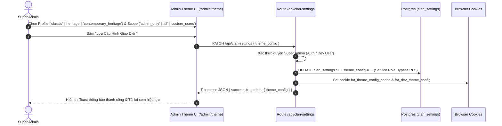
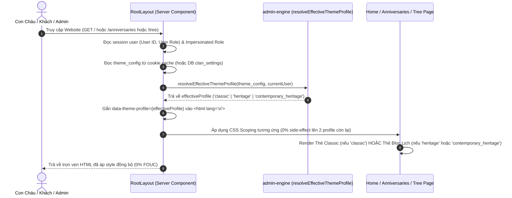
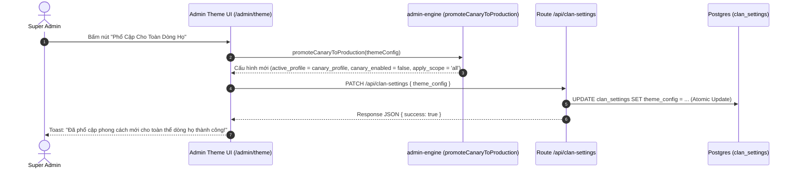

# ĐẶC TẢ KỸ THUẬT: MILESTONE 9 - CLAN DESIGN PROFILES & MODERN VIETNAMESE HERITAGE ANNIVERSARY BLOC

> **Trạng thái:** DỰ THẢO CHỜ DUYỆT (Draft - Ready for Review)  
> **Tài liệu tham chiếu:**  
> - `docs/01_Architecture-Blueprint.md`  
> - `docs/03_DB-Schema.md`  
> - `docs/14_Micro-Spec_Milestone_5_Anniversaries_WebPush_Cron.md`  
> - `docs/16_Micro-Spec_Milestone_7_Admin_Portal_Reorganization.md`  
> - `.agents/handoff/thiet-ke-lai-giao-dien-lich-gio.md`  
> - `.agents/brain/lessons_learned.md`

_Tài liệu này dùng để giới hạn Context Window. AI chỉ được phép đọc, suy luận và sinh code cho ĐÚNG các file được đề cập trong đây._

---

## 1. QUY TẮC NGHIÊM NGẶT (STRICT CONSTRAINTS)

- **Thư viện cho phép:** Không cài thêm thư viện UI bên ngoài. Sử dụng chuẩn hiện có: Next.js 14+ (App Router), React 18, TailwindCSS, Lucide Icons, `cookies()` của Next.js Server Components.
- **Tính Bất Biến Kiến Trúc [R-SPEC.INVARIANT]:**
  - **Layout Shell:** Mọi màn hình Quản trị (`/admin/theme`, `/admin/kinship`, `/admin/governance`, `/admin/roles`) bắt buộc sử dụng chuẩn `AdminShell` (Sidebar 256px + Fluid Canvas toàn màn hình), tuyệt đối CẤM dùng container đóng hộp `max-w-5xl` ngoài cùng gây co thắt bố cục.
  - **Navigation Model:** Bổ sung menu item độc lập `/admin/theme` ("Giao Diện & Profile") trên `AdminSidebar.tsx`. Tuyệt đối không dùng Tab ngang `activeTab` gây co giật layout.
  - **Geometry & Tokens (Anti-Pill & Anti-Bubble - Toàn Diện Toàn Hệ Thống):**
    * **Profile `classic` (Tối giản Hiện đại):** Giữ góc bo mềm mại (`--radius-card: 1rem` [16px], `--radius-control: 0.5rem` [8px]).
    * **Profile `heritage` (Di sản Mực thước):** **Góc bo tròn ít hơn rõ rệt** (`--radius-card: 0.375rem` [6px], `--radius-control: 0.25rem` [4px]). Thiết kế vuông vắn, dứt khoát, đĩnh đạc như góc cạnh tờ lịch bloc xé tay truyền thống, hoành phi câu đối và bia đá; tuyệt đối CẤM bo cong lớn `1.25rem` (20px) gây hiệu ứng bóng bóng (bubbly) phá vỡ tính uy nghiêm cổ kính.
    * **Strict Whitelist duy nhất cho `rounded-full`:** Chỉ cho phép với Avatar tròn (`w-X h-X rounded-full object-cover`), Đèn báo vi mô (`w-1.5 h-1.5 rounded-full`) và Toggle switch thumb.
    * **LỆNH CẤM TUYỆT ĐỐI:** CẤM bọc bất kỳ văn bản, nhãn phân loại (badges/tags/chips) hoặc nút bấm (buttons) nào trong class `rounded-full`.
    * **Phân cấp Typography bằng dấu chấm giữa `·`:** Loại bỏ hoàn toàn thói quen vibe-coding dán nhãn viên thuốc. Thẻ cây (`MemberNode`) xóa bỏ chữ `Còn sống`/`Đã mất`, dùng chấm vi mô `w-1.5 h-1.5` và niên đại di sản (`1920 – 1985`). Phân hệ `/admin/kinship` và `/kinship` xóa sạch 100% emoji rác, thay bằng Segmented Filter Bar và Lucide Icons.
  - **Unified RBAC:** Phân quyền lưu cấu hình giới hạn nghiêm ngặt cho `super_admin`.
- **Nguyên Tắc Bảo Toàn Thương Hiệu (Brand Sovereignty Rule):**
  - Profile giao diện chỉ thay đổi **Phong cách Bố cục & Trình bày (Presentation / Layout Style)**, KHÔNG ĐƯỢC làm đổi màu nhận diện chủ đạo của thương hiệu dòng họ.
  - Màu chủ đạo của toàn hệ thống (Logo, Tên Dòng Họ `{clanName}`, Navbar, Nút hành động chính) **BẮT BUỘC PHẢI LÀ XANH LỤC BẢO (`emerald-600` / gradient `from-emerald-700 via-emerald-600 to-teal-600`)**.
  - Việc đổi màu toàn bộ chủ đề cho sự kiện lễ hội/chào mừng phải là một phân hệ tính năng riêng sau này, không được gộp vào đây.
- **Quy Tắc Kiến Trúc Rào Chắn Mã Nguồn (System-wide Code Guards):**
  - **[R-ARCH.DOMAIN_SERVICE] (Chính Sách Dịch Vụ Nghiệp Vụ Duy Nhất):** Tuyệt đối CẤM việc query DB và tính toán nghiệp vụ phân tán rải rác ở nhiều Server Components hay API Routes. Toàn bộ logic lấy dữ liệu Lịch Giỗ, nạp cấu hình phân chi `branches`, quan hệ hôn phối `spouse_relations` và tính toán ngày giỗ BẮT BUỘC gom về `src/lib/services/anniversary.service.ts`. Cả `src/app/page.tsx` và `src/app/api/anniversaries/route.ts` đều phải gọi chung một service này.
  - **[R-UI.SSOT_PREVIEW] (Nguồn Chân Lý Duy Nhất Cho Xem Trước):** Mọi khu vực Live Preview / Demo (đặc biệt trong `/admin/theme`) BẮT BUỘC phải import và tái sử dụng trực tiếp Production Component (`AnniversaryBlocCard`) cùng bộ dữ liệu mẫu chuẩn hóa (`src/fixtures/anniversary-fixtures.ts`). Tuyệt đối CẤM tự vẽ mockup HTML/CSS thô sơ giả lập.
  - **[R-DESIGN.TOKENS] (Semantic Tokens First - Cấm Hardcode Hình Học):** CẤM hardcode class `rounded-2xl` hoặc `rounded-xl` bừa bãi trên các surface chính. Bắt buộc dùng semantic token `rounded-card` (nối với CSS Variable `--radius-card`). Khi chuyển Theme Profile giữa Classic và Heritage, toàn bộ card trên hệ thống (Home, Admin, Banner, Modal) phải tự động co/dãn bo góc đồng loạt.
- **Đồng Bộ Trục Gióng (Grid Alignment):**
  - Thẻ Spotlight Lịch Giỗ trang chủ bắt buộc dùng `max-w-3xl` (thay vì `max-w-xl` 576px) để gióng thẳng hàng tuyệt đối với Khung Hero và Banner PWA, xóa bỏ hoàn toàn lỗi "thắt eo" bố cục.
- **Zero-FOUC (Chống nháy giao diện khi tải trang):** Phân giải profile giao diện hiệu lực (`effectiveProfile`) trên Server Component (`src/app/layout.tsx`), gắn `data-theme-profile` trực tiếp lên thẻ `<html>` trong HTML response ban đầu, kết hợp đệm cookie `fat_theme_config_cache` (maxAge 300s) và `fat_dev_theme_config`.

---

## 2. DATABASE & MODELS

### 2.1. Migration DDL
- **File:** `supabase/migrations/20260930000000_add_theme_config.sql`
- **DDL:**
  ```sql
  -- Bổ sung cột theme_config vào bảng clan_settings
  ALTER TABLE public.clan_settings
  ADD COLUMN IF NOT EXISTS theme_config JSONB NOT NULL 
  DEFAULT '{"active_profile": "classic", "apply_scope": "all", "allowed_user_ids": []}'::jsonb;
  ```

### 2.2. TypeScript Definitions
- **File:** `src/types/database.ts`
- **Schema Fields:**
  ```typescript
  export type DesignProfileId = 'classic' | 'heritage' | 'contemporary_heritage';

  export type ThemeApplyScope = 'all' | 'admin_only' | 'custom_users';

  export interface ClanThemeConfig {
    active_profile: DesignProfileId;      // Giao diện chính thức toàn dòng họ (Base Production Theme)
    canary_enabled?: boolean;             // Cờ bật/tắt chế độ thử nghiệm (mặc định false)
    canary_profile?: DesignProfileId;     // Giao diện thử nghiệm có điều kiện (Canary Preview Theme)
    apply_scope: ThemeApplyScope;         // 'all' (tắt canary) | 'admin_only' | 'custom_users'
    allowed_user_ids: string[];           // Whitelist user IDs được tham gia thử nghiệm
  }
  ```
- **Cập nhật interface `ClanSettings`:**
  ```typescript
  export interface ClanSettings {
    // ... các trường hiện có ...
    theme_config?: ClanThemeConfig;
  }
  ```
- **File:** `src/types/anniversary.ts`
  ```typescript
  export interface AnniversaryMemberItem {
    // ... các trường hiện có ...
    branch_name?: string | null; // Tên chi lá trực tiếp, VD: "Chi 2"
    branch_path?: string | null; // Đường dẫn phân cấp đầy đủ, VD: "Ngành 1 · Chi 2"
  }

  export interface AnniversaryOptions {
    // ... các trường hiện có ...
    branches?: BranchNode[];
    spouseRelations?: SpouseRelationRecord[];
  }
  ```

---

## 3. SƠ ĐỒ LUỒNG LOGIC (SEQUENCE DIAGRAM - MERMAID)

### 3.1. Luồng Cập Nhật Theme Profile Trong Quản Trị (Hỗ Trợ 3 Profile Song Song)


### 3.2. Luồng Phân Giải Theme Hiệu Lực Không Gây Nháy (Zero-FOUC SSR)


### 3.3. Luồng Phổ Cập Giao Diện 1-Click (1-Click Canary Promotion)


---

## 4. BACKEND LOGIC / API

### 4.1. Lõi Phân Giải Theme Engine (`src/lib/admin/admin-engine.ts`)
- **Hằng số mặc định:**
  ```typescript
  export const DEFAULT_THEME_CONFIG: ClanThemeConfig = {
    active_profile: 'classic',
    canary_enabled: false,
    canary_profile: 'contemporary_heritage',
    apply_scope: 'all',
    allowed_user_ids: [],
  };
  ```
- **Hàm phân giải an toàn (fallback khi dữ liệu khuyết thiếu - Hỗ trợ 2-Tier):**
  ```typescript
  export function resolveThemeConfig(config?: Partial<ClanThemeConfig> | null): ClanThemeConfig {
    if (!config || typeof config !== 'object') {
      return { ...DEFAULT_THEME_CONFIG };
    }
    const active_profile: DesignProfileId =
      config.active_profile === 'heritage'
        ? 'heritage'
        : config.active_profile === 'contemporary_heritage'
          ? 'contemporary_heritage'
          : 'classic';

    const canary_profile: DesignProfileId =
      config.canary_profile === 'heritage'
        ? 'heritage'
        : config.canary_profile === 'classic'
          ? 'classic'
          : 'contemporary_heritage';

    const apply_scope: ThemeApplyScope =
      config.apply_scope === 'admin_only' || config.apply_scope === 'custom_users'
        ? config.apply_scope
        : 'all';

    const canary_enabled: boolean =
      typeof config.canary_enabled === 'boolean'
        ? config.canary_enabled
        : (apply_scope === 'admin_only' || apply_scope === 'custom_users');

    const allowed_user_ids: string[] = Array.isArray(config.allowed_user_ids)
      ? config.allowed_user_ids.filter((id): id is string => typeof id === 'string')
      : [];

    return {
      active_profile,
      canary_enabled,
      canary_profile,
      apply_scope,
      allowed_user_ids,
    };
  }
  ```
- **Hàm tính toán Theme Profile hiệu lực (`resolveEffectiveThemeProfile`):**
  ```typescript
  export function resolveEffectiveThemeProfile(
    config?: Partial<ClanThemeConfig> | null,
    currentUser?: { id?: string; role?: UserRole; isSuperAdmin?: boolean } | null
  ): DesignProfileId {
    const resolved = resolveThemeConfig(config);

    // Nếu Canary không bật hoặc scope là 'all' -> 100% người dùng nhận Giao Diện Chính Thức (active_profile)
    if (!resolved.canary_enabled || resolved.apply_scope === 'all') {
      return resolved.active_profile;
    }

    // Nhóm thử nghiệm: Super Admin HOẶC tài khoản nằm trong Whitelist
    const isEligibleForCanary =
      currentUser?.isSuperAdmin ||
      (resolved.apply_scope === 'custom_users' &&
        !!currentUser?.id &&
        resolved.allowed_user_ids.includes(currentUser.id));

    if (isEligibleForCanary) {
      return resolved.canary_profile || resolved.active_profile;
    }

    // Toàn bộ con cháu và khách ngoài nhóm thử nghiệm LUÔN LUÔN nhận Giao Diện Chính Thức của dòng họ (Zero Regression!)
    return resolved.active_profile;
  }
  ```
- **Hàm thao tác nguyên tử 1-Click Phổ Cập Cho Toàn Dòng Họ (`promoteCanaryToProduction`):**
  ```typescript
  export function promoteCanaryToProduction(config: ClanThemeConfig): ClanThemeConfig {
    const target = config.canary_profile || config.active_profile;
    return {
      ...config,
      active_profile: target,
      canary_enabled: false,
      apply_scope: 'all',
    };
  }
  ```

### 4.2. API Route `src/app/api/clan-settings/route.ts`
- **GET:**
  - Bổ sung `theme_config` vào đối tượng `data` trả về. Đọc ưu tiên từ cookie dev `fat_dev_theme_config` hoặc `clan_settings.theme_config`, fallback `DEFAULT_THEME_CONFIG`.
- **PATCH:**
  - Kiểm tra quyền Super Admin (nếu không phải $\rightarrow$ 403 Forbidden).
  - Đọc `body.theme_config`. Nếu có, chuẩn hóa qua `resolveThemeConfig(body.theme_config)`.
  - Cập nhật vào DB Postgres bằng `createAdminClient()` (Service Role) để bypass RLS.
  - Ghi đè cookie `fat_dev_theme_config` (maxAge 30 ngày) và `fat_theme_config_cache` (maxAge 300s, path `/`, sameSite `lax`).
  - Trả về payload cập nhật thành công.

---

## 5. FRONTEND UI & LOGIC

### 5.1. Màn Hình Quản Trị Giao Diện (`src/app/admin/theme/page.tsx`)
- **Route:** `/admin/theme`
- **Tích hợp Shell:** Nằm trọn vẹn trong `AdminShell` thông qua Sidebar.
- **State quản lý:**
  - `config`: `ClanThemeConfig` (lưu cấu hình hiện tại).
  - `userList`: Danh sách người dùng hệ thống (`UserProfile[]`) để phục vụ whitelist khi chọn `custom_users`.
  - `isSaving`, `statusMessage`, `previewProfile`: Hỗ trợ live preview trực quan.
- **Giao diện lựa chọn:**
  - **Khối 1 — Lựa Chọn Profile:** Hai thẻ lớn đối chiếu trực tiếp:
    1. *Classic Minimalist:* Tông ngọc lục bảo thanh thoát, phong cách thẻ trắng hiện đại.
    2. *Modern Vietnamese Heritage:* Tông Đỏ son tươi kết hợp Vàng hoàng kim, viền hairline sắc nét, Lịch Bloc truyền thống.
  - **Khối 2 — Phạm Vi Áp Dụng (Rollout Scope):** 3 tùy chọn trực quan:
    1. `Toàn bộ người dùng & khách vãng lai (All)`: Triển khai toàn diện.
    2. `Chỉ Quản trị viên (Admin Only)`: Chế độ Canary kiểm thử an toàn trên dữ liệu thật.
    3. `Chỉ định thành viên (Custom Whitelist)`: Chọn thêm các tài khoản con cháu cụ thể.
  - **Khối 3 — Live Preview:** Trực quan hóa ngay trên trang một thẻ Lịch Giỗ mẫu theo phong cách được chọn.
  - **Nút Lưu & Phản Hồi:** Nút "Lưu Cấu Hình Giao Diện" kèm spinner và toast thông báo thành công.

### 5.2. Cập Nhật Menu Admin Sidebar (`src/components/admin/AdminSidebar.tsx`)
- Thêm mục vào nhóm **"VẬN HÀNH & HỆ THỐNG"**:
  ```typescript
  {
    href: '/admin/theme',
    label: 'Giao Diện & Profile',
    icon: Palette, // từ lucide-react
  }
  ```

### 5.3. Tiêm Cấu Hình Zero-FOUC Tại RootLayout (`src/app/layout.tsx`)
- Đọc `theme_config` từ cookie cache hoặc DB.
- Tính toán `effectiveProfile = resolveEffectiveThemeProfile(themeConfig, currentUser)`.
- Đặt thuộc tính trên thẻ HTML:
  ```tsx
  <html lang="vi" data-theme-profile={effectiveProfile} className={`h-full ${beVietnamPro.variable}`} suppressHydrationWarning>
  ```
- Điều chỉnh lớp selection:
  ```tsx
  <body className={`antialiased min-h-screen flex flex-col font-sans ${
    effectiveProfile === 'heritage'
      ? 'selection:bg-red-100 selection:text-red-950 dark:selection:bg-red-950/80 dark:selection:text-amber-200'
      : 'selection:bg-emerald-100 selection:text-emerald-900'
  }`}>
  ```

### 5.4. Định Nghĩa Design Tokens Toàn Cục & Cục Bộ (`src/app/globals.css`)
- **Tôn trọng Brand Identity:** Tuyệt đối không ghi đè màu chủ đạo toàn hệ thống sang màu đỏ. Màu nhận diện thương hiệu dòng họ (H1, Logo, Header, Navbar, CTA chính) vẫn giữ nguyên tông Xanh Lục Bảo `emerald-600`.
- Biến CSS và token khi `[data-theme-profile="heritage"]` phục vụ chuẩn hóa Phương Án A (Clean Lunar Red):
  - `--heritage-bloc-today`: Tông đỏ son (`#dc2626` / `#b91c1c`) cho đỉnh bloc ngày lễ/ngày giỗ hôm nay.
  - `--heritage-bloc-tomorrow`: Tông vàng hoàng kim (`#f59e0b` / `#fbbf24`) cho ngày mai giỗ.
  - `--heritage-bloc-future`: Tông Xanh Ngọc Lục Bảo Trầm (`#065f46` / `bg-emerald-800 text-white`) cho đỉnh bloc các ngày tương lai, thay thế hoàn toàn màu xám than thô cứng, tạo sự kết nối bền chặt với nhận diện cội nguồn dòng họ.
  - `--heritage-lunar-red`: Sắc đỏ son truyền thống (`#dc2626`) cho con số ngày âm lịch trên nền trắng sứ tờ lịch.

### 5.5. Đưa Thiết Kế Lịch Giỗ Bloc Vào Production (Quy Chuẩn Tinh Chỉnh Thẩm Mỹ & Cấu Hình Ngành/Chi)
- **Chuẩn Hóa Phương Án A (Sắc Đỏ Son Trên Nền Trắng Sứ Đồng Nhất):**
  - **Triệt tiêu dải chân vàng kem ngà:** Bỏ hoàn toàn dải nền `bg-amber-100` ở Desktop Timeline. Tất cả các vị trí hiển thị ngày âm (Home Spotlight, Desktop Timeline, Mobile Timeline) quy về một chuẩn duy nhất:
    * **Con số ngày âm:** Luôn mang màu **ĐỎ SON TRUYỀN THỐNG (`text-red-600 dark:text-red-400 font-black`)** nổi bật trên nền trắng sứ của tờ lịch.
    * **Chữ ngữ cảnh ngày/tháng/năm âm:** Luôn mang màu **Xám chì thanh lịch (`text-slate-600 dark:text-slate-400 font-medium`)**.
- **Tách Component & Chuẩn Hóa Bố Cục:**
  - `src/components/anniversaries/AnniversaryBlocCard.tsx` (Thẻ Spotlight Lịch Giỗ Trang Chủ):
    - **Trục Gióng (Grid Alignment):** Tăng từ `max-w-xl` (576px) lên `max-w-3xl` (768px) để gióng thẳng hàng tuyệt đối với Khung Hero và Banner PWA, xóa bỏ triệt để lỗi "thắt eo" bố cục.
    - **Hình học Anti-Bubble:** Hạ góc bo từ `rounded-2xl` (16px) xuống `rounded-xl` (12px) cho khung ngoài, `rounded-lg` cho khối con bên trong.
    - **Nút CTA Chính:** Mang màu Xanh Lục Bảo chuẩn `bg-emerald-600 hover:bg-emerald-700 text-white font-medium` ở cả Desktop và Mobile.
    - **Bố Cục Âm Lịch Thẻ Home Tối Ưu Hóa Riêng Biệt Cho PC và Mobile:**
      * *Phiên bản Desktop (PC - md+):* Bố cục **Lệch Trái 2 Dòng (Left-Aligned 2-Row Split)** trong cột 185px. Số ngày âm đỏ to (`text-3xl font-black text-red-600`) căn trái cao 2 dòng; kề bên phải gồm 2 dòng: dòng trên là `tháng {lunar_month} âm lịch` (`text-xs font-bold text-slate-800`), dòng dưới là `Năm {lunar_year_name}` (`text-[11px] font-medium text-slate-500`). Toàn bộ cụm căn giữa trong lòng cột 185px.
      * *Phiên bản Mobile (< md):* Bố cục **Dàn Ngang 2 Mép (`justify-between`)** tận dụng bề ngang màn hình điện thoại: mép trái là `19 tháng {lunar_month} âm lịch` (số 19 đỏ son to `text-2xl`, tháng kề bên cùng baseline), mép phải là `Năm {lunar_year_name}` (`text-right text-[11px]`), đồng bộ 100% với ảnh chụp thiết kế.
    - **Hiển Thị Ngành & Chi:** Tại dòng thông tin phụ, tích hợp Ngành/Chi cạnh Thế hệ theo chuẩn Anti-Pill Typography: `Đời thứ {generation} · {branch_path || branch_name} · Hưởng thọ {age}t`.
  - `src/components/anniversaries/AnniversaryBlocTimeline.tsx` (Danh Sách Ngày Giỗ Trang `/anniversaries`):
    - **Hình học Anti-Bubble:** Giảm góc bo thẻ từ `rounded-2xl` về `rounded-xl`.
    - **Đỉnh Khối Ngày (Bloc Header):** 
      * Hôm nay: Đỏ son `bg-red-600 text-white`.
      * Ngày mai: Vàng hoàng kim `bg-amber-400 text-slate-950 font-black`.
      * Các ngày tương lai: **Xanh Ngọc Lục Bảo Trầm (`bg-emerald-800 text-white dark:bg-emerald-900`)** thay thế màu xám than.
    - **Đồng Nhất Nền Trắng Sứ Ngày Âm:** Đổi dải chân PC thành nền trắng sứ với số ngày âm màu đỏ son: `<span className="text-red-600 font-black">{day}/{month}</span> <span className="text-slate-600 font-medium">Âm Lịch</span>`.
    - **Dọn Sạch Header PC:** Loại bỏ chữ `| Năm Bính Ngọ` lơ lửng.
    - **Hiển Thị Ngành & Chi:** Hiển thị `Đời {generation} · {branch_path || branch_name} · Hưởng thọ {age}t` trên cả PC và Mobile.
  - `src/app/page.tsx`:
    - Khôi phục màu H1 tiêu đề dòng họ `{clanName}` và nhãn Eyebrow về gradient Xanh Lục Bảo chuẩn (`bg-gradient-to-r from-emerald-700 via-emerald-600 to-teal-600`), bảo toàn 100% Brand Sovereignty.
    - Gọi hàm tập trung `getUpcomingAnniversariesFeed` từ `src/lib/services/anniversary.service.ts`.
  - `src/app/anniversaries/page.tsx`:
    - Tiêu thụ trực tiếp dữ liệu từ API `/api/anniversaries` vốn đã được `anniversary.service.ts` gắn sẵn `branch_path`. Xóa bỏ hoàn toàn việc lưu state rỗng và tự tính toán phân chi trên Client Component.
- **Tích hợp có điều kiện:**
  - Tại `src/app/page.tsx`: Kiểm tra `effectiveProfile === 'heritage'` $\rightarrow$ render `AnniversaryBlocCard`; ngược lại render Classic Spotlight nguyên bản.
  - Tại `src/app/anniversaries/page.tsx`: Kiểm tra `effectiveProfile === 'heritage'` $\rightarrow$ render `AnniversaryBlocTimeline`; ngược lại render Classic Timeline nguyên bản.

### 5.6. KIẾN TRÚC RÀO CHẮN 4 TẦNG & TÁI CẤU TRÚC TOÀN DIỆN (SYSTEM-WIDE SSOT ARCHITECTURE)

Nhằm chấm dứt triệt để căn bệnh "cát cứ ốc đảo, code chắp vá và hardcode hình học phân tán", hệ thống thiết lập 4 Tầng Rào Chắn Mã Nguồn bắt buộc:

#### 5.6.1. Tầng Nghiệp Vụ & Dữ Liệu Tập Trung (Domain Service):
- **Tệp mới:** `src/lib/services/anniversary.service.ts`
- **Hàm cốt lõi:**
  ```typescript
  export async function getUpcomingAnniversariesFeed(options?: {
    daysAhead?: number;
    viewerMemberId?: string;
    branch?: string;
    scope?: string;
    region?: KinshipRegion;
  }): Promise<AnniversaryDayGroup[]>
  ```
- **Trách nhiệm duy nhất:**
  - Thực hiện nạp song song: `clan_settings` (lấy cây `branches`), `spouse_relations` (lấy quan hệ hôn phối), và `members`.
  - Tính toán ngày giỗ Âm - Dương chuẩn UTC+7 thông qua `getUpcomingAnniversaries`.
  - Tự động phân giải đường dẫn phân cấp `branch_path` (`"Đời 11 · Ngành 1 · Chi 1"`) cho từng người giỗ.
  - Lọc theo phạm vi thân tộc mở rộng (`scope === 'my_lineage'`) nếu người xem có liên kết hồ sơ.
- **Quy tắc tiêu thụ:**
  - `src/app/page.tsx` và `src/app/api/anniversaries/route.ts` **BẮT BUỘC** gọi chung hàm này. CẤM tự ý query DB riêng biệt.
  - `src/app/anniversaries/page.tsx`: Dọn sạch các state rỗng `clanBranches`, `allMembers`, `spouseRelations`. Ở cả 2 chế độ hiển thị Classic và Heritage, component chỉ đọc trường `member.branch_path || member.branch_name` đã có sẵn trong DTO.

#### 5.6.2. Tầng Thành Phần Dùng Chung & Shared Fixtures Factory:
- **Tệp mới:** `src/fixtures/anniversary-fixtures.ts`
- **Nội dung:** Xuất khẩu 2 bộ Mock Fixtures chuẩn mực:
  - `MOCK_ANNIVERSARY_GROUP_TODAY`: Nhóm ngày giỗ Hôm Nay (days_left = 0), có đầy đủ danh xưng, chi ngành (`Đời 4 · Ngành 1 · Chi 1`).
  - `MOCK_ANNIVERSARY_GROUP_UPCOMING`: Nhóm ngày giỗ tương lai (days_left = 12, tháng tương lai).
- **Mẫu Tự Chứa Xem Trước (Self-Contained Preview Pattern):**
  - Trong `src/components/anniversaries/AnniversaryBlocCard.tsx`, xuất khẩu thêm sub-component:
    ```tsx
    export function AnniversaryBlocCardPreview({ variant = 'today' }: { variant?: 'today' | 'upcoming' }) {
      const group = variant === 'today' ? MOCK_ANNIVERSARY_GROUP_TODAY : MOCK_ANNIVERSARY_GROUP_UPCOMING;
      return <AnniversaryBlocCard group={group} />;
    }
    ```
- **Tái Cấu Trúc `/admin/theme`:**
  - Xóa bỏ 100% khối mã HTML mockup thô sơ tại `src/app/admin/theme/page.tsx` (dòng 467-513).
  - Thay thế bằng: `<AnniversaryBlocCardPreview variant="today" />`. Đảm bảo Live Preview luôn là hình ảnh phản chiếu 100% của component thật trên Production.

#### 5.6.3. Tầng Thị Giác & Dynamic Design Tokens (Bo Góc & Màu Sắc Động - Phòng Thủ Toàn Cầu):
- **Tệp:** `src/app/globals.css`
  - Khai báo token hình học động theo `data-theme-profile` cho toàn bộ thang đo Tailwind (`card`, `control`, `2xl`, `xl`, `lg`, `md`):
    ```css
    :root {
      /* Classic: Phong cách hiện đại, bo cong mềm mại */
      --radius-sm: 0.25rem;       /* 4px */
      --radius-md: 0.375rem;      /* 6px */
      --radius-lg: 0.5rem;        /* 8px */
      --radius-xl: 0.75rem;       /* 12px */
      --radius-2xl: 1rem;         /* 16px */
      --radius-3xl: 1.5rem;       /* 24px */
      --radius-card: 1rem;        /* 16px */
      --radius-control: 0.5rem;   /* 8px */
    }

    html[data-theme-profile="heritage"] {
      /* Heritage: Phong cách di sản, vuông vắn mực thước chuẩn tờ lịch bloc */
      --heritage-accent-red: #dc2626;
      --heritage-accent-gold: #f59e0b;
      --radius-sm: 0.125rem;      /* 2px */
      --radius-md: 0.25rem;       /* 4px */
      --radius-lg: 0.25rem;       /* 4px */
      --radius-xl: 0.375rem;      /* 6px */
      --radius-2xl: 0.375rem;     /* 6px */
      --radius-3xl: 0.5rem;       /* 8px */
      --radius-card: 0.375rem;    /* 6px */
      --radius-control: 0.25rem;  /* 4px */
    }
    ```
- **Tệp:** `tailwind.config.ts`
  - Ánh xạ trực tiếp toàn bộ thang đo `borderRadius` của Tailwind vào CSS Variables, đảm bảo 100% tất cả các màn hình (kể cả nơi dùng `rounded-2xl`, `rounded-xl`, `rounded-lg`) đều tự động chuyển mình đồng loạt theo Theme Profile:
    ```typescript
    borderRadius: {
      none: '0px',
      sm: 'var(--radius-sm, 0.125rem)',
      DEFAULT: 'var(--radius-md, 0.25rem)',
      md: 'var(--radius-md, 0.375rem)',
      lg: 'var(--radius-lg, 0.5rem)',
      xl: 'var(--radius-xl, 0.75rem)',
      '2xl': 'var(--radius-2xl, 1rem)',
      '3xl': 'var(--radius-3xl, 1.5rem)',
      card: 'var(--radius-card, 1rem)',
      control: 'var(--radius-control, 0.5rem)',
      full: '9999px',
    }
    ```
- **Chuẩn Hóa Component:**
  - `src/components/anniversaries/AnniversaryBlocCard.tsx`:
    - Đổi màu đỉnh tháng ngày tương lai sang **Xanh Ngọc Lục Bảo Trầm (`bg-emerald-800 text-white font-bold`)**, xóa sổ màu xám than `bg-slate-700`.
    - Đổi class bao ngoài thành `rounded-card`.
  - Thay thế các class hardcode `rounded-2xl` trên các surface chính:
    - `src/components/home/IdentityContextWidget.tsx` $\rightarrow$ `rounded-card`.
    - `src/components/pwa/InstallPwaButton.tsx` (banner trang chủ) $\rightarrow$ `rounded-card`.
    - Khung Preview và Cards trong `src/app/admin/theme/page.tsx` $\rightarrow$ `rounded-card`.

#### 5.6.4. Tầng Rào Chắn Kiểm Chứng Tự Động (Architecture Guard Tests):
- **Tệp mới:** `tests/architecture-ssot.test.ts`
- **Tích hợp vào lệnh:** `npm.cmd test`
- **Bộ 3 Rào Chắn Khóa Mã Tự Động:**
  1. *SSOT Preview Guard:* Quét tĩnh AST/Regex toàn bộ file `src/app/admin/theme/page.tsx`. Nếu phát hiện có chuỗi giả lập ngày giỗ tĩnh (như `"19/08 Âm Lịch"`) hoặc không import component thật từ `@/components/anniversaries/AnniversaryBlocCard` $\rightarrow$ **FAIL TEST**.
  2. *Design Token Guard:* Quét các surface card chính (`AnniversaryBlocCard.tsx`, `IdentityContextWidget.tsx`, `InstallPwaButton.tsx`). Nếu còn class cứng `rounded-2xl` hoặc `rounded-xl` thay vì `rounded-card` $\rightarrow$ **FAIL TEST**.
  3. *Domain Service Guard:* Quét `src/app/page.tsx` và `src/app/api/anniversaries/route.ts`. Bắt buộc phải import và gọi qua `getUpcomingAnniversariesFeed` từ `@/lib/services/anniversary.service` $\rightarrow$ **FAIL TEST nếu tự query phân tán**.

#### 5.6.5. Tinh Chỉnh Kích Thước Lịch Bloc & Chuẩn Hóa Nhịp Điệu Bo Góc Mạnh (Border Radius Tuning & Bloc Proportions):
- **1. Typography & Tỷ Lệ Tờ Lịch Bloc (`AnniversaryBlocCard.tsx`):**
  - **Số ngày Dương lịch (Mobile):** Nâng cấp từ `text-5xl` (48px) lên **`text-7xl sm:text-8xl` (72px - 96px)** `font-black tracking-tight leading-none text-slate-950 dark:text-white`.
  - **Thứ trong tuần (Mobile):** Nâng cấp từ `text-sm` (14px) lên **`text-base sm:text-lg` (16px - 18px)** `font-bold tracking-wide mt-2 text-slate-800 dark:text-slate-200`.
  - **Khoảng thở dọc (Mobile):** Tăng từ `py-4` lên **`py-5 sm:py-6`**, đảm bảo khoảng thở cân đối với dải răng cưa và khối Âm lịch bên dưới.
  - **Desktop (Cột 185px):** Cân đối ngày Dương lên `text-6xl sm:text-7xl font-black`, thứ lên `text-sm font-bold mt-1.5`.
  - **Nút hành động:** Thay `rounded-lg` bằng semantic token `rounded-control`.
- **2. Khắc Phục Lỗi Nạp Ngành & Chi Trong Domain Service (`src/lib/services/anniversary.service.ts`):**
  - Sửa tên cột SQL truy vấn `clan_settings` từ `default_kinship_region` thành **`regional_preset`** (tên chuẩn xác trong CSDL PostgreSQL).
  - Đảm bảo `branches` và `spouse_relations` luôn được nạp đầy đủ khi gọi qua `/api/anniversaries`, phân giải chính xác `branch_path` (`Đời 11 · Ngành 1 · Chi 1`).
  - Trong `src/components/anniversaries/AnniversaryBlocTimeline.tsx`: Bổ sung fallback `resolveMemberBranchHierarchy` để đảm bảo 100% hiển thị phân cấp Ngành/Chi cả khi data từ API có độ trễ.
- **3. Chuẩn Hóa Bo Góc Ít Hơn, Mực Thước Cho Profile Heritage Đối Chiếu Với Classic (`globals.css` & Components):**
  - **Profile `heritage` (Mực Thước Di Sản):** Quy chuẩn **góc bo tròn ít hơn rõ rệt** với `--radius-card: 0.375rem` (6px) và `--radius-control: 0.25rem` (4px). Khung thẻ và các khối ngày mang đường nét vuông vắn, đĩnh đạc, chắc chắn chuẩn tờ lịch bloc xé tay truyền thống, xóa sổ hoàn toàn cảm giác tròn vo (bubbly) của card 20px.
  - **Profile `classic` (Tối Giản Hiện Đại):** Giữ nguyên góc bo mềm mại hiện đại với `--radius-card: 1rem` (16px) và `--radius-control: 0.5rem` (8px).
  - **Đồng bộ hóa Semantic Tokens toàn diện:**
    - `src/components/pwa/InstallPwaButton.tsx`: Nút bấm chuyển từ `rounded-xl` sang `rounded-control`, banner dùng `rounded-card`.
    - `src/components/anniversaries/AnniversaryBlocTimeline.tsx`: Khung thẻ chuyển từ `rounded-xl` sang `rounded-card`, nút `[Xem Cây]` chuyển sang `rounded-control`.
    - `src/components/anniversaries/AnniversaryBlocCard.tsx`: Khung dùng `rounded-card`, nút bấm dùng `rounded-control`.
    - Khắc phục triệt để tình trạng nút 8px, nút 12px cọc cạch trên cùng một màn hình; khi chuyển đổi profile, toàn bộ giao diện tự động chuyển phong cách từ vuông vắn mực thước (`heritage`) sang bo cong mềm mại (`classic`).
- **4. Nâng Cấp Tỷ Lệ & Typography Cột Lịch Bloc Mobile (`AnniversaryBlocTimeline.tsx`):**
  - Mở rộng bề ngang cột bloc từ `w-[58px]` lên **`w-[76px]`** nhằm tạo không gian đĩnh đạc, cân đối cho tờ lịch mini.
  - **Đỉnh tháng:** Nâng từ `text-[9px]` lên **`text-xs font-black py-1.5`** (12px), đảm bảo rõ nét và tương phản cao.
  - **Số ngày Dương:** Nâng từ `text-xl` (20px) lên **`text-3xl font-black text-slate-950 dark:text-white leading-none py-1`** (30px), bề thế chuẩn tờ lịch bloc xé tay thật, người lớn tuổi nhìn phát thấy ngay.
  - **Thứ trong tuần:** Nâng từ `text-[8px]` dính mép lên **`text-[10px] font-bold uppercase mt-1 tracking-wider text-slate-600 dark:text-slate-400`** (10px).
- **5. Chuẩn Hóa Các Màn Hình Trọng Điểm (`/kinship`, `/admin/kinship`, `/tree`):**
  - Rà soát và chuyển đổi triệt để các card và controls sang `rounded-card` và `rounded-control`:
    - `src/app/kinship/page.tsx`: Card bộ lọc, selector, nút hoán đổi và card kết quả.
    - `src/app/admin/kinship/page.tsx`: Card mẫu vùng miền 3 miền, container cấu hình.
    - `src/components/tree/TreeToolbar.tsx`: Dropdown chọn Gốc, thanh công cụ, popover tùy chọn phả đồ.
    - Kết hợp cùng Tầng 1 (Global Tailwind Scale Mapping) đảm bảo 100% toàn bộ hệ thống thoát khỏi hoàn toàn căn bệnh "sửa cục bộ".

### 5.7. Kiến Trúc Thanh Lọc Toàn Diện Anti-Pill & Nâng Cấp Thẩm Mỹ Biên Tập (System-wide Anti-Pill & Editorial Cleansing Architecture)

Nhằm xóa bỏ dứt điểm thói quen "vibe coding" (bội thực viên thuốc, nhãn kẹo ngọt, emoji lộn xộn) và nâng tầm hệ thống lên chuẩn mực Biên tập Di sản (Editorial & Vietnamese Heritage Design):

#### 5.7.1. Cây Gia Phả & Thẻ Thành Viên (`MemberNode.tsx`, `GhostNode.tsx`, `FamilyTreeCanvas.tsx`):
1. **Trạng thái Sinh / Tử trên `MemberNode.tsx`:**
   - **Xóa bỏ hoàn toàn nhãn chữ `Còn sống` / `Đã mất` ở góc trên bên phải thẻ.**
   - Thay thế bằng chấm đèn vi mô tinh xảo:
     * Người còn sống: `<span className="w-1.5 h-1.5 rounded-full bg-emerald-500 shrink-0" title="Còn sống" />`.
     * Người đã mất: `<span className="w-1.5 h-1.5 rounded-full bg-slate-400 dark:bg-slate-500 shrink-0" title="Đã mất" />`.
   - Dòng phụ dưới tên (`birthDeathText`):
     * Người đã mất: Hiển thị niên đại di sản trang trọng `1920 – 1985` (hoặc `Sinh 1920 · Mất 1985`).
     * Người còn sống: Hiển thị `Sinh 1985`.
2. **Huy hiệu Cụ Tổ & Khuyết Danh:**
   - Cụ Tổ: Chuyển sang nhãn hình học mực thước `<span className="px-1.5 py-0.5 rounded-control text-[9px] font-bold bg-amber-100 text-amber-900 border border-amber-300">Cụ Tổ</span>` (loại bỏ emoji `Sparkles` rườm rà).
   - Khuyết danh: Chuyển sang `<span className="px-1.5 py-0.5 rounded-control text-[9px] font-bold bg-amber-50 text-amber-800 border border-amber-200">Khuyết danh</span>`.
3. **Phối ngẫu:**
   - Loại bỏ emoji `🌸`, dùng nhãn mực thước: `<span className="px-1 py-0.5 rounded-control text-[9px] font-medium bg-amber-50 text-amber-800 border border-amber-200/60">...</span>`.
4. **`GhostNode.tsx`:**
   - Chuyển pill `rounded-full` sang nhãn chữ nhật nét đứt mực thước `rounded-control text-[9px] font-bold border border-dashed border-amber-400`.
5. **`FamilyTreeCanvas.tsx`:**
   - Hộp thông báo nổi trên đỉnh canvas chuyển từ `rounded-full` sang `rounded-card`.

#### 5.7.2. Công Cụ Tra Cứu Vai Vế (`src/app/kinship/page.tsx`):
1. **Xóa sạch 16 điểm Pill trang trí:**
   - Hero Header: Xóa pill `rounded-full bg-emerald-50 ... ĐỒ THỊ GIA PHẢ VIỆT NAM`. Dùng heading phân cấp tinh giản.
   - Banner kết quả: Xóa pill `rounded-full bg-white/15 ... Quan Hệ Họ Hàng`. Dùng thẻ tiêu đề mực thước `text-xs font-bold tracking-wider text-emerald-100 uppercase`.
   - Sơ đồ hôn phối: Hiển thị trực tiếp danh xưng lớn đậm (`text-base font-extrabold text-emerald-800`), xóa bỏ pill bao quanh `{result.termBtoA}` và `{result.termAtoB}`.
   - Sơ đồ trực hệ & chữ V ngược: Chuyển toàn bộ các nhãn `Đời X`, `Hôn phối`, `Gốc Gần Nhất` sang thẻ hình học mực thước `rounded-control` hoặc phân cách bằng dấu chấm `·`.

#### 5.7.3. Quản Trị Quy Ước Xưng Hô (`src/app/admin/kinship/page.tsx`):
1. **Layout Shell:** Xóa bỏ `max-w-5xl mx-auto`, bung tràn toàn màn hình theo chuẩn `AdminShell`.
2. **Chuẩn Mực Không Icon Trang Trí (Zero-Icon Standard):**
   - **XÓA BỎ 100% ICON KHỎI THANH BỘ LỌC VÀ TIÊU ĐỀ NHÓM.**
   - Tuyệt đối CẤM thay thế emoji bằng các icon Lucide vô nghĩa (`GitBranch`, `Shield`, `Heart`, `Compass`...) gây hiểu sai ngữ nghĩa văn hóa dòng tộc.
   - Bộ lọc chỉ sử dụng văn bản thuần khiết kết hợp số đếm tinh gọn:
     `[ Tất Cả (36) ]  [ Trực Hệ (8) ]  [ Cùng Đời & Dâu Rể (8) ]  [ Bên Nội (8) ]  [ Bên Ngoại (6) ]  [ Dâu & Rể (4) ]  [ Lệch Đời (2) ]`.
   - Toàn bộ 7 nút dàn phẳng phiu trên một hàng, **triệt tiêu hoàn toàn thanh cuộn ngang (horizontal scrollbar)** trên màn hình máy tính.
3. **Bộ lọc Segmented:** Chuyển cụm filter sang **Segmented Filter Bar** mực thước `rounded-control`. Số lượng hiển thị nhẹ nhàng trong ngoặc đơn `(n)` thay vì lồng viên thuốc con.
4. **Tiêu đề nhóm:** Bỏ icon và pill counter `rounded-full`, hiển thị dạng heading thanh lịch kèm subtitle `— n quy ước`.

#### 5.7.4. Các Màn Hình Quản Trị & Dashboard Khác:
1. `src/app/admin/roles/page.tsx`: Thay pill `rounded-full` "GOD MODE" và role badges sang `rounded-control`.
2. `src/app/admin/theme/page.tsx`: Classic Preview Card thay pill "Hôm Nay Giỗ" sang `rounded-control`.
3. `src/components/admin/ClanDashboard.tsx`: Thống kê thành viên chuyển sang typography phân cấp và `rounded-control`.
4. `src/app/page.tsx`: Thẻ đếm ngược ngày giỗ chuyển sang nhãn di sản `rounded-control`.

#### 5.7.5. Thanh Lọc Toàn Diện 100% Emoji Trên Toàn Bộ Hệ Thống (`src/`):
Xóa sạch mọi emoji rác trên 10 tệp giao diện đã kiểm toán:
1. `src/components/auth/PersonalSettingsModal.tsx`: Xóa `🏛️` tại dòng 176 $\rightarrow$ `Toàn dòng họ (Xem tất cả)`.
2. `src/app/login-gate/page.tsx`: Xóa `⚡` tại dòng 113 $\rightarrow$ `Đăng nhập nhanh Dev (Bypass Super Admin)`.
3. `src/app/admin/profile/page.tsx`: Xóa `✨` (dòng 228, 234) và `💡` (dòng 262) $\rightarrow$ Text thuần / nhãn mực thước `Cụ Tổ`.
4. `src/components/modals/MemberFormModal.tsx`: Xóa sạch `🌸`, `🔗`, `🌱`, `❓`, `♂`, `♀`, `⚪`, `🔒`, `⚠️`, `✕`. Thay bằng text thuần hoặc nhãn `rounded-control`.
5. `src/components/tree/MemberDetailDrawer.tsx`: Xóa `🔒`, `🌸`, `❓`.
6. `src/components/modals/ConnectGenealogyModal.tsx`: Xóa `✓`, `⚠️`.
7. `src/components/tree/UnlinkedMembersDrawer.tsx`: Xóa `✓`, `⚠️`.
8. `src/app/admin/features/page.tsx`: Xóa `✓` và `✗` $\rightarrow$ `Đang BẬT:` và `Đang TẮT:`.
9. `src/app/admin/governance/page.tsx`: Xóa `✓` $\rightarrow$ `Đã lưu`.
10. `src/app/admin/import/page.tsx`: Xóa `⚠` $\rightarrow$ Lucide `AlertTriangle` hoặc text thuần.

#### 5.7.6. Triệt Tiêu Toàn Bộ Vết Tích Pill (`rounded-full`) Ngoại Trừ Whitelist:
1. **Nút User trên Navbar (`src/components/auth/AuthButton.tsx`):**
   - Chuyển `rounded-full aspect-square sm:aspect-auto` sang `rounded-control` vuông vắn mực thước, xóa sổ viên thuốc khổng lồ trên Header.
2. **Khung Skeleton Loading (6 tệp):**
   - Chuyển toàn bộ các thanh loading `rounded-full` trong `tree/loading.tsx`, `anniversaries/loading.tsx`, `admin/loading.tsx`, `admin/claims/loading.tsx`, `login-gate/loading.tsx`, `prototype/anniversary/page.tsx` sang `rounded-control` / `rounded-sm`.
3. **Nút đóng và số thứ tự:**
   - Chuyển các nút đóng và huy hiệu số thứ tự trong `MemberDetailDrawer.tsx`, `ConnectGenealogyModal.tsx`, `ReorderChildrenModal.tsx`, `InstallPwaButton.tsx` sang `rounded-control`.

### 5.8. ĐẶC TẢ PROFILE THỨ 3: CONTEMPORARY HERITAGE (DI SẢN ĐƯƠNG ĐẠI SSOT)

Nhằm đáp ứng nhu cầu giao diện Di Sản Đương Đại trang trọng, ấm cúng nhưng chuẩn mực công nghệ SaaS, hệ thống thiết lập Profile thứ 3 độc lập mang mã định danh:

```typescript
active_profile === 'contemporary_heritage'
```

#### 5.8.1. Nguyên Tắc Cách Ly Phạm Vi Tuyệt Đối (Zero Interference Invariant):
- **Bảo toàn 100% hai Profile cũ:** Khi thẻ `<html>` mang `data-theme-profile="classic"` hoặc `"heritage"`, khối CSS của `contemporary_heritage` hoàn toàn ngủ yên, không ảnh hưởng tới bất kỳ class hay giá trị nào của 2 style cũ.
- **Giữ nguyên 100% Layout DOM:** Toàn bộ kích thước khung hình học (`w-[200px] h-[96px]` của Tree Node, `w-[90px] h-[108px]` của Lịch Bloc PC), cấu trúc lưới Grid, Flex, các thẻ HTML và logic hooks giữ nguyên 100%. Sự biến đổi chỉ nằm ở phối màu, viền, bóng và font.

#### 5.8.2. Hệ Thống 10 Trụ Cột Design Tokens Di Sản:
1. **Bậc Phân Tầng Nền (Surfaces & Canvas):**
   - Nền Giấy Dó ngà ấm toàn trang: `--bg-canvas: #FAF8F2;`
   - Thẻ Card trắng sứ: `--bg-surface: #FFFFFF;`
   - Khối lồng phụ bên trong Card: `--bg-sub-surface: #F5F2EA;`
   - Rãnh thanh trượt switch & segmented: `--bg-control: #EFECE4;`
   - Xanh ngọc di sản đỉnh Headerbar: `--bg-brand: #0F382C;`
   - Thanh đen chì Studio Inspector: `--bg-dark-ribbon: #1C1917;`
2. **Hệ Thống Viền Hairline 1px Đá Tự Nhiên (Borders):**
   - Viền thẻ ngoài, khung modal, lịch: `--border-card: #EAE5D9;`
   - Kẻ ngang mờ phân cách danh sách: `--border-divider: #F0EBE1;`
   - Viền ô nhập liệu input & nút phụ: `--border-control: #DCD5C6;`
   - Viền ô nhập liệu khi focus: `--border-control-focus: #0F382C;`
   - Viền xanh ngọc đậm cho ấn triện: `--border-brand: #164E3D;`
   - Đường xé nét đứt: `--border-dashed: #D6D3D1;`
3. **Bóng Đổ Sắc Nâu Than Chì (Heritage Soft Shadows):**
   - 100% sử dụng kênh màu nâu than chì `rgba(28, 25, 23, ...)`, xóa sổ bóng đen xám công nghiệp:
     * Thẻ Card nhẹ nhàng: `--shadow-card: 0 2px 12px -2px rgba(28, 25, 23, 0.04);`
     * Khối nổi Elevated: `--shadow-elevated: 0 4px 20px -4px rgba(28, 25, 23, 0.08);`
     * Modal Floating: `--shadow-floating: 0 12px 32px -4px rgba(28, 25, 23, 0.12);`
4. **Phân Cấp Màu Chữ & Typography (Windows Kerning Cleanse):**
   - Headline tối đa: `--text-title: #1C1917;`
   - Chữ thân chính: `--text-body-primary: #292524;`
   - Mô tả phụ: `--text-body-secondary: #57534E;`
   - Siêu dữ liệu / ngày tháng: `--text-caption: #78716C;`
   - Nhấn âm lịch: `--text-lunar-accent: #BE123C;`
   - Nhấn xanh ngọc di sản: `--text-brand-accent: #0F382C;`
   - **Quy chuẩn Font:** 100% `font-sans` cho Form, Admin, Modal, Data Table nhằm triệt tiêu lỗi tách rời nguyên âm tiếng Việt trên Windows. Chỉ `font-serif` cho Hero Title trang trọng.
5. **Bộ Nút Bấm & Trạng Thái (Buttons):**
   - Nút chính (Primary): Nền Xanh ngọc di sản `#0F382C` (hover `#164E3D`), chữ trắng, bo góc `rounded-lg (8px)` / `rounded-control`.
   - Nút thứ cấp (Secondary): Nền trắng sứ `#FFFFFF` viền `#DCD5C6`, chữ `#1C1917`.
6. **Form Controls (Ô Nhập Liệu):**
   - Nghỉ: Viền `#DCD5C6`, nền trắng sứ. Focus: Viền `#0F382C` kèm ring ngọc 10%. Vô hiệu hóa: Nền `#F5F2EA`.
7. **Huy Hiệu Trạng Thái & Micro-Dots:**
   - 100% bo góc thẻ `rounded-md (6px)` / `rounded-badge` (Tuyệt đối cấm `rounded-full`).
   - Chấm vi mô chuẩn `w-1.5 h-1.5 rounded-full` cho Còn sống (`#10B981`) và Đã mất (`#78716C`).
8. **Màu Sắc Thân Tộc Phả Hệ (Kinship Tokens):**
   - Phương Án 1 Chuẩn Mực Trong Trẻo:
     * Nam giới: Viền `#38BDF8`, Avatar nền `#E0F2FE`.
     * Nữ giới: Viền `#FB7185`, Avatar nền `#FFE4E6`.
   - Khóa kích thước Thẻ Node `w-[200px] h-[96px]`, Ghost Node viền nét đứt.
9. **Tem Lịch Bloc Di Sản 3 Trạng Thái Thời Gian:**
   - Khóa kích thước: Desktop `w-[90px] h-[108px]`, Mobile `w-[76px] h-[96px]`.
   - 3 sắc màu gáy:
     * Hôm nay giỗ (0 ngày): Đỏ cờ `#B91C1C` / `bg-red-600` (chữ trắng in đậm font-black).
     * Ngày mai giỗ (1 ngày): Vàng hổ phách `#FBBF24` / `bg-amber-400` (chữ đen chì text-slate-950 font-black).
     * Tương lai (> 1 ngày): Xanh ngọc phỉ thúy `#065F46` / `bg-emerald-800` (chữ trắng font-bold).
   - 3 nhãn tiến độ thời gian:
     * Hôm nay giỗ: `text-red-600` + Flame icon in hoa `HÔM NAY GIỖ`.
     * Ngày mai giỗ: `text-amber-600` + Star icon in hoa `NGÀY MAI GIỖ`.
     * Tương lai: `text-slate-500` + Clock icon `Còn X ngày`.
   - Đường xé nét đứt `border-dashed` và số âm lịch đỏ lệch trái `#BE123C`.
10. **Khung Modal & Shell:**
    - Backdrop: `bg-stone-950/60 backdrop-blur-xs`.
    - Khung cửa sổ: `rounded-card bg-surface border-card shadow-floating`.
    - Headerbar đỉnh: `bg-[#0F382C] border-b border-[#164E3D]`.

#### 5.8.3. Khối CSS Scoping Trong `src/app/globals.css`:
```css
/* 3. CONTEMPORARY VIETNAMESE HERITAGE PROFILE TOKENS */
html[data-theme-profile="contemporary_heritage"] {
  --bg-canvas: #FAF8F2;
  --bg-surface: #FFFFFF;
  --bg-sub-surface: #F5F2EA;
  --bg-control: #EFECE4;
  --bg-brand: #0F382C;
  --border-card: #EAE5D9;
  --border-divider: #F0EBE1;
  --border-control: #DCD5C6;
  --border-control-focus: #0F382C;
  --border-brand: #164E3D;
  --border-dashed: #D6D3D1;
  --shadow-card: 0 2px 12px -2px rgba(28, 25, 23, 0.04);
  --shadow-elevated: 0 4px 20px -4px rgba(28, 25, 23, 0.08);
  --shadow-floating: 0 12px 32px -4px rgba(28, 25, 23, 0.12);
  --text-title: #1C1917;
  --text-body-primary: #292524;
  --text-body-secondary: #57534E;
  --text-caption: #78716C;
  --text-lunar-accent: #BE123C;
  --text-brand-accent: #0F382C;
  --bloc-header-today: #B91C1C;
  --bloc-header-tomorrow: #FBBF24;
  --bloc-header-upcoming: #065F46;
  --bloc-lunar-num: #BE123C;
  --kinship-male-border: #38BDF8;
  --kinship-male-avatar: #E0F2FE;
  --kinship-female-border: #FB7185;
  --kinship-female-avatar: #FFE4E6;
  --radius-card: 1rem;
  --radius-inset: 0.75rem;
  --radius-control: 0.5rem;
  --radius-badge: 0.375rem;
}

html[data-theme-profile="contemporary_heritage"].dark,
html[data-theme-profile="contemporary_heritage"] .dark {
  --bg-canvas: #1C1917;
  --bg-surface: #292524;
  --bg-sub-surface: #383431;
  --bg-control: #44403C;
  --border-card: #44403C;
  --border-divider: #383431;
  --border-control: #57534E;
  --text-title: #FAF8F2;
  --text-body-primary: #F5F2EA;
  --text-body-secondary: #D6D3D1;
  --text-caption: #A8A29E;
  --shadow-card: 0 2px 12px -2px rgba(0, 0, 0, 0.3);
  --shadow-elevated: 0 4px 20px -4px rgba(0, 0, 0, 0.4);
  --shadow-floating: 0 12px 32px -4px rgba(0, 0, 0, 0.5);
}
```

#### 5.8.4. Mở Rộng `tailwind.config.ts`:
```typescript
colors: {
  canvas: 'var(--bg-canvas)',
  surface: 'var(--bg-surface)',
  'sub-surface': 'var(--bg-sub-surface)',
  control: 'var(--bg-control)',
  brand: {
    DEFAULT: 'var(--bg-brand)',
    border: 'var(--border-brand)',
  },
  bloc: {
    'header-today': 'var(--bloc-header-today)',
    'header-tomorrow': 'var(--bloc-header-tomorrow)',
    'header-upcoming': 'var(--bloc-header-upcoming)',
    'status-today': 'var(--bloc-status-today)',
    'status-tomorrow': 'var(--bloc-status-tomorrow)',
    'status-upcoming': 'var(--bloc-status-upcoming)',
    'lunar-num': 'var(--bloc-lunar-num)',
  },
  kinship: {
    'male-border': 'var(--kinship-male-border)',
    'male-avatar': 'var(--kinship-male-avatar)',
    'female-border': 'var(--kinship-female-border)',
    'female-avatar': 'var(--kinship-female-avatar)',
  },
}
```

#### 5.8.5. Cập Nhật Màn Hình Quản Trị `/admin/theme`:
- Thêm **Card thứ 3 song song**:
  - ID: `theme-card-contemporary-heritage`
  - Tiêu đề: `Contemporary Heritage` kèm huy hiệu Sparkles
  - Phụ đề: `Di Sản Đương Đại (Heritage Minimalism SSOT)`
  - Mô tả: `Nền giấy Dó ngà ấm, viền đá tự nhiên, xanh ngọc di sản, bóng than chì mềm mại, tem lịch bloc 3 trạng thái thời gian, bảng màu phả hệ trong trẻo.`
  - Chips: `Nền Dó Ngà Ấm`, `Viền Đá Hairline`, `Xanh Ngọc Di Sản`, `Lịch Bloc 3 Sắc Màu`
- Cập nhật Live Preview: Khi chọn profile nào, khung Live Preview hiển thị chính xác phong cách của profile đó.

#### 5.8.6. Quy Chuẩn Phân Định Nhận Diện Thị Giác Giữa 3 Profile (Visual Differentiation Contract):
Nhằm xóa bỏ triệt để hiện tượng "Preview và Trang Web không thay đổi" do dùng chung component và class màu hardcode:
1. **Phân Định 3 Bản Sắc Thị Giác Cốt Lõi:**
   - **Profile 1: `classic` (Tối Giản Hiện Đại):**
     * Thẻ phẳng hiện đại màu Xanh Ngọc Lục Bảo (`emerald-600`), nền kính mờ nhẹ, bo cong 16px mềm mại (`rounded-2xl`).
   - **Profile 2: `heritage` (Modern Vietnamese Heritage - Đỏ Son & Vàng Hoàng Kim):**
     * Tờ lịch Bloc xé giấy truyền thống: Gáy Đỏ Son tươi (`bg-red-600 text-white font-black`), thân trắng sứ (`bg-white`), viền mực thước 6px, nút bấm màu Đỏ Son / Vàng Kim.
   - **Profile 3: `contemporary_heritage` (Di Sản Đương Đại - Giấy Dó & Xanh Ngọc Di Sản):**
     * Tờ lịch Di Sản Đương Đại sang trọng:
       - Gáy lịch bloc màu **Xanh Ngọc Di Sản Trầm (`#0F382C` / `bg-[#0F382C] text-[#FAF8F2] font-black border-b border-[#164E3D]`)**.
       - Nền thân thẻ và nửa phải là **Giấy Dó ngà ấm (`#FAF8F2` / `#FDFBF7`)**.
       - Viền **Hairline đá tự nhiên ấm (`#EAE5D9`)**, bóng than chì mềm mại `shadow-card`.
       - Nút hành động màu **Xanh Ngọc Di Sản (`bg-[#0F382C] hover:bg-[#164E3D] text-[#FAF8F2]`)**.
       - Chữ số âm lịch màu đỏ thắm `#BE123C`.
2. **Nâng Cấp Hợp Đồng Component `AnniversaryBlocCard` & `AnniversaryBlocCardPreview`:**
   - Bổ sung prop `profile?: DesignProfileId`.
   - Nếu `profile` được truyền vào, component ưu tiên áp dụng trực tiếp phong thái visual tương ứng.
   - Nếu không truyền prop, component kế thừa từ CSS attribute `data-theme-profile` của thẻ cha hoặc `html`.
3. **Kích Hoạt Live Preview Tức Thì Trong `/admin/theme`:**
   - Tab 1: Truyền trực tiếp `profile={themeConfig.active_profile}` vào preview component.
   - Tab 2: Truyền trực tiếp `profile={canaryPreviewMode === 'canary' ? activeCanaryProfile : themeConfig.active_profile}`.
   - Khi Admin đổi tab Canary hoặc chọn Base profile, component đổi màu sắc, chất liệu và phong thái 100% tức thì ngay trước mắt.
4. **Đồng Bộ Trang Chủ (`src/app/page.tsx`) & Lịch Giỗ (`src/app/anniversaries/page.tsx`):**
   - Xóa bỏ việc gộp `||` hình thức. Truyền trực tiếp `profile={effectiveThemeProfile}` để Trang Chủ và Lịch Giỗ hiển thị đúng chuẩn phong cách đã chọn.

### 5.9. ĐẶC TẢ KIẾN TRÚC PHÂN PHỐI 2 TẦNG (2-TIER PROMOTION ENGINE) & TRIỆT ĐỂ CHỐNG PILL

Nhằm xóa bỏ hoàn toàn sự chồng chéo, mập mờ nhận thức và tình trạng ép con cháu tụt lùi về `classic` khi Admin thử nghiệm giao diện mới, hệ thống chuẩn hóa mô hình phân phối 2 tầng theo chuẩn quốc tế:

#### 5.9.1. Kiến Trúc 2 Tầng Rạch Ròi (Production Base Theme vs Canary Preview):
1. **Tầng 1 - Giao Diện Chính Thức Dòng Họ (Production Base Theme):**
   - Lưu trữ tại `active_profile`.
   - Là giao diện chuẩn mực được áp dụng mặc định cho 100% con cháu và khách vãng lai khi truy cập.
   - Khi Canary tắt (`canary_enabled: false` hoặc `apply_scope: 'all'`), 100% người dùng (kể cả Super Admin) đều dùng chung phong cách này.
2. **Tầng 2 - Chế Độ Thử Nghiệm Có Kiểm Soát (Canary Preview Mode):**
   - Bật/tắt qua cờ `canary_enabled: boolean`.
   - Profile thử nghiệm lưu tại `canary_profile: DesignProfileId`.
   - Đối tượng thử nghiệm:
     * `admin_only`: Chỉ Super Admin.
     * `custom_users`: Super Admin + Danh sách thành viên chỉ định (`allowed_user_ids`).
   - **Cam kết bất biến về Zero Regression:** Toàn bộ con cháu và khách vãng lai KHÔNG thuộc nhóm thử nghiệm LUÔN LUÔN được bảo toàn xem Giao Diện Chính Thức (`active_profile`), tuyệt đối CẤM ép về `classic` nếu dòng họ đang dùng `heritage` hoặc `contemporary_heritage`.

#### 5.9.2. Hàm Thao Tác Nguyên Tử 1-Click Phổ Cập (`promoteCanaryToProduction`):
- Khi nghiệm thu ưng ý phong cách thử nghiệm, Admin bấm nút: `[🚀 Phổ Cập Cho Toàn Dòng Họ]`.
- Hệ thống thực thi thao tác nguyên tử (atomic update):
  * `active_profile = canary_profile`
  * `canary_enabled = false`
  * `apply_scope = 'all'`
- Toàn bộ dòng họ được nâng cấp đồng loạt sang giao diện mới trong 1 frame duy nhất mà không cần thao tác thủ công nhiều bước.

#### 5.9.3. Tái Cấu Trúc Bố Cục `/admin/theme` Thành 2 Chế Độ Chuyên Biệt Với Bố Cục Tầng Lớp Bề Thế (Spacious Tiered Layout):
Giao diện `/admin/theme` xóa bỏ hoàn toàn việc ép các thẻ Lịch Giỗ nằm ngang vào cột bên hẹp. Thay vào đó, cả 2 tab đều áp dụng **Bố Cục Tầng Lớp Bề Thế (Spacious Tiered Layout)** đảm bảo khung xem trước luôn đạt độ rộng chuẩn mực `max-w-2xl` (~672px), hiển thị 100% tỷ lệ vàng tự nhiên của thẻ Lịch Giỗ:

1. **Thanh Điều Hướng Phân Hệ (Segmented Mode Switcher):**
   - Đặt ngay dưới Header trang:
     * `[ 🏆 Giao Diện Chính Thức ]` (Production Base Theme)
     * `[ 🧪 Phòng Thử Nghiệm Canary ]` (Canary Rollout & Lab) — đi kèm đèn vi mô vàng hổ phách `w-1.5 h-1.5 rounded-full` khi Canary đang BẬT.
   - Thiết kế hình học mực thước `rounded-control` (8px), 0% pill, không gây co giật nhảy layout (zero layout shift).

2. **Chế Độ 1: 🏆 GIAO DIỆN CHÍNH THỨC DÒNG HỌ (PRODUCTION BASE THEME):**
   - **Tầng 1 (Bộ Chọn Phong Cách):**
     * Lưới 3 Card Profile dàn đều 3 cột: `Classic Minimalist`, `Modern Vietnamese Heritage`, `Contemporary Heritage`.
     * Thẻ đang chạy chính thức có viền nổi bật kèm Badge hình học mực thước: `[Đang Áp Dụng: Toàn Dòng Họ]` và Micro-Dot xanh lá `w-1.5 h-1.5 rounded-full`.
     * Các thẻ khác có Badge `[Sẵn Sàng Kích Hoạt]`.
     * Nhấp chọn bất kỳ thẻ nào $\rightarrow$ kích hoạt phản hồi tức thì xuống Khung Preview bên dưới.
   - **Tầng 2 (Khung Xem Trước Bề Thế - max-w-2xl):**
     * Khung Live Preview căn giữa bề thế `max-w-2xl mx-auto`.
     * Component Preview sản xuất thật (`AnniversaryBlocCardPreview` hoặc Classic Card) hiển thị trực diện ngay tại tầm mắt ở 100% kích thước thật, không bị bóp nghẹt hay cắt xén chữ.
   - **Tầng 3 (Hành Động):**
     * Nút hành động: `[Lưu Áp Dụng Cho Toàn Dòng Họ]` (Emerald, `rounded-control`).

3. **Chế Độ 2: 🧪 PHÒNG THỬ NGHIỆM GIAO DIỆN (CANARY ROLLOUT & LAB):**
   - **Khi Thử Nghiệm TẮT:**
     * Hiển thị bảng thông báo trang nhã: *"Toàn thể con cháu & khách vãng lai đang trải nghiệm chung phong cách chuẩn mực: [Tên Base Theme]"*.
     * Nút kích hoạt lớn: `[Bật Chế Độ Thử Nghiệm Mới]`.
   - **Khi Thử Nghiệm BẬT:**
     * **Tầng 1 (Cấu Hình Thử Nghiệm):**
       - Lưới 2 cột:
         * Cột 1: Chọn Phong cách thử nghiệm (`canary_profile`) qua 3 thẻ radio mực thước.
         * Cột 2: Chọn Đối tượng: `Chỉ Super Admin` hoặc `Admin + Whitelist` (kèm tìm kiếm & chọn tài khoản).
     * **Tầng 2 (Khung Đối Chiếu Xem Trước To Rộng Chuẩn Mực - max-w-2xl):**
       - Khung Preview căn giữa bề thế `max-w-2xl mx-auto`.
       - Trên đỉnh khung tích hợp bộ gạt chuyển đổi nhanh 2 chế độ đối chiếu:
         * `[ 🧪 Bản Thử Nghiệm: Tên Profile ]`
         * `[ 👥 Bản Con Cháu: Tên Profile ]`
       - Bấm chuyển tab $\rightarrow$ Thẻ hiển thị trọn vẹn 100% kích thước thật, chữ nghĩa đĩnh đạc, so sánh cực kỳ thoải mái và sắc nét, triệt tiêu hoàn toàn lỗi co bóp ép thẻ vào cột hẹp.
     * **Tầng 3 (Tóm Tắt & Hành Động Phổ Cập):**
       - Hộp tóm tắt ngắn gọn: Ai thấy gì.
       - Nút 1-Click: `[Phổ Cập Cho Toàn Dòng Họ (1-Click)]` (Rocket icon, biến Canary thành Base ngay lập tức).
       - Nút: `[Lưu Cấu Hình Thử Nghiệm]`.

4. **Khử Bỏ Hoàn Toàn Phân Khu 3 Ở Đáy Trang:**
   - Triệt tiêu 100% khối Live Preview lơ lửng ở cuối trang cũ.

#### 5.9.4. Triệt Tiêu 100% Vết Tích Pill (`rounded-full`), Zero Emoji & Zero Sparkles Trang Trí:
- **100% Loại Bỏ Icon `<Sparkles />` Trang Trí Rác:**
  * Xóa bỏ hoàn toàn icon `Sparkles` trên các tiêu đề phong cách, tiêu đề bảng trạng thái, và các nút bấm.
  * Cấm chèn các icon lấp lánh kiểu AI đối phó; giữ vững phong thái tôn nghiêm, đĩnh đạc của phả hệ gia tộc.
- **100% Loại Bỏ Class `rounded-full`:**
  * Radio check indicator: Dùng `rounded-md` (6px) hoặc `rounded` (4px).
  * Chips & Badges: Dùng `rounded-md` (6px).
  * Nút lưu & Nút phổ cập: Dùng `rounded-control` / `rounded-lg` (8px).
  * Khung Card & Container: Dùng `rounded-card` (16px).
  * Chỉ duy nhất Micro-Dot `w-1.5 h-1.5 rounded-full` được phép dùng làm đèn báo trạng thái.
- **100% Loại Bỏ Emoji:** Sử dụng Lucide SVG Icons có ngữ nghĩa thực sự (`ShieldCheck`, `Layers`, `FlaskConical`, `Check`, `Rocket`, `Users`).

### 5.10. ĐỒNG BỘ TOÀN DIỆN DI SẢN ĐƯƠNG ĐẠI TRÊN TOÀN BỘ HỆ SINH THÁI (SYSTEM-WIDE CONTEMPORARY HERITAGE SYNCHRONIZATION)

Nhằm xóa bỏ triệt để và vĩnh viễn căn bệnh "Sửa cục bộ / Cát cứ ốc đảo", biến các Token CSS di sản mồ côi thành các giá trị thị giác sống động trên 100% ngóc ngách của ứng dụng, hệ thống thiết lập bộ quy chuẩn thực thi đồng bộ:

#### 5.10.1. Logo Ấn Triện Chữ 范 Chuẩn Mực (`ClanHanLogoNavbar.tsx` & `login-gate/page.tsx`):
- **Cấu trúc hình học SVG:** GIỮ NGUYÊN 100% cấu trúc `ClanHanLogo` SVG và kích thước.
- **Bảng màu Di Sản Đương Đại:**
  - Nền ấn triện: `#0F382C` (Xanh ngọc phỉ thúy đậm).
  - Viền hairline: `#164E3D` (Viền ngọc trầm 1px).
  - Ký tự chữ "范": `#E8D49E` (Vàng ngà kim ấn).

#### 5.10.2. Thanh Điều Hướng Đỉnh (Navbar) & Thanh Điều Hướng Đáy Di Động (MobileBottomNav):
- **Thanh Header Đỉnh (`Navbar.tsx`):**
  - Viền dưới header: `border-[#EAE5D9]`, nền `bg-white/95 backdrop-blur-md`.
  - Brand subtitle: `text-[#0F382C] font-semibold`.
  - Nav links: Active `bg-[#0F382C] text-[#F3E5C8] font-bold shadow-2xs`, Hover `text-[#0F382C] hover:bg-[#FAF8F2]`.
- **Thanh Navigation Đáy Di Động (`MobileBottomNav.tsx`):**
  - Nền thanh đáy: `bg-white/95 border-t border-[#EAE5D9]`.
  - Item Active: `text-[#0F382C] font-bold bg-[#F5F2EA] rounded-xl` (loại bỏ hoàn toàn viền cắt ngang thô `border-t-2 border-[#0F382C]`, chuyển sang thiết kế dạng pill highlight mềm mại, thanh lịch đồng bộ với theme di sản đương đại).
  - Item Inactive: `text-stone-500 hover:text-stone-900`.
  - Chấm ping: Đổi từ `bg-emerald-500` sang `bg-[#0F382C]`.

#### 5.10.3. Trang Chủ (`/`) & Khối Định Danh Cá Nhân (`IdentityContextWidget`):
- **Trang Chủ (`src/app/page.tsx`):**
  - Hero Eyebrow: `text-[#0F382C] font-bold uppercase tracking-[0.25em]`.
  - Tiêu đề dòng họ H1: `font-serif font-black text-stone-900`.
- **Khối Định Danh Cá Nhân (`IdentityContextWidget.tsx`):**
  - Khung thẻ: `rounded-card bg-white border border-[#EAE5D9] shadow-xs`.
  - Avatar người dùng: `bg-[#0F382C] text-[#EAD096] rounded-xl font-serif font-bold`.
  - Nút hành động xem nhánh: `bg-[#F4F1E8] hover:bg-[#EAE5D9] text-stone-800 rounded-control`.
- **Banner PWA (`InstallPwaButton.tsx`) & Mini Banner PWA:**
  - Nền banner: `bg-[#F5F2EA] border border-[#EAE5D9] rounded-card relative`.
  - Biểu Tượng Nhận Diện App (Trái): Thay thế hoàn toàn icon generic điện thoại (`Smartphone`/`Download`) bằng **Logo Dòng Họ Chính Thức (`ClanHanLogo` với chữ 范)** trong khung ngọc di sản `w-10 h-10 rounded-control bg-emerald-600 text-white`, tạo sự trang trọng và nhận diện đúng thương hiệu ứng dụng gia phả.
  - Nút Thao Tác Cài Đặt: Khử sạch icon chiếc điện thoại thừa thãi trên nút bấm (`Smartphone`), dùng icon thao tác trực quan `Download`; nhãn nút hiển thị thông minh theo ngữ cảnh: Desktop `"Cài đặt ứng dụng"`, Mobile `"Cài đặt ngay"`.
  - Cơ Chế Tắt / Ẩn Thông Minh & Ghi Nhớ Vĩnh Viễn:
    - Bổ sung nút Đóng/Tắt banner (`X`) có `aria-label="Đóng thông báo cài đặt"` ở góc trên bên phải banner. Khi bấm, lưu `localStorage.setItem('fat_pwa_banner_dismissed', 'true')` và ẩn ngay lập tức.
    - Khi cài đặt thành công (`choice.outcome === 'accepted'` hoặc sự kiện `appinstalled`), tự động lưu `localStorage.setItem('fat_pwa_installed', 'true')`.
    - Tự động ẩn banner (`return null`) khi bất kỳ điều kiện nào thỏa mãn: đang chạy `isStandalone`, hoặc đã cài (`fat_pwa_installed === 'true'`), hoặc người dùng đã đóng (`fat_pwa_banner_dismissed === 'true'`), hoặc `navigator.getInstalledRelatedApps()` báo đã cài.

#### 5.10.4. Trang Lịch Giỗ (`/anniversaries`) & Bộ Lọc & Banner Web Push:
- **Trang Lịch Giỗ (`src/app/anniversaries/page.tsx`):**
  - Nền trang toàn cục: `bg-[#FAF8F2]`.
  - Thẻ hôm nay Âm - Dương: Viền `#EAE5D9`, nền trắng `#FFFFFF`, icon `#0F382C`.
- **Bộ Lọc Khoảng Thời Gian (Range Filters):**
  - Rãnh trượt Segmented: `bg-[#EFECE4] border border-[#DDD8CD] rounded-control`.
  - Nút phạm vi Active: `bg-[#0F382C] text-[#FAF8F2] font-bold shadow-2xs`.
  - Nút lọc từ Đời 1 / Gốc Ngành: Active `bg-[#0F382C] text-[#FAF8F2]`.
- **Banner Đăng Ký Web Push (`PushNotificationBanner.tsx`):**
  - Nền banner: `bg-[#F5F2EA] border border-[#EAE5D9] rounded-card`.
  - Icon chuông: Nền `#EFECE4` text `#0F382C`.
  - Nút "Bật Thông Báo": `bg-[#0F382C] text-[#FAF8F2] hover:bg-[#164E3D] rounded-control`.

#### 5.10.5. Cây Gia Phả (`/tree`) & Trục Family Bus & Thẻ Thành Viên:
- **Canvas Nền (`FamilyTreeCanvas.tsx`):**
  - Nền Canvas ReactFlow: `bg-[var(--bg-canvas,#FAF8F2)]`.
  - Lưới chấm vi điểm Background: Chấm Dó ấm `var(--tree-dots-color, #DDD8CD)`.
- **Trục Đường Hạ Nhánh (`FamilyBusEdge.tsx`):**
  - Stroke trục bus line: `var(--border-brand, #0F382C)`.
  - Độ dày: `strokeWidth: 1.5`.
- **Thẻ Thành Viên (`MemberNode.tsx`):**
  - Khung bao: Nền trắng sứ `#FFFFFF`, viền `#EAE5D9` (hoặc border theo giới tính thanh nhã), bo góc `rounded-xl`.
  - Nam giới: Viền Chàm Cổ `#234E70` (hoặc `#38BDF8`), Avatar `bg-[#E8EFF5] text-[#1B3B54]`.
  - Nữ giới: Viền Cánh Sen Trầm `#8C4A5A` (hoặc `#FB7185`), Avatar `bg-[#F8EFF1] text-[#702A3C]`.
  - Đèn trạng thái sinh tử: Còn sống chấm xanh `#10B981`, Đã mất chấm than `#78716C`.
- **Ngăn Kéo Chi Tiết (`MemberDetailDrawer.tsx`):**
  - Khung ngăn kéo: Nền trắng sứ `bg-white border-l border-[#EAE5D9]`.
  - Khối thông tin sinh tử: Nền `#FAF8F2` viền `#EAE5D9`.

#### 5.10.6. Tra Cứu Vai Vế (`/kinship`):
- **Trang Tra Cứu (`src/app/kinship/page.tsx`):**
  - Nền trang: `bg-[#FAF8F2]`.
  - Khung đối chiếu Người A & Người B: Nền `bg-white border-[#EAE5D9]`.
  - Nút hoán đổi: `bg-[#FAF8F2] border-[#DDD6C7] text-[#0F382C]`.
  - Khối kết quả xưng hô: `bg-gradient-to-br from-white via-[#FCFAF5] to-[#F7F3EA] border-[#EAE5D9]`.
  - Danh xưng lớn: `text-[#0F382C]` (Chiều đi) và `text-[#8C5D17]` (Chiều về).

#### 5.10.7. Tất Cả 4 Biểu Mẫu Forms:
- **Danh sách Forms:** `MemberFormModal.tsx`, `ConnectGenealogyModal.tsx`, `ReorderChildrenModal.tsx`, `PersonalSettingsModal.tsx`.
- **Quy chuẩn đồng bộ:**
  - Khung Modal: Nền `bg-white`, viền `#EAE5D9`, bóng đổ nổi `shadow-floating`.
  - Header: Viền dưới `#EAE5D9`, icon tiêu đề `#0F382C`.
  - Tab phân khu: Rãnh `bg-[#EFECE4] border-[#DDD8CD]`, Active Tab `bg-white text-[#0F382C] font-bold`.
  - Khối phụ (Sections): Nền `bg-[#F5F2EA] border-[#EAE5D9]`.
  - Ô nhập liệu (Input, Select, Textarea): Nền `bg-white`, viền `border-[#DCD5C6]`, Focus `border-[#0F382C] ring-2 ring-[#0F382C]/10`.
  - Nút hành động: Nút chính `bg-[#0F382C] text-[#FAF8F2] hover:bg-[#164E3D]`, Nút phụ `bg-white border-[#DCD5C6] text-stone-700`.

#### 5.10.8. Khung & 11 Trang Quản Trị (/admin):
- **Admin Shell (`AdminShell.tsx`):** Nền toàn trang `bg-[#FAF8F2]`.
- **Admin Sidebar (`AdminSidebar.tsx`):**
  - Nền Sidebar: `bg-white border-r border-[#EAE5D9]`.
  - Icon khiên đỉnh: `bg-[#0F382C] text-[#E8D49E]`.
  - Menu Active: Nền `bg-[#F5F2EA]`, chữ `text-[#0F382C] font-bold`, vạch chỉ báo `border-l-2 border-[#0F382C]`, icon `text-[#0F382C]`.
  - Menu Inactive: `text-stone-600 hover:text-[#0F382C] hover:bg-[#FAF8F2]`.
  - Bộ đếm Pending: `bg-[#FEF6E9] text-[#8C5D17] border border-[#E8CE9D]`.
- **Admin Theme Page (`/admin/theme/page.tsx`):**
  - Status banner: `bg-[#FAF8F2] border-[#EAE5D9] text-stone-900`.
  - Khung Live Preview: Container `bg-[#FAF8F2] border-[#EAE5D9]`.
  - Nút "Lưu Cấu Hình Dòng Họ": `bg-[#0F382C] hover:bg-[#164E3D] text-[#FAF8F2] font-bold`.
- **10 Trang Quản Trị Khác:** Bảng thẻ nền `bg-white border-[#EAE5D9]`, công tắc switch và nút submit đồng bộ `#0F382C`.

#### 5.10.9. Trạng Thái Nạp & Cổng Đăng Nhập:
- **Component Loading Toàn Hệ Thống (`SyncLoadingBadge.tsx`):**
  - Khung: `bg-white/95 border border-[#EAE5D9]`.
  - Icon `Loader2` & Chữ: `text-[#0F382C]`.
- **Cổng Đăng Nhập (`src/app/login-gate/page.tsx`):**
  - Khối biểu tượng trung tâm: Nền `#0F382C`, viền `#164E3D`, chữ 范 `#E8D49E` (Logo SVG giữ nguyên).

### 5.11. KIẾN TRÚC QUẢN TRỊ ĐA PROFILE TOÀN DIỆN (SYSTEMIC MULTI-PROFILE THEME ENGINE & ZERO-DEBT ADAPTER)

Nhằm xóa bỏ vĩnh viễn căn bệnh "bắt chuột chũi" (sửa cục bộ theo ID) và giải quyết dứt điểm nợ kỹ thuật tồn đọng qua 8 Milestone:

#### 5.11.1. Bóc Tách Bất Biến Giữa Phần Chung và Phần Riêng:
1. **Phần Chung (Systemic Invariants - 100% Dùng Chung):**
   - **Khung Layout & DOM:** Kích thước cố định thẻ Node (`200px × 96px`), toàn bộ lưới Flexbox, CSS Grid, Spacing, Flow.
   - **Tầng Nghiệp Vụ:** Thuật toán tính ngày giỗ âm dương UTC+7, LCA Kinship, Auth, RBAC, Web Push, PWA.
   - **Hợp Đồng Design Tokens Chuẩn (12 Core Tokens):** Mọi component trong hệ thống chỉ tiêu thụ 12 vai trò ngữ nghĩa (`--bg-canvas`, `--bg-surface`, `--bg-sub-surface`, `--bg-control`, `--border-card`, `--border-divider`, `--bg-brand`, `--border-brand`, `--text-brand-accent`, `--text-title`, `--radius-card`, `--radius-control`).
2. **Phần Riêng (Profile Packages - Tập Trung Tại 1 File Duy Nhất `globals.css`):**
   - Mỗi Profile là một gói khai báo tập trung giá trị cho 12 token trên:
     * `classic`: Emerald `#059669`, Slate `#f8fafc`, Bo 16px/8px.
     * `heritage`: Đỏ son `#dc2626`, Vàng kim `#f59e0b`, Vuông vắn 6px/4px, Đỉnh bloc đỏ/vàng truyền thống.
     * `contemporary_heritage`: Giấy Dó ngà `#FAF8F2`, Ngọc Trầm `#0F382C`, Viền đá `#EAE5D9`, Bo 12px/6px.
   - Khi tạo Profile thứ 4 trong tương lai: Chỉ cần thêm đúng 1 khối 12 dòng token trong `globals.css`, 100% ứng dụng tự động hiển thị mà không cần chạm vào bất kỳ component nào.

#### 5.11.2. Lớp Chuyển Hóa Di Sản Toàn Hệ Thống (Systemic Legacy Proxy Layer):
Được đặt tại `src/app/globals.css`, tự động chuyển hướng các utility classes cũ đang có trong 50 components sang các biến Token tương ứng:
- `.bg-slate-50` $\rightarrow$ `background-color: var(--bg-canvas) !important;`
- `.bg-slate-100`, `.bg-slate-100\/80`, `.bg-slate-50\/50` $\rightarrow$ `background-color: var(--bg-sub-surface) !important;`
- `.border-slate-100` $\rightarrow$ `border-color: var(--border-divider) !important;`
- `.border-slate-200`, `.border-slate-200\/80`, `[class*="border-emerald-500"]` $\rightarrow$ `border-color: var(--border-card) !important;`
- `.text-emerald-600`, `.text-emerald-700`, `.text-emerald-800` $\rightarrow$ `color: var(--text-brand-accent) !important;`
- `button.bg-emerald-600`, `a.bg-emerald-600`, `.bg-emerald-600` $\rightarrow$ `background-color: var(--bg-brand) !important; color: var(--bg-canvas) !important;`
- `.bg-emerald-50`, `.bg-emerald-100`, `[class*="bg-emerald-500/10"]`, `[class*="bg-emerald-600/10"]` $\rightarrow$ `background-color: var(--bg-sub-surface) !important; color: var(--text-brand-accent) !important;`
- Banner di sản: Bổ sung `background-image: none !important;` để triệt tiêu gradient xanh ngọc cũ.

#### 5.11.3. Khai Tử Toán Tử 3 Ngôi (Ternary Spaghetti) Trong Component TSX:
- Dọn dẹp sạch sẽ các đoạn code `isContemporary ? '...#0F382C...' : '...#dc2626...'` trong `AnniversaryBlocCard.tsx` và `AnniversaryBlocTimeline.tsx`.
- Components chỉ tiêu thụ các biến token CSS `--bloc-header-today`, `--bloc-header-upcoming`, `--bg-surface`.

#### 5.11.4. Ca Kiểm Định Thực Tế ReorderChildrenModal.tsx:
- Khung Modal [ReorderChildrenModal.tsx](file:///d:/pj/other/fat/src/components/modals/ReorderChildrenModal.tsx#L128-L132) chứa `border-slate-100`, `bg-emerald-50 text-emerald-600` được Lớp Proxy tự động chuyển hóa sang viền đá `#F0EBE1`, nền ngà ấm `#F5F2EA` và icon Xanh ngọc di sản `#0F382C` mà không cần chỉnh sửa 1 dòng code JSX nào.

### 5.12. ĐẶC TẢ ĐỒNG BỘ TRIỆT ĐỂ NỀN TRẮNG SỨ & MA TRẬN 3 MÀU GÁY LỊCH BLOC (UNIFIED BLOC ANATOMY & STAMP CONTRACT)

Nhằm giải quyết dứt điểm sự bất đồng bộ giữa Trang Chủ (`AnniversaryBlocCard.tsx`) và Màn Lịch Giỗ (`AnniversaryBlocTimeline.tsx`):

#### 5.12.1. Quy Chuẩn Nền Trắng Sứ Bất Biến Của Ruột Tờ Lịch Bloc:
1. **Nền Ruột Lịch Bloc 100% Trắng Sứ (`bg-white dark:bg-slate-900`):**
   - Khóa cứng class nền cột lịch bloc trên Desktop (`w-[185px]` và `w-[90px]`) và thân lịch Mobile là `bg-white dark:bg-slate-900` trên cả `AnniversaryBlocCard.tsx` và `AnniversaryBlocTimeline.tsx`.
   - **Xóa bỏ vĩnh viễn:** Tuyệt đối CẤM gán `bg-[#FAF8F2]` hoặc màu ngà đục vào ruột tờ lịch bloc. Nền giấy Dó ấm `#FAF8F2` là màu canvas toàn trang bên ngoài (`--bg-canvas`), còn tờ lịch bloc đặt trên trang web luôn phải là **chất liệu giấy trắng sứ cao cấp (`#FFFFFF`)** để đảm bảo độ tương phản cao nhất cho số ngày màu đen than và số âm lịch màu đỏ thắm.
2. **Khung Thẻ Ngoài (Card Container) & Nửa Phải:**
   - Thẻ ngoài mang nền trắng sứ `bg-white dark:bg-slate-900` viền `border-slate-200/80` (được lớp Proxy tự động chuyển sang viền đá tự nhiên `#EAE5D9`).
   - Nửa phải thông tin người giỗ mang nền `bg-stone-50/60 dark:bg-slate-850/40` sáng sủa, sạch sẽ, không xỉn màu.

#### 5.12.2. Ma Trận 3 Trạng Thái Màu Gáy Lịch Bloc Đồng Bộ 100%:
Áp dụng đồng nhất cho cả Trang Chủ (`AnniversaryBlocCard.tsx`) và Màn Lịch Giỗ (`AnniversaryBlocTimeline.tsx`):

| Trạng thái giỗ | Điều kiện (`days_left`) | Màu Nền Gáy Lịch (Stamp Header) | Màu Chữ Gáy Lịch | Nhãn Trạng Thái |
| :--- | :--- | :--- | :--- | :--- |
| **Hôm nay giỗ** | `days_left === 0` | `bg-red-600` (Đỏ son tươi tắn, trang nghiêm) | `text-white font-black` | `text-red-600` HÔM NAY GIỖ |
| **Ngày mai giỗ** | `days_left === 1` | `bg-amber-400` (Vàng hổ phách rực rỡ) | `text-slate-950 font-black` | `text-amber-700` NGÀY MAI GIỖ |
| **Ngày thường** | `days_left > 1` | **`bg-[#0F382C]` (Xanh ngọc di sản trầm - Chuẩn Màu Prototype)** | `text-[#FAF8F2] font-bold` | `text-[#57534E]` Còn X ngày |

---

## 6. XỬ LÝ LỖI & NGOẠI LỆ (ERROR HANDLING & EDGE CASES)

- **Edge Case 1 (Người dùng chưa đăng nhập khi scope là `admin_only` hoặc `custom_users`):**  
  Server tự động phân giải về `active_profile` (Base Theme của dòng họ). Khách vãng lai và con cháu không thấy xáo trộn giao diện.
- **Edge Case 2 (Chế độ đóng vai Role Impersonation):**  
  Khi Super Admin dùng `RoleImpersonationBanner` đóng vai thành `guest` hoặc `viewer`, nếu scope đang là `admin_only`, `resolveEffectiveThemeProfile` sẽ phản hồi đúng theo vai đang đóng (nhận `active_profile`), giúp Admin kiểm thử chính xác góc nhìn của con cháu.
- **Edge Case 3 (Lỗi CSDL hoặc rớt mạng khi PATCH):**  
  API có timeout 1500ms, ghi đệm cookie `fat_dev_theme_config` để môi trường offline/dev vẫn lưu mượt mà không crash.
- **Edge Case 4 (Cookie bị hỏng hoặc payload rỗng):**  
  Hàm `resolveThemeConfig` luôn bọc an toàn, trả về fallback `DEFAULT_THEME_CONFIG` (`classic`, scope `all`).
- **Edge Case 5 (Màn hình siêu nhỏ < 360px):**  
  Số ngày Dương lịch `text-7xl` (72px) không gây tràn chiều ngang nhờ `tracking-tight leading-none`.
- **Edge Case 6 (Thanh bộ lọc trên màn hình nhỏ):**  
  Tên các chip được rút gọn tinh tế (`Dâu & Rể`, `Lệch Đời`) và loại bỏ 100% icon giúp thanh filter hiển thị vừa vặn, không bị co kéo hay sinh scrollbar ngang không mong muốn.
- **Edge Case 7 (Dữ liệu cũ hoặc không hợp lệ khi có 3 Profile):**  
  Nếu `active_profile` trong CSDL mang bất kỳ chuỗi nào khác ngoài `'classic'`, `'heritage'`, `'contemporary_heritage'`, hàm `resolveThemeConfig` tự động fallback an toàn về `'classic'` mà không gây crash ứng dụng.
- **Edge Case 8 (Tương thích ngược bản ghi DB cũ chưa có trường canary):**  
  Nếu bản ghi DB cũ chỉ có `active_profile` và `apply_scope`, hàm `resolveThemeConfig` tự động suy luận an toàn: nếu `apply_scope` là `admin_only` thì suy luận `canary_enabled = true`, đảm bảo không làm gãy cấu hình hiện có của dòng họ.
- **Edge Case 9 (Trùng lặp giữa Profile Thử Nghiệm và Profile Chính Thức):**  
  Nếu Admin chọn `canary_profile` trùng khớp với `active_profile`, giao diện hiển thị cảnh báo nhẹ và tự động ẩn nút Phổ Cập vì toàn thể dòng họ đã đang dùng cùng một phong cách.

---

## 7. MA TRẬN TEST CASES & TIÊU CHÍ NGHIỆM THU (TEST SPECIFICATION)

### 7.1. Bảng Kịch Bản Kiểm Thử Tự Động (Automated Test Suite trong `tests/`)

| ID | Tên Kịch Bản | File Test | Tiền điều kiện (Given) | Thao tác kích hoạt (When) | Kết quả kỳ vọng (Then) | Phân loại | Trạng thái |
|---|---|---|---|---|---|---|---|
| **TC_UT_THEME_01** | Khởi tạo cấu hình mặc định an toàn | `tests/theme-profile-engine.test.ts` | Config đầu vào là `undefined`, `null` hoặc `{}` | Gọi `resolveThemeConfig(input)` | Trả về `active_profile: 'classic'`, `apply_scope: 'all'`, `allowed_user_ids: []` | Happy Path | - [x] PASS |
| **TC_UT_THEME_02** | Phân giải profile khi scope là 'all' | `tests/theme-profile-engine.test.ts` | `active_profile: 'heritage'`, `apply_scope: 'all'` | Gọi `resolveEffectiveThemeProfile` với Guest, Viewer, Member, Admin | 100% các role đều nhận kết quả `'heritage'` | Happy Path | - [x] PASS |
| **TC_UT_THEME_03** | Phân giải khi scope là 'admin_only' | `tests/theme-profile-engine.test.ts` | `active_profile: 'heritage'`, `apply_scope: 'admin_only'` | Gọi với `isSuperAdmin: true` vs `isSuperAdmin: false` | Admin nhận `'heritage'`; Guest/Member nhận `'classic'` | Phân Quyền | - [x] PASS |
| **TC_UT_THEME_04** | Phân giải khi scope là 'custom_users' | `tests/theme-profile-engine.test.ts` | `allowed_user_ids: ['user-123']`, `apply_scope: 'custom_users'` | Gọi với User `user-123` vs User `user-999` | `user-123` nhận `'heritage'`; `user-999` nhận `'classic'` | Whitelist | - [x] PASS |
| **TC_UT_THEME_05** | Tương thích Role Impersonation | `tests/theme-profile-engine.test.ts` | Scope `admin_only`, Admin đóng vai `guest` | Tính `effectiveRole` rồi gọi `resolveEffectiveThemeProfile` | Trả về `'classic'` (khớp với góc nhìn của vai đóng) | Edge Case | - [x] PASS |
| **TC_UT_THEME_06** | Khởi tạo & phân giải an toàn với profile thứ 3 contemporary_heritage | `tests/theme-profile-engine.test.ts` | `active_profile: 'contemporary_heritage'` | Gọi `resolveThemeConfig` | Trả về `active_profile: 'contemporary_heritage'`, không bị ép về classic | Profile 3 | - [x] PASS |
| **TC_UT_THEME_07** | Phân giải khi active_profile là contemporary_heritage và scope là 'all' | `tests/theme-profile-engine.test.ts` | `active_profile: 'contemporary_heritage'`, `apply_scope: 'all'` | Gọi `resolveEffectiveThemeProfile` với Guest, Member, Admin | 100% các role đều nhận kết quả `'contemporary_heritage'` | Profile 3 | - [x] PASS |
| **TC_UT_THEME_08** | Phân giải khi active_profile là contemporary_heritage và scope là 'admin_only' | `tests/theme-profile-engine.test.ts` | `active_profile: 'contemporary_heritage'`, `apply_scope: 'admin_only'` | Gọi với `isSuperAdmin: true` vs `isSuperAdmin: false` | Admin nhận `'contemporary_heritage'`; Guest/Member nhận `'classic'` | Phân Quyền | - [x] PASS |
| **TC_UT_THEME_09** | Phân giải khi active_profile là contemporary_heritage và scope là 'custom_users' | `tests/theme-profile-engine.test.ts` | `active_profile: 'contemporary_heritage'`, `allowed_user_ids: ['u1']`, scope `'custom_users'` | Gọi với User `u1` vs User `u2` | `u1` nhận `'contemporary_heritage'`; `u2` nhận `'classic'` | Whitelist | - [x] PASS |
| **TC_UT_THEME_10** | Tương thích Role Impersonation với contemporary_heritage | `tests/theme-profile-engine.test.ts` | Scope `admin_only`, Admin đóng vai `guest` | Tính `effectiveRole` rồi gọi `resolveEffectiveThemeProfile` | Trả về `'classic'` (khớp góc nhìn con cháu) | Edge Case | - [x] PASS |
| **TC_INT_THEME_01** | API GET /api/clan-settings trả về theme_config | `tests/theme-profile-engine.test.ts` | Mock DB / Cookie mang `theme_config` | Gửi request `GET /api/clan-settings` | Response 200, payload `data.theme_config` chứa đầy đủ 3 trường | API Contract | - [x] PASS |
| **TC_INT_THEME_02** | API PATCH /api/clan-settings từ chối khi không phải Super Admin | `tests/theme-profile-engine.test.ts` | Session người dùng là `viewer` hoặc `null` | Gửi `PATCH /api/clan-settings` với `theme_config` | Response 403 Forbidden | Bảo Mật | - [x] PASS |
| **TC_INT_THEME_03** | API PATCH /api/clan-settings cập nhật thành công cho Super Admin | `tests/theme-profile-engine.test.ts` | Session Super Admin hợp lệ | Gửi `PATCH /api/clan-settings` với cấu hình `heritage` | Response 200, `success: true`, cập nhật cấu hình mới | API Contract | - [x] PASS |
| **TC_UT_ANNIV_BRANCH_01** | Phân giải chính xác Ngành & Chi cho người giỗ | `tests/anniversary-engine.test.ts` | Danh sách thành viên kèm cấu hình `branches` phân cấp (Ngành 1 > Chi 2) | Gọi `getUpcomingAnniversaries(members, { branches })` | Thành viên thuộc Chi 2 có `branch_name === 'Chi 2'` và `branch_path === 'Ngành 1 · Chi 2'` | Ngành/Chi | - [x] PASS |
| **TC_UT_ANNIV_BRANCH_02** | Xử lý an toàn khi không thuộc nhánh hoặc không có cấu hình | `tests/anniversary-engine.test.ts` | `branches` rỗng hoặc Cụ Tổ đời 1 | Gọi `getUpcomingAnniversaries(members, { branches: [] })` | Thành viên có `branch_name === null` và `branch_path === null`, không gây crash | Edge Case | - [x] PASS |
| **TC_UT_ANNIV_SERVICE_01** | Domain Service nạp DB và phân giải feed giỗ tập trung | `tests/anniversary-service.test.ts` | Mock DB `members`, `clan_settings` (branches) và `spouse_relations` | Gọi `getUpcomingAnniversariesFeed({ daysAhead: 30 })` | Trả về mảng `AnniversaryDayGroup[]` với người giỗ mang đầy đủ `generation`, `branch_path` | SSOT Service | - [x] PASS |
| **TC_UT_ANNIV_SERVICE_02** | Service nạp đúng tên cột regional_preset và phân giải nhánh khi không inject | `tests/anniversary-service.test.ts` | CSDL có cột `regional_preset` và mảng `branches` | Gọi `getUpcomingAnniversariesFeed()` không truyền injected branches | `branches` được nạp thành công, thành viên có `branch_path` chuẩn xác | Bug Fix | - [x] PASS |
| **TC_UT_BLOC_TYPOGRAPHY_01** | Tỷ lệ chữ số ngày và thứ trên thẻ Lịch Bloc đạt chuẩn tờ lịch | `tests/architecture-ssot.test.ts` | File `AnniversaryBlocCard.tsx` | Quét AST / class áp dụng cho ngày Dương và thứ trên Mobile | Chứa `text-7xl` hoặc `text-8xl` cho ngày và `text-base` hoặc `text-lg` cho thứ | Typography | - [x] PASS |
| **TC_ARCH_GUARD_01** | Chặn mã mockup HTML thô sơ trong trang Quản trị Theme | `tests/architecture-ssot.test.ts` | Quét AST / nội dung file `src/app/admin/theme/page.tsx` | Phân tích cú pháp JSX của trang Theme | Bắt buộc import `AnniversaryBlocCardPreview`, không chứa HTML giả lập tĩnh | Code Guard | - [x] PASS |
| **TC_ARCH_GUARD_02** | Chặn class hardcode hình học tùy tiện trên các surface chính | `tests/architecture-ssot.test.ts` | Quét các file `AnniversaryBlocCard.tsx`, `IdentityContextWidget.tsx`, `InstallPwaButton.tsx` | Kiểm tra regex class `rounded-2xl` hoặc `rounded-xl` trên card container | 100% sử dụng semantic token `rounded-card`, không dùng class cứng | Code Guard | - [x] PASS |
| **TC_ARCH_GUARD_03** | Chặn việc query DB ngày giỗ phân mảnh ngoài Domain Service | `tests/architecture-ssot.test.ts` | Quét `src/app/page.tsx` và `src/app/api/anniversaries/route.ts` | Kiểm tra imports và lời gọi hàm | Bắt buộc gọi qua `getUpcomingAnniversariesFeed`, không tự query DB lặp lại | Code Guard | - [x] PASS |
| **TC_ARCH_GUARD_04** | Chặn hardcode `rounded-lg` / `rounded-xl` trên các nút bấm chính | `tests/architecture-ssot.test.ts` | Quét các nút bấm trong `AnniversaryBlocCard.tsx`, `InstallPwaButton.tsx`, `AnniversaryBlocTimeline.tsx` | Kiểm tra regex class bo góc nút bấm | 100% sử dụng `rounded-control` hoặc token semantic tương đương | Code Guard | - [x] PASS |
| **TC_ARCH_GUARD_05** | Khóa tỷ lệ bo góc Profile heritage nhỏ hơn classic (Anti-Bubble) | `tests/architecture-ssot.test.ts` | File `src/app/globals.css` | Phân tích CSS block `html[data-theme-profile="heritage"]` | Khai báo `--radius-card: 0.375rem` (6px) và `--radius-control: 0.25rem` (4px), nhỏ hơn rõ rệt so với Classic | Code Guard | - [x] PASS |
| **TC_ARCH_GUARD_06** | Khóa Hệ Thống Phòng Thủ Toàn Cầu Tailwind Scale Mapping (Triệt tiêu sửa cục bộ) | `tests/architecture-ssot.test.ts` | `globals.css` và `tailwind.config.ts` | Phân tích biến CSS và config Tailwind | `globals.css` định nghĩa đủ `--radius-2xl`, `--radius-xl`, `--radius-lg`, `--radius-md` theo profile; `tailwind.config.ts` map trực tiếp vào các biến này | Code Guard | - [x] PASS |
| **TC_ARCH_GUARD_07** | Khóa khối CSS Scoping html[data-theme-profile="contemporary_heritage"] độc lập | `tests/architecture-ssot.test.ts` | `src/app/globals.css` | Phân tích các selector CSS | Khai báo riêng biệt selector `html[data-theme-profile="contemporary_heritage"]` và `.dark`, không can thiệp vào `:root` và `heritage` | Code Guard | - [x] PASS |
| **TC_ARCH_GUARD_08** | Khóa Tailwind Config mở rộng màu sắc ngữ nghĩa không đè biến cũ | `tests/architecture-ssot.test.ts` | `tailwind.config.ts` | Phân tích thuộc tính `theme.extend.colors` | Khai báo đầy đủ `canvas`, `surface`, `brand`, `bloc`, `kinship`, bảo toàn `jade`, `gold`, `clan` | Code Guard | - [x] PASS |
| **TC_ARCH_GUARD_09** | Khóa Zero-Regression cho 2 profile cũ Classic và Heritage | `tests/theme-profile-engine.test.ts` | Toàn bộ suite test `theme-profile-engine.test.ts` | Chạy bộ test | 100% các assert của `classic` và `heritage` PASS nguyên bản | Code Guard | - [x] PASS |
| **TC_UT_BLOC_TYPOGRAPHY_02** | Tỷ lệ chữ số và kích thước Mobile Bloc Timeline đạt chuẩn to rõ | `tests/architecture-ssot.test.ts` | `AnniversaryBlocTimeline.tsx` | Phân tích JSX Mobile Bloc | Cột rộng `w-[76px]`, ngày Dương `text-3xl font-black`, tháng `text-xs font-black`, thứ `text-[10px] font-bold` | Typography | - [x] PASS |
| **TC_UT_ZERO_EMOJI_SYSTEM_WIDE** | Quét Regex AST 100% file `.tsx` và `.ts` trong `src/`, bắt lỗi BẤT KỲ ký tự emoji nào | `tests/anti-pill-integrity.test.ts` | Toàn bộ codebase `src/` | Quét đệ quy toàn bộ các file nguồn | **0 ký tự emoji** trên toàn bộ 71+ files mã nguồn `src/` | Code Guard | - [x] PASS |
| **TC_UT_ZERO_PILL_SYSTEM_WIDE** | Quét Regex AST 100% file `.tsx` trong `src/`, bắt lỗi `rounded-full` trên mọi button, navbar item, loading skeleton và text badge | `tests/anti-pill-integrity.test.ts` | Toàn bộ codebase `src/` | Quét class `rounded-full` đối chiếu whitelist nghiêm ngặt | Chỉ cho phép đúng 4 ngoại lệ (avatar `img`, micro dot `w-1.5`, switch thumb `translate-x-`, spinner `animate-spin`); 0 vi phạm trên navbar AuthButton và loading skeletons | Code Guard | - [x] PASS |
| **TC_UT_ADMIN_KINSHIP_ZERO_ICON_FILTER** | Kiểm tra FILTER_CHIPS và tiêu đề nhóm trong `admin/kinship` loại bỏ 100% icon trang trí | `tests/anti-pill-integrity.test.ts` | `src/app/admin/kinship/page.tsx` | Phân tích cấu trúc mảng `FILTER_CHIPS` và JSX | Mảng `FILTER_CHIPS` không chứa thuộc tính `icon`, hiển thị text thuần + count `(n)` | UI Contract | - [x] PASS |
| **TC_UT_MEMBER_NODE_EDITORIAL_STATUS** | MemberNode.tsx sử dụng Micro Dot `w-1.5 h-1.5 rounded-full` và niên đại di sản thay thế hoàn toàn chữ 'Còn sống'/'Đã mất' | `tests/ui-normalization-and-identity.test.ts` | `MemberNode.tsx` | Quét JSX Header và Subline thẻ Node | Chứa chấm vi mô `w-1.5 h-1.5`, không chứa nhãn text `'Đã mất'` hay `'Còn sống'` ở góc; Cụ Tổ dùng `rounded-control` | UI Contract | - [x] PASS |
| **TC_UT_ADMIN_KINSHIP_SHELL_AND_SEGMENTED** | AdminKinshipPage xóa `max-w-5xl`, sử dụng Segmented Filter Bar với số lượng `(n)` và 0 emoji | `tests/kinship-ssot.test.ts` | `src/app/admin/kinship/page.tsx` | Phân tích bố cục và bộ lọc | Không chứa `max-w-5xl`, không chứa emoji, filter dùng Segmented button | Invariant | - [x] PASS |
| **TC_UT_USER_KINSHIP_EDITORIAL_CLEANSE** | KinshipPage loại bỏ toàn bộ pill trang trí, banner kết quả và các node sơ đồ dùng `rounded-control` | `tests/kinship-ssot.test.ts` | `src/app/kinship/page.tsx` | Phân tích các node kết quả và header | Không chứa pill hero, không chứa pill kết quả, các nhãn quan hệ dùng `rounded-control` | UI Contract | - [x] PASS |
| **TC_UT_THEME_2TIER_01** | Khi canary_enabled = false (hoặc apply_scope = 'all'), 100% người dùng (Admin, Con cháu, Khách) đều nhận active_profile (Base Theme) | `tests/theme-profile-engine.test.ts` | `canary_enabled: false`, `active_profile: 'heritage'` | Gọi `resolveEffectiveThemeProfile` với Admin, Member, Guest | 100% người dùng đều nhận `'heritage'`, không ai bị ảnh hưởng | 2-Tier Engine | - [x] PASS |
| **TC_UT_THEME_2TIER_02** | Khi active_profile = 'heritage', canary_enabled = true, canary_profile = 'contemporary_heritage', apply_scope = 'admin_only': Admin nhận Contemporary, Con cháu nhận Heritage | `tests/theme-profile-engine.test.ts` | `active_profile: 'heritage'`, `canary_profile: 'contemporary_heritage'`, `canary_enabled: true`, `apply_scope: 'admin_only'` | Gọi với `isSuperAdmin: true` vs `isSuperAdmin: false` | Admin nhận `'contemporary_heritage'`; Con cháu & Guest nhận `'heritage'` (Zero Regression, KHÔNG bị rơi về 'classic') | 2-Tier Engine | - [x] PASS |
| **TC_UT_THEME_2TIER_03** | Khi apply_scope = 'custom_users': User trong whitelist nhận canary_profile, user ngoài whitelist nhận active_profile | `tests/theme-profile-engine.test.ts` | `active_profile: 'heritage'`, `canary_profile: 'contemporary_heritage'`, `allowed_user_ids: ['u1']`, `apply_scope: 'custom_users'` | Gọi với User `u1` vs User `u2` | User `u1` nhận `'contemporary_heritage'`; User `u2` nhận `'heritage'` | Whitelist | - [x] PASS |
| **TC_UT_THEME_PROMOTE_01** | Hàm promoteCanaryToProduction chuyển đổi nguyên tử: đặt active_profile = canary_profile, tắt canary và scope = 'all' | `tests/theme-profile-engine.test.ts` | Config có `active_profile: 'heritage'`, `canary_profile: 'contemporary_heritage'`, `canary_enabled: true` | Gọi `promoteCanaryToProduction(config)` | Trả về object mới có `active_profile: 'contemporary_heritage'`, `canary_enabled: false`, `apply_scope: 'all'` | 1-Click Promote | - [x] PASS |
| **TC_ARCH_ANTI_PILL_THEME_01** | Màn hình Quản trị Theme (/admin/theme) đạt chuẩn 0 emoji và 0 pill badge vi phạm (chỉ micro-dot w-1.5) | `tests/anti-pill-integrity.test.ts` | `src/app/admin/theme/page.tsx` | Quét AST / class regex trên toàn bộ component | 0 emoji, 0 `rounded-full` trên nút/badge/radio container | Anti-Pill | - [x] PASS |
| **TC_ARCH_ZERO_SPARKLES_THEME_01** | Màn hình Quản trị Theme (/admin/theme) khử sạch 100% icon Sparkles trang trí vô nghĩa | `tests/anti-pill-integrity.test.ts` | `src/app/admin/theme/page.tsx` | Quét AST / regex toàn bộ component | 0 instance của Sparkles, chỉ dùng icon ngữ nghĩa | Code Guard | - [x] PASS |
| **TC_ARCH_THEME_SEGMENTED_MODE_01** | Trang /admin/theme áp dụng Segmented Switcher 2 tab, in-place preview và không còn preview chung ở đáy | `tests/anti-pill-integrity.test.ts` | `src/app/admin/theme/page.tsx` | Phân tích cú pháp JSX của trang Theme | Có Segmented control cho 2 tab, mỗi tab có preview in-place, không chứa preview chung ở footer | Invariant | - [x] PASS |
| **TC_ARCH_THEME_TIERED_PREVIEW_01** | Bố cục Tầng Lớp Bề Thế (Spacious Tiered Layout) với preview max-w-2xl và bộ gạt đối chiếu Canary | `tests/anti-pill-integrity.test.ts` | `src/app/admin/theme/page.tsx` | Phân tích cú pháp JSX của trang Theme | Cả 2 tab sử dụng container preview `max-w-2xl mx-auto`, Tab 2 có bộ gạt đối chiếu 2 chế độ (`canary` vs `base`), loại bỏ hoàn toàn việc ép thẻ vào cột con hẹp | Layout & UX | - [x] PASS |
| **TC_UT_BLOC_CARD_PROFILE_VARIANTS_01** | AnniversaryBlocCard hiển thị style phân biệt rõ rệt theo prop profile | `tests/anti-pill-integrity.test.ts` | Component `AnniversaryBlocCard` nhận `profile` prop | Phân tích cú pháp JSX/styles áp dụng cho `contemporary_heritage` vs `heritage` | Profile `contemporary_heritage` áp dụng gáy xanh ngọc di sản `#0F382C`, nền giấy Dó `#FAF8F2`, viền `#EAE5D9`; Profile `heritage` áp dụng gáy đỏ son `bg-red-600` | UI Contract | - [x] PASS |
| **TC_ARCH_THEME_PREVIEW_PROFILE_PROP_01** | /admin/theme và trang chủ page.tsx truyền prop profile phân biệt cho AnniversaryBlocCard | `tests/anti-pill-integrity.test.ts` | `src/app/admin/theme/page.tsx` và `src/app/page.tsx` | Quét AST / JSX kiểm tra việc truyền prop `profile` vào `AnniversaryBlocCard` / `AnniversaryBlocCardPreview` | Cả 2 nơi đều truyền prop `profile` tương ứng với theme active / canary preview, không dùng component chung chung | Code Guard | - [x] PASS |
| **TC_ARCH_HERITAGE_SYNC_01** | Logo Ấn Triện chuẩn màu sắc Contemporary Heritage và bảo toàn SVG geometry | `tests/heritage-sync-integrity.test.ts` | `ClanHanLogoNavbar.tsx` và `login-gate/page.tsx` | Phân tích JSX và SVG paths | Logo có nền `#0F382C`, viền `#164E3D`, chữ `#E8D49E`; giữ nguyên vector path SVG và viewBox | Code Guard | - [x] PASS |
| **TC_ARCH_HERITAGE_SYNC_02** | Navbar, MobileBottomNav và SyncLoadingBadge đồng bộ Contemporary Heritage | `tests/heritage-sync-integrity.test.ts` | `Navbar.tsx`, `MobileBottomNav.tsx`, `SyncLoadingBadge.tsx` | Phân tích CSS / inline tokens / classes | Navbar có viền `#EAE5D9`, subtitle `#0F382C`; MobileBottomNav active `#0F382C` trên `#F5F2EA`; SyncLoadingBadge spinner `#0F382C` | Code Guard | - [x] PASS |
| **TC_ARCH_HERITAGE_SYNC_03** | Cây gia phả (Canvas, FamilyBusEdge, MemberNode) đồng bộ CSS tokens | `tests/heritage-sync-integrity.test.ts` | `FamilyTreeCanvas.tsx`, `FamilyBusEdge.tsx`, `MemberNode.tsx` | Phân tích bindings CSS Variables | Canvas kết nối `var(--bg-canvas)`, Bus Edge stroke `var(--border-brand, #0F382C)`, MemberNode bo góc `rounded-xl` viền thanh lịch | Code Guard | - [x] PASS |
| **TC_ARCH_HERITAGE_SYNC_04** | 4 Form Modals đồng bộ viền đá tự nhiên và input focus ngọc di sản | `tests/heritage-sync-integrity.test.ts` | `MemberFormModal.tsx`, `ConnectGenealogyModal.tsx`, `ReorderChildrenModal.tsx`, `PersonalSettingsModal.tsx` | Phân tích CSS / class tokens | Viền `#EAE5D9`, tab rãnh `#EFECE4`, input viền `#DCD5C6` và focus `#0F382C` | Code Guard | - [x] PASS |
| **TC_ARCH_HERITAGE_SYNC_05** | Admin Shell, Sidebar và /admin/theme đồng bộ 100% Contemporary Heritage | `tests/heritage-sync-integrity.test.ts` | `AdminShell.tsx`, `AdminSidebar.tsx`, `src/app/admin/theme/page.tsx` | Phân tích CSS / classes | AdminShell nền `#FAF8F2`, Sidebar viền `#EAE5D9`, menu active `#0F382C` trên `#F5F2EA`, không vương sót emerald hardcoded | Code Guard | - [x] PASS |
| **TC_THEME_ARCH_01** | Kiểm tra Hợp đồng Design Token 12 biến chuẩn hóa trong globals.css và tailwind.config.ts cho cả 3 profile | `tests/theme-architecture-integrity.test.ts` | File `globals.css` và `tailwind.config.ts` | Quét AST / CSS tokens của `:root`, `html[data-theme-profile="heritage"]`, `html[data-theme-profile="contemporary_heritage"]` | Đủ 12 biến ngữ nghĩa chuẩn, Tailwind ánh xạ đầy đủ, không thiếu token | Token Contract | - [x] PASS |
| **TC_THEME_ARCH_02** | Kiểm tra Lớp Chuyển Hóa Di Sản Systemic Legacy Proxy Layer trong globals.css | `tests/theme-architecture-integrity.test.ts` | File `src/app/globals.css` | Phân tích CSS block `html[data-theme-profile="contemporary_heritage"]` | Ánh xạ đầy đủ `.bg-slate-50`, `.border-slate-100`, `.border-slate-200`, `.text-emerald-600`, `.bg-emerald-600`, `.bg-emerald-50`, `background-image: none` | Proxy Layer | - [x] PASS |
| **TC_THEME_ARCH_03** | Khử sạch 100% Ternary Spaghetti trong AnniversaryBlocCard và AnniversaryBlocTimeline | `tests/theme-architecture-integrity.test.ts` | `AnniversaryBlocCard.tsx`, `AnniversaryBlocTimeline.tsx` | Quét AST / Regex tìm kiếm logic ternary rẽ nhánh theo `isContemporary` hoặc `#0F382C` | 0 ternary spaghetti, component tiêu thụ token CSS `--bloc-header-*` thuần khiết | Anti-Spaghetti | - [x] PASS |
| **TC_THEME_ARCH_04** | Khử sạch các selector ID chắp vá cũ (#*-dialog, #*-modal) và bảo toàn selector hợp lệ | `tests/theme-architecture-integrity.test.ts` | `src/app/globals.css` | Quét các selector CSS mang tiền tố `#` bên trong khối theme profile | Không chứa các selector chắp vá theo ID như `#reorder-children-modal-dialog`, `#member-modal-content`; bảo toàn ID hợp lệ (`#push-notification-banner`) | Code Guard | - [x] PASS |
| **TC_THEME_BLOC_SYNC_01** | Cột lịch bloc của AnniversaryBlocCard và AnniversaryBlocTimeline bắt buộc sử dụng bg-white, 0% bg-[#FAF8F2] | `tests/theme-architecture-integrity.test.ts` | `AnniversaryBlocCard.tsx`, `AnniversaryBlocTimeline.tsx` | Quét AST / class áp dụng cho ruột cột lịch bloc | Cả 2 component đều dùng `bg-white dark:bg-slate-900`, tuyệt đối không chứa `bg-[#FAF8F2]` trên ruột tờ lịch | UI Invariant | - [x] PASS |
| **TC_THEME_BLOC_SYNC_02** | Đồng bộ ma trận 3 màu gáy lịch bloc (Hôm nay: đỏ, Ngày mai: vàng, Ngày thường: xanh di sản #0F382C) | `tests/theme-architecture-integrity.test.ts` | `AnniversaryBlocCard.tsx`, `AnniversaryBlocTimeline.tsx` | Phân tích biến thể màu gáy header theo `days_left` | Hôm nay: `bg-red-600`, Ngày mai: `bg-amber-400`, Ngày thường: `bg-[#0F382C]` đồng nhất trên cả 2 component | Visual Contract | - [x] PASS |
| **TC_UT_NAV_ACTIVE_NO_TOP_BORDER_01** | Mobile Bottom Nav loại bỏ hoàn toàn viền cắt ngang thô ráp border-top 2px | `tests/theme-and-layout.test.ts` | File `src/app/globals.css` | Quét selector `#mobile-bottom-nav a.text-emerald-700` | Tuyệt đối không chứa `border-top: 2px solid`, giữ nguyên `bg-[#F5F2EA]` và `color: #0F382C` | UI Polish | - [x] PASS |
| **TC_UT_PWA_BANNER_APP_LOGO_01** | Banner PWA và Mini Banner hiển thị Logo Dòng Họ ClanHanLogo thay vì icon điện thoại | `tests/theme-and-layout.test.ts` | File `src/components/pwa/InstallPwaButton.tsx` | Phân tích cú pháp JSX của Banner và Mini-Banner | Sử dụng component `ClanHanLogo`, không chứa icon `Smartphone` trong ô vuông đại diện ứng dụng | Brand Identity | - [x] PASS |
| **TC_UT_PWA_BANNER_DISMISS_LOCALSTORAGE_01** | Banner PWA có nút Đóng (X) và lưu trạng thái đã đóng vào localStorage | `tests/theme-and-layout.test.ts` | File `src/components/pwa/InstallPwaButton.tsx` | Quét JSX và handler của nút Đóng | Có nút đóng `X` với `aria-label`, bấm đóng kích hoạt lưu `fat_pwa_banner_dismissed` vào localStorage | UX Freedom | - [x] PASS |
| **TC_UT_PWA_BANNER_INSTALLED_AUTO_HIDE_01** | Banner PWA tự động ẩn khi localStorage đánh dấu đã cài đặt hoặc đã đóng | `tests/theme-and-layout.test.ts` | File `src/components/pwa/InstallPwaButton.tsx` | Kiểm tra điều kiện render của component | Kiểm tra `fat_pwa_installed` và `fat_pwa_banner_dismissed` từ localStorage để ẩn banner | PWA Smart Hide | - [x] PASS |
| **TC_UT_PWA_BUTTON_NO_PHONE_ICON_01** | Nút bấm cài đặt khử sạch icon điện thoại thừa thãi trên cả PC và Mobile | `tests/theme-and-layout.test.ts` | File `src/components/pwa/InstallPwaButton.tsx` | Quét renderButtonContent và icon nút | Nút bấm không sử dụng icon `Smartphone`, sử dụng icon hành động tải về trực quan | Semantic UX | - [x] PASS |


### 7.2. Danh Sách Tiêu Chí Nghiệm Thu Thị Giác (Human Visual UAT Matrix)

- [ ] **UAT_01 (Trang Quản Trị Giao Diện):** Mở `/admin/theme` trên trình duyệt → Hiển thị đầy đủ trong AdminShell, có 2 thẻ đối chiếu Profile, bộ chọn 3 mức Scope và khung Live Preview.
- [ ] **UAT_02 (Nghiệm Thu Scope Admin-Only):** Admin chọn Profile "Modern Vietnamese Heritage", Scope "Chỉ áp dụng cho Admin", bấm Lưu.  
  - Admin vào Trang Chủ và `/anniversaries`: Thấy giao diện Lịch Bloc truyền thống màu Đỏ son và Vàng hoàng kim.  
  - Mở Tab Ẩn danh (Incognito / Guest): Vẫn thấy giao diện Classic xanh ngọc lục bảo nguyên bản.
- [ ] **UAT_03 (Nghiệm Thu Scope All Toàn Dòng Họ):** Admin đổi Scope sang "Toàn bộ người dùng & khách vãng lai", bấm Lưu → Tải lại Tab Ẩn danh: Lập tức chuyển sang giao diện Lịch Bloc Heritage.
- [ ] **UAT_04 (Nghiệm Thu Scope Custom Users):** Admin chọn Scope "Chỉ định thành viên", tick chọn 1 tài khoản con cháu cụ thể → Đăng nhập tài khoản đó thấy giao diện mới; tài khoản khác vẫn thấy giao diện Classic.
- [ ] **UAT_05 (Nghiệm Thu Mobile Lịch Bloc):** Mở `/anniversaries` trên mobile: Icon lịch bloc chạm 2 mép, 3 dòng header (countdown, ngày âm, số người giỗ), tên cụ chiếm trọn bề ngang không bị cắt, nút `[Xem Cây]` neo dứt khoát góc dưới bên phải.
- [ ] **UAT_06 (Console Sạch):** Mở Developer Console trên cả PC và Mobile → 0 lỗi đỏ, 0 cảnh báo Hydration mismatch.
- [ ] **UAT_07 (Bảo Toàn Nhận Diện Thương Hiệu H1):** Tiêu đề H1 "DÒNG HỌ PHẠM VĂN" và nhãn Eyebrow trên trang chủ luôn là màu Xanh Lục Bảo Gradient (`from-emerald-700 via-emerald-600 to-teal-600`), không bị đổi màu sang đỏ/cam khi bật profile Heritage.
- [ ] **UAT_08 (Trục Gióng & Semantic Token Thẻ Spotlight Trang Chủ):** Thẻ Lịch Giỗ Spotlight có chiều rộng `max-w-3xl` gióng thẳng hàng tuyệt đối với Khung Hero Card và Banner PWA; góc bo dùng class `rounded-card`; nút CTA chính mang màu Xanh Lục Bảo `bg-emerald-600 hover:bg-emerald-700`.
- [ ] **UAT_10 (Đồng Nhất Màu Sắc Ngày Âm):** 100% các màn hình (Home Spotlight, Desktop Timeline, Mobile Timeline) hiển thị số ngày âm bằng **MÀU ĐỎ SON (`text-red-600`) trên nền TRẮNG SỨ**, chữ ngữ cảnh màu Xám chì.
- [ ] **UAT_11 (Bố Cục Âm Lịch Thẻ Home PC vs Mobile):**
  - PC: Số ngày âm to đỏ (`text-3xl font-black`) căn trái cao 2 dòng, bên phải gồm tháng ở trên và năm ở dưới trong cột 185px.
  - Mobile: Dàn ngang 2 mép (`justify-between`), bên trái là `19 tháng 8 âm lịch`, bên phải là `Năm Bính Ngọ`.
- [ ] **UAT_12 (Header Tháng Tương Lai Xanh Ngọc Lục Bảo Trầm):** Header các ngày tương lai (Tháng 10) trên cả Home (`AnniversaryBlocCard`) và Timeline (`AnniversaryBlocTimeline`) mang màu **Xanh Ngọc Lục Bảo Trầm (`bg-emerald-800 text-white font-bold`)**, xóa bỏ hoàn toàn màu xám than `bg-slate-700`.
- [ ] **UAT_13 (Hiển Thị Cấu Hình Ngành & Chi Đồng Bộ):** Thẻ người giỗ hiển thị thông tin Ngành/Chi trên cả Trang Chủ và Trang `/anniversaries` (ở cả 2 giao diện Classic và Heritage), ví dụ: `Đời 11 · Ngành 1 · Chi 1 · Hưởng thọ 78t`.
- [ ] **UAT_14 (Nghiệm Thu Bo Góc Động Khi Đổi Profile):** Khi chọn Profile `heritage`, toàn bộ card trên hệ thống tự động ăn bo góc ít hơn, vuông vắn mực thước 6px (`--radius-card: 0.375rem`); khi chọn `classic` tự động chuyển sang bo cong mềm mại 16px (`--radius-card: 1rem`).
- [ ] **UAT_15 (Nghiệm Thu Live Preview Khớp 100% Component Thật):** Khung Live Preview trong `/admin/theme` gọi trực tiếp component `AnniversaryBlocCardPreview`, loại bỏ hoàn toàn mã mockup HTML thô sơ.
- [ ] **UAT_16 (Tỷ Lệ Tờ Lịch Bloc Cân Đối - Mới):** Số ngày Dương lịch trên Home Mobile hiển thị to đậm bề thế (`text-7xl sm:text-8xl`), thứ to rõ (`text-base sm:text-lg`), cân đối chuẩn tờ lịch xé tay, không còn cảm giác lọt thỏm.
- [ ] **UAT_17 (Đồng Nhất Ngành & Chi Toàn Hệ Thống - Mới):** Màn hình `/anniversaries` hiển thị đầy đủ `Đời 11 · Ngành 1 · Chi 1` cho Bà nội Nguyễn Thị Chăm và Chú Phạm Văn Cường chuẩn xác như trên Trang Chủ.
- [ ] **UAT_18 (Nhịp Điệu Bo Góc Ít & Đối Chiếu Phong Cách Rõ Rệt - Mới):** Profile Heritage mang phong cách dứt khoát, góc bo rất ít (card 6px, nút 4px) tạo thần thái tờ lịch bloc cổ kính; đối lập với Profile Classic bo cong hiện đại (card 16px, nút 8px). Toàn bộ nút bấm và khung thẻ trên màn hình chuyển đổi nhịp nhàng, 0% cọc cạch.
- [ ] **UAT_19 (Nghiệm Thu Kích Thước Cột Lịch Mobile To Rõ - Mới):** Mở `/anniversaries` trên mobile: Cột bloc rộng 76px, số ngày Dương 30px đậm đà (`text-3xl`), tháng 12px (`text-xs`), thứ 10px to rõ, dễ đọc cho mọi lứa tuổi, xóa bỏ hoàn toàn cảm giác chữ li ti.
- [ ] **UAT_20 (Nghiệm Thu Toàn Hệ Thống Triệt Để - Mới):** Đổi Profile sang `heritage` $\rightarrow$ Mở đồng thời `/kinship`, `/tree`, `/admin/kinship`, `/admin/governance`, `/admin/users`: 100% tất cả các card, popover, khung chọn, input và buttons chuyển sang vuông vắn mực thước 6px/4px; đổi sang `classic` tự động nở mềm 16px/12px/8px, xóa sạch triệt để căn bệnh sửa cục bộ.
- [ ] **UAT_21 (Nghiệm Thu Thẻ Cây Gia Phả Không Pill):** Mở `/tree` trên trình duyệt → Tất cả các thẻ thành viên sạch bóng nhãn chữ 'Còn sống'/'Đã mất', người sống có chấm xanh nhỏ, người mất có niên đại di sản trang nhã (`1920 – 1985`), thẻ Cụ Tổ và Khuyết danh mang nhãn hình học mực thước.
- [ ] **UAT_22 (Nghiệm Thu Quản Trị Xưng Hô Fluid & Segmented Bar):** Mở `/admin/kinship` → Giao diện bung tràn toàn màn hình trong AdminShell, không bị thắt eo `max-w-5xl`.
- [ ] **UAT_23 (Nghiệm Thu Tra Cứu Vai Vế Sang Trọng):** Mở `/kinship` → Hero header và banner kết quả thoát ly hoàn toàn khỏi phong cách bóng bóng viên thuốc; sơ đồ trực hệ và sơ đồ chữ V đĩnh đạc, mực thước.
- [ ] **UAT_24 (Nghiệm Thu Bộ Lọc Xưng Hô Zero-Icon & Không Scrollbar Ngang):** Mở `/admin/kinship` trên màn hình máy tính $\rightarrow$ Thanh bộ lọc gồm 7 nút dàn phẳng phiu trên một dòng duy nhất, không có icon thừa thãi (`GitBranch`, `Shield`...), và tuyệt đối không xuất hiện thanh cuộn ngang (horizontal scrollbar).
- [ ] **UAT_25 (Nghiệm Thu Modal Cài Đặt Không Emoji):** Bấm mở `Cài Đặt Của Tôi` (`PersonalSettingsModal`) $\rightarrow$ Tùy chọn nhánh hiển thị text thuần "Toàn dòng họ (Xem tất cả)", sạch bóng emoji `🏛️`.
- [ ] **UAT_26 (Nghiệm Thu Navbar AuthButton Hình Học Mực Thước):** Quan sát nút người dùng trên Header Navbar $\rightarrow$ Chuyển thành khối hình học mực thước `rounded-control`, xóa bỏ hoàn toàn viên thuốc khổng lồ `rounded-full`.
- [ ] **UAT_27 (Trang Quản Trị Hiển Thị 3 Card Profile Song Song):** Mở `/admin/theme` trên trình duyệt → Hiển thị 3 Card lựa chọn rõ ràng: `Classic Minimalist` (ngọc lục bảo), `Modern Vietnamese Heritage` (đỏ son & vàng kim), và `Contemporary Heritage` (di sản đương đại giấy Dó ngà ấm).
- [ ] **UAT_28 (Nghiệm Thu Toàn Diện Contemporary Heritage):** Admin chọn Profile "Contemporary Heritage", Scope "All", bấm Lưu:
  - Trang Chủ: Nền giấy Dó ngà ấm `#FAF8F2`, viền đá hairline ấm `#EAE5D9`, Xanh ngọc di sản `#0F382C`, bóng than chì mềm mại, Thẻ Spotlight `AnniversaryBlocCard` ăn khớp tỷ lệ.
  - Trang Lịch Giỗ: `AnniversaryBlocTimeline` hiển thị 3 trạng thái màu gáy (Đỏ hôm nay, Vàng hổ phách ngày mai, Xanh ngọc phỉ thúy tương lai) kèm 3 nhãn tiến độ.
  - Trang Cây Gia Phả: Thẻ `MemberNode` giữ nguyên kích thước `200x96px`, màu viền và avatar theo chuẩn Phương Án 1 Trong Trẻo (Nam `#38BDF8`, Nữ `#FB7185`).
- [ ] **UAT_29 (Nghiệm Thu Chuyển Về Classic Không Ảnh Hưởng):** Đổi Profile về "Classic Minimalist" → Toàn bộ hệ thống trở về giao diện xanh lục bảo `emerald-600` và nền xám trắng phẳng phiu nguyên bản, 0% lỗi giao diện.
- [ ] **UAT_30 (Nghiệm Thu Chuyển Sang Heritage Cũ Không Ảnh Hưởng):** Đổi Profile sang "Modern Vietnamese Heritage" → Toàn bộ hệ thống trở về giao diện đỏ son & vàng kim truyền thống, bo góc vuông vức 6px nguyên bản, 0% lỗi giao diện.
- [ ] **UAT_31 (Nghiệm Thu Dark Mode Trên Contemporary Heritage):** Đang chọn Contemporary Heritage, bấm nút gạt Dark Mode → Giao diện chuyển mượt mà sang nền than chì trầm ấm `#1C1917`, viền `#44403C`, màu chữ `#FAF8F2`, độ tương phản WCAG AAA không bị chói mắt.
- [ ] **UAT_32 (Nghiệm Thu Bố Cục 2 Phân Khu Trực Quan Trên /admin/theme):** Mở `/admin/theme` $\rightarrow$ Thấy rõ 2 phân khu: (1) Giao Diện Chính Thức Dòng Họ và (2) Chế Độ Thử Nghiệm Có Kiểm Soát (Canary). Khung thẻ chính thức mang badge `Đang Áp Dụng: Toàn Dòng Họ`.
- [ ] **UAT_33 (Nghiệm Thu Bảng Tóm Tắt Ma Trận Phân Bổ):** Bật công tắc thử nghiệm, chọn `Contemporary Heritage` cho `Chỉ Admin` $\rightarrow$ Bảng tóm tắt hiển thị rõ ràng: Admin thấy Contemporary Heritage, Con cháu & Khách vãng lai thấy Base Profile hiện tại.
- [ ] **UAT_34 (Nghiệm Thu Con Cháu Không Bị Rơi Về Classic):** Khi Admin đang thử nghiệm Contemporary Heritage, mở Tab Ẩn danh hoặc tài khoản con cháu $\rightarrow$ Nhận đúng Base Theme của dòng họ (ví dụ Modern Vietnamese Heritage), tuyệt đối không bị tụt về Classic.
- [ ] **UAT_35 (Nghiệm Thu Nút 1-Click Phổ Cập Toàn Dòng Họ):** Bấm nút `[🚀 Phổ Cập Cho Toàn Dòng Họ]` $\rightarrow$ Theme thử nghiệm lập tức trở thành Theme chính thức cho 100% mọi người, Chế độ thử nghiệm tự động tắt, thông báo lưu thành công.
- [ ] **UAT_36 (Nghiệm Thu Tab Giao Diện Chính Thức Với Bố Cục Tầng Lớp Bề Thế):** Mở Tab 1 → Tầng 1 là Lưới 3 Card theme trải đều 3 cột, Tầng 2 là Khung Preview căn giữa bề thế `max-w-2xl` (~672px). Bấm chọn bất kỳ card nào, Preview bên dưới lập tức đổi phong cách tức thì ở 100% tỷ lệ vàng, hoàn toàn không bị co hẹp.
- [ ] **UAT_37 (Nghiệm Thu Tab Phòng Thử Nghiệm Với Bộ Gạt Đối Chiếu Sắc Nét):** Mở Tab 2 khi Canary bật → Tầng 1 là bảng cấu hình thử nghiệm & đối tượng. Tầng 2 là Khung Preview `max-w-2xl` với bộ gạt đối chiếu nhanh `[ 🧪 Bản Thử Nghiệm ]` vs `[ 👥 Bản Con Cháu ]`. Bấm chuyển gạt, thẻ hiển thị to rõ nguyên bản 100%, không bị chèn ép chia đôi cột.
- [ ] **UAT_38 (Nghiệm Thu Sạch Bóng Icon Sparkles):** Quan sát toàn bộ màn hình `/admin/theme` → Tuyệt đối không còn bất kỳ icon ngôi sao lấp lánh `Sparkles` nào, giao diện đĩnh đạc, mực thước.
- [ ] **UAT_39 (Nghiệm Thu Thẻ Lịch Giỗ Preview Không Tràn & Không Bị Cắt Chữ):** Cả ở Tab 1 và Tab 2, thẻ `AnniversaryBlocCard` giữ trọn vẹn cột bloc 185px bên trái, phần nội dung người giỗ bên phải thoải mái không gian, tên cụ và ngành chi hiển thị đĩnh đạc không bị cắt xén.
- [ ] **UAT_40 (Nghiệm Thu Trải Nghiệm Thao Tác Chuyên Nghiệp):** Tab 1 và Tab 2 phân định rạch ròi nhiệm vụ, không còn khối preview thừa thãi ở đáy trang; nút Phổ Cập 1-Click hiển thị nổi bật với biểu tượng tên lửa `Rocket`, thao tác dứt khoát 1 chạm.
- [ ] **UAT_41 (Nghiệm Thu Live Preview Đổi Giao Diện Tức Thì Giữa Các Profile):**
  - Mở `/admin/theme` trên trình duyệt:
    * Ở Tab 1: Khi bấm chọn `Contemporary Heritage`, thẻ Live Preview bên dưới lập tức đổi sang gáy Xanh Ngọc Di Sản (`#0F382C`), nền giấy Dó ngà ấm (`#FAF8F2`), viền đá tự nhiên `#EAE5D9` và nút hành động ngọc di sản. Khi bấm `Modern Vietnamese Heritage`, Live Preview lập tức đổi sang gáy Đỏ Son tươi (`bg-red-600`), nền trắng sứ và nút bấm đỏ. Khi bấm `Classic Minimalist`, Live Preview đổi sang thẻ phẳng xanh lục bảo.
    * Ở Tab 2 (Thử nghiệm Canary): Chọn Canary Profile là `Contemporary Heritage`, Base Theme là `Heritage`. Khi gạt sang `[ 🧪 Bản Thử Nghiệm: Contemporary Heritage ]`, thẻ lập tức hiển thị màu xanh ngọc di sản giấy Dó. Khi gạt sang `[ 👥 Bản Con Cháu: Modern Vietnamese Heritage ]`, thẻ lập tức hiển thị màu đỏ son gáy bloc xé tay.
- [ ] **UAT_42 (Nghiệm Thu Trang Chủ & Lịch Giỗ Áp Dụng Đúng Style Profile Đã Chọn):**
  - Admin cấu hình Profile `Contemporary Heritage` cho Toàn Dòng Họ (hoặc qua Canary cho Admin), truy cập Trang Chủ (`/`) và Trang Lịch Giỗ (`/anniversaries`):
    * Thẻ Spotlight Lịch Giỗ hiển thị chuẩn mực Di Sản Đương Đại với gáy Xanh Ngọc Di Sản `#0F382C`, nền giấy Dó ngà ấm `#FAF8F2`, nút bấm màu ngọc `#0F382C`, số âm lịch đỏ thắm `#BE123C`.
    * Toàn bộ trang áp dụng nền giấy Dó ấm `#FAF8F2` từ biến `--bg-canvas`, phân biệt 100% rõ rệt với nền trắng xám của Classic và phong cách đỏ son của Heritage.
- [ ] **UAT_43 (Nghiệm Thu Logo Ấn Triện Chuẩn Màu & Giữ Nguyên Hình Dáng):** Mở Header Navbar trên máy tính và Cổng đăng nhập (`/login-gate`): Logo ấn triện chữ 范 mang chuẩn xác nền Xanh ngọc phỉ thúy `#0F382C`, viền hairline `#164E3D`, chữ 范 vàng ngà kim ấn `#E8D49E`; các đường nét uốn lượn hình học của con dấu SVG giữ nguyên vẹn 100%, không bị bóp méo hay vẽ lại.
- [ ] **UAT_44 (Nghiệm Thu Đồng Bộ Navbar, Bottom Nav & Loading):** Chuyển sang profile Contemporary Heritage:
  - Navbar đỉnh: Viền dưới `#EAE5D9`, phụ đề dòng họ màu ngọc `#0F382C`, link active nền ngọc chữ ngà `#F3E5C8`.
  - Mobile Bottom Nav (trên điện thoại): Nền trắng ngà, tab active có nền `#F5F2EA` vạch viền trên `#0F382C`, chấm ping xanh ngọc `#0F382C`.
  - Huy hiệu SyncLoadingBadge: Viền `#EAE5D9`, vòng xoay `Loader2` màu xanh ngọc `#0F382C`, không còn màu xanh lá cây cũ.
- [ ] **UAT_45 (Nghiệm Thu Cây Gia Phả & Trục Bus Line Không Gian Di Sản):** Mở `/tree` khi đang ở Contemporary Heritage:
  - Nền Canvas mang màu giấy Dó ấm `#FAF8F2`, chấm tọa độ màu ngà trầm.
  - Trục bus line hạ nhánh mang màu xanh ngọc di sản `#0F382C`.
  - Thẻ thành viên mang viền thanh lịch nhã nhặn, avatar nam/nữ hài hòa, không còn các viền màu neon chói mắt.
- [ ] **UAT_46 (Nghiệm Thu 100% Form Modals & Trang Quản Trị):**
  - Mở các modal (Thêm thành viên, Sắp xếp thứ tự con, Kết nối gia phả, Cài đặt): Nền trắng sứ viền `#EAE5D9`, rãnh tab `#EFECE4`, ô nhập liệu focus viền `#0F382C`.
  - Mở `/admin` và 11 trang quản trị: Nền toàn trang giấy Dó `#FAF8F2`, sidebar viền `#EAE5D9`, menu active xanh ngọc `#0F382C` trên nền `#F5F2EA`.
- [ ] **UAT_47 (Nghiệm Thu Toàn Bộ 4 Modals Tự Động Nhận Theme Không Cần Sửa JSX):** Mở `ReorderChildrenModal`, `MemberFormModal`, `ConnectGenealogyModal`, `PersonalSettingsModal` khi đang chọn Contemporary Heritage → Tự động ăn viền đá ngà ấm `#EAE5D9`, nền sub-surface `#F5F2EA` và text/brand ngọc di sản `#0F382C`, 0% xanh lục bảo `emerald-600` hay xám `slate-100` cũ mà không cần can thiệp code JSX.
- [ ] **UAT_48 (Nghiệm Thu Không Còn CSS ID Bắt Chuột Chũi):** Kiểm tra mã nguồn CSS không còn các ID container cục bộ `#reorder-children-modal-dialog`, `#member-modal-content` v.v. Mọi modal và thành phần giao diện tự động kế thừa mượt mà từ Lớp Chuyển Hóa Di Sản.
- [ ] **UAT_49 (Nghiệm Thu Bảo Toàn Classic & Heritage Tuyệt Đối Khỏi Lớp Proxy):** Đổi về Classic hoặc Heritage → 100% modal và trang web trả về đúng phong cách Classic (xanh lục bảo phẳng) và Heritage (đỏ son vàng kim), không bị ảnh hưởng bởi lớp Proxy di sản.
- [ ] **UAT_50 (Nghiệm Thu 12 Màn Hình Thực Địa Sau Khi Khử Nợ Kỹ Thuật):** Đối chiếu 12 màn hình (Trang chủ, Lịch giỗ, Cây phả hệ, Tra cứu vai vế, Cài đặt người dùng, Admin Shell, Admin Theme, Admin Kinship, Admin Users, Admin Backup, Reorder Modal, Member Modal) đảm bảo nhất quán 100% không hạt sạn màu sắc hay bo góc cọc cạch.
- [ ] **UAT_51 (Nghiệm Thu Nền Trắng Sứ Cột Lịch Bloc Toàn Hệ Thống):** Mở Trang Chủ (`/`) và Màn Lịch Giỗ (`/anniversaries`) $\rightarrow$ Cột lịch bloc của cả hai trang đều có nền trắng sứ `#FFFFFF` sáng sủa, sắc nét, không còn màu ngà đục xỉn trên ruột tờ lịch.
- [ ] **UAT_52 (Nghiệm Thu Màu Xanh Di Sản Ngày Thường Chuẩn Prototype):** Khi xem ngày giỗ tương lai (> 1 ngày) trên cả Trang Chủ và Màn Lịch Giỗ $\rightarrow$ Gáy header lịch mang màu xanh ngọc di sản `#0F382C` đĩnh đạc (chuẩn màu Prototype Ảnh 4), chữ trắng ngà `#FAF8F2`, phân biệt rõ rệt với ngày Hôm nay (Đỏ son) và Ngày mai (Vàng hổ phách).
- [ ] **UAT_53 (Nghiệm Thu Mobile Bottom Nav Tab Active Mượt Mà):** Mở giao diện trên thiết bị di động (hoặc viewport < 768px): Tab active (Trang Chủ, Gia Phả, Lịch Giỗ, Xưng hô) hiển thị dạng pill bo cong mềm mại `#F5F2EA`, sạch bóng vệt viền cắt ngang đỉnh 2px cọc cạch.
- [ ] **UAT_54 (Nghiệm Thu Banner PWA Logo Dòng Họ Trang Trọng):** Mở Trang Chủ và Login Gate: Ô vuông đại diện bên trái Banner PWA hiển thị sắc nét Logo Ấn Triện Dòng Họ chữ 范 chuẩn nhận diện thương hiệu, không còn hình điện thoại vô hồn.
- [ ] **UAT_55 (Nghiệm Thu Nút Đóng Banner PWA & Ghi Nhớ Vĩnh Viễn):** Bấm nút `X` ở góc banner PWA trên Trang Chủ $\rightarrow$ Banner biến mất ngay lập tức; tải lại trang hoặc mở tab mới trong cùng trình duyệt $\rightarrow$ Banner không bao giờ xuất hiện lại gây phiền hà.
- [ ] **UAT_56 (Nghiệm Thu Nút Cài Đặt Không Icon Điện Thoại):** Quan sát nút cài đặt trong banner trên cả PC và Mobile $\rightarrow$ Nút mang icon tải về trực quan, không còn icon điện thoại vô nghĩa trên cả máy tính lẫn điện thoại.


---

## 8. BẢO VỆ CHỐNG THOÁI LUI (REGRESSION GUARD CHECKLIST)

- [x] **RG01 (Build & Typecheck Clean):** Chạy `npm run typecheck` và `npm run build` — 0 lỗi biên dịch.
- [x] **RG02 (Automated Test Suite Regression):** Chạy `npm test` — Toàn bộ test cases PASS 100% (0 failures mới so với baseline).
- [x] **RG03 (Bảo Toàn Giao Diện Classic):** Khi profile cấu hình là `classic`, giao diện Trang Chủ và Trang Lịch Giỗ giữ nguyên 100% hành vi, màu sắc và cấu trúc DOM hiện có.
- [x] **RG04 (Toàn Vẹn Cài Đặt Dòng Họ):** Các trường khác trong `clan_settings` (`clan_name`, `branches`, `branch_tiers`, `custom_kinship_dictionary`, `feature_flags`) tiếp tục hoạt động trơn tru, không bị ghi đè hay mất mát khi PATCH `theme_config`.
- [x] **RG05 (Bảo Toàn Contract API Cho PWA & Web Push):** Endpoint `/api/anniversaries` tiếp tục trả về đầy đủ các trường DTO (`success`, `data`, `totalCount`, `timeZone`), không làm gãy bộ quét ngầm của Web Push hay PWA.
- [x] **RG06 (Bảo Toàn Hiển Thị Cây Phân Chi & Không Tràn Khung):** Trên màn hình di động 360px - 400px và desktop, các chữ và số cỡ lớn không gây tràn dòng hay vỡ layout.
- [x] **RG07 (Kích Thước Thẻ Node 200x96):** Chiều rộng 200px, chiều cao 96px và neo Y của Avatar / Tên trên `MemberNode` không bị xê dịch dù chỉ 1px.
- [x] **RG08 (Tính Toán Quan Hệ 0ms Phản Ứng Tức Thì):** Thuật toán LCA và từ điển xưng hô trên `/kinship` và `/admin/kinship` giữ nguyên 100% độ chính xác, không bị ảnh hưởng bởi thay đổi giao diện.
- [x] **RG09 (Bảo Toàn Chức Năng Lọc Xưng Hô Không Icon):** Bỏ icon trong `FILTER_CHIPS` không làm ảnh hưởng đến tính năng chuyển đổi danh mục, tìm kiếm, sửa tên xưng hô và khôi phục cài đặt gốc theo vùng miền.
- [x] **RG10 (Bảo Toàn Form Thêm & Sửa Thành Viên):** Dọn sạch emoji trong `MemberFormModal` không làm lỗi luồng submit, thêm vợ/chồng ngoại tộc, gán Ghost Node nội tộc, hay chọn mẹ cho con cái.
- [x] **RG11 (Bảo Toàn Tuyệt Đối Profile Classic):** Khi cấu hình là `classic`, 100% các màn hình hiển thị chính xác như ban đầu, không bị rò rỉ bất kỳ class hay biến CSS nào từ `contemporary_heritage`.
- [x] **RG12 (Bảo Toàn Tuyệt Đối Profile Heritage Cũ):** Khi cấu hình là `heritage`, 100% màn hình giữ nguyên giao diện đỏ son & vàng kim truyền thống, bo góc 6px như Milestone 9 ban đầu, không bị ảnh hưởng.
- [x] **RG13 (Không Gây Hydration Mismatch Trên Server Component):** Thuộc tính `data-theme-profile` sinh từ Server Component `layout.tsx` khớp 100% với client render cho cả 3 giá trị profile, 0 cảnh báo đỏ trong Console.
- [x] **RG14 (Không Rò Rỉ Canary Sang Con Cháu):** Khi Admin bật thử nghiệm, 100% người dùng thông thường và khách vãng lai chỉ nhận Base Theme của dòng họ, không bị rò rỉ theme thử nghiệm.
- [x] **RG15 (Bảo Toàn Cookie Dev Preview):** Cookie `fat_dev_theme_config` phản ánh đúng cấu hình 2 tầng mới, hỗ trợ test offline mượt mà.
- [x] **RG16 (Zero-Regression Toàn Bộ 453 Tests):** Chạy `npm test` đảm bảo 453 tests cũ và toàn bộ tests mới đều xanh 100%.
- [x] **RG17 (Bảo Toàn Logic Lưu & Thăng Hạng Sau Khi Đổi Giao Diện):** Chuyển đổi tab không làm mất state form, lưu cấu hình thành công, nút Phổ Cập hoạt động trơn tru.
- [x] **RG18 (Bảo Toàn Tỷ Lệ Thẻ Lịch Giỗ Trên Màn Hình Admin):** Khung Live Preview trong `/admin/theme` luôn đạt độ rộng bề thế `max-w-2xl` (~672px), bảo toàn cột Bloc 185px và vùng nội dung không bị ép hẹp dưới 550px.
- [x] **RG19 (Bảo Toàn Hiển Thị Đúng Nhận Diện Cho Cả 3 Profile Không Bị Đồng Hóa):** Cả 3 profile `classic`, `heritage`, `contemporary_heritage` đều sở hữu bản sắc thị giác riêng biệt trên cả Live Preview, Trang Chủ và Lịch Giỗ, không bị rò rỉ hay đồng nhất màu sắc/chất liệu của nhau.
- [x] **RG20 (Bảo Toàn Tuyệt Đối Profile Classic & Heritage Khi Đồng Bộ Toàn Hệ Thống):** Mọi điều chỉnh và đồng bộ CSS đều được bọc an toàn dưới `html[data-theme-profile="contemporary_heritage"]` hoặc biến CSS scoped, tuyệt đối không làm đổi màu sắc hoặc thoái lui hai profile `classic` và `heritage`.
- [x] **RG21 (Bảo Toàn Hình Dáng Logo Ấn Triện SVG):** Giữ nguyên vẹn 100% vector paths và viewBox của logo ấn triện `ClanHanLogoNavbar` và `login-gate`, chỉ thay đổi màu nền, viền và màu chữ 范.
- [x] **RG22 (Bảo Toàn Các Class Trạng Thái Đặc Biệt Khỏi Lớp Proxy):** Lớp Proxy không làm biến dạng các màu trạng thái có ngữ nghĩa riêng biệt: nam giới xanh lam, nữ giới hồng cánh sen, đèn sinh tử `bg-emerald-500`, countdown đỏ/vàng của lễ giỗ.
- [x] **RG23 (Bảo Toàn Dark Mode Token Song Song):** Khi bật Dark Mode ở cả 3 profile, các biến token canvas và surface chuyển sang dải tối than chì tương ứng mà không bị lớp proxy ghi đè màu sáng.
- [x] **RG24 (Bảo Toàn Hiển Thị Lịch Bloc Mobile):** Thân lịch Mobile giữ nguyên `bg-white` và bố cục dàn ngang 2 mép.
- [x] **RG25 (Bảo Toàn Profile Classic & Heritage):** Đổi sang `classic` hoặc `heritage` tiếp tục giữ nguyên bản sắc của từng profile mà không bị gãy màu.
- [x] **RG26 (Bảo Toàn Bộ Lọc Quyền Guest & Flags Của Bottom Nav):** Bỏ viền top không làm ảnh hưởng logic ẩn/hiện các tab Gia Phả, Lịch Giỗ, Xưng hô theo `isGuest` và Feature Flags.
- [x] **RG27 (Bảo Toàn Luồng Cài Đặt PWA Fallback & iOS Modal):** Tích hợp nút Đóng và ClanHanLogo không làm gãy luồng modal hướng dẫn cho iOS Safari và Desktop/Android.
- [x] **RG28 (Bảo Toàn Khả Năng Kích Hoạt Prompt Gốc):** Trên các trình duyệt Chromium hỗ trợ `beforeinstallprompt`, bấm nút Cài Đặt tiếp tục kích hoạt hộp thoại cài đặt native của trình duyệt bình thường.

---

## 9. LỆNH THI CÔNG (Dành cho AI /feature-code)

> "AI ơi, hãy đọc kỹ đặc tả `docs/18_Micro-Spec_Milestone_9_Design_Profiles_And_Anniversary_Bloc.md` này. Dựa CHÍNH XÁC vào các mô tả ranh giới ở trên, hãy thi công toàn bộ mã nguồn hoàn chỉnh kèm file test trong `tests/`. Thực thi Vòng Lặp Kiểm Chứng Bằng Code Thật bằng đúng các lệnh khai báo tại `[VERIFY_COMMANDS]` (Typecheck/Build → Automated Test Suite → Human UAT), và chỉ được tick `[x]` cho Mục 7.1 khi terminal log cho thấy test phủ AC đó đã pass và không có failure mới so với baseline."


