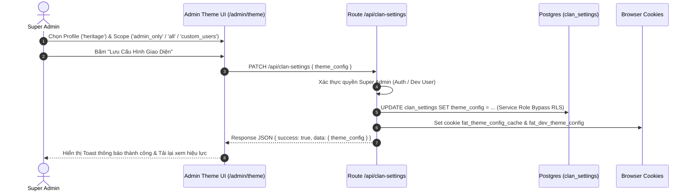
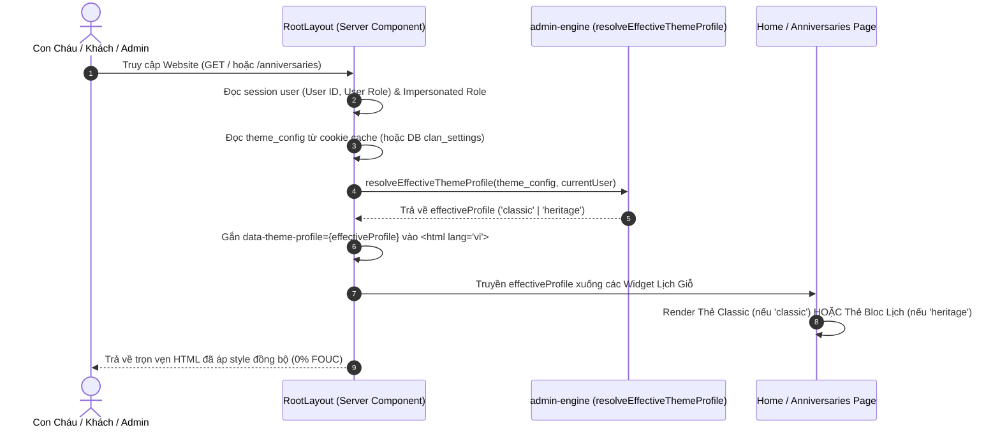

# ĐẶC TẢ KỸ THUẬT: MILESTONE 9 - CLAN DESIGN PROFILES & MODERN VIETNAMESE HERITAGE ANNIVERSARY BLOC

> **Trạng thái:** DỰ THẢO CHỜ DUYỆT (Draft - Ready for Review)  
> **Tài liệu tham chiếu:**  
> - `docs/01_Architecture-Blueprint.md`  
> - `docs/03_DB-Schema.md`  
> - `docs/14_Micro-Spec_Milestone_5_Anniversaries_WebPush_Cron.md`  
> - `docs/16_Micro-Spec_Milestone_7_Admin_Portal_Reorganization.md`  
> - `.agents/handoff/thiet-ke-lai-giao-dien-lich-gio.md`  
> - `.agents/brain/lessons_learned.md`

_Tài liệu này dùng để giới hạn Context Window. AI chỉ được phép đọc, suy luận và sinh code cho ĐÚNG các file được đề cập trong đây._

---

## 1. QUY TẮC NGHIÊM NGẶT (STRICT CONSTRAINTS)

- **Thư viện cho phép:** Không cài thêm thư viện UI bên ngoài. Sử dụng chuẩn hiện có: Next.js 14+ (App Router), React 18, TailwindCSS, Lucide Icons, `cookies()` của Next.js Server Components.
- **Tính Bất Biến Kiến Trúc [R-SPEC.INVARIANT]:**
  - **Layout Shell:** Màn hình Quản trị Giao diện `/admin/theme` bắt buộc sử dụng chuẩn `AdminShell` (Sidebar 256px + Fluid Content), không dùng container đóng hộp `max-w-5xl` ngoài cùng gây co thắt bố cục.
  - **Navigation Model:** Bổ sung menu item độc lập `/admin/theme` ("Giao Diện & Profile") trên `AdminSidebar.tsx`. Tuyệt đối không dùng Tab ngang `activeTab` gây co giật layout.
  - **Geometry & Tokens (Anti-Pill & Anti-Bubble - Phân Định Hai Phong Cách Rõ Rệt):**
    * **Profile `classic` (Tối giản Hiện đại):** Giữ góc bo mềm mại (`--radius-card: 1rem` [16px], `--radius-control: 0.5rem` [8px]).
    * **Profile `heritage` (Di sản Mực thước):** **Góc bo tròn ít hơn rõ rệt** (`--radius-card: 0.375rem` [6px], `--radius-control: 0.25rem` [4px]). Thiết kế vuông vắn, dứt khoát, đĩnh đạc như góc cạnh tờ lịch bloc xé tay truyền thống, hoành phi câu đối và bia đá; tuyệt đối CẤM bo cong lớn `1.25rem` (20px) gây hiệu ứng bóng bóng (bubbly) phá vỡ tính uy nghiêm cổ kính.
    * Typography phân cấp bằng dấu chấm giữa `·`. Tuyệt đối CẤM lạm dụng `rounded-full` làm nhãn phân loại.
  - **Unified RBAC:** Phân quyền lưu cấu hình giới hạn nghiêm ngặt cho `super_admin`.
- **Nguyên Tắc Bảo Toàn Thương Hiệu (Brand Sovereignty Rule):**
  - Profile giao diện chỉ thay đổi **Phong cách Bố cục & Trình bày (Presentation / Layout Style)**, KHÔNG ĐƯỢC làm đổi màu nhận diện chủ đạo của thương hiệu dòng họ.
  - Màu chủ đạo của toàn hệ thống (Logo, Tên Dòng Họ `{clanName}`, Navbar, Nút hành động chính) **BẮT BUỘC PHẢI LÀ XANH LỤC BẢO (`emerald-600` / gradient `from-emerald-700 via-emerald-600 to-teal-600`)**.
  - Việc đổi màu toàn bộ chủ đề cho sự kiện lễ hội/chào mừng phải là một phân hệ tính năng riêng sau này, không được gộp vào đây.
- **Quy Tắc Kiến Trúc Rào Chắn Mã Nguồn (System-wide Code Guards):**
  - **[R-ARCH.DOMAIN_SERVICE] (Chính Sách Dịch Vụ Nghiệp Vụ Duy Nhất):** Tuyệt đối CẤM việc query DB và tính toán nghiệp vụ phân tán rải rác ở nhiều Server Components hay API Routes. Toàn bộ logic lấy dữ liệu Lịch Giỗ, nạp cấu hình phân chi `branches`, quan hệ hôn phối `spouse_relations` và tính toán ngày giỗ BẮT BUỘC gom về `src/lib/services/anniversary.service.ts`. Cả `src/app/page.tsx` và `src/app/api/anniversaries/route.ts` đều phải gọi chung một service này.
  - **[R-UI.SSOT_PREVIEW] (Nguồn Chân Lý Duy Nhất Cho Xem Trước):** Mọi khu vực Live Preview / Demo (đặc biệt trong `/admin/theme`) BẮT BUỘC phải import và tái sử dụng trực tiếp Production Component (`AnniversaryBlocCard`) cùng bộ dữ liệu mẫu chuẩn hóa (`src/fixtures/anniversary-fixtures.ts`). Tuyệt đối CẤM tự vẽ mockup HTML/CSS thô sơ giả lập.
  - **[R-DESIGN.TOKENS] (Semantic Tokens First - Cấm Hardcode Hình Học):** CẤM hardcode class `rounded-2xl` hoặc `rounded-xl` bừa bãi trên các surface chính. Bắt buộc dùng semantic token `rounded-card` (nối với CSS Variable `--radius-card`). Khi chuyển Theme Profile giữa Classic và Heritage, toàn bộ card trên hệ thống (Home, Admin, Banner, Modal) phải tự động co/dãn bo góc đồng loạt.
- **Đồng Bộ Trục Gióng (Grid Alignment):**
  - Thẻ Spotlight Lịch Giỗ trang chủ bắt buộc dùng `max-w-3xl` (thay vì `max-w-xl` 576px) để gióng thẳng hàng tuyệt đối với Khung Hero và Banner PWA, xóa bỏ hoàn toàn lỗi "thắt eo" bố cục.
- **Zero-FOUC (Chống nháy giao diện khi tải trang):** Phân giải profile giao diện hiệu lực (`effectiveProfile`) trên Server Component (`src/app/layout.tsx`), gắn `data-theme-profile` trực tiếp lên thẻ `<html>` trong HTML response ban đầu, kết hợp đệm cookie `fat_theme_config_cache` (maxAge 300s) và `fat_dev_theme_config`.

---

## 2. DATABASE & MODELS

### 2.1. Migration DDL
- **File:** `supabase/migrations/20260930000000_add_theme_config.sql`
- **DDL:**
  ```sql
  -- Bổ sung cột theme_config vào bảng clan_settings
  ALTER TABLE public.clan_settings
  ADD COLUMN IF NOT EXISTS theme_config JSONB NOT NULL 
  DEFAULT '{"active_profile": "classic", "apply_scope": "all", "allowed_user_ids": []}'::jsonb;
  ```

### 2.2. TypeScript Definitions
- **File:** `src/types/database.ts`
- **Schema Fields:**
  ```typescript
  export type DesignProfileId = 'classic' | 'heritage';

  export type ThemeApplyScope = 'all' | 'admin_only' | 'custom_users';

  export interface ClanThemeConfig {
    active_profile: DesignProfileId;
    apply_scope: ThemeApplyScope;
    allowed_user_ids: string[];
  }
  ```
- **Cập nhật interface `ClanSettings`:**
  ```typescript
  export interface ClanSettings {
    // ... các trường hiện có ...
    theme_config?: ClanThemeConfig;
  }
  ```
- **File:** `src/types/anniversary.ts`
  ```typescript
  export interface AnniversaryMemberItem {
    // ... các trường hiện có ...
    branch_name?: string | null; // Tên chi lá trực tiếp, VD: "Chi 2"
    branch_path?: string | null; // Đường dẫn phân cấp đầy đủ, VD: "Ngành 1 · Chi 2"
  }

  export interface AnniversaryOptions {
    // ... các trường hiện có ...
    branches?: BranchNode[];
    spouseRelations?: SpouseRelationRecord[];
  }
  ```

---

## 3. SƠ ĐỒ LUỒNG LOGIC (SEQUENCE DIAGRAM - MERMAID)

### 3.1. Luồng Cập Nhật Theme Profile Trong Quản Trị


### 3.2. Luồng Phân Giải Theme Hiệu Lực Không Gây Nháy (Zero-FOUC SSR)


---

## 4. BACKEND LOGIC / API

### 4.1. Lõi Phân Giải Theme Engine (`src/lib/admin/admin-engine.ts`)
- **Hằng số mặc định:**
  ```typescript
  export const DEFAULT_THEME_CONFIG: ClanThemeConfig = {
    active_profile: 'classic',
    apply_scope: 'all',
    allowed_user_ids: [],
  };
  ```
- **Hàm phân giải an toàn (fallback khi dữ liệu khuyết thiếu):**
  ```typescript
  export function resolveThemeConfig(config?: Partial<ClanThemeConfig> | null): ClanThemeConfig {
    if (!config || typeof config !== 'object') {
      return { ...DEFAULT_THEME_CONFIG };
    }
    return {
      active_profile: config.active_profile === 'heritage' ? 'heritage' : 'classic',
      apply_scope:
        config.apply_scope === 'admin_only' || config.apply_scope === 'custom_users'
          ? config.apply_scope
          : 'all',
      allowed_user_ids: Array.isArray(config.allowed_user_ids)
        ? config.allowed_user_ids.filter((id): id is string => typeof id === 'string')
        : [],
    };
  }
  ```
- **Hàm tính toán Theme Profile hiệu lực (`resolveEffectiveThemeProfile`):**
  ```typescript
  export function resolveEffectiveThemeProfile(
    config?: Partial<ClanThemeConfig> | null,
    currentUser?: { id?: string; role?: UserRole; isSuperAdmin?: boolean } | null
  ): DesignProfileId {
    const resolved = resolveThemeConfig(config);
    if (resolved.active_profile === 'classic') {
      return 'classic';
    }

    // Nếu active_profile là 'heritage':
    if (resolved.apply_scope === 'all') {
      return 'heritage';
    }

    if (resolved.apply_scope === 'admin_only') {
      return currentUser?.isSuperAdmin ? 'heritage' : 'classic';
    }

    if (resolved.apply_scope === 'custom_users') {
      if (currentUser?.isSuperAdmin) return 'heritage';
      if (currentUser?.id && resolved.allowed_user_ids.includes(currentUser.id)) {
        return 'heritage';
      }
      return 'classic';
    }

    return 'classic';
  }
  ```

### 4.2. API Route `src/app/api/clan-settings/route.ts`
- **GET:**
  - Bổ sung `theme_config` vào đối tượng `data` trả về. Đọc ưu tiên từ cookie dev `fat_dev_theme_config` hoặc `clan_settings.theme_config`, fallback `DEFAULT_THEME_CONFIG`.
- **PATCH:**
  - Kiểm tra quyền Super Admin (nếu không phải $\rightarrow$ 403 Forbidden).
  - Đọc `body.theme_config`. Nếu có, chuẩn hóa qua `resolveThemeConfig(body.theme_config)`.
  - Cập nhật vào DB Postgres bằng `createAdminClient()` (Service Role) để bypass RLS.
  - Ghi đè cookie `fat_dev_theme_config` (maxAge 30 ngày) và `fat_theme_config_cache` (maxAge 300s, path `/`, sameSite `lax`).
  - Trả về payload cập nhật thành công.

---

## 5. FRONTEND UI & LOGIC

### 5.1. Màn Hình Quản Trị Giao Diện (`src/app/admin/theme/page.tsx`)
- **Route:** `/admin/theme`
- **Tích hợp Shell:** Nằm trọn vẹn trong `AdminShell` thông qua Sidebar.
- **State quản lý:**
  - `config`: `ClanThemeConfig` (lưu cấu hình hiện tại).
  - `userList`: Danh sách người dùng hệ thống (`UserProfile[]`) để phục vụ whitelist khi chọn `custom_users`.
  - `isSaving`, `statusMessage`, `previewProfile`: Hỗ trợ live preview trực quan.
- **Giao diện lựa chọn:**
  - **Khối 1 — Lựa Chọn Profile:** Hai thẻ lớn đối chiếu trực tiếp:
    1. *Classic Minimalist:* Tông ngọc lục bảo thanh thoát, phong cách thẻ trắng hiện đại.
    2. *Modern Vietnamese Heritage:* Tông Đỏ son tươi kết hợp Vàng hoàng kim, viền hairline sắc nét, Lịch Bloc truyền thống.
  - **Khối 2 — Phạm Vi Áp Dụng (Rollout Scope):** 3 tùy chọn trực quan:
    1. `Toàn bộ người dùng & khách vãng lai (All)`: Triển khai toàn diện.
    2. `Chỉ Quản trị viên (Admin Only)`: Chế độ Canary kiểm thử an toàn trên dữ liệu thật.
    3. `Chỉ định thành viên (Custom Whitelist)`: Chọn thêm các tài khoản con cháu cụ thể.
  - **Khối 3 — Live Preview:** Trực quan hóa ngay trên trang một thẻ Lịch Giỗ mẫu theo phong cách được chọn.
  - **Nút Lưu & Phản Hồi:** Nút "Lưu Cấu Hình Giao Diện" kèm spinner và toast thông báo thành công.

### 5.2. Cập Nhật Menu Admin Sidebar (`src/components/admin/AdminSidebar.tsx`)
- Thêm mục vào nhóm **"VẬN HÀNH & HỆ THỐNG"**:
  ```typescript
  {
    href: '/admin/theme',
    label: 'Giao Diện & Profile',
    icon: Palette, // từ lucide-react
  }
  ```

### 5.3. Tiêm Cấu Hình Zero-FOUC Tại RootLayout (`src/app/layout.tsx`)
- Đọc `theme_config` từ cookie cache hoặc DB.
- Tính toán `effectiveProfile = resolveEffectiveThemeProfile(themeConfig, currentUser)`.
- Đặt thuộc tính trên thẻ HTML:
  ```tsx
  <html lang="vi" data-theme-profile={effectiveProfile} className={`h-full ${beVietnamPro.variable}`} suppressHydrationWarning>
  ```
- Điều chỉnh lớp selection:
  ```tsx
  <body className={`antialiased min-h-screen flex flex-col font-sans ${
    effectiveProfile === 'heritage'
      ? 'selection:bg-red-100 selection:text-red-950 dark:selection:bg-red-950/80 dark:selection:text-amber-200'
      : 'selection:bg-emerald-100 selection:text-emerald-900'
  }`}>
  ```

### 5.4. Định Nghĩa Design Tokens Toàn Cục & Cục Bộ (`src/app/globals.css`)
- **Tôn trọng Brand Identity:** Tuyệt đối không ghi đè màu chủ đạo toàn hệ thống sang màu đỏ. Màu nhận diện thương hiệu dòng họ (H1, Logo, Header, Navbar, CTA chính) vẫn giữ nguyên tông Xanh Lục Bảo `emerald-600`.
- Biến CSS và token khi `[data-theme-profile="heritage"]` phục vụ chuẩn hóa Phương Án A (Clean Lunar Red):
  - `--heritage-bloc-today`: Tông đỏ son (`#dc2626` / `#b91c1c`) cho đỉnh bloc ngày lễ/ngày giỗ hôm nay.
  - `--heritage-bloc-tomorrow`: Tông vàng hoàng kim (`#f59e0b` / `#fbbf24`) cho ngày mai giỗ.
  - `--heritage-bloc-future`: Tông Xanh Ngọc Lục Bảo Trầm (`#065f46` / `bg-emerald-800 text-white`) cho đỉnh bloc các ngày tương lai, thay thế hoàn toàn màu xám than thô cứng, tạo sự kết nối bền chặt với nhận diện cội nguồn dòng họ.
  - `--heritage-lunar-red`: Sắc đỏ son truyền thống (`#dc2626`) cho con số ngày âm lịch trên nền trắng sứ tờ lịch.

### 5.5. Đưa Thiết Kế Lịch Giỗ Bloc Vào Production (Quy Chuẩn Tinh Chỉnh Thẩm Mỹ & Cấu Hình Ngành/Chi)
- **Chuẩn Hóa Phương Án A (Sắc Đỏ Son Trên Nền Trắng Sứ Đồng Nhất):**
  - **Triệt tiêu dải chân vàng kem ngà:** Bỏ hoàn toàn dải nền `bg-amber-100` ở Desktop Timeline. Tất cả các vị trí hiển thị ngày âm (Home Spotlight, Desktop Timeline, Mobile Timeline) quy về một chuẩn duy nhất:
    * **Con số ngày âm:** Luôn mang màu **ĐỎ SON TRUYỀN THỐNG (`text-red-600 dark:text-red-400 font-black`)** nổi bật trên nền trắng sứ của tờ lịch.
    * **Chữ ngữ cảnh ngày/tháng/năm âm:** Luôn mang màu **Xám chì thanh lịch (`text-slate-600 dark:text-slate-400 font-medium`)**.
- **Tách Component & Chuẩn Hóa Bố Cục:**
  - `src/components/anniversaries/AnniversaryBlocCard.tsx` (Thẻ Spotlight Lịch Giỗ Trang Chủ):
    - **Trục Gióng (Grid Alignment):** Tăng từ `max-w-xl` (576px) lên `max-w-3xl` (768px) để gióng thẳng hàng tuyệt đối với Khung Hero và Banner PWA, xóa bỏ triệt để lỗi "thắt eo" bố cục.
    - **Hình học Anti-Bubble:** Hạ góc bo từ `rounded-2xl` (16px) xuống `rounded-xl` (12px) cho khung ngoài, `rounded-lg` cho khối con bên trong.
    - **Nút CTA Chính:** Mang màu Xanh Lục Bảo chuẩn `bg-emerald-600 hover:bg-emerald-700 text-white font-medium` ở cả Desktop và Mobile.
    - **Bố Cục Âm Lịch Thẻ Home Tối Ưu Hóa Riêng Biệt Cho PC và Mobile:**
      * *Phiên bản Desktop (PC - md+):* Bố cục **Lệch Trái 2 Dòng (Left-Aligned 2-Row Split)** trong cột 185px. Số ngày âm đỏ to (`text-3xl font-black text-red-600`) căn trái cao 2 dòng; kề bên phải gồm 2 dòng: dòng trên là `tháng {lunar_month} âm lịch` (`text-xs font-bold text-slate-800`), dòng dưới là `Năm {lunar_year_name}` (`text-[11px] font-medium text-slate-500`). Toàn bộ cụm căn giữa trong lòng cột 185px.
      * *Phiên bản Mobile (< md):* Bố cục **Dàn Ngang 2 Mép (`justify-between`)** tận dụng bề ngang màn hình điện thoại: mép trái là `19 tháng {lunar_month} âm lịch` (số 19 đỏ son to `text-2xl`, tháng kề bên cùng baseline), mép phải là `Năm {lunar_year_name}` (`text-right text-[11px]`), đồng bộ 100% với ảnh chụp thiết kế.
    - **Hiển Thị Ngành & Chi:** Tại dòng thông tin phụ, tích hợp Ngành/Chi cạnh Thế hệ theo chuẩn Anti-Pill Typography: `Đời thứ {generation} · {branch_path || branch_name} · Hưởng thọ {age}t`.
  - `src/components/anniversaries/AnniversaryBlocTimeline.tsx` (Danh Sách Ngày Giỗ Trang `/anniversaries`):
    - **Hình học Anti-Bubble:** Giảm góc bo thẻ từ `rounded-2xl` về `rounded-xl`.
    - **Đỉnh Khối Ngày (Bloc Header):** 
      * Hôm nay: Đỏ son `bg-red-600 text-white`.
      * Ngày mai: Vàng hoàng kim `bg-amber-400 text-slate-950 font-black`.
      * Các ngày tương lai: **Xanh Ngọc Lục Bảo Trầm (`bg-emerald-800 text-white dark:bg-emerald-900`)** thay thế màu xám than.
    - **Đồng Nhất Nền Trắng Sứ Ngày Âm:** Đổi dải chân PC thành nền trắng sứ với số ngày âm màu đỏ son: `<span className="text-red-600 font-black">{day}/{month}</span> <span className="text-slate-600 font-medium">Âm Lịch</span>`.
    - **Dọn Sạch Header PC:** Loại bỏ chữ `| Năm Bính Ngọ` lơ lửng.
    - **Hiển Thị Ngành & Chi:** Hiển thị `Đời {generation} · {branch_path || branch_name} · Hưởng thọ {age}t` trên cả PC và Mobile.
  - `src/app/page.tsx`:
    - Khôi phục màu H1 tiêu đề dòng họ `{clanName}` và nhãn Eyebrow về gradient Xanh Lục Bảo chuẩn (`bg-gradient-to-r from-emerald-700 via-emerald-600 to-teal-600`), bảo toàn 100% Brand Sovereignty.
    - Gọi hàm tập trung `getUpcomingAnniversariesFeed` từ `src/lib/services/anniversary.service.ts`.
  - `src/app/anniversaries/page.tsx`:
    - Tiêu thụ trực tiếp dữ liệu từ API `/api/anniversaries` vốn đã được `anniversary.service.ts` gắn sẵn `branch_path`. Xóa bỏ hoàn toàn việc lưu state rỗng và tự tính toán phân chi trên Client Component.
- **Tích hợp có điều kiện:**
  - Tại `src/app/page.tsx`: Kiểm tra `effectiveProfile === 'heritage'` $\rightarrow$ render `AnniversaryBlocCard`; ngược lại render Classic Spotlight nguyên bản.
  - Tại `src/app/anniversaries/page.tsx`: Kiểm tra `effectiveProfile === 'heritage'` $\rightarrow$ render `AnniversaryBlocTimeline`; ngược lại render Classic Timeline nguyên bản.

### 5.6. KIẾN TRÚC RÀO CHẮN 4 TẦNG & TÁI CẤU TRÚC TOÀN DIỆN (SYSTEM-WIDE SSOT ARCHITECTURE)

Nhằm chấm dứt triệt để căn bệnh "cát cứ ốc đảo, code chắp vá và hardcode hình học phân tán", hệ thống thiết lập 4 Tầng Rào Chắn Mã Nguồn bắt buộc:

#### 5.6.1. Tầng Nghiệp Vụ & Dữ Liệu Tập Trung (Domain Service):
- **Tệp mới:** `src/lib/services/anniversary.service.ts`
- **Hàm cốt lõi:**
  ```typescript
  export async function getUpcomingAnniversariesFeed(options?: {
    daysAhead?: number;
    viewerMemberId?: string;
    branch?: string;
    scope?: string;
    region?: KinshipRegion;
  }): Promise<AnniversaryDayGroup[]>
  ```
- **Trách nhiệm duy nhất:**
  - Thực hiện nạp song song: `clan_settings` (lấy cây `branches`), `spouse_relations` (lấy quan hệ hôn phối), và `members`.
  - Tính toán ngày giỗ Âm - Dương chuẩn UTC+7 thông qua `getUpcomingAnniversaries`.
  - Tự động phân giải đường dẫn phân cấp `branch_path` (`"Đời 11 · Ngành 1 · Chi 1"`) cho từng người giỗ.
  - Lọc theo phạm vi thân tộc mở rộng (`scope === 'my_lineage'`) nếu người xem có liên kết hồ sơ.
- **Quy tắc tiêu thụ:**
  - `src/app/page.tsx` và `src/app/api/anniversaries/route.ts` **BẮT BUỘC** gọi chung hàm này. CẤM tự ý query DB riêng biệt.
  - `src/app/anniversaries/page.tsx`: Dọn sạch các state rỗng `clanBranches`, `allMembers`, `spouseRelations`. Ở cả 2 chế độ hiển thị Classic và Heritage, component chỉ đọc trường `member.branch_path || member.branch_name` đã có sẵn trong DTO.

#### 5.6.2. Tầng Thành Phần Dùng Chung & Shared Fixtures Factory:
- **Tệp mới:** `src/fixtures/anniversary-fixtures.ts`
- **Nội dung:** Xuất khẩu 2 bộ Mock Fixtures chuẩn mực:
  - `MOCK_ANNIVERSARY_GROUP_TODAY`: Nhóm ngày giỗ Hôm Nay (days_left = 0), có đầy đủ danh xưng, chi ngành (`Đời 4 · Ngành 1 · Chi 1`).
  - `MOCK_ANNIVERSARY_GROUP_UPCOMING`: Nhóm ngày giỗ tương lai (days_left = 12, tháng tương lai).
- **Mẫu Tự Chứa Xem Trước (Self-Contained Preview Pattern):**
  - Trong `src/components/anniversaries/AnniversaryBlocCard.tsx`, xuất khẩu thêm sub-component:
    ```tsx
    export function AnniversaryBlocCardPreview({ variant = 'today' }: { variant?: 'today' | 'upcoming' }) {
      const group = variant === 'today' ? MOCK_ANNIVERSARY_GROUP_TODAY : MOCK_ANNIVERSARY_GROUP_UPCOMING;
      return <AnniversaryBlocCard group={group} />;
    }
    ```
- **Tái Cấu Trúc `/admin/theme`:**
  - Xóa bỏ 100% khối mã HTML mockup thô sơ tại `src/app/admin/theme/page.tsx` (dòng 467-513).
  - Thay thế bằng: `<AnniversaryBlocCardPreview variant="today" />`. Đảm bảo Live Preview luôn là hình ảnh phản chiếu 100% của component thật trên Production.

#### 5.6.3. Tầng Thị Giác & Dynamic Design Tokens (Bo Góc & Màu Sắc Động - Phòng Thủ Toàn Cầu):
- **Tệp:** `src/app/globals.css`
  - Khai báo token hình học động theo `data-theme-profile` cho toàn bộ thang đo Tailwind (`card`, `control`, `2xl`, `xl`, `lg`, `md`):
    ```css
    :root {
      /* Classic: Phong cách hiện đại, bo cong mềm mại */
      --radius-sm: 0.25rem;       /* 4px */
      --radius-md: 0.375rem;      /* 6px */
      --radius-lg: 0.5rem;        /* 8px */
      --radius-xl: 0.75rem;       /* 12px */
      --radius-2xl: 1rem;         /* 16px */
      --radius-3xl: 1.5rem;       /* 24px */
      --radius-card: 1rem;        /* 16px */
      --radius-control: 0.5rem;   /* 8px */
    }

    html[data-theme-profile="heritage"] {
      /* Heritage: Phong cách di sản, vuông vắn mực thước chuẩn tờ lịch bloc */
      --heritage-accent-red: #dc2626;
      --heritage-accent-gold: #f59e0b;
      --radius-sm: 0.125rem;      /* 2px */
      --radius-md: 0.25rem;       /* 4px */
      --radius-lg: 0.25rem;       /* 4px */
      --radius-xl: 0.375rem;      /* 6px */
      --radius-2xl: 0.375rem;     /* 6px */
      --radius-3xl: 0.5rem;       /* 8px */
      --radius-card: 0.375rem;    /* 6px */
      --radius-control: 0.25rem;  /* 4px */
    }
    ```
- **Tệp:** `tailwind.config.ts`
  - Ánh xạ trực tiếp toàn bộ thang đo `borderRadius` của Tailwind vào CSS Variables, đảm bảo 100% tất cả các màn hình (kể cả nơi dùng `rounded-2xl`, `rounded-xl`, `rounded-lg`) đều tự động chuyển mình đồng loạt theo Theme Profile:
    ```typescript
    borderRadius: {
      none: '0px',
      sm: 'var(--radius-sm, 0.125rem)',
      DEFAULT: 'var(--radius-md, 0.25rem)',
      md: 'var(--radius-md, 0.375rem)',
      lg: 'var(--radius-lg, 0.5rem)',
      xl: 'var(--radius-xl, 0.75rem)',
      '2xl': 'var(--radius-2xl, 1rem)',
      '3xl': 'var(--radius-3xl, 1.5rem)',
      card: 'var(--radius-card, 1rem)',
      control: 'var(--radius-control, 0.5rem)',
      full: '9999px',
    }
    ```
- **Chuẩn Hóa Component:**
  - `src/components/anniversaries/AnniversaryBlocCard.tsx`:
    - Đổi màu đỉnh tháng ngày tương lai sang **Xanh Ngọc Lục Bảo Trầm (`bg-emerald-800 text-white font-bold`)**, xóa sổ màu xám than `bg-slate-700`.
    - Đổi class bao ngoài thành `rounded-card`.
  - Thay thế các class hardcode `rounded-2xl` trên các surface chính:
    - `src/components/home/IdentityContextWidget.tsx` $\rightarrow$ `rounded-card`.
    - `src/components/pwa/InstallPwaButton.tsx` (banner trang chủ) $\rightarrow$ `rounded-card`.
    - Khung Preview và Cards trong `src/app/admin/theme/page.tsx` $\rightarrow$ `rounded-card`.

#### 5.6.4. Tầng Rào Chắn Kiểm Chứng Tự Động (Architecture Guard Tests):
- **Tệp mới:** `tests/architecture-ssot.test.ts`
- **Tích hợp vào lệnh:** `npm.cmd test`
- **Bộ 3 Rào Chắn Khóa Mã Tự Động:**
  1. *SSOT Preview Guard:* Quét tĩnh AST/Regex toàn bộ file `src/app/admin/theme/page.tsx`. Nếu phát hiện có chuỗi giả lập ngày giỗ tĩnh (như `"19/08 Âm Lịch"`) hoặc không import component thật từ `@/components/anniversaries/AnniversaryBlocCard` $\rightarrow$ **FAIL TEST**.
  2. *Design Token Guard:* Quét các surface card chính (`AnniversaryBlocCard.tsx`, `IdentityContextWidget.tsx`, `InstallPwaButton.tsx`). Nếu còn class cứng `rounded-2xl` hoặc `rounded-xl` thay vì `rounded-card` $\rightarrow$ **FAIL TEST**.
  3. *Domain Service Guard:* Quét `src/app/page.tsx` và `src/app/api/anniversaries/route.ts`. Bắt buộc phải import và gọi qua `getUpcomingAnniversariesFeed` từ `@/lib/services/anniversary.service` $\rightarrow$ **FAIL TEST nếu tự query phân tán**.

#### 5.6.5. Tinh Chỉnh Kích Thước Lịch Bloc & Chuẩn Hóa Nhịp Điệu Bo Góc Mạnh (Border Radius Tuning & Bloc Proportions):
- **1. Typography & Tỷ Lệ Tờ Lịch Bloc (`AnniversaryBlocCard.tsx`):**
  - **Số ngày Dương lịch (Mobile):** Nâng cấp từ `text-5xl` (48px) lên **`text-7xl sm:text-8xl` (72px - 96px)** `font-black tracking-tight leading-none text-slate-950 dark:text-white`.
  - **Thứ trong tuần (Mobile):** Nâng cấp từ `text-sm` (14px) lên **`text-base sm:text-lg` (16px - 18px)** `font-bold tracking-wide mt-2 text-slate-800 dark:text-slate-200`.
  - **Khoảng thở dọc (Mobile):** Tăng từ `py-4` lên **`py-5 sm:py-6`**, đảm bảo khoảng thở cân đối với dải răng cưa và khối Âm lịch bên dưới.
  - **Desktop (Cột 185px):** Cân đối ngày Dương lên `text-6xl sm:text-7xl font-black`, thứ lên `text-sm font-bold mt-1.5`.
  - **Nút hành động:** Thay `rounded-lg` bằng semantic token `rounded-control`.
- **2. Khắc Phục Lỗi Nạp Ngành & Chi Trong Domain Service (`src/lib/services/anniversary.service.ts`):**
  - Sửa tên cột SQL truy vấn `clan_settings` từ `default_kinship_region` thành **`regional_preset`** (tên chuẩn xác trong CSDL PostgreSQL).
  - Đảm bảo `branches` và `spouse_relations` luôn được nạp đầy đủ khi gọi qua `/api/anniversaries`, phân giải chính xác `branch_path` (`Đời 11 · Ngành 1 · Chi 1`).
  - Trong `src/components/anniversaries/AnniversaryBlocTimeline.tsx`: Bổ sung fallback `resolveMemberBranchHierarchy` để đảm bảo 100% hiển thị phân cấp Ngành/Chi cả khi data từ API có độ trễ.
- **3. Chuẩn Hóa Bo Góc Ít Hơn, Mực Thước Cho Profile Heritage Đối Chiếu Với Classic (`globals.css` & Components):**
  - **Profile `heritage` (Mực Thước Di Sản):** Quy chuẩn **góc bo tròn ít hơn rõ rệt** với `--radius-card: 0.375rem` (6px) và `--radius-control: 0.25rem` (4px). Khung thẻ và các khối ngày mang đường nét vuông vắn, đĩnh đạc, chắc chắn chuẩn tờ lịch bloc xé tay truyền thống, xóa sổ hoàn toàn cảm giác tròn vo (bubbly) của card 20px.
  - **Profile `classic` (Tối Giản Hiện Đại):** Giữ nguyên góc bo mềm mại hiện đại với `--radius-card: 1rem` (16px) và `--radius-control: 0.5rem` (8px).
  - **Đồng bộ hóa Semantic Tokens toàn diện:**
    - `src/components/pwa/InstallPwaButton.tsx`: Nút bấm chuyển từ `rounded-xl` sang `rounded-control`, banner dùng `rounded-card`.
    - `src/components/anniversaries/AnniversaryBlocTimeline.tsx`: Khung thẻ chuyển từ `rounded-xl` sang `rounded-card`, nút `[Xem Cây]` chuyển sang `rounded-control`.
    - `src/components/anniversaries/AnniversaryBlocCard.tsx`: Khung dùng `rounded-card`, nút bấm dùng `rounded-control`.
    - Khắc phục triệt để tình trạng nút 8px, nút 12px cọc cạch trên cùng một màn hình; khi chuyển đổi profile, toàn bộ giao diện tự động chuyển phong cách từ vuông vắn mực thước (`heritage`) sang bo cong mềm mại (`classic`).
- **4. Nâng Cấp Tỷ Lệ & Typography Cột Lịch Bloc Mobile (`AnniversaryBlocTimeline.tsx`):**
  - Mở rộng bề ngang cột bloc từ `w-[58px]` lên **`w-[76px]`** nhằm tạo không gian đĩnh đạc, cân đối cho tờ lịch mini.
  - **Đỉnh tháng:** Nâng từ `text-[9px]` lên **`text-xs font-black py-1.5`** (12px), đảm bảo rõ nét và tương phản cao.
  - **Số ngày Dương:** Nâng từ `text-xl` (20px) lên **`text-3xl font-black text-slate-950 dark:text-white leading-none py-1`** (30px), bề thế chuẩn tờ lịch bloc xé tay thật, người lớn tuổi nhìn phát thấy ngay.
  - **Thứ trong tuần:** Nâng từ `text-[8px]` dính mép lên **`text-[10px] font-bold uppercase mt-1 tracking-wider text-slate-600 dark:text-slate-400`** (10px).
- **5. Chuẩn Hóa Các Màn Hình Trọng Điểm (`/kinship`, `/admin/kinship`, `/tree`):**
  - Rà soát và chuyển đổi triệt để các card và controls sang `rounded-card` và `rounded-control`:
    - `src/app/kinship/page.tsx`: Card bộ lọc, selector, nút hoán đổi và card kết quả.
    - `src/app/admin/kinship/page.tsx`: Card mẫu vùng miền 3 miền, container cấu hình.
    - `src/components/tree/TreeToolbar.tsx`: Dropdown chọn Gốc, thanh công cụ, popover tùy chọn phả đồ.
    - Kết hợp cùng Tầng 1 (Global Tailwind Scale Mapping) đảm bảo 100% toàn bộ hệ thống thoát khỏi hoàn toàn căn bệnh "sửa cục bộ".

---

## 6. XỬ LÝ LỖI & NGOẠI LỆ (ERROR HANDLING & EDGE CASES)

- **Edge Case 1 (Người dùng chưa đăng nhập khi scope là `admin_only` hoặc `custom_users`):**  
  Server tự động phân giải về `classic`. Khách vãng lai và con cháu không thấy xáo trộn giao diện.
- **Edge Case 2 (Chế độ đóng vai Role Impersonation):**  
  Khi Super Admin dùng `RoleImpersonationBanner` đóng vai thành `guest` hoặc `viewer`, nếu scope đang là `admin_only`, `resolveEffectiveThemeProfile` sẽ phản hồi đúng theo vai đang đóng (nhận `classic`), giúp Admin kiểm thử chính xác góc nhìn của con cháu.
- **Edge Case 3 (Lỗi CSDL hoặc rớt mạng khi PATCH):**  
  API có timeout 1500ms, ghi đệm cookie `fat_dev_theme_config` để môi trường offline/dev vẫn lưu mượt mà không crash.
- **Edge Case 4 (Cookie bị hỏng hoặc payload rỗng):**  
  Hàm `resolveThemeConfig` luôn bọc an toàn, trả về fallback `DEFAULT_THEME_CONFIG` (`classic`, scope `all`).
- **Edge Case 5 (Màn hình siêu nhỏ < 360px):**  
  Số ngày Dương lịch `text-7xl` (72px) không gây tràn chiều ngang nhờ `tracking-tight leading-none`.

---

## 7. MA TRẬN TEST CASES & TIÊU CHÍ NGHIỆM THU (TEST SPECIFICATION)

### 7.1. Bảng Kịch Bản Kiểm Thử Tự Động (Automated Test Suite trong `tests/`)

| ID | Tên Kịch Bản | File Test | Tiền điều kiện (Given) | Thao tác kích hoạt (When) | Kết quả kỳ vọng (Then) | Phân loại | Trạng thái |
|---|---|---|---|---|---|---|---|
| **TC_UT_THEME_01** | Khởi tạo cấu hình mặc định an toàn | `tests/theme-profile-engine.test.ts` | Config đầu vào là `undefined`, `null` hoặc `{}` | Gọi `resolveThemeConfig(input)` | Trả về `active_profile: 'classic'`, `apply_scope: 'all'`, `allowed_user_ids: []` | Happy Path | - [x] PASS |
| **TC_UT_THEME_02** | Phân giải profile khi scope là 'all' | `tests/theme-profile-engine.test.ts` | `active_profile: 'heritage'`, `apply_scope: 'all'` | Gọi `resolveEffectiveThemeProfile` với Guest, Viewer, Member, Admin | 100% các role đều nhận kết quả `'heritage'` | Happy Path | - [x] PASS |
| **TC_UT_THEME_03** | Phân giải khi scope là 'admin_only' | `tests/theme-profile-engine.test.ts` | `active_profile: 'heritage'`, `apply_scope: 'admin_only'` | Gọi với `isSuperAdmin: true` vs `isSuperAdmin: false` | Admin nhận `'heritage'`; Guest/Member nhận `'classic'` | Phân Quyền | - [x] PASS |
| **TC_UT_THEME_04** | Phân giải khi scope là 'custom_users' | `tests/theme-profile-engine.test.ts` | `allowed_user_ids: ['user-123']`, `apply_scope: 'custom_users'` | Gọi với User `user-123` vs User `user-999` | `user-123` nhận `'heritage'`; `user-999` nhận `'classic'` | Whitelist | - [x] PASS |
| **TC_UT_THEME_05** | Tương thích Role Impersonation | `tests/theme-profile-engine.test.ts` | Scope `admin_only`, Admin đóng vai `guest` | Tính `effectiveRole` rồi gọi `resolveEffectiveThemeProfile` | Trả về `'classic'` (khớp với góc nhìn của vai đóng) | Edge Case | - [x] PASS |
| **TC_INT_THEME_01** | API GET /api/clan-settings trả về theme_config | `tests/theme-profile-engine.test.ts` | Mock DB / Cookie mang `theme_config` | Gửi request `GET /api/clan-settings` | Response 200, payload `data.theme_config` chứa đầy đủ 3 trường | API Contract | - [x] PASS |
| **TC_INT_THEME_02** | API PATCH /api/clan-settings từ chối khi không phải Super Admin | `tests/theme-profile-engine.test.ts` | Session người dùng là `viewer` hoặc `null` | Gửi `PATCH /api/clan-settings` với `theme_config` | Response 403 Forbidden | Bảo Mật | - [x] PASS |
| **TC_INT_THEME_03** | API PATCH /api/clan-settings cập nhật thành công cho Super Admin | `tests/theme-profile-engine.test.ts` | Session Super Admin hợp lệ | Gửi `PATCH /api/clan-settings` với cấu hình `heritage` | Response 200, `success: true`, cập nhật cấu hình mới | API Contract | - [x] PASS |
| **TC_UT_ANNIV_BRANCH_01** | Phân giải chính xác Ngành & Chi cho người giỗ | `tests/anniversary-engine.test.ts` | Danh sách thành viên kèm cấu hình `branches` phân cấp (Ngành 1 > Chi 2) | Gọi `getUpcomingAnniversaries(members, { branches })` | Thành viên thuộc Chi 2 có `branch_name === 'Chi 2'` và `branch_path === 'Ngành 1 · Chi 2'` | Ngành/Chi | - [x] PASS |
| **TC_UT_ANNIV_BRANCH_02** | Xử lý an toàn khi không thuộc nhánh hoặc không có cấu hình | `tests/anniversary-engine.test.ts` | `branches` rỗng hoặc cụ Thủy tổ đời 1 | Gọi `getUpcomingAnniversaries(members, { branches: [] })` | Thành viên có `branch_name === null` và `branch_path === null`, không gây crash | Edge Case | - [x] PASS |
| **TC_UT_ANNIV_SERVICE_01** | Domain Service nạp DB và phân giải feed giỗ tập trung | `tests/anniversary-service.test.ts` | Mock DB `members`, `clan_settings` (branches) và `spouse_relations` | Gọi `getUpcomingAnniversariesFeed({ daysAhead: 30 })` | Trả về mảng `AnniversaryDayGroup[]` với người giỗ mang đầy đủ `generation`, `branch_path` | SSOT Service | - [x] PASS |
| **TC_UT_ANNIV_SERVICE_02** | Service nạp đúng tên cột regional_preset và phân giải nhánh khi không inject | `tests/anniversary-service.test.ts` | CSDL có cột `regional_preset` và mảng `branches` | Gọi `getUpcomingAnniversariesFeed()` không truyền injected branches | `branches` được nạp thành công, thành viên có `branch_path` chuẩn xác | Bug Fix | - [x] PASS |
| **TC_UT_BLOC_TYPOGRAPHY_01** | Tỷ lệ chữ số ngày và thứ trên thẻ Lịch Bloc đạt chuẩn tờ lịch | `tests/architecture-ssot.test.ts` | File `AnniversaryBlocCard.tsx` | Quét AST / class áp dụng cho ngày Dương và thứ trên Mobile | Chứa `text-7xl` hoặc `text-8xl` cho ngày và `text-base` hoặc `text-lg` cho thứ | Typography | - [x] PASS |
| **TC_ARCH_GUARD_01** | Chặn mã mockup HTML thô sơ trong trang Quản trị Theme | `tests/architecture-ssot.test.ts` | Quét AST / nội dung file `src/app/admin/theme/page.tsx` | Phân tích cú pháp JSX của trang Theme | Bắt buộc import `AnniversaryBlocCardPreview`, không chứa HTML giả lập tĩnh | Code Guard | - [x] PASS |
| **TC_ARCH_GUARD_02** | Chặn class hardcode hình học tùy tiện trên các surface chính | `tests/architecture-ssot.test.ts` | Quét các file `AnniversaryBlocCard.tsx`, `IdentityContextWidget.tsx`, `InstallPwaButton.tsx` | Kiểm tra regex class `rounded-2xl` hoặc `rounded-xl` trên card container | 100% sử dụng semantic token `rounded-card`, không dùng class cứng | Code Guard | - [x] PASS |
| **TC_ARCH_GUARD_03** | Chặn việc query DB ngày giỗ phân mảnh ngoài Domain Service | `tests/architecture-ssot.test.ts` | Quét `src/app/page.tsx` và `src/app/api/anniversaries/route.ts` | Kiểm tra imports và lời gọi hàm | Bắt buộc gọi qua `getUpcomingAnniversariesFeed`, không tự query DB lặp lại | Code Guard | - [x] PASS |
| **TC_ARCH_GUARD_04** | Chặn hardcode `rounded-lg` / `rounded-xl` trên các nút bấm chính | `tests/architecture-ssot.test.ts` | Quét các nút bấm trong `AnniversaryBlocCard.tsx`, `InstallPwaButton.tsx`, `AnniversaryBlocTimeline.tsx` | Kiểm tra regex class bo góc nút bấm | 100% sử dụng `rounded-control` hoặc token semantic tương đương | Code Guard | - [x] PASS |
| **TC_ARCH_GUARD_05** | Khóa tỷ lệ bo góc Profile heritage nhỏ hơn classic (Anti-Bubble) | `tests/architecture-ssot.test.ts` | File `src/app/globals.css` | Phân tích CSS block `html[data-theme-profile="heritage"]` | Khai báo `--radius-card: 0.375rem` (6px) và `--radius-control: 0.25rem` (4px), nhỏ hơn rõ rệt so với Classic | Code Guard | - [x] PASS |
| **TC_ARCH_GUARD_06** | Khóa Hệ Thống Phòng Thủ Toàn Cầu Tailwind Scale Mapping (Triệt tiêu sửa cục bộ) | `tests/architecture-ssot.test.ts` | `globals.css` và `tailwind.config.ts` | Phân tích biến CSS và config Tailwind | `globals.css` định nghĩa đủ `--radius-2xl`, `--radius-xl`, `--radius-lg`, `--radius-md` theo profile; `tailwind.config.ts` map trực tiếp vào các biến này | Code Guard | - [x] PASS |
| **TC_UT_BLOC_TYPOGRAPHY_02** | Tỷ lệ chữ số và kích thước Mobile Bloc Timeline đạt chuẩn to rõ | `tests/architecture-ssot.test.ts` | `AnniversaryBlocTimeline.tsx` | Phân tích JSX Mobile Bloc | Cột rộng `w-[76px]`, ngày Dương `text-3xl font-black`, tháng `text-xs font-black`, thứ `text-[10px] font-bold` | Typography | - [x] PASS |

### 7.2. Danh Sách Tiêu Chí Nghiệm Thu Thị Giác (Human Visual UAT Matrix)

- [ ] **UAT_01 (Trang Quản Trị Giao Diện):** Mở `/admin/theme` trên trình duyệt → Hiển thị đầy đủ trong AdminShell, có 2 thẻ đối chiếu Profile, bộ chọn 3 mức Scope và khung Live Preview.
- [ ] **UAT_02 (Nghiệm Thu Scope Admin-Only):** Admin chọn Profile "Modern Vietnamese Heritage", Scope "Chỉ áp dụng cho Admin", bấm Lưu.  
  - Admin vào Trang Chủ và `/anniversaries`: Thấy giao diện Lịch Bloc truyền thống màu Đỏ son và Vàng hoàng kim.  
  - Mở Tab Ẩn danh (Incognito / Guest): Vẫn thấy giao diện Classic xanh ngọc lục bảo nguyên bản.
- [ ] **UAT_03 (Nghiệm Thu Scope All Toàn Dòng Họ):** Admin đổi Scope sang "Toàn bộ người dùng & khách vãng lai", bấm Lưu → Tải lại Tab Ẩn danh: Lập tức chuyển sang giao diện Lịch Bloc Heritage.
- [ ] **UAT_04 (Nghiệm Thu Scope Custom Users):** Admin chọn Scope "Chỉ định thành viên", tick chọn 1 tài khoản con cháu cụ thể → Đăng nhập tài khoản đó thấy giao diện mới; tài khoản khác vẫn thấy giao diện Classic.
- [ ] **UAT_05 (Nghiệm Thu Mobile Lịch Bloc):** Mở `/anniversaries` trên mobile: Icon lịch bloc chạm 2 mép, 3 dòng header (countdown, ngày âm, số người giỗ), tên cụ chiếm trọn bề ngang không bị cắt, nút `[Xem Cây]` neo dứt khoát góc dưới bên phải.
- [ ] **UAT_06 (Console Sạch):** Mở Developer Console trên cả PC và Mobile → 0 lỗi đỏ, 0 cảnh báo Hydration mismatch.
- [ ] **UAT_07 (Bảo Toàn Nhận Diện Thương Hiệu H1):** Tiêu đề H1 "DÒNG HỌ PHẠM VĂN" và nhãn Eyebrow trên trang chủ luôn là màu Xanh Lục Bảo Gradient (`from-emerald-700 via-emerald-600 to-teal-600`), không bị đổi màu sang đỏ/cam khi bật profile Heritage.
- [ ] **UAT_08 (Trục Gióng & Semantic Token Thẻ Spotlight Trang Chủ):** Thẻ Lịch Giỗ Spotlight có chiều rộng `max-w-3xl` gióng thẳng hàng tuyệt đối với Khung Hero Card và Banner PWA; góc bo dùng class `rounded-card`; nút CTA chính mang màu Xanh Lục Bảo `bg-emerald-600 hover:bg-emerald-700`.
- [ ] **UAT_10 (Đồng Nhất Màu Sắc Ngày Âm):** 100% các màn hình (Home Spotlight, Desktop Timeline, Mobile Timeline) hiển thị số ngày âm bằng **MÀU ĐỎ SON (`text-red-600`) trên nền TRẮNG SỨ**, chữ ngữ cảnh màu Xám chì.
- [ ] **UAT_11 (Bố Cục Âm Lịch Thẻ Home PC vs Mobile):**
  - PC: Số ngày âm to đỏ (`text-3xl font-black`) căn trái cao 2 dòng, bên phải gồm tháng ở trên và năm ở dưới trong cột 185px.
  - Mobile: Dàn ngang 2 mép (`justify-between`), bên trái là `19 tháng 8 âm lịch`, bên phải là `Năm Bính Ngọ`.
- [ ] **UAT_12 (Header Tháng Tương Lai Xanh Ngọc Lục Bảo Trầm):** Header các ngày tương lai (Tháng 10) trên cả Home (`AnniversaryBlocCard`) và Timeline (`AnniversaryBlocTimeline`) mang màu **Xanh Ngọc Lục Bảo Trầm (`bg-emerald-800 text-white font-bold`)**, xóa bỏ hoàn toàn màu xám than `bg-slate-700`.
- [ ] **UAT_13 (Hiển Thị Cấu Hình Ngành & Chi Đồng Bộ):** Thẻ người giỗ hiển thị thông tin Ngành/Chi trên cả Trang Chủ và Trang `/anniversaries` (ở cả 2 giao diện Classic và Heritage), ví dụ: `Đời 11 · Ngành 1 · Chi 1 · Hưởng thọ 78t`.
- [ ] **UAT_14 (Nghiệm Thu Bo Góc Động Khi Đổi Profile):** Khi chọn Profile `heritage`, toàn bộ card trên hệ thống tự động ăn bo góc ít hơn, vuông vắn mực thước 6px (`--radius-card: 0.375rem`); khi chọn `classic` tự động chuyển sang bo cong mềm mại 16px (`--radius-card: 1rem`).
- [ ] **UAT_15 (Nghiệm Thu Live Preview Khớp 100% Component Thật):** Khung Live Preview trong `/admin/theme` gọi trực tiếp component `AnniversaryBlocCardPreview`, loại bỏ hoàn toàn mã mockup HTML thô sơ.
- [ ] **UAT_16 (Tỷ Lệ Tờ Lịch Bloc Cân Đối - Mới):** Số ngày Dương lịch trên Home Mobile hiển thị to đậm bề thế (`text-7xl sm:text-8xl`), thứ to rõ (`text-base sm:text-lg`), cân đối chuẩn tờ lịch xé tay, không còn cảm giác lọt thỏm.
- [ ] **UAT_17 (Đồng Nhất Ngành & Chi Toàn Hệ Thống - Mới):** Màn hình `/anniversaries` hiển thị đầy đủ `Đời 11 · Ngành 1 · Chi 1` cho Bà nội Nguyễn Thị Chăm và Chú Phạm Văn Cường chuẩn xác như trên Trang Chủ.
- [ ] **UAT_18 (Nhịp Điệu Bo Góc Ít & Đối Chiếu Phong Cách Rõ Rệt - Mới):** Profile Heritage mang phong cách dứt khoát, góc bo rất ít (card 6px, nút 4px) tạo thần thái tờ lịch bloc cổ kính; đối lập với Profile Classic bo cong hiện đại (card 16px, nút 8px). Toàn bộ nút bấm và khung thẻ trên màn hình chuyển đổi nhịp nhàng, 0% cọc cạch.
- [ ] **UAT_19 (Nghiệm Thu Kích Thước Cột Lịch Mobile To Rõ - Mới):** Mở `/anniversaries` trên mobile: Cột bloc rộng 76px, số ngày Dương 30px đậm đà (`text-3xl`), tháng 12px (`text-xs`), thứ 10px to rõ, dễ đọc cho mọi lứa tuổi, xóa bỏ hoàn toàn cảm giác chữ li ti.
- [ ] **UAT_20 (Nghiệm Thu Toàn Hệ Thống Triệt Để - Mới):** Đổi Profile sang `heritage` $\rightarrow$ Mở đồng thời `/kinship`, `/tree`, `/admin/kinship`, `/admin/governance`, `/admin/users`: 100% tất cả các card, popover, khung chọn, input và buttons chuyển sang vuông vắn mực thước 6px/4px; đổi sang `classic` tự động nở mềm 16px/12px/8px, xóa sạch triệt để căn bệnh sửa cục bộ.

---

## 8. BẢO VỆ CHỐNG THOÁI LUI (REGRESSION GUARD CHECKLIST)

- [x] **RG01 (Build & Typecheck Clean):** Chạy `npm run typecheck` và `npm run build` — 0 lỗi biên dịch.
- [x] **RG02 (Automated Test Suite Regression):** Chạy `npm test` — Toàn bộ test cases PASS 100% (0 failures mới so với baseline).
- [x] **RG03 (Bảo Toàn Giao Diện Classic):** Khi profile cấu hình là `classic`, giao diện Trang Chủ và Trang Lịch Giỗ giữ nguyên 100% hành vi, màu sắc và cấu trúc DOM hiện có.
- [x] **RG04 (Toàn Vẹn Cài Đặt Dòng Họ):** Các trường khác trong `clan_settings` (`clan_name`, `branches`, `branch_tiers`, `custom_kinship_dictionary`, `feature_flags`) tiếp tục hoạt động trơn tru, không bị ghi đè hay mất mát khi PATCH `theme_config`.
- [x] **RG05 (Bảo Toàn Contract API Cho PWA & Web Push):** Endpoint `/api/anniversaries` tiếp tục trả về đầy đủ các trường DTO (`success`, `data`, `totalCount`, `timeZone`), không làm gãy bộ quét ngầm của Web Push hay PWA.
- [x] **RG06 (Bảo Toàn Hiển Thị Cây Phân Chi & Không Tràn Khung):** Trên màn hình di động 360px - 400px và desktop, các chữ và số cỡ lớn không gây tràn dòng hay vỡ layout.

---

## 9. LỆNH THI CÔNG (Dành cho AI /feature-code)

> "AI ơi, hãy đọc kỹ đặc tả `docs/18_Micro-Spec_Milestone_9_Design_Profiles_And_Anniversary_Bloc.md` này. Dựa CHÍNH XÁC vào các mô tả ranh giới ở trên, hãy thi công toàn bộ mã nguồn hoàn chỉnh kèm file test trong `tests/`. Thực thi Vòng Lặp Kiểm Chứng Bằng Code Thật bằng đúng các lệnh khai báo tại `[VERIFY_COMMANDS]` (Typecheck/Build → Automated Test Suite → Human UAT), và chỉ được tick `[x]` cho Mục 7.1 khi terminal log cho thấy test phủ AC đó đã pass và không có failure mới so với baseline."
