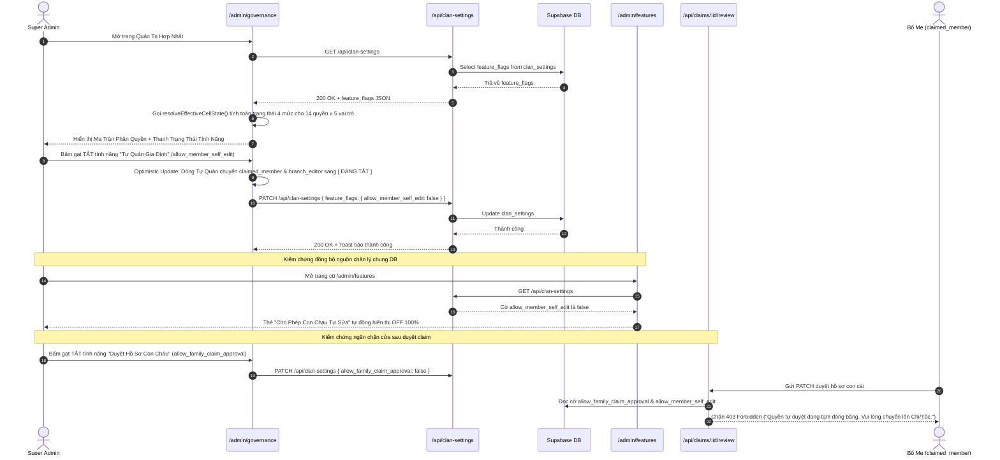

# ĐẶC TẢ KỸ THUẬT: MILESTONE 10 - UNIFIED FEATURE FLAGS & ROLE PERMISSION MATRIX
# (BẬT/TẮT TÍNH NĂNG & MA TRẬN PHÂN QUYỀN VAI TRÒ)

> **Trạng thái:** DỰ THẢO CHỜ DUYỆT (Draft - Ready for Review)  
> **Tài liệu tham chiếu:**  
> - `docs/01_Architecture-Blueprint.md`  
> - `docs/03_DB-Schema.md`  
> - `docs/16_Micro-Spec_Milestone_7_Admin_Portal_Reorganization.md`  
> - `docs/17_Micro-Spec_Milestone_8_Member_Onboarding_Decentralized_Approval.md`  
> - `.agents/brain/lessons_learned.md`

_Tài liệu này dùng để giới hạn Context Window. AI chỉ được phép đọc, suy luận và sinh code cho ĐÚNG các file được đề cập trong đây._

---

## 1. QUY TẮC NGHIÊM NGẶT (STRICT CONSTRAINTS)

- **Thư viện cho phép:** Sử dụng nguyên vẹn tech stack hiện có: Next.js 14+ (App Router), React 18, TypeScript, TailwindCSS, Lucide Icons. Tuyệt đối KHÔNG cài thêm thư viện UI bên ngoài.
- **Rà soát Tính Bất Biến Kiến Trúc [R-SPEC.INVARIANT]:**
  - **1. Layout Shell:** Trang mới `/admin/governance` bắt buộc bọc trong `AdminShell` chuẩn (Sidebar 256px + Fluid Content toàn màn hình). Tuyệt đối CẤM dùng container hạn hẹp `max-w-5xl` ngoài cùng làm co thắt bố cục bảng ma trận.
  - **2. Navigation Model:** Bổ sung mục điều hướng độc lập `/admin/governance` ("Bật/Tắt & Phân Quyền") trên `AdminSidebar.tsx`. Tuyệt đối CẤM dùng Tab ngang `activeTab` chuyển đổi trạng thái gây co giật/nhảy bố cục trang.
  - **3. Geometry & Design Tokens:** Tuân thủ chuẩn hình học sắc sảo Anti-Pill (`rounded-xl` 12px cho bảng/khung bao, `rounded-md` 6px cho badge và switches, typography phân cấp bằng dấu chấm giữa `·`). Tuyệt đối CẤM lạm dụng `rounded-full` làm nhãn phân loại.
  - **4. Unified RBAC:** Màn hình quản trị mới giới hạn thẩm quyền truy cập nghiêm ngặt cho `super_admin`. Thành viên `claimed_member` khi cố tình truy cập sẽ bị chặn redirect an toàn về trang chủ.
  - **5. Upstream Consistency & Zero-Regression:** Giữ nguyên vẹn 100% hai trang cũ (`/admin/features` và `/admin/roles`) để đảm bảo không phá vỡ bất kỳ luồng người dùng hoặc kịch bản kiểm thử nào đã chốt ở Milestone 7 và 8.
- **Quy chuẩn Loading State [R-UI.LOADING]:** File `src/app/admin/governance/loading.tsx` bắt buộc sử dụng `SyncLoadingBadge` với câu chữ chuẩn hóa duy nhất `"Đang tải dữ liệu..."` và spinner Lucide SVG `Loader2` có class `shrink-0 aspect-square text-emerald-600 animate-spin`.
- **Nguyên lý Phân cấp Bật/Tắt Tính Năng (Feature Hierarchy Invariant):**
  - Khi một tính năng ở trạng thái **TẮT (OFF)**: 100% các vai trò thường (`guest`, `viewer`, `claimed_member`, `branch_editor`) được cấp quyền trên dòng đó **BẮT BUỘC PHẢI CHUYỂN SANG TRẠNG THÁI `ĐANG TẮT` (SUSPENDED)**.
  - Tuyệt đối không thể có chuyện tính năng đang TẮT mà lại có vai trò thường nào trên dòng đó vẫn báo `Được phép`.
  - Duy nhất `super_admin` giữ nhãn `Toàn quyền` (God Mode) phục vụ cứu hộ và quản trị tối cao.

---

## 2. DATABASE & MODELS

Hệ thống dùng chung 100% cấu trúc Database hiện tại qua bảng `clan_settings`, không tạo bảng mới. Chỉ mở rộng cấu trúc JSONB của `feature_flags`.

### 2.1. Mở Rộng Schema `ClanFeatureFlags`
- **File:** `src/types/database.ts`
- **Schema Fields Bổ Sung:**
  ```typescript
  export interface ClanFeatureFlags {
    enable_public_tree: boolean;
    enable_kinship_lookup: boolean;
    enable_anniversaries: boolean;
    enable_push_notifications: boolean;
    allow_member_claims: boolean;
    allow_member_self_edit: boolean;
    allow_family_claim_approval: boolean; // [NEW]: Kiểm soát quyền tự duyệt con của Bố Mẹ (claimed_member)
    mask_living_member_privacy: boolean;
    maintenance_mode: boolean;
  }
  ```

### 2.2. Khung Ánh Xạ Tính Năng Trong Admin Engine
- **File:** `src/lib/admin/admin-engine.ts`
- **Cập nhật `DEFAULT_FEATURE_FLAGS`:**
  ```typescript
  export const DEFAULT_FEATURE_FLAGS: ClanFeatureFlags = {
    enable_public_tree: true,
    enable_kinship_lookup: true,
    enable_anniversaries: true,
    enable_push_notifications: true,
    allow_member_claims: true,
    allow_member_self_edit: true,
    allow_family_claim_approval: true, // [NEW] Mặc định cho phép bố mẹ duyệt con
    mask_living_member_privacy: true,
    maintenance_mode: false,
  };
  ```
- **Mở Rộng `PermissionMatrixItem` Với Trường Ánh Xạ Cờ Tính Năng:**
  ```typescript
  export interface PermissionMatrixItem {
    id: string;
    name: string;
    description: string;
    category: 'visibility' | 'interaction' | 'editing' | 'administration';
    masterFlagKey?: keyof ClanFeatureFlags; // Khóa cờ tính năng kiểm soát dòng này (nếu có)
    roles: {
      guest: boolean;
      viewer: boolean;
      claimed_member: boolean;
      branch_editor: boolean;
      super_admin: boolean;
    };
  }
  ```
- **Hàm Thuần Túy Phân Giải Trạng Thái Hiệu Lực Của Ô (`resolveEffectiveCellState`):**
  ```typescript
  export type EffectiveCellState = 'ACTIVE' | 'SUSPENDED' | 'LOCKED' | 'GOD_MODE';

  export function resolveEffectiveCellState(
    item: PermissionMatrixItem,
    roleId: UserRole | 'guest',
    featureFlags: ClanFeatureFlags
  ): EffectiveCellState {
    // 1. Super Admin luôn có God Mode
    if (roleId === 'super_admin') {
      return 'GOD_MODE';
    }

    // 2. Kiểm tra tư cách vai trò theo quy định chuẩn
    const hasRoleEntitlement = (item.roles as any)[roleId] ?? false;
    if (!hasRoleEntitlement) {
      return 'LOCKED'; // Khóa theo vai trò
    }

    // 3. Nếu là cờ bảo trì toàn tộc đang bật -> Khóa mọi role thường
    if (featureFlags.maintenance_mode) {
      return 'SUSPENDED'; // Toàn họ tạm khóa do bảo trì
    }

    // 4. Nếu dòng này có gắn công tắc Bật/Tắt tính năng
    if (item.masterFlagKey) {
      const isMasterOn = !!featureFlags[item.masterFlagKey];
      if (!isMasterOn) {
        return 'SUSPENDED'; // Đang tắt do tính năng bị tắt
      }
    }

    // 5. Thỏa mãn cả vai trò và tính năng đang BẬT
    return 'ACTIVE'; // Được phép
  }
  ```

---

## 3. SƠ ĐỒ LUỒNG LOGIC (SEQUENCE DIAGRAM)



---

## 4. BACKEND LOGIC & API REINFORCEMENT

### 4.1. Cập Nhật API `src/app/api/clan-settings/route.ts`
- Bổ sung `allow_family_claim_approval` vào danh sách trường được chấp nhận và sanitize trong `GET` và `PATCH`.
- Tự động gọi `resolveFeatureFlags` bảo đảm không bao giờ bị khuyết giá trị boolean.

### 4.2. Rào Chắn Lỗ Hổng Tại API Duyệt Claim: `src/app/api/claims/[id]/review/route.ts`
- **Logic kiểm tra:**
  Khi người thực hiện duyệt mang vai trò `claimed_member`:
  1. Đọc `clan_settings.feature_flags`.
  2. NẾU `feature_flags.allow_family_claim_approval === false` HOẶC `feature_flags.allow_member_self_edit === false`:
     $\rightarrow$ Lập tức trả về **HTTP 403 Forbidden** với thông điệp:
     `"Chức năng tự duyệt hồ sơ con cháu trong gia đình đang tạm đóng băng theo chính sách tông tộc. Vui lòng chuyển phiếu cho Trưởng Chi hoặc Ban Quản Trị."`
  3. Quyền của `super_admin` và `branch_editor` được bảo toàn nguyên vẹn.

---

## 5. FRONTEND UI & LOGIC: MÀN HÌNH BẬT/TẮT & PHÂN QUYỀN HỢP NHẤT

### 5.1. File: `src/app/admin/governance/page.tsx`
- **Component:** `AdminGovernancePage`
- **State Quản lý:**
  - `flags: ClanFeatureFlags` (Tải từ `/api/clan-settings`).
  - `savingKey: keyof ClanFeatureFlags | null`.
  - `activeImpersonation: ImpersonatedRole` (Đọc từ cookie `fat_impersonated_role`).
  - `toastMessage: string | null`.
- **Cấu Trúc Giao Diện 3 Tầng Chuẩn Hóa 100%:**
  1. **Header Chuẩn Hóa Theo Mẫu `/admin/users` (Hình 1):**
     - **Không có breadcrumb** cọc cạch gây phân tán.
     - Icon 40x40 `rounded-xl` màu xanh ngọc: `<ShieldCheck className="w-5 h-5" />`.
     - Tiêu đề: **Bật/Tắt Tính Năng & Phân Quyền**.
     - Mô tả 1 dòng: *"Kiểm soát trạng thái bật/tắt các tính năng của dòng họ và quyền hạn tương ứng của từng vai trò."*
     - Nút hành động bên phải: Duy nhất 1 nút **`[ Làm Mới ]`** (tải lại dữ liệu). Xóa bỏ hoàn toàn 3 nút link phụ rườm rà (`Đồng bộ`, `Cài đặt cũ`, `Ma trận cũ`).
  2. **Tầng 1: Thanh Trạng Thái Tính Năng (Feature Status Bar):**
     - Khi có ít nhất 1 tính năng tắt:
       - Hiển thị banner nhẹ nhàng tone hổ phách: `Có [N] tính năng đang tắt: [Tên tính năng 1], [Tên tính năng 2]... Khi tính năng bị tắt, các vai trò tương ứng sẽ tạm thời không sử dụng được.`
       - Nhấp vào tên tính năng cuộn mượt đến đúng hàng trong bảng.
     - Khi bảo trì toàn tộc (`maintenance_mode === true`):
       - Hiển thị banner cảnh báo đỏ: `Hệ thống đang ở chế độ bảo trì toàn họ. Toàn bộ con cháu và khách ngoài tạm thời không truy cập được.`
     - Khi toàn bộ đang bật:
       - Hiển thị banner xanh: `✅ Toàn bộ các phân hệ tính năng đang hoạt động bình thường.`
  3. **Tầng 2: Bảng Ma Trận Tính Năng Thống Nhất 100% (100% Rows Have Toggles):**
     - Bảng chỉ quản lý chính xác **8 Tính Năng Của Dòng Họ** có cờ bật/tắt:
       1. *Xem Cây Gia Phả Trực Quan* (`enable_public_tree`)
       2. *Lá Chắn Bảo Vệ Thông Tin Người Còn Sống* (`mask_living_member_privacy`)
       3. *Công Cụ Tra Cứu Vai Vế Xưng Hô* (`enable_kinship_lookup`)
       4. *Phân Hệ Lịch Giỗ Gia Tộc 30 Ngày* (`enable_anniversaries`)
       5. *Thông Báo Đẩy Web Push & Nhắc Giỗ* (`enable_push_notifications`)
       6. *Tiếp Nhận Yêu Cầu Nhận Node (Claim Profile)* (`allow_member_claims`)
       7. *Cho Phép Con Cháu Tự Sửa Thông Tin Gia Đình* (`allow_member_self_edit`)
       8. *Cho Phép Bố Mẹ Tự Phê Duyệt Hồ Sơ Con Cháu* (`allow_family_claim_approval`)
     - **Quy tắc tuyệt đối: 100% CẢ 8 DÒNG ĐỀU CÓ CÔNG TẮC BẬT / TẮT.**
     - **Loại bỏ hoàn toàn các dòng quyền nội bộ cố định** (như Nạp Excel, Sửa toàn Chi...) vốn không phải tính năng bật/tắt toàn tộc.
     - **Quy tắc hiển thị trong từng ô (Zero Clutter):**
       - Tuyệt đối KHÔNG in mã code thô (`view_tree`, `enable_public_tree`).
       - Tuyệt đối KHÔNG in các chú thích trong ngoặc đơn rườm rà (`(Do Cầu Dao ngắt)`, `(Theo vai vế)`).
       - Mỗi ô chỉ hiển thị duy nhất 1 icon và 1 cụm từ trạng thái:
         - 🟢 **`Được phép`** (Khi tính năng bật và vai trò có quyền)
         - 🟡 **`Đang tắt`** (Khi tính năng bị tắt)
         - ⚪ **`Khóa`** (Khi vai trò không có quyền)
         - 🟣 **`Toàn quyền`** (Cho Super Admin)
  4. **Tầng 3: Footer Thử Đóng Vai Nghiệm Thu (Role Impersonation Studio):**
     - Hàng cuối của bảng: Nút `[Đóng vai]` cho từng cột vai trò (tái sử dụng cookie `fat_impersonated_role`).

### 5.2. File: `src/app/admin/governance/loading.tsx`
- Tuân thủ 100% quy tắc `[R-UI.LOADING]`:
  ```tsx
  import SyncLoadingBadge from '@/components/ui/SyncLoadingBadge';

  export default function AdminGovernanceLoading() {
    return <SyncLoadingBadge message="Đang tải dữ liệu..." />;
  }
  ```

### 5.3. Cập Nhật Điều Hướng: `src/components/admin/AdminSidebar.tsx`
- Trong nhóm `VẬN HÀNH & HỆ THỐNG`, bổ sung mục điều hướng:
  ```typescript
  {
    href: '/admin/governance',
    label: 'Bật/Tắt & Phân Quyền',
    icon: ShieldCheck,
  }
  ```

---

## 6. XỬ LÝ LỖI & NGOẠI LỆ (ERROR HANDLING & EDGE CASES)

- **Edge Case 1 (Mất mạng khi gạt công tắc):** Nếu gọi `PATCH /api/clan-settings` thất bại, UI lập tức rollback công tắc về trạng thái cũ và hiện thông báo lỗi nổi: *"Lỗi kết nối máy chủ. Đã hoàn tác trạng thái công tắc."*
- **Edge Case 2 (Chế độ Bảo Trì Toàn Tộc bật):** Khi `maintenance_mode === true`, thanh Status Bar chuyển sang cảnh báo đỏ, toàn bộ các cột vai trò thường đều chuyển sang `Đang tắt`, duy nhất cột Super Admin còn sáng.
- **Edge Case 3 (Trưởng Chi sửa thành viên khi tính năng tự sửa của con cháu tắt):**
  - Dòng "Tự Quản Gia Đình" chuyển sang `Đang tắt` cho `claimed_member` và `branch_editor` (đối với tư cách cá nhân).
  - Nhưng quyền biên tập Chi trên trang Quản lý cây vẫn được bảo toàn theo vai trò Trưởng Chi.
- **Edge Case 4 (Đóng vai không bao giờ bị kẹt):** Khi Super Admin đang đóng vai bất kỳ role nào từ bảng này, thanh `RoleImpersonationBanner` nổi trên đỉnh màn hình luôn có nút `[Vào Quản Trị]` và nút `[Thoát vai]` giúp không bao giờ bị khóa tài khoản ngoài mong muốn.

---

## 7. MA TRẬN TEST CASES & TIÊU CHÍ NGHIỆM THU (TEST SPECIFICATION)

### 7.1. Bảng Kịch Bản Kiểm Thử Tự Động (Automated Test Suite trong `tests/governance-matrix.test.ts`)

| ID | Tên Kịch Bản | File Test | Tiền điều kiện (Given) | Thao tác kích hoạt (When) | Kết quả kỳ vọng (Then) | Trạng thái |
|---|---|---|---|---|---|---|
| **TC_UT_GOV_STATE_ACTIVE** | Phân giải trạng thái ACTIVE khi tính năng BẬT và Role true | `tests/governance-matrix.test.ts` | Item `manage_own_family`, cờ `allow_member_self_edit: true` | Gọi `resolveEffectiveCellState(item, 'claimed_member', flags)` | Trả về chuỗi `'ACTIVE'` | ✅ PASS |
| **TC_UT_GOV_STATE_SUSPENDED** | Phân giải trạng thái SUSPENDED khi tính năng TẮT | `tests/governance-matrix.test.ts` | Item `manage_own_family`, cờ `allow_member_self_edit: false` | Gọi `resolveEffectiveCellState(item, 'claimed_member', flags)` | Trả về chuỗi `'SUSPENDED'` | ✅ PASS |
| **TC_UT_GOV_STATE_LOCKED** | Phân giải trạng thái LOCKED khi vai trò không có quyền | `tests/governance-matrix.test.ts` | Item `manage_own_family`, cờ `allow_member_self_edit: true` | Gọi `resolveEffectiveCellState(item, 'viewer', flags)` | Trả về chuỗi `'LOCKED'` bất kể cờ BẬT | ✅ PASS |
| **TC_UT_GOV_STATE_GOD_MODE** | Super Admin luôn có GOD_MODE kể cả tính năng tắt | `tests/governance-matrix.test.ts` | Item `manage_own_family`, cờ `allow_member_self_edit: false` | Gọi `resolveEffectiveCellState(item, 'super_admin', flags)` | Trả về chuỗi `'GOD_MODE'` | ✅ PASS |
| **TC_UT_GOV_CIRCUIT_INVARIANT** | Khi tính năng TẮT, không có role thường nào được ACTIVE trên cùng hàng | `tests/governance-matrix.test.ts` | Item có `masterFlagKey`, cờ tắt | Duyệt qua 4 roles: `guest`, `viewer`, `claimed_member`, `branch_editor` | 100% trả về `'SUSPENDED'` hoặc `'LOCKED'`, không có `'ACTIVE'` | ✅ PASS |
| **TC_INT_GOV_FAMILY_APPROVAL_GATE** | API review claim chặn 403 khi tính năng duyệt gia đình tắt | `tests/governance-matrix.test.ts` | Phiếu claim hợp lệ của con cái, cờ `allow_family_claim_approval: false` | Caller là `claimed_member` gọi API duyệt | HTTP 403 Forbidden, thông điệp hướng dẫn chuyển lên Chi/Tộc | ✅ PASS |
| **TC_INT_GOV_SHARED_DB_SYNC** | API PATCH clan-settings đồng bộ cờ mới chính xác | `tests/governance-matrix.test.ts` | CSDL có bảng clan_settings | Gửi PATCH cập nhật `allow_family_claim_approval: false`, sau đó GET | Trả về 200, `data.feature_flags.allow_family_claim_approval === false` | ✅ PASS |

### 7.2. Danh Sách Tiêu Chí Nghiệm Thu Thị Giác (Human Visual UAT Matrix)

- [ ] **UAT_01 (Truy Cập Màn Hình Mới & Header Chuẩn Mực):** Mở trình duyệt vào `http://localhost:3000/admin/governance` $\rightarrow$ Thấy mục `Bật/Tắt & Phân Quyền` trên Sidebar; Header chuẩn như màn `/admin/users` (icon 40x40, tiêu đề, mô tả, nút Làm Mới, không breadcrumb, không nút link thừa).
- [ ] **UAT_02 (Bảng Đồng Nhất 100% Có Công Tắc):** Bảng hiển thị đúng 8 tính năng hệ thống, 100% các dòng đều có nút công tắc Bật/Tắt rõ ràng. Không còn dòng nào bị chữ `Cố định theo chức trách`.
- [ ] **UAT_03 (Thao Tác Bật/Tắt & Cập Nhật Trạng Thái):** Tại dòng "Cho Phép Con Cháu Tự Sửa", bấm gạt công tắc sang TẮT $\rightarrow$ Cột `Con Cháu` lập tức chuyển từ `Được phép` sang `Đang tắt`; cột Super Admin vẫn `Toàn quyền`.
- [ ] **UAT_04 (Đồng Bộ 2 Chiều Với Màn Cũ /admin/features):** Sau khi tắt ở UAT_03, mở tab mới vào `http://localhost:3000/admin/features` $\rightarrow$ Thấy thẻ "Cho Phép Con Cháu Tự Sửa" tự động hiển thị công tắc ở vị trí `OFF`.
- [ ] **UAT_05 (Thanh Thông Báo Gọn Gàng):** Khi có ít nhất 1 cờ tắt, quan sát trên đỉnh trang thấy thanh thông báo vàng nhẹ liệt kê đúng tên tính năng đang tắt, bấm vào tên tính năng cuộn mượt đến đúng dòng trong bảng.
- [ ] **UAT_06 (Ô Bảng Sạch Sẽ & Không Rác Chữ):** Mỗi ô chỉ có icon và 1 cụm từ ngắn gọn (`Được phép`, `Đang tắt`, `Khóa`, `Toàn quyền`), không có mã code thô, không có ngoặc đơn rườm rà. Console sạch 100% không lỗi.

---

## 8. BẢO VỆ CHỐNG THOÁI LUI (REGRESSION GUARD CHECKLIST)

- [x] **RG01 (Compile & Build Clean):** Chạy `npm.cmd run typecheck` và `npm.cmd run build` — 0 lỗi.
- [x] **RG02 (Automated Test Regression):** Chạy `npm.cmd test` — 0 failure mới so với `Known_Failing_Baseline` (427/427 tests pass).
- [x] **RG03 (Bảo Toàn Trang Cũ):** Kiểm tra `/admin/features` và `/admin/roles` vẫn render bình thường, không bị vỡ giao diện hay lỗi logic do việc thêm trang mới.
- [x] **RG04 (Bảo Toàn Milestone 8):** Kiểm tra toàn bộ luồng kết nối thành viên và phê duyệt hồ sơ con cái (`/admin/claims`) vẫn hoạt động trơn tru.

---

## 9. LỆNH THI CÔNG (Dành cho AI /feature-code)

> "AI ơi, hãy đọc kỹ đặc tả `docs/19_Micro-Spec_Milestone_10_Unified_Clan_Governance_Master_Policy_Matrix.md` này. Dựa CHÍNH XÁC vào các mô tả ranh giới ở trên, hãy thi công toàn bộ mã nguồn hoàn chỉnh kèm file test trong `tests/governance-matrix.test.ts`. Thực thi Vòng Lặp Kiểm Chứng Bằng Code Thật bằng đúng các lệnh khai báo tại `[VERIFY_COMMANDS]` (Typecheck/Build → Automated Test Suite → Human UAT), và chỉ được tick `[x]` cho Mục 7.1 khi terminal log cho thấy test phủ AC đó đã pass và không có failure mới so với baseline."
