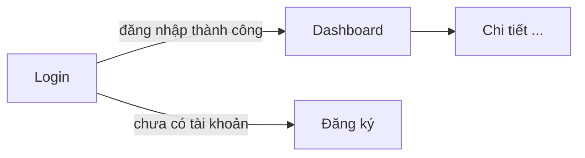

# TEMPLATE_THIẾT KẾ GIAO DIỆN & LUỒNG (UI/UX FLOW & SCREEN MAP)

_Dự án: [TÊN_DỰ_ÁN]_

> **Lệnh dành cho AI (UX/Product Designer):** Tài liệu này thiết kế Ở MỨC BẢN VẼ, KHÔNG sinh code. Mọi nhãn/đối tượng phải dùng đúng "Thuật ngữ Chuẩn" trong `02_Chuan-hoa-Tu-vung`. Mỗi màn hình phải gắn với Vai trò được phép truy cập (theo `01_Ban-ve-Kien-truc`).
>
> _Bỏ qua tài liệu này nếu dự án không có giao diện (API thuần / CLI)._

## 1. KIỂM KÊ MÀN HÌNH (SCREEN INVENTORY)

|**Mã**|**Tên màn hình**|**Mục đích**|**Vai trò được truy cập**|
|---|---|---|---|
|S-01|Đăng nhập (Login)|Xác thực người dùng|Guest|
|S-02|[Tên màn hình]|[Mục đích]|[Role]|
|...|...|...|...|

## 2. LUỒNG ĐIỀU HƯỚNG (NAVIGATION FLOW)

_(Mô tả đường đi giữa các màn hình cho từng luồng nghiệp vụ chính. Có thể dùng mermaid)_



- **Luồng A — [Tên]:** S-01 → S-03 → ...
- **Luồng B — [Tên]:** ...

## 3. TRẠNG THÁI MÀN HÌNH (SCREEN STATES)

_(Mỗi màn hình quan trọng cần định nghĩa các trạng thái để không bỏ sót khi code)_

- **[Màn hình S-0x]:**
    - _Loading:_ [VD: hiển thị skeleton]
    - _Empty:_ [VD: "Chưa có dữ liệu" + nút tạo mới]
    - _Error:_ [VD: banner lỗi + nút thử lại]
    - _Success/Default:_ [VD: danh sách bản ghi]

## 4. DESIGN SYSTEM CƠ BẢN

- **Bảng màu:** Primary `[#xxxxxx]`, Secondary `[#xxxxxx]`, Success/Warning/Error `[...]`, Nền/Chữ `[...]`
- **Typography:** Font `[VD: Inter]`; cỡ chữ heading/body `[...]`
- **Spacing & Layout:** [VD: hệ lưới 8px; container max-width 1200px]
- **Component tái sử dụng:** [Button (variants), Input, Select, Modal, Toast, Card, Table...] — đặt tên thống nhất với Glossary.

## 5. WIREFRAME (PHÁC THẢO BỐ CỤC)

_(Tùy chọn — mô tả bố cục dạng text/ASCII cho các màn hình chính)_

```
[Màn hình S-03 — Dashboard]
+--------------------------------------------------+
| Logo            Search            Avatar(menu)    |
+----------+---------------------------------------+
| Sidebar  |  Tiêu đề trang        [Nút Tạo mới]   |
| - Mục A  |  --------------------------------------|
| - Mục B  |  [Bảng dữ liệu / Danh sách thẻ]        |
+----------+---------------------------------------+
```
