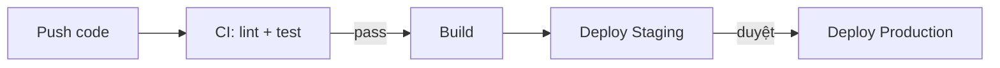

# TEMPLATE_TRIỂN KHAI & MÔI TRƯỜNG (DEPLOYMENT & ENVIRONMENTS)

_Dự án: [TÊN_DỰ_ÁN]_

> **Lệnh dành cho AI (Tech Lead/DevOps):** Dựa trên `05_Thiet-ke-Ky-thuat` (Tech Stack, biến môi trường), chốt cách dựng môi trường và triển khai. Phần "Scripts cài đặt môi trường" là **Human action** — Kỹ sư copy chạy trên máy thật.

## 1. CÁC MÔI TRƯỜNG (ENVIRONMENTS)

|**Môi trường**|**Mục đích**|**URL / Hạ tầng**|**Nguồn dữ liệu**|
|---|---|---|---|
|Development|Lập trình local|`localhost`|DB local / seed|
|Staging|Kiểm thử trước khi lên prod|[VD: staging.app.com]|Bản sao gần giống prod|
|Production|Người dùng thật|[VD: app.com]|DB thật|

## 2. QUẢN LÝ CẤU HÌNH & SECRETS

- **Biến môi trường:** Theo danh sách trong `05_Thiet-ke-Ky-thuat` (mục Environment Variables).
- **Nơi lưu secret:** [VD: GitHub Actions Secrets / Vault / .env trên server — KHÔNG commit `.env`]
- **File mẫu:** Cung cấp `.env.example` (không chứa giá trị thật) trong repo.

## 3. QUY TRÌNH CI/CD

_(Mô tả pipeline từ commit đến deploy. Có thể dùng mermaid)_



- **CI (mỗi PR):** [VD: chạy lint + unit/integration test]
- **CD:** [VD: merge vào `main` → tự deploy staging; tag release → deploy prod]
- **Rollback:** [VD: giữ N bản build trước; lệnh/quy trình rollback]

## 4. HOSTING & VẬN HÀNH

- **Hosting:** [VD: Vercel (frontend) + Railway/VPS (backend) + Postgres managed]
- **Domain & TLS:** [VD: cấu hình domain, chứng chỉ HTTPS]
- **Backup & Migration:** [VD: backup DB hằng ngày; chạy migration trước khi deploy]
- **Health-check / Monitoring:** [Theo mục Observability trong `05_Thiet-ke-Ky-thuat`]

## 5. SCRIPTS CÀI ĐẶT MÔI TRƯỜNG (HUMAN ACTION)

_(AI liệt kê các lệnh Bash để Kỹ sư copy paste chạy. Đây là bước tạo "xác nhà" rỗng theo cây thư mục trong file 05)_

```bash
# Backend: tạo thư mục, init project, cài thư viện
...
# Frontend: tạo thư mục, init project, cài thư viện
...
# Tạo file .env từ .env.example và điền giá trị
...
```
