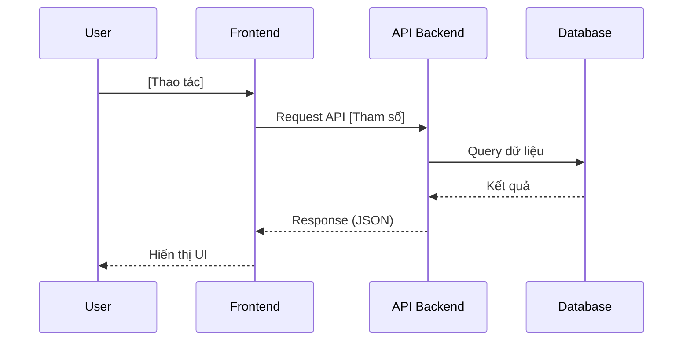

# TEMPLATE_ĐẶC TẢ KỸ THUẬT: MILESTONE [N] - [TÊN TÍNH NĂNG]

_Tài liệu này dùng để giới hạn Context Window. AI chỉ được phép đọc, suy luận và sinh code cho ĐÚNG các file được đề cập trong đây._

## 1. QUY TẮC NGHIÊM NGẶT (STRICT CONSTRAINTS)

- **Thư viện cho phép:** [Ví dụ: Chỉ dùng `window.crypto`, không dùng thư viện ngoài]
- **Design Pattern / Coding Style:** [Ví dụ: Dùng ES6 Modules, try/catch block đầy đủ, comment rõ bằng tiếng Việt]

## 2. DATABASE & MODELS (Nếu có)

- **File:** `[Đường_dẫn_file_1]`
- **Schema Fields:**
    - `[Tên trường 1]`: [Kiểu dữ liệu], [Ràng buộc - VD: required, unique]
    - `[Tên trường 2]`: [Kiểu dữ liệu]
- **Logic cụ thể:** [Ví dụ: Tạo index ở trường X, hook pre-save làm gì?]

## 3. SƠ ĐỒ LUỒNG LOGIC (SEQUENCE DIAGRAM - MERMAID)

_(AI BẮT BUỘC phải sinh mã Mermaid ở đây để xác định chính xác luồng giao tiếp giữa Frontend, API và Database trước khi code)_

## 4. BACKEND LOGIC / API (Nếu có)

- **File:** `[Đường_dẫn_file_2]`
- **Hàm/API 1:** `[POST] /api/v1/...`
    - _Input params/body:_ `{ ... }`
    - _Luồng xử lý (Step-by-step):_ 1. Validate input... 2. Query database... 3. Trả về response...
    - _Output/Response:_ `{ ... }`

## 5. FRONTEND UI & LOGIC (Nếu có)

- **File:** `[Đường_dẫn_file_3]`
- **State/Props cần quản lý:** [Ví dụ: `isLoading`, `dataList`]
- **Luồng xử lý UI:** [Ví dụ: User bấm nút -> Set loading = true -> Gọi hàm X -> Render list]
- **Yêu cầu UI/CSS:** [Ví dụ: Sử dụng Tailwind `flex`, `justify-between`, `hover:bg-gray-100`]

## 6. XỬ LÝ LỖI & NGOẠI LỆ (ERROR HANDLING & EDGE CASES)

_(Liệt kê các trường hợp rủi ro AI cần viết code bắt lỗi)_

- **Edge Case 1:** [VD: Bị mất kết nối mạng giữa chừng -> Hiện popup báo lỗi]
- **Edge Case 2:** [VD: Dữ liệu API trả về rỗng -> Hiển thị Empty State component]

## 7. MA TRẬN TEST CASES & TIÊU CHÍ NGHIỆM THU (TEST SPECIFICATION)

_(Hợp đồng nghiệm thu bắt buộc. Chia làm 2 phân khu rạch ròi: Kiểm thử tự động bằng code trong tests/ và Nghiệm thu thị giác trực tiếp dành cho User. Trạng thái ban đầu bắt buộc là `- [ ]`)_

### 7.1. Bảng Kịch Bản Kiểm Thử Tự Động (Automated Test Suite trong `Test_Dir`)
_(Bắt buộc cho mọi logic, thuật toán, dữ liệu, API. Đường dẫn và lệnh chạy lấy từ khối `[VERIFY_COMMANDS]` trong `.agents/AGENTS.md` — KHÔNG hard-code tên lệnh/đuôi file ở đây.)_

| ID | Tên Kịch Bản | File Test Dự Kiến | Tiền điều kiện (Given) | Thao tác kích hoạt (When) | Kết quả kỳ vọng (Then) | Phân loại |
|---|---|---|---|---|---|---|
| **TC_UT01** | [Tên Unit Test 1] | `[Test_Dir]/[name]` | [Mock data / Fixture ban đầu] | [Gọi hàm tính toán / xử lý] | [Giá trị trả về, tọa độ, không trùng lặp] | Happy Path |
| **TC_UT02** | [Tên Unit Test 2] | `[Test_Dir]/[name]` | [Dữ liệu biên / ngoại lệ] | [Gọi hàm với input rỗng/sai lệch] | [Xử lý graceful, trả về fallback an toàn] | Edge Case |
| **TC_INT01**| [Tên Integration Test] | `[Test_Dir]/[name]` | [Dữ liệu DB mock / Session] | [Gọi API endpoint qua HTTP request] | [HTTP status 200, DTO payload chuẩn] | API Contract |

### 7.2. Danh Sách Tiêu Chí Nghiệm Thu Thị Giác (Human Visual UAT Matrix)
_(Dành riêng cho User tự kiểm tra trực tiếp trên trình duyệt - AI tuyệt đối cấm dùng browser_subagent thay thế)_

- [ ] **UAT_01:** [Mô tả kịch bản kiểm tra giao diện, màu sắc, bố cục, khoảng cách]
- [ ] **UAT_02:** [Mô tả kịch bản tương tác người dùng: Pan, Zoom, click thẻ, mở Modal]
- [ ] **UAT_03:** [Mô tả kịch bản hiển thị trên các kích thước màn hình responsive]
- [ ] **UAT_04 (Console sạch):** Mở Developer Console → 0 lỗi đỏ, 0 cảnh báo Hydration. *(Tiêu chí này thuộc về User vì cần mở trình duyệt thật — AI không có quyền tự kiểm.)*

---

## 8. BẢO VỆ CHỐNG THOÁI LUI (REGRESSION GUARD CHECKLIST)

_(Danh sách các tính năng lân cận trong Blast Radius bắt buộc phải verify lại sau khi code xong)_

_(Chỉ liệt kê những gì AI tự kiểm chứng được bằng terminal. Mọi tiêu chí cần mở trình duyệt phải nằm ở Mục 7.2 — Human UAT.)_

- [ ] **RG01 (Build & Typecheck Clean):** Chạy lệnh `Typecheck` & `Build` của `[VERIFY_COMMANDS]` — 0 lỗi.
- [ ] **RG02 (Automated Test Regression):** Chạy lệnh `Test` — 0 failure mới so với `Known_Failing_Baseline`.
- [ ] **RG03 (Blast Radius):** [Liệt kê các module/tính năng lân cận bị ảnh hưởng và test tự động phủ chúng]

---

## 9. LỆNH THI CÔNG (Dành cho AI /feature-code)

> "AI ơi, hãy đọc kỹ đặc tả `[Tên_tài_liệu]` này. Dựa CHÍNH XÁC vào các mô tả ranh giới ở trên, hãy thi công toàn bộ mã nguồn hoàn chỉnh kèm file test trong `Test_Dir`. Thực thi Vòng Lặp Kiểm Chứng Bằng Code Thật bằng đúng các lệnh khai báo tại `[VERIFY_COMMANDS]` (Typecheck/Build → Automated Test Suite → Human UAT), và chỉ được tick `[x]` cho Mục 7.1 khi terminal log cho thấy test phủ AC đó đã pass và không có failure mới so với baseline."