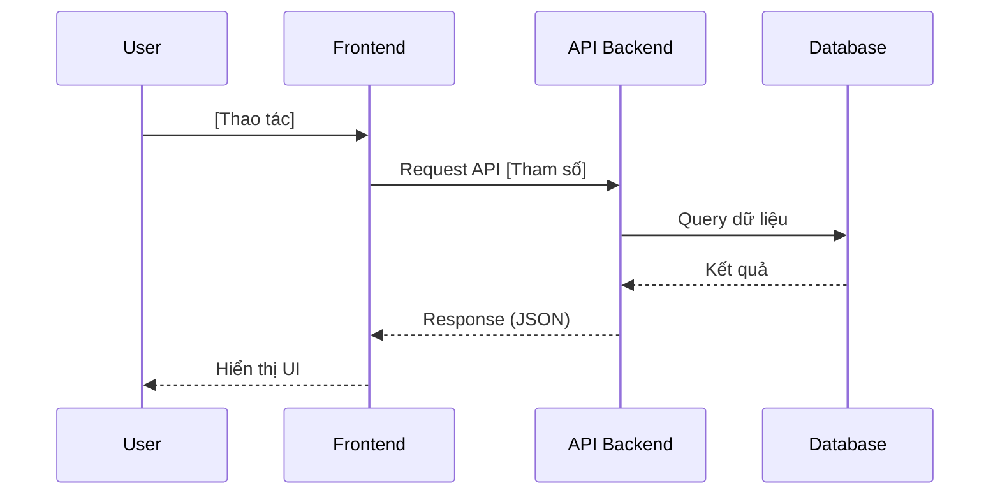

# TEMPLATE_ĐẶC TẢ KỸ THUẬT: MILESTONE [N] - [TÊN TÍNH NĂNG]

_Tài liệu này dùng để giới hạn Context Window. AI chỉ được phép đọc, suy luận và sinh code cho ĐÚNG các file được đề cập trong đây._

## 1. QUY TẮC NGHIÊM NGẶT (STRICT CONSTRAINTS)

- **Thư viện cho phép:** [Ví dụ: Chỉ dùng `window.crypto`, không dùng thư viện ngoài]
- **Design Pattern / Coding Style:** [Ví dụ: Dùng ES6 Modules, try/catch block đầy đủ, comment rõ bằng tiếng Việt]

## 2. DATABASE & MODELS (Nếu có)

- **File:** `[Đường_dẫn_file_1]`
- **Schema Fields:**
    - `[Tên trường 1]`: [Kiểu dữ liệu], [Ràng buộc - VD: required, unique]
    - `[Tên trường 2]`: [Kiểu dữ liệu]
- **Logic cụ thể:** [Ví dụ: Tạo index ở trường X, hook pre-save làm gì?]

## 3. SƠ ĐỒ LUỒNG LOGIC (SEQUENCE DIAGRAM - MERMAID)

_(AI BẮT BUỘC phải sinh mã Mermaid ở đây để xác định chính xác luồng giao tiếp giữa Frontend, API và Database trước khi code)_

## 4. BACKEND LOGIC / API (Nếu có)

- **File:** `[Đường_dẫn_file_2]`
- **Hàm/API 1:** `[POST] /api/v1/...`
    - _Input params/body:_ `{ ... }`
    - _Luồng xử lý (Step-by-step):_ 1. Validate input... 2. Query database... 3. Trả về response...
    - _Output/Response:_ `{ ... }`

## 5. FRONTEND UI & LOGIC (Nếu có)

- **File:** `[Đường_dẫn_file_3]`
- **State/Props cần quản lý:** [Ví dụ: `isLoading`, `dataList`]
- **Luồng xử lý UI:** [Ví dụ: User bấm nút -> Set loading = true -> Gọi hàm X -> Render list]
- **Yêu cầu UI/CSS:** [Ví dụ: Sử dụng Tailwind `flex`, `justify-between`, `hover:bg-gray-100`]

## 6. XỬ LÝ LỖI & NGOẠI LỆ (ERROR HANDLING & EDGE CASES)

_(Liệt kê các trường hợp rủi ro AI cần viết code bắt lỗi)_

- **Edge Case 1:** [VD: Bị mất kết nối mạng giữa chừng -> Hiện popup báo lỗi]
- **Edge Case 2:** [VD: Dữ liệu API trả về rỗng -> Hiển thị Empty State component]

## 7. MA TRẬN TEST CASES & TIÊU CHÍ NGHIỆM THU (TEST SPECIFICATION)

_(Hợp đồng nghiệm thu bắt buộc. Mỗi tiêu chí phải có cấu trúc Given - When - Then đo đếm được. Trạng thái ban đầu bắt buộc là `- [ ]`)_

### 7.1. Bảng Kịch Bản Kiểm Thử Chi Tiết
| ID | Tên Kịch Bản | Loại Test | Tiền điều kiện (Given) | Thao tác kích hoạt (When) | Kết quả kỳ vọng (Then) | Phân loại |
|---|---|---|---|---|---|---|
| **TC01** | [Tên kịch bản 1] | [Unit / E2E] | [Trạng thái ban đầu] | [Thao tác User / Trigger API] | [Kết quả DOM, DB, Console 0 lỗi] | Happy Path |
| **TC02** | [Tên kịch bản 2] | [Unit / E2E] | [Trạng thái có dữ liệu cũ] | [Thao tác đè / giao thoa] | [Dữ liệu merge, UI hiển thị đúng] | Edge Case |

### 7.2. Danh Sách Tiêu Chí Nghiệm Thu (Acceptance Criteria)
- [ ] **AC1:** [Mô tả tiêu chí nghiệm thu 1]
- [ ] **AC2:** [Mô tả tiêu chí nghiệm thu 2]

---

## 8. BẢO VỆ CHỐNG THOÁI LUI (REGRESSION GUARD CHECKLIST)

_(Danh sách các tính năng lân cận trong Blast Radius bắt buộc phải verify lại sau khi code xong)_

- [ ] **RG01 (TOC Navigation):** Click thử vào các đề mục trên Mục lục -> Đảm bảo Heading ID và cuộn trang hoạt động bình thường.
- [ ] **RG02 (Wikilink / Internal Navigation):** Click thử vào các liên kết nội bộ -> Đảm bảo chuyển trang trơn tru.
- [ ] **RG03 (DOM Hydration & Console Clean):** Mở Developer Console -> Đảm bảo 0 lỗi đỏ, 0 cảnh báo Hydration (`div` inside `p`).

---

## 9. LỆNH THI CÔNG (Dành cho AI /feature-code)

> "AI ơi, hãy đọc kỹ đặc tả `[Tên_tài_liệu]` này. Dựa CHÍNH XÁC vào các mô tả ranh giới ở trên, hãy sinh toàn bộ mã nguồn hoàn chỉnh cho file `[Đường_dẫn_file]`. Thực thi Vòng lặp Kiểm thử 3 Tầng (Build, Unit/Browser Test, Regression Check) và chỉ được tick `[x]` khi có bằng chứng test Pass."